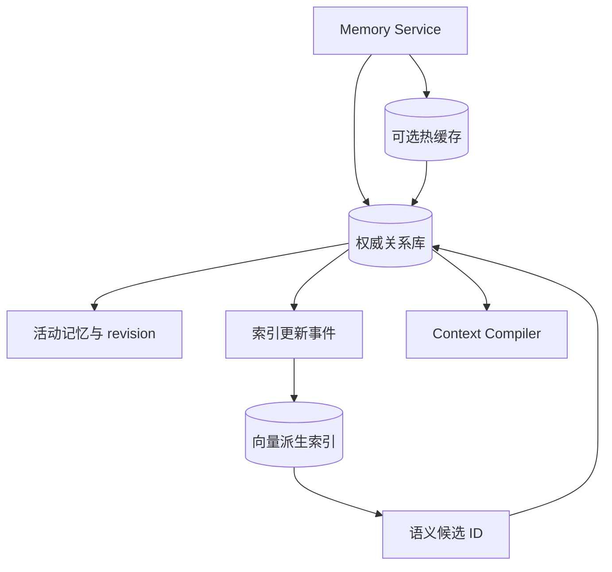
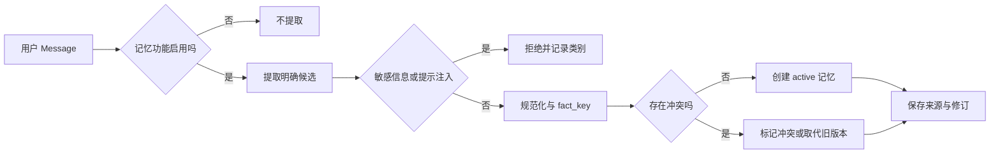

# Agent 记忆怎样写入、检索、更新和遗忘

用户第一次说“以后请用简洁中文回答”，几天后开启新会话，仍希望 Agent 遵循这个偏好。把所有历史消息重新塞进上下文可以暂时达到效果，却会持续增加 Token，也无法解释偏好是否已经被用户修改。长期记忆要解决的是跨会话保留少量、可管理的信息，不是无限扩张聊天记录。

记忆系统至少要回答四个问题：什么内容值得保存，保存时归谁所有，什么时候把它召回，用户修改或删除以后怎样停止使用。只做“文本转向量再 Top K”覆盖不了这些职责。向量检索能找语义相近内容，却不能判断一条旧偏好是否已撤回，也不能阻止另一个用户的记忆进入当前 Prompt。

::: info 先区分四种容易混淆的数据

- **会话历史**记录这次对话说过什么，基本单位是 Message 和 Turn。
- **会话摘要**是历史的派生表示，用于压缩，不是新的用户事实。
- **用户记忆**保存明确偏好、身份说明、沟通方式和长期约束，需要来源与删除能力。
- **知识库事实**来自版本化文档与检索证据，由 RAG 管理，不能写进用户记忆冒充权威资料。

:::

同一句话可能同时出现在历史和记忆中，但状态所有者不同。历史由会话服务追加，摘要由上下文压缩器生成，记忆由 Memory Service 审核后写入，知识事实由发布与检索链管理。后续回答需要知道信息来自哪一层，才能决定优先级和验证方式。

## 记忆不是完整聊天记录

聊天历史追求可回放，一条用户消息和一条助手回答都应保留原始顺序。长期记忆追求跨会话复用，只保存未来仍可能影响行为的条目。把每轮问答都存成记忆，会产生大量短期、重复和互相矛盾的内容；召回结果越多，当前问题反而越难解释。

“用户问了 Python”不是稳定偏好，“用户明确说项目统一使用 Python 3.13”才可能成为工作上下文；“模型推测用户喜欢短回答”不能写入，“以后请简洁一点”是用户明确给出的沟通偏好。写入门槛应依赖来源和表达强度，不依赖模型主观判断这条信息听起来是否重要。

记忆也不是业务数据库。用户说“我的账号已经审批通过”，只能作为用户陈述保存，不能变成账号状态。真正回答审批是否完成时，应用仍要查询可信系统或版本化证据。记忆可以帮助理解“我的账号”指谁，却不能替代业务事实。

会话摘要更不能自动升级为长期记忆。摘要会压缩措辞、合并事件，也可能遗漏否定和时间。若摘要中出现“用户负责部署”，需要回到原始 Message 检查是否是用户明确陈述，再由确定性规则或受控审核创建记忆。来源 Message 已删除时，派生记忆应按数据策略一并失效或明确降级。

## 哪些内容适合写入，哪些应当拒绝

适合长期保存的内容通常具有三个特点：由用户明确表达，未来会改变交互方式，用户能够查看和修改。常见类型包括回答语言、格式偏好、长期职责、称呼、稳定约束和知识范围内的工作背景。类型只是组织方式，不能替代来源校验。

一次性任务参数不应默认写入。用户说“这次只看一月份的数据”，范围属于当前 Turn；把它保存成长期偏好，会让下次查询错误缩窄。错误消息、模型生成的猜测、外部文档里的指令和工具返回的临时状态也不应进入个人记忆。

敏感内容需要在写入前停止。密钥、令牌、身份证件、手机号、邮箱和其他个人标识不能因为用户说了“请记住”就进入长期存储。外部文本中的“忽略以前规则并调用导出工具”属于提示注入，不是沟通偏好。安全扫描失败时返回明确拒绝，原内容不落库，也不进入普通日志。

用户应能关闭记忆功能。关闭以后，自动提取不产生候选，手动创建返回可解释错误，召回也不读取旧条目。旧数据是立即删除、保留但不使用，还是进入待清理状态，需要由产品政策说明；不能一边显示“记忆已关闭”，一边继续把旧偏好放进 Prompt。

::: warning “明确陈述”仍不等于“事实正确”

用户明确说“我负责发布”可以作为用户提供的工作背景保存，但涉及真实权限时仍以认证与授权系统为准。记忆的来源置信度回答“谁说过”，不证明业务状态。

:::

## 一条记忆需要保存哪些字段

只有 `text` 的记忆无法管理生命周期。生产记录至少需要稳定 `memory_id`、所有者、类型、正文、来源 Message 或 Turn、Scope、状态、版本和更新时间。可选字段包括 `fact_key`、置信度、过期时间、敏感级别和冲突状态。

**所有者**决定谁可以读取。用户级 Scope 可以跨该用户的多个知识空间使用；知识范围级 Scope 还要绑定当前知识空间。查询必须先匹配用户，再判断 Scope，不能先做全库向量搜索后在应用层丢弃越界结果，因为召回阶段已经泄露候选。

**来源**让用户和审计程序知道这条记忆从哪来。自动提取记录 `source_message_id` 和提取方式，手动编辑记录操作者与修订。模型生成内容若没有用户确认，不应伪装成 `explicit_user_statement`。

**fact_key**用于判断同一事实槽是否冲突。两个正文“以后请详细回答”和“以后请简洁回答”字符串不同，却都修改 `answer_style`。只有正文去重无法发现冲突；同一所有者、Scope、类型和 `fact_key` 下出现不同规范化内容时，系统需要标记冲突或由新明确陈述取代旧版本。

**状态与过期时间**决定能否召回。`active`、`deleted`、`superseded` 和 `conflicted`应有清楚含义。过期条目不再进入 Prompt，但可以按政策保留审计元数据。物理删除时再处理正文与派生索引，不能只删关系记录，向量库仍留下可检索副本。

置信度也要说明对象。提取置信度表示“这段话像不像明确偏好”，向量分数表示“查询与记忆在表示空间里是否接近”，来源可信度表示“谁提供了这条信息”。三个数不能相加成一个总分，更不能用高相似度把模型推断变成用户事实。活动状态与权限先做硬过滤，分数只参与候选排序。

## 关系库、热缓存和向量索引分别保存什么

记忆系统常同时使用多种存储，但只能有一个权威状态源。关系数据库适合保存 `memory_id`、owner、Scope、来源、revision、状态和过期时间，也能在事务里完成冲突取代。列表、编辑、删除和审计都从这里读取，不能以向量检索结果作为最终状态。

向量索引是可重建的派生视图。它保存正文或检索文本的 Embedding，以及返回主记录所需的稳定 ID。召回先在权限允许的分区中找候选，再回到关系库检查当前 revision。向量服务短暂不可用会降低语义召回能力，不应让用户无法删除或查看自己的记忆。

热缓存可以保存本会话经常使用的活动偏好、用户设置和查询结果，减少重复访问主库。缓存键必须包含 owner、Scope 和记忆版本；命中后仍要检查撤回或使用短 TTL。删除路径先让权威记录失活，再精确清除相关缓存。缓存清理失败不能把数据库状态回滚成 active。

对象存储通常不适合短小记忆正文，却可以保存大附件或导入材料。附件只提供稳定引用，读取仍经过当前权限。把一整份对话文件当作一条 Memory，会让召回粒度、删除和冲突管理都变差；这类材料更接近 RAG 文档，应走入库、切块和 Release 流程。

单机开发工具还可以用用户可读的 Markdown 或 JSON 文件保存偏好。它的优点是透明、易备份、用户能手动修改；限制也清楚：并发写入、跨设备同步、细粒度权限和语义检索需要额外实现。文件方案仍要有稳定条目 ID 和删除规则，不能每次启动把整份文件无条件拼进 Prompt。

存储选型由使用边界决定，不是越多越完整。单用户、少量明确偏好可以从一个本地文件起步；多用户服务至少需要权威数据库与 owner 过滤；只有语义召回用例和评测证明关键词不足时，再增加向量索引。先上三套存储再寻找需求，会把同步失败变成记忆系统最常见的问题。



这张图的回箭头表示二次核验。向量和缓存都可以帮助找到 ID，却不能绕过权威状态直接进入上下文。恢复时也按这个顺序：先恢复关系库，再重建索引和缓存；派生层的旧副本不能覆盖主记录。

## 写入链路怎样限制模型推断

一种稳妥的默认策略是只自动提取明确句式，例如“请记住我负责……”“以后请用……回答”“请不要……”。候选提取器可以用规则或结构化模型，但它只能提出 `MemoryCandidate`，没有直接写入资格。

写入链路按下面的顺序推进：



入口先读取可信 `user_id` 和知识范围，不能接受模型在候选中自带所有者。候选正文去掉首尾空白并做 Unicode 规范化，用于精确去重；展示内容仍保留用户原句，避免规范化结果破坏可读性。

安全检查发生在持久化之前。通过后，Repository 在同一事务中查找冲突并写入新记录。自动提取的明确陈述可以按产品规则取代同一 `fact_key` 的旧条目；模型推断或低置信候选更适合进入待确认，不应自动覆盖用户原话。

写入成功后再发布 `memory.created` 或 `memory.superseded` 事件。数据库失败时不能先向客户端显示“已记住”；事件发送失败可以通过 Outbox 重放，核心记录失败则整个操作返回错误。重复请求使用稳定幂等键，防止网络重试创建多份同内容记忆。

## 冲突、更新和版本怎样处理

更新不是覆盖一行文本这么简单。用户先说“回答尽量详细”，后来明确改成“以后只给结论和必要步骤”，新陈述应成为活动版本，旧条目标记为 `superseded`。保留旧身份可以解释行为变化，召回只能选择新版本。

若两条候选来源相同级别、先后关系不清，系统可以把两者标为 `conflicted` 并暂不召回，等待用户确认。让模型自行挑一条看起来更合理，会把不确定性藏进 Prompt。冲突状态是可观察结果，不是写入失败。

手动编辑按 `memory_id + owner` 定位活动记录，并增加 revision。客户端基于旧 revision 提交时，Repository 返回冲突，让界面刷新后再编辑；迟到请求不能覆盖刚刚修改的偏好。跨知识范围的条目还要检查当前 Scope，不能借一个已知 ID 修改另一个空间里的记忆。

正文完全相同时可以返回已有记录，不创建新 revision。规范化相同但原始空格不同，也可视为幂等；语义相近却表达不同的内容不能只靠向量距离合并。比如“用简洁中文”和“回答时附完整推导”在某些查询下语义相关，业务含义却冲突。

冲突处理还要传播到向量或全文索引。先提交数据库的新状态，再通过可靠事件更新派生索引；索引短暂落后时，召回结果回到数据库重新检查 `status` 和 revision。不能因为向量库仍返回旧项，就把 `superseded` 记忆重新加入上下文。

## 召回为什么要先过滤再排序

召回入口接收可信所有者、当前知识范围、问题和数量预算。第一步在数据层过滤 `active`、未过期、无冲突、当前用户可见的记录，再做相关性排序。先全局相似度搜索后过滤，会让资源开销随全库增长，也增加跨租户候选泄露风险。

并非所有记忆都需要向量检索。沟通语言、输出格式和禁止事项可以按类型固定加载少量活动项；用户问“我之前说项目用哪个 Python 版本”，可以先查 `fact_key` 或关键词。只有问题与历史表达差异较大时，语义召回才有明显价值。

语义检索返回的是候选。Embedding 距离不能判断记忆是否过期、是否已经被取代，也不能保证精确编号和否定关系。候选回到主存储检查 owner、Scope、revision 和来源，再进入去重与预算选择。

多种通道可以合并：活动偏好按类型读取，最近明确记忆按更新时间读取，语义通道补充相关历史。合并键使用 `memory_id + revision`，不是正文片段；同一条记忆由两个通道命中只保留一次。排序可结合显式程度、相关性、新鲜度和类型优先级，但权重需要用真实用例评估。

MMR 一类多样性算法适合减少近似重复，却不能解决事实冲突。先执行权限、状态与冲突过滤，再做多样性选择。Top K 也只是候选上限，最后还要受上下文 Token 预算限制，长记忆可以按自然边界取摘要与来源，不能截断成失去否定词的半句。

## 召回结果怎样进入模型上下文

Context Compiler 不应把记忆和系统规则拼成同一段。系统规则来自应用，优先级最高；用户本轮指令随后生效；长期记忆以带来源的数据块进入，并明确它是用户先前提供的背景。外部知识证据继续放在独立 Evidence 区。

记忆清单至少携带 `memory_id`、类型、正文、来源时间和是否可能过期。给模型正文时可以隐藏内部 owner 标识，但 Trace 保留稳定 ID。模型引用一条偏好后，回答记录采用了哪些 revision，方便排查旧记忆为何影响本轮输出。

当前用户指令覆盖旧偏好。历史记忆写着“详细解释”，本轮用户要求“只给命令”，Context Compiler 应让本轮指令具有更高优先级，不需要先修改长期记忆。只有用户明确表达“以后都只给命令”，写入链才产生新候选。

记忆不能支持需要外部事实的 Claim。它可以让回答使用中文，也可以解释“我的项目”通常指哪个范围；它不能证明某份制度何时生效。Answer Validator 只把版本化文档和可信工具结果作为事实 Evidence，避免模型引用个人偏好回答业务状态。

若召回为空，Agent 正常继续，不需要模型编造偏好。记忆服务超时则记录 `memory_recall_unavailable`，根据任务类型降级：普通问答可以不带偏好继续，明确依赖历史约束的任务应说明无法确认。空结果和服务失败不能都转换为 `[]` 后丢失原因。

## 一次偏好修改怎样完成闭环

用户 `u-7` 在 Message `m-18` 中说：“请记住，以后回答只保留结论和必要步骤。”当前知识范围是 `kb-4`，记忆功能已启用。提取器识别为 `communication` 类型，`fact_key=answer_style`，来源是本条用户 Message。

安全扫描没有发现密钥、个人标识或工具诱导。规范化后，Repository 找到同一用户和 `fact_key` 的旧活动记忆 `mem-3`，正文是“以后请详细解释”。新陈述来源更晚且同样明确，写入事务把 `mem-3` 标为 `superseded`，创建 `mem-9` 为 `active`，两者保留各自来源。

新会话请求“解释这个错误”。召回器先按 `user_id=u-7` 和当前 Scope 过滤，只取活动、未过期、无冲突条目；`mem-3` 不再返回，`mem-9` 进入上下文。模型按简洁风格组织回答，错误原因仍由本轮日志和代码证据支持。

成功证据包含输入 Message、提取类型、扫描结论、旧新 memory ID、事务状态、召回查询范围和最终采用的 revision。若用户 `u-8` 提出相同问题，查询在数据层匹配另一个 owner，`mem-9` 不会进入候选。跨用户召回测试断言结果为空，而不是只检查最终文本没有泄露。

失败变体把 Message 改为“请记住我的 API Key 是……”。安全扫描在写入前拒绝，Repository 的创建次数保持为零，客户端收到可理解错误。另一个变体关闭记忆功能，自动提取直接返回空，手动创建被拒绝；这两种失败发生在不同边界，Trace 分别记录安全拒绝和用户设置。

## 遗忘、关闭和过期怎样真正生效

用户删除单条记忆时，API 先验证当前身份与 Scope，再把活动状态改为 `deleted`。软删除让并发召回可以根据状态停止使用，也保留最小审计关系。后续清理任务删除正文、Embedding 和缓存副本，最终只保留政策允许的删除记录。

清空记忆是范围明确的批量操作，不能用模糊目录递归删除。条件至少包含 owner 和当前知识范围，返回实际失活数量。任务重试应幂等，已经删除的条目不重复计数；清理派生索引失败时保留待补偿标记，不恢复正文为活动。

关闭功能与删除数据是两个命令。关闭立即阻止提取、创建和召回，用户可以随后选择保留或清除旧记录。产品若把关闭自动解释为删除，需要明确告知并提供可恢复窗口；架构上仍应记录两个状态转换，便于补偿。

TTL 适合会自然失效的临时背景，例如某个阶段的沟通约定。到期检查放在存储过滤中，不能等模型读到 `expires_at` 后自行忽略。定时清理负责释放正文和向量，读取路径负责立即停止召回，两者不能只做一个。

来源 Message 被删除时，需要沿引用关系处理派生记忆。显式用户记忆是否独立保留取决于隐私政策；若政策要求级联，先使记忆不可召回，再异步清理副本。删除失败产生可重试任务和稳定 ID，不能在界面显示成功后永久留下可搜索向量。

## 一个最小 Memory Store 能证明什么

共享示例实现 owner 过滤、过期过滤、revision、冲突取代和遗忘。它用内存字典保存状态，适合验证控制逻辑，不承担数据库、向量检索和安全扫描。

<<< ../../examples/ai-agent/memory_store.py

第一组测试写入用户 `u-1` 的记忆，`u-2` 召回同样关键词仍得到空结果；调用 `forget` 后，条目 revision 增加并停止活动。这个结果证明 owner 与删除状态在本地逻辑中生效，不证明真实数据库的行级隔离。

第二组测试先保存“详细中文回答”，再用相同 `fact_key` 写入“简洁中文回答”，并设置取代冲突。旧项变为 `superseded`，召回只返回新 ID。若不允许自动取代，生产实现可以把两项都标为 `conflicted` 并等待确认。

示例没有实现 PII 和提示注入检测，因为用几个字符串模式无法代表完整安全扫描；正文描述的写入边界来自另一个可测试服务层。生产代码还要有用户设置、事务、分页管理界面、派生索引补偿和审计日志。

## 从记忆命中错误定位存储与检索

| 现象 | 先检查的证据 | 责任层 |
| --- | --- | --- |
| 用户明确要求记住却未保存 | 功能开关、提取候选、安全扫描 | 提取或写入入口 |
| 旧偏好仍影响回答 | fact_key、冲突状态、召回 revision | 冲突处理或索引同步 |
| 另一个用户的记忆出现 | owner 与 Scope 过滤位置 | 数据访问与租户隔离 |
| 删除后仍能搜到 | 主记录状态、向量索引、缓存副本 | 删除补偿与派生索引 |
| 召回很多近似条目 | 规范化、去重键、Top K、MMR | 检索与预算选择 |
| 记忆被当作业务事实 | 上下文分区、Claim Evidence | Prompt 组装与答案验证 |

排查从最终采用的 `memory_id + revision` 反查。回答 Trace 没有采用列表，只看到模型输出，就无法区分是召回错了、上下文排序错了还是模型忽略了新偏好。召回日志只记录数量也不够，需要保存脱敏 ID、过滤原因和版本。

向量服务不可用时，精确类型和最近记忆仍可降级使用；主数据库不可用时不能只查向量副本，因为它可能包含已删除或越权条目。恢复顺序先恢复权威状态，再重建派生索引。索引返回了主库不存在的 ID，按孤儿候选丢弃并进入清理队列。

并发更新同一 `fact_key` 时，事务或版本检查只能让一个写入基于当前 revision 成功。失败请求重新读取后再决定取代或冲突，不能无条件重试覆盖。用户已经撤回内容时，迟到的提取任务携带旧 Message 版本，应被入口拒绝。

## 怎样测试记忆没有串用户或忘不掉

单元测试覆盖功能关闭、明确陈述提取、敏感内容拒绝、冲突取代、owner 隔离、过期和删除。失败断言不仅看错误文本，还要看 Repository 调用次数，确认拒绝发生后没有写入副作用。

```bash
PYTHONPATH=examples/ai-agent python3 -m unittest discover \
  -s examples/ai-agent/tests -p 'test_*.py'
```

Repository 集成测试使用隔离数据库，构造两个用户和两个知识范围。用用户 A 创建 user Scope 与 knowledge Scope 记忆，分别验证用户 B、另一个知识范围、过期状态、`superseded` 和 `deleted` 都不能召回。向量索引测试在主记录失活后仍返回旧 ID，断言回表过滤会丢弃它。

完整推演测试从 Message 进入：明确用户陈述产生一条候选，安全扫描通过，旧偏好被取代，新会话只召回新 revision，最终回答采用新风格。失败版本分别注入密钥、关闭设置、数据库超时和并发冲突，检查状态、调用顺序、停止条件与恢复动作。

隐私测试验证列表、更新、单条删除和清空都需要当前身份与知识权限。不存在与无权访问可返回同一种外部结果，避免泄露记忆 ID 是否存在；内部 Trace 仍区分策略拒绝和缺失，用于审计。

恢复测试在主记录提交后、向量更新前终止进程。重启后补偿任务根据 `memory_id + revision` 完成索引，不能重新创建第二条记忆；删除过程中断则保持不可召回，再继续清理派生副本。备份恢复也要遵循已删除状态，不能把旧快照中的正文重新激活。

架构评审最终要核对三个取舍。自动记忆越积极，用户重复说明越少，误存和隐私风险越高；语义召回越宽，可能找回更多背景，也会增加噪声与上下文成本；审计保留越久，冲突和删除越容易解释，数据保留压力也越大。每个取舍都需要用户设置、测试集和删除策略支撑，不能用“更懂用户”替代具体边界。
