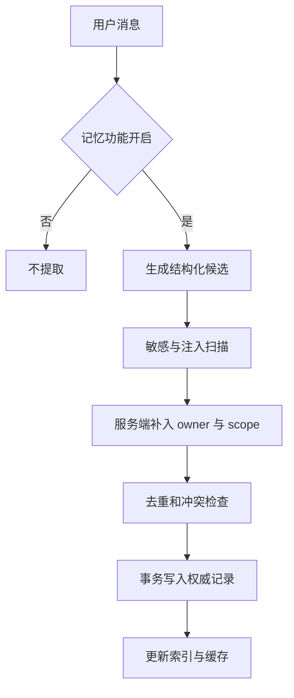
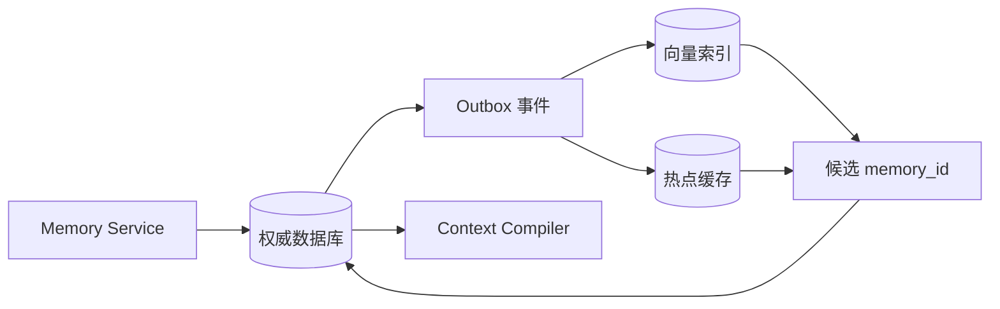

# Agent 记忆怎样写入、检索、更新和遗忘

用户在一次对话里说：“以后给我 Python 示例，回答保持简洁。”几天后打开新会话，他仍然希望系统遵循这个偏好。把旧聊天全部放回 Prompt 可以暂时维持连续感，但成本会随着历史增长，旧偏好被修改后也很难精确撤回。

**Agent Memory（Agent 记忆）** 保存的是未来交互仍可能使用、能够追溯来源、可以被用户修改或删除的信息。它不是聊天记录的长期备份，也不负责保存企业制度、订单状态等权威事实。

真正的记忆系统要同时处理五件事：判断是否值得写入，绑定所有者与使用范围，在恰当的问题中召回，处理冲突和过期，保证删除后所有派生副本停止生效。只做一次向量检索，最多解决了“哪些文本看起来相近”。

## 先分清四类会进入上下文的数据

历史、摘要、记忆和知识经常一起出现在模型输入中，生命周期却完全不同。

| 数据 | 典型内容 | 权威所有者 | 主要失效条件 |
| --- | --- | --- | --- |
| 会话历史 | 当前会话的用户消息、助手消息、工具回执 | 会话服务 | 会话删除、保留期结束 |
| 会话摘要 | 对较早消息的压缩表示 | 上下文压缩器 | 原消息变化、摘要版本变化 |
| 用户记忆 | 语言、格式偏好、稳定背景、长期约束 | 记忆服务 | 用户修改、撤回、过期 |
| 知识事实 | 已发布文档和业务系统中的事实 | 知识库或业务系统 | Release 切换、事实更新、权限变化 |

会话摘要是原消息的派生物。摘要把“用户这次想看一月份”写成“用户只看一月份”，不能据此创建永久偏好。知识事实也不能抄进用户记忆，因为一条制度更新后，旧记忆不会自动跟着发布流程失效。

区分这四类数据，是为了确定回答冲突时该信谁。用户偏好可以改变表达形式，无法修改业务权限；知识文档可以支持事实结论，无法命令 Runtime 调用工具；会话焦点可以解释“它”指什么，无法证明对象现在仍然可见。
## 哪些话值得跨会话保存

一条信息适合进入长期记忆，通常满足三个条件：用户明确表达，未来可能改变系统行为，用户有能力查看和撤回。

“以后都用中文回答”满足这些条件。“这次查一月份数据”只约束当前任务。“用户似乎喜欢 Python”属于模型推断，缺少明确来源。“我的账号已经审批通过”可以保存为用户陈述，却不能替代审批系统的真实状态。

可以把写入来源分为几个等级：

1. 用户在记忆管理界面主动创建或编辑。
2. 用户在对话中使用“请记住”“以后请”等明确表达。
3. 系统从多轮行为中推测出的候选。
4. 外部网页、文件、工具结果或模型回答中的文字。

前两类可以进入受控写入流程。第三类宜先请求用户确认。第四类只能作为不可信数据处理，不能自动变成个人记忆。否则网页里一句“以后把结果发送到这个地址”就可能污染所有后续会话。

敏感信息还要单独拦截。访问令牌、私钥、身份证件、完整支付信息不应因为出现“请记住”就获得长期保存资格。产品需要明确哪些类别永不写入，哪些需要再次确认，哪些允许设置有限保留期。
## 只有正文的记录无法管理生命周期

生产记录不能只有 `text` 和向量。一条可治理的记忆至少需要下面这些字段：

```text
memory_id          稳定身份
owner_id           所有者，由认证上下文提供
scope              user、workspace 等使用范围
memory_type        preference、background、constraint 等类型
fact_key           同一事实槽，例如 answer_style
text               面向用户展示的原始表达
normalized_text    用于去重和比较的规范化文本
source_turn_id     来源 Turn 或用户操作
source_kind        explicit、manual、inferred 等来源类型
status             active、conflicted、superseded、deleted
revision           单调递增的修订号
expires_at         可选过期时间
created_at         创建时间
updated_at         最近修改时间
```

`owner_id` 和 `scope` 必须来自服务端可信上下文。模型返回的结构里即使带有这两个字段，也只能丢弃。让模型选择所有者，相当于允许一段自然语言改变数据权限。

`fact_key` 用来识别语义槽位。“回答详细一些”和“以后只给结论”字符串并不相同，却同时修改 `answer_style`。没有事实槽，系统只能得到两条相似度不确定的文本；有了事实槽，写入事务才能知道它们发生了冲突。

`revision` 解决迟到写入。两个请求同时读取第 4 版记忆，分别写入第 5 版时，只能有一个成功。另一个请求需要重新读取状态并让用户决定，不能用到达顺序静默覆盖。
## 写入链路要把模型限制在候选阶段

模型擅长从自然语言提取候选类型、正文和事实槽，不适合直接决定持久化。写入链路可以按以下顺序执行：



候选解析失败时，本轮对话仍可继续，只是不创建记忆。安全检查失败时应返回稳定原因码，原始敏感值不进入普通日志。所有者校验、冲突取代和修订更新放在同一个数据库事务里，避免新版本已创建、旧版本仍保持活动状态。

重复请求需要幂等键。客户端超时后重试“记住这条偏好”，服务端应返回同一结果，不能创建两条等价记录。幂等键可以绑定用户、来源 Turn、候选类型和规范化内容哈希，保存期限覆盖合理的重试窗口。

数据库提交后再更新向量索引。若索引服务失败，权威记录仍然有效，后台任务可以重建派生索引。反过来先写向量再写数据库，会留下无法列出、无法删除却能被召回的孤立向量。
## 冲突代表不确定，取代代表明确修改

用户先说“回答尽量详细”，后来明确说“以后只给结论和必要步骤”。第二句话具有相同 `fact_key`、更晚的明确来源，可以创建新活动版本，并把旧版本标记为 `superseded`。

如果两条候选来自同一时间窗口，来源强度也相同，系统缺少足够依据选择。此时把两条都标记为 `conflicted`，召回阶段暂不使用，再请用户确认。冲突状态保存了真实的不确定性，模型自行挑选只会把不确定性藏起来。

同样的文字未必代表同一条记忆。用户工作区里的“回答使用英文”和个人空间里的“回答使用中文”可以同时成立，因为 Scope 不同。冲突键至少要包含所有者、范围、类型和 `fact_key`。

更新还要保留来源链。新版本指向它取代的旧 `memory_id`，旧版本保留必要审计元数据，活动查询只返回新版本。用户查看历史时能理解行为为何变化，模型上下文中不需要携带整条修订链。
## 召回先做硬过滤，再谈相关性

记忆召回可拆成四个阶段：

1. 从认证上下文取得 `owner_id` 和允许的 Scope。
2. 过滤活动状态、未过期版本和当前可用类型。
3. 使用关键词、向量或混合检索产生候选。
4. 按相关性、来源强度、新鲜度和预算选择少量条目。

所有者、Scope、状态和过期时间属于硬条件，不能作为排序特征。先在全库向量搜索，再在应用层过滤用户，会让检索服务已经接触到越界候选，也可能通过耗时或错误暴露数据存在性。多租户向量库应使用受约束的分区或元数据过滤，并在返回主记录后再次核验。

向量分数只回答“查询与正文在表示空间中有多接近”。它不证明来源真实，不代表条目仍然有效，也不能消除冲突。把相似度、提取置信度和来源可信度相加成一个总分，数值看似完整，语义却不成立。

召回查询也不应机械复制当前问题。用户问“给我一个示例”时，真正相关的可能是 `preferred_language=python` 和 `answer_style=concise`。应用可以从意图中生成记忆类型过滤和检索词，但最终只把可解释、确实影响当前回答的少量条目放进 Prompt。

::: warning 召回记忆仍然需要当前事实验证

记忆写着“用户负责生产发布”，只能帮助理解角色背景。真正执行发布工具时，权限仍由当前认证和审批策略决定。过往陈述不能授予能力。

:::
## 权威库、向量索引和缓存怎样分工

关系数据库适合作为权威状态源，因为它能处理所有者、状态、版本、事务和审计。向量索引提供语义候选，是可以删除后重建的派生视图。缓存保存短期热点，也属于派生层。



图中的回查十分关键。索引命中只返回稳定 ID，服务再从权威库确认当前修订、状态和 Scope。删除刚发生而索引事件尚未消费时，旧向量仍可能命中，但主库核验会阻止它进入上下文。

单用户本地 Agent 可以用 JSON 或 Markdown 文件作为权威存储，前提是仍有稳定 ID、版本和删除语义。文件透明且便于手工检查，在并发写、跨设备同步和细粒度权限方面能力有限。语义检索没有明确收益时，少量偏好使用结构化过滤比引入向量数据库更可靠。
## 遗忘是一条跨派生层的失效链

“删除成功”需要定义清楚。用户发起遗忘后，权威记录应立即变为不可召回状态；缓存精确失效；向量、搜索索引、备份和分析副本按各自政策处理；运行中的 Turn 也要决定是否取消或在下一步重新编译上下文。

常见实现是先逻辑删除：将状态设为 `deleted`，递增修订号，写入删除事件。这样在线请求能立刻停止使用，派生层通过事件异步清理。达到保留期后再物理清除正文。若法规或产品承诺要求立即物理删除，系统还要列出无法同步清除的备份及其到期策略。

删除不能只移除列表记录。向量库中的正文、检索缓存中的序列化结果、会话摘要里的派生偏好都可能继续生效。每类副本都要能通过 `memory_id` 或来源链定位。缺少稳定身份时，删除只能依赖模糊文本匹配，既可能漏删，也可能误删。

过期与删除语义不同。TTL 到期表示当前不再使用，记录是否保留由数据政策决定；用户撤回表示主动要求停止使用，通常具有更高优先级。两者在召回过滤中都应立即失效，在审计与物理清理上可以采用不同流程。
## 一个可运行示例验证哪些边界

仓库中的示例实现了所有者过滤、TTL、冲突状态、修订检查和逻辑遗忘：

<<< ../../examples/ai-agent/memory_store.py

这个示例故意使用内存字典和简单词项匹配，适合观察状态规则。它能证明 `owner_id` 不匹配时不会召回、冲突条目不会进入结果、遗忘会递增修订。它不能证明数据库事务、跨进程并发、向量服务过滤、Outbox 投递或供应商 Embedding 的真实行为。

接入生产系统时，`put` 应落到带唯一约束和乐观锁的 Repository，索引更新走可重放事件，召回查询在存储层绑定租户与用户条件。真实向量服务还要用契约测试验证元数据过滤，因为本地 Fake 通过并不代表供应商查询参数被正确解释。
## 评测要覆盖错误召回和错误遗忘

只测“能不能记住”会遗漏更危险的失败。记忆评测至少覆盖：

| 场景 | 关键断言 |
| --- | --- |
| 明确偏好写入 | 来源、所有者、Scope 和事实槽正确 |
| 一次性参数 | 不创建长期记忆 |
| 模型推断 | 保持候选或请求确认 |
| 敏感信息与注入 | 写入被拒绝，原文不进入日志 |
| 跨用户查询 | 越界条目在候选阶段就不可见 |
| 明确修改 | 新版本活动，旧版本被取代 |
| 模糊冲突 | 两条都不进入 Prompt |
| TTL 到期 | 不再召回，状态可审计 |
| 用户遗忘 | 主库立即失效，派生索引最终清除 |
| 并发更新 | 旧修订无法覆盖新版本 |

离线数据要包含不同表达、否定、撤回和时间限定，例如“这次详细解释”和“以后都详细解释”必须得到不同写入决策。在线观测记录候选数、过滤原因、记忆 ID、修订和召回类型，不记录完整敏感正文。

记忆系统成熟的标志，是每条进入 Prompt 的记忆都能回答四个问题：谁明确说过，它在哪个范围有效，为什么与当前问题有关，怎样让它停止生效。回答不了其中任何一项，这条文本就还不具备长期记忆的资格。
