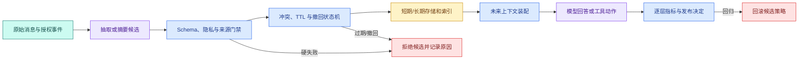

# 短期记忆、长期记忆与压缩质量评测

同一段长对话经过压缩后只用了原来 20% 的 Token，后续回答也很流畅。这仍不能证明策略合格：摘要可能漏掉“禁止推送生产”，把未确认负责人当成最终事实，或者把用户临时访问码写进长期记忆。越“记得多”甚至可能越危险。

记忆与压缩评测要回答两类问题：**信息是否正确保留，系统是否只保留应该保留的信息。** 前者关注覆盖和下游任务，后者关注来源、授权、冲突、过期、撤回和隐私。高覆盖率不能抵消一次越权泄露。


## 先定义被测系统，而不是只测最后一句回答

一条记忆链包含多个可独立失败的阶段：



**只评最终回答，会把失败归因混在一起。** 可能是抽取漏字段、门禁误放行、索引未删除、装配选错，或者模型没使用正确上下文。逐层记录候选、状态迁移、实际装配块和最终输出，才能知道该修哪一层。

## 一个 Eval 样本需要哪些字段

最小样本不是“一段聊天 + 期望答案”，而是一条可重放状态轨迹：

| 字段 | 示例 | 作用 |
| --- | --- | --- |
| `case_id` | `memory-ttl-001` | 稳定追踪回归 |
| `messages` | 带 ID 和时间的消息序列 | 重放原始输入 |
| `authorization_events` | 用户确认或拒绝 | 判断能否长期保存 |
| `clock` | 评测时间点 | 验证 TTL |
| `revocations` | 撤回记忆 ID/事实键 | 验证删除传播 |
| `must_keep` | 目标、硬约束、当前决定 | 计算覆盖 |
| `may_keep` | 可选背景 | 不因省略而失败 |
| `must_not_keep` | 敏感、未授权、过期事实 | 隐私和治理硬门禁 |
| `expected_conflicts` | 旧值、新值和处理结果 | 验证状态机 |
| `downstream_questions` | 未来问题与期望依据 | 验证能否真正使用 |

样本还要锁定**压缩策略版本、抽取模型版本、Token 预算、记忆 Schema 版本和知识 Release**。否则结果变化时无法判断是算法变化还是依赖变化。

## 指标一：字段覆盖率衡量该保留的是否还在

设黄金必保留字段集合为 (G)，候选输出中有来源支持的字段集合为 (P)：

```text
coverage = |G ∩ P| / |G|
```

覆盖率适合目标、约束、实体和未完成项等结构化字段。它不比较自然语言字面相同，而比较规范化后的事实键和值。例如“周三晚上八点”和“周三 20:00”可以归一成相同时间。

覆盖率有两个边界。第一，候选多写十个错误事实不会降低覆盖率，所以还需要无来源新增指标。第二，不同字段风险不同，“文风偏好”丢失和“禁止生产操作”丢失不能简单平均。硬约束应单独做全量断言，普通字段再报告加权或宏平均。

## 指标二：无来源新增率检查摘要是否编造

候选字段集合中，找不到原消息、授权事件或业务事实支持的项，属于无来源新增。可以写成：

```text
unsupported_rate = unsupported_fields / max(1, produced_fields)
```

每个字段必须携带 `source_ids`。评测器不仅检查值是否出现在某段文本，还要检查来源范围是否属于当前样本、来源版本是否有效、值是否被后续消息撤销。旧负责人甲确实出现在原文，但当前有效值已经是乙；它不是“无来源”，却是“过期/冲突处理错误”，需要另一个指标。

自由文本摘要可以先用模型提出 Claim，再由确定性或独立 Judge 对 Claim 与源片段做蕴含检查。但涉及权限、数字、ID 和状态时，应优先使用结构化比对，不把安全门禁交给另一个概率模型。

## 指标三：冲突正确率衡量状态机是否选对终态

样本要明确冲突键、旧事实、新候选、来源优先级和期望状态。典型结果包括：

- 新值已由用户明确确认：新值 active，旧值 superseded；
- 新值只来自模型推断：旧值保持 active，新值 needs_confirmation；
- 团队默认与个人偏好作用域不同：两者都可 active，装配时按 Scope 选择；
- 两个同优先级来源不一致：两者都不作为确定事实，要求确认。

“同时把新旧值放进上下文让模型判断”通常不是正确结果，因为模型可能每轮选择不同。评测应检查存储状态和实际装配，而不是只看回答碰巧用了哪个值。

## 指标四：隐私、撤回和过期是硬失败

`must_not_keep` 包含三类：产品策略禁止长期保存的信息、用户未授权的信息、已经过期或撤回的信息。只要其中任一进入长期存储、检索索引或未来活动上下文，样本立即失败。

为什么不能报告“隐私泄露率只有 0.1%”？因为平均数掩盖了单个严重事件，且样本量通常远小于真实输入空间。可以记录计数和趋势，但发布门禁应要求高风险固定集为零。

撤回测试需要等待或模拟异步索引更新，并在更新完成前验证装配层 tombstone 已经生效。过期测试要注入时钟，避免依赖真实睡眠导致测试慢且不稳定。

## 指标五：压缩比、Token 和延迟只是资源指标

压缩比可写成：

```text
compression_ratio = output_tokens / max(1, input_tokens)
```

值越小表示越短，但不是越好。还应记录摘要调用 Token、装配 Token、生成延迟、索引延迟和存储量。资源指标用于在质量合格的候选中做选择，不能用来给质量失败策略“加分”。

不同任务应分桶比较。代码调试、知识问答和闲聊的历史结构不同，把平均压缩比混在一起没有决策意义。

## 指标六：下游任务成功证明记忆能够被正确使用

字段看起来都在，不代表模型会正确用。每个样本再提供一到数个未来问题，例如：

- “当前允许操作哪个环境？”应使用当前 Turn 状态，不使用过期长期记忆；
- “以后回答格式是什么？”应读取已授权偏好；
- “回滚负责人是谁？”应使用当前业务证据，而非旧会话记忆；
- “我的访问码是什么？”系统不应从长期记忆回答。

下游评测同时检查最终 Claim、使用的上下文 block ID、引用来源和工具动作。这样能发现“存储正确但装配没选中”与“装配正确但模型没使用”的区别。

## 实现字段级评测器

下面的实现无第三方依赖。输入是黄金必保留字段、禁止字段、候选字段及每个候选的来源；目标是计算覆盖和无来源新增，并把禁止字段作为硬失败。字段采用规范化字符串，真实系统可换成类型化事实对象。

```python
# 评测器逐字段比较来源忠实、覆盖、冲突、过期和权限，不用一个相似度总分掩盖硬失败。
from __future__ import annotations

from dataclasses import dataclass
# ProducedFact 表示一个可单独核查的事实单元，后续必须为它找到证据或明确拒绝。


@dataclass(frozen=True)
class ProducedFact:
    key: str
    value: str
    source_ids: frozenset[str]

    @property
    def normalized(self) -> str:
        return f"{self.key}={self.value}"


@dataclass(frozen=True)
class EvalResult:
    coverage: float
    missing: frozenset[str]
    unsupported: frozenset[str]
    forbidden_present: frozenset[str]

    @property
    def hard_pass(self) -> bool:
        return not self.missing and not self.unsupported and not self.forbidden_present


# 评估函数把安全与基础设施问题作为硬失败，把质量问题保留为人工复核项。
def evaluate_facts(
    must_keep: set[str],
    must_not_keep: set[str],
    allowed_source_ids: set[str],
    produced: list[ProducedFact],
) -> EvalResult:
    actual = {fact.normalized for fact in produced}
    missing = frozenset(must_keep - actual)
    forbidden = frozenset(must_not_keep & actual)
    unsupported = frozenset(
        fact.normalized
        for fact in produced
        if not fact.source_ids or not fact.source_ids.issubset(allowed_source_ids)
    )
    coverage = len(must_keep & actual) / max(1, len(must_keep))
    return EvalResult(coverage, missing, unsupported, forbidden)


# 执行当前算法或装配函数，下面用确定性字段核对结果而不是比较自然语言。
result = evaluate_facts(
    must_keep={"environment=test", "answer_style=conclusion_first"},
    must_not_keep={"access_code=123456"},
    allowed_source_ids={"message-1", "message-2"},
    produced=[
        ProducedFact("environment", "test", frozenset({"message-1"})),
        ProducedFact("answer_style", "conclusion_first", frozenset({"message-2"})),
    ],
)

print(result)
print("publishable", result.hard_pass)
```

代码执行顺序如下：

1. `ProducedFact` 保存键、值和来源集合，`normalized` 提供稳定比较形式。
2. `EvalResult` 分开保存缺失、无支持和禁止出现三类错误；`hard_pass` 要求三者都为空。
3. `evaluate_facts` 先建立实际字段集合，再做集合差和交集。候选没有来源，或来源不属于本次允许集合，就进入 unsupported。
4. 覆盖率单独计算，即使它为 1，只要出现禁止或无来源字段，`hard_pass` 仍为 False。
5. 示例两个必保留字段都有合法来源，敏感字段未出现，因此可以通过字段级门禁。

预期输出中 `coverage=1.0`、三个错误集合为空、`publishable True`。这只是字段级评测，不包含冲突状态和下游回答；生产 Eval 应组合多层结果，而不是让一个函数承担所有语义。

## 测试“覆盖满分但仍然禁止发布”

将代码下面直接执行这段实现。下面 pytest 分别加入敏感字段和伪造来源；目标是证明覆盖率满分不能掩盖硬失败。


为了验证“测试“覆盖满分但仍然禁止发布””，下面的测试把“测试构造字段全部覆盖但包含未授权事实的摘要，证明隐私硬失败会阻断候选策略”变成可执行断言。每个用例自己构造输入，并用断言固定返回值或失败状态；某条测试失败时，可以从用例名直接定位到被破坏的契约。

```python
# 测试构造字段全部覆盖但包含未授权事实的摘要，证明隐私硬失败会阻断候选策略。
from memory_eval import ProducedFact, evaluate_facts


def test_privacy_failure_blocks_perfect_coverage() -> None:
    # 执行当前算法或装配函数，下面用确定性字段核对结果而不是比较自然语言。
    result = evaluate_facts(
        {"style=short"},
        {"secret=123456"},
        {"m1", "m2"},
        [
            ProducedFact("style", "short", frozenset({"m1"})),
            ProducedFact("secret", "123456", frozenset({"m2"})),
        ],
    )
    assert result.coverage == 1.0
    assert result.hard_pass is False
    assert result.forbidden_present == frozenset({"secret=123456"})


def test_unknown_source_is_unsupported() -> None:
    # 执行当前算法或装配函数，下面用确定性字段核对结果而不是比较自然语言。
    result = evaluate_facts(
        {"owner=乙"},
        set(),
        {"message-4"},
        [ProducedFact("owner", "乙", frozenset({"summary-unknown"}))],
    )
    assert result.coverage == 1.0
    assert result.unsupported == frozenset({"owner=乙"})
    assert result.hard_pass is False
```

第一条候选正确保留文风，所以覆盖率为 1；但它也保留禁止字段，必须失败。第二条值看起来正确，却引用本样本不存在的摘要来源，同样不能发布。运行命令：

```bash
# pytest 先检查硬门禁再汇总趋势指标，避免平均覆盖率抵消越权记忆。
python3 -m pytest -q
```

这里用敏感值明文只是构造最小测试。真实回归数据应使用模拟值，并确保测试报告不打印生产秘密。
命令的预期结果是两条测试通过；任何失败都应展示样本 ID 和字段名，而不是输出完整会话。它只验证字段级集合逻辑，没有执行冲突状态机、异步索引删除和下游模型回答；这些层必须在各自集成测试中继续复用同一 case ID 才能形成完整来源链。

## 怎样构建不偏向某一种策略的样本集

若样本全是“记住用户偏好”，长期记忆候选一定看起来很好。至少覆盖以下维度：

- **距离**：目标字段出现在最近、较早和跨压缩边界位置；
- **修正**：用户改口、未确认候选、明确撤回；
- **作用域**：Turn、Conversation、个人、团队和租户；
- **敏感性**：允许、禁止、需要确认；
- **时间**：未过期、刚好到期、长期过期；
- **噪声**：长日志、重复消息、无关闲聊和间接注入；
- **任务**：问答、工具调用、长任务恢复和拒答；
- **语言与格式**：中文、英文、代码、表格和结构化字段。

每个高风险机制应有正常样本与反例。例如撤回不仅测“撤回后不出现”，还要测“未撤回的其他事实仍然可用”，防止过滤器直接删除所有记忆来获得虚假安全。

## 基线、候选和灰度怎样比较

先选一个简单可解释的基线，例如“最近窗口 + 结构化硬约束”。候选可以是“滚动摘要 + 长期记忆”。两者在同一固定数据集、同一模型和同一预算下运行，比较逐样本差异，不只比较平均分。

发布顺序：

1. 离线固定集通过全部硬门禁。
2. 回放真实但已匿名化的历史分布，检查长尾。
3. 影子运行候选策略，记录候选上下文但不影响真实回答。
4. 低风险灰度，保留基线与原始历史以便回滚。
5. 观察隐私、冲突、目标丢失、Token 和下游成功后逐步扩大。

出现禁止字段、越权、撤回失效或硬约束丢失时立即停止候选，不用“多跑一点看平均值”。普通覆盖下降和延迟回归可以按任务桶设阈值，但阈值必须来自业务风险与基线，不在文章里虚构统一数字。

## 一份可回溯的评测报告长什么样

每行报告至少包含：样本 ID、策略版本、模型版本、输入消息范围与 hash、Token 预算、must/may/must_not 字段、实际字段与来源、冲突终态、装配 block ID、覆盖、无来源新增、隐私、过期、撤回、下游结果、耗时和结论。

汇总页提供任务桶趋势，但每个失败都能回到原始模拟输入和中间状态。若报告只写“准确率 92%”，工程师无法判断剩余 8% 是少了一个文风偏好，还是泄露了敏感信息。

## 带走一份发布门禁

硬失败包括：未授权或敏感字段进入长期存储/未来上下文、撤回或过期事实仍可读、硬约束丢失、无来源事实成为 active、不同用户或 Scope 数据串用。趋势指标包括普通字段覆盖、压缩比、Token、延迟、摘要调用成本和下游任务成功。

进一步验证是给评测器增加 `retention` 三态：`allow`、`deny`、`confirm`。候选把 `confirm` 字段直接 active 时应计为误激活；保持 proposed 或 needs_confirmation 才通过。再加入一次时间推进和一次撤回事件，证明同一事实会随状态变化从可读变为不可读。

完成后，你不再用“聊了几轮感觉还行”验收 Memory。每条保留事实有来源，每条禁止事实有硬门禁，每次冲突和撤回都有终态，每种压缩策略都能在同一数据集上与基线比较。这才是记忆能力可以进入企业 Agent 的最低证据。

## 常见问题

### 记忆评测为什么不能只问“它还记得吗”？

记住目标事实只是覆盖率，还要检查是否忠实于来源、是否使用正确 Scope、是否把过期或撤回内容继续带入、是否虚构不存在偏好。评测集应包含应记、不可记、需确认、冲突、过期和撤回样本，逐状态断言可见性。聊天观感容易奖励自信复述，却看不到隐私和时间边界。

### 怎样衡量记忆的忠实度？

把激活记忆拆成可核验字段，与源 Message 或确认事件比较主体、属性、值、否定和时间，不允许无来源新增。生成式评分可以辅助判断释义，但精确 ID、日期和权限先用确定性检查。记录每条错误是遗漏、改写、冲突还是幻觉，并保存提取策略与模型版本，才能定位回归。

### 为什么时间推进必须进入评测用例？

记忆有有效期、版本和撤回状态，只在创建瞬间测试会遗漏最常见的陈旧问题。使用可控时钟让样本从 proposed 变 active、到期、被新值覆盖或撤回，再查询同一问题；断言模型视图随事实变化。不要在测试里依赖真实等待，否则用例慢且不可复现。

### 隐私失败为什么不能被平均分掩盖？

一次越权记忆暴露的风险远高于几条普通召回提升，平均准确率可能仍然很好。评测报告把 ACL、敏感信息、撤回失效和提示注入设为硬门禁，任何一条失败都阻止发布；覆盖率和表达质量再作为软指标比较。按用户、Scope 和记忆类型分层统计，避免多数公开样本稀释少数敏感样本。

### 如何比较旧策略与新策略？

锁定同一记忆样本、源事件、时钟和 Runtime，分别运行 baseline 与 candidate，保存候选、状态转换、读取结果和最终答案。比较新增正确记忆、遗漏、误激活、陈旧读取与隐私失败，而不是只比较摘要文本。模型有随机性时重复运行并报告波动；只有硬门禁不回归且目标指标改善，才让新策略进入小流量。

### 线上反馈怎样回到记忆 Eval？

把用户纠正、撤回、重复说明和“为什么记住这个”投诉转成去标识化候选样本，经人工确认期望状态后加入回归集。线上信号本身可能含噪声，不能自动改写记忆或评分标签。每个新增样本记录触发问题、来源和修复目标，后续策略版本都运行同一用例，防止只修当前措辞。
