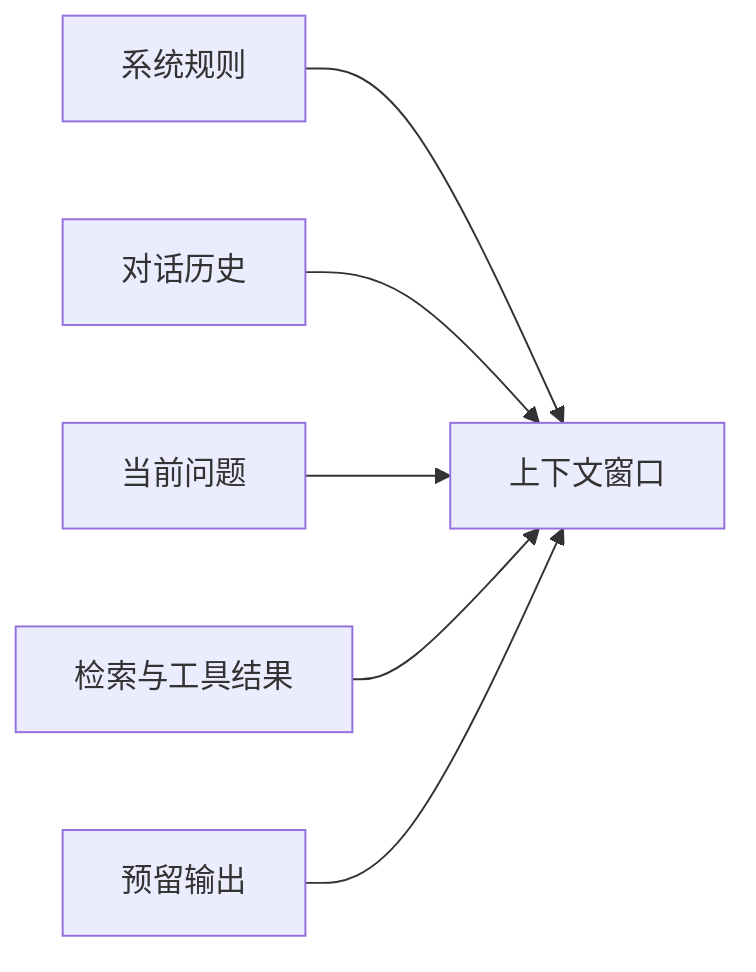

# 消息、Token、上下文窗口与模型输入输出

一段聊天在界面里看起来只是几行文字，发给模型时却可能包含系统规则、十轮历史、检索资料、工具结果和输出格式。模型不会自动区分哪些最重要，它只接收应用最终组装好的输入。

本章先把一次请求拆开，再手工做一张 Token 预算表。理解这一步，后面学习记忆、RAG 和 Agent 状态时才不会把“所有内容都塞进上下文”当成默认方案。

## 消息不是聊天气泡，而是带角色的输入单元

多数聊天模型使用消息列表。不同 API 的字段会有差异，但核心结构接近：角色说明这段内容来自谁，内容保存文字或多模态数据。

```json
{
  "messages": [
    { "role": "system", "content": "你是只读知识助手，只能根据可见资料回答。" },
    { "role": "user", "content": "怎样申请系统访问权限？" }
  ]
}
```

这段请求只有两条消息。`system` 用于给出应用级规则，`user` 是本轮问题。模型生成的回复通常记录为 `assistant`；如果发生工具调用，应用还会把工具返回追加到消息或专门的工具结果字段中。

角色不是权限系统。即使系统消息写着“不要访问秘密资料”，服务端仍然要在检索和工具层检查权限。系统消息影响模型行为，却不能替代数据库过滤和工具白名单。

## Token 是模型处理文本的基本单位

模型不是逐字读取文字。Tokenizer 会先把输入转换成 Token ID。英文单词可能被拆成一个或多个 Token，中文字符、标点和数字也会按模型词表切分。

下面只是帮助理解的示意，不代表某个真实模型的切分结果：

```text
原文：申请访问权限
可能的片段：[申请] [访问] [权限]
Token ID：[4217, 8921, 663]
```

不同模型使用的 Tokenizer 和词表可能不同。同一段文字在两个模型上的 Token 数不能直接假定相等。因此，计费或上线前要使用目标模型官方提供的计数方法，而不是用“中文字符数除以某个常数”估算最终账单。

### Token 数为什么重要

Token 同时影响三个东西：

1. **上下文容量**：输入和输出必须装进模型支持的窗口；
2. **延迟**：输入越长，Prefill 通常越耗时；
3. **费用**：托管 API 往往分别计算输入和输出 Token。

如果一篇文档有 20 万字符，而模型窗口容纳不下，就需要切片、检索或摘要，不能依赖一次请求解决。

## 上下文窗口是一笔总预算

假设某模型的上下文窗口上限是 32K Token。它通常不是“输入可以用 32K，输出还能再用 32K”，而是本次请求能处理的输入与最大输出共享总限制，具体以供应商接口说明为准。



一份简单预算可以这样写：

| 内容 | 预算 Token | 为什么保留 |
| --- | ---: | --- |
| 系统规则与输出格式 | 1,200 | 保持角色、安全和返回契约 |
| 最近对话 | 4,000 | 理解指代与当前任务 |
| 滚动摘要 | 2,000 | 保留较早决策 |
| 检索证据 | 12,000 | 支撑本轮事实 |
| 当前问题 | 800 | 用户真实输入 |
| 输出预留 | 4,000 | 避免回答被截断 |
| 安全余量 | 2,000 | 工具元数据和计数偏差 |

总计 26,000 Token，仍在 32K 窗口内。这里的数字是教学示例，不是推荐配置；真正预算取决于模型、语言、任务和回答长度。

## 输入过长时应该先删什么

最粗暴的做法是从开头截断，但开头可能包含系统规则和关键约束。更稳妥的顺序由信息职责决定：

1. 去掉重复检索片段和无关工具输出；
2. 降低每个证据片段的长度，但保留来源和关键句；
3. 把较早对话压缩为可追溯摘要；
4. 只保留与当前指代有关的近期消息；
5. 证据仍不足时缩小任务或向用户澄清。

系统规则、权限范围和当前用户问题通常不能作为随意裁剪对象。裁剪是一项确定性策略：程序根据预算和优先级执行，而不是让模型在看不到完整内容后决定什么“不重要”。

## 输出为什么会突然停止

回答中途停止常见于三类原因：

- 达到 `max_output_tokens` 等输出上限；
- 输入占用了过多窗口，剩余空间不足；
- 模型命中停止序列或内容安全终止条件。

排查时不要只看页面上的半句话。先记录供应商返回的结束原因、输入输出 Token 统计和请求参数。若结束原因是长度限制，可以提高输出预算或缩小输入；若是安全终止，则需要检查内容和策略，不能用自动续写绕过。

## 采样参数控制表达概率，不控制事实正确

常见参数 `temperature` 会影响采样分布。较低值通常让输出更集中，较高值增加多样性。它不能把模型变成数据库，也不能保证同一问题永远返回同一事实。

结构抽取、工具参数和分类任务更关注稳定性，可使用较低随机性并配合 Schema 校验。创意写作可以接受更高多样性。具体参数是否可用、范围如何，要看模型接口；不要把某家 API 的参数原样套到另一家。

## 动手做一次上下文盘点

假设一个知识 Agent 准备发送以下内容：

```text
系统规则：800 Token
10 轮历史：9,000 Token
历史摘要：1,500 Token
本轮问题：300 Token
8 个检索片段：16,000 Token
2 次工具结果：5,000 Token
预留输出：4,000 Token
模型窗口：32,000 Token
```

总需求是 36,600 Token，超出 4,600。请不要直接删掉系统规则或输出预留。一个合理处理是：检索片段先去重并压到 11,500 Token，工具结果只保留结构化关键字段压到 4,500 Token。总量变为 31,600，留出的余量仍然很小，运行时还要使用官方 Tokenizer 再确认。

### 检查结果是否合格

- 你能指出每段上下文由哪个模块提供；
- 每段都有预算和优先级；
- 裁剪后仍保留当前问题、权限与事实证据；
- 程序记录实际输入、输出和结束原因；
- 不在日志中保存敏感原文。

下一章会解决另一个问题：模型返回 JSON，不代表应用拿到的就是可信对象。我们会加入结构化输出和确定性校验。

## 参考资料

- [OpenAI Tokenizer 与 Token 说明](https://platform.openai.com/tokenizer)
- [OpenAI Responses API：Input and Output](https://platform.openai.com/docs/api-reference/responses)
- [Anthropic Context Windows](https://docs.anthropic.com/en/docs/build-with-claude/context-windows)

