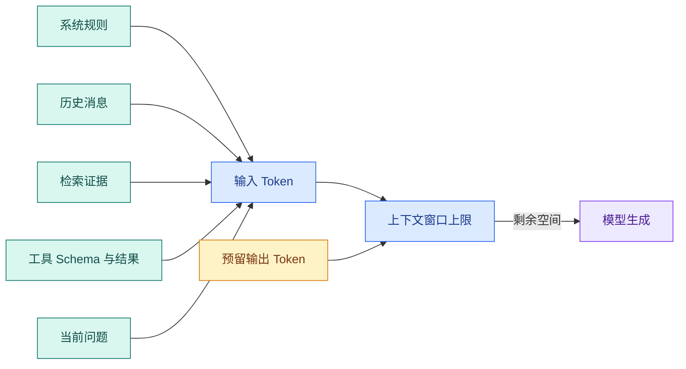

# 消息、Token、上下文窗口与模型输入输出

前面的真实调用已经打印出 `output_text` 和 usage。现在把镜头拉近到那次请求内部：应用到底把什么交给模型，为什么字符串会变成 Token，输入和输出又怎样共同占用上下文窗口。

在界面上，一次聊天可能只是“用户一句话、助手一句话”。在 Agent 中，同一次调用还可能包含 System 规则、十轮历史、检索证据、工具 Schema、工具调用、工具结果和输出格式。模型不会自动知道哪一段来自权限服务，哪一段只是网页正文；它只接收应用最终装配好的输入。

这篇要解决的不是“**Token** 是按字还是按词计算”这样孤立的问题，而是一条完整链路：消息怎样表达角色，Token 怎样占用窗口，工具调用怎样和结果配对，输入过长时怎样裁剪，输出为什么会提前停止。读完后，你可以拿一份请求日志，指出每一段内容由谁提供、花了多少预算、超限时先处理什么。

## 先看一次请求的真实形状

假设一个只读 Agent 正在回答“访问申请被拒怎么办”。应用可能组装出这样的消息序列。输入包含应用规则、当前问题和一次已经执行完的工具结果；观察重点是四种角色怎样通过调用 ID 组成一条可以继续推理的消息链：

```jsonc
{
  "messages": [
    {
      "role": "system",
      "content": "你是只读知识助手；只根据当前可见证据回答；资料不足时明确说明。"
    },
    {
      // role 决定该内容是系统约束、用户输入、模型输出还是工具观察。
      "role": "user",
      "content": "我在家访问系统被拒绝了，应该怎么办？"
    },
    {
      // role 决定该内容是系统约束、用户输入、模型输出还是工具观察。
      "role": "assistant",
      "tool_calls": [
        { "id": "call-1", "name": "search_notes", "arguments": { "query": "访问被拒" } }
      ]
    },
    {
      // role 决定该内容是系统约束、用户输入、模型输出还是工具观察。
      "role": "tool",
      "tool_call_id": "call-1",
      "content": "证据 e-17：资料不全时补充后重新提交。"
    }
  ]
}
```

这不是一段普通聊天记录。`system` 说明应用规则，`user` 是任务，`assistant.tool_calls` 是模型提出的动作，`tool` 是程序执行后的观察。工具结果通过 `tool_call_id` 对应到具体调用，不应只把一串文本追加到末尾。

### 消息角色做什么，不做什么

| 角色或字段 | 作用 | 由谁产生 | 是否等于权限 |
| --- | --- | --- | --- |
| system | 应用层规则、输出约束和行为边界 | 服务端配置 | 不是。权限仍由程序执行 |
| user | 当前用户意图和补充输入 | 用户或上游应用 | 不是。用户文字无法自授角色 |
| assistant | 模型之前的回复或工具调用 | 模型 Runtime | 不是。调用仍需白名单 |
| tool | 工具执行结果 | 确定性执行器 | 不是。内容仍是不可信资料 |
| developer（部分 API） | 开发者级行为约束 | 应用 | 仍需服务端校验 |

角色影响模型如何理解上下文，却不替代认证、ACL、数据库条件和副作用审批。把“只能查看公开资料”写进 System 是必要的提示约束，但真正的 Scope 必须来自已认证请求，并在检索和工具执行时再次检查。

## Token 是模型计量文本的单位

### Tokenizer 做了什么

模型不会直接读取 Unicode 字符。Tokenizer 按目标模型的词表把文本转换成 Token ID，模型处理的是这些 ID 对应的向量序列。一个英文单词可能是一个 Token，也可能被拆成词根；中文、标点、数字和代码的切分方式也取决于词表。

下面只是为了建立直觉的示意，不代表任何具体模型的真实切分：

```text
原文：访问申请被拒
示意片段：[访问] [申请] [被] [拒]
示意 ID：[4217, 8921, 318, 763]
```

不要用“一个汉字就是一个 Token”推算费用。中文字符、空格、JSON 键名、工具 Schema 和代码都会占用 Token。不同模型的 tokenizer 不同，同一段文本换模型后可能得到不同计数。

### Token 数影响什么

Token 数同时影响三类资源：

1. **上下文容量**：输入和输出要装进模型支持的窗口；
2. **延迟**：输入越长，模型需要处理的 Prefill 工作通常越多；
3. **成本**：托管 API 往往分别统计输入和输出 Token。

所以 Token 不是“计费细节”。它会改变 Agent 可以携带多少历史、RAG 可以放多少证据、一次请求能否在 Deadline 内完成。

### 生产环境怎样计量

字符数或字节数可以做早期防护，例如拒绝一个明显超长的上传，但不宜作为最终预算。生产调用至少记录：

- `model_id` 和 tokenizer 或模型版本；
- 输入 Token、输出 Token、缓存 Token（如果接口提供）；
- 每个上下文分区的估算值；
- 最大输出设置和实际停止原因；
- 工具 Schema、消息协议和供应商额外开销。

模型升级、Prompt 改动和工具增加后，重新运行同一批样本，观察 Token 分布，而不是只看某一次请求。

## 上下文窗口是一笔共享总预算

**上下文窗口**可以理解成一次调用的最大 Token 容量。很多接口把输入和输出放在同一个上限内：输入已经占用了多少，能留给模型生成的空间就少多少。具体字段和限制随供应商变化，必须以目标模型的接口契约为准。



假设窗口上限是 32,000 Token，应用最多允许输出 4,000 Token，还要为消息协议和估算误差留出 1,000 Token，那么可用输入预算最多约为 27,000，而不是 32,000。

一张可审计的预算表可以这样写：

| 分区 | 目标预算 | 保留理由 | 超出时的动作 |
| --- | ---: | --- | --- |
| System 与安全规则 | 1,500 | 行为边界和输出契约 | 配置超限时阻断发布 |
| 工具 Schema | 2,500 | 决定可用动作 | 只暴露当前任务所需工具 |
| 最近消息 | 4,000 | 保留当前指代 | 按消息组从旧到新裁剪 |
| 历史摘要 | 2,000 | 保存较早决策 | 按版本重建摘要 |
| 检索证据 | 12,000 | 支撑事实回答 | 去重、重排、按 Claim 覆盖选择 |
| 当前问题 | 800 | 应保留用户目标 | 超限时要求拆分 |
| 输出预留 | 4,000 | 防止答案中途截断 | 根据任务类型调整 |
| 协议与安全余量 | 1,000 | 消息包装和估算误差 | 计量异常时告警 |

这个表的数字只是演示预算方法。复杂 Agent 的工具 Schema 可能更大，长文问答需要更多证据，结构化输出也需要预留格式空间。每种任务可以有自己的配置，但必须记录实际用量。

## 输入装配顺序决定了模型能看到什么

推荐把装配拆成五个阶段：

1. 从认证上下文计算用户 Scope 和知识 Release；
2. 固定 System、工具白名单和输出 Schema；
3. 加入当前用户问题，不允许它被历史摘要覆盖；
4. 选择通过权限、版本和相关性检查的历史与证据；
5. 按消息协议排序，并为输出保留预算后再调用模型。

**权限过滤**要早于相似度排序。无权证据即使相关性最高，也不应该先进入候选再让模型“自觉忽略”。不可信文档应该位于资料区，并带来源 ID；它不应通过文字内容改变 System 规则。

### 工具调用必须保持配对

如果消息列表保留了 `assistant.tool_calls`，却裁掉对应的 `tool` 结果，模型可能把一个未完成的动作当成已完成。反过来只保留 ToolMessage，也会出现没有对应调用的孤立结果。

裁剪时应把“模型调用 + 工具结果”当成一个消息组。组内保留 `tool_call_id`、工具名称、参数摘要、执行状态和结果来源。结果很长时压缩正文，但保留状态和可回查的 `result_id`。

## 输入过长时，怎样决定先裁剪什么

不要从文本开头机械截断。可以先区分四种内容：

| 内容 | 默认优先级 | 裁剪策略 |
| --- | --- | --- |
| 当前问题、Scope、终态约束 | 最高 | 超限就要求缩短或拒绝 |
| System、安全规则、工具协议 | 必须保留 | 配置自身超限要修配置 |
| 已验证证据和引用元数据 | 高 | 去重、按 Claim 覆盖选择 |
| 旧历史、重复工具结果、低相关资料 | 可选 | 窗口、摘要、结构化压缩 |

一个具体的裁剪顺序是：去重重复片段，压缩工具结果，按消息组删除陈旧闲聊，再缩短证据正文但保留来源，最后才考虑让用户拆分问题。裁剪原因要写进 Trace，例如 `duplicate_evidence`、`stale_history`、`group_does_not_fit`，不应只留下一个“上下文超限”。

## 建立可重复的预算装配器

下面的实验不用真实 tokenizer，`tokens` 字段是预先标注的教学数据。输入是一组上下文块和可用输入预算，输出是被选择的块。运行目标是观察：必需块超限会失败，同优先级候选按稳定 ID 排序，低优先级闲聊会被裁掉。

```python
# 装配器按规则、当前问题、近期消息和证据的优先级扣减 Token，并始终预留模型输出空间。
from __future__ import annotations

from dataclasses import dataclass


@dataclass(frozen=True)
class ContextBlock:
    # Block 使用稳定 ID 和 kind 保存结构单元，正文不再是无法定位的一整段字符串。
    block_id: str
    kind: str
    text: str
    tokens: int
    priority: int
    required: bool = False
    source_id: str | None = None


# 构造函数把已验证字段组装成下游对象，不在这里引入新的权限或业务决策。
def assemble(blocks: list[ContextBlock], input_budget: int) -> list[ContextBlock]:
    required = [block for block in blocks if block.required]
    required_tokens = sum(block.tokens for block in required)
    if required_tokens > input_budget:
        raise ValueError("required_context_exceeds_budget")

    selected = list(required)
    remaining = input_budget - required_tokens
    optional = sorted(
        (block for block in blocks if not block.required),
        key=lambda block: (-block.priority, block.block_id),
    )
    for block in optional:
        # 外部调用前检查整轮剩余时间；超时后停止继续消耗模型、工具和数据库资源。
        if block.tokens <= remaining:
            selected.append(block)
            remaining -= block.tokens
    return selected


blocks = [
    ContextBlock("system", "system", "只根据证据回答", 80, 100, True),
    ContextBlock("question", "user", "访问申请怎么办", 20, 100, True),
    ContextBlock("evidence-1", "evidence", "现行申请步骤", 160, 80, source_id="doc-1"),
    ContextBlock("history-old", "history", "很早以前的闲聊", 120, 10),
]

chosen = assemble(blocks, input_budget=300)
print([block.block_id for block in chosen])
```

`ContextBlock` 保存内容类别、Token 估计、优先级和来源。真实结构还应包含 Scope、Release、版本和消息角色；示例先保留最能观察算法的字段。

`assemble` 第一阶段找出 `required=True` 的块并求和。必需块本身超限时抛出稳定错误，不会偷偷删除 System 或当前问题。第二阶段按优先级降序、ID 升序排列可选块，保证输入列表顺序变化不会改变选择结果。

每选中一个块就扣减 `remaining`。例子会保留 `system`、`question` 和 `evidence-1`，旧闲聊放不下而被跳过。输出顺序目前是“必需块 + 可选块”，真正发送前还要按消息角色、时间和 **ToolCall** 配对重新排序。

生产装配器还要在候选进入排序前做 Scope 和 Release 过滤，并在结果中记录裁剪块 ID。`tokens` 不宜继续使用字符近似，应该由目标模型 tokenizer 计算并写入 Trace。

### 给装配器写最小测试

下面两条 `pytest` 测试分别固定安全规则和稳定排序。测试直接调用上面的 `assemble`，输入是人工构造的上下文块，输出是异常或被选中的块 ID；它们不需要真实模型和 tokenizer：

```python
# 测试锁定消息顺序、硬约束保留和总预算上限，历史过长时只淘汰允许压缩的部分。
import pytest


# 这个用例核对上下文装配或压缩结果，关键约束不能在摘要后消失。
def test_required_context_is_not_silently_dropped() -> None:
    blocks = [ContextBlock("system", "system", "规则", 120, 100, True)]
    with pytest.raises(ValueError, match="required_context_exceeds_budget"):
        assemble(blocks, input_budget=100)


def test_same_priority_uses_stable_id() -> None:
    blocks = [
        ContextBlock("b", "evidence", "第二条", 10, 50),
        ContextBlock("a", "evidence", "第一条", 10, 50),
    ]
    # 执行当前算法或装配函数，下面用确定性字段核对结果而不是比较自然语言。
    result = assemble(blocks, input_budget=10)
    assert [block.block_id for block in result] == ["a"]
```

第一条测试不是为了测试异常本身，而是防止开发者在超限时静默删掉必需规则。第二条故意把 `b` 放在输入前面；排序使用 ID 作为第二关键字，所以预算只能容纳一个块时稳定选择 `a`。后续补充测试时，还要覆盖无权证据提前过滤、ToolCall/ToolMessage 组配对和输出预留不足。

## 输出为什么会提前停止

模型返回的 `finish_reason` 或等价字段通常比页面上的文本更有诊断价值。常见终止原因包括：

| 终止原因 | 代表什么 | 先检查什么 |
| --- | --- | --- |
| stop | 命中正常停止条件 | 是否已经得到完整答案 |
| length | 达到输出上限或窗口边界 | 输入 Token、输出预算和答案长度 |
| tool_calls | 模型要求执行工具 | 是否有白名单、参数和下一轮 ToolMessage |
| content_filter | 供应商安全策略终止 | 输入内容和策略返回字段 |
| error | 请求未成功完成 | HTTP 状态、供应商错误和重试次数 |

`length` 不等于模型“不会回答”。可能是历史和证据占满窗口，剩余空间不足；也可能是 `max_output_tokens` 设置过小。提高输出上限前先检查输入，否则只是把总预算继续挤爆。

`tool_calls` 也不是最终答案。Runtime 需要执行工具、追加结构正确的 ToolMessage，再进行下一轮模型调用。若工具失败，应该记录 `tool_failed`，不应伪造一个空结果继续生成。

## 采样参数影响表达，不保证事实

`temperature`、`top_p` 等采样参数作用于候选 Token 的选择分布。较低随机性通常让同一输入的措辞更集中，较高随机性允许更多表达变化；这两个参数都无法把概率生成变成确定性数据库查询。

结构化抽取、工具参数和路由判断通常更重视稳定性，应结合 Schema 校验、有限重试和程序规则。创作任务可以接受多样表达。不同供应商的参数名称、范围和兼容关系可能不同，不应把一家的配置原样复制到另一家。

## 诊断一次超限请求

假设日志记录如下：

```text
模型窗口：32,000
System 与工具 Schema：3,800
10 轮历史：9,000
历史摘要：1,500
当前问题：300
8 个证据片段：16,000
工具结果：5,000
预留输出：4,000
```

总需求是 39,600 Token，超出窗口 7,600。一个可解释的处理过程是：先删除重复证据，把证据压到 11,000；再把工具结果转换为状态、来源 ID 和关键字段，压到 2,000；然后从旧历史中重建摘要，保留最近消息组。处理后仍要用目标 tokenizer 重算，不能仅根据字符数直接宣告成功。

诊断记录至少要回答：

1. 哪个模块提供了最长内容？
2. 是否有同一证据重复进入多个区段？
3. 工具 Schema 是否暴露了当前任务不需要的工具？
4. 输出预留是否符合任务类型？
5. 裁剪后每条引用还能否回查原文？

## 带走一张检查单

- 是否记录消息角色、来源和版本，而不是只保存拼接后的字符串；
- 是否使用目标模型 tokenizer 计量输入与输出；
- 是否把输入预算和输出预留当成同一窗口的两部分；
- 是否在召回前执行 Scope/Release 过滤；
- 是否把 ToolCall 与 ToolMessage 当作不可拆分的消息组；
- 是否为裁剪记录原因、块 ID 和来源；
- 是否区分 `length`、`tool_calls`、安全终止和请求错误；
- 是否有必需块超限、稳定排序和无权证据测试。

## 常见问题

### 一个中文字符是否等于一个 Token？

不等于。Tokenizer 按模型词表把文本切成 Token，同一个汉字、词组、空格、标点或代码片段可能被拆成不同数量；模型版本和供应商的词表也可能不同。字符数只能做很粗的预估，生产预算要使用目标模型对应的 tokenizer，调用后还要记录供应商返回的实际 input/output usage。否则切换模型后，同一段资料可能突然越过窗口或成本阈值。

### 上下文窗口越大，是否越不需要做压缩？

窗口变大只提高容量上限，不会自动解决重复、冲突、权限和注意力稀释。把所有历史和检索结果塞进大窗口，会增加延迟与成本，也可能让旧结论覆盖新证据。装配器仍要区分必需规则、当前问题、工具配对、可见证据和可压缩历史，并记录每一块为何保留或删除。压缩的目标是提高有效信息密度，而不是单纯把输入塞进限制以内。

### 为什么要在输入预算之外预留输出 Token？

输入和输出共享同一上下文窗口。若把窗口全部用于 System、历史和证据，模型即使理解了问题，也没有空间生成完整答案，通常以 `length` 或等价原因提前停止。应用应先按任务类型预留输出，再用剩余预算装配输入；结构化抽取的预留可以较小，长篇带引用回答则需要更大。实际完成后比较预留与使用量，逐步调整，而不是每次超限都盲目增加上限。

### ToolCall 和 ToolMessage 为什么不能只保留其中一个？

ToolCall 记录模型提出了什么工具和参数，ToolMessage 记录执行器对该调用返回了什么结果，它们通常通过调用 ID 配对。只保留结果，模型不知道它回应了哪次动作；只保留调用，模型会误以为工具尚未执行。裁剪历史时要把一个调用组视为不可拆分单元，并保留稳定的错误语义。否则供应商会拒绝消息序列，或模型重复调用同一个工具。

### 输入超限时应该先删除哪一部分？

先保护 System 安全规则、当前问题、必须配对的工具消息和支撑当前 Claim 的证据。随后去除重复证据和无关工具 Schema，把大工具结果压成结构化摘要，再对较早历史做滚动或分层摘要。每次裁剪后用目标 tokenizer 重算，并检查引用还能回溯、Scope 没被绕过。直接从字符串尾部截断最危险，因为它可能切掉当前问题、半个 JSON 或 ToolMessage。

### `finish_reason=length` 是否说明模型能力不够？

它首先说明输出碰到了长度或窗口边界，不是知识能力判断。排查时先记录输入 Token、预留输出、实际输出和各上下文区段占用；再确认回答是否因冗长 Prompt、重复证据或过小输出上限被截断。只有重新分配预算后仍无法完成任务，才考虑拆分问题或更换模型。不要把截断答案送入解析器反复修复，那会把预算问题伪装成 Schema 问题。

### 为什么不同模型不能共用同一份 Token 估算？

模型可能使用不同词表、消息包装开销、工具 Schema 编码和最大输出规则。相同文本在两个 tokenizer 下数量不同，供应商还可能为消息角色或工具描述增加隐藏协议 Token。模型路由时应让每个适配器提供自己的计量函数与窗口声明，并在 Trace 中保存模型 ID、估算值和实际 usage。若没有目标 tokenizer，宁可使用保守安全系数，也不要假装字符数是精确 Token。
