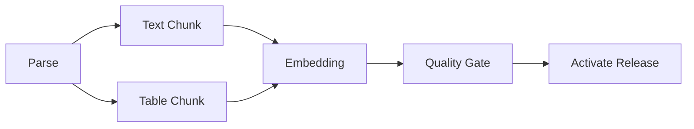

# DAG 工作流怎样表达依赖与并行

一份文档进入知识库后，先通过文件准入并写入对象存储，再解析为 Block。正文 Chunk 与表格 Chunk 可以并行生成，两路结果齐备后才能做 Embedding。候选索引通过质量门禁，最后才能激活为新 Release。

这些依赖在运行前已经知道，适合用 **DAG（Directed Acyclic Graph，有向无环图）** 表达。节点是可执行任务，有向边表示真实前置条件，无环约束保证调度器总能找到一个开始位置。

DAG 的难点不在画图。工程实现要解释边的语义、执行前校验图、调度就绪节点、传递版本化输出，并让失败、重试、取消和恢复都保持一致。

## 一条边必须表达可执行依赖

`parse -> chunk` 的含义是：Chunk 节点必须读取这次 Parse 节点产生的输出引用，Parse 未成功时 Chunk 没有执行资格。

“解析和切块在概念上相关”不够。如果删除这条边后两个节点仍能安全独立运行，它们之间不应建立执行依赖。多余边会减少并行度，漏边会让下游读取空值或旧版本。

依赖可以分为：

| 类型 | 例子 | 表达方式 |
| --- | --- | --- |
| 控制依赖 | 审批通过后才能发布 | 边与状态条件 |
| 数据依赖 | Embedding 读取 Chunk Manifest | 稳定 OutputRef |
| 资源依赖 | 同一 GPU 一次只跑一个批次 | 调度资源锁或租约 |
| 业务条件 | 只有扫描 PDF 才运行 OCR | 条件节点或分支选择 |

资源竞争不宜伪装成图边。两个无数据依赖的任务都需要 GPU，调度器用容量控制即可；硬连一条 A 到 B 会固定不必要的先后顺序。

## 节点不一定是 Agent

一个 TaskSpec 可以执行普通函数、数据库事务、外部 Activity 或受限 Agent Loop：

```text
TaskSpec {
  task_id
  objective
  depends_on
  input_refs
  output_schema
  allowed_tools
  required
  retry_policy
  idempotency_key
  side_effect_class
  deadline
}
```

文件哈希、Schema 校验、版本切换和计数检查使用确定性代码更可靠。开放研究节点才可能需要模型与工具循环。把每个节点都实现成 Agent，会增加延迟、成本和不可预测性。

输出通过稳定引用传递。Parse 返回 `parsed_version_id`、Manifest 哈希、Block 数量和警告；Chunk 节点按 ID 读取。把整份解析正文放进工作流状态会放大序列化、检查点与重放成本。

`required` 决定图的业务含义。缩略图节点失败可能允许索引继续，Embedding 节点失败则不能激活依赖向量检索的 Release。是否必需在计划时固定，运行中不能为了显示成功而改成可选。

## 执行前先做静态校验

任何 Worker 启动前，调度器至少检查：

1. 图不能为空，Task ID 唯一。
2. 所有依赖 ID 都存在。
3. 节点不能依赖自己。
4. 图中不存在环。
5. 输入引用能由依赖输出提供。
6. 工具、Scope 和预算满足父策略。
7. 必需终点能够从起始节点到达。

环检测可以使用深度优先的 `visiting / visited` 集合，也可以使用 Kahn 拓扑排序。若最终处理节点数少于总节点数，剩余部分包含环。

结构错误应返回具体路径，例如 `parse -> embed -> parse`，而不是等所有任务进入等待后才超时。缺失依赖也不能当作已经完成。

动态生成的 DAG 每次修订都重新校验。旧 revision 的 Worker 结果不能写入新图，除非输出引用和节点身份明确兼容。

## 就绪队列怎样实现最大安全并行

节点进入 Ready 的条件是所有必需依赖都成功，业务条件满足，并且资源与预算准入通过。

```text
pending -> ready -> running -> succeeded
                        |-> failed
                        |-> cancelled
pending -> blocked
```

调度循环可以按拓扑层级运行，也可以在每个结果到达时重新计算 Ready Set。后者能让短任务完成后立即释放下游，不必等同层最慢任务。

并发由 Semaphore、队列并发或资源租约控制。Ready 节点有十个，不代表十个都立刻启动。全局上限、租户上限、模型供应商配额和特定资源容量共同决定准入。

相同优先级下使用稳定 Task ID 排序，避免事件到达顺序改变调度结果。并发完成顺序不影响结果归属，每个 TaskResult 必须返回自己的 `task_id`，调度器还要检查它确实属于本批 Ready Set。

## Fan-out 与 Fan-in 怎样汇合

入库流程中，正文切分和表格切分是 **Fan-out（扇出）**；Embedding 节点等待两支完成，是 **Fan-in（扇入）**。



Fan-in 不能只检查“收到了两个结果”。它要核对两条输出属于同一候选版本，Manifest 不冲突，必需分支状态为 succeeded。一个旧重试结果和一个新结果凑成两份，数量满足，版本仍然错误。

部分聚合需要在合同中声明。例如研究任务允许 3 个来源中 2 个成功，汇合节点要知道最低数量、哪些来源必需、缺失如何展示。临时忽略失败分支会让完成语义不稳定。

大规模 Fan-out 还要分页或分批。一次创建十万个节点会压垮调度器元数据。可使用批次节点、Map 任务或子工作流，把局部进度保存在外部存储。

## 失败怎样沿图传播

节点失败后，调度器先分类错误：

```text
retryable       超时、限流、暂时网络错误
non_retryable   参数非法、权限拒绝、格式不支持
business_empty  合法执行但没有业务结果
unknown_effect  调用超时，副作用状态未知
```

重试策略属于节点合同，包含最大次数、退避和总 Deadline。权限错误不会因重试变合法。副作用状态未知时先按幂等键查询或对账，不能直接再执行一次。

必需节点最终失败后，它的必需下游进入 `blocked`，错误码指向 `dependency_failed:<task_id>`。独立分支仍可完成，以便形成有限结果或诊断证据。

可选节点失败时，汇合节点根据政策继续，并把缺口写入结果。完成状态不能只看最终节点是否运行，还要看所有必需不变量是否满足。

Fail-fast 适合确定无法交付且后续成本较高的流程。Collect-partial 适合研究和诊断。两种策略在图定义中明确，不能由 Worker 自行选择。

## 重试和恢复为什么依赖幂等

Worker 成功写入 Embedding 后，在确认消息前崩溃，队列可能再次投递节点。若每次都盲目插入，候选版本会出现重复向量。

每个节点使用稳定执行身份：

```text
execution_key = workflow_id + graph_revision + task_id + attempt_semantics
```

Repository 对业务写入建立唯一约束或 Upsert。TaskResult 先保存，再发完成事件；事件使用 Outbox 重放。调度器收到重复完成消息时返回已有终态。

恢复后从持久化节点状态重建 Ready Set。`running` 且 Lease 过期的任务进入对账或重试，`succeeded` 节点不重新执行。工作流引擎的事件重放也要求工作流代码确定性，当前时间、随机数和外部 I/O 通过引擎 API 或 Activity 获取。

幂等不等于所有动作可无限重试。发送邮件、扣款和外部发布需要供应商幂等键、查询能力或补偿流程，节点合同要写清楚。

## Deadline 与取消怎样贯穿图

父 Workflow 在开始时固定绝对 Deadline。节点局部超时取 `min(node_timeout, remaining_time)`，重试和排队都消耗同一个总时间。

收到取消后，调度器停止把 pending 节点转为 ready，向 running 节点发送取消信号，并等待安全点。完成中的外部动作可能无法强制终止，迟到结果保存审计，不能让父状态从 cancelled 回到 succeeded。

清理也可以建成显式节点或终态 Hook。候选对象、临时文件和 Lease 的清理要幂等，且不得删除已经被活动 Release 引用的资源。

用户只取消一个可选分支时，图需要支持子树取消，并重新计算下游是否仍满足完成政策。简单地删除节点会破坏历史和引用。

## DAG 与 Agent Loop 怎样组合

DAG 适合主要依赖稳定的流程，Agent Loop 适合根据观察动态选动作。两者可以嵌套：

```text
固定入库 DAG
  parse -> chunk -> embed -> validate -> activate

其中 parse 节点内部
  可按文件类型选择不同确定性解析器

研究 DAG
  decompose -> parallel research -> synthesis

其中 research 节点内部
  运行有预算的 Agent Loop
```

嵌套后只有外层拥有父终态，内层返回 TaskResult。Deadline 从外到内递减，取消从外到内传播，内层不能因自己完成而宣布整个 Workflow 完成。

任务结构在运行中频繁变化时，强行每次重建 DAG 会增加版本和恢复复杂度。此时可以用 Supervisor 或 Swarm 管理动态任务板，稳定子流程仍提交为 DAG。

## 可运行示例验证调度不变量

`multi_agent_control.py` 中的 `validate_dag` 和 `execute_dag` 展示了图校验、就绪计算、并发上限与依赖失败传播：

<<< ../../examples/ai-agent/multi_agent_control.py

示例使用 `asyncio` 和内存字典，只能证明单进程控制逻辑。它没有持久化检查点、跨进程 Worker、Lease、Outbox 和真实副作用适配器。测试 Worker 是 Fake，无法证明供应商超时和幂等语义。

生产实现应把状态写入任务仓库或耐久工作流引擎，并为每类 Activity 做契约与故障测试。框架可以改变，Task ID、依赖、版本、状态和失败传播不变量不会改变。

## DAG 测试不只检查最终结果

| 场景 | 关键断言 |
| --- | --- |
| 重复 Task ID | 执行前拒绝 |
| 缺失依赖与循环依赖 | 无 Worker 启动 |
| 两支独立任务 | 在并发上限内同时运行 |
| Fan-in 收到不同版本输出 | 不进入下游 |
| 必需节点失败 | 依赖子树 blocked |
| 可选节点失败 | 结果带缺口且政策允许继续 |
| Worker 重复投递 | 副作用只发生一次 |
| 父取消 | 不再调度新节点 |
| 旧图结果迟到 | 不覆盖新 revision |
| 恢复已完成 Workflow | 不重复执行 succeeded 节点 |

观测按 workflow、graph revision、task、attempt 和状态记录队列等待、执行耗时、重试、阻断原因和资源用量。图的关键路径与 Ready 队列长度能帮助判断并行收益和瓶颈。

DAG 把已知依赖变成可执行结构。边只表达真实前置条件，节点输出使用版本化引用，调度器在静态校验后按就绪状态运行，失败沿必需依赖传播。做到这些，图才能在重试和恢复后继续代表同一项业务，而不只是一张流程示意图。
