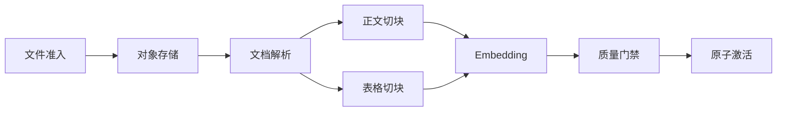

# DAG 工作流怎样表达依赖与并行

一份文档进入知识库，要先完成准入和对象存储，再做解析。解析得到 Block 后，表格切分与正文切分可以并行；两路 Chunk 都准备好，Embedding 才能开始；候选索引通过质量门禁后，系统才能激活新版本。这些依赖在运行前已经知道，适合用有向无环图（Directed Acyclic Graph，DAG）表达。

DAG 的节点表示可执行任务，边表示真实的前置依赖。“有向”意味着数据和控制按一个方向传播，“无环”保证不存在 A 等 B、B 又等 A 的死锁。它最适合稳定依赖，不负责替模型自由探索下一步。

::: info 一条边表达什么

`parse -> chunk` 不是“解析和切块有关”，而是 **切块必须读取这次解析产生的版本化输出，解析未成功时不得启动切块**。如果删除这条边仍能安全运行，两者没有执行依赖，不应为了图看起来完整而连接。

:::

画图很容易。生产实现真正要解决的是图如何校验、任务何时进入就绪队列、多个分支怎样汇合、失败会阻断哪些节点，以及进程恢复后怎样避免重复副作用。

## DAG 固定依赖，Agent Loop 选择动作

DAG 和 Agent Loop 都能执行多步任务，控制权的位置不同。DAG 在运行前拥有节点和边，调度器依据图决定下一批任务；Agent Loop 在每一轮读取当前状态，由模型提出候选动作，运行时再授权和执行。

| 维度 | DAG 工作流 | Agent Loop |
|---|---|---|
| 下一步来源 | 图中的依赖与就绪条件 | 当前状态和模型候选动作 |
| 终止条件 | 目标节点到达终态 | 结束动作、预算、Deadline 或运行时裁决 |
| 可预测性 | 节点和最大并发可提前分析 | 路径随运行结果变化 |
| 适用任务 | 入库、审批、固定诊断、批处理 | 开放研究、工具探索、交互式处理 |
| 主要风险 | 错边、漏边、环、重试副作用 | 卡循环、动作漂移、预算失控 |

两者可以组合。DAG 的某个“研究”节点内部运行受限 Agent Loop，外层仍负责等待、重试和交付；Agent Loop 也可以选择启动一个固定 DAG，比如发现需要重建索引后提交标准入库流程。组合时要明确内外层各自的状态和 Deadline，不能让两个调度器都认为自己拥有最终取消权。

工作流里使用多个模型，也不会改变 DAG 的性质。只要下一节点由边和条件表达，它仍是固定编排。反过来，一个 Agent Loop 只调用同一个模型，仍可能根据运行时结果动态选择不同动作。

## 节点契约决定图能否校验

节点只写一个名称不够。调度器至少需要任务 ID、依赖、输入引用、输出类型、是否必需、重试策略和副作用等级。

```python
TaskSpec(
    task_id="embed",
    objective="为候选版本的所有 Chunk 生成向量",
    depends_on=("chunk-text", "chunk-table"),
    required=True,
    allowed_tools=frozenset({"read_chunks", "write_embeddings"}),
    token_budget=0,
)
```

这里的 `token_budget=0` 表示节点使用确定性 Embedding 客户端，不需要聊天模型。DAG 不应把每个框都变成 Agent；校验、哈希、写库和版本切换由普通程序完成更可靠。

依赖输出通过稳定引用传递。`chunk-text` 返回候选版本 ID、Chunk 数量、Manifest 哈希和失败记录，`embed` 按版本读取数据。直接把几万条 Chunk 塞进工作流状态，会放大 Checkpoint、序列化和重放成本。

输出合同还要区分业务空结果和技术失败。正文确实为空可以返回 `empty_document`，解析器超时返回 `parser_timeout`，两者的处理不同。空文档可能按准入政策拒绝；超时可以重试或转人工。

可选节点也要在计划时声明。缩略图生成失败不一定阻断文档检索，Embedding 失败则不能激活依赖向量检索的新版本。运行中为了“让流程变绿”把必需节点改成可选，会让终态失去含义。

## 图在执行前要通过结构校验

调度器接收图后先做静态检查，任何 Worker 启动前就拒绝结构错误。

任务 ID 必须唯一。两个节点都叫 `parse`，事件、重试和输出引用会指向不确定对象。ID 应在一次图中稳定，恢复和重放继续使用同一个值。

依赖必须存在。`embed` 声明依赖 `chunk-table`，图里没有该节点，不能把它当成“依赖已经满足”。缺失依赖通常来自条件分支生成错误或版本不匹配，应返回 `missing_dependency`。

图不能成环。深度优先遍历可以用 `visiting` 集合发现回边；Kahn 拓扑算法也能通过最终处理节点数判断是否有环。检测到 `a -> b -> c -> a` 时，错误应包含构成环的节点，方便定位计划生成问题。

生产者要唯一或有明确合并器。两个节点都声明写入 `manifest:current`，下游无法知道读哪个版本。允许多生产者时，输出应进入带分支 ID 的独立位置，再由专门节点按规则汇合。

资源和权限也能提前检查。只读任务不应声明写工具；租户 A 的图不能引用租户 B 的对象；节点 Deadline 之和或关键路径不能明显超过父 Deadline。静态检查无法预测所有运行时延迟，但能挡住确定不可能完成的计划。

条件边要有完整分支。解析结果可能是 `text`、`table` 或 `scanned_pdf`，如果图只处理前两类，扫描件不应静默结束。条件节点需要默认失败或明确的 `unsupported_format` 分支。

## 拓扑调度只运行已经就绪的节点

一个节点的所有必需依赖成功后，它才进入就绪队列。调度器可以维护每个节点的入度：前置任务完成一次，就把后继节点的未满足依赖数减一；减到零时加入队列。

```text
admission -> store -> parse -> chunk-text  -> embed -> quality -> activate
                             \-> chunk-table -/
```

`admission` 完成后只有 `store` 就绪。`parse` 完成后，`chunk-text` 和 `chunk-table` 同时就绪；两者都成功，`embed` 的入度才归零。图中有多少节点不决定实际并发，某一时刻的就绪节点数才决定可并行空间。

调度器还要服从全局并发上限。十个节点同时就绪，连接池只允许四个重任务，就先领取四个。公平策略可以按图、租户或任务优先级轮转，防止一个大图占满 Worker。

就绪和运行是不同状态。节点进入队列后可能等待很久，领取后才迁移到 `running` 并记录 Worker、执行世代和租约。把排队时间算进工具超时，会让繁忙时任务一启动就过期；父 Deadline 仍要覆盖整个等待和执行周期。

调度器不能只在内存里维护入度。进程退出后，需要从节点终态和图定义重建未满足依赖。事件日志可以加速恢复，真实状态仍以持久化节点记录和输出回执为准。

## 扇出和汇合需要明确的归并规则

扇出把一个输入复制或拆分给多个节点。检索计划可以生成精确、全文、向量、表格和图谱分支，每个分支拥有唯一 ID、查询、范围和 `top_k`。运行时按分支发送任务，候选结果回到融合节点。

汇合有三种常见门槛：

- **All**：所有必需分支成功才能继续，适合原子发布和完整校验。
- **Quorum**：满足预设数量或权重即可继续，适合有真实独立冗余的读取。
- **Best effort**：等待到 Deadline，使用已经验证的结果并公开缺口，适合探索性研究。

门槛必须和业务语义绑定。三个转载来源不构成三个独立证据，不能用 `2/3` 多数规则确认事实。两个解析分支处理不同格式，也不能只成功一个就宣布整份文档完成。

归并函数要满足确定性要求。候选去重按稳定 Chunk ID，排序使用明确分数和稳定的并列规则；多分支向同一个列表写入时，Reducer 不能依赖异步返回顺序。否则同样输入只因网络先后不同就会产生不同答案。

LangGraph 一类图运行时可以用 `Send` 根据计划动态扇出节点，再由带 Reducer 的状态字段收集结果。真实知识 Agent 常用这种方式并发运行检索分支，随后再扇出重排、冲突、新鲜度和 ACL 审查。`Send` 解决分派，不会自动解决结果身份、版本和权限，Reducer 也不能把互相冲突的 Evidence 简单覆盖。

## 用一次入库任务推演状态变化

输入是一份带正文和表格的 PDF，候选知识版本为 `candidate-18`。图包含八个节点：



准入节点检查格式、大小、哈希和租户范围，输出对象键与内容哈希。对象存储确认写入后返回不可变对象版本。解析节点读取该版本，输出 Block Manifest 和解析警告。它不直接覆盖当前活动知识版本。

正文与表格切块并行运行，各自写入 `candidate-18` 下的命名空间。正文分支保留章节路径和邻接关系；表格分支保留表头、行字段和业务编号。两路都返回 Manifest 哈希，Embedding 节点验证候选版本一致后再批量读取。

一次正常事件序列可能是：

```text
1  admission.succeeded    object_hash=sha256:...
2  store.succeeded        object_version=obj-v7
3  parse.succeeded        manifest=blocks-v3 warnings=1
4  chunk-text.started     generation=1
5  chunk-table.started    generation=1
6  chunk-table.succeeded  manifest=tables-v2 chunks=24
7  chunk-text.succeeded   manifest=text-v4 chunks=186
8  embed.succeeded        model=embedding-v5 vectors=210
9  quality.succeeded      gate=passed
10 activate.succeeded     release=release-19
```

解析警告不一定等于失败。某页图片无法提取，但正文和表格完整，政策可以允许带警告进入质量门禁；扫描 PDF 没有 OCR 能力，解析结果为空，则应失败关闭。差异写在节点状态和准入规则中，不能让模型阅读警告后临时决定。

激活节点必须最后执行。它在事务内检查候选版本仍是预期版本、所有必需 Manifest 已完成、质量门禁对应相同配置，然后切换活动指针。先更新指针再补 Embedding，会让在线检索读到半成品。

## 部分失败怎样沿图传播

假设表格切块失败，正文切块成功。`embed` 同时依赖两者，且当前发布要求表格可检索，因此 `embed` 进入 `blocked`，质量和激活节点也不会启动。正文 Chunk 可以留在候选版本供排障，不能进入活动 Release。

若输入文件本来没有表格，计划生成器应把 `chunk-table` 标记为条件跳过，并为下游产生“无表格、条件已满足”的正式状态。`skipped` 不是 `succeeded`，依赖解析需要明确接受哪些终态。临时删除节点会改变图身份，不利于恢复和审计。

可选节点失败时，下游是否继续由边的类型决定。比如生成预览图失败，激活可以继续，但发布记录要包含 `preview_unavailable`。用户若请求预览，接口再返回明确缺失；不能在工作流完成后把警告丢掉。

分支超时要先取消对应工具，再写任务终态。只让调度器停止等待，远端解析仍可能继续写候选数据。工具支持取消时传递动作 ID；不支持时标记孤儿执行，并让迟到结果通过执行世代检查，禁止覆盖重试结果。

父任务取消会阻断所有尚未开始的节点，并向活动节点传播。已经完成的对象存储不会删除，清理由补偿策略按对象引用和保留期执行。立即递归删除共享对象有误删其他任务引用的风险。

## 重试必须理解副作用和幂等

纯函数节点最容易重试：输入版本不变，输出可由内容哈希标识。解析和切块可以把 `input_hash + parser_version + config_hash` 作为结果身份，命中完整产物时直接复用。

批处理节点可能部分成功。Embedding 已写入 180 条，剩余 30 条超时，重试不应重复创建 180 条新记录。每条向量绑定候选版本、Chunk ID、模型和维度，使用唯一约束或幂等写入；任务状态同时保存成功集合与失败集合。

激活属于有副作用节点，但可以用比较并交换保证幂等：只有活动指针仍指向预期旧版本时才切换到 `release-19`。重复收到同一个激活动作，发现已经指向 `release-19`，返回原回执；指向其他新版本时返回 `activation_conflict`，不能覆盖后来发布。

退避策略要受父 Deadline 限制。单节点配置三次重试，不代表永远执行三次；剩余时间不足以完成一次合理调用时，直接进入超时终态。大量节点同时失败时还要加入抖动，避免服务恢复瞬间再次被同一批请求压满。

重试次数不能作为修复。解析器对同一损坏文件连续失败，继续重跑没有价值；应根据稳定错误类停止。临时网络错误、限流和 Worker 退出可以重试，格式不支持、权限拒绝、图结构错误需要修改输入或计划。

## 动态计划仍需要冻结执行版本

开放研究常在运行中发现新子问题，看起来不适合固定 DAG。可以让规划节点生成下一批候选任务，但每一批都要形成新的图版本，经过相同校验后再执行。

已经运行的节点不能被原地改依赖。计划 `graph-v1` 中任务 A 已成功，模型随后提出 B 和 C，编排器生成 `graph-v2`，保留 A 的身份与输出，新节点引用 A。审计和恢复都能说明每个节点由哪个计划版本创建。

动态扩展需要上限：最大节点数、最大深度、每轮新增任务数、总预算和 Deadline。模型不能通过不断产生“还需进一步研究”的节点绕过停止条件。新增节点还要去重，任务签名可以结合目标、实体、范围和工具，避免同义改写重复执行。

删除动态节点也要留下原因。计划发现 B 与 A 重复，可以将 B 标为 `superseded` 并关联 A，而不是从图中抹去。这样能分析规划器为何产生重复，也能防止恢复时重新创建 B。

DAG 一旦允许模型重写所有已执行路径，就失去了可重放性。更稳的边界是：模型提出增量，程序校验并追加；已提交事件和外部回执不可改写。

## Checkpoint 保存图状态，不保存幻觉式进度

Checkpoint 至少包含图版本、节点状态、执行世代、输出引用、剩余预算和父任务控制信号。大对象留在对象存储或数据库，Checkpoint 保存稳定引用与哈希。

Worker 报告“已经完成 80%”不应直接推动依赖。只有输出合同满足并写入回执，节点才迁移到 `succeeded`。进度事件可以用于 UI 和 Watchdog，但不能替代终态。

恢复时先加载父任务状态。已经取消或过期的图只做清理和对账；仍可运行的图重建就绪队列，检查活动租约，再接管失联任务。任何写工具在恢复前重新授权，避免旧权限快照继续造成副作用。

工作流定义升级会影响重放。运行中的 `graph-v1` 不应自动套用 `graph-v2` 的新边，否则节点历史和当前代码不一致。常见做法是保存定义版本，让旧运行继续使用兼容代码，或执行显式迁移并记录映射。

## 关键路径和背压决定实际吞吐

把节点并行化之后，总耗时仍受关键路径限制。假设准入 1 秒、存储 2 秒、解析 8 秒，正文和表格切块分别 6 秒与 3 秒，Embedding 10 秒，质量检查 2 秒，激活 1 秒。理想情况下，关键路径经过正文切块，总时长约为 `1 + 2 + 8 + 6 + 10 + 2 + 1 = 30` 秒。表格分支提前完成，也要在汇合点等正文。

只优化表格切块，对这次任务的端到端延迟几乎没有影响。要降低总时长，应先观察关键路径上的排队和执行时间，再判断解析、正文切块或 Embedding 哪一段值得优化。所有节点平均耗时会掩盖这件事，因为大量短小可选节点可以把平均值压得很好看。

关键路径也会随输入变化。扫描 PDF 的 OCR 可能成为最长节点，超大表格会让表格分支超过正文分支。Trace 应记录每个节点的 `queued_at`、`started_at` 和 `finished_at`，并由实际依赖计算本次运行的关键路径，不要在看板里写死某条路线。

背压要放在资源入口。对象存储可接收很多文件，不代表解析 Worker 和 Embedding 服务能同时处理。准入层可以按租户限制未完成图数量，调度器再按节点类型设置并发池。例如解析池 4 个槽位，Embedding 批处理池 2 个槽位，轻量校验使用另一个池，避免大文件把所有 Worker 占满。

队列长度不是唯一信号。解析队列很短，但每个任务都卡在外部 OCR，活动租约和连接已经耗尽，继续准入只会扩大延迟。容量判断还要看活动节点、租约年龄、下游限流、连接池等待、内存和剩余 Deadline。

一个图里的节点也不能无限占用资源。超大文件可以把切块拆成多个受控分区，但分区数要受全局上限约束；Embedding 使用固定批大小与并发窗口，完成一批再领取下一批。一次把十万条 Chunk 创建成十万个独立工作流节点，会让调度元数据比业务数据更重。

公平性常在多租户场景暴露。租户 A 一次上传 500 个文件，简单 FIFO 会让租户 B 的一份小文档长期排队。调度器可以按租户轮转就绪队列，并给单租户设置活动节点配额。高优先级任务可以插队，但要记录原因和额度，避免所有任务都把自己标为紧急。

Deadline 应向下分配，但不能简单平均。关键路径节点需要保留足够时间，可选预览只能使用剩余额度。父任务还剩 5 秒，而解析历史 P95 为 12 秒，启动解析没有意义，应提前返回 `insufficient_deadline` 或转异步处理。这个判断依赖真实运行数据，不应让模型猜。

缓存能缩短部分节点，但缓存键必须包含输入和执行版本。解析缓存至少绑定对象哈希、解析器版本和配置；Embedding 缓存绑定文本哈希、模型、维度和规范化方式。只用文件名或 Chunk ID，会在配置变化后复用旧产物。

## 故障注入比成功演示更能验证图

正常运行一次，只证明所有服务当时都可用。DAG 最重要的性质是失败范围可预测，因此测试要在每条关键边附近注入故障。

结构测试直接构造重复 ID、缺失依赖、自环和多节点环，确认图在分派前被拒绝。条件图还要覆盖每个分支，包括未知格式走向明确失败节点，不能因为测试样本只有普通 PDF 就留下悬空路径。

调度测试使用可控 Worker 和屏障。两个独立节点在屏障前都进入 `running`，可以证明它们有并行机会；汇合节点在任一依赖未完成时不能启动。测试不应依赖毫秒级 `sleep` 判断顺序，机器负载变化会产生假失败。

失败传播测试让一个必需节点返回稳定错误，断言所有依赖者进入 `blocked`，无关分支仍按策略运行。可选节点失败时，目标节点可以成功，但最终记录必须包含对应警告。两条测试共同防止实现把“任意失败全部停止”和“任意失败全部忽略”写成同一个粗糙策略。

重试测试要观察外部动作次数。模拟工具已经提交回执、Worker 在持久化前退出，恢复后工具调用次数仍应为一次；模拟临时超时且没有回执，运行时可以使用同一个幂等键重试。只断言节点最后成功，会漏掉重复副作用。

并发测试检查上限，不追求越多越好。Worker 内部记录当前活动数和历史峰值，运行十个就绪节点后，峰值不得超过配置。再让一个慢节点占用槽位，确认完成的节点会释放资源，后续任务能继续。

取消测试在不同阶段触发：排队时取消，节点从未执行；只读工具运行时取消，协程和远端请求都收到信号；有副作用动作提交后取消，系统保存回执并进入对账。三个阶段不能共享一句“任务已取消”的断言。

恢复测试可以在每个 Checkpoint 后终止进程。重启后，已成功节点不重复，正在运行且租约有效的节点不被抢占，租约失效的节点以新世代接管，迟到旧结果无法覆盖。图版本、节点输出和父控制信号要在恢复前后保持一致。

发布测试围绕原子激活做故障注入：事务前失败，旧 Release 继续服务；事务提交后响应丢失，重试读取到相同新 Release 并返回原回执；活动指针已经被另一发布更新时，当前任务返回冲突。任何中间状态都不能让在线检索看到候选版本的一部分。

生产指标至少分开排队、执行与汇合。`node_queue_seconds` 说明容量，`node_run_seconds` 指向工具或算法，`join_wait_seconds` 说明长尾分支；`blocked_nodes`、`retry_count`、`late_results` 和 `activation_conflicts` 则对应失败传播和恢复。把它们压成一个“工作流耗时”，只能看到慢，找不到慢在哪里。

日志和 Trace 以图 ID、节点 ID、执行世代和动作 ID 关联。正文、文件内容和模型 Prompt 不进入高基数标签，需要复核时通过受控引用读取。这样既能重建状态变化，也不会为了排障把整份知识内容复制到监控系统。

## 可运行示例验证哪些行为

共享示例中的 `validate_dag` 检查唯一 ID、缺失依赖和循环，`execute_dag` 按就绪批次运行任务，使用信号量限制并发。它是最小本地实现，用来展示控制逻辑，不包含数据库租约和分布式队列。

<<< ../../examples/ai-agent/multi_agent_control.py

测试构造 `policy`、`release` 和 `synthesis` 三个任务。前两个无依赖，可以在同一批次执行；`synthesis` 只有在两者成功后才获得依赖结果。另一条测试让上游返回 `failed`，下游得到 `dependency_failed`。循环图在 Worker 启动前被拒绝。

```bash
cd examples/ai-agent
python3 -m unittest discover -s tests -p 'test_*.py'
```

接入生产存储后，还要增加崩溃恢复测试：在工具成功但状态未提交之间终止 Worker，确认重启不会重复副作用；让旧世代结果迟到，确认不能覆盖新结果；在激活事务前后注入故障，确认活动版本始终完整。

## 适用边界从依赖是否稳定开始判断

入库、审批、数据处理、固定审计和发布流程通常有稳定依赖，DAG 能把并行空间、关键路径和失败传播画清楚。任务越需要可恢复、可回放和严格版本，显式图越有价值。

用户目标开放、下一步取决于尚未看到的内容时，完整路径无法提前列出。可以让局部 Agent Loop 探索，再把确认后的动作提交给外层工作流；不必把每次模型思考伪装成 DAG 节点。

只有两三个连续步骤的流程，普通函数和队列已经够用。引入图运行时会增加定义版本、事件历史、调度、可视化和运维成本。选择 DAG 的理由应是依赖和恢复确实需要它，而不是图比代码看起来更像架构。

评审一张图时，隐藏所有节点名称，只看边也能提出问题：这条边传递了什么版本化输出，依赖失败后后继是什么状态，多生产者如何汇合，重试会不会重复写，恢复时由哪条记录证明节点完成。回答不了这些问题，图里画的是主题关系，还不是可执行工作流。
