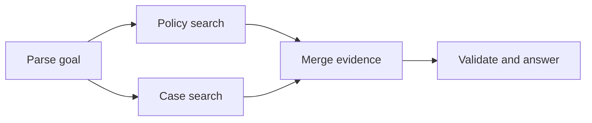

# DAG 工作流怎样表达依赖与并行

当任务依赖在执行前就能确定，可以把角色和处理步骤画成有向无环图，简称 **DAG**。图让并行关系、汇合点和失败传播显式化，适合稳定的研究与数据处理流程。

## 节点表示可重试的工作单元

节点有明确输入输出，不通过全局可变变量偷偷通信。边表示数据或控制依赖，只有前置节点达到允许终态，后继节点才可运行。图必须无环，动态循环通过外部状态机或条件路由表达。

例如“解析问题”完成后，规则检索和案例检索可以并行；两路 Evidence 汇合后，答案生成才能开始。

## 扇出和汇合需要稳定身份

扇出为每个分支分配唯一 ID、Scope 和 Deadline。汇合按 ID 收集结果，不能依赖完成顺序。并行节点若写同一列表，Reducer 要定义追加、去重或覆盖规则。

## 部分失败由汇合策略处理

汇合点可以要求全部成功、满足最小数量或允许带缺口继续。规则依据任务语义配置：合规比较缺一个地区就不能完成，补充案例缺一路也许可以返回有限结果。

失败节点保留错误码、重试次数和输入快照。只有可重试错误进入退避，参数错误和权限拒绝直接结束对应分支。

## 恢复从持久化节点状态开始

编排器保存每个节点的待执行、运行中、成功、失败和取消状态，以及输出引用。进程重启后只调度未完成节点，已确认结果继续复用。

有副作用节点必须用幂等键或补偿操作。Checkpoint 记住“运行到了哪”不代表外部系统会自动撤销。

## DAG 不适合未知依赖的探索

如果下一步取决于刚找到的证据，图结构会在运行中变化，Agent 循环或动态计划更自然。不要为了使用 DAG 预先生成大量可能永远不会执行的分支。

稳定骨架和动态节点可以组合：外层 DAG 负责入库、检索、验证，研究节点内部再运行有限循环。
