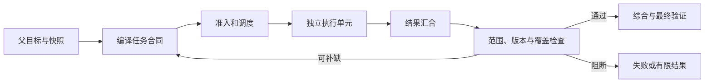

# 多 Agent 编排的职责、状态与成本

用户要核对一条正在生效的访问策略。回答依赖策略正文、活动 Release 和适用范围。三项查询可以并行，最终结论必须等它们汇合，并确认引用的是同一个版本。

把三个模型请求放进 `asyncio.gather()` 只能得到并发。系统还要知道谁拆任务、子任务能看到什么、哪个结果属于哪一支、失败后哪些下游应停止，以及父请求取消时谁回收未完成工作。

**Multi-Agent Orchestration（多 Agent 编排）** 用多个独立执行单元完成窄任务，由编排器保存全局目标、任务状态、资源账本和汇合规则。模型可以参与分解、执行与综合，身份、权限、预算和终态由 Runtime 管理。

## 多次模型调用不等于多个 Agent

同一个请求先分类、再生成、最后评分，虽然调用了三次模型，仍可能是一个固定工作流。判断系统是否具有多 Agent 边界，要看是否存在这些对象：

```text
独立 task_id 与局部状态
受限输入和工具集合
可单独取消、重试和验收的生命周期
结构化 TaskResult
明确的汇合与责任边界
```

多个 Agent 也不要求使用不同模型。相同模型在隔离上下文中执行三个任务合同，可以构成三个执行单元；不同供应商若共享同一自由文本状态，也未必形成清楚边界。

并行工具调用通常更轻。若一次 Runtime 能同时查询策略、Release 和 ACL，再直接合并结果，不需要为每个查询建立 Agent Loop。只有子任务确实需要局部规划、不同上下文、不同工具权限或较长生命周期时，独立 Agent 才有收益。

## 什么样的任务值得拆开

一个可分派子任务至少回答：目标是什么，输入引用有哪些，允许读取哪些范围，可以使用哪些工具，完成合同是什么，失败如何返回。

适合拆分的信号包括：

| 信号 | 可能收益 |
| --- | --- |
| 子任务拥有彼此独立的大量上下文 | 主 Agent 只接收压缩结果，减少污染 |
| 子任务可以并行，且关键路径明显缩短 | 降低墙钟时间 |
| 工具和权限集合可以收窄 | 减少选错工具与越权面 |
| 每支结果能独立验证 | 失败可局部重试或丢弃 |
| 需要不同故障域或独立复核 | 提高覆盖与容错证据 |

同一功能的规划、实现、测试如果高度共享上下文，强行交给三个角色会产生大量 Handoff。每次接收方都要重新理解隐含决策，协调成本可能超过执行本身。

按“研究员、分析师、写作者”拆分也容易得到角色表演。更稳的边界是“核对策略正文”“确认活动版本”“计算可见范围”，因为输入、输出和验收都能落到数据结构。

## TaskSpec 把子任务从 Prompt 变成合同

一个最小任务合同可以写成：

```text
TaskSpec {
  task_id
  objective
  depends_on
  input_refs
  allowed_scope_ids
  allowed_tools
  token_budget
  deadline
  required
  completion_contract
}
```

`task_id` 贯穿调度、事件、结果和重试。`objective` 是窄目标，不包含权限。Scope、工具和预算由父 Turn 的可信快照派生，子 Agent 不能在返回值中自行扩大。

`required` 决定失败传播。活动 Release 查询失败时，最终结论没有版本依据，应阻断汇合；一个可选的背景说明失败，可以在答案中标记缺失后继续。

输出同样要结构化：

```text
TaskResult {
  task_id
  status
  output_ref
  evidence_ids
  error_code
  usage
  state_revision
}
```

大正文和文件保存到工作区或对象存储，结果只携带稳定引用。这样父状态不会因多个子 Agent 的长文本快速膨胀，也便于删除和访问控制。

## 编排器拥有全局控制权

编排器的职责可以沿请求链理解：



任务分解可以由模型提出，编排器负责限制任务数、检测依赖和注入可信边界。调度器只启动依赖满足、预算获批的任务。结果收集按 `task_id` 归位，不能依赖完成顺序。

汇合阶段先验证，再综合。子 Agent 返回 200 或 `status=succeeded` 只说明局部执行结束，不证明 Evidence 属于当前 Release。范围、来源、冲突和必需覆盖在父边界重新检查。

综合器读取经过筛选的 TaskResult，生成候选答案。它不能用文风统一掩盖分支冲突，也不能把失败分支省略后声称覆盖完整。

## 状态应该归谁修改

多 Agent 系统最容易出现多个执行单元同时改同一自由文本状态。可恢复设计需要单写者或版本检查：

| 状态 | 主要写入方 | 其他组件如何参与 |
| --- | --- | --- |
| 父 Turn 终态 | 编排器 | 子 Agent 返回候选结果 |
| 子任务状态 | 调度器或任务仓库 | Worker 用条件更新提交 |
| Evidence 正文 | 检索与证据服务 | Agent 只保存引用 |
| 工作区对象 | 版本化 Workspace | 写入携带 expected revision |
| 预算账本 | Runtime | Agent 只能读取剩余额度 |
| 最终答案 | 综合与验证链 | 子 Agent 不直接交付用户 |

Worker 声称“整体完成”没有终止父任务的资格。父完成条件可能要求三个必需任务成功、冲突已处理、最终验证通过。相同原则也适用于取消，子 Agent 可以请求停止自己的任务，父取消由 Runtime 广播和确认。

共享工作区不是一个所有人随意覆盖的字典。每次写入带作者、任务 ID、来源和修订号。并发编辑同一对象时，旧修订写入失败，调用方重新读取后再合并。

## 并行收益取决于关键路径

三个任务分别耗时 2 秒、3 秒和 8 秒，完全并行的理论下限接近 8 秒，再加调度与汇合开销。它不会变成 `13 / 3` 秒，也不会因为 Agent 数量翻倍继续线性加速。

实际墙钟时间可粗略表示为：

```text
T_total = T_plan + T_critical_path + T_join + T_validate
```

子任务高度不均衡时，最慢分支决定关键路径。可以把大分支继续拆成可验证部分，前提是新增协调成本小于缩短的时间。

并发还受模型配额、数据库连接、浏览器实例和 CPU 限制。编排器通过 Semaphore 或资源租约限制全局与单用户并发。无限并发会触发限流与排队，使尾延迟更差。

## 预算要从父任务向下分配

每个 Worker 都看到“总预算 20k Token”，可能各自花满 20k。父预算必须由 Runtime 统一扣减：

```text
父 Turn 总预算
  规划保留
  子任务预算池
  汇合与验证保留
  故障重试保留
```

分配可以基于任务复杂度、是否位于关键路径和输出上限。所有分配加上保留额不能超过父上限。未使用额度可以回收，已开始调用的最大成本要先预留，避免并发分支同时超支。

Token 只是一个维度。外部 API 费用、工具调用数、浏览器时长、并发槽位和 Deadline 都应进入账本。子 Agent 产生新任务时先申请预算，再由编排器决定是否接受。

模型分层路由可以降低成本，但模型能力选择不交给 Worker 自报。Model Router 根据任务合同、风险、时限和当前供应商状态选择适配器，并保存版本。

## 部分失败怎样传播

多 Agent 并不自动容错。两个分支可能共享同一检索服务，失败仍会同时发生。容错要明确故障域和父任务政策。

子任务失败后，先按错误分类决定是否重试：超时和限流可以在总 Deadline 内有限重试；权限拒绝、非法参数和必需 Evidence 缺失不能通过重复调用消除。带副作用的任务还要先查询幂等结果。

父任务可以有几种策略：

```text
fail_fast        必需任务失败后取消尚未开始的下游
collect_partial  等待独立分支结束，交付带缺口结果
fallback         使用经过验证的替代能力
manual_review    保存当前状态，等待人处理
```

策略按任务重要性配置。不要在代码里捕获所有异常后继续综合，否则用户只会看到少了一段内容，却不知道关键证据已经失败。

取消要沿父子关系传播。父 Turn 进入 `cancel_requested` 后停止创建新任务，运行中的 Worker 在安全点退出，迟到结果保留作审计但不再写入活动汇合状态。

## 结果综合不能抹平证据差异

综合前先按稳定 ID 去重，检查版本和 Scope，再整理 Coverage。文本相似度只能辅助发现重复，不能把两条数值不同的 Evidence 合成一条。

冲突要显式进入输入：

```text
claim: 当前重试上限
branch A: 3 次，Release 8
branch B: 5 次，归档版本 6
resolution: B 非活动，不参与当前结论
```

若两个当前活动来源仍冲突，综合器不能“取平均”或选择表达更完整的一条。父任务返回冲突，或触发权威来源核对。

最终答案的引用绑定到原始 Evidence ID，不绑定子 Agent 的摘要文本。摘要可以丢失限定条件，原始证据才是 Claim 验证的依据。

## 可运行示例覆盖了哪些控制面

仓库中的 `multi_agent_control.py` 同时实现任务合同、DAG 执行、版本化工作区、Handoff 和 Swarm 门禁：

<<< ../../examples/ai-agent/multi_agent_control.py

这是教学用内存实现。它能验证任务 ID、依赖失败、并发上限、工作区修订冲突、重复提议和预算扣减。它没有持久化状态，没有真实消息队列、分布式 Lease、模型调用或 ACL 服务。

示例 Worker 由测试函数代替，测试通过只证明本地调度不变量。生产接入要增加任务仓库、Outbox、幂等键、心跳与恢复，并针对真实模型和工具做契约测试。

## 多 Agent Eval 应该测什么

| 场景 | 关键断言 |
| --- | --- |
| 单任务即可完成 | 不启用多 Agent |
| 三支独立查询 | 受并发上限约束并按 ID 汇合 |
| 子 Agent 提议扩大 Scope | 编排器拒绝 |
| 必需分支失败 | 下游按政策阻断 |
| 可选分支失败 | 结果明确标记缺口 |
| 父任务取消 | 不再创建子任务，迟到结果不提交 |
| 两支返回冲突版本 | 综合前显式裁决 |
| 并发工作区写入 | 旧 revision 失败 |
| 全局预算不足 | 新任务不获准入 |
| Worker 崩溃后重试 | 不重复已提交副作用 |

评测同时比较单 Agent 基线。若任务通过率相同，但 Token、延迟和故障面明显上升，多 Agent 没有带来可证明收益。适合的收益可能是更低关键路径、更高覆盖、更小上下文或更窄权限，必须选一个可测目标。

编排器的核心产物是可追踪的控制状态，团队感没有验收价值。每个执行单元拿到窄合同，所有结果经过身份与版本核验，全局预算只由 Runtime 扣减，失败沿依赖传播。完成这些工作后，多 Agent 才真正提供并行和隔离，简单复制循环只会增加成本。
