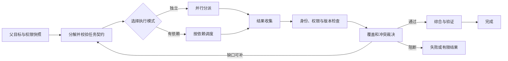

# 多 Agent 编排的职责、状态与成本

用户要求核对一条正在生效的访问策略。答案至少依赖三类材料：策略正文、当前活动版本、适用范围。三项查询互不依赖，可以同时执行；最终结论却必须等它们全部返回，并确认引用的是同一个版本。如果只把三个模型请求放进 `asyncio.gather()`，系统得到了并发，却还没有编排。

编排要处理的是并发之外的问题：谁把目标拆成子任务，哪个任务可以开始，哪些结果属于本次请求，冲突由谁裁决，父任务取消后谁负责停止子任务。模型可以参与分解和综合，这些全局决定仍要由程序保存并执行。

::: info 多 Agent 系统的最小组成

- **执行单元**：根据窄目标读取上下文、调用被允许的工具，返回结构化结果。
- **编排器**：保存任务图和全局预算，分派执行单元，处理汇合、取消与终态。
- **共享状态**：记录任务版本、Evidence、工作区修订号和事件，不能只存在聊天记录中。
- **结果验证**：检查来源、覆盖、冲突和权限，再决定是否允许综合。

:::

同一个模型配四份提示词，可以组成四个执行单元；四个不同模型也可能仍在一个固定工作流里。判断是不是多 Agent，主要看它是否存在多个独立状态边界、任务契约和结果汇合，而不是模型供应商或调用次数。

## 任务能够独立验证时才值得拆分

拆任务前要找真实的独立性。策略正文和活动版本可以分别查询，因为两项各自有明确输入、输出和验证方式。把“理解问题”“认真思考”“润色答案”拆成三个 Agent，边界无法验收，后两个执行单元只能反复解释前一个执行单元的文本。

一个可分派子任务通常能回答六个问题：目标是什么，需要哪些输入，可以看哪些资料，允许调用什么工具，怎样判断完成，失败时返回什么。少了其中任何一项，接收方都要从父任务的大段上下文里猜。

可以用四项条件评估是否拆分：

| 条件 | 适合拆分 | 不适合拆分 |
|---|---|---|
| 输入边界 | 每个子任务有稳定输入引用 | 依赖隐含在整段对话中 |
| 输出验收 | 能独立检查状态、证据或文件 | 只能评价“写得好不好” |
| 依赖关系 | 独立或依赖可以画成图 | 下一步由临时语感决定 |
| 协调成本 | 并发或专业分工能覆盖汇合成本 | 任务几秒即可确定性完成 |

**并行工具调用**也不等于多 Agent。一个运行时可以同时请求搜索、数据库和配置服务，随后由同一个状态机处理结果。这种做法更简单，通常应该先用。只有子任务需要不同上下文、工具权限、生命周期或局部决策循环时，独立执行单元才带来清晰边界。

冗余也要单独设计。多开一个执行单元不会自动获得容错，两个分支可能依赖同一个搜索服务，也可能同时复述同一条错误材料。真正的冗余需要不同故障域、明确的仲裁规则，以及“一个分支失败后是否还能交付”的政策。

## 编排器拥有全局控制权

编排器不必生成最多的文字，它负责维护全局一致性。一次任务从入口到终态，可以画成下面这条控制流：



入口先固定身份、知识版本、策略版本和 Deadline。分解器只能在这个范围内产生子任务，不能借“研究需要”扩大权限。任务图通过结构校验后，调度器才启动执行。所有子结果回到汇合点，再做范围、版本和 Evidence 检查。

编排器通常承担以下职责，但不必都交给模型：

**任务分解**可以由规则、模板或模型完成。结构稳定的报表用静态图更可靠；开放研究可以让模型提出候选子问题，再由程序限制数量、深度和工具。

**执行路由**根据依赖、时限和资源选择串行、并行或混合模式。路由结果要保存，不能在恢复时重新猜一遍，否则同一个 Turn 可能走向另一组分支。

**状态与预算**由程序管理。Token、工具调用次数、并发槽位和剩余时间都属于运行时事实，模型只能读取被允许的摘要，不能自行给额度充值。

**汇合与终态**需要确定性门禁。模型可以生成综合草稿，但哪些任务是必需的、哪些 Evidence 有效、冲突能否忽略，不能靠综合 Prompt 临时决定。

这套分工在真实知识 Agent 中很常见：程序先生成结构化 `SearchPlan`，每个检索分支带唯一 ID、通道、查询、范围、`top_k` 和 Deadline；运行时随后扇出检索，再并行执行重排、冲突、新鲜度和 ACL 审查。安全预处理一旦阻断，搜索分支和预检候选都会被清空，模型没有机会把已经拿到的候选偷偷带进答案。

## 任务契约把自然语言目标变成可执行输入

“查一下当前策略”不是完整任务契约。接收方不知道“当前”按哪个时间判断，也不知道可以访问哪个知识范围。更可执行的输入会把这些隐含条件写成字段：

```json
{
  "task_id": "policy-text",
  "objective": "读取当前活动 Release 中的远程访问策略正文",
  "depends_on": [],
  "context_refs": ["question:1", "scope:team-a", "release:2026-08"],
  "allowed_tools": ["search_policy"],
  "token_budget": 1200,
  "deadline_ms": 5000,
  "required_output": {
    "status": "succeeded | not_found | failed",
    "evidence_ids": "至少一个当前 Release 的来源 ID",
    "answer": "只返回策略约束，不做跨版本比较"
  }
}
```

`context_refs` 保存稳定引用，不把整份父上下文复制给每个分支。接收方按自己的权限读取引用，取不到就返回 `context_unavailable`。这种设计同时控制 Token 和数据暴露，也让审计人员知道分支实际看过什么。

`allowed_tools` 是上限，不是建议。执行单元请求列表外工具时，运行时拒绝动作并记录 `tool_not_allowed`。父任务有写权限，不代表研究分支也需要写权限；只读任务默认只获得检索和读取能力。

完成条件要能由程序检查。“给出高质量分析”没有稳定判定方式，“返回活动版本 ID、Evidence ID 和读取状态”则可以。自然语言结论仍可以存在，但应放在可验证字段旁边。

子任务失败也要返回结构，而不是抛出一段字符串后消失。`source_unavailable`、`deadline_reached`、`permission_denied` 和 `invalid_output` 对父任务的处理不同：来源暂时不可用可能重试，权限拒绝不能换一个更宽的账号继续，输出格式错误最多做有限修复。

## 状态所有权决定能否恢复

多 Agent 系统里的状态分为四层，混在一份消息数组里会很快失控。

| 状态 | 所有者 | 典型字段 | 写入规则 |
|---|---|---|---|
| 父任务快照 | 编排器 | 身份、Release、Policy、Deadline | 创建后不可变 |
| 子任务状态 | 调度器 | pending、running、succeeded、failed | 按状态机迁移 |
| 工作区内容 | 工作区服务 | 资料、草稿、派生对象、修订号 | 乐观并发或单写者 |
| Evidence 与结论 | 验证层 | 来源 ID、Claim、支持状态、冲突 | 只接受范围内来源 |

父任务快照回答“这次运行依据哪个世界”。即使执行期间活动 Release 发生切换，已经开始的 Turn 仍读取原快照，除非业务明确要求取消并重启。否则不同分支可能分别读取新旧版本，综合器再把它们写成一个看似一致的答案。

子任务状态要持久化。调度器先将任务从 `pending` 原子迁移到 `running`，记录执行者和租约，再启动工作。Worker 失联后，恢复器依据租约和幂等键判断是否重试；不能看到消息队列里还有任务就直接再跑一次。

共享工作区保存可复用中间结果，但它不是随便写的公共笔记。两个分支同时改同一个键时，要么规定单写者，要么带 `expected_revision` 做比较并交换。过期写入返回冲突，由编排器选择重新读取、创建新版本或放弃，不能默默覆盖。

Evidence 有独立身份。两个分支引用同一文档的同一段，汇合时应去重；同一个 URL 的不同版本可能是冲突来源，不能因为地址相同就合并。引用身份至少绑定知识对象、版本和片段位置。

## 并行、串行与混合模式怎样选择

策略正文、活动版本和适用范围互不依赖，可以并行检索。综合节点依赖三项结果，因此整体是一个混合图：前半段扇出，后半段汇合。

**并行模式**适合输入彼此独立、输出合同相同或可统一归一化的任务。并行降低的是等待时间，不会减少总计算量。三个分支各用 2000 Token，总成本仍接近三次调用之和，还会多出综合与验证开销。

**串行模式**用于后一步必须消费前一步结果的情况。比如先解析用户提到的项目别名，再用确定的实体 ID 检索版本。提前并行搜索所有可能实体会扩大范围，并产生难以清理的无关候选。

**混合模式**最常见。确定实体后，可以并行查询策略、版本和权限；三项完成后再汇合。真实依赖写在图里，比让模型在 Prompt 中自行判断“现在该等谁”容易测试。

并发度不是分支数量。系统有 30 个独立任务，也可能只开放 4 个并发槽位，剩余任务留在就绪队列。并发上限要同时考虑模型速率限制、数据库连接池、下游服务容量和内存。把所有任务同时启动，常见结果是限流、超时和重试一起发生，尾延迟反而更长。

## 一次策略核对任务怎样运行

输入为：“远程访问被拒绝，当前策略和活动版本是否匹配？”入口已经确认用户只能查看团队 A，创建以下快照：

```text
turn_id          = turn-42
scope            = team-a
release_id       = release-2026-08
policy_version   = policy-17
deadline         = 12 s
token_budget     = 8,000
```

编排器生成三个必需任务：`policy-text` 读取策略正文，`active-release` 确认活动版本，`access-scope` 读取当前用户的范围裁决。三者进入就绪队列，在并发上限 3 内同时启动。

运行轨迹可以记录成事件，而不是一段执行总结：

```text
seq=1  graph.accepted       tasks=3 release=release-2026-08
seq=2  task.started         task=policy-text worker=w1
seq=3  task.started         task=active-release worker=w2
seq=4  task.started         task=access-scope worker=w3
seq=5  task.succeeded       task=access-scope evidence=acl:team-a
seq=6  task.succeeded       task=active-release evidence=release:2026-08
seq=7  task.succeeded       task=policy-text evidence=policy:17#remote-access
seq=8  join.validated       required=3 succeeded=3 conflicts=0
seq=9  synthesis.completed  claims=2 evidence=3
seq=10 turn.completed       stop=answer_verified
```

每个事件只陈述程序已经确认的状态。`task.started` 不代表任务成功，`synthesis.completed` 也不代表答案可交付；最终终态要等引用和权限验证结束。

假设策略分支返回 `policy:16`，而活动版本分支证明当前是 `policy:17`。汇合节点不能选文字更完整的旧策略，也不能把两个版本平均综合。它应产生版本冲突，当前结论标为未知，然后决定是否在剩余时间内按 `policy:17` 精确补搜。补搜仍无结果时，返回“已确认活动版本，但未取得该版本策略正文”，而不是用旧版填空。

若安全预处理识别出绕过权限的指令，计划应在分派前变成零分支。即使并行预检已经产生候选，阻断路径也要丢弃这些内容，只返回安全拒答。这个顺序能防止“安全检查和快速检索同时执行，检索结果已经进入后续状态”的竞态。

## 汇合不是把子答案拼接起来

子任务全部显示 `succeeded`，整体仍可能不完整。策略正文有内容、版本有结果、范围也通过，但三项引用的实体不同，拼接只会把错误藏进一段流畅文本。

汇合先做身份归一化。Evidence 绑定对象 ID、版本和范围，转载、镜像或同一片段的不同检索通道合并为一个来源。随后检查必需任务是否完成、结果是否来自父快照允许的范围、时间与版本是否一致。

冲突要保留立场。来源 A 支持“允许远程访问”，来源 B 显示该规则已废止，两条材料不能在去重时丢一条，也不能让综合模型选择更像答案的那条。冲突记录至少包含涉及的 Claim、Evidence ID、版本和无法裁决的原因。

覆盖度由问题维度决定，不由字数决定。问题同时问“当前策略”和“为什么被拒绝”，只有策略正文仍不完整；取得权限裁决却没有活动版本，也不能判断策略是否过期。编排器应保存必需维度，综合器只能在已覆盖范围内下结论。

汇合还要区分可选任务。补充历史版本失败，不一定阻断“当前策略是什么”；活动版本查询失败则会阻断。`required` 应在计划里声明，不能等失败发生后为了交付临时把任务改成可选。

## 失败怎样跨执行单元传播

多 Agent 失败不是一个布尔值。至少要区分任务失败、依赖阻断、父任务取消、预算耗尽和验证失败。

任务自身失败时，执行单元返回稳定错误码与最后证据。调度器按策略决定是否重试。网络超时可以在 Deadline 内退避重试，权限拒绝和输入不合法没有重试价值。

必需依赖失败后，下游任务进入 `blocked`，不再启动。综合节点依赖策略正文，正文读取失败时继续调用模型只会产生没有依据的答案。可选依赖失败可以让下游继续，但输出必须携带缺口。

父任务收到取消时，编排器先持久化 `cancel_requested`，再向活动子任务传播取消信号。已经提交外部副作用的任务不能假装撤销，要记录回执并进入补偿或人工处理。只取消本地协程，会留下仍在远端运行的工具任务。

预算耗尽也要形成终态。系统保留已经验证的结果、未开始任务和缺失维度，返回 `budget_exhausted` 或有限答案。把剩余任务交给便宜模型不一定是降级，模型能力不足可能让关键验证失效；允许哪些阶段降级应提前写在策略里。

验证失败发生在综合后。引用缺失可以在不增加新事实的前提下修复绑定，答案与证据矛盾则要删除或重写相关 Claim。修复次数应有限，反复让同一个模型重写通常只会换措辞。

## 成本包含计算、等待和协调

多 Agent 的总成本可以拆成：

```text
总成本 = 子任务模型成本
       + 工具与检索成本
       + 编排和持久化成本
       + 综合与验证成本
       + 失败、重试和重复工作的期望成本
```

并行主要影响墙上时钟时间。三个 4 秒任务并行后可能在 5 秒左右汇合，但模型和工具费用并没有变成一份。综合上下文还会包含多份结果，输入 Token 可能比单 Agent 更高。

预算应分配给任务，而不是让每个执行单元看到父任务总额度。必需任务先获得最低预算，可选研究在剩余额度内启动。一个分支提前耗尽自己的预算，不得占用另一个必需分支的保留额度。

结果长度也要限制。研究分支返回全文会把综合器上下文塞满，更合适的结果包含候选 Claim、Evidence 引用、必要摘录和缺口。原文留在受控存储，综合器按引用读取需要的部分。

模型路由需要和任务风险绑定。实体规范化、格式校验等确定性步骤不必调用模型；开放分解可以用能力更强的模型；只读摘要可以使用成本较低的模型，但仍要经过来源验证。不能因为某个子任务“看起来简单”就移除权限和引用检查。

## 恢复时不能重新解释已经发生的动作

进程可能在任何事件之间退出。只读检索重复一次通常只是浪费，创建工单、发送通知或更新配置重复一次就会改变业务结果。编排器要在任务契约中区分纯读取、幂等写入和不可安全重放的副作用。

每次有副作用的动作都需要稳定 `action_id`。运行时先保存“准备执行”，再把 `action_id` 作为幂等键传给工具。工具返回业务回执后，运行时先持久化回执，再把结果交给执行单元。模型输出“已经提交”不能代替回执。

假设审批分支执行 `create_review_ticket`，外部服务已经创建 `ticket-73`，Worker 却在写回子任务状态前退出。恢复器会看到动作仍是 `started`，但不能直接再建一张工单。它先用 `action_id` 查询外部服务：能取得 `ticket-73` 就补写回执，查不到且工具承诺幂等时才重试。工具没有查询和幂等能力时，任务进入 `reconciliation_required`，交给人工或专门的对账流程。

Checkpoint 应放在可重入边界。任务图创建后、子任务领取后、外部回执保存后、汇合门禁通过后，都是有意义的检查点。模型生成到一半的任意 Token 不是恢复边界，除非供应商协议提供可以安全续接的响应引用，并且业务动作仍由自己的事件记录确认。

恢复还要重新验证权限和时限。父快照保存了本次请求的原始范围，用来保证分支之间一致；恢复时如果用户已经被禁用或租户被封锁，系统不能仅凭旧快照继续执行写操作。更准确的做法是保留原快照用于解释历史，同时执行当前安全策略要求的重新授权。读取旧证据是否允许、写入是否必须停止，由业务策略决定。

子任务状态迁移也需要比较条件。两个 Worker 同时认为租约过期并接管任务时，只有一个能把执行世代从 `generation=2` 更新到 `generation=3`。旧 Worker 随后返回结果，持久层发现世代不匹配，将结果记为迟到事件而不覆盖当前状态。没有执行世代或租约所有者，恢复很容易把旧结果当成最新结果。

父取消与恢复可能同时发生。恢复器加载到 `cancel_requested` 后，只能执行取消、回执确认和必要补偿，不能重新分派业务任务。终态写入采用一次性比较：`running` 可以转成 `cancelled` 或 `failed`，已经 `completed` 的任务不会被迟到取消改写。用户看到的状态由持久层确定，不由最后到达的模型消息确定。

## 评测要把三类质量分开

最终答案正确，不代表编排设计正确。一个分支碰巧从模型参数里写出答案，可能掩盖检索没有执行；三个重复分支得出同一结论，也可能把覆盖不足伪装成多数共识。评测需要分别观察计划、执行和交付。

**计划质量**检查子任务是否覆盖问题、依赖是否真实、是否重复研究，以及每个分支有没有超出父范围。固定用例可以给出必需维度和禁止范围，再比较生成的任务契约。任务数量不是分数，两个不重叠的分支往往比六个同义分支好。

**执行质量**检查每个任务的状态迁移、工具授权、Deadline、重试和 Evidence。可以故意让一个依赖超时，确认下游进入 `blocked`；让两个分支写同一修订号，确认冲突被保留；在父任务取消后返回迟到结果，确认它不会进入综合。

**交付质量**检查 Claim 是否由当前 Evidence 支持、必需维度是否覆盖、冲突是否明示，以及有限结果有没有冒充完整答案。同一个答案文本可以在不同证据状态下得到不同裁决：来源齐全时通过，活动版本缺失时只允许有限说明，权限范围错误时必须阻断。

延迟和成本要按阶段记录。只有总耗时，看不出慢在任务分解、排队、工具、最长分支还是综合；只有总 Token，也无法识别某个分支反复读取相同上下文。适合记录的指标包括就绪队列等待、活动并发、每任务预算消耗、分支重试、汇合缺口、冲突数和取消传播时间。

这些指标不能直接替代质量判断。并发度高、平均延迟低，可能同时伴随引用缺失。生产门禁应把安全与事实错误设为阻断项，再在合格结果中比较延迟和成本。否则优化器很容易通过少查资料、提前停止来获得更漂亮的性能数字。

回归集还应保留失败终态。成功样本只能证明正常路径能跑，不能证明某个分支失联后不会无限等待。权限拒绝、空结果、相互冲突、重复投递、预算耗尽和取消恢复都要有确定预期，才能验证编排器真正拥有全局控制权。

## 用可运行示例检查控制边界

下面的示例定义任务契约、版本化工作区、Handoff 包、DAG 执行器和 Swarm 全局门禁。它只验证本地控制逻辑，不调用真实模型或检索服务。

<<< ../../examples/ai-agent/multi_agent_control.py

`execute_dag` 先校验图，再按就绪批次运行任务。依赖失败后，下游得到 `dependency_failed`，不会继续综合。`VersionedWorkspace.append` 要求调用方提交预期修订号，旧写入会抛出 `WorkspaceConflict`。这些机制都不依赖 Prompt。

对应测试覆盖了三条容易被流畅输出掩盖的路径：独立任务先于综合任务执行；必需任务失败会阻断依赖者；两个写入者持有同一旧修订号时，第二次写入被拒绝。测试还验证 Swarm 重复动作和预算超限由全局门禁拦截。

运行方式如下：

```bash
cd examples/ai-agent
python3 -m unittest discover -s tests -p 'test_*.py'
```

这批测试证明的是调度、版本和门禁行为，不证明真实模型的任务分解质量。接入模型后，还要增加固定输入集，检查任务覆盖、重复分解、权限范围、Evidence 绑定和成本。

## 什么时候退回单 Agent 或固定工作流

任务步骤稳定、每一步都能由程序决定时，固定工作流更合适。文件上传、格式校验、病毒扫描、解析、切块和入库有明确顺序，不需要模型临时组织一支 Agent 队伍。

任务需要一个短循环，但上下文和权限一致时，单 Agent 加并行工具已经够用。让一个 Agent 同时查询策略、版本和范围，再由运行时汇合，比维护三个独立 Agent 简单。

多 Agent 更适合这些条件同时出现的任务：子问题可以独立验收；分支需要不同资料或工具；并行等待占比明显；结果有稳定汇合规则；系统能持久化状态并承担协调成本。少一项，都应先尝试更小的方案。

选型取舍可以落到一次容量评审里。单 Agent 的上下文较大，只维护一个状态边界；多 Agent 能隔离上下文和并行等待，同时新增任务图、结果归一化、跨分支取消、工作区冲突和综合调用。

单次工具等待只占很小比例时，新增的持久化与综合代价可能高于并行收益。三个分支各自需要不同权限时，强行塞进单 Agent 又会让它持有权限并集，扩大泄露和误调用的影响范围。不存在“任务数超过几项就拆分”的固定阈值，应拿真实 Trace 比较关键路径、总 Token、失败率和恢复复杂度。

维护成本也要计入。新增一个角色意味着多一份 Prompt 或策略版本、多一组评测样本和至少一个失败边界。团队无法回答“这个角色升级后哪些回归集需要重跑”时，角色拆分已经超过当前治理能力。反过来，多个业务领域长期共用一份巨大提示词，任何修改都会影响所有任务，独立契约可以缩小发布范围。取舍依据是边界能否被测试和独立发布，而不是角色名称是否像真实团队。

设计评审时，可以拿一次失败来检验架构：某个必需分支超时后，哪些节点停止，已经取得的 Evidence 保存在哪里，父取消怎样传播，用户最终看到什么，恢复会不会重复副作用。如果只能回答“编排器会处理”，系统还没有把责任写清楚。
