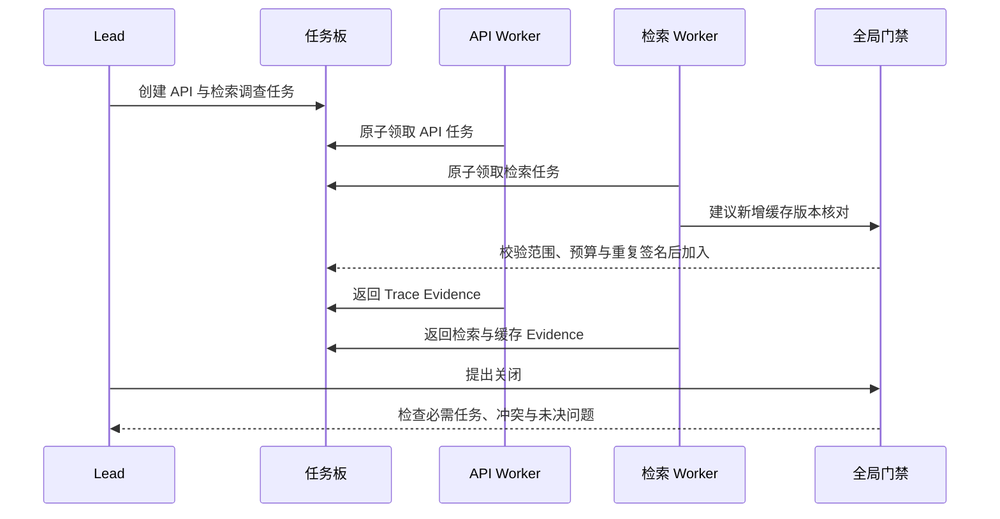

# Swarm 模式的局部协作与全局约束

调查一场跨服务故障时，最初只知道“搜索结果偶尔为空”。第一轮可能需要查 API、检索服务和知识版本；看到 Trace 后又发现某些请求命中了旧缓存，于是新增缓存与 Release 分支。任务图会随证据变化，提前写死全部节点并不自然。

Swarm 模式允许多个执行单元根据局部观察领取任务、提出新任务或把问题移交给更合适的执行单元。它减少中央编排器对每一步的预判，但没有取消平台控制。预算、权限、工作区一致性和停止条件仍由运行时统一执行。

::: info Swarm 中的两种控制

- **局部控制**：执行单元根据自己看到的任务、结果和消息，提出下一动作或协作者。
- **全局控制**：运行时验证权限、额度、重复签名、工作区版本和终止条件，决定动作能否发生。

:::

如果每个 Agent 都能自行扩权、无限创建同伴并宣布整体完成，那不是更灵活的协作，而是没有终态保证的多个循环。

## Swarm 与 DAG、Supervisor 的差别

DAG 在运行前固定主要依赖，调度器按就绪条件执行。Supervisor 模式由一个中央角色持续拆分和分派，子执行单元通常只完成收到的任务。Swarm 把一部分选择权交给局部执行单元：Worker 可以看到任务板或消息，决定领取什么、请求谁协助，以及是否产生新的待办。

| 模式 | 谁选择下一任务 | 全局图是否预先完整 | 适合的变化 |
|---|---|---|---|
| DAG | 调度器依据依赖 | 主要节点已知 | 稳定数据流和固定发布流程 |
| Supervisor | 中央编排器 | 可以逐步生成 | 目标开放，但中央角色能持续掌握全局 |
| Swarm | Lead 与 Worker 共同提出 | 运行中扩展 | 子问题随局部证据出现，协作者可按能力接手 |

Swarm 不是“所有执行单元地位完全相同”的同义词。工程实现常保留 Lead 或运行时服务：Lead 维护目标和完成定义，Worker 处理局部任务，平台保存状态并实施门禁。去中心化的是部分任务选择和通信，不是身份、权限和资源治理。

Swarm 也不等于群聊。把四个模型回复放进同一消息线程，大家轮流评论，缺少可领取任务、稳定结果和责任人，很快会产生同意、复述和无人收尾。协作需要任务与产物，消息只负责协调。

## 运行时状态让局部决策可追踪

一个可恢复 Swarm 至少保存任务板、Agent 注册表、共享工作区、点对点消息和全局账本。

任务板中的每项有稳定 `task_id`、目标、状态、负责人、依赖、优先级和完成条件。Worker 领取任务要做原子比较，只有 `pending` 能迁移到 `claimed`。两个 Worker 同时领取时，只允许一个成功，另一个重新选择任务。

Agent 注册表描述能力与权限，不使用“研究专家”这类无法执行的标签。更有用的字段是允许工具、可见范围、支持的输入类型、最大并发和当前租约。能力由配置和测试证明，不能由 Agent 自己在消息里声明。

共享工作区保存 Evidence、草稿、文件和派生对象。每次写入带作者、修订号和来源，覆盖写需要预期版本。工作区不是模型上下文的替代物，Agent 仍只读取完成局部任务所需的引用。

点对点消息用于请求澄清、通知依赖完成或协商移交。消息有发送者、接收者、关联任务和序号，不能把它当成最终结果。真正的任务完成要写任务状态与结果合同。

全局账本记录 Token、工具调用、创建任务数、Handoff 次数和剩余时间。每个 Agent 可以读自己相关的额度摘要，扣减由平台完成。模型输出“这一步成本很低”不能改变账本。

## Lead 负责目标和收敛，Worker 负责局部行动

Lead 的工作不是亲自重写所有结果。它接收父目标，建立初始任务和完成定义，观察任务板与覆盖缺口，在必要时补充任务，最终提出关闭候选。关闭仍要经过确定性门禁。

Worker 领取一个窄任务后运行自己的受限循环：读取允许的上下文，提出工具动作，保存 Evidence，更新工作区，返回结论或失败。它可以建议新增任务，比如发现缓存键没有绑定知识版本；平台校验任务签名、范围和预算后才加入任务板。



Lead 不能仅凭 Worker 数量判断完成。三个 Worker 都返回成功，可能重复查了同一条日志；一个 Worker 返回失败，却保留了足以定位问题的 Evidence。关闭条件要对父目标的必需维度、证据状态和风险负责。

Worker 也不能把局部完成写成整体结论。缓存分支确认键缺少 Release，只能报告本分支发现；是否解释所有空结果，还要结合 API 参数、检索范围和失败时间线。

## 局部动作先经过全局门禁

局部 Agent 可以提出动作，平台按固定顺序裁决。身份和权限先检查，随后检查任务状态、工作区版本、重复签名、预算和 Deadline。顺序很重要：未授权动作不应先消耗外部资源，再在账本里标记失败。

动作签名用于识别重复工作，可以组合任务 ID、动作类型、规范化参数和目标 Agent。两个 Agent 用不同措辞提出“查询当前缓存键是否包含 Release”，规范化后应得到相同签名。第一个动作已经活动时，第二个返回 `duplicate_proposal`，可以订阅现有结果，而不是再查一次。

重复检测不能只看文本哈希。“查缓存版本”和“确认缓存键包含活动 Release”语义相同，纯文本不同；“查团队 A”和“查团队 B”文本相近，范围却不同。任务规划器可以生成结构化实体与范围，程序以这些字段形成签名。模糊语义去重只能产生候选，不能误合并不同权限范围。

每次 Handoff 都增加通信和上下文成本。平台按任务记录移交次数，超过上限后返回 `handoff_limit`，要求当前负责人完成、交回 Lead 或明确失败。否则 A 认为 B 更擅长，B 又把任务交给 C，C 再交回 A，消息一直增长，状态没有变化。

工具仍受接收方权限约束。A 有配置写权限，把任务交给只读的 B，不会让 B 自动获得写权限；B 需要写操作时只能提出请求，由策略或人工审批。权限随消息传播会形成隐蔽的越权链。

预算裁决使用剩余额度，而不是最初额度。动作预计成本超过余额时，平台拒绝或选择预先批准的降级路径。Agent 不能通过创建新任务获得一份新预算，新任务从父 Swarm 的同一账本中预留。

## 共享工作区怎样避免相互覆盖

多个 Agent 需要看见彼此产物，但“大家写同一个 Markdown”不是稳定协作。常见设计是分区写入与版本化汇合。

每个任务先写自己的命名空间，比如 `tasks/api-trace/result`、`tasks/retrieval/result`。Evidence 保存稳定 ID 和来源，草稿只是派生内容。Lead 或专门综合节点读取这些结果，再写 `synthesis/v1`。分支没有权限直接覆盖综合结果。

需要共同维护结构时，写入带 `expected_revision`。API Worker 在修订 4 的工作区上补充时间线，缓存 Worker 也从修订 4 开始写。前者提交后修订变成 5，后者的写入被拒绝。缓存 Worker 读取修订 5，确认自己的字段没有冲突，再以修订 5 提交。

追加事件比覆盖整份对象更容易合并。Evidence、消息和任务状态都适合追加；“当前摘要”可以由事件重建或作为带版本的快照保存。直接用最后写入覆盖，会让网络较慢的旧 Agent 抹掉新结果。

Workspace 的 `since_seq` 读取允许 Worker 只获取上次看到之后的事件，减少上下文重复。序号只表示提交顺序，不表示 Evidence 的重要性。综合仍按来源、版本和相关性判断，不能认为后写的内容更新、更真。

大文件和工具结果留在对象存储，工作区保存引用、哈希、媒体类型和访问范围。把二进制、完整网页或几万行日志复制到每个 Agent 的消息，会同时造成 Token 浪费和敏感内容扩散。

## 一次空结果故障如何在 Swarm 中推进

父目标是“解释 10:00 到 10:20 之间团队 A 的知识问答为何间歇性返回空结果”。入口固定租户、时间范围、活动 Release 和只读工具，初始任务为 API 时间线、检索 Trace、Release 事件三项。

API Worker 发现空结果请求都带 `mode=fast`，保存请求 ID 与时间。检索 Worker 发现相同请求在缓存命中后没有候选，建议新增“缓存键版本”任务。Release Worker 发现 10:07 激活了新版本，但不能单独证明缓存问题。

全局门禁检查新任务仍在团队 A 范围内，签名没有重复，预算足够，于是加入任务板。缓存 Worker 读取 10:07 前后的键摘要，确认键只包含查询和范围，没有 Release；10:07 后旧空结果继续命中。它返回缓存 Evidence 与失效策略配置，不直接修改生产缓存。

Lead 将必需维度标记为：空结果时间线、缓存身份、Release 切换、检索原始结果。此时前三项有证据，原始检索分支仍在运行。即使因果链已经很像，关闭门禁也不允许提前完成，因为还要排除新 Release 本身没有数据。

原始检索 Worker 绕过结果缓存，在同一权限与 Release 下取得正常候选，证明索引可用。综合节点生成候选结论：缓存键没有绑定知识 Release，版本切换后复用了旧空结果。每个前提绑定对应 Evidence，时间范围限制在本次观测窗口。

这次执行可以留下以下状态变化：

```text
task api-timeline     succeeded  evidence=req:17,req:23
task retrieval-trace succeeded  evidence=trace:17,trace:23
task release-events  succeeded  evidence=release:event-9
task cache-version   succeeded  evidence=cache:key-shape,config:cache-v3
workspace_revision   11
new_tasks            1
duplicate_proposals  0
stop_reason          coverage_complete
```

若绕过缓存后仍为空，当前假设就不成立。Swarm 需要保留反证，Lead 重新打开缺口，而不是让缓存 Worker 修改措辞继续维护自己的判断。局部自主的价值在于更快发现分支，不能演变成每个 Agent 捍卫自己的结论。

## 收敛要观察状态变化和覆盖变化

Swarm 不知道预先的最后一个节点，必须显式判断何时停止。常见信号包括必需任务完成、覆盖完整、关键冲突已裁决、没有活动写操作、预算或 Deadline 到达。

只检查任务板为空不够。Agent 可能不断创建新任务，队列永远不空；也可能所有 Worker 都空闲，但有一个无人认领的必需任务。运行时要区分活动、待领、被阻断和未分配。

边际进展可以按新 Evidence、已关闭缺口和状态变化衡量。连续两轮动作没有新增 Evidence，也没有改变任何必需维度，说明 Swarm 可能在换措辞或重复搜索。门禁返回 `no_progress`，由 Lead 收敛现有结果或请求人工判断。

重复动作检测提供更细信号。相同 Agent 连续提出同一工具调用、多个 Agent 围绕同一任务循环 Handoff、工作区只增加摘要却没有新来源，都应计入停滞。单次重复可能是合法重试，需要结合错误类和状态变化判断。

达到预算或 Deadline 时要停止创建新任务，取消未开始任务，并给活动只读任务一个受控收尾窗口。最终结果列出已经支持的结论、未决问题和停止原因。为了让报告看起来完整而补写未知部分，会抹掉 Swarm 最需要保留的边界。

人工介入也属于终态的一种。高风险冲突、需要扩权或不可逆工具动作出现时，运行时创建审批请求并保存 Checkpoint。人工回复关联原任务和工作区修订号；回复到达时如果任务版本已经变化，应重新确认，而不是执行过期批准。

## 常见失控路径怎样处理

局部最优会损害父目标。每个 Worker 都选择最容易完成的资料，难查的必需维度无人领取。任务板需要优先级和必需标记，Lead 也要在分派时保留资源给难任务。

重复研究会制造虚假共识。三个 Agent 检索到同一篇转载，综合层若按结果数量投票，就把一个来源算成三票。Evidence 先按来源血缘和稳定身份归一化，再讨论支持或冲突。

消息风暴来自过度广播。每个状态变化都发给所有 Agent，会快速占满上下文。消息默认点对点，只有目标、全局政策、关键阻断和关闭候选适合广播；Worker 通过任务板与 `since_seq` 主动读取需要的更新。

上下文污染会跨 Agent 传播。网页中的不可信指令被 Worker 写进公共摘要，其他 Agent 可能把它当平台命令。工作区字段要标记信任级别，检索正文只能作为 Evidence 内容，不能覆盖任务目标、工具权限或系统策略。

孤儿任务出现在 Worker 失联但租约未处理时。平台周期续租，租约过期后任务回到可领取状态并增加执行世代。旧 Worker 迟到结果只能进入隔离记录，不能覆盖新世代。

Lead 自身也是故障点。目标、任务板和关闭条件不能只放在 Lead 上下文里。Lead 重启后从持久状态恢复；如果使用另一个 Lead 接管，它读取相同的父快照和事件，而不是重新解释原始聊天后生成另一套目标。

## 权限和成本限制必须对所有 Agent 一致

每个 Agent 拿到最小权限，平台按父身份和局部任务求交集。工具返回的数据也要重新检查范围，尤其是缓存命中、共享工作区和点对点消息。发送者有权看到的内容，不代表接收者也有权。

Swarm 的成本包括局部模型调用、工具、消息、工作区读写、重复检测、Lead 综合和验证。Agent 数量增加时，通信与综合成本可能增长得比有效工作快。监控应记录每个完成维度消耗了多少动作和 Token，而不是只记录总 Agent 数。

降低成本可以从减少重复上下文、延迟加载工具和限制广播开始。用更便宜模型替换所有 Worker 并不一定省钱，能力不足会产生更多重试、Handoff 和无效任务。模型路由要结合任务难度与评测结果。

Swarm 适合异步等待明显、任务边界可验收且子问题会随证据出现的场景。代码库中互不重叠的模块调查、跨来源研究和多服务故障分析都可能受益。单文件改动、固定审批或只有一个不可分割产物时，DAG、单 Agent 或普通程序更合适。

## 租约、消息顺序与恢复边界

先把职责和状态所有者写清楚。Lead 负责父目标、必需维度和关闭候选，Worker 负责自己领取的局部任务，任务板负责租约与世代，工作区负责带修订的产物，策略服务负责权限与预算。任何组件都不能因为“看到了结果”就替另一个所有者改状态；跨边界的变化必须通过带版本的事件提交。

局部自治不能依赖进程一直在线。任务被 Worker 领取时，运行时写入 `lease_id`、执行世代和过期时间；Worker 需要在处理期间续租。续租失败不等于任务立刻失败，平台还要等待一个短暂的宽限窗口，确认网络抖动还是进程确实失联。超过宽限后，任务才回到 `pending`，并递增 `execution_generation`。旧 Worker 即使稍后恢复，也只能提交带旧世代的结果，状态存储按条件更新拒绝它。

消息也要有顺序语义。点对点消息使用单调 `seq`，接收方保存最后确认的序号。收到序号 8 后再收到 6，不能直接覆盖当前上下文；程序要么丢弃重复消息，要么请求从 7 开始重放。消息正文里的“请扩大搜索范围”只是数据，真正的范围变化要通过任务板上的版本化命令完成。这样既能处理重复投递，也能避免一个迟到的建议改变已经关闭的任务。

父任务取消时，取消信号沿任务关系传播。正在等待只读检索的 Worker 可以在安全边界退出，持有外部 Lease 的 Worker 先停止续租并写入 `cancelled`，已经提交外部副作用的 Worker 则必须查询回执或执行补偿。不能用删除任务记录的方式表示取消，因为删除会让审计者无法区分“没有创建过”和“创建后被撤回”。

恢复从最近一个持久化边界开始。任务板、工作区修订和消息确认序号至少要在动作前后形成一致快照；如果 Lead 在提出关闭候选后崩溃，接管者应重新读取未决任务和冲突，而不是重新调用模型解释原始目标。只有关闭门禁再次确认覆盖完整、没有旧世代写入和所有必要租约结束后，才能发出完成事件。

这种设计有明确代价。租约、消息序号和执行世代增加了存储与清理工作，恢复扫描也会占用数据库连接；但它换来了迟到结果可识别、重复动作可拒绝和故障后可继续的性质。若任务没有跨进程等待、没有共享写入，也没有不可逆动作，内存队列加单次循环更简单，没必要为了“看起来像 Swarm”引入完整恢复协议。

## 如何把 Swarm 变成可验收的工程接口

接口评审时先列出三份清单。第一份是任务清单，写明每个 `task_id` 的目标、输入引用、完成条件、负责人和允许动作；第二份是状态清单，写明哪些字段由 Lead、Worker 或平台写入，哪些字段只能追加；第三份是交付清单，写明最终答案需要的 Evidence、缺口、冲突和停止原因。三份清单都能落到测试断言，才算真正的协作接口。

可以把一次研究验收写成如下表格：

| 验收对象 | 必须回答的问题 | 可接受证据 | 不足时的终态 |
| --- | --- | --- | --- |
| 任务板 | 必需维度是否都有负责人 | 任务状态、租约、完成条件 | `incomplete` |
| 工作区 | 结果是否来自当前修订 | 来源 ID、修订号、写入事件 | `conflict` |
| 权限 | 每个 Worker 是否只读到允许范围 | 身份快照、Scope、策略版本 | `rejected` |
| 关闭候选 | 结论是否覆盖目标 | Claim、Evidence、缺口清单 | `needs_review` |
| 交付事件 | 客户端能否恢复读取 | 事件序号、终态记录 | `delivery_pending` |

表格中的“可接受”不是质量分数。它只是说明系统在什么条件下允许迁移状态，结论本身仍要由主题评测判断。对于冲突证据，平台只能确保冲突被保存并交给裁决者，不能因为结构合法就自动选择其中一条。

在代码实现中，先做确定性门禁，再调用模型或工具。任务签名、权限求交、版本比较、预算扣减和状态迁移都应有独立函数；模型只接收这些函数已经确认的上下文。测试可以把 Lead 和 Worker 换成脚本化适配器，固定提出重复动作、越权动作和迟到写入，检查它们都在外部副作用前被拒绝。真实模型评测另行检查它是否能根据局部观察提出有价值的下一任务，不能用能力分数替代控制门禁。

当 Swarm 的任务数量增长时，先观察“每个完成维度消耗的动作数”和“重复提议占比”，再决定是否增加并发。只看平均延迟会掩盖一个 Worker 反复失败、另一个 Worker 等待共享锁的情况。容量接近上限时，平台应停止创建低优先级任务，保留必需维度的预算，并在结果中明确哪些工作没有开始。对用户而言，一份带缺口的真实报告比一份把未知补成确定结论的完整报告更可用。

一次移交的验收记录至少包含五个时间点：发送方冻结快照、接收方接受合同、首次外部调用、最后一次工作区写入和返回结果。把这些时间点与 `handoff_id`、`workspace_revision`、工具 `call_id` 关联起来，才能回答“接收方使用的是哪一版资料”和“取消发生时是否已经产生副作用”。只记录最终摘要，无法区分接收前拒绝、接收后超时和返回后交付失败。

这份记录还应能被恢复程序消费。扫描器发现 `claimed` 任务的 Lease 已过期时，只增加一个接管事件，不删除原事件；审查器看到旧世代写入时，把它放进冲突队列；交付端根据最后确认的事件序号重放通知。每个动作都有明确的负责人和状态所有者，故障定位才不会退化成重新询问所有 Agent。

恢复完成后仍要重新计算覆盖和预算，不能直接沿用崩溃前的关闭标记。

## 示例中的全局门禁怎样工作

共享示例用 `SwarmProposal` 表示局部动作，`SwarmGate` 保存允许工具、剩余预算、重复签名和每任务 Handoff 次数。它没有模拟模型对话，只验证平台必须掌握的控制条件。这个边界很重要：示例能证明同一提议不会被重复放行，却不能证明某个模型一定会发现缓存版本问题；后者需要另行准备固定输入的能力评测。

<<< ../../examples/ai-agent/multi_agent_control.py

测试先接纳一个成本为 3 的搜索动作，再提交完全相同的动作，得到 `duplicate_proposal`；剩余预算只有 2 时，另一个成本为 3 的动作得到 `budget_exhausted`。拒绝发生在工具执行前，账本不会因重复动作再次扣减。为了确认这不是测试桩的偶然行为，可以把动作顺序打乱、把参数键改成不同顺序，再断言规范化后的签名仍然一致；如果把租户范围改掉，则应当生成另一条合法提议，而不是误判为重复。

```bash
cd examples/ai-agent
python3 -m unittest discover -s tests -p 'test_*.py'
```

真实系统还要测试原子领取、租约接管、消息权限、工作区迟到写入、父取消和 Lead 恢复。模型能力评测与控制测试分开：前者判断能否提出有价值的局部任务，后者保证模型提议不能绕过平台边界。

发布前可以注入一条完整故障：Lead 在缓存分支提交后崩溃，旧 Worker 在租约过期后迟到，新的 Lead 随后接管。验收不能只看“最后有答案”，还要确认新世代只接管未完成任务、旧结果进入隔离记录、重复签名没有再次消耗预算，且关闭候选重新经过覆盖检查。

评审 Swarm 时，可以沿一个动作检查七件事：提出者、所依据的局部状态、平台门禁、被修改的版本、其他 Agent 的获知方式、重复动作的处理以及停止条件。这些信息都应进入持久化记录。

局部选择减少中央调度等待，同时增加任务发现、冲突合并和消息风暴的状态成本；全局门禁让高风险动作可审计，却可能把吞吐限制在策略服务和工作区写入能力上。问题可以用静态依赖图表达时，优先选择 DAG。只有新证据确实会改变任务集合，才值得承担 Swarm 的额外代价。

评审结论还要记录退出条件，避免“先并行试试”变成没有终点的长期运行模式。
