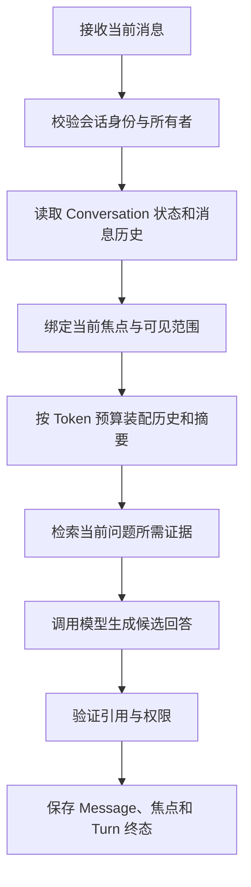

# 多轮对话怎样保存状态与处理指代

用户先问“远程访问规范里有哪些审批条件”，系统找到了《远程访问规范》并给出回答。第二轮只有一句：“它什么时候生效？”

人能从上一轮看出“它”指那份规范，模型却不会自动拥有这段关系。应用必须重新加载会话，确认上一轮关注的是哪份文档，检查当前用户是否仍能访问它，再把必要历史放进本次模型输入。如果只把两句话拼起来，模型也许能猜对；一旦出现两份同名文档、用户切换知识范围、两个请求并发或旧权限已经撤回，猜测就会变成串话或越权。

::: info 多轮对话保存的不是一段不断变长的 Prompt

**Conversation** 保存跨轮次仍然有效的会话身份和焦点；**Turn** 表示一次从用户输入到终态的处理；**Message** 是用户、助手或工具产生的有序记录。模型每次仍处理一个有限输入，连续性来自应用重新装配这些状态。

:::

多轮对话的核心工作有两件：一是保存足以解释下一轮的状态，二是在每次请求开始时重新验证这些状态。历史消息、摘要和长期记忆都能提供线索，却不能替代当前权限、活动知识版本和真实业务状态。

## 第二轮对话仍然是一次完整请求

聊天界面容易给人一种错觉：消息不断往下追加，模型像人一样一直坐在对面。实际调用通常是离散的。第一轮返回后，模型进程不会替应用永久保管焦点；第二轮到来时，应用需要把当前问题、必要历史、会话状态、检索证据和规则重新编译成输入。

以“它什么时候生效”为例，这个短句至少缺少三个信息：指代对象是什么，用户当前能否访问该对象，问题里的“生效”对应发布日期、审批完成时间还是策略启用时间。它不是把上一轮全部复制进 Prompt 就能稳定解决的问题。复制历史只提供语言线索，**对象身份和访问范围仍要由应用确认**。

一次多轮请求可以拆成下面这条链路：



这张图里有两个容易混在一起的“状态”。Conversation 状态帮助解释当前问题，例如最近关注的文档；Turn 状态记录本次请求走到哪一步，例如正在检索、已经完成或因权限变化被拒绝。前者跨轮次延续，后者服务于执行、恢复和审计。把两者都塞进一段自由文本，系统就无法可靠处理并发和失败。

## Conversation、Turn 与 Message 各自负责什么

三个对象的生命周期不同，拆开后才能回答“谁可以修改状态”和“失败后从哪里恢复”。

| 对象 | 典型字段 | 生命周期 | 主要职责 |
| --- | --- | --- | --- |
| Conversation | `conversation_id`、`owner_id`、当前焦点、状态修订号 | 多个请求 | 维持会话身份、焦点和跨轮次状态 |
| Turn | `turn_id`、输入快照、状态、截止时间、错误码 | 一次请求 | 保存执行过程、终态、取消和恢复边界 |
| Message | `message_id`、`role`、内容、父消息、时间 | 一条记录 | 还原用户输入、助手回答或工具结果的顺序 |

### Conversation 是状态容器，不是权限凭证

`conversation_id` 用来定位会话，但不能单独证明调用者有权读取它。服务端还要用当前认证身份、知识库范围或租户标识查询会话。客户端如果传来别人的 ID，接口应返回与“会话不存在”一致的结果，避免向调用者泄露某个 ID 是否真实存在。

Conversation 适合保存当前焦点、待澄清对象、最近引用节点和状态修订号。它不应保存已经有权威来源的业务事实副本。比如“规范已启用”来自发布系统或活动知识版本；会话里最多保存 `document_id` 和当时看到的版本，下一轮使用前仍要查询当前状态。

### Turn 把一次处理固定下来

一次用户输入对应一个 Turn。Turn 在开始时冻结必要快照，例如用户身份、允许访问的范围、知识 Release、策略版本和绝对 Deadline。后续模型、检索器和工具只读取这份快照，不能从用户消息里补出新的 Scope，也不能在失败重试时悄悄换到另一个知识版本。

同步聊天也需要 Turn。HTTP 连接断开只说明客户端没收到结果，不代表服务端没有完成。Turn 有稳定 ID 和终态后，客户端才能重新查询；否则每次刷新都可能重复执行检索、工具或其他副作用。

### Message 保存事实记录，摘要只是派生物

Message 是不可变的对话记录。助手消息应关联对应的用户消息，工具调用和工具结果也应保持成组关系。这样在裁剪历史时，不会只留下“工具返回批准”却丢掉工具名称和参数，也不会留下一个 Tool Call 却没有结果。

摘要、标题和向量表示都由 Message 派生。它们可以删除后重建，不能反过来覆盖原消息。摘要模型把“预计周一生效”写成“周一生效”时，原消息仍是追查信息损失的依据。

## 会话状态要有明确所有者

当前焦点常用一个结构化引用表示：对象类型、稳定 ID、可选节点 ID 和显示标题。显示标题方便界面展示，稳定 ID 才用于查询。只存“远程访问规范”这个标题，在存在同名文档时无法确定下一轮指向谁。

```text
focus = {
  kind: "document",
  object_id: "document-7",
  title: "远程访问规范"
}
revision = 4
```

焦点由完成对象解析的组件更新，检索器和模型只能提出候选。保存时带上 `expected_revision=4`，数据库仅在当前修订仍为 4 时写入修订 5。若另一轮已经把焦点更新为修订 5，迟到请求不能覆盖它，而应以 `conversation_revision_conflict` 结束或重新读取状态。

::: warning 并发会话不能采用最后写入者胜出

用户连续发送两条消息时，两个 Turn 可能同时读取同一个旧焦点。完成较慢的请求若无条件保存，会把较新的焦点覆盖掉。修订号、条件更新或串行化队列至少要有一种，Prompt 里的“请保持上下文一致”解决不了写冲突。

:::

待澄清状态也属于 Conversation。上一轮找到两份同名规范时，可以保存候选 ID 和 `clarification_id`；用户回复“第二份”，服务端必须校验这个澄清 ID 仍然属于当前会话和当前用户。若候选已经过期或权限变化，应重新澄清，不能按列表位置盲选。

## 一次“它什么时候生效”的完整数据流

假设第一轮已经完成，Conversation 状态是修订 4，焦点指向 `document-7`。第二轮输入如下：

```json
{
  "conversation_id": "conversation-1",
  "message": "它什么时候生效？",
  "expected_revision": 4
}
```

入口从认证信息取得 `user-1`，而不是相信请求体里的用户字段。会话仓库用 `conversation_id + owner_id` 读取状态；不存在和无权访问都返回 `conversation_not_found`。随后应用用当前 Scope 查询 `document-7`，确认它仍可见，再把“它”绑定为这份文档。绑定结果应保留对象 ID 和会话修订号：

```json
{
  "question": "它什么时候生效？",
  "focus": {
    "kind": "document",
    "object_id": "document-7",
    "title": "远程访问规范"
  },
  "state_revision": 4
}
```

上下文编译器接着选择最近消息。系统规则、当前问题和已经确认的焦点属于必需材料；较早闲聊可以裁剪。检索查询不应只用代词原句，而要带入已确认对象，例如按文档 ID 限定范围并查询生效条件。检索若只返回草案内容，回答验证器不能把它写成已生效。

正常路径的调用顺序是：

1. 会话仓库读取修订 4 和焦点。
2. 授权组件确认 `document-7` 在当前用户可见范围内。
3. 上下文编译器选择最近完整消息，并加载已保存摘要。
4. 检索器在该文档和当前知识版本中查找生效信息。
5. 模型根据证据生成候选回答。
6. 验证器核对 Claim、Citation、Scope 和 Release。
7. 仓库保存助手 Message，并用条件更新提交新的焦点或修订。

输出不能只有一段文字。至少还要留下 `turn_id`、引用的对象 ID、输入修订、使用的知识版本、终态和错误码。这样当用户说“刚才的答案引用了旧版本”时，可以区分检索命中了旧索引、Turn 固定了旧 Release，还是界面复用了旧消息。

如果第二步发现文档不可见，链路在模型调用前结束，输出是稳定的权限拒绝，而不是让模型根据旧历史继续回答。这个失败的证据包括：当前 `turn_id`、焦点 ID、授权检查结果和停止阶段。历史里曾经出现过文档内容，不能成为继续使用它的理由。

## 历史装配要保留关系，而不只是保留最近 N 条

按消息数量裁剪很直观，却容易切断语义单元。一次工具交互可能包含助手提出 Tool Call、工具返回结果、助手解释结果三条消息；保留其中一半，模型会看到缺少来源的结论。更稳的做法是给同一轮或同一次工具交互设置 `group_id`，按组计算成本和取舍。

本项目的共享示例从最近一组向前装入历史，并先保留标记为 `required` 的当前问题。假设预算只能容纳 48 个估算 Token，最早一组问答会整体移除，最近的工具调用、工具结果和当前追问一起保留。窗口结果同时返回 `omitted_message_ids`，Trace 因而能解释哪些内容没有进入模型。

消息窗口只是容量控制。对话继续增长后，需要把较早部分压成滚动摘要，同时保留最近消息全文。摘要记录至少包含来源消息范围、摘要版本和已覆盖的消息数量；再次压缩时，把旧摘要与新增的旧消息合并，不能重复摘要整个会话，也不能让同一消息同时出现在摘要和最近历史中。

摘要服务失败时，当前请求不一定要整体失败。确定性降级可以跳过摘要生成，只按 Token 预算保留最近历史，并把 `compression=deterministic_trim` 写入 Trace。这个回答可能缺少较早语境，应用应限制语气或要求用户补充，不能假装摘要已经成功。

### Token 预算按模型输入计算

数据库可以保存数百条 Message，不等于每次都要发送数百条。存储保留量和模型输入量是两个配置：前者受审计、隐私和成本约束，后者受模型上下文窗口、输出预留、证据长度和当前问题影响。

上下文预算应先预留输出和安全空间，再给规则、证据、最近历史、摘要和长期记忆分配额度。证据密集的问答通常提高证据占比，闲聊型助手可以给最近历史更多空间。无论比例怎样变化，当前问题和权限规则都不能被旧历史挤掉；必需材料本身已经超预算时，应拒绝或换更大窗口，而不是静默截断规则。

::: tip 摘要和长期记忆属于不同区域

摘要来自当前 Conversation 的旧消息，用来保持本次会话连续；长期记忆来自其他会话的候选信息，只能作为非事实上下文。两者必须带不同来源标签，模型不能把“用户以前问过什么”当成企业事实证据。

:::

## 指代解析依赖焦点，也受权限和版本约束

“它”“那个方案”“第二份”“刚才说的审批”都可能需要指代解析。语言模型适合从文本中提出候选实体，应用负责把候选限制在当前可见对象里，并保存最终绑定结果。

只有一个可见焦点时，代词可以绑定到该对象；存在两个合理候选时，系统应发起澄清。用户已经显式给出新的文档名，则显式对象优先，并在解析成功后更新焦点。上一轮焦点不可见时，系统不能退回更早的可见对象假装理解，也不能把标题相似的另一份文档自动替换进来。

一套可解释的优先顺序可以是：

1. 当前消息里的稳定 ID 或经过解析的显式对象。
2. 尚未过期的澄清候选。
3. 当前 Conversation 的可见焦点。
4. 最近消息中出现、且仍在当前 Scope 内的对象。
5. 无法唯一确定时返回澄清问题。

这段顺序适合由程序执行，模型只参与候选提取和澄清文案。把“选哪个对象”完全交给模型后，同一句追问可能因温度、历史裁剪或模型升级绑定到不同对象，问题很难通过数据库和日志还原。

焦点还要绑定版本。上一轮查看的是规范 Release 7，第二轮开始时活动版本已经变成 Release 8，应用需要按业务语义选择：问“刚才那版”可以继续读取快照；问“现在什么时候生效”则应使用活动版本。这个选择必须显式记录，不能混用两个版本的段落生成一个看似完整的答案。

## 会话存储、缓存和租户隔离

单进程演示可以把 Conversation 放在内存字典中，生产服务通常要用持久存储支持重启、扩容和审计。Redis 可以保存带 TTL 的热会话，关系数据库可以保存 Message、Turn 和不可变状态记录；也可以由数据库承担权威存储，再加进程内短缓存。具体选型取决于恢复要求，不存在所有 Agent 都必须采用的两级缓存配置。

缓存命中后仍要检查所有者。只把 `conversation_id` 作为缓存键，或者只在数据库查询时加 `owner_id`，都会留下跨租户读取风险。缓存键、读取条件、更新条件、删除任务和指标标签都要携带租户或用户边界。错误响应不区分“不存在”和“无权访问”，服务端日志则可以记录真正原因供安全审计。

缓存不可用时有三种处理方式。权威存储仍可承受流量，可以绕过缓存；持久层和缓存紧耦合，则快速失败并避免请求堆积；少量非关键会话可以退化成无状态单轮回答，但界面必须明确历史未加载。熔断器负责在连续失败时暂时停止访问故障依赖，不能用旧缓存绕过当前授权检查。

会话 ID 必须由服务端生成或严格校验。即使 ID 足够随机，服务端也不能把“难猜”当成授权。创建接口收到一个已存在但不属于当前用户的 ID 时，应生成新 ID 或拒绝请求，不能复用那条会话。

## 隐私、标题和语义去重是会话的伴生能力

多轮系统保存的内容比单轮请求多，隐私暴露面也随之增加。用户可能在消息里贴邮箱、电话、令牌、订单号或内部地址；这些内容会进入原始消息、摘要、长期记忆候选、向量索引、日志和 Trace。只在界面显示时打码，前面的副本仍然存在。

隐私处理要先画数据流，再决定在哪些边界脱敏。原始消息是否必须保存、保存多久、谁能读取，要由产品和合规要求决定；用于摘要、记忆和搜索的派生文本通常可以在写入前去除不必要的敏感字段。正则只能覆盖格式稳定的类型，不能声称识别了所有个人信息。误报也会损坏上下文，因此需要保留受控的原始来源引用和可审计的转换记录。

会话标题只是导航辅助，不应参与事实检索。常见做法是在首轮有效消息后生成一次标题，已有标题就直接返回，避免每次请求重复调用模型。生成失败时，可以按 Unicode 字符安全截取首个问题作为降级；按字节截断中文可能产生损坏文本。用户手动修改标题后，应把它标成用户所有，后台任务不能再覆盖。

跨会话召回也会带来重复。多条历史问题可能表达同一个偏好或纠正，直接取 Top K 会把相似内容塞满记忆预算。可以先按稳定 ID 和规范化文本去重，再用相关性与多样性共同选择候选。MMR 是一种可选算法，不是会话正确性的前提；权限过滤必须发生在它之前，最终记忆仍标为非事实上下文。

### 删除会话要处理所有派生副本

删除一条 Conversation 不能只删聊天列表里的主记录。原始 Message 可能已经生成摘要、标题、长期记忆候选、Embedding、检索缓存和离线评测样本；后台任务也可能正拿着旧版本继续处理。删除命令需要先写入删除版本或撤回标记，使新请求和未完成任务停止读取，再按数据清单清理派生副本。

不同记录可以有不同保留期。包含正文的消息和摘要适合较短期限，访问受控；错误类型、Token 数和状态迁移等脱敏审计字段可以留得更久。稳定 ID 若为安全调查或账务核对所需，可以保留关系，但不能继续通过这个 ID 还原已删除正文。用户只删除某条消息时，覆盖它的摘要和记忆候选也要失效，否则界面看不到原文，模型仍可能在后续对话里复述内容。

清理任务应当幂等。第一次删除数据库记录后进程退出，重跑仍能清理对象存储和缓存；某个派生对象被活动 Turn 引用时，系统先取消或结束该 Turn，再完成清理。验证删除不能只查主表行数，还要用原对象 ID 搜索摘要索引、缓存键和派生任务，并确认后续问题不会召回这段内容。

## 失败证据要指向具体责任层

“对话不连贯”只是用户看到的现象，可能由完全不同的层造成。排查时沿状态读取、焦点绑定、上下文装配、检索、生成和保存逐段找证据，比重新调用一次模型更有效。

| 现象 | 优先检查的证据 | 可能责任层 | 处理方式 |
| --- | --- | --- | --- |
| 刷新后历史消失 | 会话是否持久化、读取条件、TTL | 会话存储 | 恢复持久化读取或明确过期 |
| “它”指向旧文档 | 焦点 ID、修订号、并发 Turn | 状态仓库 | 条件更新，冲突后重读 |
| 回答引用不可见内容 | Scope 快照、缓存键、检索候选 | 授权或检索 | 停止回答，修复隔离并回归 |
| 最近纠正没有生效 | 摘要来源范围、最近消息窗口 | 上下文编译 | 重建摘要，保留纠正消息全文 |
| 同一会话标题反复变化 | 标题所有者、生成次数、写入条件 | 标题任务 | 增加幂等检查，保护用户标题 |
| 缓存故障拖慢全部请求 | 依赖耗时、熔断状态、回源容量 | 缓存适配层 | 限时回源、熔断或快速失败 |

两个并发 Turn 覆盖焦点时，证据链应包括它们读取的同一旧修订、各自完成时间和条件更新结果。若日志只记录最后的标题和文本，就只能看到“偶尔串话”，无法证明哪个请求写坏了状态。

摘要污染事实时，要保留摘要版本及其来源 Message 范围。修复不是手工改一句摘要，而是使旧摘要失效，修正压缩规则，再从原消息重建。原消息已经按保留策略删除时，系统应承认无法恢复完整语境，不能让模型反向补写历史。

会话保存失败发生在模型生成之后，回答也不能直接标成完成。可以把 Turn 留在 `delivery_pending` 或 `persistence_failed`，重试保存时复用同一个助手 Message ID。重新执行整轮会造成重复模型调用，并可能得到另一份回答。

## 用可运行示例验证控制逻辑

下面的 Python 示例只覆盖本地控制逻辑：按组选择消息窗口、保存带修订号的焦点、限制会话所有者、绑定可见对象，以及让标题生成保持幂等。内存存储不能证明数据库事务、分布式缓存、真实模型和跨进程恢复行为。

<<< ../../examples/ai-agent/conversation_window.py

配套测试构造了这条具体轨迹：

1. `user-1` 创建 `conversation-1`，初始修订为 0。
2. 第一轮把焦点设为 `document-7`，修订变为 1。
3. 第二轮输入“它什么时候生效”，可见集合包含 `document-7`，绑定结果保留焦点和修订 1。
4. 可见集合为空时，绑定在调用模型前以 `focus_not_visible` 停止。
5. 一个仍携带修订 0 的迟到更新尝试改焦点，存储返回 `conversation_revision_conflict`。
6. `user-2` 读取现有会话和读取不存在的会话都得到 `conversation_not_found`。
7. 标题生成器第一次被调用后，已有标题的后续请求不再调用它；生成器超时时回退到按字符截取的问题。

运行命令：

```bash
PYTHONPATH=examples/ai-agent \
python3 -m unittest discover -s examples/ai-agent/tests -p 'test_*.py'
```

本次运行结果为 `Ran 30 tests` 和 `OK`。这组结果证明示例里的窗口、版本冲突、可见性检查和标题幂等按预期工作。它没有连接网络、数据库或真实模型，生产接入还需增加事务并发、缓存故障、权限变更、进程重启和消息重放测试。

## 生产验证要覆盖连续性和隔离性

单元测试适合固定窗口选择和状态转移，集成测试要连接隔离数据库，验证 Conversation、Message、摘要和焦点能在进程重启后恢复。并发测试让两个 Turn 同时读取一个修订，再控制完成顺序，断言最多一个状态更新成功，迟到结果不会覆盖新焦点。

权限测试需要准备两个用户和两个知识范围。用户 B 读取用户 A 的会话时，外部响应与随机不存在 ID 相同；服务端审计仍能区分所有者不匹配。随后撤销用户 A 对焦点文档的访问，发送代词追问，断言检索器和模型调用次数都为零，Turn 以权限拒绝结束。

压缩测试准备一段长历史，其中包含早期结论和后来的明确纠正。旧消息进入摘要后，最近纠正必须保留全文；摘要服务注入超时，系统退化为确定性裁剪，编译后的 Token 数仍低于输入预算。长期记忆关闭时，仓库不应收到跨会话召回请求，避免离线评测因历史污染而失去可重复性。

恢复测试在几个边界终止进程：保存用户 Message 前、模型完成后、助手 Message 保存后。第一种可以安全重试创建 Turn；第二种应根据模型调用是否有稳定回执决定重试；第三种只重放交付，不能再次生成回答。每个分支都要检查 Message ID、Turn 终态和事件序号没有重复。

隐私测试不能只准备一个邮箱正则样本。测试集要包含格式变体、容易误报的普通编号、摘要后的文本、日志字段和删除流程。无法稳定检测的内容，应通过缩短保留期、限制访问和避免复制来降低风险，而不是把一个不完整的脱敏函数写成安全保证。

## 多轮对话的边界

固定表单、一次性转换和完全无状态的查询不一定需要 Conversation。请求参数已经包含全部输入时，增加焦点、摘要和长期记忆只会扩大隐私与测试范围。需要连续澄清、追踪对象或恢复长任务时，多轮状态才真正有价值。

Conversation 也不等于长期记忆。当前会话结束后仍要保留的用户偏好，需要独立的记忆写入、确认、版本和删除机制；不能把整段聊天永久保存，再把“以后也许会用到”当成理由。业务事实继续由检索证据和权威服务提供，历史回答没有自动升级为证据。

模型能帮助识别代词、生成摘要和拟定标题，这些输出都属于候选。会话所有者、当前 Scope、活动 Release、状态修订和最终写入条件由程序控制。多轮体验看起来像一段连续交流，工程实现仍由一系列可隔离、可恢复、能说明失败位置的请求组成。
