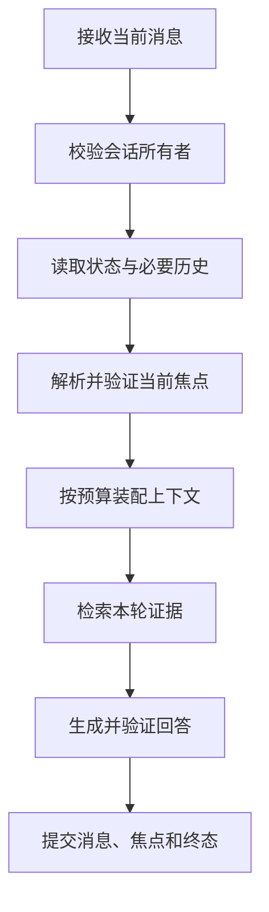

# 多轮对话怎样保存状态与处理指代

用户先问：“远程访问规范有哪些审批条件？”系统检索到一份文档并完成回答。下一条消息只有六个字：“它什么时候生效？”

第二轮缺少显式对象。“它”可能指规范，也可能指其中某项审批；“生效”可能对应发布日期、执行日期或审批完成时间。把全部历史原样发给模型能提供语言线索，却无法保证对象唯一，更无法保证用户现在仍有权读取上一轮文档。

多轮能力来自应用保存和重新验证状态。每次模型调用仍然是一次有限输入。系统需要知道当前消息属于哪个会话、上一轮完成了什么、焦点指向哪个稳定对象、哪些历史必须成组保留，以及并发请求能否更新同一状态。

## Conversation、Turn、Message 为什么要分开

三个对象解决不同时间尺度的问题。

| 对象 | 典型字段 | 生命周期 | 状态所有者 |
| --- | --- | --- | --- |
| Conversation | `conversation_id`、`owner_id`、焦点、修订号 | 多轮 | 会话服务 |
| Turn | `turn_id`、输入快照、阶段、Deadline、终态 | 单次请求 | Agent Runtime |
| Message | `message_id`、角色、内容、组 ID、父消息 | 单条记录 | 消息仓库 |

**Conversation（会话）** 保存跨轮仍有效的少量状态，例如当前焦点和待澄清项。**Turn（轮次）** 记录本次处理从接收到完成、失败或取消的过程。**Message（消息）** 保存用户输入、助手输出和工具交互的原始顺序。

把三者压成一段 `history_text` 会失去几个重要能力：无法区分一次执行失败和整个会话失效，无法给并发更新做版本检查，无法保证工具调用与结果成组裁剪，也无法从原始消息重建新的摘要。
## 第二轮仍然经过完整请求链

短追问并不代表可以跳过身份、权限或检索。一次可靠处理通常包括：



请求入口从认证信息取得用户身份，再用 `conversation_id + owner_id` 查询。仅凭会话 ID 读取会泄露他人的消息。对不存在和无权访问返回同一种外部错误，可以减少对象枚举信息。

Turn 开始时保存范围、知识 Release、策略版本和绝对 Deadline。随后所有检索和工具调用读取这份快照。重试若换了 Scope 或 Release，得到的已经是另一项任务，应该创建新 Turn 或明确重新开始。
## 焦点应该保存稳定引用

处理“它”“这个”“上一份”这类指代时，应用需要一个结构化焦点：

```text
FocusRef {
  kind: "document",
  object_id: "doc_7f2a",
  node_id: "section_3",
  display_title: "远程访问规范",
  source_turn_id: "turn_18",
  source_revision: 6
}
```

标题用于展示，稳定 ID 用于查询。只保存标题，在同名文档或标题修改后无法可靠定位。`source_turn_id` 能解释焦点从哪里产生，修订号用于阻止迟到请求覆盖新状态。

焦点也不是权限凭证。第二轮绑定 `doc_7f2a` 前，要用当前身份和当前 Scope 检查对象是否可见。上一轮可见的文档可能已经撤回，用户也可能切换到另一个知识空间。检查失败时应清除或冻结焦点，并给出范围变化的可解释结果。

焦点更新必须来自已验证结果。模型可以提议“用户现在讨论文档 B”，程序仍要确认 B 出现在当前可见候选中。模型凭空生成的 ID、隐藏证据中的命令和未完成工具结果都不能直接写入 Conversation。
## 指代解析是候选生成与确定性绑定

对于“它什么时候生效”，模型或轻量分类器可以输出结构化候选：

```json
{
  "reference_kind": "current_focus",
  "relation": "effective_time",
  "needs_clarification": false
}
```

候选只描述语言关系。Runtime 从 Conversation 读取真实 `FocusRef`，再执行可见性检查。若当前有两个合理对象，或用户说“前面第二个”但历史裁剪后序号不稳定，系统应请求澄清。

澄清问题应携带待选对象的稳定 ID，界面展示标题和必要上下文。用户选择后，服务端验证选项仍可见，再更新焦点。不要把“选第二个”直接交给模型在旧列表中猜位置，因为候选排序可能已经变化。

有些追问看似指代，实际改变了主题。用户在讨论规范后问“那 Python 怎么设置代理”，新问题已经包含完整对象，系统应建立新焦点。一直强行沿用旧焦点，会使检索查询混入无关限定词。
## 历史窗口要按语义组裁剪

上下文窗口有限，通常要保留系统规则、当前消息、活跃焦点、最近几轮和必要摘要。裁剪单位不能只有单条 Message。

一次工具交互至少包含助手的 Tool Call 和对应 Tool Result。只留下结果“approved=true”，模型不知道哪个工具、使用了哪些参数；只留下 Tool Call，模型可能误以为动作尚未完成并再次执行。可以为相关消息设置同一个 `group_id`，窗口选择时整组保留或整组丢弃。

历史选择可以按以下优先级处理：

1. 固定保留当前用户消息、未完成请求和安全规则。
2. 保留解释当前焦点的来源轮次。
3. 从最近到最远选择完整消息组。
4. 用带来源范围的摘要表示更早历史。
5. 必需内容超出预算时直接缩小任务或请求澄清。

不能为了塞进窗口而截断 JSON、工具参数或引用标识。截断后的结构可能变成另一个合法含义。摘要也要记录覆盖的消息范围和版本，旧消息被删除或修订时，对应摘要失效。

仓库中的窗口示例把消息按组计费，并将必需消息超预算视为显式错误：

<<< ../../examples/ai-agent/conversation_window.py

这是可运行的教学实现。`approximate_tokens` 只能用于本地预算演示，生产请求应读取目标模型的真实计数规则或保守上界。内存会话仓库能验证所有者与修订冲突，不能替代数据库事务、分布式锁或真实鉴权。
## 并发消息怎样避免焦点倒退

同一会话可能同时收到两条消息。假设当前修订为 6：

```text
Turn A 读取 revision=6，讨论文档 A
Turn B 读取 revision=6，讨论文档 B
Turn B 先完成，把焦点更新为 B，revision=7
Turn A 后完成，尝试把焦点写回 A
```

若直接覆盖，完成较慢的旧请求会让焦点倒退。更新语句需要携带 `expected_revision=6`，只有当前仍为 6 才能提交。Turn A 收到冲突后可以保留自己的回答，但不能修改 Conversation 焦点；是否重算由产品交互决定。

消息顺序也不能只依赖客户端时间。服务端为每个会话分配单调序号或建立父消息关系，才能在重连和多设备场景中还原分支。两个并发用户消息都以同一父消息为起点时，它们形成两个分支，界面需要明确当前激活哪一个。

流式输出带来另一种竞态。用户点击停止后，后台模型可能继续返回 Token。取消状态写入 Turn 后，迟到片段不能再追加到可见答案，迟到工具候选也不能执行。SSE 连接断开只影响交付通道，Turn 是否完成由 Runtime 状态决定。
## 工具调用和副作用怎样跨轮处理

用户第二轮说“继续”时，系统要知道上一轮停在哪里。等待审批、等待用户补参数、工具执行中和回答已经完成，是不同状态。把它们都表示成最后一条助手文本，会让“继续”缺少确定含义。

待继续动作应保存为结构化 Pending Action，包含动作 ID、工具名、经过校验的参数摘要、创建 Turn、过期时间、审批要求和当前状态。下一轮只能引用仍活动、属于当前用户且 Scope 未变化的动作。

执行副作用前再次读取权限与资源版本。用户同意上一轮生成的删除计划，不代表资源在十分钟后仍处于相同状态。确认绑定的是动作 ID 和参数哈希，不能只保存一个布尔值 `confirmed=true`。

工具完成后，Tool Call 与 Tool Result 作为一组保存。网络超时且副作用状态未知时，先用幂等键查询原动作，不要让下一轮无条件重试。多轮体验不能牺牲副作用一致性。
## 标题、摘要和长期记忆各做什么

会话标题用于导航，应在首个有效问题后生成一次。模型生成失败可以退回问题截断值。后续每轮重新生成标题会造成列表跳动，也会把偶然的敏感片段扩散到索引和通知。

摘要用于压缩早期消息，需要保存覆盖范围、生成版本和来源消息 ID。它可以帮助模型理解讨论脉络，不能代替原始 Message，也不能自动获得更高可信度。

长期记忆跨会话保存稳定偏好。Conversation 焦点通常不应写进长期记忆，因为“当前正在讨论文档 A”很快失效。三者都可能包含自然语言，但使用时机和删除路径不同。
## 失败恢复要依赖 Turn 终态

Turn 至少区分 `queued`、`running`、`waiting_input`、`completed`、`failed`、`cancelled`。状态迁移单调，终态不能被迟到回调改回运行中。

客户端断线后使用 `turn_id` 查询或从事件游标续传。若 Turn 已完成，返回保存的结果；若仍运行，恢复订阅；若失败且错误可重试，创建带原 Turn 引用的新尝试。直接重新提交用户消息可能重复检索、重复计费或重复工具副作用。

恢复时还要核对版本。旧 Turn 在 Release 7 上失败，当前已切到 Release 8，继续原执行和创建新执行代表不同语义。系统要在接口上说清楚，不能悄悄换版本后仍声称恢复了原请求。
## 多轮评测要观察状态变化

单轮答案相似度无法证明多轮正确。评测用例需要给出初始 Conversation、消息序列、当前权限和预期状态迁移。

| 场景 | 关键断言 |
| --- | --- |
| 明确追问 | 绑定正确焦点，重新检查可见性 |
| 两个候选对象 | 请求澄清，不随机选择 |
| 主题切换 | 建立新焦点，不携带旧限定 |
| 权限撤回 | 旧焦点停止使用，不泄露对象存在性 |
| 工具历史裁剪 | Call 与 Result 同时保留或省略 |
| 并发焦点更新 | 旧 revision 写入失败 |
| 用户取消流式回答 | 迟到 Token 和动作不再提交 |
| 断线重连 | 读取同一 Turn，不重复副作用 |
| 摘要失效 | 原消息变化后重新生成 |
| 会话标题 | 只生成一次，失败有确定回退 |

日志用 `conversation_id`、`turn_id`、状态修订和消息组 ID 串起事件，完整对话留在受控存储。排查“为什么它指错了”时，应能定位模型提出的指代候选、绑定时使用的焦点版本、可见性检查结果和最终状态更新。

多轮对话的连续感建立在这些确定性记录上。语言模型负责理解省略和指代，应用负责对象身份、权限、版本、并发与副作用。两部分各守住自己的边界，短短一句“继续”才有稳定含义。
