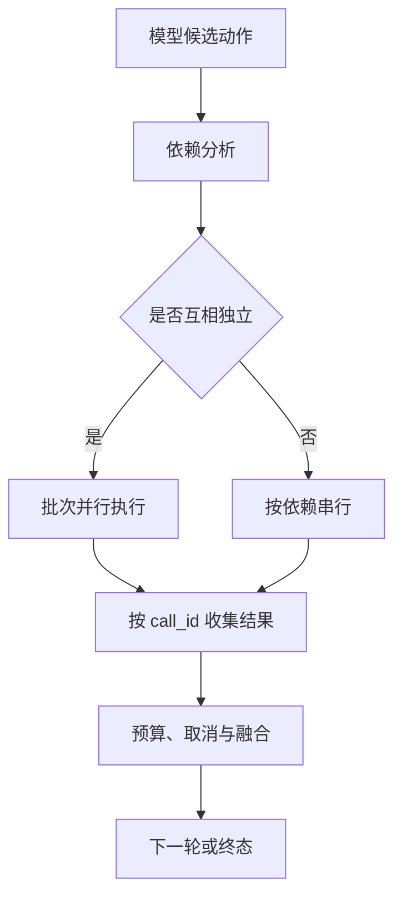

# 并行工具执行怎样保持身份、顺序与预算

一次 Agent 请求可能同时需要读取三份互不依赖的资料。串行执行最容易理解，但每次网络等待都会叠加；直接把所有调用丢进 `gather` 又会把共享状态、权限、结果顺序和取消竞态带进来。并行的核心不是“同时发请求”，而是证明这一批调用可以互相独立，并且每个结果回来后仍能找到自己的身份、版本和预算。

**只读**回答“调用是否修改外部状态”，**并发安全**回答“这个调用能否和同一批兄弟调用同时发生”。一个只读查询可能锁住共享资源或读取不一致快照；一个写操作如果写入完全不同的资源，理论上可能并行，但副作用通常需要更高等级的审批。因此并发分类必须读取本次调用的工具名和参数，不能只看工具名称上的 `read` 标签。

::: info 贯穿推演

知识助手需要在同一 Release 和用户范围内查询“设备合规”“审批条件”和“申请有效期”。三条查询没有数据依赖，可以建立一个批次；若其中一条发现安全阻断，尚未交付的候选全部标记为不可用。每个结果都带自己的 `call_id`，完成先后不改变答案中的归属。

:::

## 并行解决的是等待，不是控制权

并行执行把一条调用序列改成一个受约束的批次。运行时先从模型候选中建立调用节点，再判断节点之间是否有数据、写入资源或审批依赖。只有没有依赖、没有共享可变状态、工具适配器明确声明可并发且预算足够的节点，才进入同一批次。批次只是调度单位，最终状态仍由运行时写入。

如果查询 B 要使用查询 A 返回的文档 ID，B 不能和 A 同批；如果两个动作都修改同一个发布记录，即使工具声明“成功”，也不能仅凭名字并行。把有依赖的调用硬塞进 `gather`，结果可能在 B 读取前还没有 A 的版本，或者两个写入互相覆盖。正确做法是先执行 A，验证结果后再创建 B，或者把依赖明确写成图中的边。

并行也不意味着模型获得更多权限。所有分支共享创建 Turn 时固定的用户、租户、Scope、Release、Policy 和绝对 Deadline。模型在某个候选里写入另一个 `scope_id`，只能被视为不可信字段；授权组件仍按运行时快照过滤。一个分支被拒绝，不应通过换到另一个分支绕过范围。

## 调用级并发安全怎样判定

判定函数接收工具名称、规范化参数、当前状态和批次上下文，返回允许并发、必须串行或直接拒绝。默认策略应当保守：没有实现并发安全能力的工具沿用旧的串行路径；未知工具不进入并行批次；参数中出现 Shell 元字符、重定向、管道、换行或未知子命令时，Bash 调用按不安全处理。

为什么要检查参数？`git status` 和 `git push` 都以 `git` 开头，前者通常只读，后者会修改远程状态；`cat file-a` 读取单个文件，`cat file-a > file-b` 已经产生写入；一条含换行的字符串看起来像一条命令，实际可能包含第二个未检查的命令。按名称白名单会把这些差异全部抹掉。

分类器的失败方向要有明确代价。把安全调用误判为串行，损失的是少量延迟；把不安全调用误判为并行，可能造成数据损坏、互相覆盖或错误审批。因此实现宁可返回 `serial`，也不把“不认识”解释成安全。分类结果本身写入 Trace，方便解释某一批为什么只有一个成员。

并发安全属于一次调用而不是工具的永久属性。某个读取工具在固定的活动版本下可并行，若传入“刷新索引”参数则可能需要排他锁；某个 Bash 查询在固定目录下无副作用，若路径指向共享临时文件则不能与写入任务同时运行。注册表可以提供默认能力，最终判断仍需结合参数和快照。

## 批次、身份与结果顺序

运行时为每个候选分配不可重复的 `call_id`，并保存 `batch_id`、工具版本、参数哈希、父 Turn、Scope、Release 和局部 Deadline。批次可以按安全性拆成多个阶段：可并发的读取放入第一批，未识别或有依赖的调用留在串行队列，副作用动作进入审批队列。批次的顺序是调度信息，不是结果归属。

模型可能按 A、B、C 的顺序提出调用，C 却最先完成。事件流发送 `tool.completed` 时必须包含 C 的 `call_id`；客户端和融合器按身份更新对应卡片，不能使用“第几个返回”作为索引。若事件只携带工具名称，两个相同工具的调用会互相覆盖，用户看到的内容即使来自真实工具也会落在错误问题上。

每个结果还要带 `status`、开始和结束时间、来源版本、错误类别及 `cancelled` 或 `truncated` 标记。空结果是一次合法完成，超时是依赖没有在 Deadline 内给出结果，未知状态则表示可能已经发生副作用。三者不能因为都没有文本而合并成同一个空字符串。

批次汇合时按调用身份去重，再按任务合同排序。展示顺序可以恢复用户问题顺序，也可以按证据覆盖度排序，但排序不能改变结果的来源和状态。迟到的旧 Release 结果只能写入历史审计，不能覆盖已经绑定新 Release 的候选。

## 共享预算和取消如何传播

整个 Turn 只有一个总 Deadline。创建并行任务时，为每个分支计算剩余时间，不能给每个请求重新发一份完整超时。模型调用、数据库查询、重排和结果装配都从同一预算中扣除；一个慢分支消耗过多时间，其他分支不会因此获得更长的执行窗口。

预算还包括并发数、候选数量、返回字节数和 Token。三条查询各返回一千个候选，即使每条都很快，也可能在融合前耗尽内存和上下文。运行时可以在批次创建时限制候选上限，在工具返回时截断并保留游标，在汇合时按来源多样性和必要字段缩减。缩减记录不能丢掉调用身份和失败原因。

用户取消或安全阻断发生后，先停止尚未发出的分支，再向已发出的可取消请求传播取消信号。`asyncio` 任务被取消不等于外部 HTTP 请求已经停止，适配器需要等待安全清理或查询回执。只读分支的迟到结果可以丢弃；写分支要保留外部动作 ID，恢复时先检查是否已经执行。

如果安全扫描在批次开始前发现提示注入，运行时应清空并行检索候选，状态改为 `security_blocked`，不能让已经创建的快速检索结果继续进入答案。这个顺序很重要：预处理的并行优化不能绕过安全裁决。安全阻断是确定性终态，不应交给模型改写成普通无结果。

## 一次完整执行的状态轨迹

输入是用户 U1 在范围 S1 查询“远程访问申请条件”。模型提出三个候选：`search_device`、`search_approval` 和 `read_expiry`。运行时确认三个候选只读、无互相依赖，给它们分配 `call-1`、`call-2`、`call-3`，共享 R3 和同一个总 Deadline。

分批器把三条调用放进 batch-7。`search_approval` 先返回，事件包含 `call-2`；`search_device` 随后返回 `call-1`；`read_expiry` 超时，写入 `timeout`。融合器不会因为 `call-2` 先到就把它当作问题的第一部分，而是按调用 ID 收集两条成功证据，并保留“有效期无法核对”的缺口。

若任务合同要求三项都齐全，答案终态为 `partial_evidence` 或安全拒答；若合同允许部分回答，输出明确列出两个已核对条件和一个超时缺口。模型不能把 `search_approval` 的内容扩写成有效期，也不能用默认有效期填补缺失字段。下游引用只绑定 `call-1` 和 `call-2` 的真实 Source。

另一条轨迹让 `search_device` 参数包含换行和第二条命令。分类器返回 `serial`，它不会阻断正常查询，只是把调用移到单独批次。若参数包含越权目录，则校验直接 `rejected`，不进入串行补偿。两种结果都保留候选、判断规则和调用次数，便于区分“并发不安全”和“参数不允许”。

在批次中途收到取消，尚未开始的 `call-3` 不发送；`call-1` 已经返回的结果保留作局部证据，但不能宣布整个任务完成。持久化状态记录 `cancel_requested_at`、已完成调用、取消中的调用和最终 `cancelled`。迟到的 `call-2` 事件按版本检查后只能进入审计，不得把任务改回 `completed`。

## 代码怎样表达身份和依赖

下面的最小示例只证明本地调度规则。输入是已经通过参数校验的调用列表，输出是按 `call_id` 汇合的结果；Fake 函数没有网络、权限或真实副作用。

~~~python
from dataclasses import dataclass
import asyncio

@dataclass(frozen=True)
class Call:
    call_id: str
    name: str
    depends_on: tuple[str, ...] = ()
    safe_for_parallel: bool = False

@dataclass(frozen=True)
class Result:
    call_id: str
    status: str
    value: str = ""

async def run_one(call: Call) -> Result:
    await asyncio.sleep(0)
    return Result(call.call_id, "succeeded", f"result:{call.name}")

async def dispatch(calls: list[Call]) -> dict[str, Result]:
    if any(call.depends_on for call in calls):
        raise ValueError("依赖调用必须先拆批")
    if not all(call.safe_for_parallel for call in calls):
        raise ValueError("批次包含未证明并发安全的调用")
    results = await asyncio.gather(*(run_one(call) for call in calls))
    return {result.call_id: result for result in results}
~~~

`gather` 返回的列表与输入顺序一致，但真实系统的事件流可能按完成时间到达，所以持久化和 UI 仍然必须使用字典中的 `call_id`。生产实现还要传入共享 Deadline、取消事件、最大并发数、异常收集策略和资源清理回调。这个示例不能证明分类器正确，也不能证明取消会停止下游请求。

## 失败路径、部分成功和资源清理

依赖错误是调度错误。运行时发现 B 依赖 A，却把它们放进同一批次，应在发出请求前拒绝计划；如果依赖在执行中才显现，例如 A 返回需要授权，B 必须进入下一阶段，不能使用旧的空参数并发执行。

共享可变状态竞争是业务错误。两个调用都读到同一版本后写入不同字段，最终可能丢失更新。没有乐观锁、串行队列或按资源分片的证据时，写调用应当串行。只读标记不能替代事务隔离和版本检查。

一个分支失败不一定取消全部。任务合同可以选择保留成功分支并标记缺口，也可以采用快速失败。关键是结果交付前知道采用了哪条策略，且失败分支的 `call_id`、错误类别和重试资格仍在。重试只创建新尝试 ID，并通过父调用 ID 关联，不覆盖第一次的未知回执。

资源清理要覆盖连接、文件句柄、后台任务、Lease、临时缓存和事件订阅。批次取消后，清理器等待所有子任务结束或明确进入 detached 状态；活动任务仍引用的对象不能删除。重复清理应幂等，不能因为第一次清理在网络错误中途退出，就把第二次清理变成另一种状态。

## 测试如何证明并行没有改变语义

单元测试先验证分批：两个无依赖只读调用进入同一批次；有依赖的调用分成两个批次；未知 Bash 子命令、换行、重定向和写入参数退回串行或拒绝；安全阻断会丢弃并行候选。每个断言都记录调用 ID、批次 ID 和分类原因。

顺序测试让三个 Fake 工具按 C、A、B 的顺序完成，断言最终映射仍是 A、B、C 的身份，而不是按到达顺序错配。重复工具名称的两个调用必须得到两个不同 ID。旧 Release 迟到时，融合器只能保留审计记录，不能覆盖活动版本。

预算测试让一个分支消耗大部分 Deadline，另外两个分支仍只能使用剩余时间；达到并发上限时新调用排队或拒绝，不能创建无限任务。结果超过字节预算时保留截断标记和游标，答案验证不能把截断候选当作完整证据。

取消测试覆盖批次创建前、部分任务已发出和某个任务已产生未知回执三种位置。预期分别是零调用、停止未开始分支并保存局部结果、保留动作 ID 等待回执。安全阻断测试在并行快速检索已经生成候选后触发拒绝，断言最终候选为空，证明优化路径没有越过安全门。

集成测试需要隔离的 HTTP、数据库或工具服务，检查序列化、超时、事件重放和连接释放。没有真实依赖运行证据时，只能说 Fake 调度逻辑通过，不能声称线上并行安全。并发问题还要用不同完成顺序重复运行，不能因为一次固定顺序测试变绿就认为没有竞态。

## 什么时候退回串行或固定工作流

任务只有一个调用时，并行层只增加状态和清理成本。调用之间存在依赖、共享写入、审批顺序、速率限制或结果必须严格按前一项决定时，串行更容易解释。固定的批量查询可以用工作流节点表达，只有批次成员需要根据观察动态变化时，才把 Agent 的候选选择引入。

并行的收益还要和结果体积、调试成本、下游吞吐比较。三条轻量只读查询可能显著减少等待；三条大型解析、重排和模型调用同时发生，反而会造成连接争抢和上下文爆炸。评测应同时看总延迟、资源峰值、空结果率、错误归属和证据覆盖，不能只看平均响应时间。

并行工具执行的边界可以用一句话概括：先证明调用之间可以同时发生，再让它们共享一个受限预算；结果按身份交付，失败按合同传播，取消按版本收敛。只读标签、完成顺序和 `gather` 本身都不是安全证明，真正的证明来自调用级分类、稳定 ID、可观察状态和故障注入测试。

## 批次规划如何和 Agent 循环衔接

并行批次属于一次 Agent 决策的执行细节，不应该变成模型自行管理的线程池。模型可以提出多个 `ToolCall`，运行时先把候选解析成图：节点是调用，边是数据依赖，资源表记录可能冲突的对象。拓扑排序得到可执行节点后，再把同层节点交给并发安全分类器。这样即使模型同时提出了一个查询和一个写入，写入也不会因为出现在同一条消息里就被自动放行。

计划中的每个节点保存父计划版本、调用参数哈希、预计返回大小、所需权限和局部预算。分类器的结论最好是 `parallel`、`serial`、`blocked` 三值，而不是一个容易被误读的布尔值。`serial` 表示调用可执行但必须独占批次，`blocked` 表示参数或权限不允许执行。批次执行器只接纳 `parallel` 节点，其他节点回到相应的串行或拒绝路径。

模型在观察到一条结果后可能提出新调用。新调用不应加入已经开始的批次，否则旧批次的预算和结果集合会被偷偷改变。运行时先封存本批次的终态，再以新的计划版本创建下一批；新计划可以引用上一批的成功 Evidence，但必须重新检查 Release、ACL 和剩余 Deadline。跨批次引用用稳定 ID 表示，不直接把旧工具对象塞进新任务。

## 结果融合怎样避免顺序幻觉

并发结果常见的错误不是工具返回错，而是上层把正确结果贴错位置。融合器应先建立 `call_id -> result` 映射，再根据问题字段组装答案。例如“设备合规、审批条件、有效期”分别对应三个调用，`call-2` 先返回也只填审批槽位。槽位缺失时留下缺口，不能从其他调用的相似词推断缺失字段。

不同调用命中同一个 Source 也不能算作两份证据。融合前按 Chunk、Source Version 和 Release 去重，记录命中的调用 ID 列表；评估覆盖度时按来源计数，审计时仍能知道哪些分支命中了它。这样可以区分真实的多源支持和同一段文本被多个查询重复命中。

结果排序要服从用途。UI 可以按用户问题顺序展示，检索器可以按证据覆盖度排序，事件流必须按序号传输，但这三个顺序不应混用。事件序号用于重放，`call_id` 用于归属，业务字段顺序用于回答。一个全局自增序号不能替代调用身份，否则重连后重新排序仍会把结果挂错。

## 生产中的限流和资源隔离

并行批次会把瞬时负载放大。每个用户、租户和工具都需要独立并发配额，避免一个请求提交几十个轻量查询就占满全局连接。准入控制先计算候选数量和估计结果体积，再决定全部执行、分组执行或只执行最有价值的若干分支。被限流的分支进入 `admission_delayed`，不是伪造空结果。

资源隔离要覆盖模型、数据库和外部 HTTP 客户端。共用连接池时，取消一个批次不能关闭其他 Turn 正在使用的连接；专用子进程或沙箱则要在批次终止后确认已经退出。结果缓存也不能跨用户和 Release 共享未过滤的候选，缓存命中后再次鉴权是必要步骤。

观测指标按 `batch_id` 聚合时，还要保留每个 `call_id` 的开始、结束、取消和失败阶段。只有聚合总耗时会掩盖某个分支长期排队；只有单分支日志又无法看出共享预算是否被一个慢任务消耗。容量回归记录峰值并发、队列长度、结果字节数和取消传播延迟，不能只记录平均值。

并行执行适合在确定性边界内优化等待。它不能替代工具契约、权限校验、Evidence 绑定或 Agent 的终止状态。只要身份、依赖、预算和失败传播有一项无法证明，退回串行并保存原因，通常比追求一个未经证实的加速数字更稳妥。

## 常见误判和排查顺序

最常见的误判是把“没有写入”当成“可以并行”。先看本次参数是否触发锁、缓存刷新、分页游标或共享临时目录，再看工具适配器是否声明可并发。第二个误判是按返回顺序组装答案，排查时先比较事件中的 `call_id`、批次版本和客户端映射，确认是否只是展示错位。第三个误判是把一个分支的超时当成全局无证据，应该区分合法空结果、依赖失败和被取消的未完成分支。

排查从 Trace 的批次创建开始：确认候选计划、分批原因、Scope 和 Release；然后查看实际发送的调用、每个调用的参数哈希和开始时间；接着检查完成、取消、超时和未知回执；最后检查融合器是否按身份去重、Evidence 是否保留缺口。只看最终答案无法判断是分类错误、依赖竞态还是结果归属错误。

回归样本至少包括两个相同工具的不同参数、一个有依赖的调用、一个包含换行的命令、一个共享写资源、一个超时分支和一次父任务取消。更换工具名称和问题表达后重复运行，才能证明修复针对的是调用级规则，而不是某个字符串特判。测试输出保存计划版本和调用身份，不写入真实凭证或完整用户正文。

## 设计评审的最终问题

评审一批并行调用时，应逐项回答：每个调用依赖哪些输入，谁拥有这些输入；调用是否只读，参数是否改变并发安全结论；批次共享哪些预算和连接；结果通过什么 ID 回到问题字段；一个分支失败时是保留缺口、取消全部还是降级；父任务取消后哪些外部请求仍可能发生；重试怎样避免重复副作用；旧版本迟到时写入哪里。

若这些问题只能靠提示词或“通常会这样返回”回答，说明并行边界还没有落到程序契约。把批次变成可持久化状态、把分类器变成可测试函数、把结果归属变成稳定 ID，再讨论并发数量和延迟，才能让优化保持可解释、可恢复和可回滚。

最后再做一次反例推演：两个调用都声称只读，但一个读取未提交的共享快照，另一个刷新同一索引；它们不应并行。两个调用返回相同标题但属于不同 Release，融合器要保留版本冲突。一个分支先完成并触发安全阻断，其他分支即使已经有文本，也不能进入最终 Claim。并行设计的价值不是让所有分支都跑完，而是让可以安全同时发生的工作更快结束，让不能证明安全的工作明确停下来。

因此，批次的验收结果至少包含三部分：分类器是否正确区分并发与串行，事件是否始终携带可以重放的调用身份，预算和取消是否在所有子任务上收敛。只要其中一项缺少测试证据，系统就只能把该批次降级为串行或拒绝，不能把并行当成默认成功路径。这个保守结论会牺牲部分速度，却保住了结果的归属和外部状态的一致性。

上线观察还要按工具类型分桶。读取型检索、文件操作、远程请求和模型调用的并发代价不同，不能用一个全局阈值覆盖所有分支。新工具默认串行，经过参数级测试和故障演练后再加入并行白名单；版本升级重新评估，不沿用旧的安全结论。

并行白名单是运行时策略，不是模型可修改的配置。策略变化要有版本、发布范围和回滚点，事件记录可以据此重放一次批次，而不会把旧策略误套到新调用。

每次策略升级都要用相反完成顺序和父任务取消重新验证，不能沿用旧版本的并发结论。

这也让串行回退成为可观测的正常状态，而不是隐藏的异常。Trace 记录回退原因和保留的预算，后续评测才能判断是安全策略过严，还是工具确实不适合并发。
