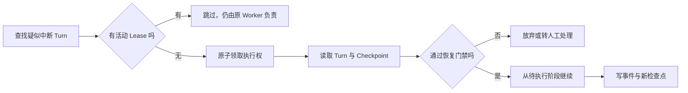

# 持久化 Agent Loop 的检查点与重入

普通 Python 循环只要进程还活着，就能在内存里保存消息、工具结果和下一步动作。进程因为发布、断电、内存不足或节点迁移而退出后，这些对象一起消失。对于一次几十秒的问答，失败后重新运行也许可以接受；对于已经检索大量资料、等待人工审批或调用外部系统的长任务，从头再来会浪费计算，还可能重复产生副作用。

**持久化 Agent Loop** 把继续执行所需的状态写入进程之外的存储。新的 Worker 取得执行权后，先读取检查点，判断这个 Turn 现在是否仍然允许恢复，再从尚未完成的阶段继续。它解决的是“进程消失后怎样延续控制流”，并不自动解决权限、幂等、取消和版本兼容。

::: info 持久化循环增加了什么

- 普通循环保存当前状态，只能在当前进程内继续。
- 持久化循环保存阶段、状态修订和恢复条件，可以由另一个进程继续。
- 恢复器负责判断能否继续，工具适配器仍要负责外部副作用幂等。

:::

本文用一个知识问答 Turn 贯穿说明。它先规划检索，再读取员工手册，最后把答案交给客户端。Worker 可能在任意阶段退出，用户也可能取消任务。目标不是让每次崩溃都自动重跑，而是让系统知道已经完成了什么、剩下什么、继续执行是否安全。

## 进程状态为什么不足以支撑长任务

一次 Agent 执行通常同时拥有三类状态。对话和任务状态回答“这个 Turn 是谁的”；图执行状态回答“当前走到哪个节点”；外部动作状态回答“邮件、支付或交付是否已经发生”。把它们都塞进一份 Prompt，模型可以读到描述，却无法提供事务、并发控制或崩溃恢复。

假设 Worker 完成检索后退出。若状态只在内存中，新 Worker 看不到检索结果，只能重新调用检索器。结果可能已经变化，调用成本也会重复。更危险的情况发生在外部动作之后：答案已发送，但 Worker 在写 Completed 之前退出。数据库看见的仍是 Running，盲目重跑会发送第二次。

持久化要保留控制决策所需的最小事实：

| 状态层 | 典型字段 | 主要问题 |
| --- | --- | --- |
| Turn | `turn_id`、用户、Scope、Release、Policy、Deadline、Status | 这次执行属于谁，使用哪份规则 |
| Checkpoint | 当前阶段、节点状态、状态修订、待执行动作、恢复次数 | 从哪里继续，旧写入能否覆盖新状态 |
| Event | Sequence、Event Type、Payload Reference | 客户端已经看到了什么，怎样断线重放 |
| Action Ledger | Action ID、参数摘要、状态、外部回执 | 副作用是否发生，重复调用应返回什么 |

这四层经常放在同一数据库，却不能合并为一个模糊的 JSON 字段。Turn 已完成不表示客户端已经收到全部事件；Checkpoint 记录调用工具的意图，也不等于供应商已经完成动作；Action Receipt 能证明某次动作成功，却不能决定整个 Turn 是否通过质量验证。

## 检查点保存可继续执行的状态

检查点是一份带版本的执行快照。它至少保存当前节点、节点输入、已经产出的必要结果、待执行节点和状态修订。使用 LangGraph 时，`thread_id` 关联一条执行历史，Checkpointer 保存各个 Super-step 后的状态；恢复时用同一个 `thread_id` 读取快照，并让图从未完成节点继续。具体接口以 [LangGraph Persistence 官方文档](https://docs.langchain.com/oss/python/langgraph/persistence) 为准。

### 阶段边界比固定时间间隔更有意义

每生成一个 Token 就写数据库，会把序列化和网络开销放进最热路径。只在最终答案产生后保存，又无法减少中途失败的重算。比较合适的位置是稳定阶段边界：刚完成一项有价值的计算，下一步还没有开始。

知识问答可以在这些位置写检查点：

1. 输入、权限范围和版本快照已经固定。
2. 检索计划已经形成，尚未发起各检索分支。
3. 检索与 Rerank 已完成，Evidence Packet 已经稳定。
4. 草稿和 Claim 已生成，尚未执行验证。
5. 验证通过，外部交付动作已经准备但尚未发出。

检查点太密会增加数据库写入和大对象复制；太疏会扩大重算范围。判断依据是阶段产出的重建成本、外部副作用风险和允许丢失的进度，不是机械地“每轮保存一次”。大段 Evidence 或文件通常写对象存储，检查点只保留内容地址、哈希和版本，避免每次复制完整正文。

### 危险动作前先保存意图

外部动作前的检查点应包含稳定 `action_id`、规范化参数摘要和当前状态修订。Worker 随后使用同一个 `action_id` 调用工具。这样即使动作完成后进程立即退出，恢复执行仍会带着相同身份查询回执或重复提交，支持幂等的下游可以返回原结果。

只在动作结束后保存有一个明显缺口：进程可能恰好死在“外部系统已成功、数据库尚未提交”之间。这个窗口无法用一次本地数据库事务完全消除，因为数据库和外部服务不共享事务。稳定动作身份、供应商查询接口和人工确认路径才是补偿手段。

### 状态修订阻止旧 Worker 回写

每次保存检查点都带 `revision`。Worker 从 Revision 7 读出状态，写入 Revision 8 时要求数据库当前仍是 7。若另一个 Worker 已经推进到 8，旧写入返回 Conflict，不能把新结果覆盖回旧阶段。

这个规则适用于检查点、Turn 终态和 Action Ledger。租约能降低同时执行的概率，状态修订负责在租约失效、网络延迟或进程暂停后做最后防线。两者职责不同：Lease 约束谁现在可以工作，Revision 约束谁可以提交这次状态变化。

### Checkpoint 与 Turn 状态需要明确提交顺序

Checkpoint 和 Turn Status 若由两个独立事务更新，还会出现另一道缝隙。图已经保存 `evidence_ready`，进程却在把 Turn 更新为 Running 之前退出；或者 Turn 已写 Completed，终态 Checkpoint 尚未保存。恢复器不能随意挑一个较新的时间戳作为真相，因为两个记录描述的是不同对象。

一种做法是让阶段 Checkpoint 先提交，再以它的 Revision 更新 Turn 的进度指针。恢复时以已提交 Checkpoint 为执行位置，以 Turn 终态作为不可越过的上限。Turn 已终态时不再运行任何节点，即使 Checkpoint 看起来还停在中途；Turn 未终态而 Checkpoint 已前进时，从 Checkpoint 的待执行节点继续。每次协调都写 Event，留下“状态为何对齐到这里”的证据。

如果业务数据库与 Checkpointer 能共用事务，可以把关键状态修订原子提交；不能共用时，就要承认最终一致性，定义明确的对账任务和单调规则。对账只能把未终态执行推进到已有快照，不能把 Completed 降回 Running，也不能在没有 Action Receipt 的情况下猜测副作用结果。

## 恢复从发现中断 Turn 开始

数据库里有检查点，不代表恢复器能高效找到它。启动时扫描全部对话和全部快照，数据越多越慢，还会把历史完成任务反复读一遍。运行时应维护一个可以直接查询的恢复集合，例如 Turn Status、Interrupted Marker 或按状态建立的索引。

发现条件可以写成明确查询：状态是 Running 或 CancelRequested，更新时间早于失联阈值，Deadline 尚未到期，没有有效执行 Lease。多个恢复器并发扫描时使用行锁与 `SKIP LOCKED`，每个候选只交给一个领取者。查询候选只是取得检查资格，不代表它已经获准执行。



Marker 与真实状态必须保持一致。Turn 进入可恢复状态时创建 Marker，完成、取消或放弃时移除。所有修改状态的代码路径都要维护这个不变量，不能只在“完整保存”接口中更新，而遗漏局部 Patch、取消和过期处理。孤儿 Marker 会让完成任务被错误领取；漏 Marker 会让中断任务永远沉睡。

## 恢复门禁决定任务是否还能继续

自动恢复是一种新的执行请求。系统不应因为存储里有状态就默认继续，而要重新判断当前时间、权限和运行环境。至少需要检查恢复开关、时间窗口、尝试次数、取消状态、版本兼容、当前授权和审批要求。

### 恢复开关保留“发现但不执行”

运维在处理数据库异常、工具误调用或错误发布时，需要暂停恢复器，同时保留待检查的任务。关闭开关后，Marker 和 Checkpoint 不删除，候选也不推进。故障解除后可以逐批恢复或导出人工审查。

开关不应只控制扫描定时器。手动恢复 API、启动恢复和 Watchdog 重新投递都要经过同一策略函数，否则关闭一个入口，另一个入口仍会启动任务。审计事件记录谁在何时改变开关，以及被跳过的候选数量。

### 过期窗口防止旧意图突然执行

Checkpoint 保存的是当时的用户意图。时间过去后，文件、分支、权限和业务目标可能已经变化。一个几个月前批准的删除动作不应在系统升级后突然继续。恢复窗口应根据任务类型和风险确定，并保存为绝对 `resume_expires_at`，不能在每次重试时重新延长。

过期后的正确结果通常是 Abandoned 或 ManualReview，并写出 `resume_window_expired` 事件。它不是运行错误，也不应静默删除。用户能看到任务没有继续，运维能统计过期原因，后续若仍需执行，应基于当前上下文创建新 Turn。

### 恢复次数要在危险调用前落盘

如果先调用模型或工具，成功后才增加 `resume_attempts`，进程每次都在调用期间崩溃时，计数永远停在原值。启动恢复器会再次领取同一 Turn，形成崩溃循环。正确顺序是取得执行权后立即增加计数并提交，然后开始可能失败的步骤。

达到上限后停止自动恢复，保留最近错误、Checkpoint、尝试时间和 Worker 信息。任务进入 Failed 或 ManualReview，不能通过创建新 Attempt 绕开总上限。单个网络调用的 Retry 与 Turn 恢复共用总 Deadline 和资源预算，避免每一层都拥有独立的无限重试。

### 当前权限只能收紧，不能从快照扩大

Turn 创建时的 ACL Snapshot 用来固定当时可见范围，恢复时还要读取当前撤权状态。有效范围是“原快照允许且当前仍允许”的交集。用户后来获得的新权限不能自动扩展旧 Turn，用户或文档被撤权后也不能为了重现旧执行而继续读取。

知识 Release 与 Policy 使用原版本，保证执行语义不会随当前活动版本漂移；紧急工具封禁和安全策略仍可阻止继续。固定快照负责稳定，不可绕过的当前安全上限负责止损。

## 恢复任务一律按无人值守执行

一个 Turn 最初可能来自有人操作的页面，当时用户能看到审批对话并确认危险动作。进程重启后的自动恢复发生在后台，没有人正在等待审批。运行时不能根据历史来源继续把它分类为“有人值守”。

“是否有人”是本次执行环境的属性。恢复器领取任务后设置 `unattended=true`，需要实时确认的删除、付款、发布和权限修改转入 ManualReview。旧审批如果只授权某个精确、幂等且未过期的动作，也要由审批协议明确保存授权对象、有效期和参数哈希，不能从一句历史聊天推断仍然有效。

::: warning 恢复不继承交互式特权

来源字段可以保留 `web`、`desktop` 或 `api` 供审计，但它不能决定恢复时的审批策略。后台恢复没有可响应的用户，任何需要即时确认的动作都应停止并等待新的审批。

:::

恢复还要走正常路由和同一把执行锁。若恢复器绕开 API 与 Worker 的 Route Key，原请求可能仍在另一节点运行，新的恢复任务又开始写同一 Turn。结果会出现交错事件、两个工具调用和互相覆盖的状态。执行来源可以不同，所有者与并发协议必须相同。

## 恢复流程怎样推进状态

一次恢复可以拆成确定的控制步骤。模型不参与判断 Checkpoint 是否过期、权限是否有效或尝试次数是否到达上限，这些条件都来自可信状态并由程序比较。

```text
load candidate
  -> acquire execution lease
  -> load Turn + versioned Checkpoint
  -> check terminal / cancelled
  -> check resume switch and expiry
  -> check schema and policy availability
  -> intersect current authorization
  -> persist resume_attempts + unattended
  -> continue from pending node
  -> persist checkpoint, event and terminal state
  -> release lease
```

检查顺序也会影响行为。终态和取消应最先拒绝，避免已结束任务被复活；过期与版本不兼容在调用依赖前结束；恢复计数必须在调用依赖前提交；Lease 在整个执行期间续约，并在终态或异常清理中释放。清理本身设计为幂等，重复释放不会破坏别人的新 Lease。

Checkpoint 的阶段变化保持单调。例如 `created -> planned -> evidence_ready -> action_prepared -> completed`。取消、放弃和人工审查是终止分支，不能再回到 Running。若业务允许人工确认后继续，应创建明确的 Resume Command 和新执行修订，而不是直接把数据库 Status 改回去。

## 用可运行示例观察崩溃与恢复

下面的示例用内存仓库模拟持久存储，用脚本化阶段代替真实模型。它验证的是本地控制逻辑，不代表内存对象能跨进程恢复。生产实现要把 Checkpoint、Action Receipt 和 Revision 条件更新放入数据库，并补充真实工具的集成测试。

<<< ../../examples/ai-agent/persistent_loop.py

示例中的正常路径依次保存 `created`、`planned`、`evidence_ready` 和 `action_prepared`。外部交付前先保存稳定 Action ID。恢复器读取同一 Turn 后先执行门禁，再增加 `resume_attempts` 和 `unattended`，最后进入尚未完成的阶段。

`InMemoryCheckpointStore.save()` 使用乐观修订。调用方必须带上刚读取的 Revision，存储后 Revision 加一。两个 Worker 同时持有旧快照时，只有先提交者成功，另一个得到 `checkpoint_revision_conflict`。真实数据库用条件更新或 Compare-and-swap 实现相同规则。

`IdempotentDelivery` 以 Action ID 保存回执。示例故意支持在发送完成后、Completed 检查点保存前注入崩溃。恢复时同一个动作再次送达，适配器返回旧回执，交付列表仍只有一项。这里证明的是控制协议，不是某个外部邮件或支付 API 天生支持幂等。

## 沿一次崩溃推演状态变化

输入问题是“远程访问什么时候生效？”，Turn ID 为 `turn:5`，恢复窗口还有五分钟。Worker 已经固定权限范围、知识 Release 和 Policy，开始运行最小流程。

第一次执行的状态轨迹如下：

| 时刻 | Checkpoint Phase | 外部交付 | 可观察结果 |
| --- | --- | --- | --- |
| T1 | `created` | 无 | Turn 已持久化，可以被发现 |
| T2 | `planned` | 无 | 计划已保存，无需重新规划 |
| T3 | `evidence_ready` | 无 | 检索结果已经稳定 |
| T4 | `action_prepared` | 无 | Action ID 已保存 |
| T5 | `action_prepared` | 已成功 | Worker 在写 Completed 前退出 |

此时单看 Checkpoint，系统只能确定“动作已经准备并可能执行”，不能确定外部效果。恢复器取得 Lease 后检查任务未取消、未过期、版本可读、当前权限未撤销，把恢复次数从 0 写为 1，再进入 `action_prepared`。

第二次调用交付工具时仍使用 `turn:5:deliver-answer`。工具账本发现对应回执，返回原 Receipt，不再次发送内容。Runtime 随后把 Phase 改成 Completed，写入唯一终态事件并移除恢复 Marker。若工具查不到回执且供应商无法确认结果，任务应进入 Unknown 或 ManualReview，不能把“不知道”解释成“没有发生”。

这个轨迹区分了三个容易混淆的事实：Checkpointer 证明状态保存到了哪里，Action Ledger 证明外部动作如何去重，终态事件证明 Runtime 最终选择了什么结果。缺少任意一层，都无法完整解释崩溃窗口。

## Checkpoint 不能替代副作用幂等

数据库事务可以原子保存 Checkpoint 与本地 Outbox，但无法直接包住第三方服务。常见处理方式取决于工具能力。

**下游支持幂等键**时，Action ID 作为供应商请求键。重复请求返回同一业务对象或回执，这是最直接的方案。Action ID 要由 Turn、步骤和规范化参数稳定生成，不能每次恢复重新随机。

**下游可以查询结果**时，适配器先按业务 ID 查询。已成功就写回回执，明确不存在才重试。查询和创建之间仍可能竞态，需要下游唯一约束或幂等接口配合。

**下游不支持查询或幂等**时，自动恢复无法安全判断。邮件是否发出、命令是否执行、人工工单是否创建都可能处于未知状态。高风险动作停在 ManualReview，让操作员查外部系统后决定完成、补偿或重试。

**本地可事务化动作**可以使用 Transactional Outbox。业务状态和 Outbox 记录在同一事务提交，独立投递器重复读取并按 Event ID 发送。它缩小“双写”问题，投递目标仍要去重，因为发送成功后更新 Outbox 也存在崩溃窗口。

副作用还需要补偿语义。可逆操作保存补偿命令和原回执；不可逆操作在执行前提高审批级别，执行后只能记录并通知。不要用“重试失败就回滚”概括所有工具，外部世界通常没有统一回滚事务。

## 取消和恢复必须共享终态规则

用户点击取消时，Pending Turn 可以直接进入 Cancelled；Running Turn 先写 CancelRequested，再由 Worker 在安全点停止。恢复器把 CancelRequested 视为停止条件，不能因为 Checkpoint 仍存在就重新启动核心逻辑。

取消处理还要清理恢复 Marker、释放执行 Lease、停止未开始分支，并保留已经发生的外部回执。删除 Checkpoint 并非总是必要，审计期内可以保留只读快照；关键是不让它再次成为可执行候选。若底层调用无法立即中断，迟到结果只保存为审计，不得覆盖 Cancelled 终态。

终态竞争由数据库约束解决。Completed、Failed、Cancelled 和 Expired 最多选择一个，终态 Event 也只能有一个。两个 Worker 分别尝试完成和取消时，先成功的条件更新决定结果，失败方重新读取权威状态并停止。日志里出现两个“准备结束”没有关系，数据库不能出现两个终态事实。

## 版本升级决定旧检查点能否读取

持久状态会跨越代码发布。新版本可能重命名字段、改变节点、替换枚举或删除工具。反序列化成功只证明 JSON 形状能读，不表示旧状态仍符合新控制流。

Checkpoint 至少保存 Schema Version、Graph Version、Policy Version 和 Tool Catalog Revision。恢复器先选择对应兼容读取器，再决定原图继续、迁移到新图或放弃。迁移函数是确定性转换，输入旧版本、输出新版本，并用 Fixture 覆盖所有历史版本。不能让模型猜字段含义。

有三种常见升级策略：

| 策略 | 做法 | 代价 |
| --- | --- | --- |
| 原版本排空 | 保留旧 Worker，旧 Turn 完成后下线 | 需要同时维护多版本运行时 |
| 状态迁移 | 把旧 Checkpoint 转为新 Schema | 迁移和回滚测试成本高 |
| 带事件放弃 | 不兼容任务进入 Abandoned 或 ManualReview | 用户需要重新发起，进度会丢失 |

高风险动作通常优先原版本排空或人工审查。无副作用、可重新计算的问答可以在明确通知后放弃旧状态。无论选择哪种，旧版本读不了时都要形成稳定事件，不能让恢复器在启动阶段持续崩溃。

## 测试要故意打在提交缝隙上

正常返回一次 Completed 只能证明主路径可走，无法证明持久化有效。测试需要在每个阶段边界和副作用缝隙注入崩溃，再由新的执行对象读取同一存储。

示例测试覆盖七条关键路径：

1. 在 Evidence 保存后崩溃，恢复从下一阶段继续。
2. Checkpoint 过期后进入 Abandoned，不调用交付工具。
3. 恢复开关关闭时状态保持不变，任务仍可被发现。
4. 连续恢复失败时，尝试次数在调用前累积并最终转人工处理。
5. 外部效果发生后崩溃，重复 Action ID 只产生一次交付。
6. 用户取消后，即使 Checkpoint 存在也不会复活。
7. 原执行需要审批时，后台恢复因无人值守而停在人工审查。

运行命令如下：

```bash
PYTHONDONTWRITEBYTECODE=1 PYTHONPATH=examples/ai-agent \
  python3 -m unittest examples/ai-agent/tests/test_persistent_loop.py
```

数据库集成测试还要增加并发条件：两个恢复器同时领取候选，只有一个获得 Lease；旧 Revision 提交失败；同一 Turn 并发追加事件时 Sequence 连续；Completed、Failed、Cancelled 和 Expired 并发竞争时只保留一个终态。真实 Checkpointer 测试应先在节点后中断，再用同一 `thread_id` 恢复，断言已完成节点没有重复执行。

外部工具集成测试使用隔离账号和最小动作。故障代理可以在发送请求后丢弃响应，验证适配器是否通过 Action ID 查询原回执。无法安全清理的生产副作用不用于自动化故障注入。

## 生产运行需要观测恢复本身

持久化会增加数据库写入、快照存储、恢复扫描和版本保留成本。运行指标应把普通执行与恢复执行分开，至少观察可恢复候选数、候选年龄、领取延迟、恢复成功率、过期放弃数、尝试上限数、Revision Conflict、未知副作用和人工审查积压。

Checkpoint 大小按阶段和版本统计，避免某次改动把完整文档或模型响应复制进每一步。恢复扫描查询有索引，批次有限，并使用抖动避免所有 Worker 同时启动。恢复流量与新请求共用准入控制，故障重启时不能让大量旧 Turn 挤掉当前用户请求。

日志通过 `turn_id`、Attempt ID、Checkpoint Revision、Lease Owner 和 Action ID 关联。Prompt、凭证和完整 Evidence 不进入指标标签；敏感正文留在受控存储。一次恢复的 Trace 要能回答：谁发现任务、谁取得执行权、通过了哪些门禁、从哪个节点继续、外部动作是否复用回执、最后为什么停止。

运维界面至少提供暂停恢复、按风险筛选、查看过期原因、转人工处理和放弃任务。批量“全部恢复”要经过权限与容量限制。删除历史 Checkpoint 前先确认 Turn 已终态、没有活动 Lease、Action Receipt 已完成保留要求，并按隐私策略清理关联内容。

## 持久化的适用边界与设计取舍

短问答、无副作用且重算便宜的任务，直接失败并让用户重试可能更简单。引入 Checkpointer 会增加状态模型、迁移、存储和运维复杂度。只有任务耗时明显、阶段产物昂贵、需要跨进程等待或必须提供可恢复进度时，持久化才值得。

持久化粒度也存在取舍。细粒度快照减少重算，却增加写放大和兼容面；粗粒度快照实现简单，却会重复模型与检索成本。选择时计算每个阶段的重建成本、平均失败概率、状态体积和副作用风险，而不是照搬统一间隔。

恢复策略越自动，安全门禁越严格。低风险、无副作用的检索节点可以自动继续；涉及实时审批、不可逆工具或不兼容状态的任务应转人工。把所有失败都自动重试看似提高完成率，实际会扩大过期意图、重复副作用和崩溃循环。

设计评审时可以沿一条故障轨迹逐项检查：进程在外部动作前退出，在哪里发现 Turn；谁取得 Lease；Checkpoint 是否仍在恢复窗口；当前权限是否收紧；恢复次数何时提交；动作身份是否稳定；供应商结果未知时停在哪里；代码升级后旧状态怎样处理。每个问题都有确定字段、所有者和测试，持久化 Agent Loop 才从“能保存 JSON”变成可控的运行时能力。

## Checkpoint 选择副作用边界
在模型决策前保存输入快照，在外部副作用后保存回执，在终态前保存验证结果，恢复时才知道哪一步可以重试。只在每轮末尾保存，会把工具提交与状态写入之间的间隙扩大。

Checkpoint 需要版本化并可清理，不能包含明文凭证和无界工具结果。恢复流程重新获取 Lease、权限和预算，旧 Owner 提交必须被 fencing 拒绝。
