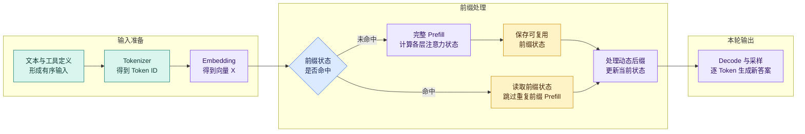
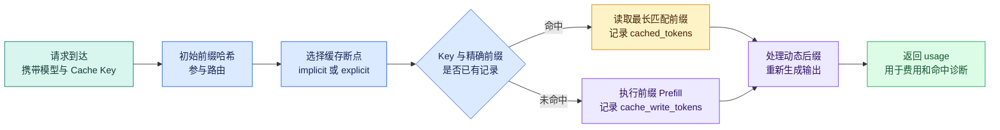
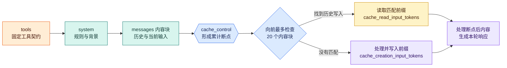

# Prompt Cache：GPT 与 Claude 如何复用输入前缀、计算费用并诊断命中

Prompt Cache 是模型服务对重复输入前缀复用已有处理状态的缓存机制。它位于应用提交 Prompt 与模型继续计算动态输入之间，用于减少相同系统规则、工具定义和示例被反复处理的开销；它不复用上次答案，也不替应用保存会话记忆。

一个知识 Agent 连续收到两个问题：“怎样申请测试环境？”和“测试环境的发布窗口是什么？”两次请求使用相同的系统规则、工具定义、输出格式和示例，只是当前问题与检索证据不同。假设每次输入 21,000 Token，其中稳定内容占 20,000 Token，动态内容只有 1,000 Token。完全不使用缓存时，模型要为两次请求分别处理稳定内容，**20,000 Token 的前缀被重复计算了两遍**。

“缓存 Prompt”这个名字很容易造成误解。Prompt Cache 只按供应商公开的匹配规则识别相同输入前缀；动态问题仍要计算，输出仍要重新生成，权限和答案验证也仍要执行。

这里不重新设计请求对象。[上下文装配与预算](/docs/ai-agent/context-assembly-budget)定义的 `ContextSnapshot` 仍是输入事实：装配器把系统规则、稳定工具 Schema 和输出约束排在前面，把当前问题、会话增量、工具结果和本轮 Evidence 排在后面。Prompt Cache 只记录两段之间的断点与供应商 usage，不修改 Snapshot 的 Scope、Release 或 Block 来源。

要把它用于真实 Agent，不能只知道“把固定内容放前面”。还要回答：模型在 Prefill 阶段做了什么；GPT 与 Claude 在哪里设置断点；怎样从 usage 拆出三类输入；第一次写入为什么可能更贵；至少命中几次才划算；工具、知识版本和租户范围变化后怎样避免错误复用。下面从一次请求的计算路径开始。

## 两次请求究竟重复了什么

先把 Agent 输入按变化频率拆开。这里的 Token 数是便于计算的示例，不代表某个固定系统的真实用量。

| 输入区域 | 第一次请求 | 第二次请求 | 是否适合进入稳定前缀 |
| --- | ---: | ---: | --- |
| 系统与开发者规则 | 8,000 | 8,000 | 是，前提是规则版本相同 |
| 工具 Schema | 5,000 | 5,000 | 是，顺序和字段必须稳定 |
| 输出 Schema 与固定示例 | 7,000 | 7,000 | 是，格式版本相同时可复用 |
| 当前问题 | 200 | 180 | 否，每轮都可能变化 |
| 会话增量 | 300 | 320 | 否，只属于当前 Turn |
| 本轮 RAG 证据 | 500 | 500 | 通常否，受查询、权限和知识版本影响 |
| 输入合计 | 21,000 | 21,000 | 稳定 20,000，动态 1,000 |

若没有缓存，两次调用各完成 21,000 Token 的输入处理，总计处理 42,000 输入 Token。若第一次把 20,000 Token 稳定前缀写入缓存，第二次精确命中，那么第二次只按普通方式处理 1,000 Token 动态后缀，并按缓存读取费率计算 20,000 Token。这里的“只处理后缀”是计费和复用视角的简写：动态 Token 在注意力层仍需读取可用的前缀状态，它不是与前缀隔离运行。

这也给出了三个不能混淆的对象：

- **稳定前缀**是连续位于输入开头、预计会被多次逐 Token 保持一致的内容。
- **动态后缀**是断点之后随请求变化的内容，例如当前问题、工具结果和本轮证据。
- **缓存身份**是供应商用于路由或查找的辅助信息。它不能把不同文本强行变成同一个前缀，也不能代替 ACL。

## 从 Token 到答案：Prompt Cache 省在哪一步

理解缓存之前，先沿一次普通生成走完 Tokenize、Prefill 和 Decode。不同模型的工程实现会变化，但自回归 Transformer 的这条计算主线可以帮助我们判断哪些工作有机会复用。



图中的输入准备把字符串和结构化定义变成有序 Token。未命中分支要为稳定前缀执行完整 Prefill，并产生之后可复用的状态；命中分支读取已有状态，然后两条路径都继续处理动态后缀。最后的 Decode 没有被缓存替代，它仍从当前上下文逐 Token 生成本轮答案。若模型发起工具调用，工具执行、工具结果回填和后续生成也都是新的工作。

### Tokenize 和 Embedding 在做什么

Tokenizer 把文本切成模型词表中的 Token ID。一个汉字不保证等于一个 Token，同一句文本在不同 tokenizer 版本下也可能得到不同序列。Embedding 再把每个 Token ID 映射为一个向量，并与位置信息共同形成首层输入。可以把第 (i) 个位置的表示记为 (x_i)，把一段输入合成矩阵 (X)。

缓存要求“精确前缀”时，比较的不是肉眼看起来语义相近，而是供应商按其协议形成的有序输入前缀必须一致。改一个标点、调整工具顺序、改变图片细节参数或换一个模型，都可能改变实际 Token 或缓存范围。**语义相同不等于缓存前缀相同**，这正是 Prompt Cache 与 Semantic Cache 的第一条边界。

### Q、K、V 为什么会产生可复用状态

每个注意力层会把当前层输入 (X) 通过不同权重矩阵投影成 Query、Key 和 Value：

$$
Q = XW_Q,\qquad K = XW_K,\qquad V = XW_V
$$

- (Q) 表示每个位置当前要寻找什么信息。
- (K) 表示每个位置可以用什么特征被匹配。
- (V) 表示匹配后真正参与聚合的内容表示。

简化后的缩放点积注意力为：

$$
\operatorname{Attention}(Q, K, V)=\operatorname{softmax}\left(\frac{QK^\top}{\sqrt{d_k}}+M\right)V
$$

(M) 是因果掩码。它禁止第 (i) 个位置读取未来位置，保证生成第一个输出 Token 时只依赖完整输入，生成后续 Token 时只依赖输入和已经生成的内容。真实模型还包含多头注意力、归一化、前馈网络、残差连接等步骤，所以不能把一次矩阵乘法当成整个 Prefill。

对已经处理过的前缀，各层产生的 Key、Value 状态能在后续注意力中继续使用。这是通用 KV Cache 的理论基础：生成下一个 Token 时不必反复为旧位置重新计算 K 和 V。**Prompt Cache 是供应商暴露给 API 用户的跨请求复用能力；KV Cache 是模型推理中的注意力状态机制。两者有关联，但不是同一个产品契约。**

OpenAI 的公开文档明确说明，其部分扩展缓存能力会把注意力层在 Prefill 中产生的 Key/Value 张量转移到 GPU 本地存储，并强调原始 Prompt 文本不会以同样方式持久化。Claude 的公开文档说明了前缀哈希、断点、TTL 和 usage，但没有公开其具体张量存储与调度实现。因此本文不会把 OpenAI 的内部描述直接套用到 Claude。

### Prefill 与 Decode 分别负责什么

**Prefill** 一次处理调用开始时已经存在的输入 Token，让每个位置建立层间表示，并为生成准备注意力状态。输入越长，重复前缀的 Prefill 工作越值得复用。**Decode** 从 Prefill 末尾开始，一次生成一个新 Token；每一步都会使用已有前缀和此前输出的状态，再经过 logits、采样或确定性选择得到下一个 Token。

| 阶段 | 输入 | 产生的状态或输出 | 命中 Prompt Cache 后的变化 |
| --- | --- | --- | --- |
| Tokenize | 文本、工具、图片等请求内容 | Token ID 与协议序列 | 供应商仍需识别请求和匹配前缀，不能理解为零工作 |
| 前缀 Prefill | 稳定前缀 Token | 各层前缀处理状态 | 命中部分可以复用，不再按未命中路径重复处理 |
| 后缀 Prefill | 当前问题、证据、会话增量 | 包含本轮动态内容的新状态 | 仍需计算，并读取前缀状态参与注意力 |
| Decode | 完整当前状态 | 新输出 Token | 不跳过，仍执行生成、采样与停止判断 |
| Agent 后处理 | 模型文本或工具调用 | 工具结果、校验结果、最终事件 | 不属于 Prompt Cache，仍需执行 |

命中后答案仍可能不同，原因就在最后两行：缓存复用输入前缀的处理结果，**不缓存输出 Token，也不固定采样结果**。温度、随机采样、动态后缀、工具实时结果乃至供应商服务行为都可能让答案变化。

## Prompt Cache 不是什么缓存

在 Agent 系统中，“缓存”可能出现在模型调用、检索、推理服务器和应用层。名字相近不代表它们能互换。

| 机制 | 缓存对象 | 命中条件 | 命中后还会生成答案吗 | 主要风险 |
| --- | --- | --- | --- | --- |
| Prompt Cache | 输入前缀的已处理状态 | 供应商定义的精确前缀与缓存范围匹配 | 会，动态后缀和 Decode 仍执行 | 前缀不稳定、费用误算、隔离键误用 |
| Response Cache | 完整请求对应的最终响应 | 通常是确定性请求键完全相同 | 通常不会，直接返回旧结果 | 返回过期或越权答案 |
| Semantic Cache | 与当前问题语义相近的历史问答 | 向量相似度和业务阈值通过 | 可能不会，或只把旧答案当候选 | 相似不等于同一意图，权限边界复杂 |
| Retrieval Cache | 查询或过滤条件对应的文档候选 | 查询、Scope、Release、索引版本一致 | 会，模型仍根据证据生成 | 知识更新后返回旧证据 |
| 推理服务 KV/Prefix Cache | 自托管模型的注意力 KV 块 | 引擎按 Token 前缀、块或哈希匹配 | 会 | 显存占用、公平性与驱逐策略 |
| Context Compression | 原始上下文的更短投影 | 由压缩策略触发，不是缓存命中 | 会 | 摘要漂移、遗漏约束或证据 |

三个结论最值得记住：

1. **Prompt Cache 缓存输入前缀的处理结果，不缓存最终答案。**
2. **缓存命中不会让模型记住上一次回答。**若上次回答没有出现在本轮消息或外部记忆中，本轮模型不会因为缓存命中自动获得它。
3. **上下文压缩减少需要输入的内容，Prompt Cache 复用仍然需要输入的内容。**先压缩无价值历史，再让剩余稳定前缀可缓存，二者可以同时使用。

## 稳定前缀与缓存断点

稳定前缀不是“所有长文本”，而是**预计在缓存有效期和复用范围内逐 Token 不变，并且允许在该范围复用**的连续开头。一个可操作的顺序如下：


系统规则先定义模型能做什么；工具 Schema 随后规定可提出的动作；输出 Schema 规定模型结果怎样交给确定性程序；固定示例和背景资料放在断点之前，但必须带有可追踪版本。断点之后才放本轮消息、证据、工具结果和实时时间。图中的顺序不是所有供应商请求对象的唯一序列，真正发送时必须遵守对应 API 对 tools、system 和 messages 的序列化规则。

### 哪些内容通常稳定

- 系统与开发者规则，只要 Prompt 版本没有发布变化。
- 按固定顺序序列化的工具 Schema，包括名称、描述、参数和返回约束。
- 结构化输出 Schema，以及不随用户改变的少量示例。
- 真正跨请求不变、权限范围一致的背景材料。

“稳定”必须经过观测验证。若工具列表按数据库返回顺序随机排列，即使集合相同，序列也不同；若 Schema 构建器每次插入当前时间，整个后续前缀都会改变。对象字段顺序是否影响供应商最终序列化取决于 SDK 和协议，不能靠猜测。工程上应记录发送前的规范化指纹，同时以供应商返回的缓存 usage 作为最终命中证据。

### 哪些内容应留在动态后缀

- 当前用户问题和新追加的会话消息。
- 当前 Turn 的 RAG 证据、查询改写和工具返回值。
- 当前时间、请求 ID、Trace ID、Deadline 与实时资源状态。
- 会频繁变化或含有当前权限结果的内容。

RAG 证据偶尔也能缓存，例如很多请求共享同一份大型公开手册，并且它在 TTL 内版本稳定。但默认把检索结果放在动态后缀更安全，因为查询、文档 Release、ACL 和证据排序都可能变化。优化应从真实 usage 与命中率出发，不能为了缓存把过期证据固化在系统规则之前。

### 七种常见失效原因

| 改动 | 为什么失效或产生风险 | 修复方式 |
| --- | --- | --- |
| 把当前时间放在开头 | 每次请求最早位置就不同，后续长内容都不再是相同前缀 | 把时间放到断点之后 |
| 工具顺序不稳定 | 工具数组属于有序请求内容，换序会改变前缀 | 按版本化清单固定顺序，不在运行时随机排序 |
| Schema 描述或字段变化 | 文本与结构变化都会生成不同输入 | 发布 `tool_schema_version` 并产生新缓存身份 |
| 把用户问题插入系统规则 | 动态内容切断了后面的稳定内容 | 规则完整结束后设置断点，再追加问题 |
| 把本轮证据插到固定示例前 | 检索结果变化导致示例也无法复用 | 证据默认放在动态后缀 |
| 更换模型或推理配置 | 供应商可能使用不同 tokenizer、状态或缓存范围 | 模型及相关配置进入版本标识，不假设跨模型共享 |
| 多租户共用一个业务缓存键 | 辅助路由键不是 ACL，可能造成隔离设计错误 | Scope、Policy、Release 进入稳定身份，调用前后仍做权限检查 |

## GPT：精确前缀、路由键与显式断点

OpenAI 对 GPT-5.6 及后续模型公开了更明确的缓存控制。理解它时要分成三层：**文本前缀决定能否精确匹配，`prompt_cache_key` 影响请求路由，断点决定在哪个前缀查找和写入**。缓存键相同不能弥补文本不同，文本相同也不代表在任意流量和生命周期下必然命中。



请求先依据初始前缀哈希参与路由；官方说明哈希通常取最初约 256 Token，具体长度会随模型变化。提供 `prompt_cache_key` 后，它与前缀哈希共同影响路由，让共享长前缀的请求更可能落到有相应缓存的位置。随后服务在有效断点处检查 Key 与精确前缀，多个断点命中时读取最长匹配前缀。无论命中还是写入，动态后缀与输出都继续处理，最后必须从 usage 而不是客户端猜测判断结果。

### 自动缓存和最低长度

近期 OpenAI 模型从 GPT-4o 起支持符合条件的自动 Prompt Cache。GPT-5.6 及后续模型要求可缓存前缀至少 1,024 Token；更早模型的最低长度依模型而异，可能在 1,024 到 2,048 Token 之间。短于最低长度的请求仍可能返回 `cached_tokens` 字段，但值为 0。

在 GPT-5.6 上，默认 `implicit` 模式会在最新的 user 或 tool 消息处放置隐式断点。它不会像某些较早模型那样自动退回到任意更早的最长未标记前缀。如果最新消息含时间戳或当前问题，隐式断点处的整体前缀持续变化，就可能反复出现 `cached_tokens = 0` 和新的写入。这正是显式断点解决的问题。

### 显式断点控制哪一段可写

GPT-5.6 及后续模型允许在支持的内容块上加入 `prompt_cache_breakpoint: {"mode": "explicit"}`，表示“从请求开头到这个块结束”是一段候选缓存前缀。请求级 `prompt_cache_options.mode` 有两种选择：

- `implicit` 是默认值。服务保留最新消息处的隐式断点，也使用显式断点。
- `explicit` 关闭隐式断点，只读取和写入你标记的显式断点，适合把频繁变化后缀排除在付费写入之外。

一次请求最多创建 4 个新缓存写入。在 `implicit` 模式下，最新消息的隐式断点占一个写入槽；在 `explicit` 模式下，最多可写最近 4 个显式断点。读取时只会检查会话中一段有限的近期断点，多个命中取最长前缀；这个回看上限属于会变化的服务能力，当前指南与 API 参考甚至可能在文档更新窗口给出不同数字，因此实现不应依赖它做业务正确性判断。GPT-5.6 断点 TTL 当前唯一值和默认值都是 `30m`：它表示最短可用时间，不承诺精确过期时刻或最长保留时间。

较早模型不认识 `prompt_cache_options` 和 `prompt_cache_breakpoint` 时会返回 400，不能把新参数无条件发给所有模型。它们继续使用各自的自动缓存与 `prompt_cache_retention` 行为。**模型能力必须按实际 model ID 建表，不要只用“GPT”这个品牌名判断。**

### `prompt_cache_key` 是分桶提示，不是强制命中

同一稳定前缀应复用同一个 Key，帮助请求保持路由局部性。官方建议单个 Key 下所有前缀的总流量维持在大约每分钟 15 次；更高流量可按稳定规则增加分桶，否则同一 Key 的请求也可能分散而降低命中率。分桶必须稳定，例如用可信 Scope 与固定 bucket 编号计算，不能每次随机生成。

Key 有三个明确边界：

1. 它不能覆盖精确前缀匹配。Key 相同而规则不同，仍应是不同前缀。
2. 它不保证缓存命中。路由、首次写入、TTL 和并发都可能导致未命中。
3. 它不是用户身份、访问令牌或 ACL。服务端必须在模型调用前重新验证当前权限。

### 构造 Responses API 请求并读取 usage

下面只保留请求中决定缓存行为的语句。运行前需要安装当前 OpenAI SDK，并通过环境变量配置 API Key；`stable_rules` 在真实请求中必须足够长，示例短文本本身达不到 1,024 Token，因此不能用它证明真实命中。

```python
from openai import OpenAI

client = OpenAI()

# 这部分代表低频变化的规则、工具说明和输出契约；生产环境应由版本化模板生成。
stable_rules = "你是只读知识助手。回答必须引用当前用户可见证据。" * 200
current_question = "测试环境的发布窗口是什么？"

response = client.responses.create(
    model="gpt-5.6-terra",
    # 相同可信范围和 Prompt 版本使用稳定分桶；它只帮助路由，不承担鉴权。
    prompt_cache_key="scope-public:prompt-v3:bucket-02",
    prompt_cache_options={"mode": "explicit", "ttl": "30m"},
    input=[
        {
            "role": "developer",
            "content": [
                {
                    "type": "input_text",
                    "text": stable_rules,
                    # 断点到此为止；后面的当前问题可以变化而不改变这个候选前缀。
                    "prompt_cache_breakpoint": {"mode": "explicit"},
                }
            ],
        },
        {
            "role": "user",
            "content": [{"type": "input_text", "text": current_question}],
        },
    ],
)

details = response.usage.input_tokens_details
# input_tokens 是总输入；读、写分类要从 details 拆出，剩余部分才按普通输入计价。
cache_read = details.cached_tokens
cache_write = getattr(details, "cache_write_tokens", 0)
uncached = response.usage.input_tokens - cache_read - cache_write
print({"普通输入": uncached, "缓存写入": cache_write, "缓存读取": cache_read})
```

调用从稳定规则开始，在该内容块末尾放置显式断点，然后追加动态问题。`explicit` 模式避免服务又把动态的最新消息作为隐式写入候选。响应返回后，`input_tokens` 表示总输入量，`cached_tokens` 和 `cache_write_tokens` 是其中的缓存分类；三者不能再次全部相加，否则会重复计费。

真实运行需要处理三类失败：模型不支持新字段时会返回请求错误；前缀过短时缓存读取为 0；Key 或前缀改变、缓存尚未写好、流量分散或 TTL 失效时也可能读不到。代码中的 `getattr` 只用于兼容尚未返回写入字段的响应对象，不能用它掩盖模型能力判断。应该在部署前按模型能力表选择请求结构，并把原始 usage 保存到 Trace。

## Claude：按 tools、system、messages 累计前缀

Claude 的缓存同样依赖精确前缀，但公开契约与 GPT 不同。Claude 按 **`tools → system → messages`** 的顺序形成可缓存前缀。可以在请求顶层设置自动缓存，也可以在具体内容块上放显式 `cache_control`。查找的对象是历史请求已经在断点写入的前缀，并不是服务看到一段相似长文本就自动推断它“应该稳定”。



工具定义排在最前，任何工具变化都会影响后续累计前缀；system 随后进入哈希；messages 再按内容块顺序增长。显式断点只在标记位置写入。查找时，Claude 从断点位置向前寻找历史写入，每个断点最多回看 20 个内容块。命中后读取此前累计前缀，未命中则处理并写入；两条路径最后都继续处理断点之后的内容和生成输出。

### 自动缓存与显式断点

顶层 `cache_control` 是自动缓存入口。系统把断点应用到最后一个可缓存内容块，并随着多轮对话增长向前推进，适合先验证整体命中效果。块级 `cache_control` 则让开发者明确指定断点，适合稳定规则、长背景和动态消息边界清楚的 Agent。

显式断点具有累计语义：某个 messages 内容块上的断点，包含此前的 tools、system 和更早 messages，而不是只缓存当前块。Claude 最多允许 4 个断点；多个断点可以分别覆盖工具与规则、长背景、较稳定历史等层次，但每多一层都要考虑写入费用和命中概率。超过 20 个内容块的回看限制时，应在需要复用的前缀末尾增加更靠近的断点，而不是期待服务扫描任意久远的块。

### TTL、最低长度和并发窗口

默认 TTL 是 5 分钟，可选 1 小时。TTL 从发起写入或读取请求时开始计算；读取会刷新有效期。1 小时写入价格更高，只有复用间隔确实超过 5 分钟且后续命中次数足够时才值得使用。

最低可缓存长度依模型而异。当前公开列表中，Claude Sonnet 5、Sonnet 4.6 和 Sonnet 4.5 为 1,024 Token；Claude Opus 5 为 512 Token；部分 Opus 与 Haiku 型号为 4,096 Token。低于对应阈值时请求仍可执行，但不会写入缓存。上线前必须按准确 model ID 读取当前限制，不能把 Sonnet 5 的阈值套给所有 Claude。

新缓存要到首个响应开始后才可供其他请求读取。如果多个完全相同请求在第一个响应开始前并发到达，后来的请求可能都看不到这次新写入，于是各自承担普通输入或写入成本。高并发预热应先完成一个小输出请求并观察写入 usage，再放开依赖该前缀的并发流量。

### 哪些改动会改变 Claude 缓存

因为前缀按 tools、system、messages 累计，前方任何变化都会影响后面的断点。工具定义、工具选择设置、图片内容、thinking 或 effort 等请求形态变化，都应按当前官方失效规则核对。尤其不能在开启或关闭 thinking 后假设旧前缀仍然可读，也不能把工具调用历史随意改写后继续沿用旧断点。

这里仍要保持事实边界：Claude 公开了前缀序列、哈希、断点、回看、TTL 和计量字段，但没有公开缓存对象具体放在哪种存储、由什么调度器管理。**命中便宜是官方计价事实；具体基础设施成本不是公开公式。**

### 构造自动或显式缓存请求

下面的函数用同一份稳定规则展示两种模式。`automatic=True` 时把 `cache_control` 放在请求顶层；显式模式则把它放在稳定 system 内容块上。`ttl` 传入 `5m` 或 `1h`。示例同样需要当前 Anthropic SDK 和环境变量中的 API Key，短文本重复只是为了满足教学结构，不代表真实业务应复制文字凑长度。

```python
from anthropic import Anthropic

client = Anthropic()

def ask_claude(question: str, *, automatic: bool, ttl: str = "5m"):
    # 稳定规则位于 system；实际项目应使用不可变 Prompt 版本生成，而不是运行时拼接时间。
    stable_rules = "你是只读知识助手。只能依据当前可见证据回答。" * 200
    cache_policy = {"type": "ephemeral", "ttl": ttl}

    request = {
        "model": "claude-sonnet-5",
        "max_tokens": 500,
        "messages": [{"role": "user", "content": question}],
    }
    if automatic:
        # 顶层策略让服务把断点放到最后一个可缓存块，适合先验证自动缓存行为。
        request["cache_control"] = cache_policy
        request["system"] = stable_rules
    else:
        # 块级策略明确在稳定规则后断开；当前问题不会进入这个缓存前缀。
        request["system"] = [
            {"type": "text", "text": stable_rules, "cache_control": cache_policy}
        ]

    response = client.messages.create(**request)
    usage = response.usage
    # Claude 的 input_tokens 只表示最终断点后的普通输入，总输入还要加上写入和读取。
    total_input = (
        usage.input_tokens
        + usage.cache_creation_input_tokens
        + usage.cache_read_input_tokens
    )
    return response.content, usage, total_input
```

调用方先选择自动还是显式模式，再选择 TTL，函数随后构造 system 和动态 user 消息。显式模式中断点落在 system 块末尾，因此只改 `question` 时累计前缀仍可相同。返回的 `input_tokens` 不是完整输入总量，而是最终断点之后按普通输入计量的 Token；总输入必须加上 `cache_creation_input_tokens` 与 `cache_read_input_tokens`。

参数错误、模型不支持相应 TTL、稳定前缀低于最低长度时，都不能从代码结构本身推断会命中。生产代码应捕获 SDK 的请求错误，并记录模型、TTL、三类 usage 与请求前缀版本。若同时需要多个断点，还要确认每个断点的 20 块回看范围和总数上限，而不是简单复制 `cache_control`。

## 把 usage 还原成一张可以复算的账单

Prompt Cache 的账单至少有四类 Token。为了同时表达 GPT 与 Claude，定义：

- (U)：按普通输入费率计算的 Token。
- (W)：本次写入缓存的 Token。
- (R)：本次从缓存读取的 Token。
- (O)：本次生成的输出 Token。

若四类单价都以“每百万 Token 的美元价格”表示，统一公式为：

$$
\text{费用}=\frac{U P_U+W P_W+R P_R+O P_O}{1{,}000{,}000}
$$

(P_U、P_W、P_R、P_O) 分别是普通输入、缓存写入、缓存读取和输出单价。没有发生的分类填 0，而不是把单价省略。**一个输入 Token 在同一次调用中只能属于普通、写入或读取中的一类**；若把总输入又与写入、读取相加，账单会重复计算。

下面费率是 **2026-08-12 的标准费率快照**，用于演示公式，不是永久价格。实际账单还可能受长上下文、Batch、服务层级、数据驻留或第三方云平台定价影响，运行系统必须从版本化费率表读取当前值。

### GPT-5.6 Terra 的短上下文示例

| 类型 | 单价/百万 Token |
| --- | ---: |
| 普通输入 | $2.00 |
| 缓存写入 | $2.50 |
| 缓存读取 | $0.20 |
| 输出 | $12.00 |

仍用稳定前缀 20,000 Token、动态输入 1,000 Token、输出 500 Token：

| 请求状态 | (U) | (W) | (R) | (O) | 计算 | 单次费用 |
| --- | ---: | ---: | ---: | ---: | --- | ---: |
| 完全未缓存 | 21,000 | 0 | 0 | 500 | (21000×2+500×12) / 1M | $0.048 |
| 第一次写入 | 1,000 | 20,000 | 0 | 500 | (1000×2+20000×2.5+500×12) / 1M | $0.058 |
| 后续命中 | 1,000 | 0 | 20,000 | 500 | (1000×2+20000×0.2+500×12) / 1M | $0.012 |

第一次写入比完全未缓存贵 $0.010，因为 20,000 个稳定 Token 从 $2.00/MTok 变成 $2.50/MTok；动态输入和输出没有变化。第二次命中少付 $0.036。把写入与命中合起来，两次无缓存是 $0.096，缓存方案是 $0.070，净省 $0.026，约 27.08%。三次请求时，无缓存累计 $0.144，缓存方案累计 $0.082，净省 $0.062，约 43.06%。

这组数字也说明为什么不能宣传“命中请求省 75%”。命中请求从 $0.048 降到 $0.012 确实是 75%，但它忽略了第一次 $0.058 的写入。业务决策应看一个缓存生命周期内的累计账单，而不是挑最便宜的一次请求。

### Claude Sonnet 5 的 5 分钟与 1 小时示例

| 类型 | 单价/百万 Token |
| --- | ---: |
| 普通输入 | $2.00 |
| 5 分钟写入 | $2.50 |
| 1 小时写入 | $4.00 |
| 缓存读取 | $0.20 |
| 输出 | $10.00 |

相同 Token 数下，Claude 的输出费率不同，因此未缓存账单是 (21000×2+500×10) / 1M = $0.047。

| 请求状态 | (U) | (W) | (R) | (O) | 单次费用 |
| --- | ---: | ---: | ---: | ---: | ---: |
| 完全未缓存 | 21,000 | 0 | 0 | 500 | $0.047 |
| 5 分钟第一次写入 | 1,000 | 20,000 | 0 | 500 | $0.057 |
| 1 小时第一次写入 | 1,000 | 20,000 | 0 | 500 | $0.087 |
| 后续命中 | 1,000 | 0 | 20,000 | 500 | $0.011 |

5 分钟方案两次累计 $0.068，对比无缓存 $0.094，净省 $0.026；三次累计 $0.079，对比 $0.141，净省 $0.062。1 小时方案两次累计 $0.098，反而比无缓存多 $0.004；到第三次累计 $0.109，才比无缓存少 $0.032。长 TTL 不是自动更省钱，它买的是更长的复用机会，只有请求间隔和命中次数能覆盖额外写入费时才成立。

### 为什么读取便宜，写入反而可能更贵

从计算层看，读取缓存减少了重复稳定前缀的 Prefill；动态后缀、对缓存状态的注意力读取和 Decode 仍然发生，所以读取不会是零成本。从基础设施层看，供应商仍要完成鉴权、路由、缓存查找、状态读取、容量管理和失败处理。缓存写入则既要完成第一次 Prefill，又要保存和管理可复用状态；更长 TTL 通常占用缓存容量更久。

从商业层看，0.1 倍读取、1.25 倍写入或 2 倍长 TTL 写入是供应商公开的**计价比例**，不是“GPU 实际成本等于这个公式”的证明。GPT-5.6 和 Claude 都把写入单独计价，但具体定价策略由供应商决定。我们可以用公开费率算账，却不能由售价反推出未公开的硬件、驱逐和调度成本。

## 至少命中几次才回本

只比较稳定前缀，设普通处理一次的单价为 (B)，首次缓存写入单价为 (W)，读取单价为 (R)。缓存方案先写一次，再成功读取 (n) 次；无缓存方案总共普通处理 (n+1) 次。缓存更便宜的条件是：

$$
W+nR < (n+1)B
$$

移项可得：

$$
n > \frac{W-B}{B-R}
$$

这里假设 (B>R)。若读取价不低于普通价，增加命中次数不会靠读取折扣回本。因为 (n) 是整数，还要取满足严格不等式的最小非负整数，而不是简单四舍五入。

| 方案 | (B) | (W) | (R) | 阈值 | 最少后续命中 |
| --- | ---: | ---: | ---: | ---: | ---: |
| GPT-5.6 当前写入 | 2.00 | 2.50 | 0.20 | (n>0.277…) | 1 |
| Claude 5 分钟 | 2.00 | 2.50 | 0.20 | (n>0.277…) | 1 |
| Claude 1 小时 | 2.00 | 4.00 | 0.20 | (n>1.111…) | 2 |

“一次命中回本”不代表任何请求都应该缓存。前缀必须达到最低长度，后续命中必须发生在有效期内，前缀变化不能触发重复写入，而且稳定 Token 数要占到足以影响总账单的比例。若同一前缀一小时只出现一次、每次都过期，缓存会持续支付写入溢价而没有读取收益。

## 用一个计算器拒绝重复计费

下面的计算器把费率与 usage 分开。输入是四类 Token 和费率，输出是单次费用；`break_even_hits` 则计算最少后续命中次数。代码对负数、缺失费率和非法读取费率直接报错，防止日志缺字段时静默算出一个看似合理的数字。

```python
from dataclasses import dataclass, fields
from math import floor

@dataclass(frozen=True)
class RateCard:
    # 所有单价统一为“美元/百万 Token”，None 表示费率缺失，不能按 0 处理。
    uncached_input: float | None
    cache_write: float | None
    cache_read: float | None
    output: float | None

@dataclass(frozen=True)
class Usage:
    # 三种输入分类互斥；调用方不能再把 total_input 作为第五项传入。
    uncached_input: int
    cache_write: int
    cache_read: int
    output: int

def calculate_cost(usage: Usage, rates: RateCard) -> float:
    token_counts = {field.name: getattr(usage, field.name) for field in fields(Usage)}
    prices = {field.name: getattr(rates, field.name) for field in fields(RateCard)}

    if any(count < 0 for count in token_counts.values()):
        # 负数通常意味着 usage 还原公式错了，继续计算会掩盖重复扣减。
        raise ValueError("Token 数不能为负数")
    if any(price is None for price in prices.values()):
        # 模型或服务层级没有费率时必须停止，不能套用另一模型的价格。
        raise ValueError("费率不完整")

    # 字段同名使每类 Token 只与自己的费率相乘，避免总输入与缓存输入重复计费。
    total = sum(token_counts[name] * prices[name] for name in token_counts)
    return total / 1_000_000

def usage_from_items(items: list[tuple[str, int]]) -> Usage:
    allowed = {field.name for field in fields(Usage)}
    categories = [name for name, _ in items]
    if len(categories) != len(set(categories)):
        # 同一分类出现两次会造成重复计费，先在进入固定 Usage 结构前拒绝。
        raise ValueError("usage 分类重复")
    if set(categories) != allowed:
        raise ValueError("usage 分类缺失或未知")
    return Usage(**dict(items))

def break_even_hits(base: float, write: float, read: float) -> int:
    if min(base, write, read) < 0:
        raise ValueError("费率不能为负数")
    if read >= base:
        raise ValueError("缓存读取不低于普通输入，无法靠后续读取回本")

    threshold = (write - base) / (base - read)
    # 不等式是 n > threshold；floor + 1 能正确处理阈值恰好为整数的情况。
    return max(0, floor(threshold) + 1)

def compare_cache_lifecycle(
    *, rates: RateCard, ordinary: Usage, first_write: Usage, cache_hit: Usage, hits: int
) -> dict[str, float]:
    if hits < 0:
        raise ValueError("命中次数不能为负数")

    # 无缓存与缓存方案都包含首次请求和相同数量的后续请求，比较口径才一致。
    baseline = calculate_cost(ordinary, rates) * (hits + 1)
    cached = calculate_cost(first_write, rates) + calculate_cost(cache_hit, rates) * hits
    saving_rate = 0.0 if baseline == 0 else (baseline - cached) / baseline
    return {"无缓存累计": baseline, "缓存累计": cached, "节省比例": saving_rate}

gpt_rates = RateCard(2.00, 2.50, 0.20, 12.00)
ordinary = Usage(uncached_input=21_000, cache_write=0, cache_read=0, output=500)
first_write = Usage(uncached_input=1_000, cache_write=20_000, cache_read=0, output=500)
cache_hit = Usage(uncached_input=1_000, cache_write=0, cache_read=20_000, output=500)

print(f"首次写入: ${calculate_cost(first_write, gpt_rates):.3f}")
print(f"后续命中: ${calculate_cost(cache_hit, gpt_rates):.3f}")
print(f"最少命中: {break_even_hits(2.00, 2.50, 0.20)} 次")
print(compare_cache_lifecycle(
    rates=gpt_rates, ordinary=ordinary, first_write=first_write, cache_hit=cache_hit, hits=2
))
```

`RateCard` 只负责价格快照，`Usage` 只负责一次调用的互斥计量；`usage_from_items` 在动态行项目进入固定结构前拒绝重复、缺失和未知分类；`calculate_cost` 再按同名字段相乘。`compare_cache_lifecycle` 保证两种方案比较相同请求次数。运行后应看到首次写入 `$0.058`、后续命中 `$0.012`、最少命中 `1 次`，三次请求累计为无缓存 `$0.144`、缓存 `$0.082`、节省约 `43.06%`。若从 GPT 总输入推导普通输入，公式应是 `input_tokens - cached_tokens - cache_write_tokens`；结果为负数时，说明字段语义、SDK 版本或重复扣减至少有一项不对。

下面的测试不仅断言最终总价，还分别覆盖未缓存、两种写入、命中与错误输入。运行环境需要 `pytest`，把计算器放在 `prompt_cache_cost.py` 后执行测试文件即可。

```python
import pytest

from prompt_cache_cost import (
    RateCard,
    Usage,
    break_even_hits,
    calculate_cost,
    compare_cache_lifecycle,
    usage_from_items,
)

GPT = RateCard(2.00, 2.50, 0.20, 12.00)
CLAUDE_5M = RateCard(2.00, 2.50, 0.20, 10.00)
CLAUDE_1H = RateCard(2.00, 4.00, 0.20, 10.00)

@pytest.mark.parametrize(
    ("usage", "rates", "expected"),
    [
        # 同一组 Token 分别验证普通、写入和读取账单，能发现分类重复或输出漏算。
        (Usage(21_000, 0, 0, 500), GPT, 0.048),
        (Usage(1_000, 20_000, 0, 500), GPT, 0.058),
        (Usage(1_000, 0, 20_000, 500), GPT, 0.012),
        (Usage(21_000, 0, 0, 500), CLAUDE_5M, 0.047),
        (Usage(1_000, 20_000, 0, 500), CLAUDE_5M, 0.057),
        (Usage(1_000, 20_000, 0, 500), CLAUDE_1H, 0.087),
        (Usage(1_000, 0, 20_000, 500), CLAUDE_5M, 0.011),
    ],
)
def test_request_cost(usage: Usage, rates: RateCard, expected: float) -> None:
    assert calculate_cost(usage, rates) == pytest.approx(expected)

def test_break_even_hits() -> None:
    # GPT、Claude 5 分钟写入需要一次后续命中，1 小时写入需要两次。
    assert break_even_hits(2.00, 2.50, 0.20) == 1
    assert break_even_hits(2.00, 4.00, 0.20) == 2

def test_three_request_lifecycle() -> None:
    # 写入后命中两次时，累计费用与正文账单表必须能互相复算。
    report = compare_cache_lifecycle(
        rates=GPT,
        ordinary=Usage(21_000, 0, 0, 500),
        first_write=Usage(1_000, 20_000, 0, 500),
        cache_hit=Usage(1_000, 0, 20_000, 500),
        hits=2,
    )
    assert report["无缓存累计"] == pytest.approx(0.144)
    assert report["缓存累计"] == pytest.approx(0.082)
    assert report["节省比例"] == pytest.approx(0.4305555556)

def test_invalid_usage_and_rate_are_rejected() -> None:
    with pytest.raises(ValueError, match="Token 数"):
        calculate_cost(Usage(-1, 0, 0, 0), GPT)

    # 缺失写入费率不能默认为零，否则首次写入会被错误地显示为免费。
    with pytest.raises(ValueError, match="费率不完整"):
        calculate_cost(Usage(0, 100, 0, 0), RateCard(2.0, None, 0.2, 10.0))

    # 动态账单中重复出现 cache_read 时立即失败，不能把两行都计入总价。
    with pytest.raises(ValueError, match="分类重复"):
        usage_from_items([
            ("uncached_input", 1_000),
            ("cache_write", 0),
            ("cache_read", 10_000),
            ("cache_read", 10_000),
            ("output", 500),
        ])
```

参数化测试按 `Usage → RateCard → calculate_cost` 的顺序执行，每一行对应前面的账单表。`pytest.approx` 避免浮点表示误差干扰金额断言。累计测试覆盖写入后两次命中的完整生命周期；错误测试证明负数分类、缺失费率和重复分类都会立即失败，不会用看似正常的总价掩盖 usage 适配错误。

## Agent、RAG 和多租户不能只靠一个 Cache Key

稳定前缀会跨请求复用，因此它也必须服从权限、版本和数据生命周期。一个可审计的缓存范围至少应包含：

| 维度 | 为什么进入范围 | 变化后的动作 |
| --- | --- | --- |
| 模型及版本 | tokenizer、能力和缓存契约可能不同 | 产生新指纹与 Key |
| Prompt 版本 | 规则变化会改变行为与精确前缀 | 新版本重新写入 |
| Tool Schema 版本 | 工具顺序、参数和权限可能变化 | 固定排序并更新版本 |
| Policy 版本 | 安全规则收紧不能沿用旧范围 | 新范围并重新做准入 |
| 租户或可信 Scope | 防止把不同可见范围视为同一业务前缀 | 隔离分桶，不把 Key 当授权 |
| 知识 Release | 文档内容和有效状态会变化 | 新 Release 使用新身份 |
| 稳定分桶编号 | 高流量下保持可预测路由 | 用稳定映射扩桶，不随机 |

`prompt_cache_key` 和 Claude 的前缀哈希都不是身份认证。服务端应先从登录态建立可信 Scope，再验证当前问题可访问的资源，之后才选择 Prompt 版本和缓存身份。缓存命中后，检索 ACL、答案引用权限和最终输出验证仍必须基于**当前请求**重新执行。权限收紧时，只换 Key 而不改真正前缀和权限检查并不构成安全修复。

RAG 证据通常留在动态后缀，并带知识 Release、文档版本和 ACL 过滤结果。若确实要缓存一份公共长文档，应把“公共”作为可信服务端事实，把 Release 放入前缀版本，并在发布新 Release 时形成新缓存范围。Secret、访问令牌、临时签名 URL 和不必要的个人数据不应为了提高命中率塞进共享稳定前缀。

还要区分价格与容量：OpenAI 明确说明缓存 Token 仍计入相应速率限制。Claude 或第三方平台的限流口径也要按实际服务条款核对。**缓存折扣不等于免费 TPM、免费显存或无限并发**，准入控制和模型资源槽不能因为读取更便宜而取消。

### 用规范化指纹先发现客户端漂移

供应商 usage 是最终命中证据，但请求发出前也应生成一个不含动态问题的稳定前缀指纹，用于定位“为什么我们以为相同，实际发送却不同”。下面只哈希稳定字段，并保留工具数组顺序；这样工具换序会被视为真实变更。

```python
import hashlib
import json
from typing import Any

def stable_prefix_fingerprint(
    *,
    model: str,
    prompt_version: str,
    rules: str,
    tools: list[dict[str, Any]],
    trusted_scope: str,
    knowledge_release: str,
) -> str:
    # 只装配允许复用的服务端事实；当前问题、时间和本轮证据不能进入这里。
    stable_payload = {
        "model": model,
        "prompt_version": prompt_version,
        "rules": rules,
        "tools": tools,
        "trusted_scope": trusted_scope,
        "knowledge_release": knowledge_release,
    }
    # sort_keys 只稳定对象字段；工具列表顺序保留，因此换序会产生不同指纹。
    canonical = json.dumps(
        stable_payload,
        ensure_ascii=False,
        sort_keys=True,
        separators=(",", ":"),
    )
    return hashlib.sha256(canonical.encode("utf-8")).hexdigest()

def build_request(question: str, **stable: Any) -> dict[str, Any]:
    fingerprint = stable_prefix_fingerprint(**stable)
    # 动态问题只进入断点后的请求体；它不参与客户端稳定前缀指纹。
    return {
        "prefix_fingerprint": fingerprint,
        "stable": stable,
        "dynamic": {"question": question},
    }
```

`stable_prefix_fingerprint` 的输入全部来自服务端版本和可信范围，输出是可记录但不可反向恢复原文的 SHA-256。`build_request` 将动态问题放到单独区域，因此只改问题时指纹不变；规则、工具顺序、Scope 或 Release 改变时指纹必须变化。这个指纹不是供应商内部哈希，也不能预测一定命中，它只证明客户端认为自己发送了哪一个稳定版本。

可以用下面的测试验证边界。测试显式修改四个关键维度，避免“只测 happy path”却让租户或知识版本遗漏在指纹外。

```python
from copy import deepcopy

from prompt_prefix import build_request

BASE = {
    "model": "model-a",
    "prompt_version": "prompt-v3",
    "rules": "只读回答并返回证据引用",
    "tools": [
        {"name": "search", "schema": {"query": "string"}},
        {"name": "read", "schema": {"document_id": "string"}},
    ],
    "trusted_scope": "tenant-7:public",
    "knowledge_release": "release-42",
}

def test_dynamic_question_does_not_change_prefix() -> None:
    # 两轮问题不同，但稳定规则和可见范围相同，因此客户端指纹应保持一致。
    first = build_request("怎样申请环境？", **BASE)
    second = build_request("发布窗口是什么？", **BASE)
    assert first["prefix_fingerprint"] == second["prefix_fingerprint"]

def test_stable_boundaries_change_prefix() -> None:
    baseline = build_request("问题", **BASE)["prefix_fingerprint"]

    for field, value in [
        ("rules", "只读回答；证据不足时拒答"),
        ("trusted_scope", "tenant-8:public"),
        ("knowledge_release", "release-43"),
    ]:
        changed = {**BASE, field: value}
        # 规则、Scope 或 Release 任一变化都必须切换稳定前缀身份。
        assert build_request("问题", **changed)["prefix_fingerprint"] != baseline

    reordered = deepcopy(BASE)
    reordered["tools"].reverse()
    # 工具列表属于有序协议，集合相同但顺序不同也不能视为精确相同前缀。
    assert build_request("问题", **reordered)["prefix_fingerprint"] != baseline
```

第一项测试保证当前问题不会污染稳定身份；第二项逐一证明规则、可信 Scope、知识 Release 和工具顺序都在保护范围内。真实系统还应对模型、Prompt 版本、Policy 版本和输出 Schema 版本做同类断言。若客户端指纹相同但供应商 usage 没有读取，排查方向应转向断点位置、最低长度、TTL、首次写入完成时机、Key 分桶和供应商路由，而不是继续改哈希函数。

## 六组实验把“感觉没命中”变成证据

不要用一次请求的延迟猜缓存。网络、排队、输出长度和服务负载都会改变总耗时。应固定模型与输出上限，连续运行受控变量实验，并同时查看 usage、TTFT 和前缀版本。

| 实验 | 只改变什么 | 预期观察 | 若不符合先查什么 |
| --- | --- | --- | --- |
| A | 只改用户问题 | 稳定前缀可读取，动态输入仍按普通费率 | 问题是否被插在断点前、隐式断点是否包含动态消息 |
| B | 修改系统规则 | 旧前缀不再精确匹配，出现新写入 | Prompt 版本是否同步、日志是否误把两个版本聚合 |
| C | 交换工具顺序 | 前缀指纹改变，旧缓存失效 | SDK 最终序列化和工具构建顺序 |
| D | 修改知识 Release | 新范围重新写入，旧 Release 不应被业务复用 | Release 是否真正进入稳定前缀和服务端授权 |
| E | 在前缀加入时间戳 | 读取率显著下降，写入率上升 | 动态字段定位与模板渲染结果 |
| F | 调整 Cache Key 或断点 | 写入、读取 Token 和最长前缀随位置改变 | Key 分桶、最低 Token、GPT/Claude 的断点规则 |

实验顺序也有意义。先做 A 验证基本复用，再做 B/C/D 证明隔离，再故意用 E 复现污染，最后用 F 优化断点和路由。每组至少发出一次写入和一次候选读取；Claude 并发实验要等待首个响应开始，GPT 则要记录显式或隐式模式。没有真实 API Key 时，可以验证客户端指纹与费用逻辑，但不能把本地哈希相同写成供应商已命中。

## 观测字段和未命中排查顺序

一条缓存 Trace 至少记录：

- 普通输入、缓存写入、缓存读取和输出 Token；保留供应商原始 usage。
- 模型及版本、Prompt 版本、Tool Schema 版本、Policy 版本和知识 Release。
- 去敏后的 Cache Key、稳定前缀指纹、断点模式与 TTL。
- TTFT、总延迟、停止原因、输出 Token 和错误类型。
- 按稳定范围统计的写入率、读取率、读取/写入 Token 比与净节省。

命中率可以按“有缓存读取的请求数 / 候选请求数”统计，但成本分析还要看 Token：一次只读 1,024 Token 和一次读取 100,000 Token 的价值不同。建议同时计算 `sum(cache_read_tokens) / sum(cache_write_tokens)`，再使用版本化费率还原净成本。费率改变后，历史 Token 事实不变，但美元成本应按发生时的费率快照计算。

排查未命中时按下面顺序收窄：

1. **先看资格**：模型是否支持、稳定前缀是否达到最低 Token、请求是否真的设置了对应模式。
2. **再看精确性**：发送前指纹是否相同，工具、图片、Schema、thinking、时间戳是否变化。
3. **再看断点**：断点是否位于稳定内容末尾，GPT 是否被隐式断点写入动态后缀，Claude 是否超过 20 块回看或 4 个断点。
4. **再看生命周期**：首次写入是否已可读、TTL 是否过期、并发请求是否抢在首个响应开始前。
5. **再看路由与分桶**：GPT Key 是否稳定，单 Key 流量是否过高，是否把同一前缀随机分散。
6. **最后看收益**：即使命中，写入量、读取量和输出成本是否真的让累计账单下降。

TTFT 下降可以支持“重复 Prefill 变少”的判断，但不是单独的命中证据；只有供应商 usage 中的读取 Token 才能进入正式账单。相反，usage 命中而总延迟没有明显下降也不矛盾：排队、动态后缀、工具调用和长输出可能占据主要耗时。


**1. Prompt Cache 和直接缓存最终答案有什么根本区别？**

Prompt Cache 复用的是输入前缀的处理状态，本轮仍会处理动态后缀并重新 Decode；最终答案缓存则通常绕过模型，直接返回历史响应。前者适合固定规则很长、问题持续变化的 Agent，后者只适合请求键、权限、数据版本和输出都足够确定的场景。若把带实时证据的问答做结果缓存，必须把 Scope、Release、查询和过期策略纳入键，否则可能返回过期或越权答案。

**2. 为什么只改一个时间戳也可能让几万 Token 都不能命中？**

缓存匹配要求从输入开头到断点保持精确一致。时间戳若位于前缀早期，它之后即使有几万 Token 完全相同，也不再属于同一条连续前缀。修复不是删除业务需要的时间，而是把它移动到稳定断点之后。排查时比较发送前规范化指纹和最终请求序列，并观察写入 Token 是否随每次请求重复出现。

**3. 工具集合相同，只换了数组顺序为什么还会失效？**

API 请求里的工具是有序结构，供应商看到的是序列化后的前缀，不是数学上的无序集合。换序可能改变 Token 序列，也可能改变模型对工具的注意顺序，因此不能视为精确相同。工具注册阶段应按版本化清单固定顺序，并把 Tool Schema 版本记入 Trace；不要每次从无序容器或不稳定查询结果直接构造数组。

**4. RAG 检索结果能不能放进缓存前缀？**

可以，但默认不建议把每轮检索结果放在稳定前缀。证据会随查询、ACL、知识 Release、排序和新鲜度变化，放在断点前会降低命中，甚至固化旧权限视图。若有一份跨请求共享的大型公开手册，可以在明确公共 Scope、固定 Release 和 TTL 合适时缓存；本轮检索到的片段仍应放在动态后缀，并在生成前后执行当前权限与引用验证。

**5. 多租户系统给每个租户不同 Cache Key 就足够安全吗？**

不够。Cache Key 是缓存路由或分桶输入，不是认证和 ACL。服务端必须先验证登录态并计算可信 Scope，再构造只包含该范围允许内容的前缀；检索、工具调用和最终引用都要重新检查当前权限。租户、Policy 或 Release 改变时应产生新范围，但即使 Key 配置错误，确定性权限检查也必须阻止越权数据进入模型或返回用户。

**6. 缓存命中后为什么答案仍然不同？**

因为 Prompt Cache 没有保存上一次最终答案。它只复用稳定输入的处理状态，当前问题、检索结果、工具结果和 Decode 都重新执行。采样参数、动态后缀或外部状态变化会产生不同答案；即使请求完全相同，非确定性采样也不承诺逐字一致。需要完全复用结果时应评估 Response Cache，并承担版本、权限和过期校验责任。

**7. 缓存命中一定会让总延迟明显下降吗？**

不一定。命中主要减少重复前缀 Prefill，若稳定前缀很长，TTFT 往往更有机会改善；但排队、网络、动态后缀、工具调用、验证和长 Decode 可能仍占大头。应同时比较相同输出条件下的 `cached_tokens`、TTFT、总延迟和阶段 Trace。只看总延迟容易把服务负载波动误判为缓存失效。

**8. 上下文压缩和 Prompt Cache 应该先做哪一个？**

先从信息价值出发删除、抽取或摘要不需要进入本轮的内容，再对仍需重复发送的稳定内容设计缓存。压缩解决“输入太多或低价值信息占窗口”，Prompt Cache 解决“必要输入被重复处理”。若先把大量无用历史缓存，只是以较低读取价继续消耗窗口和速率限制；若压缩摘要每轮都变化，也要把它放在动态后缀或采用稳定版本策略。

**9. GPT 与 Claude 的 usage 为什么不能用同一段字段读取代码？**

字段语义不同。GPT Responses API 用总 `input_tokens`，并在 `input_tokens_details` 中报告 `cached_tokens` 与 GPT-5.6 的 `cache_write_tokens`，普通输入需从总量扣除两者。Claude 把最终断点后的普通输入放在 `input_tokens`，另有 `cache_creation_input_tokens` 和 `cache_read_input_tokens`，总输入要把三者相加。统一账单可以使用同一个四变量公式，但适配层必须先按供应商语义规范化。

**10. usage 一直是零命中，最有效的排查起点是什么？**

先确认模型支持缓存且前缀达到最低长度，然后比较两次请求在断点前的实际序列，而不是比较模板源码。接着检查 GPT 的 implicit/explicit 模式、Key 和 TTL，或 Claude 的断点、20 块回看、首次响应可读时机与 TTL。若客户端指纹相同仍不命中，再看并发和路由。不要通过不断拉长 Prompt 试错；每一步都记录普通、写入、读取 Token，才能知道问题出在资格、前缀、生命周期还是成本模型。
