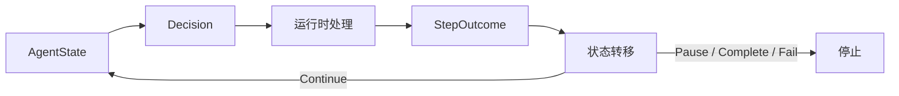

# 用 Python 写 Agent 循环：模型候选如何推动状态转移

[上一篇](/docs/ai-agent/agent-essence-autonomy-boundaries)已经划清了四项责任：模型提出候选，运行时控制执行，工具返回外部结果，完成验证器决定目标是否结束。现在要把这些责任接成一个会重复、也会停下来的 Python 控制流。

继续处理同一项远程访问任务：

> 查明申请为什么被拒绝；如果当前条件已经满足，再帮我重新提交。

模型可能先查申请，再查设备，也可能过早宣布完成。程序不能把这些候选直接当成命令。每个候选都要经过运行时，得到一项类型化结果，再由状态机生成下一版状态。

这篇文章只实现单进程内存版本。它能证明状态转移合同和停止语义，不包含真实审批恢复、持久化与并发更新。

## 先把循环问题写成一次状态转移

**Agent Loop（Agent 循环）** 是应用运行时里的重复控制结构。每一轮读取当前状态，请求模型给出一个候选，处理候选，再决定是否进入下一轮。

循环会不会继续，取决于这一轮产生了什么结果。本文只有五种合法去向：

- `Continue(observation)`：`running -> running`，追加观察后再次调用模型。
- `Pause(request)`：`running -> waiting_approval`，保存待审批候选并停止。
- `Complete(answer)`：`running -> completed`，保存通过验证的答案并停止。
- `Fail(reason)`：`running -> failed`，保存失败原因并停止。
- 达到候选上限：`running -> exhausted`，保存已有轨迹并停止。

第一行是合法自环。状态值仍为 `running`，完整状态已经增加一条观察和一次步数，所以它不是“什么都没发生”。这条自环正是下一轮能够读取新信息的原因。

最后一行来自循环预算，不属于单步处理结果。它只表示候选次数已经耗尽，不能证明任务成功，也不能证明失败原因已经定位。

## 循环、状态机与 ReAct 各自解释什么

**状态机** 规定有哪些状态，以及旧状态可以通过什么结果转到新状态。循环负责反复调用单步转换，状态机负责拒绝非法转移，两者共同组成本文的运行时控制流。

**ReAct** 是推理、动作与环境观察交错出现的研究范式。动作从知识库或环境取得信息，后续推理或动作再利用这些观察。这个反馈关系解释了为什么工具结果要进入下一轮输入。

工程 Agent Loop 可以承载这种反馈，也可以使用结构化候选而不保存私有 Chain-of-Thought。审批、终态、预算和持久化仍要由应用自己负责。

下面的图只画本文实际实现的控制边界：



图中的回边对应 `running -> running`。`Decision` 不能直接连回状态，运行时必须先完成校验、工具执行或完成验证。

## 模型候选先经过可信运行时

一次状态转移需要区分三层数据。模型输出 `Decision`，运行时处理后得到 `StepOutcome`，只有 `Continue` 才携带供下一轮读取的 `Observation`。

先定义模型可以提出的三种候选：

```python
@dataclass(frozen=True)
class ToolCall:
    name: str
    arguments: Arguments = ()

@dataclass(frozen=True)
class RequestApproval:
    action: str
    arguments: Arguments = ()

@dataclass(frozen=True)
class Finish:
    answer: str

Decision = ToolCall | RequestApproval | Finish
```

`ToolCall` 想读取或操作外部系统，`RequestApproval` 要求在副作用前暂停，`Finish` 建议结束任务。三者都是候选。模型不能通过换一种类型绕过审批，也不能凭一段答案取得完成权。

运行时写入下一轮的是结构化观察：

```python
@dataclass(frozen=True)
class Observation:
    action: str
    status: ObservationStatus
    data: tuple[tuple[str, str], ...] = ()
    error: str | None = None
```

本文区分 `success`、`empty`、`denied`、`timeout`、`unknown` 与 `completion_rejected`。空结果表示工具正常返回但没有数据，超时表示没有按时得到结果，`unknown` 表示副作用结果无法确认。

这些状态不能压成一段空文本。否则下一轮无法判断该换查询、等待、停止，还是先核对外部结果。

`StepOutcome` 则决定控制流：

```python
@dataclass(frozen=True)
class Continue:
    observation: Observation

@dataclass(frozen=True)
class Pause:
    request: RequestApproval

@dataclass(frozen=True)
class Complete:
    answer: str

@dataclass(frozen=True)
class Fail:
    reason: str

StepOutcome = Continue | Pause | Complete | Fail
```

`Observation` 只属于 `Continue`。审批暂停保存待处理候选，完成保存最终答案，失败保存停止原因。把四种结果都伪装成“工具消息”，会丢失调用方真正需要的控制语义。

## 单步转换把候选写成新状态

本文把一轮拆成两个函数。`handle_decision` 接触模型候选、工具和验证器，`advance` 只接收旧状态与类型化结果。

拆开之后，工具是否执行与状态是否转移可以分别测试。运行时边界也不会藏在一个越来越长的 `while` 里。

### `handle_decision` 决定这一轮得到什么结果

结束候选先交给完成验证器。验证通过才返回 `Complete`；缺少证据时返回 `Continue`，把缺口写成下一轮可见观察：

```python
if isinstance(decision, Finish):
    check = completion_validator(state, decision)
    if check.accepted:
        return Complete(decision.answer)
    return Continue(
        Observation(
            action="finish",
            status="completion_rejected",
            data=tuple(
                ("missing_evidence", item)
                for item in check.missing_evidence
            ),
            error="completion_evidence_missing",
        )
    )
```

完成拒绝没有把任务标成失败。它给下一轮一项明确缺口，例如还要确认申请当前是否为 `active`。

工具候选走另一条分支。运行时先检查重复参数与工具名称，再处理审批边界。受保护动作无论以 `RequestApproval` 还是普通 `ToolCall` 提出，都会返回 `Pause`，写工具不会在本文示例中执行。

只读工具的正常结果会转换成 `Continue(Observation(...))`。超时得到 `timeout` 观察，参数错误得到 `denied` 观察，无法预期的工具异常得到 `Fail`。

这里没有自动重试。重试是否安全取决于动作幂等性、外部结果是否可查询和剩余时限，不能从一个异常类型直接推出。

### `advance` 决定状态可以走到哪里

`AgentState` 保存目标、观察轨迹、已处理候选数、当前状态、停止原因、最终答案和待审批候选。模型只读取目标与观察，不能修改其他控制字段。

`advance` 用不可变更新写出完整转移：

```python
def advance(state: AgentState, outcome: StepOutcome) -> AgentState:
    if state.status != "running":
        raise ValueError("only a running state can advance")

    next_step = state.steps + 1
    if isinstance(outcome, Continue):
        return replace(
            state,
            observations=state.observations + (outcome.observation,),
            steps=next_step,
        )
    if isinstance(outcome, Pause):
        return replace(
            state,
            steps=next_step,
            status="waiting_approval",
            stop_reason="approval_required",
            pending_approval=outcome.request,
        )
    if isinstance(outcome, Complete):
        return replace(
            state,
            steps=next_step,
            status="completed",
            stop_reason="completion_verified",
            final_answer=outcome.answer,
        )
    return replace(
        state,
        steps=next_step,
        status="failed",
        stop_reason=outcome.reason,
    )
```

`Continue` 分支没有覆盖 `status`，因此保留 `running`，同时增加观察与步数。这是本文需要反复出现的自环。

其余分支离开 `running`。若终态再次传给 `advance`，函数立即报错，迟到的工具结果不能借同一入口覆盖已经暂停或完成的状态。

这个检查只约束单进程内存对象。真实多进程系统还需要版本检查、原子更新或锁，本篇没有证明这些能力。

## 循环只重复单步，预算耗尽单独收口

单步合同成立之后，`run_agent` 的职责很窄。它投影模型输入，请求一个候选，调用两个单步函数，然后检查新状态：

```python
state = initial_state
while state.status == "running" and state.steps < max_steps:
    model_input = ModelInput(state.goal, state.observations)
    decision = model.decide(model_input)
    outcome = handle_decision(
        state,
        decision,
        tools,
        completion_validator,
        approval_actions,
    )
    state = advance(state, outcome)

if state.status == "running":
    state = replace(
        state,
        status="exhausted",
        stop_reason="step_limit_reached",
    )
```

本文规定一次模型调用只返回一个 `Decision`，每次 `advance` 把 `steps` 加一。因此 `max_steps` 计算的是本地实现已经处理的候选数，当前代码中也等于模型调用次数。

OpenAI Agents SDK 的 `max_turns` 计算 Runner 的模型调用轮次。真实的一次模型响应可以包含多个函数工具调用，SDK 还把模型能否发出多个调用与本地工具并发上限分开配置。

两种上限都能阻止无界运行，计量口径不同。把本文的 `max_steps=3` 换成 SDK 的 `max_turns=3`，不能据此声称两边执行了相同数量的工具。

达到上限时，最近一次 `Continue` 已经写入状态，循环随后将 `running` 改成 `exhausted`。观察轨迹仍然保留，调用方可以判断是人工接管、重新规划，还是结束任务。

## 审批轨迹验证副作用会停在边界

第一条轨迹从原始任务开始，只走到待审批状态。下面的值是教学材料，不对应真实账号或审批系统。

1. 第一次调用只知道任务目标。模型提出 `ToolCall("request_status")`，运行时写入拒绝原因，状态保持 `running`。
2. 第二次调用已经知道设备不合规。模型提出 `ToolCall("device_status")`，运行时写入设备当前合规，状态仍为 `running`。
3. 第三次调用已经具备重新提交的前置事实。模型提出 `RequestApproval("resubmit_request")`，运行时返回 `Pause`，状态转为 `waiting_approval`。

前两次调用各形成一个 `running -> running` 自环。第三次离开 `running`，待审批候选保存在 `pending_approval`，写工具调用数仍为零。

这条轨迹没有批准后续，也没有重新提交回执。`waiting_approval` 表示恢复条件明确，不能写成 `completed` 或通用 `failed`。

上一篇已经说明，恢复审批还要核对具体候选、身份、范围和当前状态。本文只证明循环能够在副作用发生前停下。

## 完成轨迹验证拒绝也能推动下一轮

第二条轨迹使用独立的批准后状态快照。快照里已有两项成功事实：设备当前合规，重新提交已被接受。申请当前状态仍然未知。

完成验证器要求三项事实同时成立：

```python
requirements = {
    "device_status.compliance": device_is_compliant,
    "resubmit_request.result": resubmit_was_accepted,
    "request_status.status": request_is_active,
}
missing = tuple(
    name for name, satisfied in requirements.items()
    if not satisfied
)
return CompletionCheck(not missing, missing)
```

缺少第三项时，模型的第一条答案不能进入 `completed`。三次决定依次改变这份快照：

1. 模型先返回 `Finish("申请已经恢复。")`。运行时发现缺少 `request_status.status`，追加 `completion_rejected`，状态保持 `running`。
2. 模型随后提出 `ToolCall("request_status")`。工具返回 `status=active`，运行时追加 `success`，状态继续保持 `running`。
3. 模型再次返回 `Finish("申请已经恢复。")`。三项证据已经齐全，运行时才把状态改成 `completed`。

第一次拒绝给第二次调用一个明确查询目标。第二次工具结果又给第三次调用补齐事实。两次自环都改变了完整状态，第三次才离开 `running`。

专用测试直接锁住这条轨迹。下面只保留与主论证有关的断言，完整测试在文末展开：

```python
self.assertEqual(state.status, "completed")
self.assertEqual(model.calls, 3)
self.assertEqual(state.steps, 3)
self.assertEqual(state.observations[2].status, "completion_rejected")
self.assertEqual(
    model.inputs[1].observations[-1],
    state.observations[2],
)
self.assertEqual(
    model.inputs[2].observations[-1],
    successful_fact("request_status", "status", "active"),
)
```

`model.inputs[1]` 证明第一次自环的拒绝观察确实进入第二次模型输入。`model.inputs[2]` 证明第二次自环的工具结果确实进入第三次输入。`model.calls == 3` 则让测试次数与表格逐行对应。

测试文件还保留一条两次调用的辅助用例，只验证普通工具观察能否进入下一轮。它使用不同初始状态，不承担完成拒绝轨迹的证明责任。

## 测试能证明什么，不能证明什么

只断言 `final_answer` 会漏掉大部分控制错误。本篇专用测试还覆盖以下合同：

- 审批请求会暂停，受保护写工具没有执行。
- 普通 `ToolCall` 也不能绕过同一个审批边界。
- 未知工具与重复参数会得到 `denied` 观察。
- 工具超时与空结果使用不同状态。
- 意外工具异常会留下明确失败原因。
- 候选上限耗尽后保留完整观察轨迹。
- 暂停或终态不会再次调用模型。

`ScriptedModel` 按固定顺序返回候选，让测试不受网络和模型随机性影响。它不理解任务，也不能证明在线模型会选择正确工具。

固定工具只返回教学数据，内存状态也没有并发写入。测试证明的是本地类型合同、状态转移和停止语义，不包括真实供应商行为、生产审批、持久化恢复与副作用幂等。

::: details 展开 Agent 循环完整实现
<<< ../../examples/ai-agent/agent_loop.py
:::

::: details 展开本篇专用测试
<<< ../../examples/ai-agent/tests/test_agent_loop.py
:::

运行本篇测试：

```bash
PYTHONDONTWRITEBYTECODE=1 \
PYTHONPATH=examples/ai-agent \
  uv run python -m unittest \
  examples/ai-agent/tests/test_agent_loop.py -v
```

当前 9 项专用测试全部通过。`PYTHONDONTWRITEBYTECODE=1` 只用于避免测试在示例目录生成缓存文件，不影响控制流语义。

## 循环合同成立后，再判断是否值得使用

模型提出 `Decision`，可信运行时把它处理成 `StepOutcome`，状态机再生成下一版 `AgentState`。`Continue` 追加观察并形成 `running -> running` 自环，审批、完成、失败和耗尽则让循环稳定停止。

这个实现解决了“候选怎样推动状态转移”，也暴露了 Agent 的工程成本。固定条件可以直接完成的任务，一旦引入循环，就要额外维护工具协议、状态轨迹、审批边界、错误分类、预算和完成验证。

下一篇会继续判断：哪些任务的路径不确定性值得承担这些成本，哪些任务应该使用确定性工作流。

接着阅读：[哪些任务不该使用 Agent](/docs/ai-agent/agent-fit-deterministic-workflow)

参考资料：

- [OpenAI Agents SDK: Running agents](https://openai.github.io/openai-agents-python/running_agents/)
- [ReAct: Synergizing Reasoning and Acting in Language Models](https://arxiv.org/abs/2210.03629)
