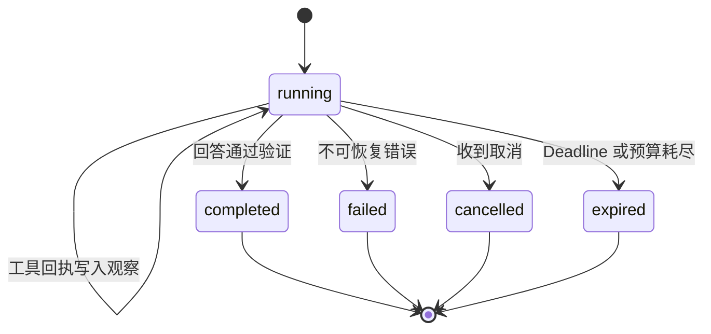

# 什么是 Agent 循环

模型回答问题时发现缺少账号状态，一次调用只能在现有材料里继续生成。Agent 循环允许它提出查询动作，程序执行查询，把结果写回状态，然后开始下一次决定。

这类 **ReAct（Reason and Act，推理与行动）** 控制流常被概括成“思考、行动、观察”。工程实现里更准确的对象是：结构化决定、受控执行和状态转移。模型的内部推理不需要暴露，运行时只消费可校验的动作候选。

## 最小循环是一台状态机

一个可运行的循环可以只有两类模型决定：调用工具，或者提交最终回答。

```python
Decision = ToolCall | FinalAnswer
```

每轮执行下面的状态转移：

1. 从仓储读取当前状态快照。
2. 按预算装配模型输入，得到一个 `Decision`。
3. 若是工具候选，校验工具、参数、权限和剩余预算。
4. 执行工具，把结构化结果追加为观察。
5. 若是最终回答，检查完成条件并写入终态。

最大步数、Deadline、取消和无进展信号可以在任何新动作前终止循环。把这些检查放在 `while` 条件里还不够，工具调用前、重试前和最终写入前都要重新确认，因为状态可能被另一个请求取消。



终态应保持单调。`completed`、`failed`、`cancelled` 和 `expired` 都不能回到 `running`。
## 状态里保存什么

把所有内容塞进消息数组，很快会失去控制信息。最小状态适合显式保存：

```python
@dataclass(frozen=True)
class AgentState:
    run_id: str
    goal: str
    observations: tuple[Observation, ...]
    step: int
    status: Status
    version: int
    deadline_at: datetime
```

消息可以由这个状态投影出来。`step`、`status`、`version` 和 `deadline_at` 由程序读取，不需要模型从自然语言历史里猜。

观察也要有类型：

```python
@dataclass(frozen=True)
class Observation:
    call_id: str
    tool: str
    status: Literal["success", "empty", "denied", "timeout", "unknown"]
    payload: object | None
```

工具返回 `[]` 可能是成功的空结果；超时则可能需要重试；`unknown` 表示副作用是否发生暂时无法确认。三者合并成空字符串会让下一轮作出错误决定。
## 不用框架实现完整控制流

仓库里的示例包含联合类型决定、只读工具目录、状态副本、最大步数和脚本化模型：

<<< ../../examples/ai-agent/agent_loop.py

`ScriptedModel` 按预设顺序返回决定，用于验证本地循环。它不模拟语言理解，也不能证明在线模型会稳定选择正确工具。这样设计的好处是，测试可以精确断言模型调用次数、工具调用参数和最终状态，不受网络和模型随机性干扰。

### 模型只能看到状态投影

直接把可变 `state` 交给适配器，测试替身或未来代码可能原地修改观察和终态。更稳的接口传递不可变快照，模型返回新的候选；运行时校验后再创建下一版状态。

状态写入可以采用乐观并发控制：

```sql
UPDATE agent_runs
SET state = :new_state, version = version + 1
WHERE run_id = :run_id AND version = :expected_version;
```

受影响行数为零，说明状态已被其他执行者更新。当前结果不能覆盖新状态，需要重新读取并判断它是否已经取消或完成。
## 工具调用怎样进入下一轮

假设目标是解释远程访问失败，循环有一个只读工具 `search_notes`。

第 0 轮模型提出：

```json
{
  "kind": "tool_call",
  "call_id": "call-1",
  "tool": "search_notes",
  "arguments": {"query": "远程访问失败条件"}
}
```

运行时确认工具存在、参数合法并且当前身份允许读取，再执行。结果以观察写回：

```json
{
  "call_id": "call-1",
  "status": "success",
  "payload": ["设备不合规时申请会被拒绝"]
}
```

第 1 轮模型可以根据这条证据生成回答。若用户问的是个人账号，工具只返回通用制度，完成验证应指出证据范围不足，不能把一般条件写成个人原因。
## 停止条件分别处理不同风险

### 最大步数限制总路径

最大步数是最后一道硬限制，防止循环无限运行。它无法判断两轮是否已经重复，也不能保证最后一轮有完整答案。达到上限时返回 `expired` 或 `max_steps_reached`，保留已执行轨迹。

### Deadline 包含排队与重试

总 Deadline 从任务接受时开始计算，模型、工具、退避和排队都消耗同一份时间。每个子调用的超时要小于剩余总时限，避免某个工具独占全部预算。

### 无进展检测需要比较状态变化

连续调用同一个工具和参数、观察哈希没有变化、相同错误反复出现，都可以增加无进展计数。检测器触发后可以给一次具体反馈，例如“这次查询与上次相同且没有新增结果”，随后仍无变化就停止。

只比较模型文本相似度容易误报。控制层更适合比较规范化动作、关键状态字段和外部回执。

### 最终回答也要校验

模型选择 `FinalAnswer` 只能结束决策阶段。运行时还要检查必需工具是否执行、目标产物是否存在、事实是否绑定证据、写操作是否得到回执。验证失败时可以进行一次有限修复，修复次数仍计入预算。
## 异常怎样回到循环

参数错误通常不需要执行工具。运行时把字段级错误作为观察返回，让模型在剩余预算内修正一次。未知工具和权限拒绝更适合直接终止或要求重新规划，不能通过模糊改名绕过白名单。

只读工具的短暂超时可以有限重试。写工具超时后先查询幂等回执，确认未执行才重放。无法确认时保留 `unknown`，交给人工或补偿流程处理。

模型服务失败也要保持原状态。重试只重新请求同一状态版本，若期间收到取消，迟到响应不得产生工具动作。
## 什么时候需要框架

普通 Python 循环适合教学、单进程短任务和控制流尚未稳定的原型。出现条件分支、并行节点和可视化状态时，状态图能减少手写路由。任务需要跨进程、等待人工或重启恢复时，还要加入持久化队列、检查点或工作流引擎。

迁移框架时要保留行为契约：同样的输入产生同类候选，非法参数在执行前拒绝，终态单调，取消不会被迟到结果覆盖，重试不产生重复副作用。框架改变代码组织，不应悄悄改变这些边界。

最小循环值得先写，因为它把 Agent 最承重的部分暴露出来：状态属于谁，动作在哪里授权，失败怎样记录，任务由什么条件结束。看清这四件事后，规划、多 Agent 和持久化只是扩大同一台状态机。
