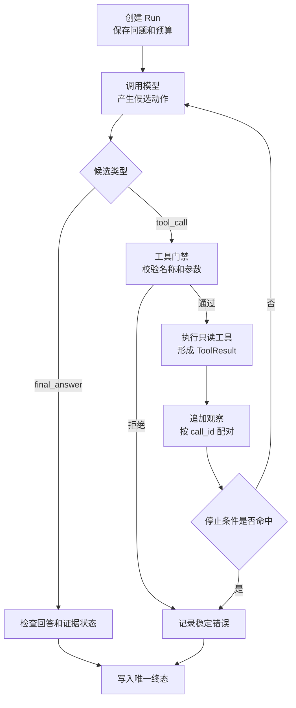

# 不用框架实现第一个有限 Agent 循环

前面已经有三个独立部件：`ModelGateway` 能调用模型，结构化输出能把模型结果约束成受控对象，`search_notes` 执行器能验证并执行只读工具。但它们还没有组成 Agent。

用户问“发布后怎样确认切流成功”时，完整交互应该是：

```text
第 1 轮模型：我需要查资料，提出 search_notes(query="切流验证")
程序：校验并执行工具，得到两条可见证据
第 2 轮模型：根据工具结果生成回答
程序：确认回答终态，停止循环
```

**Agent 不是“模型会调用工具”的别名。** 它是一段有状态的控制循环：模型只能提出下一步，程序保存观察、执行工具、限制资源并决定何时停止。只要循环没有确定的上限、错误终态和重复检测，它就可能一直调用工具，直到耗尽时间或费用。

## 一轮与一个步骤不是同一个概念

这里把一次用户请求称为 `AgentRun`，把每次模型决策称为 `step`。一次 Run 可能包含两个或更多 step：第一次产生 ToolCall，执行后把 ToolResult 追加到消息，第二次才产生最终回答。

| 对象 | 生命周期 | 内容 | 修改者 |
| --- | --- | --- | --- |
| `question` | 整次 Run 不变 | 原始用户目标 | 调用方 |
| `messages` | 每个 step 增长 | 用户输入、模型动作、工具观察 | Runtime 按协议追加 |
| `step` | 每次模型决策加一 | 已消耗的决策次数 | Runtime |
| `seen_calls` | 整次 Run | 工具名与规范化参数指纹 | Runtime |
| `status` | 从 running 到唯一终态 | completed、no_evidence、failed 等 | 状态机 |
| `answer` | 终态产生 | 最终回答或安全说明 | 模型候选，程序接受 |

模型不修改 `step`、`seen_calls` 或 `status`。如果允许模型在 JSON 中写 `status="completed"`，它就能跳过工具结果校验和证据要求。模型只返回两个候选之一：调用工具，或者给出最终回答。

## 最小循环的六个阶段



创建阶段固定原问题和预算；模型阶段只产生候选；门禁阶段拒绝未知工具、额外字段和越权参数；执行阶段产生结构化 ToolResult；追加阶段用 `call_id` 把动作和观察配对；终态阶段由程序决定 completed、no_evidence 或 failed。

正常路径会回到模型一次。失败路径是否回到模型取决于错误类型：`empty` 可以让模型改写一次查询，`invalid_arguments` 可以在剩余步数内修正，`scope_denied` 和取消则应直接终止，不能让模型换个工具试探。

## 候选动作需要一个稳定联合类型

Agent 循环不应该通过“回答字符串里有没有 `search_notes`”判断动作。模型结果先经过 Schema，转换成 `ToolDecision` 或 `FinalDecision`：

```python
from __future__ import annotations

from dataclasses import dataclass
from typing import Literal, TypeAlias

@dataclass(frozen=True, slots=True)
class ToolDecision:
    # 工具分支保留 call_id，后续 ToolResult 必须用它与本次候选配对。
    kind: Literal["tool_call"]
    call_id: str
    name: str
    arguments: dict[str, object]

@dataclass(frozen=True, slots=True)
class FinalDecision:
    # 最终分支只有候选答案；是否接受它仍由 Agent 循环检查证据状态。
    kind: Literal["final_answer"]
    answer: str

# 联合类型让调用方先检查 kind，再访问该分支独有字段。
ModelDecision: TypeAlias = ToolDecision | FinalDecision
```

`kind` 是判别字段。`ToolDecision` 保存模型提出的工具名和参数；`FinalDecision` 只保存候选回答。真实模型适配器负责把 Responses API 的 output item 转成这个联合类型，Fake Policy 可以直接返回对象用于测试。转换失败属于 `invalid_model_output`，不能把未知 JSON 当最终回答。

## 把模型决策和工具执行隔离开

为了让循环可测试，模型策略与工具执行都通过协议注入。输入是当前消息快照，输出分别是 `ModelDecision` 和 `ToolOutcome`：

```python
from dataclasses import dataclass
from typing import Literal, Protocol, Sequence

from app.schemas import ModelDecision, ToolDecision

@dataclass(frozen=True, slots=True)
class AgentMessage:
    # role 决定消息在模型协议中的位置；call_id 把工具候选与工具结果配成一对。
    role: Literal["user", "assistant", "tool"]
    content: str
    call_id: str | None = None

@dataclass(frozen=True, slots=True)
class ToolOutcome:
    # status 供循环选择分支，code 保留稳定错误语义，content 才会回传给模型。
    call_id: str
    status: Literal["ok", "empty", "error"]
    code: str
    content: str

class DecisionModel(Protocol):
    # 模型只读取当前消息快照并提出动作，不直接执行工具或修改运行状态。
    def decide(self, messages: Sequence[AgentMessage]) -> ModelDecision: ...

class ToolExecutor(Protocol):
    # 执行器接收已经结构化的调用，返回与 call_id 对齐的观察结果。
    def execute(self, decision: ToolDecision) -> ToolOutcome: ...
```

`DecisionModel` 只能读取不可变的消息序列并提出下一步；`ToolExecutor` 只能接收已经结构化的候选调用。用户 Scope、知识版本和 Deadline 应在执行器构造时由服务端注入，而不是出现在 `arguments` 中。后面换成 LangChain Tool 时，这个所有权边界保持不变。

## 实现有刹车的循环

下面是 `app/agent_loop.py` 的核心。它保留决定行为的代码：状态对象、调用指纹、错误分支和唯一终态。模型与搜索实现从外部传入。

```python
from __future__ import annotations

import json
from dataclasses import dataclass, field
from enum import StrEnum

from app.messages import AgentMessage
from app.schemas import FinalDecision, ToolDecision
from app.tools import DecisionModel, ToolExecutor

class RunStatus(StrEnum):
    COMPLETED = "completed"
    NO_EVIDENCE = "no_evidence"
    FAILED = "failed"

@dataclass(slots=True)
class AgentState:
    question: str
    messages: list[AgentMessage]
    step: int = 0
    seen_calls: set[str] = field(default_factory=set)
    status: RunStatus | None = None
    answer: str = ""
    last_tool_status: str | None = None

@dataclass(frozen=True, slots=True)
class AgentResult:
    status: RunStatus
    answer: str
    steps: int
    messages: tuple[AgentMessage, ...]

def call_fingerprint(decision: ToolDecision) -> str:
    # 排序后的 JSON 消除字典键顺序差异，同一工具与参数得到同一指纹。
    arguments = json.dumps(decision.arguments, ensure_ascii=False, sort_keys=True)
    return f"{decision.name}:{arguments}"

def finish(state: AgentState, status: RunStatus, answer: str) -> AgentResult:
    # 只有这个函数写终态，避免错误分支稍后又被覆盖为 completed。
    state.status = status
    state.answer = answer
    return AgentResult(status, answer, state.step, tuple(state.messages))

def run_agent(
    question: str,
    model: DecisionModel,
    tools: ToolExecutor,
    *,
    max_steps: int = 4,
) -> AgentResult:
    if not question.strip():
        raise ValueError("question must not be empty")
    if max_steps < 1:
        raise ValueError("max_steps must be positive")

    state = AgentState(
        question=question.strip(),
        messages=[AgentMessage(role="user", content=question.strip())],
    )

    while state.step < max_steps:
        state.step += 1
        decision = model.decide(tuple(state.messages))

        if isinstance(decision, FinalDecision):
            answer = decision.answer.strip()
            if not answer:
                return finish(state, RunStatus.FAILED, "模型没有返回可用回答。")
            if state.last_tool_status == "empty":
                # 工具明确无证据时，不能把模型常识包装成资料结论。
                return finish(state, RunStatus.NO_EVIDENCE, "当前可见资料不足，无法确认答案。")
            return finish(state, RunStatus.COMPLETED, answer)

        fingerprint = call_fingerprint(decision)
        if fingerprint in state.seen_calls:
            # 重复相同调用通常不会产生新信息，立即停止而不是继续计费。
            return finish(state, RunStatus.FAILED, "Agent 重复了相同工具调用，已停止。")
        state.seen_calls.add(fingerprint)

        outcome = tools.execute(decision)
        if outcome.call_id != decision.call_id:
            return finish(state, RunStatus.FAILED, "工具结果与调用 ID 不匹配。")

        state.last_tool_status = outcome.status
        state.messages.append(
            AgentMessage(
                role="assistant",
                content=f"调用 {decision.name}，参数 {decision.arguments}",
                call_id=decision.call_id,
            )
        )
        state.messages.append(
            AgentMessage(role="tool", content=outcome.content, call_id=outcome.call_id)
        )

        if outcome.status == "error":
            # 未知工具、越权和取消等不可修复错误直接形成失败终态。
            return finish(state, RunStatus.FAILED, f"工具执行失败：{outcome.code}")

    return finish(state, RunStatus.FAILED, f"Agent 达到 {max_steps} 步上限，已停止。")
```

`run_agent()` 先验证调用方配置，再创建只有用户消息的状态。每次进入循环先消耗一个 step，然后调用模型。最终回答分支会检查空文本和最近一次工具是否明确为空；工具分支先计算指纹，再执行工具并校验 `call_id`。

消息按“assistant 调用、tool 结果”成对追加。下一轮模型由此知道工具已经完成。`finish()` 是唯一写终态的位置，所以循环耗尽、工具错误和正常回答不会互相覆盖。这个实现仍是同步内存版：它没有持久化、取消和崩溃恢复，这些问题会在 LangGraph 与 Runtime 部分逐步补上。

## 用脚本化模型跑通五条路径

测试不依赖在线模型。`ScriptedModel` 按顺序返回预设决策，目的是稳定验证循环控制；它是测试替身，不是 Agent 的真实智能来源。

```python
from collections import deque

from app.agent_loop import RunStatus, run_agent
from app.messages import AgentMessage
from app.schemas import FinalDecision, ModelDecision, ToolDecision
from app.tools import ToolOutcome

class ScriptedModel:
    def __init__(self, decisions: list[ModelDecision]) -> None:
        self._decisions = deque(decisions)

    def decide(self, messages: tuple[AgentMessage, ...]) -> ModelDecision:
        # 决策耗尽说明测试夹具与预期调用次数不一致，应立即失败。
        if not self._decisions:
            raise AssertionError("unexpected model call")
        return self._decisions.popleft()

class SearchNotesExecutor:
    def execute(self, decision: ToolDecision) -> ToolOutcome:
        # 测试执行器也保留未知工具分支，证明循环不会默认执行任意名称。
        if decision.name != "search_notes":
            return ToolOutcome(decision.call_id, "error", "unknown_tool", "")
        query = decision.arguments.get("query")
        if query == "切流验证":
            return ToolOutcome(
                decision.call_id,
                "ok",
                "search_completed",
                "证据 e-1：检查健康接口；证据 e-2：核对真实流量版本。",
            )
        return ToolOutcome(decision.call_id, "empty", "search_completed", "没有可见结果")

def test_tool_result_returns_to_model() -> None:
    # 两个预设决策分别模拟“先查工具”和“看到证据后回答”。
    model = ScriptedModel([
        ToolDecision("tool_call", "call-1", "search_notes", {"query": "切流验证"}),
        FinalDecision("final_answer", "先检查健康接口，再核对真实流量版本。"),
    ])

    result = run_agent("怎样验证切流？", model, SearchNotesExecutor())

    # 除终态外还检查步数、消息顺序与 call_id，避免只靠最终文案误判成功。
    assert result.status is RunStatus.COMPLETED
    assert result.steps == 2
    assert [message.role for message in result.messages] == ["user", "assistant", "tool"]
    assert result.messages[-1].call_id == "call-1"
```

第一次 `decide()` 返回工具候选；执行器根据查询返回证据；循环把调用和结果追加到消息；第二次 `decide()` 返回最终回答。测试不只断言最后一句话，还断言两次模型决策、消息角色和调用 ID。

还应增加四条回归：未知工具直接 failed；空结果后模型给出肯定答案仍进入 no_evidence；两次相同工具参数触发重复检测；模型持续提出不同调用但超过 `max_steps` 时进入 failed。这样才能证明“有限”由程序控制，而不是 Prompt 里的一句建议。

## 真实模型怎样接入这个联合类型

Responses API 适配器要把两类 output item 映射成本文对象：文本消息转换为 `FinalDecision`，函数调用转换为 `ToolDecision`。转换时解析 arguments JSON、保留供应商 `call_id`，拒绝未知 item 组合。工具执行后，下一次请求要提交与该调用配对的结果，而不是把工具正文伪装成普通用户消息。

这里不重复一大段供应商 SDK 代码，因为[不用框架实现 Tool Calling](/docs/ai-agent/tool-calling-contracts)已经完整解释工具 Schema、执行门禁和 ToolResult。需要记住的边界是：**SDK 负责协议转换，Agent 循环负责状态和停止，工具执行器负责权限与副作用。** 三者不能合成一个“万能函数”。

## 为什么现在还不需要 LangChain 或 LangGraph

这个循环只有一个模型、一个同步工具和内存状态，普通 Python 最容易看见控制权。此时引入框架会隐藏最值得学习的部分：什么时候增加 step，谁执行工具，结果怎样配对，谁写终态。

当工具注册、消息适配和中间件开始重复时，LangChain 能提供统一抽象；当出现条件分支、并行检索、Checkpoint、人工暂停和恢复时，LangGraph 更合适。框架不会替你定义权限、Deadline 和业务终态，它只是让已有边界更容易组合和运行。

## 常见问题

### 为什么 Agent 循环不能只写 `while True`，等模型说完成？

模型可能重复相同调用、产生无效参数，或始终认为证据不足。`while True` 把停止权交给不确定输出，无法限制费用和时间。程序至少要固定最大步数、整轮 Deadline、重复动作、取消信号和不可重试错误。

调试时应记录每步的决策类型、工具指纹、剩余时间和停止原因，而不是只保存最终文本。若同一指纹连续出现，优先检查 ToolResult 是否真的回传、模型是否看到了 `call_id`，以及错误结果有没有被错误包装成普通用户消息。

### `max_steps=4` 应该怎样选择？

它取决于任务和工具链，不是通用答案。单次知识检索通常两步就能完成；多子问题研究可能需要更多。先用 Eval 记录成功样本的步骤分布，再为长尾设置上限。达到上限要暴露为明确终态，不能静默返回半成品。

### 空结果为什么不让模型直接用自己的知识回答？

只读知识 Agent 承诺的是基于当前可见资料回答。工具成功但无结果表示证据缺口，不等于事实不存在，也不授权模型用训练记忆补齐。可以允许一次查询改写；仍为空时应解释资料不足。

这里要把 `empty` 与 `failed` 分开：前者表示检索执行成功但当前 Scope 和 Release 下没有结果，后者表示查询根本没有可靠完成。只有 `empty` 适合进入有限改写；超时、权限拒绝或依赖故障应保留原错误，避免把系统故障误报成“资料不存在”。

### 工具参数不同，但语义相同，指纹还能发现重复吗？

本文的 JSON 指纹只发现结构完全相同的重复。`"切流验证"` 与 `"验证切流"` 仍是不同指纹。企业 Runtime 可以记录规范化查询、工具结果 ID 和证据覆盖变化；连续动作没有带来新证据时，也应停止或重规划。

一个更稳的做法是同时比较“动作指纹”和“新增信息”：先对查询做保守规范化，再比较本轮新增 Evidence ID 或覆盖目标。改写后的字符串不同却没有增加证据时，继续循环只会增加成本；但不要用向量相似度直接合并所有查询，否则可能误伤确实需要区分的版本号和专有名词。

### 为什么工具错误有些直接终止，有些可以回到模型？

是否可修复由错误语义决定。参数格式错误可以给模型一次修正机会，空结果可以改写查询；越权、取消和未知工具不应通过换种表达绕过。超时只有在整轮仍有预算且操作幂等时才适合有限重试。

### 最终回答为什么还需要验证？

工具返回了正确证据，不代表模型没有漏项、错引或添加无依据结论。本章只检查空结果边界；后面的 Claim、Evidence 与验证器会把回答拆成可核对事实，并在提交终态前完成引用、权限和隐私检查。

### Fake Model 会不会让测试失去价值？

Fake 不能评估模型质量，但非常适合验证确定性控制：调用次数、消息配对、重复检测和终态。在线模型再通过 Eval 覆盖自然语言理解和工具选择。两种测试负责不同风险，不能互相替代。

### 什么时候应该把同步循环改成异步？

单个模型和工具串行执行时，同步实现更容易理解。并行检索、流式输出、用户取消或高并发 API 出现后，需要异步 I/O；但状态转换、错误分类和停止条件仍应保持相同语义，不能因为改成 `async` 就重新设计一套 Agent。
