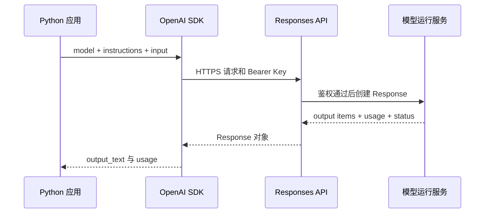

# 用 Python 调用一次 Responses API

## Responses API 解决什么问题

Responses API 是 OpenAI 用于模型调用的统一接口。应用提交模型、指令和输入，服务返回带状态、输出项和 usage 的 `Response` 对象。纯文本生成只是它最小的一种用法；同一响应还可以包含推理项、工具调用和其他类型的输出。

在 Agent Runtime 中，它位于模型适配层：向下处理供应商协议，向上提供应用能够校验的 `ModelReply`。它不会替应用完成工具授权、业务状态变更和答案事实校验。API 请求成功，只能说明模型服务返回了一个结果，不能证明结果已经满足业务要求。

本文从一个纯文本请求开始，把完整链路落成 `app/model_gateway.py`：进程读取凭证，SDK 构造 HTTPS 请求，服务创建 Response，程序读取文字和用量，再把供应商异常转换成稳定的应用错误。后续 Tool Calling、Agent 循环、LangChain 和 LangGraph 都可以依赖这个网关，不必各写一套模型调用。

先看一个具体问题：发布完成后，怎样检查健康接口，再核对实际流量是否进入新版本？这个问题会贯穿同步调用、错误映射和流式事件示例。

## 请求由哪些字段组成

Responses API 的最小请求包含 `model` 和 `input`。`model` 选择能力与计价规则，`input` 保存本轮用户任务。SDK 把 Python 对象序列化为 JSON，通过 `/v1/responses` 发给服务端。



Python 应用负责输入和超时，SDK 负责认证头、序列化和响应类型，API 负责鉴权和创建 Response，模型运行服务完成输入处理与输出生成。返回的不是一段裸字符串，而是带 ID、状态、多个 output item 和 usage 的 Response 对象。

`response.output` 是输出项列表，可能同时包含消息、工具调用和推理项，因此不能假定文字永远位于 `output[0].content[0].text`。官方 Python SDK 提供的 `response.output_text` 会聚合文字输出，适合本章的纯文本请求。进入 Tool Calling 后，程序必须遍历 item 类型；空 `output_text` 可能表示模型提出了工具调用，并不必然表示服务失败。

`instructions` 保存当前请求的高层行为约束，`input` 保存动态任务。两者分开便于审查和测试，但 `instructions` 只约束模型行为，不能代替程序中的数据权限、工具白名单和状态校验。

## 准备 Python 环境和凭证

### API Key 与隔离环境

OpenAI API Key 用来标识发起请求的 API 项目。服务端据此判断权限、限额和计费归属。Key 不应写进 Python 文件、Prompt、URL、日志或浏览器代码，也不应该作为普通业务参数在各层传递。

在终端中为当前 shell 设置变量：

```bash
# 把右侧内容替换为自己的 Key；环境变量只提供给当前 shell 启动的进程。
export OPENAI_API_KEY="你的_API_Key"

# 模型名也通过环境变量管理，后续切换模型时不必改业务代码。
export OPENAI_MODEL="gpt-5.6"

# 只检查变量是否存在，不打印真实凭证。
test -n "$OPENAI_API_KEY" && echo "OPENAI_API_KEY 已设置"
```

Python SDK 默认读取 `OPENAI_API_KEY`。第三条命令只验证变量非空，避免 Key 被终端输出、录屏或工单再次暴露。容器和 CI 应通过 Secret 管理功能注入同名变量。`.env` 可以简化本地开发，但必须加入 `.gitignore`；它不能替代 Secret 管理。

在 `agent-demo` 目录准备环境。输入是本机 Python 和包索引，目标是得到隔离环境、OpenAI SDK 与 pytest。最终目录如下，在线调用和无密钥测试共用 `ModelGateway`：

```text
agent-demo/
├── app/
│   ├── __init__.py
│   └── model_gateway.py
├── tests/
│   └── test_model_gateway.py
└── run_model.py
```

```bash
# 建立隔离环境，避免示例依赖污染系统 Python。
python3 -m venv .venv
source .venv/bin/activate

# 安装当前 OpenAI SDK；pytest 用来验证无密钥替身和错误路径。
python -m pip install --upgrade openai pytest

mkdir -p app tests
touch app/__init__.py
```

成功后，`python -c "import openai; print(openai.__version__)"` 会打印已安装版本。生产项目应把验证通过的具体版本写入 lockfile 或依赖文件，不能每次部署都临时升级。若安装失败，先检查虚拟环境、包索引和代理配置，不要通过关闭 TLS 校验绕过网络问题。

## 发出第一次同步请求

### 用模型网关隔离供应商协议

`app/model_gateway.py` 不把 OpenAI SDK 对象泄露到业务代码。调用方只看 `ModelReply`：文本、统一 usage 和供应商响应 ID。

```python
from __future__ import annotations

import os
from dataclasses import dataclass
from typing import Protocol

from openai import (
    APIConnectionError,
    APIStatusError,
    APITimeoutError,
    AuthenticationError,
    OpenAI,
    RateLimitError,
)

@dataclass(frozen=True, slots=True)
class TokenUsage:
    input_tokens: int
    output_tokens: int
    total_tokens: int

@dataclass(frozen=True, slots=True)
class ModelReply:
    text: str
    usage: TokenUsage
    response_id: str

class ModelGateway(Protocol):
    # 后续 Agent 只依赖这个协议，不直接依赖某一家 SDK。
    def answer(self, question: str) -> ModelReply: ...

class ModelGatewayError(RuntimeError):
    """向业务层暴露稳定错误码，同时保留原异常作为 cause。"""

    def __init__(self, code: str, message: str) -> None:
        super().__init__(message)
        self.code = code

class OpenAIResponsesGateway:
    def __init__(self, model: str | None = None, timeout_seconds: float = 20.0) -> None:
        # SDK 从 OPENAI_API_KEY 读取凭证；业务对象不保存或打印 Key。
        self._client = OpenAI(timeout=timeout_seconds, max_retries=0)
        self._model = model or os.environ.get("OPENAI_MODEL", "gpt-5.6")

    def answer(self, question: str) -> ModelReply:
        if not question.strip():
            raise ModelGatewayError("invalid_input", "问题不能为空")

        try:
            response = self._client.responses.create(
                model=self._model,
                # instructions 保存稳定规则，input 只保存本轮动态问题。
                instructions="你是只读技术助手。信息不足时明确说明，不虚构操作结果。",
                input=question.strip(),
            )
        except AuthenticationError as exc:
            raise ModelGatewayError("authentication_failed", "API Key 无效或无权访问") from exc
        except RateLimitError as exc:
            raise ModelGatewayError("rate_limited", "请求达到速率或额度限制") from exc
        except APITimeoutError as exc:
            raise ModelGatewayError("timeout", "模型请求超过截止时间") from exc
        except APIConnectionError as exc:
            raise ModelGatewayError("connection_failed", "无法连接模型服务") from exc
        except APIStatusError as exc:
            # 其他 HTTP 错误保留状态码，便于日志和重试策略判断。
            raise ModelGatewayError("api_error", f"模型服务返回 HTTP {exc.status_code}") from exc

        text = response.output_text.strip()
        if not text:
            # 本章没有声明 Tool，空文本不能被当成成功回答。
            raise ModelGatewayError("empty_output", "Response 完成但没有文本输出")

        usage = response.usage
        if usage is None:
            raise ModelGatewayError("missing_usage", "Response 没有返回 usage")

        return ModelReply(
            text=text,
            usage=TokenUsage(
                input_tokens=usage.input_tokens,
                output_tokens=usage.output_tokens,
                total_tokens=usage.total_tokens,
            ),
            response_id=response.id,
        )
```

调用顺序从 `answer()` 开始。空问题在网络请求前被拒绝；随后 SDK 使用构造函数中的超时和禁用自动重试设置创建 Response。禁用 SDK 自动重试是为了让本章先看清一次失败，后面再在共享 Deadline 内加入有限重试。

异常转换没有抹掉原因：`raise ... from exc` 保留原始异常链，日志层可以读取 HTTP 状态和请求 ID，业务层只处理稳定 `code`。成功路径检查文本和 usage，然后返回不依赖 OpenAI 类型的 `ModelReply`。这一边界让 LangChain 或 Claude 适配器以后可以替换实现，而 Agent 循环不用改。

## 读取文本、响应状态和 usage

入口只负责读取问题、调用网关和展示必要结果。不要打印完整 Response，因为其中可能包含用户输入、工具参数和其他不适合进入普通日志的内容。

```python
# run_model.py
from app.model_gateway import ModelGatewayError, OpenAIResponsesGateway

def main() -> None:
    # 网关隐藏供应商 SDK，入口只提交问题并接收统一的 ModelReply。
    gateway = OpenAIResponsesGateway()
    try:
        reply = gateway.answer("发布后怎样确认服务已经切换成功？")
    except ModelGatewayError as exc:
        # 命令行显示稳定错误；生产日志还应关联请求 ID，不能记录 API Key。
        raise SystemExit(f"模型调用失败 [{exc.code}]：{exc}") from exc

    # 只展示回答、计量和响应 ID，不把可能包含输入明细的完整 Response 写到终端。
    print(f"回答：{reply.text}")
    print(f"输入 Token：{reply.usage.input_tokens}")
    print(f"输出 Token：{reply.usage.output_tokens}")
    print(f"Response ID：{reply.response_id}")

if __name__ == "__main__":
    main()
```

执行 `python run_model.py`。真实回答和 Token 数会随模型、输入和服务端处理变化，不应该与本文开头的示意数字逐字一致。可验证的结果是：回答非空，三个 usage 字段为非负整数，`total_tokens` 能与响应计量对应，Response ID 非空。

`total_tokens` 等字段应以当前 API 返回的 usage 契约为准。不能从其中一个总数字倒推缓存、推理或其他细分计量，也不应把某次真实回答逐字写进测试断言。模型输出会变化，单元测试应检查结构、状态和边界；答案质量交给代表样本和 Eval 衡量。

## 流式事件怎样到达

### 事件生命周期和文本增量

非流式调用要等完整 Response 生成后才返回。流式调用使用 SSE 逐个发送**语义事件**。文本增量只是其中一种事件，常见生命周期还包括 `response.created`、`response.output_text.delta`、`response.completed` 和 `error`。

```python
from openai import OpenAI

def stream_answer(question: str) -> None:
    client = OpenAI(timeout=20.0, max_retries=0)
    stream = client.responses.create(
        model="gpt-5.6",
        input=question,
        stream=True,
    )

    completed = False
    for event in stream:
        if event.type == "response.output_text.delta":
            # delta 只是当前新增文字；按顺序追加，不能把它当完整答案覆盖页面。
            print(event.delta, end="", flush=True)
        elif event.type == "response.completed":
            # usage 位于完成事件携带的最终 Response 中，不能累加文本事件猜测。
            completed = True
            usage = event.response.usage
            if usage is not None:
                print(f"\n输入 {usage.input_tokens}，输出 {usage.output_tokens}")
        elif event.type == "error":
            # 协议错误是失败终态；已经显示的半截文字不能直接当作可信答案。
            raise RuntimeError(f"流式响应失败：{event}")

    if not completed:
        raise RuntimeError("流已关闭，但没有收到 response.completed")

stream_answer("用两句话说明健康检查与真实切流验证的区别。")
```

程序收到多个 delta 后追加显示，只有 `response.completed` 才证明这次 Response 正常结束。网络中断可能发生在已经显示一部分文字之后，因此 UI 要把流式草稿与最终状态分开；验证、引用和持久化通常在完整候选到达后完成。流式输出改善首字等待体验，却没有减少模型生成工作，也不会自动解决取消、重放和内容审核。

建立连接成功也不表示流会持续前进。生产实现通常分别限制连接时间、首个事件等待时间、事件空闲时间和整轮 Deadline，并在取消时关闭底层流。

## 认证、限流、超时和空响应怎样区分

网关把供应商异常转换成稳定的应用错误码，调用方再根据错误类型、剩余 Deadline 和操作是否幂等决定停止或有限重试。认证失败不能重试，限流需要区分短期限速与额度不足，超时不能脱离整轮时间预算单独延长，空文本还要检查 Response 是否实际包含 Tool Call 或拒绝事件。

### 从错误现象定位失败层

最小日志建议记录：内部请求 ID、Response ID、模型名、开始与结束时间、最终状态、输入/输出 Token、错误码和 HTTP 状态。不要默认记录 API Key、完整 Prompt、完整工具结果或用户私密文本。

一次失败先按层定位：

| 现象 | 先观察 | 常见处理 |
| --- | --- | --- |
| 未设置 Key | 进程环境中变量是否存在 | 在运行该进程的同一 shell 或 Secret 配置中注入 |
| 401/403 | 异常类型、项目与模型权限 | 更换正确项目凭证，不要重试错误 Key |
| 429 | 限流头、额度和请求并发 | 区分短期限流与额度不足，再做有上限退避 |
| timeout | 请求耗时和剩余 Deadline | 缩小输入、调整模型或在总预算内有限重试 |
| 连接失败 | DNS、代理、TLS 和出口 | 修复网络链，不关闭证书校验 |
| output_text 为空 | Response status 与 output item 类型 | 检查拒绝、工具调用或不完整原因，不伪造空答案 |
| 流中途断开 | 最后事件类型与是否 completed | 丢弃或标记草稿，不能提交为最终答案 |

SDK 自动重试可以吸收部分短暂错误，但 Agent 还受整轮 Deadline、调用预算和幂等约束。如果 SDK、网关与任务队列分别重试，请求次数会相乘。本例用 `max_retries=0` 暴露一次调用的真实失败；生产系统应在一个位置根据错误类型、剩余时间和副作用语义执行有限重试。

## 用 Fake Adapter 测试无密钥路径

单元测试不应该依赖网络、额度或模型随机性。Fake Adapter 实现同一个 `ModelGateway` 协议，返回明确标记的固定结果。它证明调用方正确处理接口，**不能证明真实 API 可用**。

```python
from dataclasses import dataclass

from app.model_gateway import ModelGateway, ModelReply, TokenUsage

@dataclass
class FakeModelGateway:
    reply_text: str = "[测试替身] 先检查健康接口，再核对流量版本。"
    calls: int = 0

    def answer(self, question: str) -> ModelReply:
        # 记录调用次数和输入，后续可断言 Agent 有没有重复消耗模型。
        self.calls += 1
        if not question.strip():
            raise ValueError("问题不能为空")
        return ModelReply(
            text=self.reply_text,
            # usage 是测试夹具，不代表供应商真实计量。
            usage=TokenUsage(input_tokens=10, output_tokens=8, total_tokens=18),
            response_id="fake-response-1",
        )

def ask(gateway: ModelGateway, question: str) -> str:
    return gateway.answer(question).text

def test_ask_uses_gateway_once() -> None:
    gateway = FakeModelGateway()
    assert ask(gateway, "怎样验证切流？").startswith("[测试替身]")
    assert gateway.calls == 1
```

测试中的 `ask()` 只依赖协议，既能接收真实网关，也能接收 Fake。`calls` 让测试观察调用次数；固定 usage 只用于测试字段传递。运行 `pytest -q` 可以在没有 Key 时完成本地验证，但验收报告必须写“Fake 路径通过，在线调用未执行”，不能展示一段固定输出声称模型已经响应。

Fake 能证明调用方按协议传参、处理空输入并传播字段，不能证明凭证有效、模型可用、真实 usage 正确、流式事件顺序稳定或网络错误映射完整。后几项需要使用明确权限、低成本输入和受控环境执行在线冒烟测试。

`ModelGateway` 形成了清晰边界：模型服务负责返回候选输出和计量，应用负责凭证、超时、错误分类、测试证据和是否接受结果。加入工具后，变化发生在 Response item 的处理逻辑，而不是把这些责任重新混在一起。
