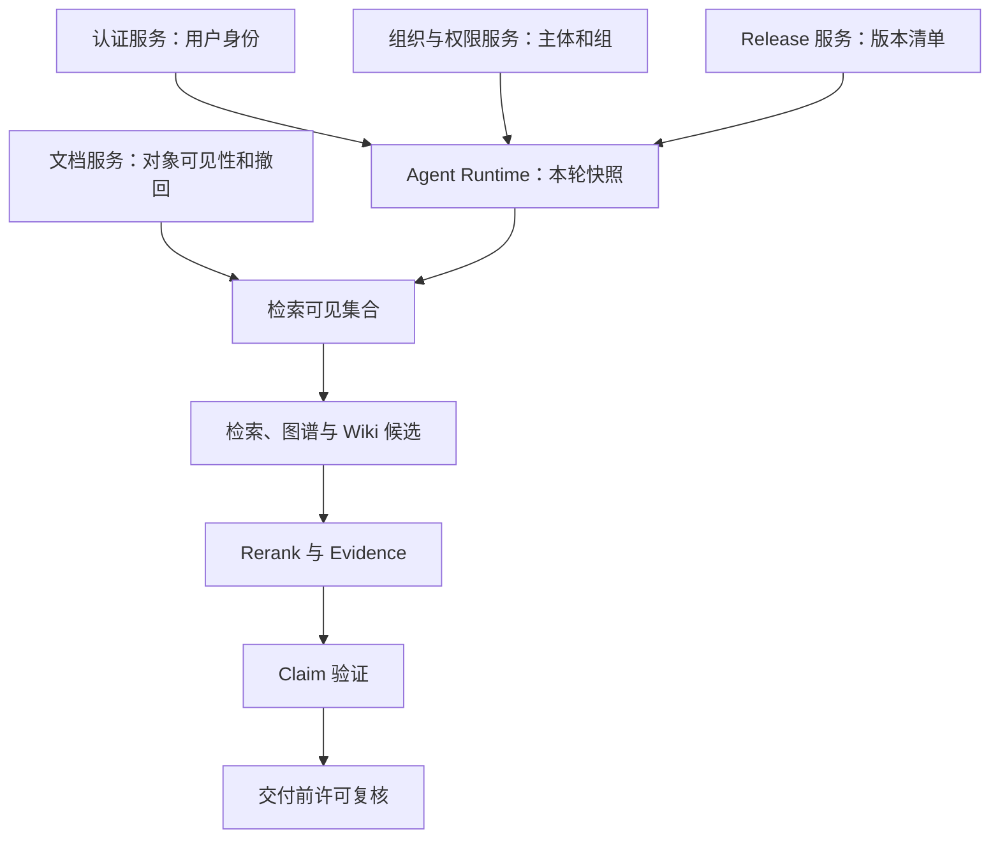
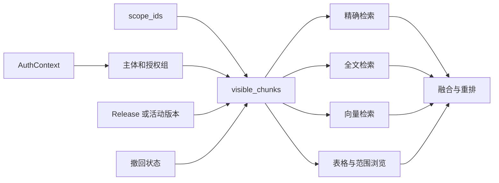

# RAG 的 ACL 与知识版本链

RAG 的权限问题常被简化成“检索完再过滤”。这一步放得太晚了。不可见 Chunk 已经进入向量候选、Reranker 或模型上下文时，即使最终答案删掉相关句子，系统也处理过用户无权读取的内容，缓存与 Trace 还可能留下副本。

版本问题也不能只靠文档的 `active_version_id`。用户查看一个已经发布的知识 Release 时，需要命中发布当时的 Chunk、Wiki Alias 和图谱关系，即使当前草稿已经进入下一版。与此同时，权限仍按当前身份计算。历史版本不是权限豁免。

下面用一个具体变化贯穿全文：第 7 版《远程访问规范》已发布给安全部门，第 8 版草稿随后激活。读者查询 `release-7` 时应该看到第 7 版；该读者被移出安全部门或对象被撤回后，即使查询缓存仍在，也必须立即得到空结果。

::: info 两条约束同时成立

**Release**决定查询哪份知识快照，**ACL**决定当前主体能否读取这份快照。版本匹配但权限拒绝时不返回；权限允许但版本不匹配时也不返回。

:::

## 认证、授权和检索范围解决不同问题

认证回答“请求是谁发出的”。HTTP Session、JWT、API Token 或 MCP 身份最终要解析成同一种 `AuthContext`，包含稳定用户 ID、角色、账号和外部身份。不能把用户在 Prompt 里写的“我是管理员”当作认证信息。

授权回答“这个主体能对哪个资源做什么”。知识库访问、文档可见性、管理操作和工具权限可以有不同策略。能够打开知识库，不等于能读取其中每份受限文档；能够读取文档，也不等于能重新发布或修改 ACL。

检索范围 `scope_ids` 是本次问题主动限定的子集，比如用户在某个目录内提问。它只能缩小授权结果，不能扩大权限。用户拥有整个知识库的读取权，但本轮只选择“安全规范”目录时，检索器应只在该目录内找结果。

这三个对象要分开保存。`user_id` 来自认证层，主体集合与组关系来自授权解析，`scope_ids` 来自可信界面状态或经过校验的工具参数。模型可以识别用户在问某个目录，却不能自己把目录 ID 加进可见范围。

## 权限链上的组件职责和状态所有者

权限数据经过很多组件，但每种状态只能有一个所有者。认证服务拥有用户身份，组织目录拥有部门关系，知识库权限服务拥有成员与授权组，文档服务拥有对象可见性，Release 服务拥有版本清单和投影状态。检索器只消费这些状态，不应在查不到结果时临时修改任何权限。

Agent Runtime 的职责是把本轮身份、范围和 Release 固定到 Turn 状态，并传给所有并发分支。它不能接受模型生成的 `is_admin=true`，也不能根据回答需要扩大 `scope_ids`。Reranker 只处理已授权候选，回答验证器只允许当前 Evidence ID 进入 Claim，交付层则在返回引用前做最后许可检查。

缓存组件拥有缓存条目的生命周期，不拥有授权结论。它可以判断某个键是否命中、锁是否过期，却不能因为上一请求能读取某个 Chunk，就决定下一请求也能读取。图服务与 Wiki 服务同样只返回当前身份可见的派生数据，不能把权限判断推给调用方。



错误也回到状态所有者处理。身份缺失由认证层拒绝，部门树异常由组织目录修复，Release 投影未就绪由发布流水线恢复，缓存陈旧由缓存层失效。模型重试不会改变这些状态，反而可能把确定性拒绝包装成另一段不可信解释。

职责分离会增加接口字段和 Trace 关联成本，但能避免一处“方便的兜底”悄悄扩大权限。跨组件契约至少保存请求 ID、知识范围、Release、主体摘要、策略修订和候选稳定 ID，正文与凭证不在组件之间无边界复制。

## 主体集合怎样覆盖用户、角色、部门和旧组

文档 ACL 往往不是只绑定用户 ID。一个主体可能同时具有：

- `user:<id>` 形式的用户主体。
- 角色主体，例如 `role:admin`。
- 账号、外部 Union ID 或开放平台用户 ID。
- 当前部门以及递归向上的父部门主体。
- 兼容旧权限模型的授权组 ID。

请求开始时，服务从用户记录构造基础主体，再查询部门祖先和知识库内的授权组。递归需要深度上限，避免错误部门树形成无限循环。最终主体集合去重后进入 `RetrievalAccess`。

部门主体与业务组不是同一个集合。文档的 `visibility_subjects` 可以与部门、用户、角色求交；文档元数据中的 `group_ids` 则与授权组 ID 求交。只满足其中一个条件时，仍可能无权读取。这能兼容两套历史权限，但也增加了排障复杂度，Trace 应分别记录两个集合的数量和策略版本。

管理员和创建者可能有快捷分支。管理员绕过普通可见范围时也要受租户和撤回状态约束，不能跨知识库查询；创建者能否读取自己创建的受限文档，应由明确策略决定，不要在不同检索通道里各写一套例外。

## 请求开始固定身份快照，撤权仍要实时生效

Agent 一次 Turn 可能并发执行精确、全文、向量、表格和图谱分支。每个分支重新读取身份，可能在请求中途得到不同部门或组关系。运行时可以在开始时保存 `acl_snapshot`，后续分支使用相同的 `subject_ids`、`group_ids`、角色和 `scope_ids`，保证一次执行的身份解释一致。

身份快照不能屏蔽紧急撤权。对象级 `revoked` 状态和高优先级策略仍应在每次读取候选时检查，缓存命中后也要复查。可以把两类变化分开：普通部门调整在下一 Turn 生效，明确撤回或对象封禁立即生效。

长时间异步 Agent 还要给快照设置版本或有效期。任务恢复时如果策略版本已经变化，重新解析身份并记录新的快照，不能继续使用数小时前的授权结果。恢复后的 Trace 要说明权限快照更新过，避免把前后两段执行误认为同一授权环境。

快照中不保存 JWT、Cookie 或完整用户资料，只保存检索需要的稳定主体和策略版本。持久化敏感凭证既没有必要，也会扩大泄露面。

## 可见 Chunk 必须在各检索通道之前形成

混合检索最安全的 SQL 结构是先建立 `visible_chunks`，精确、稀疏、向量、表格和范围浏览都从它读取。过滤至少包含数据集、索引状态、版本、撤回、主动范围、可见主体与业务组。



这样做比“每个通道自己过滤”更容易审计。新增一个通道时，默认只能看到可见集合，不会因忘记复制 ACL 条件而越权。PostgreSQL 的查询优化仍要通过执行计划验证，必要时给数据集、版本、对象 ID 和可见性字段建立合适索引。

检索后再次校验仍有价值，它能阻止缓存陈旧、异步竞态和实现错误，但它是第二道防线，不是唯一防线。Reranker 输入、模型上下文和日志都只能接收前置过滤后的内容。

向量库若与主数据库分离，ACL 元数据必须同步到向量记录，或先从主库算出允许对象 ID 再作为向量过滤条件。先取全局 Top K 再在应用层删除，可能让不可见内容参与近邻计算和外部服务传输，也会导致过滤后一个结果都不剩。

## 权限过滤放在哪里是一项架构取舍

文档、向量和 ACL 都在 PostgreSQL 时，可以用一条 SQL 先形成可见集合，再执行 pgvector、全文和精确检索。优点是权限、版本和候选处于同一事务语义中，测试也能直接检查查询参数。代价是 SQL 更复杂，索引与执行计划需要持续维护，高并发向量查询会和业务读取争用数据库资源。

独立向量服务能扩展检索吞吐，但权限元数据会变成一份投影。每次文档授权、部门关系、对象撤回和 Release 切换都要传播到向量索引。同步有延迟时，服务必须选择安全失败，不能把“ACL 字段暂时缺失”解释成公开。

另一种方式是主库先计算允许的知识对象 ID，再把过滤列表传给向量服务。对象较少时容易审计，对象很多时过滤列表过大，网络和查询计划成本会上升。可以按租户、目录或权限分区索引，但分区数量和重新分片又会增加运维代价。

搜索引擎也面临相同取舍。把主体数组写进每条文档，查询快但组织关系变化会触发大规模更新；查询时通过权限服务取得允许集合，新鲜度更好，但权限服务会进入检索关键路径。实际选择要看撤权时效、主体变化频率、对象规模和可接受延迟，不能只比较单次查询速度。

数据库 Row Level Security 可以防止漏写应用过滤，不过它无法理解 Release Link、缓存命中和外部向量索引。启用后还要管理连接池会话变量、后台 Worker 身份和管理员路径。RLS 配错会让所有查询失败，或让复用连接带着上一用户上下文，测试成本不能忽略。

无论选哪种架构，统一的不变量是：不可见内容不能进入外部 Rerank 和模型，撤回有明确最大传播时间，缓存命中要复核，版本与权限条件能在 Trace 中还原。性能优化只能在这些不变量内取舍。

## Release 固定文档、Wiki 和图谱三类投影

发布不是给当前文档打一个标签。系统需要创建不可变 Node Release，保存文档内容与必要元数据，再建立 `knowledge_release_objects` 和来源版本。RAG 入库、Wiki 快照和图谱构建分别写入投影状态。

Release 只有在文档存在就绪 Chunk，并且对象的 RAG、Wiki 与 Graph 投影都达到发布要求时才能激活。新 Release 激活时，旧活动 Release 进入 retired，但历史数据仍可供明确指定的版本查询。

| 投影 | 版本固定内容 | 查询时的作用 |
| --- | --- | --- |
| RAG | 文档版本、Chunk、Embedding 和索引状态 | 返回发布时的原文证据 |
| Wiki | 标题、Alias、Topic、Entity 和摘要快照 | 支持固定版本的精确路由 |
| Graph | 文档版本对应的节点来源和边 Evidence | 支持历史关系扩展 |

普通查询要求 Chunk 属于文档当前活动版本；固定 Release 查询不再依赖当前 `active_version_id`，而是检查 Chunk 的 Node Release 是否在 `kb_release_node_releases` 中。第 8 版草稿激活后，`release-7` 查询仍能命中第 7 版 Chunk。

Wiki 搜索也要读取 Release 来源版本里的快照。若“六六活动”只存在于第 7 版 Alias，当前搜索不命中，指定第 7 版应命中。图谱使用同样的版本条件，避免 Alias 指向第 7 版、关系却来自第 8 版。

## 当前权限覆盖历史版本的可见性

Release 保存发布时内容，不保存永远有效的访问许可。对象被撤回、用户离职或部门关系变化后，历史查询也必须重新计算当前 ACL。

可见性可以由对象级 `knowledge_acl_states` 覆盖文档默认值。`revoked=true` 是最高优先级拒绝；否则读取对象 ACL 的 `visibility_scope` 与 `visibility_subjects`，缺失时回退文档字段。管理员、创建者和组规则在这之后按策略判断。

这意味着“复现历史答案”与“保持历史权限”是两件事。系统可以证明第 7 版当时包含某段内容，但当前用户无权查看时，只返回拒绝状态和可公开的原因，不返回原引用。

对象的 ACL 变化还要传播到图谱节点来源、边 Evidence、Wiki 详情与搜索建议。最稳妥的方式是在读取时连接统一 ACL 状态，而不是给每种派生数据复制一份可见性后长期不更新。为了查询性能做冗余时，必须有修订号和失效任务。

## 异步派生数据怎样响应撤回与删除

RAG Chunk、Embedding、Wiki、图谱和搜索档案都从源对象派生。发布时可以异步生成这些投影，撤权时却不能等所有重建完成后才停止访问。对象级 ACL 状态应成为统一的读取闸门，先将对象标记为撤回，所有查询立即拒绝，再异步清理或重建派生数据。

撤回事件至少携带知识范围、对象 ID、ACL 修订和发生时间。消费者按对象更新向量元数据、停用搜索档案、让 Wiki 与图谱缓存失效。重复事件必须幂等，较旧修订不能覆盖较新状态。某个消费者失败时，统一读取闸门仍能阻止泄露，监控则提示派生清理积压。

删除需要区分软删除、合规清除和历史保留。软删除可以保留稳定 ID 与审计关系，活动查询不再返回；合规清除还要删除 Chunk、Embedding、Quote、缓存和对象存储内容；历史 Release 是否保留，取决于数据政策和法律要求，不能由检索团队自行决定。

重新授权也不能简单撤销 `revoked`。若源内容已经清除，需要重新入库和构建投影；若只是临时停用，可以在验证来源版本和 ACL 修订后恢复。恢复前的缓存仍可能为空，允许自然过期或精确失效都可以，但不能把旧的授权候选直接当成新状态。

后台任务在撤回前已经领取内容时，要在写入投影前复查对象修订。否则撤回后的迟到任务会重新激活 Chunk 或图谱 Evidence。任务状态可以记为 `superseded`，说明输入版本或 ACL 已被更新，不把它当成可重试故障。

紧急撤权需要可测的最大窗口。读取时实时连接 ACL 状态，窗口主要受事务提交和副本延迟影响；完全依赖事件刷新外部索引，窗口还包含队列与消费者延迟。产品应选择明确上限，并在超出时自动切断受影响索引通道。

## 缓存只减少检索计算，不能缓存授权结论

固定 Release 的精确和稀疏查询很适合短时缓存，因为内容不再变化。缓存可以保存序列化候选或 Chunk ID，键包含数据集、知识范围、规范化查询、Release、通道和主动 `scope_ids`。

主体信息是否进入键有两种设计。按主体或权限范围分区，命中结果更接近最终可见集合，但键数量多且权限变化仍需失效；缓存范围内的候选 ID，命中后每次重新执行可见性 SQL，计算略多，却更容易保证撤权。无论选哪一种，**缓存命中后都不能省略撤回检查**。

缓存命中后的 SQL 使用 Chunk ID 列表，并重复检查数据集、Release、范围、对象撤回、主体交集和业务组。用户第一次查询得到 `chunk-v7`，管理员随后撤回对象，第二次命中缓存时可见 ID 为空，最终返回空结果，不需要等 TTL 到期。

Singleflight 可以合并同一缓存键的并发未命中。锁值用随机 Token，释放时通过比较后删除，避免一个请求误删另一个请求刚续上的锁。等待者有自己的超时，锁持有者失败后，其他请求可以重新竞争或走数据库查询。

::: danger 不能缓存模型看过的隐藏文本

若 ACL 过滤发生在 Rerank 或回答之后，缓存里可能已经包含隐藏内容。修复键设计无法清除这类风险，必须删除受影响缓存并把过滤移动到所有内容处理之前。

:::

## Rerank、Evidence 和 Citation 继续携带可见性

候选通过 SQL 过滤后进入融合和重排。Reranker 只能看到可见候选的标题、路径、结构字段和正文。图谱上下文也要先经过节点、边与 Evidence ACL 过滤，不能用不可见邻居增强文档分数。

融合后的 `SearchCandidate` 保留文档 ID、文档版本、知识对象 ID、根节点 ID 和通道。转换成 `EvidenceItem` 时，`source_version_id` 不能丢失。Claim 引用 Evidence ID，Citation 再从可见 Evidence 生成。

回答完成前可以执行最后一次许可检查，确认所有 `answer_evidence_ids` 仍属于本轮授权范围。长任务中发生紧急撤回时，已经生成的草稿不能直接交付；系统删除失效 Evidence，重新验证 Claim，证据不足则拒答或只保留剩余受支持内容。

引用链接也要经过权限入口。不要把对象存储真实地址或内部路径直接放进 Citation。用户点击时由受控下载接口再次鉴权，并校验对应版本仍可访问。

## 指定范围无结果时不能偷偷扩大搜索

用户在“安全规范”目录内问问题，返回空结果可能是该范围没有材料，也可能是材料存在但无权访问。系统不应自动移除 `scope_ids` 搜索整个知识库，这会把主动范围变成提示而非约束。

正确终态可以是 `empty_in_scope` 或不透露存在性的统一空结果，具体取决于产品安全策略。能够公开目录存在时，可以提示“当前范围没有可用证据”；目录本身敏感时，只返回“无法根据可访问资料确认”。

模型建议“扩大搜索范围”也不能自动执行。界面可以让用户明确选择新的已授权目录，运行时重新创建范围快照。这个动作是新的检索决策，需要记录来源和时间。

空结果也不能退回模型参数回答内部事实。模型常识不受当前 ACL 和 Release 约束，无法证明信息来自允许范围。对外公共知识可以有单独通道和清晰标签，不能与内部 RAG 的安全空结果混在一起。

## 一次缓存命中后的撤权推演

共享示例包含第 7 版和第 8 版两个 Chunk。普通读者属于安全部门，主动范围限定为 `node-remote`，查询时固定 `release-7`。

<<< ../../examples/ai-agent/acl_release_retrieval.py

运行示例：

```bash
PYTHONPATH=examples/ai-agent \
  python3 examples/ai-agent/acl_release_retrieval.py
```

第一次检索命中 `chunk-v7` 并写缓存，第二次从缓存得到同一候选，底层搜索只执行一次。对象撤回后，第三次仍命中缓存键，但可见性复核删除该 Chunk，结果为空。

```text
{'first': ['chunk-v7'], 'cached': ['chunk-v7'], 'after_revoke': [], 'search_calls': 1}
```

示例还验证主动范围不会在空结果后扩大，以及文档主体 ACL 与业务组约束必须同时满足。它只证明内存控制逻辑，不能证明真实 SQL、Redis 锁、数据库隔离级别和分布式撤权延迟。

## 失败证据要定位到身份、版本、范围或缓存

检索返回意外空结果时，可以按下面顺序定位：

1. 认证层是否解析到正确用户和角色。
2. 主体展开是否包含预期部门祖先与授权组。
3. 主动 `scope_ids` 是否过窄或来自错误界面状态。
4. `knowledge_release_id` 是否存在，RAG 投影是否 ready。
5. 对象是否撤回，文档版本与 Release Link 是否匹配。
6. 缓存命中后的可见性复核删除了哪些候选。

意外越权则反向检查：候选是否从 `visible_chunks` 产生；缓存是否复查 ACL；Reranker 是否混入其他分支原文；图谱节点说明是否来自可见来源；最终 Evidence 是否保存版本和对象 ID。

审计日志不保存文档正文。它可以记录请求 ID、用户稳定 ID、知识范围、Release、策略修订、候选数量、拒绝阶段和最终 Evidence ID。主体集合通常也不需要原样落日志，可以保存数量与不可逆摘要，在受控 Trace 中按需查看。

ACL 拒绝不可重试。数据库连接失败或缓存暂时不可用可以在 Deadline 内降级；缺少 Release 投影应等待构建或返回未就绪；对象撤回则立即终止。把这些情况放进同一个重试循环，只会延迟拒绝并增加依赖压力。

## 标题、数量和耗时也可能形成侧信道

系统即使不返回正文，也可能通过搜索建议、结果数量、错误文案和响应时间泄露对象存在。普通用户查询一个私密项目名时，不能返回“找到 1 条但无权限”，更安全的响应是与未命中一致的空结果或统一拒绝。

排序和分页总数也要基于可见集合计算。先统计全库命中 37 条，再过滤成 2 条，会泄露隐藏数据规模。Wiki 树和图谱概览同样只统计可见节点、边与 Evidence。

时间侧信道很难完全消除，但可以避免明显差异。不可见对象精确命中后若立即拒绝，而真正不存在的查询要跑完整向量检索，两者耗时可被反复测量。可以统一查询路径、设置最小响应窗口或对高风险接口限频，具体措施要结合威胁模型。

日志和指标也属于输出面。对象标题、完整 Alias、部门名单和文档 URL 不进入低权限监控标签。审计人员需要查看时，通过受控后台按稳定 ID 解析，避免可观测平台变成权限旁路。

错误追踪工具上传请求参数前要脱敏，特别是 Prompt、检索片段、JWT 和对象存储签名链接。采样策略不能以“失败请求全部上报”为理由跳过内容过滤，因为权限拒绝恰好是最敏感的一类失败。

## 测试要把跨租户、版本切换和撤权放在一起

本地示例测试使用：

```bash
PYTHONPATH=examples/ai-agent \
  python3 -m unittest discover \
  -s examples/ai-agent/tests \
  -p 'test_acl_release_retrieval.py'
```

数据库集成测试还要覆盖：

| 场景 | 断言 |
| --- | --- |
| 当前版本切换 | 固定 Release 仍返回旧 Chunk，不返回新活动版本 |
| Release Wiki Alias | Alias 只存在于旧快照时，只有固定 Release 查询命中 |
| 缓存后撤权 | 不重新执行检索，但可见性复核返回空 |
| 部门父级权限 | 子部门用户按规则继承父部门主体 |
| 业务组限制 | 主体 ACL 通过但组不匹配时仍拒绝 |
| 跨知识库 | 相同对象名和 Alias 不能跨租户命中 |
| 图谱历史 | Release 边可回看，当前 ACL 撤回后不可见 |
| 回答交付前撤权 | 失效 Evidence 不进入 Citation |

测试数据要放在隔离事务或专用数据库中。跨租户用例同时创建相同标题和查询词，避免测试只因名称不同而通过。撤权用例应先证明缓存确实命中，再修改 ACL，否则无法验证“命中后复查”这条关键路径。

## RBAC、ACL 和 Row Level Security 可以组合但不能互相假定

RBAC 适合控制谁能管理知识库、发布内容或查看审计；对象 ACL 适合表达某份文档对用户、部门和组的可见性；数据库 Row Level Security 可以在存储层增加最后防线。三者服务不同层级。

应用已有复杂 Release、图谱和缓存查询时，RLS 需要确保连接中的主体上下文正确传递，连接池复用后及时清理。只打开 RLS 却没有测试每条后台任务身份，可能让 Worker 全部读不到数据，或错误复用上一个请求的主体。

没有 RLS 也不意味着只能依赖代码自觉。统一 `visible_chunks`、封装检索 Repository、禁止调用方传任意 `is_admin`，再配合数据库测试和静态检查，可以形成明确边界。RLS 是额外防线，不是替代应用版本语义的魔法开关。

这条链最终要保证：查询范围不会扩大，Release 不会漂移，任何派生通道都看不到越权内容，缓存不能延长撤权窗口。只有这四项同时成立，RAG 返回的 Evidence 才能安全进入 Agent 回答。

发布前可以用同一组查询分别模拟管理员、文档创建者、授权部门成员和无权限用户，比较候选 ID、引用和结果数量。再在缓存命中后执行撤回，确认所有角色立即得到预期结果。这组回归比只测接口返回 200 更容易发现权限链中间的遗漏。
