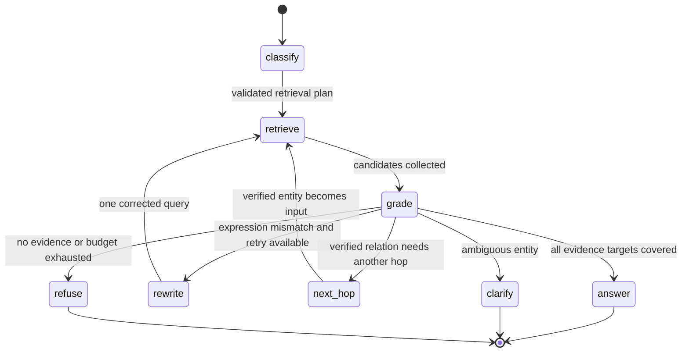

# Adaptive、Corrective、多跳与 Agentic RAG 的执行链

固定 RAG 常见的流程是“问题 -> 检索一次 -> 生成答案”。它适合边界清楚、知识完整的简单问答，但遇到四类问题就会吃力：问题类型不同却使用同一检索器，首次召回质量差，答案需要沿实体关系查两次，或者研究步骤必须根据中间证据动态决定。

Adaptive、Corrective、多跳和 **Agentic RAG** 分别处理这四类控制问题。它们不是四个可以随意堆叠的流行词，而是把“何时选择路径、谁决定下一步、状态保存什么、何时停止”放在不同位置。本篇会用一个“查明某服务由谁负责，以及该团队采用什么发布流程”的问题推演完整执行链。

开始前需要理解 SearchPlan、Evidence、ACL、Release、绝对 Deadline 和有限循环。若基础检索没有可靠评测、文档解析仍漏页或权限过滤不正确，先不要增加 Agentic RAG；复杂控制会让根因更难定位。

## 先用一张表分清四种控制方式

| 方式 | 决策发生时机 | 主要输入 | 主要输出 | 解决的缺口 |
| --- | --- | --- | --- | --- |
| **Adaptive RAG** | 首次检索前 | 问题类型、实体、预算 | 选择检索策略 | 不同问题不应走同一路径 |
| **Corrective RAG** | 看到候选后 | 相关性、覆盖、冲突 | 接受、改写、换源或拒答 | 初次证据质量不足 |
| Multi-hop RAG | 某一跳完成后 | 已验证实体和缺失关系 | 下一跳结构化查询 | 答案依赖多段关系 |
| Agentic RAG | 每个研究阶段 | 当前状态、证据、预算 | 有限工具动作或终态 | 路径无法预先完全写死 |

共同约束是：模型可以**提议**路径或动作，程序负责 Schema 校验、Scope/Release 注入、预算扣减和停止。否则“自适应”很容易变成不可审计的无限尝试。

## Adaptive RAG：在检索前选择合适路径

Adaptive RAG 解决的是输入异质性。错误码查询适合精确/全文检索，概念问答适合全文/向量检索，负责人和日期适合结构化查询，复杂关系问题才需要**多跳**。如果所有请求都同时跑五种检索和多个模型，不仅昂贵，噪声也更多。

它的输入是经过结构化理解的问题特征，例如 `query_kind`、`exact_entities`、`requires_relation` 和 `time_range`；内部状态是可选通道、预算和可信 Scope；输出是有限的 `RetrievalPlan`。分类器可以是规则、模型或二者结合，但执行器只接受白名单策略。

Adaptive 不等于“根据首轮结果补救”，因为它的主要路由发生在检索前。路由错误时需要保守 fallback，例如结构化查询无匹配后允许一次全文查询，但不能自动扩大时间或权限范围。

## Corrective RAG：证据质量不足时怎样补救

Corrective RAG 在首次检索后判断候选是否足以回答。判断信号不能只有最高相似度，因为相似不代表支持。至少要检查：

- 必需**证据目标**是否覆盖；
- Evidence 是否来自同一 Release 且在当前 Scope；
- 原文定位能否读取；
- 候选之间是否冲突；
- 查询中的精确实体是否仍然出现；
- 剩余 Deadline 和补搜次数是否足够。

纠错动作应与缺口对应。查询表达差可以改写一次；精确术语未命中可以切全文；缺少某个 Claim 可以做定向补搜；知识库本身没有资料则拒答。外部 Web 搜索只有在产品明确允许、用户权限和引用策略都支持时才是一条独立数据源，不能作为默认兜底。

Corrective 的输出不是“更好答案”，而是 `accept`、`retry_with_query`、`switch_channel`、`request_clarification` 或 `refuse` 等有限状态。每次纠错要带原因码和尝试计数。

## Multi-hop RAG：上一跳的事实成为下一跳输入

示例问题包含两条关系：

1. `service -> owned_by -> team`
2. `team -> uses_process -> release procedure`

第一跳必须返回结构化实体 ID、Evidence ID 和关系类型。第二跳只能使用已验证的 `team_id`，不能从第一跳的一段自然语言摘要中猜团队名。每一跳都继承同一租户、Scope 和知识 Release，并声明本跳要补齐哪个证据目标。

多跳的内部状态至少包括：已解析实体、待查关系、已取得 Evidence、访问过的 `(entity, relation)`、跳数、预算和停止原因。访问集合防止 `A -> B -> A` 循环；最大跳数限制成本；多个候选实体则进入澄清或消歧，不应随机选最高分。

多跳不适合“所有复杂问题”。如果两个查询互不依赖，可以并行分解；只有第二步确实依赖第一步输出时才需要串行多跳。

## Agentic RAG：让 Runtime 选择有限研究动作

Agentic RAG 把检索看成受控 Agent Runtime。模型读取当前 `ResearchState`，提出下一步动作，例如 `search_text`、`lookup_relation`、`rerank` 或 `finish`；确定性执行器校验参数、权限、剩余预算和允许的状态转换，执行后把 Observation 写回状态。

它适合开放式但仍有明确工具边界的研究问题。代价是路径数量、模型调用、恢复状态和评测难度都增加。能够用固定工作流解决的任务，不应为了名称先进改成 Agentic RAG。

Agentic 的停止条件必须属于程序状态：全部证据目标覆盖、用户取消、绝对 Deadline 到达、最大动作数耗尽、重复动作、权限拒绝、工具不可用或证据冲突无法消解。模型说“我完成了”只能是候选终止动作，验证器仍要检查 Evidence。

## 把四种方式放进一个有限状态机



`classify` 对应 Adaptive 路由；`grade` 对应 Corrective 质量判断；`next_hop` 对应 Multi-hop；如果允许模型在这些有限动作中选择，就形成 Agentic Runtime。所有回到 `retrieve` 的边都增加尝试或跳数。`clarify`、`refuse` 和 `answer` 都是合法终态，不能只把“生成了文本”视为成功。

## 实现一个有限研究 Runtime

下面的实现只依赖标准库，不调用模型和数据库。输入是起始服务 ID、最多两跳和动作预算；匿名关系表模拟已通过 ACL/Release 过滤的数据源。目标是观察状态怎样从负责人关系推进到发布流程，并在缺证据、循环或预算不足时停止。

```python
# Runtime 根据证据质量选择补搜动作，每次扣减跳数与调用预算，满足覆盖或耗尽预算即终止。
from __future__ import annotations

from dataclasses import dataclass, field
from enum import StrEnum


class Terminal(StrEnum):
    ANSWERED = "answered"
    INSUFFICIENT_EVIDENCE = "insufficient_evidence"
    BUDGET_EXHAUSTED = "budget_exhausted"
    LOOP_DETECTED = "loop_detected"
# RelationEvidence 保存可追溯来源、稳定标识和可见范围，供 Claim 绑定与引用校验。


@dataclass(frozen=True)
class RelationEvidence:
    subject: str
    predicate: str
    object_id: str
    evidence_id: str


@dataclass
class ResearchState:
    current_entity: str
    pending_predicates: list[str]
    # evidence 保存检索结果的稳定引用，生成答案前必须能够追溯来源。
    evidence: list[RelationEvidence] = field(default_factory=list)
    visited: set[tuple[str, str]] = field(default_factory=set)
    remaining_actions: int = 3
    terminal: Terminal | None = None


RELATIONS = {
    ("service-a", "owned_by"): RelationEvidence(
        "service-a", "owned_by", "team-blue", "e-owner"
    ),
    ("team-blue", "uses_process"): RelationEvidence(
        "team-blue", "uses_process", "procedure-safe-release", "e-process"
    ),
}


def lookup_relation(entity_id: str, predicate: str) -> RelationEvidence | None:
    """模拟只读结构化检索；生产实现必须在查询内应用 ACL 与 Release。"""
    return RELATIONS.get((entity_id, predicate))


# 入口函数按固定顺序编排各步骤，具体校验和副作用仍由各自函数负责。
def run_research(state: ResearchState) -> ResearchState:
    while state.pending_predicates:
        # 外部调用前检查整轮剩余时间；超时后停止继续消耗模型、工具和数据库资源。
        if state.remaining_actions <= 0:
            state.terminal = Terminal.BUDGET_EXHAUSTED
            return state

        predicate = state.pending_predicates.pop(0)
        visit_key = (state.current_entity, predicate)
        if visit_key in state.visited:
            state.terminal = Terminal.LOOP_DETECTED
            return state

        state.visited.add(visit_key)
        state.remaining_actions -= 1
        relation = lookup_relation(state.current_entity, predicate)
        if relation is None:
            state.terminal = Terminal.INSUFFICIENT_EVIDENCE
            return state

        state.evidence.append(relation)
        state.current_entity = relation.object_id

    state.terminal = Terminal.ANSWERED
    return state


# 运行一次完整流程并保存显式结果，下面检查终态以及是否留下多余副作用。
result = run_research(
    ResearchState(
        current_entity="service-a",
        pending_predicates=["owned_by", "uses_process"],
        remaining_actions=2,
    )
)
print(result.terminal)
print([(item.predicate, item.object_id, item.evidence_id) for item in result.evidence])
```

`RelationEvidence` 把下一跳实体与 Evidence ID 绑定；`ResearchState` 保存当前实体、待查关系、已验证证据、访问集合和剩余动作。`lookup_relation` 是外部适配器边界，真实实现应接数据库或图谱，并把可信过滤放在查询里。

`run_research` 每轮先检查动作预算，再检查循环，随后才消耗动作并查询。只有查到 `RelationEvidence` 才更新 `current_entity`；无结果不会让模型猜下一实体。示例执行两跳后输出 `answered` 和两条证据链。把预算改为 1 会输出 `budget_exhausted`，把第二个关系改成不存在的值会输出 `insufficient_evidence`。

这个最小 Runtime 没有实现查询改写与模型 Planner。加入它们时也应只产生受控动作，并复用同一状态、预算和终态，而不是另起一个无法恢复的循环。

## 用 pytest 验证停止条件

下面的测试直接复用研究 Runtime，覆盖正常链、缺证据和预算耗尽。重点是验证终态与状态变化，而不是只看最后生成的字符串。


为了验证“用 pytest 验证停止条件”，下面的测试把“测试覆盖证据足够、连续低质量和多跳耗尽，确认研究循环不会重置预算或无限改写查询”变成可执行断言。每个用例自己构造输入，并用断言固定返回值或失败状态；某条测试失败时，可以从用例名直接定位到被破坏的契约。

```python
# 测试覆盖证据足够、连续低质量和多跳耗尽，确认研究循环不会重置预算或无限改写查询。
from research_runtime import ResearchState, Terminal, run_research


def test_two_hops_keep_both_evidence_items() -> None:
    # 运行一次完整流程并保存显式结果，下面检查终态以及是否留下多余副作用。
    result = run_research(
        ResearchState("service-a", ["owned_by", "uses_process"], remaining_actions=2)
    )
    assert result.terminal is Terminal.ANSWERED
    assert [item.evidence_id for item in result.evidence] == ["e-owner", "e-process"]


def test_missing_relation_stops_without_guessing() -> None:
    # 运行一次完整流程并保存显式结果，下面检查终态以及是否留下多余副作用。
    result = run_research(
        ResearchState("service-a", ["unknown_relation"], remaining_actions=2)
    )
    assert result.terminal is Terminal.INSUFFICIENT_EVIDENCE
    assert result.evidence == []


def test_action_budget_is_shared_by_all_hops() -> None:
    # 运行一次完整流程并保存显式结果，下面检查终态以及是否留下多余副作用。
    result = run_research(
        ResearchState("service-a", ["owned_by", "uses_process"], remaining_actions=1)
    )
    assert result.terminal is Terminal.BUDGET_EXHAUSTED
    assert len(result.evidence) == 1
```

运行 `python -m pytest -q`。第一个测试锁定证据链完整性，第二个证明没有证据时不会猜，第三个证明两跳共享同一动作预算。每条测试都从新的 `ResearchState` 输入开始，输出同时断言终态与 Evidence 数量；若异常被吞掉或预算被重置，断言会直接失败。真实 Runtime 还要覆盖取消、绝对 Deadline、重复查询、工具超时、ACL 拒绝、Release 切换和 Checkpoint 恢复。

## 质量评分器不能只看相似度

Corrective 路由可以组合确定性信号与模型评分，但职责要分开：

| 信号 | 由谁判断 | 失败后动作 |
| --- | --- | --- |
| ACL、Release、原文存在性 | 程序 | 丢弃候选或安全失败 |
| 必需 Claim 是否都有 Evidence | 程序 + 结构化计划 | 定向补搜或拒答 |
| 候选是否语义支持 Claim | Reranker/验证模型 + 抽样人工 | 换候选或拒答 |
| 实体是否歧义 | 实体解析器 + 程序阈值 | 追问用户 |
| 预算是否足够 | 程序 | 降级或终止 |

模型评分不能覆盖权限错误，也不能把“我认为答案可能是”当 Evidence。评分器版本、输入片段、输出等级和最终路由都要进入 Trace，才能用 Eval 比较改动。

## 何时不应该使用 Agentic RAG

如果问题类型固定、流程可以预先写出、数据源只有一个且一次检索足够，普通 RAG 更容易测试和运维。若需要两条互不依赖查询，固定并行工作流比动态 Planner 更稳定。只有动作确实依赖中间证据、路径数量无法合理枚举且收益可以评测时，才考虑 Agentic。

复杂度带来的成本包括额外模型调用、更多状态、循环风险、恢复点、权限复核次数和评测组合。上线前必须比较固定基线与候选方案，而不是只展示一个成功演示。

## 可以直接使用的研究图检查表

1. 为每种查询类型定义 Adaptive 路由和保守 fallback。
2. 为 Corrective 评分写出可观察信号、动作和最大次数。
3. 多跳只传结构化、已验证实体，不传猜测摘要。
4. 每一跳继承 Scope、Release、Deadline 和证据目标。
5. 保存访问集合、动作数、跳数和绝对 Deadline。
6. 把回答、澄清、证据不足、取消、超时、越权都定义为终态。
7. 分别评测路由准确率、检索覆盖、Claim 支持、额外延迟和成本。

研究图应在证据足够、无进展、预算耗尽、需要澄清、取消、超时或越权时进入明确终态。复杂路径的价值必须由评测证明，不能只靠一个成功演示。

## 常见问题

### Adaptive RAG 的路由可以完全交给模型吗？

模型可以输出结构化候选类型，但 Runtime 要校验枚举、置信度和必要特征，并设置保守 fallback。精确 ID、无权限范围和高风险请求等确定信号优先由程序判断；模型不应决定 Scope、Release 或最大预算。路由结果、输入特征和后续质量要进入 Trace，用标注集评估分类准确与错误成本。若错误路由代价高，宁可走稳定固定流程或要求澄清。

### Corrective RAG 根据什么判断证据质量不足？

不能只看最高相似度。程序先检查 ACL、Release、原文存在与 Evidence 目标覆盖，再结合 Reranker 或验证模型判断语义支持，实体歧义单独处理。评分结果应返回缺失槽、冲突、来源等级和建议动作，而不是一个模糊总分。权限错误直接丢弃或失败，缺少某个 Claim 才定向补搜；若多次无新证据则停止。这样纠正动作与失败原因一一对应。

### 多跳 RAG 怎样避免第一跳错误一路放大？

每一跳只把已经验证、带稳定 ID 和来源的实体传给下一跳；出现多个实体候选时澄清或保留分支，不能让模型随便选择。下一跳继承同一 Scope、Release、Deadline 与访问集合，并限制 hop 和分支数。最终 Claim 要能回溯每一跳 Evidence，任一来源无效就不能给确定结论。测试中故意让第一跳歧义、第二跳越权和版本冲突，验证系统安全停止。

### Agentic RAG 为什么容易形成无限循环？

模型可能反复改写同一查询、在两个工具间切换或每次都声称还需更多证据。Runtime 应保存规范化查询与访问集合，重复动作不计作进展；同时设置最大动作数、hop、Token、工具调用和绝对 Deadline。停止条件由程序读取 Evidence 覆盖和预算，重规划不能重置计数。Checkpoint 恢复也要保留访问集合，否则重启后会从头循环。

### 什么情况下固定工作流比 Agentic RAG 更好？

问题类型稳定、数据源少、路径可枚举、一次或固定两路检索足够时，程序工作流更容易测试、预测延迟和恢复。两个互不依赖的查询用固定并行即可，无需 Planner。只有下一动作确实依赖中间证据、路径无法合理预写，并且 Eval 显示质量收益覆盖额外延迟与成本时，才考虑 Agentic。架构复杂度不是能力指标，可靠回答才是。

### 研究图恢复后，怎样避免重复外部调用？

Checkpoint 要保存动作 ID、规范化参数、完成状态、结果指针和预算；工具调用使用幂等键或先查询最终状态。恢复时从最近安全点读取，已完成的不可重放副作用不再执行，未确认调用按工具契约判断重试或人工处理。模型生成的新计划也不能绕过访问集合。测试应在调用完成但 Checkpoint 未写、以及 Checkpoint 已写但事件未发两个窗口注入故障。
