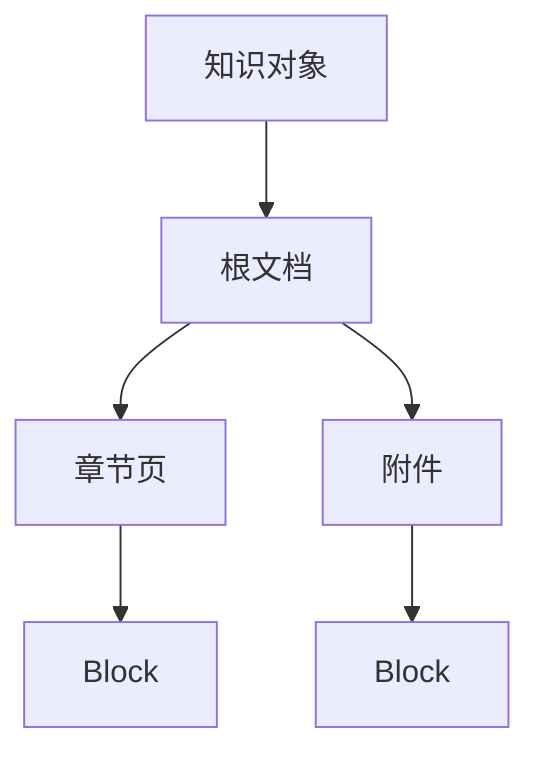

# Block 文档模型怎样保留结构与来源

解析器把 PDF 页面、HTML 标题、Word 表格和 Markdown 代码转换成一段长文本，Chunker 随后按字符数切分。这样实现很快，却会丢掉“这段文字属于哪个章节”“表格行的表头是什么”“答案引用在第几页”等信息。

**Block（文档块）** 是解析到切块之间的结构化中间单元。它不追求一种固定的最终文本，而是保存内容类型、来源位置、章节路径和结构字段，让后续 Chunker、检索器与 Citation 各取所需。

## Block 不是 Chunk 的别名

Block 接近解析器识别出的最小语义单元，Chunk 是为了检索预算把多个 Block 组合后的单元：

```text
原始文件 -> Source -> Block -> Chunk -> Embedding / Index
```

一个段落 Block 通常直接进入一个 Chunk，连续几个短段落也可以合并。一个表格 Block 可能按行拆成多个结构化 Chunk。Chunk 边界改变时，Block 来源仍然保持稳定，引用可以回到原始位置。

如果一开始只生成 Chunk，后续想恢复标题、表头或页码只能依赖字符串猜测。结构丢失通常无法通过再训练 Embedding 补回。

## Block 的最小字段

可以定义一个跨格式的模型：

```text
Block {
  block_id
  kind
  text
  display_text
  source_id
  source_version_id
  document_version_id
  release_id
  ordinal
  section_path
  page_number
  parent_block_id
  table_id
  table_headers
  row_index
  structured_fields
  parse_warnings
}
```

`kind` 至少区分 `heading`、`paragraph`、`list_item`、`code`、`table`、`table_row`、`quote` 和 `page_marker`。不同格式可以有扩展类型，但下游要有明确回退语义。

`ordinal` 是同一 Source 内的稳定顺序。页码、Slide、Sheet 和 DOM 路径作为辅助定位，不取代 `ordinal`。文件重新解析后顺序变化，新的 `source_version_id` 应使引用明确指向新版本。

## 内容字段为什么要分三份

同一 Block 可能需要三种文本：

| 字段 | 用途 | 允许的变化 |
| --- | --- | --- |
| `display_text` | 页面预览和引用上下文 | 保留原布局与标记 |
| `embedding_text` | 向量表示 | 可加入标题路径、去除噪声 |
| `answer_text` | 生成答案的证据片段 | 适合用户阅读，保留限定条件 |

把标题路径加入 `embedding_text` 有助于区分同名段落，但不能把“生产环境”添加到原文后再当作用户可见事实。`answer_text` 不能删除否定、时间和适用范围，否则引用会改变原意。

显示文本可以保留 Markdown 表格，Embedding 文本可以使用“表头：值”的线性表示，结构化字段则保存真正的列名和值。三个字段都引用同一个 Block ID。

## 章节路径连接远处的标题

解析器扫描标题时维护一个章节栈：

```text
# 访问策略                 -> [访问策略]
## 生产环境                -> [访问策略, 生产环境]
### 重试                   -> [访问策略, 生产环境, 重试]
## 测试环境                -> [访问策略, 测试环境]
```

正文 Block 继承当前 `section_path`。层级跳跃，例如从 H1 直接到 H4，可以保留稀疏路径并记录 Warning，不能凭空创建 H2 与 H3 标题。

章节路径同时用于检索和回答。用户问“生产环境的重试”，路径可以补充语义；引用展示时仍要指向实际标题和位置。标题变化会影响稳定 Chunk ID，因此 Chunker 版本和内容哈希需要参与版本记录。

多文档的根标题可能相同，ID 生成不能只用章节名称。`document_version_id`、`source_id` 和 `section_path` 共同构成来源边界。

## 父子 Source 与逻辑文档关系

一个知识对象可能包含根文档、章节页、附件和导入的子页面。Source 结构可以保存 `parent_id`、`depth`、`order` 与 URL：



父子关系用于权限、展示和检索过滤。子 Source 的父 ID 必须存在，根节点至少一个，ID 不重复。深度上限防止异常导入形成无限树。

来源层级不是数据库外键的替代描述。只有源码或迁移明确维护的关系才可标记为确认关系，语义上的“同一主题”只能作为候选。

Chunk 保存 `source_version_id`、`knowledge_object_id`、`root_node_id` 和 `release_id`，这样一次检索可以同时回答“来自哪个文件”和“属于哪个活动知识版本”。

## 表格 Block 不能退化成段落

表格行要保留表头、表 ID、行号与结构字段：

```text
TableBlock {
  table_id
  headers: [环境, 最大重试, 退避]
  row_index: 3
  values: [生产, 3, 指数]
  structured_fields: {
    environment: 生产,
    max_retries: 3,
    backoff: 指数
  }
}
```

向量文本可以渲染为“环境=生产；最大重试=3；退避=指数”，全文索引还可以为“生产”“3”“指数”建立词项。回答引用展示完整表头和行，避免用户只看到 `3` 不知道它代表什么。

表头跨页重复时，解析器可以复制到每个行 Block，但要记录原始表 ID 与页码。合并单元格、空列、重复表头和行号需要在 `structured_fields` 中明确，不能依赖模型猜测。

超大表可以按行分块，同时保留表头和相邻行引用。单行超过 Chunk 上限时，字段拆分也必须带 `table_id` 和 `row_index`，否则上下文无法重建。

## 代码与列表需要不同的边界

代码 Block 保留语言、围栏和原始空白。按字符切断代码可能让引用示例无法运行，也会把一段注释误当成正文指令。Embedding 文本可以附加文件路径和函数名，Answer 文本保留代码与必要上下文。

列表项继承所属标题路径，并保存顺序。将多个列表项拼成段落会丢失层级和否定关系。嵌套列表可以用 `parent_block_id` 或层级字段表示。

引用块、警告块和脚注要保留类型。答案验证可以据此判断“建议”与“强制要求”的语气差异，不能把所有文本统一成同一 `paragraph`。

## 稳定 ID 要适应可重建索引

Block ID 和 Chunk ID 需要在相同输入、相同版本和相同规范化下重现。一个教学级 Chunk ID 可以由文档 ID、章节路径和规范化文本哈希生成：

```python
stable_chunk_id = sha256(
    "\x1f".join((document_id, *section_path, text.strip())).encode("utf-8")
).hexdigest()[:24]
```

这段是示意实现，完整系统还要加入 `source_version_id`、Chunker 版本或明确说明跨版本是否复用。若同一正文在两个权限 Scope 出现，ID 是否共享由数据模型决定，权限元数据不能被 ID 省略。

ID 稳定是幂等和引用的基础，不代表内容永远不变。内容、解析器、Chunker 或 Embedding 模型变化时，新版本应产生新索引记录，旧活动版本仍可回滚。

## 相邻关系帮助恢复上下文

每个 Chunk 可以保存 `previous_chunk_id`、`next_chunk_id`、`parent_chunk_id`。检索命中一个段落后，系统可以在预算内补充同章节邻居，减少上下文断裂。

邻接关系必须在同一文档版本和 Release 内。跨章节或跨文件的语义相似不能自动建立 next 链。首尾 Chunk 的空链接是合法状态，不要用随机占位符。

父 Chunk 可以表示章节摘要，子 Chunk 表示正文。召回摘要后扩展子节点要重新执行 Scope 和预算过滤。邻接补全是候选扩展，不是跳过检索排序的通道。

## Coverage Manifest 让信息损失可测

解析器和 Chunker 应累计结构单元：标题、段落、列表项、表格、行、单元格、代码块、链接、可见字符和 Source 数量。Chunk 完成后更新：

```text
content_units
preserved_units
duplicate_chunks
orphan_links
oversized_chunks
preservation_rate = preserved_units / content_units
```

质量门禁可以要求保留率不低于策略阈值，且没有重复 Chunk、孤立邻接和超限 Chunk。阈值是政策参数，不是“内容越长越好”。

警告不等于失败。缺失一张装饰图片可以接受，关键表格全部丢失则应阻断活动版本。Coverage Manifest 让产品按知识类型配置这项判断。

## 可运行示例怎样展示 Block 到 Chunk

仓库示例提供最小 `Block`、章节路径继承、稳定 Chunk ID、长度切分和向量检索：

<<< ../../examples/ai-agent/rag_pipeline.py

示例故意使用内存列表、字符长度和脚本化向量。它能验证结构边界和 ID 稳定性，不能证明真实 Token 计数、PDF 解析、数据库过滤或 Embedding 模型行为。

生产 Chunker 应把 Block 的完整来源字段写入 `ChunkRecord`，Embedding 只使用明确的 `embedding_text`，检索结果回查权威文档版本。Fake 示例通过不代表数据库索引或供应商向量维度正确。

## 结构模型的回归边界

| 变更 | 必须检查 |
| --- | --- |
| Parser 升级 | Block 类型、顺序、章节路径和警告 |
| 标题层级变化 | Section Path 与邻接 |
| 表格解析升级 | Header、行号、结构字段和显示文本 |
| Chunker 参数变化 | 稳定 ID、父子关系和保留率 |
| Embedding 文本变化 | 模型输入与引用文本仍可回查 |
| 文档新版本 | Source Version、Release 和旧索引隔离 |
| 删除或撤回 | Chunk、邻接、向量和缓存失效 |

从 Block 模型开始，解析损失、Chunk 边界和引用位置都有了可观测对象。没有它，RAG 只能对一段混杂文本计算相似度；有了它，后续切块、检索、权限和答案验证才共享同一条来源链。
