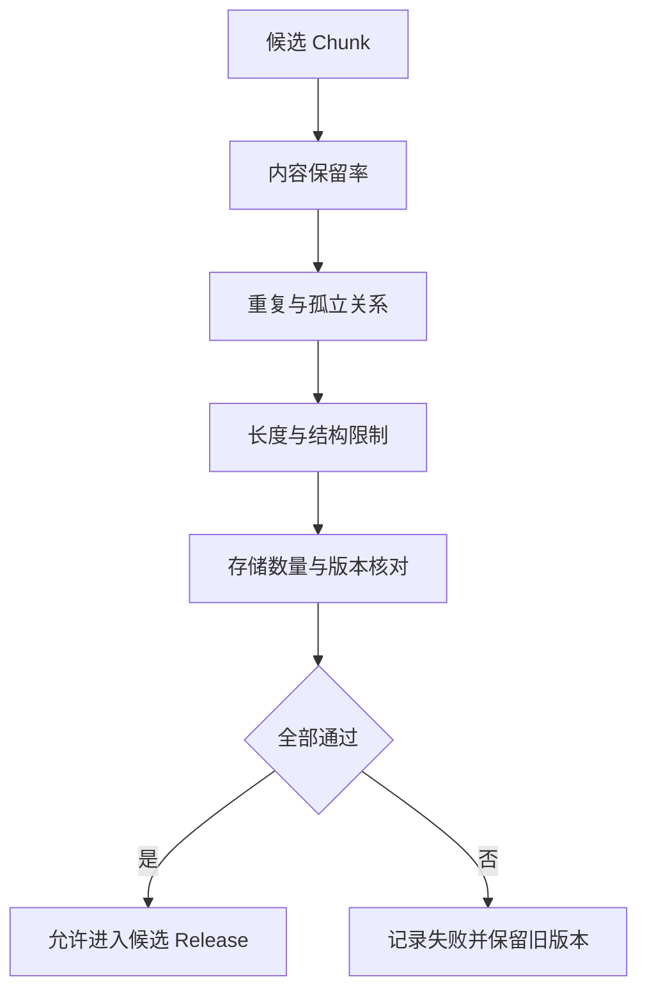

# Chunk 质量门禁与回归检查

切块函数返回了二百个 Chunk，每个都有正文，这批数据可以写入活动索引吗？还不行。标题可能没有进入章节路径，审批表可能少了一列，固定重叠可能制造了大量重复，邻接 ID 也可能指向不存在的旧版本。数量非零只能证明函数产生了对象，不能证明知识被完整、无冲突地保存。

质量门禁位于候选构建和活动版本切换之间。它读取 ParsedDocument、Source、Chunk、向量状态与 Coverage Manifest，验证结构和存储结果；任何不变量失败，事务回滚，新候选保持不可见，旧活动版本继续服务。门禁本身不修复内容，也不调用模型判断“看起来差不多”。

本文用远程访问制度的一次更新做诊断。旧版本可以正常回答，新版本增加一张生产权限表。候选构建后出现三个症状：召回里同一句话重复，表格编号查不到，一次邻接扩展返回空。我们会从 Coverage 和候选记录定位原因，再验证修复没有改变旧版本的活动指针。



## 门禁先检查候选是否具备可验证条件

没有 Chunk 的文档版本不能激活。空结果可能来自空文档、解析失败、Block 状态机异常或全部内容被过滤，任何一种都需要回到对应阶段处理。创建一个内容为空的“成功版本”会让新 Release 覆盖旧知识，用户只看到突然查不到。

每个 Chunk 在写入候选区前还要具备可用向量状态。配套实现要求索引状态为 ready，Embedding 维度与配置一致。向量列表为空、维度错误或只有一部分 Chunk 完成，都在数据库事务前拒绝。这样不会把“文本已写入但向量尚未齐全”的半成品暴露给在线查询。

版本与权限快照同样属于前置条件。任务开始时固定 Document Version、Index Version、Release、Source Version 和可见范围；激活前再次确认目标 Release 仍是当前发布候选。用户已经发布更新版本或撤回来源时，迟到任务以 stale 结束，不能覆盖新状态。

门禁输入要明确来源。Coverage 由当前 Chunker 产生，Chunk 集合属于同一版本，Embedding 模型和维度来自本次配置。允许调用方提交任意 Coverage 数字，会让统计和实际存储脱节，因此数据库写入后还要反查 Source、Chunk 与向量数量。

```text
构建 Chunk
  -> 生成 Embedding
  -> 内存质量检查
  -> 写入候选版本
  -> 数据库数量与状态检查
  -> 原子激活
```

内存检查可以更早失败，节省写库成本；数据库检查证明实际落盘与内存预期一致。两层不是重复。批量写入中途丢失一批数据，内存 Coverage 仍然正确，只有落盘核对能发现。
## 内容保留率检查原文有没有消失

保留率先把源内容拆成可比较单元。标题在 Chunk 的 section path 中查找；段落、列表和代码按语义单元在叶子正文中查找；表格把表头和每个非空单元格分别检查，目标范围包括 Chunk content、table headers 与 structured fields。匹配前只做空白与 Markdown 符号等确定性规范化。

配套实现将最低保留率设为 0.98。这个值表示最多允许少量非关键规范差异，不代表任何文档丢 2% 都安全。一份两百页手册漏掉少量页脚可能无影响，一张十行权限表漏一个单元格就可能改变结论。通用比例必须与必需 Source、关键字段和业务样本一起使用。

若保留率下降，先按 Source 和 Block 类型定位。标题丢失通常来自状态机或解析样式；普通正文缺失可能是超长切分、缓冲区刷新或空白规范化；表格字段缺失要查矩形化、重复行去重与列映射。直接调低阈值只会把上游错误带进索引。

保留率也会出现假通过。同一句原文被复制到多个 Chunk，所有内容单元都能找到，比例仍是 1；表格退化成连续文本，单元格文字仍在，结构含义却丢了。因此还要检查重复、结构计数和字段断言。

测试用例应包含一条只出现一次的关键短语，故意让 Chunker 丢弃，确认门禁失败并指出 Source；再让普通标点或 Markdown 转义变化，确认规范化不会制造误报。对 OCR 内容要使用人工标注的关键字段，不能把 OCR 错字原样保留当成质量通过。
## 重复 Chunk 会制造虚假的召回信心

重复检测使用 Source Version、Chunk 类型和内容哈希。相同 Source、相同类型、相同正文再次出现，通常来自解析器复读、固定重叠、重复表头或重试写入。候选集合中出现一次就累计问题，门禁要求为零。

相同正文出现在不同 Source 不一定错误。公司规范可能被多个附件引用，两个租户也可能有相同模板；相同正文分别作为 table full 和 table row 也属于两种视图。重复键带 Source Version 与类型，避免把这些合法情况全部合并。

重复的后果不只是多占存储。向量检索可能返回三个几乎相同候选，RRF 和 Rerank 给它们多个位置，Evidence 预算被同一句话占满。最终答案看起来有多条证据，实际都来自一处，来源多样性被高估。

看到重复计数先查看内容来源。解析输出已经重复，修解析器；Chunker 的重叠造成，调整策略或去重；数据库出现相同版本同 ID 冲突，修幂等和唯一约束。不能在查询阶段简单 `DISTINCT content`，因为那会掩盖候选版本的错误，也可能合并不同来源。

表格重复要结合业务语义。规范化可以删除跨页重复表头和规则表的完全重复行，交易明细却不能按内容去重。门禁发现重复后，应由表格 Schema 决定保留并赋予独立行身份，或者确认它是解析噪声。自动删除所有重复会让数据守恒无法验证。

回归测试固定一份无重复语料，开启重叠策略后应触发重复计数；修复后计数归零，Recall 也要重新比较。只证明重复率下降不够，去重可能连必要邻接内容一起删掉。
## 孤立链接说明结构图已经断裂

每个 Chunk 可能有 section parent、previous 和 next 三类引用。门禁收集当前候选版本的所有 Chunk ID，逐项确认非空引用确实存在。任何目标缺失都计为 orphan link，并阻止激活。

存在目标还不够。previous 与 next 应互相对称，并留在同一个 Source Version；子 Chunk 的 parent 要么为空，要么指向对应章节父 Chunk；父 Chunk 的上级也要与 section path 一致。配套最小计数只检查目标存在，更严格的图不变量需要额外测试。

孤立常由生成顺序和 ID 变化造成。先写邻接再过滤空 Chunk，引用会指向被删除节点；父 ID 算法和叶子使用不同版本，子节点找不到父；局部重建只替换部分 Chunk，旧邻接仍指向上一版本。修复应在全部叶子确定后统一写邻接，并让 ID 生成共享版本快照。

线上症状通常是命中正文后补不到前后文，或者父章节展开为空。查询层可以在缺邻居时降级为只用当前 Chunk，却不应让候选发布时带着已知断链。降级负责短暂运行异常，门禁负责阻止确定的数据错误。

测试构造三个叶子，断言首尾空引用和中间双向引用；删除中间节点但保留引用，门禁必须失败；再构造附件 Source，确认主文末尾不会连到附件开头。更换版本时，新旧 ID 不能交叉。
## 超限 Chunk 会把问题推迟到模型调用

离线 Chunk `content` 超过最大长度，说明切块兜底失效。它可能在 Embedding 时被 SDK 截断，也可能在上下文装配时占满预算。门禁直接统计超限 Chunk，任何一个都不允许发布。

长度检查不能只看 content。Embedding 文本会加文档标题、Source 标题和 section path，answer content 也可能附带表头。生产门禁应分别检查这些字段的字符与目标 tokenizer 估算，并为系统提示、查询和其他 Evidence 留出预算。

超长代码要补围栏后切分，超长表格片段重复表头后切分，单个异常长单元才按字符兜底。若一个表头自身就超过上限，表格 Schema 需要选择用于表示的列，不能无限缩小正文。每种超限都保留 Block 类型和 Source，便于回到正确组件修复。

Chunk 过短虽然不违反硬上限，也可能影响质量。大量只含标题或几个字的叶子会增加索引噪声。可以监控长度分布和空标题比例，用回归阈值发现突变；是否停止发布要结合语料和评测，不能设一个全局最短字数删掉编号行。

故障测试制造 1801 字的正文并绕过切分，期望 oversized 计数为一；正常 Chunker 应将它拆到上限内。再测试 Embedding 前缀过长，确认第二层 Token 检查能发现仅 content 检查不到的溢出。
## 数据库核对证明候选真正写完整

候选数据写入数据库后，Repository 统计 Source Version 数、Chunk 数、具有 ready 向量的 Chunk 数，并与 Manifest、内存 Chunk 集合和 Coverage 的数量比较。四项应一致。任何一项偏差都抛出 staging validation error。

Source 数少了，可能是批量写入失败或 Manifest 关联丢失；Chunk 数少了，可能是插入冲突或事务异常；向量数少了，说明部分 Embedding 未写入或状态错误；Coverage chunk count 不同，说明调用方提交的统计不是当前集合。错误消息应分别展示实际值与期望值，排障不用从“候选无效”重新猜。

候选写入、验证与激活位于同一事务。验证失败会回滚刚才插入的文档版本、Source Version 和 Chunk，活动指针仍指向旧版本。集成测试故意把 Coverage chunk count 加一，预期新版本记录数为零，旧指针不变；用正确 Coverage 重试后才激活新版本。

并发激活需要按文档加事务锁。同一文档两个候选同时提交时，版本号、活动指针和旧 Chunk 失活不能交叉。锁内再次检查版本重放与 Release 新鲜度，迟到任务不会覆盖刚激活的新版本。

数据库返回成功也不能略过领域检查。当前 Release 已过期、权限快照不一致或 Source 撤回时，数量全部正确仍然不能激活。结构完整与业务可发布是两组条件，事务要同时满足。
## 失败记录不能覆盖仍然可用的旧版本

首次入库失败时，文档没有活动版本，状态可以标为 failed，保存截断后的错误信息供用户查看。已有活动版本的更新失败，旧版本继续提供服务，失败只记录在新任务或索引错误字段，不能把整个文档状态改成不可用。

错误字符串要限制长度，避免数据库和日志被第三方异常填满；敏感正文、向量和凭证不进入消息。稳定错误类、阶段、Source、版本、可重试性和 Coverage 摘要分别保存，界面再按权限读取细节。

质量错误通常不应盲目重试。相同输入与配置再次运行，重复、孤立和保留率仍会失败。只有依赖超时、临时数据库错误或已切换构建版本时才重试。重试沿用任务身份或创建明确新尝试，不能生成多个并行候选争夺激活。

部分写入由事务回滚；事务外的对象、Embedding API 调用或临时文件需要幂等清理。清理失败不会让候选激活，但要保留待回收状态。系统不能因为核心数据库回滚，就宣称所有外部资源已经不存在。

失败样本应进入回归语料。保留原始对象引用、解析器与 Chunker 版本、匿名化的结构摘要和预期失败类。不要把包含私密正文的整个调试包复制到公共测试仓库。
## 一次候选失败怎样定位到切块根因

新制度版本构建出 84 个 Chunk，Coverage 保留率为 1，数据库 Source、Chunk 与向量数量一致，看起来已经完整。在线预览却显示相同审批句三次，编号 RA-204 查不到，补邻居时得到空结果。门禁仍然失败，因为 duplicate 为二、orphan 为一。

先查重复的两个内容哈希。它们都来自同一 Source、同一 paragraph 类型，section path 相同，说明解析或重叠复读，不是合法多来源。回看 Block 序列发现固定重叠把上一块结尾复制到下一块。关闭无依据的重叠并保留邻接后，重复计数归零。

编号查不到却没有降低保留率，因为 RA-204 仍存在于退化后的普通文本。结构计数显示新版本 table rows 为零，旧版本为六。原因是 Markdown 表格分隔行在解析中被改坏，表格没有进入 structured fields 和 exact terms。修复分隔行识别并重新构建，行级 Chunk 恢复。

orphan 记录指向一个 section parent。父 ID 生成使用新版本，叶子仍携带上一次局部重建的旧 ID。修复为全候选版本统一构建父子关系，并禁止跨版本部分覆盖。图测试确认每个非空 parent 都存在。

修复后重新运行同一输入，Coverage 保留率仍为 1，表格行数恢复，duplicate、orphan、oversized 都为零，落盘数量一致。集成测试确认旧活动版本在失败期间未变，新候选通过后才切换。编号查询与邻接补全作为检索回归再次通过。

这条证据链从症状到 Coverage，再到 Block、Chunk 与数据库状态。若一开始只增加 Top K，重复结果会更多，编号仍没有结构字段，孤立邻接也不会自动修复。
## 回归快照要比较变化，不只看是否通过

每个候选版本保存结构快照：Source 数、标题、段落、列表、表格、行、单元格、代码、链接、可见字符、Chunk 数、保留单元、重复、孤立和超限。新旧版本对比能发现解析器与 Chunker 升级带来的突变。

合理变化需要解释。文档新增一张表，table count 与 Chunk 数上升正常；只改一行文字，却让所有表格归零，应该阻止发布。快照规则可以设置相对阈值，但关键结构使用硬断言。没有上下文的全局百分比容易误报大文档，也会漏掉小表中的关键损失。

结构回归之外还有检索回归。固定问题记录期望 Source、关键字段与禁止来源，比较 candidate recall、MRR、nDCG、Evidence 覆盖和上下文重复。结构门禁通过，只说明数据没有明显损坏；检索评测证明 Chunk 形状适合真实查询。

安全回归单独处理。ACL、Release、撤回和租户隔离不能用平均召回分抵消，任何越权候选都停止发布。邻接、父 Chunk 与缓存展开后再次检查权限，因为派生关系也可能跨错版本。

快照要带语料版本、解析器版本、Chunker 版本、Embedding 版本和查询集版本。否则结果变好时无法知道是文本、切块还是模型变化。没有执行在线模型测试时，只报告离线结构和本地检索结果，不编造回答质量。
## 门禁代码与测试各自证明什么

单元测试证明确定性构建规则。句子边界、表格字段、代码围栏、ID、父子关系和邻接各有小样本；故障注入直接修改 Coverage 或 Chunk，检查正确错误类。它们运行快，适合每次提交。

服务测试用 Fake Embedding 固定 1024 维向量，验证正常调用一次、相同版本重放跳过 Embedding、Embedding 超时记录失败且不激活。Fake 结果只证明本地控制流，不证明真实模型的向量质量。

数据库集成测试连接隔离 Schema，证明批量写入、数量核对、事务回滚、活动指针、版本重放和并发锁。它会创建测试数据并在结束时清理，不能连接生产数据库。测试开关没有启用时应明确标记 skipped，不能在文章里写成已通过。

检索回归在已激活的候选索引或隔离索引上运行，验证问题能命中期望 Evidence。视觉与端到端测试再检查失败状态、旧版本可用和错误说明。不同测试层覆盖不同事实，不需要把所有内容塞进一个耗时用例。

门禁本身也要防回归。阈值调整、规范化规则变化和新 Chunk 类型都需要样本。新增类型没有加入保留率 haystack，可能让合法内容全部误判丢失；规范化过强则可能让不同编号看成相同。质量代码与业务代码一样需要版本和审查。
## 质量门禁不能替代内容正确性

保留率 1、没有重复、链接完整、长度合规，仍可能是一份解析错误但内部自洽的文档。OCR 把 RA-204 识别成 RA-2044，所有派生数据会忠实保留错字。关键事实需要带标注样本、原页定位或人工复核。

门禁也不证明向量召回、Rerank 和答案生成正确。它保护离线数据不以已知损坏状态上线，后续还要做[Embedding 表示边界](/docs/ai-agent/embedding-representation-boundaries)、检索评测和 Claim 验证。每层只对自己能观察的事实负责。

真正有用的门禁会阻止发布，并留下能行动的证据。一个只有“质量分 82”的系统无法告诉开发者该修解析器、表格结构还是邻接；结构计数、Source 定位、错误类和活动版本结果才能完成回归。
## 硬门禁与软告警需要分开处理

所有异常都阻止发布，团队很快会把门禁关掉。把一张表少了一个可选脚注和跨租户来源泄漏放在同一列错误里，修复顺序也会被打乱。质量检查应该先按后果分级，再决定候选能不能继续。

硬门禁处理会改变答案或访问范围的情况：关键字段丢失、Chunk 超过上限、邻接跨版本、向量维度不一致、候选版本没有可见范围、活动指针指向未完成的索引。它们一旦出现，构建任务结束为 failed 或 blocked，不能让查询端自行猜测如何补救。

软告警用于暂时不影响确定性正确性的变化。比如某类文档的短 Chunk 比例上升、OCR 页面出现一个低置信字符、段落长度分布和上一次不同。告警仍要带 Source、解析器版本和变化量，发布后由负责人查看。软告警不能掩盖安全问题，ACL、Release 和租户边界永远按硬门禁处理。

分级还要考虑文档用途。合规制度、权限表和接口契约通常没有可选字段，任何关键单元格缺失都停止；产品说明可以容忍页脚变化，但仍要检查标题和版本号。阈值写在文档类型的配置里，并随配置版本进入候选快照，不能让操作者在页面上临时调低数值后重新点击发布。
## 阈值配置要能解释，而不是只剩一个分数

同一个 0.98 保留率对长篇手册和三行配置表的含义不同。门禁输入除了比例，还应保存必需字段集合、允许缺失的 Block 类型、最大内容长度、重复键范围和邻接不变量。报告显示“哪一类单元缺了几个”，读者才能判断是规范化差异还是解析错误。

阈值变更必须经过一组固定语料。先运行旧配置得到快照，再用新配置运行同一输入，比较失败类和候选结构。如果只是把 0.98 改成 0.95，旧的丢失样本仍应失败，除非维护者明确说明这些单元不再属于必需内容。配置版本不变而门禁结果改变，通常说明实现发生了未登记的回归。

告警阈值也不宜直接按全站平均值设定。法律文档、扫描 PDF、表格密集的财务文档各自形成基线，基线只用于发现突变，不用于把异常平均掉。新文档类型没有基线时，先使用保守硬门禁建立样本，积累足够的通过与失败记录后再把部分指标降为告警。
## 离线快照和运行时指标回答不同问题

离线快照描述候选构建当时的内容状态，包括解析版本、Block 数、Chunk 数、保留单元、重复、孤立、超限、Embedding 版本和查询集版本。它用于决定是否激活，也用于解释一次重新索引为什么和上次不同。

运行时指标观察活动版本被查询时的行为，例如某类查询的空结果比例、邻接补全失败数、权限过滤后的候选数、缓存命中和检索超时。它们不能反过来证明候选在构建时没有丢字段。活动版本的空结果升高，可能是查询改写变化，也可能是新文档本身没有覆盖问题，必须把请求 Trace 与候选快照放在一起看。

两类数据的时间和身份要对得上。运行时事件记录 Release、Index Version、查询范围和过滤策略，离线快照记录相同的版本键。没有版本键的“最近一小时召回下降”无法判断是否刚切换了候选，也无法决定回滚哪个版本。指标聚合可以隐藏单租户越权，因此安全事件保留逐条证据，不只看百分位。
## 失败后的责任链要回到正确的组件

门禁报出保留率失败，不代表负责发布的人要手工改 Chunk。解析器负责把源文件变成 Block，Chunker 负责边界和关系，Embedding 适配器负责模型与维度，Repository 负责幂等写入，发布服务负责版本锁和活动指针。错误记录应包含阶段和组件版本，值班人员按它分派，而不是在查询端追加更多结果。

修复完成后不能只重跑最后一步。解析器变更要从原始对象重新生成 Block，Chunker 变更要重新计算邻接和 ID，Embedding 模型变更要按新模型生成全部向量，权限或 Release 变更要重建对应快照。复用旧的派生数据必须满足版本键和内容哈希都未改变，否则会把旧错误带回候选。

重新激活采用同一条候选链路。新任务创建候选版本，完成内容、结构、向量和权限检查，再在事务里切换活动指针。旧活动版本在新候选失败期间继续服务；新候选通过后，查询缓存按版本失效，异步清理旧对象与临时向量。清理任务失败要单独记录，不能回滚已经通过验证的活动指针，也不能把未清理的对象误判成用户可见数据。

一条完整的回归记录至少包括原始失败类、修复组件、输入版本、门禁差异、检索问题集、权限反例和回滚结果。只有“任务成功”没有告诉人修复是否覆盖同类问题。把失败样本匿名化后纳入固定语料，下一次解析器升级先跑它，才不会重复交学费。
## 门禁要检查信息损失而非长度

Chunk 质量不等于平均字符数。门禁要比较标题和正文覆盖、表头与行关系、代码完整性、邻接可达性、重复率、超限比例和来源定位。指标异常时保留失败样本，便于定位解析器还是切块器的责任。

候选版本未通过门禁时不可激活。在线空结果、引用定位失败和权限过滤异常都要回写到回归集，不能只看离线切块数量。
