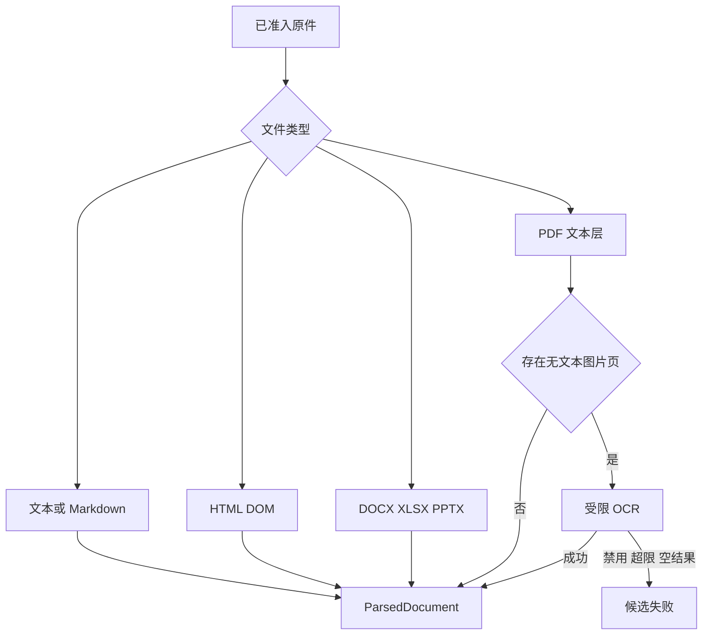

# 多格式文档解析与 OCR

解析器的工作不只是把文件转成字符串。它要尽量保住标题层级、段落顺序、列表、代码、表格、页码和原始来源，还要把确实丢掉的部分记录下来。若 DOCX 中的图片没有识别、XLSX 因行数上限被截断、PDF 某页只有扫描图，解析结果仍然返回一段文字，却已经不再代表完整原文。

RAG 后面的切块、Embedding 和检索都依赖解析结果。这里遗漏一张关键表，向量模型不可能把它补回来；页序错了，检索器只会更稳定地召回错误上下文；扫描页被当成空白页，最终答案很可能用其余材料猜一个看似合理的结论。因此，多格式解析需要同时输出内容和损失说明，调用方再按任务要求决定继续、人工复核或停止发布。

本文继续使用上一节准入后的制度文档。它有五页：前两页是可复制正文，第三页含一张审批条件表，第四页是扫描页，第五页只有装饰图片。我们会跟踪每个格式分支的输入、统一输出、警告、OCR 决策和失败结果，再用回归样本检查解析器升级有没有悄悄改变知识含义。



解析分支最后都要回到同一个 `ParsedDocument` 合同。OCR 只补齐被证据标记为缺失的页面，不能绕过准入、覆盖原始 PDF，或把空结果当成成功。

## 统一输出先承认格式之间并不等价

Markdown 本来就有标题和代码围栏，HTML 有 DOM，DOCX 用样式表达标题，XLSX 的核心是单元格网格，PPTX 依赖页面和图形位置，PDF 更接近固定版面。强行把它们映射成完全相同的数据结构，会丢掉每种格式独有的信息；让每个解析器返回任意对象，又会让下游写满格式分支。

折中的合同可以包含五项：供切块使用的规范文本、供界面展示的文本、格式相关结构字段、解析警告和解析器版本。规范文本使用 Markdown 风格表达标题、列表、代码与表格，便于后续统一切块；结构字段保留页数、表格数、工作表名称或扫描页编号；警告说明已知损失；版本用于重建和回归。

```python
from dataclasses import dataclass, field
from typing import Any


@dataclass(frozen=True)
class ParsedDocument:
    content: str
    display_content: str
    structured: dict[str, Any] = field(default_factory=dict)
    warnings: tuple[str, ...] = ()
    parser_version: str = "structured-v1"
```

这个合同不包含用户权限，也不决定文档能否发布。权限和目标 Release 已经由上传与 Manifest 固定，解析器只处理当前原件。它也没有直接输出最终 Chunk。解析后的内容会先进入下一篇的 Block 文档模型，再由切块器决定边界。把“解析结果”和“可检索索引”分开，才能在切块规则变化时复用原件并重新构建。

输出大小必须受限。解析一个压缩率很高或结构异常的文档，可能产生数百万字符。配套实现把规范文本限制在五百万字符，超过时截断并写入 `parsed_content_truncated`。这个限制保护进程，却不意味着截断后的文档适合发布。发布门禁要结合关键章节和内容保留率判断，不能把警告当成普通日志后忽略。

解析器选择以准入层确认过的类型为基础。扩展名仍可用于路由，但 PDF、图片和 Office 容器的真实性已经在上一层核对。旧版 `.doc`、`.xls`、`.ppt` 与 OOXML 不是同一种格式；没有可靠转换器时，应要求先转换，而不是拿现代库强行打开后产出残缺内容。

## 文本与 Markdown 先解决编码和换行

纯文本看起来最简单，真实文件却可能带 UTF-8 BOM、使用 GB18030，或者包含混合换行。解析器可以依次尝试 `utf-8-sig`、`utf-8` 和 `gb18030`，都失败后才用替换字符解码，并把 `\r\n` 统一成 `\n`。如果产品需要严格保真，最后一步还应增加编码警告，因为替换字符表示原字节已经无法恢复。

Markdown 的标题、列表和代码围栏应原样保留，不要先渲染成 HTML 再抽文字。代码里的缩进、管道符和反引号参与语义，删掉后会影响技术文档检索。CSV 虽然可以先按文本接收，后续如果需要按列精确查询，应该转入表格解析路径，不能仅靠逗号分割。字段里可能包含换行、引号和逗号，手写 `split(',')` 很快会出错。

规范化要克制。去除首尾空白和统一换行通常安全；自动改标题级别、纠正标点或翻译字段名会改变原文。解析层只恢复结构，不润色内容。需要为搜索增加同义词或别名，应在索引表示层保留独立字段，不能覆盖展示文本。

文本文件也可能是空的。空原件在准入层已经拒绝，但解码后只有 BOM 或空白仍会得到空内容。解析器要返回明确错误或内容为空警告，发布门禁随后失败。直接生成一个零 Chunk 的成功版本，会让用户误以为新文档已经替换旧文档。

## HTML 要按 DOM 取内容，不能用正则删标签

HTML 的可见文字与源代码不同。`script`、`style`、`noscript` 和 `template` 通常不属于知识正文，应在遍历前移除。正文按 `h1` 到 `h6`、段落、列表项、预格式文本和表格提取。标题转成对应级别的 Markdown，列表保留项目符号，`pre` 保留代码围栏，链接则把标签和地址一起留下。

遍历 DOM 时要防止重复。表格单元格内部可能含段落，列表项内部也可能有 `p`。若既收父节点又收子节点，同一句话会出现两遍，后续重复 Chunk 检查才发现问题。解析器可以跳过表格内的普通元素，也不再单独收集列表项内部的段落。

表格先读取每个 `tr` 中的 `th` 和 `td`，补齐成矩形，再渲染为 Markdown 表格。单元格中的换行换成 `<br>`，管道符转义。若第一行没有表头，可以生成中性的列名，但要在结构字段中说明表头是推断值。复杂的 `rowspan`、`colspan`、嵌套表格和脚本生成内容无法靠这一版简单解析完整，相关文档需要更专门的浏览器渲染或表格模型。

一个常见失败是把抓取到的整站导航、页脚和正文一起入库。通用 DOM 解析器并不知道哪个容器是主内容，产品应在采集层提供站点规则或正文选择器，并把最终 URL 与选择器版本写入来源记录。解析器可以稳定处理给定 HTML，却不能凭空知道页面业务语义。

本例若另有一份 HTML 附件，解析输出会保留页面标题、一组标题段落和表格数量。`href` 只作为来源内容保存，不会在解析阶段自动访问。否则一个文档就能触发无界爬取，还会把远程 URL 的授权和 SSRF 问题重新带进解析器。

## DOCX 按文档顺序读取段落与表格

DOCX 不是一组 XML 文件的简单拼接。成熟库能够按正文顺序迭代段落和表格，解析器再根据样式名称识别标题与列表。`Heading 2` 或本地化的“标题 2”可以映射为二级标题，普通段落保留文本，列表样式转成项目符号，表格按行列抽取。

按对象顺序读取很重要。若先收集所有段落，再收集所有表格，原文中夹在两个章节之间的审批表会被移动到文末。检索命中表格时就失去了所属章节，后续父 Chunk 和邻接补全也无法修复。标题样式不规范的文档仍可能识别失败，这属于源文档质量问题，需要警告或人工规则，不能只凭字号猜测所有标题。

嵌入图片是明确的损失点。当前通用 DOCX 分支能统计内嵌图片数量，却没有对它们逐张 OCR，因此输出应带 `embedded_images_not_ocr_processed`。文档只有装饰 Logo 时可以带警告继续，图片包含流程图或扫描表格时则可能缺少关键事实。是否发布由 Manifest 或业务策略判断，解析器不应把“发现图片”和“图片不重要”混成一个结论。

批注、修订、页眉页脚、文本框和嵌入对象也需要单独评估。通用解析器没有提取它们时，应在支持矩阵里写清，不要用“支持 DOCX”概括成完整保真。对制度和合同类资料，修订状态尤其重要，读取了被删除文本会直接改变答案。

## XLSX 与 PPTX 要保留各自的空间结构

XLSX 的自然单位是工作表和行。解析器以只读模式打开工作簿，每个工作表先输出一个标题，再读取限定数量的行和列，把尾部空单元格去掉并补齐矩形。配套实现每张表最多读取一万行、一百列，超过行数时记录具体工作表的截断警告。限制应由配置和业务样本决定，不能假装超出的数据不存在。

是否读取公式值要提前决定。`data_only=False` 会保留公式表达式，适合让读者看到规则；`data_only=True` 依赖文件里缓存的计算值，缓存可能过期。需要同时支持时，可以把公式与显示值放在不同结构字段中。金额、日期、合并单元格和隐藏行也不能简单转成字符串后就宣称语义完整，精确表格检索应保留原始坐标和单元格类型。

PPTX 的自然单位是幻灯片。每页先取标题，再按形状的上边和左边排序，处理表格与文本框。排序只能近似阅读顺序，多栏版式、箭头连接和重叠图层仍可能错位。图片数量应进入警告，因为图片中的架构图和截图没有被通用文本分支识别。

演示文稿里同样一句话可能同时出现在标题、正文和备注中。决定是否读取备注之前，要确认它是对外内容还是演讲者私有提示。通用解析器若只处理页面形状，就要把备注不在支持范围写清楚。解析层的职责是诚实描述自己拿到了什么，而不是让一个“格式已支持”的布尔值掩盖信息缺口。

本例中的审批条件表若来自 XLSX，测试应断言工作表名、表头、关键业务编号和公式是否按约定保留。若来自 PPTX，则至少断言页标题、文本顺序和表格字段。只比较输出字符数无法发现列错位。

## PDF 先读文本层，再定位需要 OCR 的页面

PDF 保存的是页面上的绘制对象，未必有段落和标题语义。文本型 PDF 可以逐页提取文字，并在规范文本中加入稳定的 `Page N` 标记。页码是后续引用和回归的重要锚点，不能为了让文本更像普通 Markdown 而删掉。

页面内的阅读顺序通常需要根据文本块坐标恢复。一个可用的最小实现读取文本 span，按解析库提供的行顺序组合，再用字号做保守标题推断。例如某行字号达到页面正文中位数的 1.45 倍、文本又不超过 120 个字符时，将它标为小标题。这只是启发式，不是 PDF 标准。双栏论文、竖排文字、页眉页脚和浮动文本都可能让顺序错误。

表格检测也应与普通正文分开。解析库找到表格后，提取行列并转成矩形结构；检测函数抛错时保留页面正文，同时记录 `pdf_table_detection_failed:page:N`。警告要带页码，后续才能判断失败页是否包含关键审批条件。捕获所有异常并返回空表，会让库升级造成的系统错误也被当成普通识别不足。

扫描页的判定基于可观察证据：页面没有可用文本，却含有图片。这样的页码进入 `ocr_required_pages`，解析结果同时写入警告。没有文本也没有图片的真正空白页不必调用 OCR。只看整份 PDF 的字符数会漏掉混合文档，因为前几页的文本足以让总字符数看起来正常。

PDF 有图片也不一定需要 OCR。文本型页面可能包含 Logo、图表或背景图，只要文本层存在，最小实现不会自动识别图片。对于图表密集资料，可以额外配置视觉解析策略，但那是更高成本的分支，需要独立评测，不能在所有页面默认开启。

## OCR 是受限的页面补全，不是第二个解析器

OCR 服务先运行普通 PDF 解析，只有 `ocr_required_pages` 非空才启动。它检查功能是否启用、待识别页数是否超过配置上限，然后按指定 DPI 将这些页渲染成 PNG。DPI 有一个合理下限，太低会损失小字；继续提高又会增加图片体积、模型成本和处理时间。配套实现把最低值限制为 96 DPI，生产配置仍要用代表性文档评测。

每一页 OCR 返回的文本插入原有 `Page N` 标记之后。成功页写入 `ocr_applied_pages`，原来的 required 警告被替换为 applied 记录，解析器版本追加 OCR 适配器版本。这样同一原件在 OCR 模型或提示变化后可以重新构建，也能解释为什么两个索引版本的文字不同。

OCR 输出是一份派生文本，不会覆盖原始 PDF。它可能错认编号、合并表格列或改变阅读顺序，仍要经过结构检查和关键字段回归。对于需要精确引用的表格，可以保存页图位置或单元格证据，让答案引用回原页，而不是只留下模型生成的 Markdown。

以下四种情况应失败关闭：OCR 功能被禁用但存在必需页面；待识别页数超过上限；页面无法渲染；OCR 返回空字符串。失败关闭表示候选版本不发布，旧版本继续服务。它不等于删除原件，运维人员仍可更换 OCR 配置后重试同一版本。

```python
async def complete_scanned_pages(parsed, pdf_bytes, ocr, max_pages):
    pages = parsed.structured.get("ocr_required_pages", [])
    if not pages:
        return parsed
    if len(pages) > max_pages:
        raise OCRRequired("too_many_pages")

    images = render_pages(pdf_bytes, pages)
    completed = []
    content = parsed.content
    for page_number in pages:
        image = images.get(page_number)
        if image is None:
            raise OCRRequired(f"render_failed:{page_number}")
        text = (await ocr.read(image)).strip()
        if not text:
            raise OCRRequired(f"empty_result:{page_number}")
        content = insert_after_page_heading(content, page_number, text)
        completed.append(page_number)
    return parsed.with_ocr(content=content, pages=completed)
```

代码在所有页面成功后才返回新结果。若前三页中第二页失败，不应把第一页的局部 OCR 结果当成完整文档发布。需要支持断点续跑时，可以把每页结果保存为候选工件，但最终 ParsedDocument 仍要清楚标注完成集合和缺失集合。

## 一份混合 PDF 怎样走完整链路

输入对象是五页制度 PDF，准入层已经确认类型和对象归属。解析器打开原件，先为每页写入页码标记。第一页、第二页和第三页有文本层，正文按块提取；第三页的表格被识别并转成行列。第四页没有文本但有图片，进入 OCR 列表；第五页没有正文，只含装饰图，最小规则同样会视为 OCR 候选，这时 Manifest 的页面策略可以标明它是否允许跳过。

假设业务要求所有页面完整，OCR 上限是两页，功能已启用。服务将第四、第五页渲染为 PNG。第四页返回审批补充条款，第五页返回空字符串。终态应是解析失败，证据包括原对象键、解析器版本、待识别页 `[4, 5]`、第五页空结果和未发布的候选版本。前三页内容不能绕过失败条件进入活动索引。

把第五页从 Manifest 标为可忽略装饰页后，新的解析任务只要求第四页 OCR。调用顺序是普通解析、渲染第四页、OCR、按页插入、输出结构检查。结果包含五个页码标记、三页文本层内容、第三页表格、第四页识别文字和 `ocr_applied_pages:[4]`。第五页保留页面身份和忽略原因，而不是从文档中无声消失。

正常输出随后交给 Block 构建器。输入是规范文本、页数、表格数、OCR 完成页、警告和解析器版本；状态从 `parsing` 变为 `parsed`；输出仍属于候选版本。若 Block 构建发现页码断裂或关键表为空，会把问题反馈到版本门禁，而不是修改解析器结果掩盖缺失。

这次推演的验证结果不是“返回值非空”。测试要断言第四页 OCR 只调用一次，输入确实是 PNG，识别内容插在第四页标记之后，required 列表清空，applied 列表为 `[4]`，解析器版本发生变化。失败样本则断言空 OCR 抛出明确错误，没有产生可发布 ParsedDocument。

## 解析器版本决定结果能否重建

同一个原始对象换一版解析库，输出可能改变。PDF 文本块排序算法会调整，HTML 正文选择器会增加，DOCX 标题样式映射也可能修复。原件字节没有变化，规范文本、表格数和警告却变了。文档版本若只记录原始哈希，出了问题就无法还原当时的解析结果。

解析身份至少由原件内容身份、解析器版本和配置组成。进入 OCR 分支后，还要加入 OCR 适配器或模型版本、DPI 与页面策略。并不是要把秘密配置或完整提示词写进公开日志，而是保存一个可审计的配置版本。Worker 重试时使用这份快照，不能在任务中途读取“当前最新配置”，否则同一版本的前后页面可能由不同规则处理。

解析器升级适合走候选发布。用固定语料同时运行旧版和新版，比较标题树、页码覆盖、表格结构、关键短语、重复内容与警告差异；然后在真实知识版本上重建候选索引。旧活动版本继续服务，直到候选通过入库质量和检索回归。直接覆盖 ParsedDocument 会让回滚失去原输出，也会让线上引用突然指向另一段文字。

异步任务还要处理过期结果。任务领取时固定原件版本与解析配置，完成前再次确认它仍是目标候选。用户已经上传更新原件，或者管理员撤回了旧版本，迟到的解析结果只能保存为过期记录，不能进入激活事务。取消信号也应在页面渲染和 OCR 调用之间检查，避免已经失去发布资格的任务继续消耗资源。

幂等重放的判断不能只看文件名。相同对象、相同解析版本和相同配置已经有完整结果时，可以复用；OCR 模型、页面策略或解析器版本任一变化，都应生成新的候选输出。复用后仍要重新核对目标权限和 Release，因为解析内容相同不等于发布范围相同。

版本记录让排障有了具体问题：“这份活动索引由哪个解析器生成，第四页是否经过 OCR，当时有哪些警告？”如果只能回答文件上传时间，后面的切块和召回异常就很难定位到解析层。

## Warning 要进入版本记录和发布判断

警告描述已知信息损失，应当使用稳定、可聚合的代码，并携带最小定位信息。例如 `embedded_images_not_ocr_processed:3` 表示三个内嵌图片未处理，`spreadsheet_rows_truncated:配置` 指向具体工作表，`pdf_table_detection_failed:page:3` 指向页面。正文和单元格内容不进入告警标签，避免敏感数据扩散到日志。

不是所有警告都要终止。装饰图片未 OCR 可能允许继续，关键表检测失败通常需要人工复核，解析正文被全局截断则很可能直接失败。规则应由文档类型和 Manifest 声明驱动，解析器只提供证据。把严重程度硬编码在字符串前缀里会让业务范围难以配置，可以在发布策略中维护警告类别与动作。

警告要跟随 Source 版本持久化，并汇总到文档版本。用户查看失败任务时能知道哪份附件、哪个页面或工作表出了问题；重建新解析器版本后，也可以比较同一来源的警告是否减少。若新版本突然没有任何警告，既可能是修复，也可能是检测逻辑坏了，回归不能只把数量下降当成改善。

未知异常与可预期警告也要分开。表格算法明确识别不足可以记 warning，文件损坏、库崩溃或内存错误应让任务失败。把所有异常捕获后返回部分文本，会把系统故障伪装成内容质量问题，既难排障，也可能发布不完整知识。

## 回归测试比较结构，不只比较字符数

解析测试语料需要覆盖每个支持格式，并保存最小但有代表性的结构。Markdown 样本含标题和代码；HTML 含脚本、列表、链接与表格；DOCX 让表格夹在两个章节之间；XLSX 含多工作表、公式、空列和超限行；PPTX 含标题、文本框、表格与图片；PDF 同时包含文本页、表格页、扫描页和空白页。

断言围绕阅读含义建立。标题层级和顺序不能变，表格的行列与关键编号要保留，页码覆盖连续，重复段落数量受控，警告代码和定位符合预期。字符数只作为粗粒度信号，因为把两列拼成一列可能一个字没少，却已经无法回答按字段查询的问题。

OCR 测试用脚本化客户端返回固定 Markdown，证明本地控制流，不证明真实视觉模型的准确率。它应覆盖成功、功能关闭、页数超限、渲染缺页、空输出和调用超时。在线 OCR 另建受控评测集，记录模型版本、DPI、页面类型和人工标注；没有运行证据时不能写“识别率达到某个数”。

资源测试同样必要。解析超大 XLSX 时行列限制应生效，打开文件和工作簿后始终关闭，PDF 渲染的页数只包含 required 集合。并发任务共享 OCR 配额时，超时与取消要传给适配器，不能让请求结束后后台仍继续消耗模型额度。

最后做一次端到端失败注入：让混合 PDF 的 OCR 返回空结果，确认入库服务记录解析失败、Embedding 调用次数为零、活动版本没有切换；修复 OCR 后用同一原件和新解析版本重跑，确认页面结构进入候选区，再由质量门禁决定激活。这个测试把解析质量与发布安全连到了一起。

## 解析边界止于可追踪的文档表示

解析器可以恢复可见结构，不能证明文档事实正确，也不能决定当前用户是否有权读取。OCR 返回“端口 8000”时，这只是一段带页码的候选文字；权限仍来自 Manifest，事实是否能用于回答要等检索、Evidence 和 Claim 验证。

它也不负责语义切块。解析输出里的 Markdown 标题和页码会成为 Block 边界，下一步还要为段落、代码、表格生成稳定 ID，区分展示文本、检索文本与结构字段。提前在解析器里按固定字符数切段，会把格式恢复和检索策略绑在一起，任何 Chunk 参数变化都必须重新解析原件。

对于解析器明确不支持的内容，最诚实的结果是警告或失败。用模型凭上下文补写丢失表格、猜测扫描页内容、根据文件名推断章节，都让来源链断在最前面。后面的 RAG 即使有引用，也只能引用一份被补造过的派生文本。

下一步由[Block 文档模型](/docs/ai-agent/rag-block-document-model)接收 ParsedDocument。它会把页码、标题、正文、代码和表格变成可寻址对象，并保存解析版本与警告，使后续切块和检索仍能回到这次解析的具体位置。
