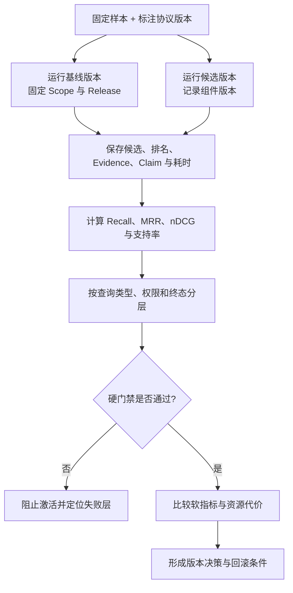

# RAG 评测：Recall@K、MRR、nDCG、答案支持率与延迟

把三个检索结果展示给同事，问“看起来是不是挺相关”，得到的结论无法重放，也无法比较下一个版本。切片、Embedding、索引参数、查询改写、融合和 Reranker 中任何一项变化，都可能让某些问题变好、另一些问题变差。

本篇会从一份最小标注集开始，手工推导 **Recall@K**、MRR 和 nDCG，再用代码计算检索指标、Claim 支持率与延迟汇总。最终你会得到一张能区分“没召回”“排错了”“证据没被使用”和“系统变慢”的版本对照表。

开始前需要理解 Top-K、Evidence、Claim 和知识 Release。评测不要求先有几千条数据，但要求每一条样本的标注含义一致。没有数据时可以写评测计划，不能写“提升 30%”之类没有测量依据的数字。

## 先把 RAG 拆成可定位的四层

| 层 | 输入 | 输出 | 典型指标 |
| --- | --- | --- | --- |
| 数据层 | 文件与解析配置 | 可定位 Chunk | 解析覆盖率、空页率、切片完整性 |
| 检索层 | 问题、Scope、Release | 有序候选 | Recall@K、MRR、**nDCG** |
| 证据层 | 候选与证据目标 | Evidence 包 | 目标覆盖率、引用定位成功率 |
| 答案层 | 问题与 Evidence | Claim、引用、答案 | Claim 支持率、引用准确、拒答正确率 |

端到端“答案对不对”很重要，但单独看它无法定位原因。Recall 低说明正确片段没有进入候选；Recall 高而**答案支持率**低，问题可能在 Rerank、预算、生成或验证。分层指标让修复动作有方向。

## 评测集的一行到底要保存什么

最小样本不只是问题和答案。建议保存：

一条评测样本既要保存问题和相关性标注，也要固定可见范围与知识版本。否则同一问题在不同权限或 Release 下得到不同结果时，指标无法解释差异来源。
```jsonc
{
  // case_id 是回归样本的稳定标识，指标异常时可以回到原问题和标注。
  "case_id": "release-001",
  "question": "发布切流后为什么旧连接仍然存在？",
  "scope_ids": ["public"],
  "release_id": "r8",
  "relevant_chunks": {
    // c-drain 是协议契约的一部分，双方必须使用一致的名称、类型和版本。
    "c-drain": 3,
    "c-reload": 2,
    "c-health": 1
  },
  // required_claims 规定答案必须覆盖的事实槽，用于单独评估证据支持率。
  "required_claims": ["旧连接需要排空", "代理配置需要热加载"],
  "expected_terminal": "answered"
}
```

这是 `jsonc` 示例，所以可以在真实文件中去掉注释或使用支持 JSONC 的解析器。它作为评测器输入，不是执行命令；解析输出应得到一个带 Scope、Release、相关等级、必需 Claim 和预期终态的样本对象，字段缺失或等级越界时直接报契约错误。`relevant_chunks` 的值是相关等级：3 表示直接、完整支持，2 表示支持关键条件，1 表示只提供有用背景，0 或缺失表示不相关。等级定义必须写进标注协议，否则 nDCG 没有可比较性。

`scope_ids` 和 `release_id` 让评测使用与线上相同的权限和知识快照。`required_claims` 用来检查证据和答案覆盖。`expected_terminal` 允许纳入“应该拒答”“应该澄清”和“应该无权”的样本，避免**评测集**只奖励总能回答的系统。

## 标注协议比计算公式更先

至少两类人容易对“相关”产生不同理解：检索工程师认为提到同一主题就相关，答案审核者要求片段能够支持具体 Claim。团队必须先定义：

- 相关性针对整个问题还是某个证据目标；
- 表格行是否必须连同表头才算完整；
- 旧版本文档是否一律不相关；
- 用户无权片段即使内容正确是否记为禁止结果；
- 重复片段如何计数；
- 多个片段共同支持一个 Claim 时怎样标注。

抽取一部分样本让两位标注者独立标注，再讨论分歧。这个过程不需要伪造一个漂亮的一致率数字，但需要保留标注版本和冲突决议。

## Recall@K：相关片段有没有进入候选

Recall@K 的计算是：前 K 个结果命中的相关片段数，除以全部标注相关片段数。

假设相关集合是 `{c-drain, c-reload}`，候选前三名为 `[c-health, c-drain, c-cache]`：

- Recall@1 = 0 / 2 = 0；
- Recall@2 = 1 / 2 = 0.5；
- Recall@3 仍是 1 / 2 = 0.5。

Recall 关心有没有找全，不关心第一个相关结果是第 1 还是第 10。把 K 设置很大通常会提高 Recall，却也增加**延迟**和噪声，所以报告必须写明 K。对于只有一个相关片段的样本，Recall@K 等价于该片段是否进入前 K。

近似向量索引的 Recall 还有另一种用途：把精确扫描 Top-K 当基线，看 HNSW/IVFFlat 是否漏掉基线近邻。这种“索引 Recall”与人工相关性 Recall 不同，报告中要明确参照集合是谁。

## MRR：第一个相关结果来得有多早

Mean Reciprocal Rank 是一组查询的倒数排名平均值。单个查询找到的第一个相关结果排第 `r`，得分是 `1/r`；没有相关结果得 0。

前例第一个相关结果 `c-drain` 排第 2，所以 Reciprocal Rank 是 0.5。另一个查询的第一个相关结果排第 1，得分 1；两条样本的 **MRR** 为 `(0.5 + 1) / 2 = 0.75`。

MRR 只看第一个相关结果，适合“找到一条正确答案就够”的检索。一个结果列表把第一条放对、后面全部错，MRR 仍可能很高，因此多证据问题不能只用 MRR。

## nDCG：多个相关结果的等级和位置都重要

nDCG 适合相关性有等级的场景。先计算 DCG：第 `i` 位结果的收益通常是 `2^rel_i - 1`，再除以 `log2(i + 1)` 的位置折扣。高相关结果越靠前，DCG 越高。随后把实际 DCG 除以理想排序的 IDCG，得到 0 到 1 的归一化结果。

假设等级为 `c-drain=3`、`c-reload=2`、`c-health=1`，实际排名 `[c-health, c-drain, c-reload]`。它找全了三个结果，所以 Recall@3 为 1；但最重要的结果没有在第一位，nDCG 会低于 1。这展示了两个指标的区别：Recall 回答“有没有”，nDCG 回答“高价值结果是否靠前”。

公式中的收益函数并非唯一选择。一旦选定，应随评测协议版本固定，不要为了某次实验临时更换。

## Claim 支持率和引用准确率

检索指标正常，不代表答案可信。需要继续评测：

- **Claim 支持率**：答案中的事实 Claim 有多少被至少一条可见 Evidence 支持；
- **证据目标覆盖率**：计划要求的目标有多少在上下文中有合格 Evidence；
- **引用准确率**：引用位置是否真的支持绑定 Claim，而不只是链接存在；
- **引用定位成功率**：页码、标题路径或行定位是否仍能回到原文；
- **拒答正确率**：无证据、无权限或冲突样本是否正确停止。

“有引用”可以确定性检查 Evidence ID 是否存在；“语义上支持”需要规则、模型评分器和人工抽检结合。安全违规、跨 Scope 引用和不存在的 Evidence ID 应是硬失败，不能被平均分掩盖。

## 延迟要按阶段和分位数观察

平均延迟会隐藏尾部请求。至少记录 P50、P95，必要时 P99，并拆分：查询理解、各检索通道、融合、Rerank、Evidence 装配、生成和验证。还要记录候选数量、输入/输出 Token、模型调用次数和降级状态。

离线评测在同一机器和并发下比较相对变化，线上则要观察真实流量分布。不要把一次本地运行写成吞吐基准，也不要用缓存热数据与冷启动版本直接比较。

## 完整评测数据流



基线和候选必须读取同一批样本与知识快照。`R` 保存原始轨迹，避免只留下汇总分数。`S` 防止整体平均掩盖某类问题退化。硬门禁包括越权证据、错误成功终态和引用不存在；软指标才适合讨论允许的小幅波动与成本取舍。

## 计算检索与答案指标

下面的代码只使用标准库。输入是两个样本的相关性等级、候选排名、Claim 支持状态和阶段耗时；输出是每条样本与总体的 Recall@K、RR、nDCG、支持率和 P50/P95。

```python
# 指标函数从同一标注相关集计算 Recall、首个相关排名与分级排序，不混入生成答案得分。
from __future__ import annotations

import math
from dataclasses import dataclass
from statistics import median

@dataclass(frozen=True)
class EvalCase:
    case_id: str
    relevance: dict[str, int]
    ranked_chunk_ids: tuple[str, ...]
    claim_supported: tuple[bool, ...]
    latency_ms: float

# 这个指标函数只处理已标注的排序或布尔结果，不把生成文本质量混入检索指标。
def recall_at_k(relevance: dict[str, int], ranked: tuple[str, ...], k: int) -> float:
    if k <= 0:
        raise ValueError("k must be positive")
    relevant = {chunk_id for chunk_id, grade in relevance.items() if grade > 0}
    if not relevant:
        return 1.0 if not ranked[:k] else 0.0
    return len(relevant & set(ranked[:k])) / len(relevant)

# 这个指标函数只处理已标注的排序或布尔结果，不把生成文本质量混入检索指标。
def reciprocal_rank(relevance: dict[str, int], ranked: tuple[str, ...]) -> float:
    for position, chunk_id in enumerate(ranked, start=1):
        if relevance.get(chunk_id, 0) > 0:
            return 1 / position
    return 0.0

# 这个指标函数只处理已标注的排序或布尔结果，不把生成文本质量混入检索指标。
def dcg(grades: list[int]) -> float:
    return sum(
        (2**grade - 1) / math.log2(position + 1)
        for position, grade in enumerate(grades, start=1)
    )

# 这个指标函数只处理已标注的排序或布尔结果，不把生成文本质量混入检索指标。
def ndcg_at_k(relevance: dict[str, int], ranked: tuple[str, ...], k: int) -> float:
    actual_grades = [relevance.get(chunk_id, 0) for chunk_id in ranked[:k]]
    ideal_grades = sorted(relevance.values(), reverse=True)[:k]
    ideal = dcg(ideal_grades)
    return dcg(actual_grades) / ideal if ideal > 0 else 1.0

# 这个指标函数只处理已标注的排序或布尔结果，不把生成文本质量混入检索指标。
def support_rate(values: tuple[bool, ...]) -> float:
    return sum(values) / len(values) if values else 1.0

# 这个指标函数只处理已标注的排序或布尔结果，不把生成文本质量混入检索指标。
def percentile(values: list[float], fraction: float) -> float:
    if not values:
        raise ValueError("values cannot be empty")
    ordered = sorted(values)
    index = math.ceil(fraction * len(ordered)) - 1
    return ordered[max(0, index)]

CASES = (
    EvalCase(
        "release-001",
        {"c-drain": 3, "c-reload": 2, "c-health": 1},
        ("c-health", "c-drain", "c-reload"),
        (True, True),
        82.0,
    ),
    EvalCase(
        "error-001",
        {"c-error": 3},
        ("c-noise", "c-error"),
        (True, False),
        121.0,
    ),
)

for case in CASES:
    print(
        case.case_id,
        round(recall_at_k(case.relevance, case.ranked_chunk_ids, 3), 3),
        round(reciprocal_rank(case.relevance, case.ranked_chunk_ids), 3),
        round(ndcg_at_k(case.relevance, case.ranked_chunk_ids, 3), 3),
        round(support_rate(case.claim_supported), 3),
    )

latencies = [case.latency_ms for case in CASES]
print("p50", median(latencies), "p95", percentile(latencies, 0.95))
```

`EvalCase` 把标注、运行结果和答案状态放在同一条记录中，但真实系统还应保存组件版本、Scope、Release 和 Trace ID。`recall_at_k` 明确校验 K，并把“标注无相关资料”的样本当作特殊情况；这类样本更适合结合预期终态评测，不能只看 Recall。

`reciprocal_rank` 找到第一个等级大于 0 的片段就停止。`dcg` 实现带位置折扣的收益，`ndcg_at_k` 用理想等级排序归一化。`support_rate` 统计被支持 Claim 的比例。`percentile` 使用 nearest-rank 方法，样本很少时 P95 只用于展示算法，不应当作性能结论。

调用顺序是逐样本计算指标，再汇总延迟。预期第一条 Recall@3 为 1，但因为最高等级片段不在首位，nDCG 小于 1；第二条 RR 为 0.5 且支持率为 0.5。由此可以判断第二条既有排序问题，也有生成或证据绑定问题。

## 用 pytest 锁定指标定义

运行这段实现后，测试边界和一个手算结果。指标实现很短，但 off-by-one、空标注和对数位置很容易写错。

为了验证“用 pytest 锁定指标定义”，下面的测试把“手算样例固定 K、相关等级和无命中边界，防止指标公式或分母在重构中悄悄变化”变成可执行断言。每个用例自己构造输入，并用断言固定返回值或失败状态；某条测试失败时，可以从用例名直接定位到被破坏的契约。

```python
# 手算样例固定 K、相关等级和无命中边界，防止指标公式或分母在重构中悄悄变化。
import pytest

from rag_eval import ndcg_at_k, recall_at_k, reciprocal_rank, support_rate

# 这个用例用固定样本核对评测指标，避免实现变化悄悄改变分母、排序或通过条件。
def test_recall_uses_only_top_k() -> None:
    relevance = {"a": 1, "b": 1}
    assert recall_at_k(relevance, ("x", "a", "b"), 2) == 0.5

def test_reciprocal_rank_uses_first_relevant_position() -> None:
    assert reciprocal_rank({"a": 1}, ("x", "a", "a")) == 0.5

# 这个用例用固定样本核对评测指标，避免实现变化悄悄改变分母、排序或通过条件。
def test_ideal_ranking_has_perfect_ndcg() -> None:
    relevance = {"a": 3, "b": 2, "c": 1}
    assert ndcg_at_k(relevance, ("a", "b", "c"), 3) == pytest.approx(1.0)

# 这个用例核对证据与引用关系，防止无来源 Claim 被当成已经验证的答案。
def test_support_rate_does_not_hide_unsupported_claim() -> None:
    assert support_rate((True, False)) == 0.5
```

执行 `python -m pytest -q`。四个测试把手算排名、K 和 Claim 状态作为输入，输出分别断言 Recall、RR、理想 nDCG 与支持率；异常 K 和空运行集合还应另写边界测试。这些测试证明代码符合本篇协议，但没有证明标注本身正确。评测代码、标注协议、样本集和知识快照都要有版本，任何一项变化都产生新的运行记录。

## 怎样用指标定位问题

| 观察结果 | 首先检查 | 不要直接下的结论 |
| --- | --- | --- |
| Recall@K 低 | 解析、切片、查询、过滤、Embedding | 生成模型不够强 |
| Recall 高、MRR/nDCG 低 | 重复候选、RRF、Reranker | 向量库不可用 |
| 排序正常、证据目标覆盖低 | 证据预算与选择器 | 应该导入更多资料 |
| Evidence 完整、Claim 支持率低 | 提示、生成、引用绑定、验证器 | 检索策略需要全部重做 |
| 质量不变、P95 上升 | 通道并发、连接池、候选量、模型调用 | 某单个组件一定变慢 |
| 拒答率突然降低 | 终态验证、无证据样本、安全策略 | 用户问题变简单了 |

按问题类型、语言、文档格式、权限范围和预期终态分层。总体 Recall 上升可能掩盖扫描 PDF 问题全部退化，也可能掩盖无权限样本出现严重泄露。

## 候选版本怎样设置门禁

硬门禁适合“不允许用平均值补偿”的风险：越权 Evidence 必须为 0，引用 ID 不存在必须为 0，预期拒答却生成事实答案必须为 0，解析失败页不能比基线增加。任何硬门禁失败都阻止候选 Release 或检索版本激活。

软指标用于取舍：Recall、nDCG、支持率、P95、Token 和成本。团队应提前写下可接受区间和回滚条件，不能看到结果后再挑对候选有利的指标。统计显著性和置信区间在样本扩大后很重要，但小样本阶段至少要展示逐案例差异，而不是只报平均数。

## 建立可以重放的评测记录

每次运行保存：数据集版本、标注协议版本、知识 Release、解析/切片版本、Embedding 与索引版本、查询策略、Reranker、Evidence 策略、生成模型、提示版本和代码提交标识。保存候选 ID、排名、分数、终态和阶段耗时，不必保存无法安全持久化的原始敏感文本。

评测器应调用与线上相同的 Runtime，而不是复制一套简化检索逻辑。否则测试通过的路径和真实请求路径不同，门禁没有意义。

## 一份可直接执行的 RAG 评测清单

1. 写明相关等级、Scope、旧版本、重复片段和无答案样本的标注规则。
2. 固定基线与候选使用的样本、Scope 和知识 Release。
3. 同时评测数据、检索、证据和答案四层。
4. 报告 K、指标公式、聚合方法和样本数量。
5. 保存逐样本轨迹，按查询类型与权限分层。
6. 把越权、错误引用和错误成功终态设为硬门禁。
7. 同时记录 P50/P95、Token、模型调用和降级状态。
8. 没有真实运行结果时只给实验设计，不写虚构提升。

这份评测清单最终得到的是可重放基线：指标、逐样本轨迹、知识快照、策略版本和失败分层都明确，后续索引或 Runtime 变化才能被可靠比较。

## 常见问题

### Recall@K 高，是否说明 RAG 已经很好？

只说明标注相关片段中有多少进入前 K 个候选，不能说明排序、证据完整、引用和答案正确。把 K 设得很大甚至返回全库，Recall 会升高，却会增加延迟和上下文噪声。需要同时看 MRR/nDCG、Evidence 目标覆盖、Claim 支持率、禁止 ID、P95 和成本，并按查询类型分层。Recall 低先查召回链，Recall 高但答案错则应检查排序、选择和生成验证。

### MRR 与 nDCG 应该在什么场景使用？

MRR 只关注第一个相关结果的位置，适合一个关键片段就能回答的问题；nDCG 同时考虑多个结果的相关等级和位置，适合答案需要多份证据或有强弱相关。使用前必须定义相关性等级和 K，并处理无相关结果边界。两者都依赖标注协议，不能拿不同团队定义的“相关”直接比较。报告应同时展示逐样本排名，避免平均值掩盖某类问题全部退化。

### RAG 评测集应该怎样避免只覆盖简单问题？

从真实问题类型分层采样，至少包含精确 ID、同义表达、跨段条件、表格、扫描文档、多跳关系、冲突、无资料、无权限和过期版本；每条保存可信 Scope、Release、Gold Evidence 与预期终态。不要只收集系统已经答对的问法。样本少时先逐条分析，规模扩大后再做统计区间。数据集版本和标注协议版本也要保存，防止“指标提升”其实来自换题。

### 如何区分检索错误和生成错误？

先检查 Gold Evidence 是否进入候选与排名，再检查选择器是否把它升级为 Evidence，最后看每个 Claim 是否被引用支持。Gold 从未召回属于解析、切片、查询、过滤或索引问题；候选存在但未选择属于融合、Rerank 或预算问题；Evidence 完整而答案错误才进入提示、模型、引用绑定与验证器。评测器要保存阶段轨迹，不能只比较最终答案字符串。

### 为什么越权 Evidence 不能被平均指标补偿？

一次越权就是安全边界失败，即使其他一千条 Recall 很高也不能接受。权限样本、无证据却生成事实、引用不存在和跨 Release 混合应设为硬门禁，候选版本直接阻断；Recall、nDCG、延迟和成本才适合用软阈值权衡。报告把硬失败单独列出并保留来源与 Trace，避免一个漂亮总分掩盖严重泄露。

### 离线评测提升后为什么线上仍可能变差？

离线集可能不代表线上分布，线上还有缓存、并发、Deadline、权限变化、模型限流和用户多轮上下文。候选先通过离线门禁，再做小范围影子或 Canary，观察真实查询类型、降级率、P95、成本和用户反馈；同时保持 Champion 可快速切回。线上与离线必须调用同一 Runtime 或共享核心路径，否则测试的是另一套简化实现，提升无法迁移。

### 没有真实基准数据时可以写预计提升多少吗？

不应该。可以完整写实验设计、指标公式、样本构成、硬门禁和执行命令，但不能虚构 Recall、延迟或百分比。先建立少量人工标注集和精确扫描基线，报告逐样本结果与限制；随着样本增加再给统计汇总。明确“尚未测量”比给一个貌似专业的数字更可靠，也能防止团队围绕不存在的收益做架构决策。
