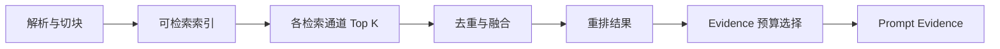

# 用 Recall、MRR 与 nDCG 评估检索

“这个问题能搜到答案”不是可重复的检索评测。搜索的人可能换了关键词，知识库可能切了版本，Top K 也可能从 5 调到 20。没有固定查询、相关证据和运行配置，两次“感觉不错”无法比较。

Recall、MRR 和 nDCG 分别回答三个问题：需要的证据找全了吗，第一条相关结果排在多前面，前排结果的整体顺序是否合理。三个指标看的是同一份排名，却强调不同缺陷，不能互相替代。

这篇用一个小排名手算指标，再扩展到真实 RAG 门禁。查询是“远程访问需要满足哪些条件”，第 7 版知识中有三条相关 Chunk，相关性等级分别为 3、2、1。系统前 5 条依次返回噪声、等级 2、等级 3、越权内容和等级 1。我们先算指标，再判断为什么越权结果不能只当作一个普通的 0 分候选。

## 先确定评测的是对象、Chunk 还是 Evidence

用户要找的是“远程访问规范”时，文档对象命中就可能算成功；用户要回答“设备合规失败后怎样处理”时，只命中文档标题还不够，必须召回包含失败条件的 Chunk。评测单位选错，指标会高估系统能力。

常见的相关性单位有三层：

| 单位 | 适合的问题 | 局限 |
| --- | --- | --- |
| 知识对象 | 是否找到正确文档、需求或任务 | 无法证明具体事实已召回 |
| Chunk | 是否找到包含答案条件的片段 | 切块变化会让 ID 变化 |
| Evidence 原子 | 是否覆盖支持某个 Claim 的最小证据 | 标注成本高，需要稳定来源定位 |

入门评测可以同时保存对象 ID 和来源定位。对象 ID 用来判断检索方向是否正确，文档版本、章节路径和内容哈希用来定位相关 Chunk。切块规则改变后，先按稳定来源重新映射 Gold，再比较新排名，不能把旧 Chunk ID 全部失效当成检索回归。

一个问题可能需要多条证据。比如“远程访问的申请条件和审批失败处理”分别位于两个章节，Gold Set 就有两个 Evidence。只命中其中一个，Hit Rate 可能仍是 1，但 Recall 只有一半。
## Gold Set 必须绑定查询范围和知识版本

一条评测用例至少包含 `query_id`、原始问题、知识范围、Release、主体类型、相关对象、相关 Evidence、相关性等级和禁止来源。检索参数与切块、Embedding、融合和重排版本也要随运行记录保存。

Gold 不能跨版本漂移。第 7 版写“需要设备合规”，第 8 版改成“还需二次审批”，同一个问题在两版中的相关 Evidence 不同。评测旧 Release 时读取第 7 版 Gold，评测当前知识时使用当前 Gold。拿第 7 版标注评第 8 版，会把正确的新结果判错。

权限也是用例的一部分。安全部门成员的 Gold 可以包含受限规范，普通读者的允许集合不能包含它。越权 Chunk 即使语义完全相关，也不能记为相关结果，而要单独触发 `permission_leak`。

空结果用例需要明确原因：知识中确实没有答案、指定范围没有答案、用户无权限、版本投影未就绪，四者的期望终态不同。没有 Gold 的负样本不能把 Recall 记成 1，否则系统返回任意噪声也会获得“满分”。更准确的做法是把 Recall 记为不适用，并检查空结果、拒答或未就绪契约。

### 标注不是一次性的录入工作

Gold Set 决定了什么叫“检索正确”，它需要独立于检索实现维护。标注者先根据原始资料确定哪些事实能回答问题，再记录稳定来源、版本和相关性等级；不能先看当前系统的 Top K，再从这些结果里挑几个作为 Gold。后一种做法会把当前系统的盲区写进评测集，新方案即使找到了更完整的证据，也可能因为“不像旧排名”而被判错。

高风险领域适合使用双人复核。两名标注者分别判断相关 Evidence、等级和禁止来源，分歧交给熟悉原始资料的人裁决。裁决记录要保存问题在哪：是查询含义不清、资料本身冲突、权限口径不同，还是分级指南不够具体。直接取两个等级的平均值会隐藏这些问题，`3` 和 `1` 的平均值 `2` 并不能解释两个人为什么差了两级。

资料发布新版本时，Gold 也要迁移。迁移程序可以按稳定来源 ID、章节路径和内容哈希寻找候选映射，但最终仍要判断事实是否改变。只有排版变化时可以自动继承；条件、数值、责任人或适用范围发生变化，就要生成新的 Gold 版本。旧评测快照继续指向旧 Gold，避免历史报告在后台悄悄改变含义。

::: warning Gold Set 的数据泄漏

不要从待评模型生成的答案反推 Gold，也不要只把线上点踩问题加入评测集。前者会让模型参与制定自己的评分标准，后者带有明显的反馈选择偏差。线上反馈适合发现候选问题，进入 Gold 前仍要回到原始资料核对。

:::
## 查询集要覆盖真实表达和失败边界

评测集只放规范标题，精确通道会很好看，无法反映自然提问。查询来源可以包括已脱敏的真实问题、领域专家编写的关键任务、历史失败样本和针对安全边界设计的反例。

同一知识点可以有几种表达，但不要机械改写几十条近义句。真正有价值的变化包括简称与全称、编号与自然语言、指代、多轮焦点、范围限定、中文数字和错别字。每种变化都要对应真实路由差异。

失败样本同样重要：

- 问题包含正确 Alias，但目标对象不可见。
- 指定旧 Release，当前版本包含更相似的新文本。
- 相关事实位于表格行、代码块或相邻 Chunk。
- 查询同时包含两个对象，需要多条 Evidence。
- 知识库没有答案，模型参数可能知道通用信息。
- 间接提示注入位于高相关文档中。

样本要按主题、查询类型、来源格式、权限、版本和预期通道打标签。最终报告既看总体，也看切片。总体平均上升可能掩盖 PDF OCR、表格或权限样本全部退化。

### 固定回归集与探索集分开维护

同一批开发者反复查看失败用例，再调整查询改写、权重和阈值，方案迟早会适应这批题。即使没有训练模型，这仍然是评测集过拟合。查询从哪个通道进入、某个编号怎样写、哪个 Alias 容易出错，都可能被人手写进规则。固定回归集会越来越好看，新问题却没有同步改善。

评测数据可以分成三部分。开发集允许工程师查看逐条结果，用来定位问题；回归集用于每次提交的稳定比较，修改 Gold 时必须审查版本变化；保留集只在阶段性验收时运行，平时不向调参过程暴露逐题答案。三部分按知识主题、来源格式和风险切片分层抽样，避免保留集碰巧全是简单的标题查询。

线上新失败先进入探索池。来源核对和脱敏完成后，一部分转入开发集，另一部分留给后续保留集。已经驱动过某次修复的样本不能再被当成独立证据，报告应说明它属于已知回归。历史失败仍有价值，它能防止旧问题重新出现，只是不足以证明方案对未知表达也有效。

重复问题需要按语义任务分组后再切分。若“VPN 申请条件”和“怎样申请 VPN”分别落入开发集与保留集，两个集合在文字上不同，背后却依赖同一条 Evidence，保留集就泄漏了。可以用目标对象、Gold Evidence 集合和人工复核共同识别近重复，不能只靠字符串相似度。

评测集也不应只增不减。来源已经下线、业务契约已废弃或查询不再成立时，样本随版本归档，并保留删除理由。为了提高分数而删除难例属于篡改门禁；因为事实已经变化而继续保留旧答案，同样会让指标失真。
## Recall@K 衡量需要的证据找回多少

给定 Gold 集合 (G) 和前 K 条检索结果 (R_K)，Recall@K 是两者交集数量除以 Gold 数量：

```text
Recall@K = |G ∩ R_K| / |G|
```

Gold 有 3 条 Evidence，Top 3 找到其中 2 条，Recall@3 等于 `2 / 3`。它不关心两条相关结果排在第 1 还是第 3，只关心是否进入前 K。

K 要对应下游预算。系统最终只允许 8 条 Evidence 进入 Prompt，却报告 Recall@50，指标无法说明回答层能看到什么。可以同时观察 Recall@5、@10、@20，并把最终选择后的 Recall 单独记录。

对象级 Recall 和 Evidence 级 Recall 应分开。Top 5 命中正确文档，但相关 Chunk 排在该文档第 30 条时，对象召回成功，Evidence 召回失败。这个差异通常指向切块、文档内限额或邻接补全，而不是查询理解。

Recall 高也可能伴随大量噪声。把 K 不断调大，Recall 往往上升，模型上下文和重排成本也会上升。Precision、候选数量和最终 Evidence 预算要一起观察。
## MRR 衡量第一条相关结果出现多早

对单个查询，Reciprocal Rank 是第一条相关结果名次的倒数。第一名相关得 1，第二名得 `1/2`，第五名得 `1/5`，完全没有相关结果得 0。MRR 是所有查询 Reciprocal Rank 的平均。

```text
RR(q) = 1 / rank_first_relevant
MRR = mean(RR(q))
```

示例中第一条相关结果在第 2 位，所以 RR 是 0.5。MRR 很适合导航型问题和只需要一个正确对象的检索，例如按编号找需求或按 Alias 找规范。

MRR 只看第一条相关结果。第 2 位之后是 9 条高质量 Evidence，还是 9 条噪声，分数都一样。因此多证据问题不能只用 MRR。它也不区分相关程度，只要标为相关就停止。

若 Gold 同时包含多个可以独立回答问题的对象，MRR 的语义仍清楚；若问题必须集齐三条 Evidence，第一条出现很早并不表示任务完成，应配合 Recall 或 Coverage。
## nDCG@K 评估分级相关性的整个前排

nDCG 允许相关性分级。等级 3 可以表示直接回答核心问题，等级 2 表示提供必要条件，等级 1 表示有帮助的背景，0 表示不相关。DCG 给高等级结果更大收益，并用对数折扣降低后排贡献。实现时可对照 [scikit-learn 的 nDCG 文档](https://scikit-learn.org/stable/modules/generated/sklearn.metrics.ndcg_score.html)，但等级定义和权限硬门禁仍由业务评测集决定。

```text
DCG@K = Σ (2^grade_i - 1) / log2(i + 1)
nDCG@K = DCG@K / IDCG@K
```

IDCG 是把同一组 Gold 等级按理想顺序排列得到的 DCG。归一化后，nDCG 通常在 0 到 1 之间。示例 Top 3 的等级是 `[0, 2, 3]`，理想顺序是 `[3, 2, 1]`，nDCG@3 约为 0.5742。

分级标准必须有标注指南。“直接回答”和“必要背景”如果只靠标注者感觉，nDCG 的变化可能来自标注漂移。可以给每级定义可观察条件，并用一批重叠样本检查标注一致性。分歧样本保留讨论结果，而不是简单取平均等级。

nDCG 会考虑前 K 的多个位置，但仍不检查事实真伪和权限。一个越权结果排第一，即使被标成等级 0，也只是降低排序分数；安全系统还必须让本次运行直接失败。
## 同一组排名怎样手算三个指标

Gold Set 如下：

| Evidence | 等级 | 说明 |
| --- | ---: | --- |
| `chunk-a` | 3 | 直接说明远程访问条件 |
| `chunk-b` | 2 | 说明设备合规检查 |
| `chunk-c` | 1 | 补充申请入口背景 |

系统排名是 `noise, chunk-b, chunk-a, hidden, chunk-c`。取 Top 3 时找到了 `chunk-b` 和 `chunk-a`，所以 Recall@3 为 `2/3`；第一条相关结果在第 2 位，RR 为 `1/2`；等级序列 `[0, 2, 3]` 的 nDCG@3 约为 0.5742。

共享示例实现了同一计算，并额外检查权限与 Release：

<<< ../../examples/ai-agent/rag_metrics.py

运行：

```bash
PYTHONPATH=examples/ai-agent \
  python3 examples/ai-agent/rag_metrics.py
```

输出中的 `permission_leaks` 和 `wrong_release` 是独立字段。相关性计算只使用权限和版本都合格的候选，安全失败不会被总体平均掩盖。
## 去重层级会改变指标含义

一份文档的相邻 Chunk 可能同时命中。按 Chunk 计算，三个近似片段会占三个排名位置；按对象去重，它们只算一个对象。两种结果都可以，但要在指标名称和运行配置中说明。

对象导航评测适合先按知识对象去重，保留最佳 Chunk；答案证据评测则保留 Chunk 或 Evidence 原子。比较两次实验时去重规则必须一致，否则 MRR 与 nDCG 的变化无法归因于检索算法。

邻接补全也要单独标记。查询命中标题 Chunk，系统随后补入前后文，Gold Evidence 出现在邻接 Chunk 中，这可以算最终 Evidence 召回成功，但原始通道召回仍应记为未命中。分层记录能说明收益来自邻接策略，而非 Embedding。

多通道融合后，同一 Chunk 可能带 `exact`、`sparse` 和 `dense` 三个通道标签。指标只计一次候选，通道贡献另做归因。把同一 Chunk 重复三次会虚高 Recall 并破坏排名。
## 切块、检索、融合和重排要分层评测

端到端 Recall 下降时，先确定 Gold 是否存在于索引。解析丢失、切块截断或版本未激活属于入库问题；Gold 已在候选库却没进入通道 Top K，才是检索问题。

可以保存四组排名：

1. 每个原始通道的候选，观察精确、全文、向量、表格和图谱各自召回。
2. 融合后的候选，检查 RRF 与去重是否丢失相关项。
3. Rerank 后的候选，检查相关项是否被提升或压低。
4. 最终 Prompt Evidence，检查预算和多样性选择是否删除必要证据。

如果向量通道有 Gold，融合后消失，调整 Embedding 没有意义；若 Rerank 前排正确、Prompt 预算删除了第二条必要证据，问题在 Evidence 选择。分层 Trace 让优化动作对应真实责任层。

切块实验要固定查询集和来源版本，同时重新映射 Gold。比较目标长度、父子 Chunk、表格行和邻接策略时，除了指标，还要检查 Chunk 数量、索引体积和平均候选长度。更高 Recall 可能来自生成大量重叠 Chunk，存储与上下文代价也会增加。

下面这条链路把一次查询中的排名变化留在 Trace 中。每一层都接收上一层的候选并产生新的候选集合，不能只保存最终答案：



故障定位时，先找 Gold 最后一次出现在哪一层，再看这一层的输入、输出和配置。责任并不总在“检索模型”：

| 现象 | 需要查看的证据 | 更可能的责任层 | 不应先做的调整 |
| --- | --- | --- | --- |
| 原文有答案，索引中没有对应文本 | 解析产物、Block、Chunk、失败记录 | 解析或切块 | 更换 Embedding |
| 索引有 Gold，各通道都未召回 | 查询理解、过滤条件、通道 Top K | 查询理解或召回 | 增大 Prompt |
| 某通道召回，融合后丢失 | 通道候选、稳定候选 ID、融合分数 | 去重或融合 | 重跑 OCR |
| 重排前在前列，重排后沉底 | Rerank 输入、分数、超时与降级记录 | 重排 | 扩大向量 Top K |
| 最终候选有 Gold，Prompt 中没有 | Evidence 预算、覆盖约束、选择理由 | Evidence 选择 | 调整索引参数 |
| Prompt 有证据，回答仍无引用或说错 | Claim、Citation、验证结果 | 生成或验证 | 把问题归给检索 |

这张表的用途是缩小排查范围，不是根据单一现象直接定责。比如索引没有 Gold，既可能是解析器丢了表格，也可能是索引任务读取了错误 Release。还要用任务版本、来源哈希和失败记录确认原因。
## 权限、拒答和安全样本使用硬门禁

相关性指标允许平均，权限泄露不允许。任何 `forbidden_source`、范围外对象或跨 Release 候选进入最终 Evidence，都应该让该用例失败。安全失败数量必须为 0，不能用其他查询更高的 nDCG 抵消。

权限拒绝样本的预期契约可能是 `refuse` 或 `empty_in_scope`。评测检查最终 Evidence 为空、禁止来源未出现、回答没有泄露受限事实。MRR 和 Recall 在这类负样本上可以记为不适用。

Prompt Injection 样本也要保留高相关恶意文档。检索命中它本身不一定是失败，因为它可能是用户有权读取的资料；失败发生在文档指令影响工具、策略或回答。检索评测记录命中，Agent 安全评测判断是否受影响。

版本样本同时放入旧版和新版的相似文本，指定 Release 后只允许对应版本。Wrong Release 即使内容正确，也不能记为相关，因为 Citation 无法复现本次版本。
## 离线检索指标不等于答案质量

Recall 高说明证据有机会进入下游，不说明模型正确使用了证据。答案还要评估 Claim 支持率、Citation 准确率、Evidence 覆盖、拒答契约和表达相关性。

反过来，答案偶然正确也不能证明检索正确。模型可能用参数知识答对，Gold Evidence 没有进入 Prompt。评测快照要同时保存候选、选中 Evidence、Claim 与引用，才能区分“答案对但无证据”和“证据有但生成错”。

LLM Judge 可以评估语义忠实度和答案相关性，但它不是检索 Gold 的替代品。Judge 不稳定或不可用时，安全与确定性门禁仍要执行；需要语义评分的用例则标记未评，不要默认通过。

线上反馈包含真实分布，但有选择偏差。愿意点踩的用户不是全部用户，某些长尾问题没有反馈。反馈适合发现新失败样本和切片，不宜直接把“点赞”变成相关性等级。
## 指标聚合要保留切片和不确定性

总体平均之外，至少按查询类型、来源格式、权限、Release、通道、语言和 Gold 数量切片。每个切片报告样本数，样本很少时不下稳定结论。

同一查询多次运行的结果可能受外部 Reranker 或模型影响。可以固定随机性和依赖版本，必要时重复运行，报告均值与波动。纯确定性检索每次结果不同，则先排查并发索引、未固定版本或排序缺少稳定 Tie-breaker。

指标提升要配对比较同一批 Query ID，而不是拿本周新样本的平均与上周旧样本比较。Gold 修订后保存评测集版本，旧报告仍可回溯当时定义。

平均值也可能被简单样本主导。可以同时报告宏平均和关键任务加权结果，但权重需要由业务风险定义，不能为了让新方案通过临时修改。

宏平均先算每个查询的指标，再让每个查询贡献相同权重。它能看出普通问题平均表现怎样，却可能让大量简单导航题盖住少量高风险多证据题。微平均先汇总所有查询命中的 Gold 数和 Gold 总数，再计算整体 Recall，Gold 较多的查询会占更大权重。两者没有谁天然更正确，报告必须写出聚合公式，并按任务类型拆开看。

假设查询 A 有 1 条 Gold 且全部命中，查询 B 有 9 条 Gold 只命中 3 条。宏平均 Recall 是 `(1 + 1/3) / 2`，约为 0.667；微平均是 `(1 + 3) / (1 + 9)`，等于 0.4。只报宏平均会让多证据问题的缺失显得没那么严重。若业务回答必须同时覆盖多个条件，微平均和 Evidence Coverage 更接近实际风险。

小样本的分数变化也可能来自样本构成。可以对 Query ID 做有放回抽样，重复计算 Challenger 与 Champion 的配对差值，得到 Bootstrap 置信区间。配对很重要，因为两套方案要在同一条查询上比较；分别对两组结果抽样会混入查询难度差异。置信区间跨过 0 时，现有样本还不足以说明哪套方案更好。

置信区间不适用于代替安全门禁。十条权限样本没有泄露，只能说明这十条没有泄露，不能估算系统“足够安全”。权限、跨租户和错误 Release 仍按零容忍处理，并持续扩充对抗样本。

三个指标还会给出看似矛盾的信号。Recall 很高但 Precision 很低，通常表示扩大 K 找回了 Gold，也带来大量噪声；MRR 很高但 Recall 较低，说明第一条证据出现得早，多证据回答仍缺条件；nDCG 较高却出现越权候选，说明相关性排序不错，但系统不能发布。读报告时先看门禁，再看任务所需的主指标，最后结合成本和延迟判断取舍。
## 发布门禁要区分回归、持平和证据不足

每次切块、Embedding、融合、Rerank 或策略变更都生成 Challenger，与当前 Champion 在同一评测集上运行。门禁先检查隐私、权限和注入，再比较检索与答案指标。

一个实用顺序是：

- 样本和运行环境完整，Gold 版本与 Release 对齐。
- Permission Leak、Injection Success 和 Wrong Release 全部为 0。
- Recall@K、Hit@K、Claim 支持率和 Citation 准确率不低于门槛。
- 关键切片没有超过允许幅度的回归。
- 延迟、模型调用和 Token 仍在预算内。

样本不足不是通过。最近只有两条反馈，无法证明候选策略优于 Champion，应保持现状并继续收集。达到离线门禁后先运行 Shadow，再用小流量 Canary 观察错误率和拒绝率，异常时回滚。

优化器只能修改白名单参数，例如 Top K、研究轮数、最低覆盖和 Rerank 权重。ACL、安全策略、工具和源文档不能由反馈自动改写。否则系统可能通过扩大权限或删除难例让指标变好。

Champion 与 Challenger 的离线比较需要固定运行快照。快照至少记录代码版本、查询集版本、Gold 版本、知识 Release、解析和切块配置、Embedding 标识、索引参数、检索通道、融合与重排配置、Evidence 预算。外部模型或 Reranker 还要记录供应商返回的请求 ID 和模型标识；无法固定的依赖要注明运行时间和重试情况。缺少这些字段，回归出现后很难重放。

每次运行生成一个配置哈希，但哈希不能代替原始配置。哈希用来快速判断两次运行是否相同，原始配置用于解释差异。逐用例结果保存 Gold、各层候选、分数、过滤原因和最终 Evidence，汇总报告再从这些记录计算，避免报告脚本使用另一套过滤规则。

离线通过后，Shadow 只复制真实请求并记录 Challenger 结果，不把结果返回给用户。它能观察真实查询分布和资源消耗，但仍要在复制前执行脱敏、租户隔离和保留期限制。Canary 才会让少量请求使用新方案，需要预先定义停止条件和回滚动作，例如权限门禁失败、错误率上升或预算超限。没有自动回滚能力时，不应扩大流量。

Shadow 和 Canary 也不能把线上行为直接改成 Gold。线上日志用于发现离线集没有覆盖的表达、格式和失败类型；新增用例仍要经过来源核对、权限检查和标注复核。否则 Challenger 的输出会逐渐影响评分标准，离线门禁失去独立性。
## 测试公式、边界值和评测流水线

共享示例测试命令：

```bash
PYTHONPATH=examples/ai-agent \
  python3 -m unittest discover \
  -s examples/ai-agent/tests \
  -p 'test_rag_metrics.py'
```

测试验证手算结果、权限与版本硬失败，以及空 Gold 不返回虚假的满分。生产评测还要检查：K 大于排名长度、重复候选、多个相关项并列、所有等级为 0、非法负等级、稳定排序和浮点容差。

评测流水线的产物应包括配置哈希、查询集版本、逐用例排名、指标切片、失败原因和与 Champion 的差异。报告只保存稳定 ID 与受控摘要，敏感查询和 Evidence 放在有权限的评测存储中。

评测执行器可以按固定顺序运行：读取不可变的 Query Set 与 Gold 版本，绑定知识 Release，调用候选方案，保存每层排名，执行权限和版本门禁，再计算相关性指标。任一步骤缺少版本或 Trace 时，该次运行标记为无效，不能拿部分结果参与版本比较。执行失败和指标不达标也要分开，前者说明没有得到可信测量，后者才说明方案表现不足。

回归报告要能从一个红色指标进入具体 Query ID，再看到 Gold 在哪一层消失。只有总体分数和一段模型总结的报告无法支持修复。模型可以帮助归纳失败簇，但候选、分数、权限判定和版本判断仍来自确定性记录，模型解释不能改写这些结果。

指标公式很短，困难在 Gold、版本、权限和归因。把这些条件固定后，Recall、MRR 和 nDCG 才能回答工程问题：证据在哪一步丢了，调整方案是否真的改善检索，又有没有以安全或成本为代价。
## 排名指标需要可解释的标注

Recall@K 说明相关证据是否进入候选，MRR 关注首个相关结果位置，nDCG 处理多级相关性。它们依赖查询意图、Scope、Release 和金标，不能把无权限文档算进分母。

指标变化要拆到通道、查询类别和版本。在线质量还要检查 Claim 支持率、拒答正确率和延迟，单独提高 Recall 可能把噪声或越权候选带入上下文。
