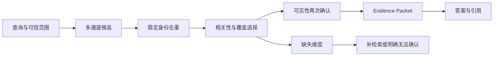
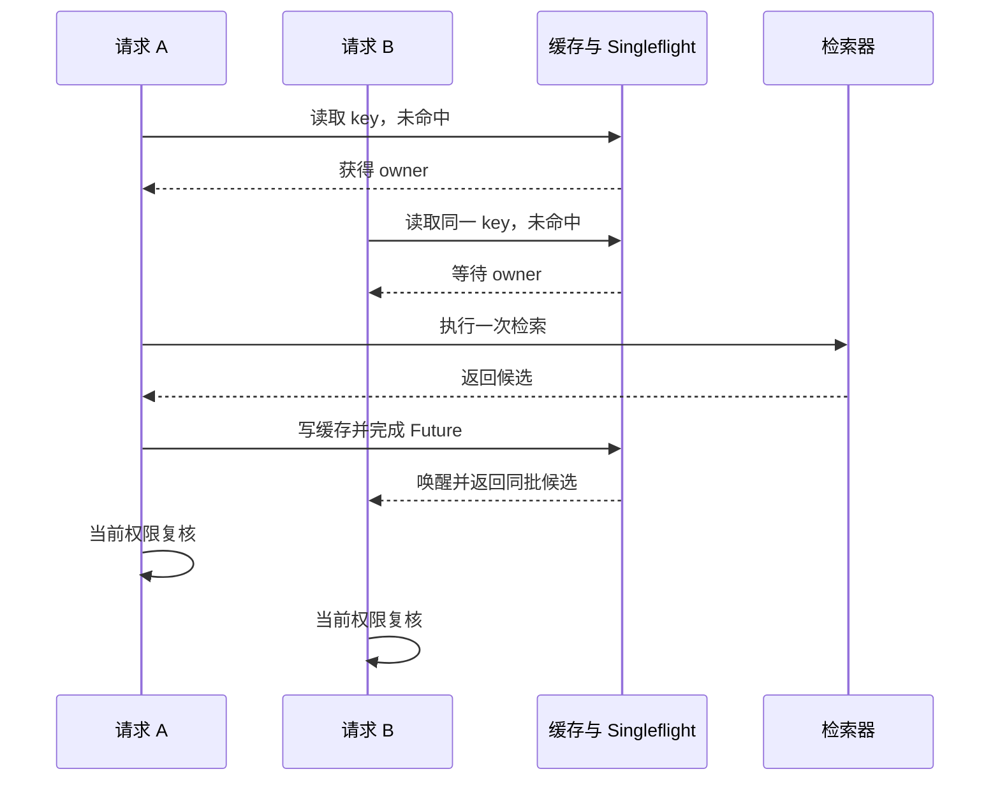

# Evidence 预算、缓存与 Singleflight

用户问：“远程访问需要满足哪些条件，由谁审批，临时豁免怎样处理？”混合检索返回二十个候选，其中前八个都来自同一份制度的相邻段落。它们对“申请条件”讲得很完整，却没有审批人和豁免规则。若程序按分数从高到低截取前五个 Chunk，模型拿到的文字很多，问题仍然只回答了三分之一。

这不是召回失败。审批和豁免候选已经出现，只是没有进入有限的模型输入。检索排序解决“哪些候选更相关”，Evidence 选择还要解决另一个问题：**在固定输入预算内，哪些材料合在一起足以支撑回答。**

缓存又带来第二组问题。相同查询不必每次重跑数据库和排序，但用户权限、知识 Release 或检索配置变化后，旧结果不能继续复用。并发的一百个相同请求也不该同时穿透到检索服务。Evidence 预算、缓存键、命中后的鉴权和 Singleflight 必须放在同一条链路里理解，因为它们共同决定模型最终看到了哪一批证据。

::: info 三个对象先分清

- **候选 Chunk**：检索通道返回的可能相关材料，还没有获得回答资格。
- **Evidence**：通过范围、版本、可见性和问题覆盖检查，实际进入本次回答上下文的材料。
- **Citation**：答案中的某个 Claim 指向 Evidence 的公开定位信息，用于让读者回查来源。

:::

候选分数高不等于可以引用，Evidence 被选中也不等于答案一定正确。模型还可能读错内容、混合两个版本或生成证据没有支持的结论。Evidence 选择只负责把可用材料交给答案层，并留下选择与拒绝的理由。

## Evidence 预算解决的不是简单截断

上下文预算通常用 Token 表示。系统先给规则、对话历史、工具结果和回答输出预留空间，剩余部分才属于 Evidence。假设本次请求能给证据 1,200 Token，候选总量却有 8,000 Token，最直接的实现是按排序取到预算耗尽。这个方法有三个明显缺陷。

一是相邻 Chunk 会重复。制度标题、适用范围和同一句定义可能在父 Chunk、子 Chunk、表格行中同时出现，高分结果因此挤在一个局部。二是长 Chunk 更容易占满预算，一个 900 Token 的概述可能让两个决定性表格行无处可放。三是截断点可能破坏语义和引用，表头被留下、对应行被裁掉，或者一句限制条件只剩前半句。

Evidence 预算需要同时约束四件事：

| 约束 | 要回答的问题 | 不能只看什么 |
| --- | --- | --- |
| 相关性 | 材料是否回答当前问题 | 检索通道的原始分数 |
| 覆盖度 | 问题中的必要维度是否都有证据 | 入选 Chunk 数量 |
| 多样性 | 是否被同一文档、同一章节或近似内容占满 | 来源数量本身 |
| 可装配性 | 材料能否在预算内保持完整语义和稳定引用 | 字符级硬截断 |

问题维度来自查询理解或确定性任务合同。当前问题至少包含“申请条件”“审批责任”“临时豁免”三项。系统不需要让模型凭感觉判断是否完整，可以把三项写进 `required_dimensions`，每选入一条候选就更新覆盖集合。预算耗尽后仍缺“临时豁免”，最终状态应明确携带缺口，不能把已有两项包装成完整回答。



这条链路里，检索器拥有候选集合，Evidence 选择器拥有入选决定，授权服务拥有最终可见性，答案层只能消费已经确认的 Evidence。模型可以建议搜索分支，不能把被权限层排除的 Chunk 再加回来。

## Evidence Packet 应保存哪些信息

只把正文字符串传给模型，会丢失来源和状态。进程重试后也无法解释这段文字属于哪个版本。一个可恢复的 Evidence Item 至少需要稳定身份、来源版本、正文、相关性、可见范围和选择状态。

```python
from dataclasses import dataclass, field

@dataclass(frozen=True)
class EvidenceItem:
    evidence_id: str
    chunk_id: str
    knowledge_object_id: str
    source_version_id: str
    title: str
    content: str
    score: float
    freshness: str
    visibility_scope: str
    visibility_subjects: tuple[str, ...] = ()
    metadata: dict[str, object] = field(default_factory=dict)

@dataclass(frozen=True)
class EvidencePacket:
    items: tuple[EvidenceItem, ...]
    coverage: float
    missing_topics: tuple[str, ...]
    conflicts: tuple[str, ...]
```

`source_version_id` 让引用固定到本次执行读取的知识快照。`visibility_subjects` 记录候选当时的可见范围，但它不是永久授权票据，缓存命中时仍要读取当前权限。`missing_topics` 与 `conflicts` 直接影响终止条件：前者可能触发一次受限补检索，后者要求答案保留分歧或转人工确认。

`included_in_prompt` 和 `final_reference` 最好分开保存。前者表示材料曾进入模型输入，后者表示最终答案确实引用了它。模型可能读过四条 Evidence，最后只用其中两条；评测若把两种状态合并，就无法区分“没有把证据交给模型”和“模型拿到证据却没有正确使用”。

大段正文不适合放进指标标签或普通日志。持久层可以保存受控正文，也可以只保存对象存储引用；Trace 记录稳定 ID、版本、分数、选择理由和过滤理由。这样既能复盘，又不会把用户文档复制到每一条日志中。

## 按新增覆盖选择 Evidence

共享示例实现了一个确定性选择器。候选包含问题维度、Token 成本、文档身份和相关分数。每一轮优先选择能覆盖新维度的候选，再比较相关性和成本；同一文档还有数量上限，防止相邻 Chunk 占满输入。

<<< ../../examples/ai-agent/evidence_cache.py

用四条候选推演一次选择：

| 候选 | 维度 | Token | 分数 | 结果 |
| --- | --- | ---: | ---: | --- |
| `rule-summary` | 申请条件 | 80 | 0.98 | 入选，覆盖“申请条件” |
| `rule-copy` | 申请条件 | 70 | 0.96 | 拒绝，没有新增覆盖 |
| `approval` | 审批责任 | 90 | 0.72 | 入选，覆盖“审批责任” |
| `exception` | 临时豁免 | 100 | 0.68 | 入选，覆盖“临时豁免” |

第二条分数比后两条高，仍然不会入选，因为它只重复已经覆盖的维度。在 280 Token 预算内，最终三条 Evidence 正好覆盖完整问题。这个例子说明选择器的目标不是让分数总和最大，而是先满足回答合同，再在满足合同的方案中比较质量和成本。

真实系统还需要更细的候选身份。父 Chunk 和表格行可能文本不同，却来自同一事实；相反，两份文档内容近似，也可能分别代表当前制度和历史制度。去重键可以组合知识对象、来源版本、Chunk 类型和稳定内容哈希，不能只拿正文做字符串去重。

多样性也不是“每个来源只能取一条”。一个复杂表格可能确实需要表头和两行数据，硬性单文档上限会破坏答案。更合理的做法是先按问题维度选，再给同一文档或章节设置软上限；当某条候选带来未覆盖维度时允许突破，纯重复内容则降权。

## Token 成本要在完整语义单元上计算

预算计算应使用实际模型的 Tokenizer 或与其误差可控的计数器。中文字符数、UTF-8 字节数和 Token 数并不相等；表格、JSON、代码和中英文混排的差异更大。装配器还要把标题、来源标记、分隔符和引用 ID 算进去，不能只统计正文。

候选大于剩余预算时有三种处理方式。能够回到父子结构的文档，可以选择更小的子 Chunk；有可信摘要的对象，可以用与原文绑定的摘要并保留来源 ID；两者都没有时，应放弃该候选或重新分配预算。直接在 Token 边界截断最危险，因为否定词、条件和表格列可能被切掉。

预算不是越满越好。相似证据太多会增加模型寻找重点的成本，也可能让重复观点看起来像多个独立来源。选择完成后可以计算三个数字：已用 Token、覆盖维度比例和来源分布。已用 Token 很高而覆盖度仍低，说明问题需要改写或补检索，不是再把 Top K 调大。

冲突证据不能通过分数较低就静默删除。当前制度写“直属负责人审批”，旧 FAQ 写“安全团队审批”，两条都可能与查询相关。系统先用 Release 和新鲜度判断旧资料是否应排除；若同一有效 Release 内仍冲突，就把冲突写进 Evidence Packet，答案层明确说明无法确认，或触发有限的权威来源查询。

## 缓存键必须描述完整检索身份

缓存保存的是“在一组输入条件下得到的候选”，不是某个问题的永久答案。只用查询文本做键，会让不同用户、不同目录范围和不同知识版本互相命中。至少要纳入这些字段：

- 数据集或知识库身份；
- 规范化查询；
- 用户、组和角色形成的权限指纹；
- 显式 Scope；
- Knowledge Release；
- 检索通道、Top K、单文档上限和融合配方；
- 会改变结果的模型或索引版本。

共享示例先把集合排序，再用稳定 JSON 序列化并计算摘要。权限主体顺序不同不会产生两个键，Release 从 V3 改成 V4 一定产生新键。

```text
query       = "远程访问 条件"
subjects    = ["user-7", "team-a"]
scope       = ["folder-policy"]
release     = "release-v3"
recipe      = "hybrid-v2"

cache key   = sha256(dataset + query + subjects + scope + release + recipe)
```

“管理员”可以使用角色身份而不是把所有可见对象展开进键；普通用户则需要稳定的用户、组或授权版本指纹。权限集合很大时，可以由授权服务生成 `acl_revision`，但必须保证撤权会推进该版本。为了缩短键而省略权限，等于把安全判断交给缓存碰运气。

Embedding 向量通常不直接写进键，可以写查询文本、Embedding 模型和归一化版本。检索配置改变后也要换配方版本。否则 Rerank、分词或放宽策略已经升级，旧候选仍会命中，看起来像新算法没有生效。

空结果可以缓存，但 TTL 应更短，并绑定同样的 Release 与权限。知识刚发布时出现一次空结果，如果缓存不含版本或长期不过期，新内容上线后用户仍会看到“未找到”。依赖临时失败产生的空结果不能当业务空结果缓存，两者要有不同状态。

## Singleflight 只合并相同身份的并发未命中

缓存冷启动时，多个相同请求可能同时未命中。Singleflight 让第一个请求成为 owner，其他请求等待同一个 Future 或锁对应的结果。它减少重复检索，不改变权限，也不保证 owner 一定成功。



锁必须有所有者令牌和过期时间。owner 完成后只能释放自己持有的锁，不能无条件删除同名键，否则旧 owner 超时后可能删掉新 owner 的锁。等待者也要有自己的 Deadline；超过等待时间后可以走一次独立检索或返回可重试错误，不能永久挂起。

owner 的失败要传播给等待者，同时清理 inflight 记录。若 owner 在检索完成、写缓存前崩溃，锁过期后下一个请求重新计算；若写缓存成功、响应丢失，等待者可以从缓存取得结果。Singleflight 不提供 Exactly Once，它只降低同一时刻的重复计算。

Redis 不可用时，检索主链路可以降级为直接查询，但要记录 `cache_error`，不能把缓存故障包装成“没有资料”。缓存属于性能层，不应该成为正确性和权限的唯一来源。反过来，如果系统承受不了缓存失效后的数据库流量，就需要准入、限流或保守降级，不能假设缓存永远在线。

等待者取消时，不一定要取消 owner。请求 B 的浏览器断开，只能结束 B 自己的等待；请求 A 和请求 C 仍需要结果，owner 应继续执行。只有 owner 已没有等待者、任务本身也不再需要结果时，运行时才考虑向下游传播取消。简单实现可以让 owner 独立于 HTTP 请求生命周期，并受统一 Deadline 控制；更精细的实现会维护等待者计数，但也增加竞态和清理代价。

owner 自己被取消或进程退出时，所有等待者必须在有限时间内醒来。内存 Future 由异常结束，跨进程锁则依靠 TTL 释放；两者都不能留下一个“正在计算”却永远没有所有者的状态。等待者回退为独立检索前要检查剩余时间，Deadline 只剩几十毫秒时，继续打数据库通常没有交付价值。

## 缓存放在哪一层需要明确取舍

RAG 链路可以缓存原始通道结果、融合候选、Evidence Packet，甚至最终答案。它们的复用范围和失效条件不同，把它们都叫“RAG 缓存”会让设计评审漏掉关键状态。

| 缓存对象 | 可以省掉什么 | 主要失效条件 | 主要代价 |
| --- | --- | --- | --- |
| Embedding | 重复计算查询向量 | 查询规范化、Embedding 模型和维度变化 | 仍要执行检索、融合与鉴权 |
| 单通道候选 | 数据库或搜索引擎查询 | Release、Scope、权限指纹和通道配置变化 | 后续仍需去重、融合和重排 |
| 融合候选 | 多通道查询与融合 | 上述条件再加融合、Rerank 配方 | 候选体积较大，模型升级后容易过期 |
| Evidence Packet | 检索、融合与证据选择 | 还要绑定问题维度、Token 预算和装配策略 | 复用范围很窄，撤权后必须重新过滤 |
| 最终答案 | 整条生成链 | 所有知识、策略、模型、权限和问题条件 | 最容易把旧事实或越权文字直接返回 |

通用知识问答通常把缓存放在候选层更稳。候选仍带稳定来源和版本，命中后可以按当前权限过滤，再依据本次问题维度与 Token 预算选择 Evidence。若直接缓存 Evidence Packet，两个文本相同、回答预算不同的请求可能需要不同材料；把预算漏出键就会得到错误复用，把所有装配字段都放进键又会让命中率很低。

精确编号和全文查询适合缓存，因为输入、Release 和结果关系较稳定。包含实时生成的查询向量、动态图谱扩展或在线 Rerank 时，缓存身份会更复杂。一套实际实现只缓存固定 Release 下、不需要查询向量的精确与全文候选；向量和完整混合检索先保持直接执行。这个选择牺牲了一部分命中率，换来更容易证明的失效边界。

最终答案缓存只适合输入和输出都高度确定的场景，比如公开、只读、版本固定的 FAQ。带个人权限、动态业务状态或研究型分支的答案，不应因为问题文本相同就直接复用。即便缓存答案，也要保存生成它的 Evidence ID、Release、策略和模型版本，并在返回前重新检查可见性。

缓存层级还影响故障恢复。候选缓存损坏时可以丢弃并重新检索，属于可重建派生数据；Evidence Packet 若已经进入一个持久化 Turn，就成为该次执行的审计材料，不能被后台清理器随意改写。设计中需要把“可删除的性能缓存”和“必须保留的执行记录”分成不同存储与生命周期。

## 命中缓存后仍要重新鉴权

缓存键包含权限不代表可以跳过鉴权。用户可能在缓存 TTL 内被移出团队，某个知识对象也可能被撤回。读取缓存后，用候选 Chunk ID 和当前认证上下文做一次批量可见性查询，只保留仍可访问的对象。

一套经过测试的实现有这样的轨迹：第一次精确检索未命中，数据库执行一次候选查询和一次可见性判断；第二次命中缓存，不再跑候选查询；随后撤销该用户对结果的可见性，第三次仍命中相同候选缓存，但可见性复核返回空集合，最终结果为空。缓存保存的是可复用候选，授权服务保存的是当前事实。

这一步不能在答案生成之后补做。未经复核的正文一旦进入 Prompt，即使最终 Citation 被过滤，模型仍可能把其中信息写进答案。正确顺序是候选读取、当前鉴权、Evidence 选择、上下文装配、答案生成。

缓存还要防止跨 Release 混用。一个 Turn 在开始时固定 Release V3，就一直读取 V3 的缓存与来源；系统活动版本切到 V4 后，新 Turn 使用 V4。运行中的 V3 请求可以完成，历史事件也保留 V3 身份。不能在生成中途把一半 Evidence 换成 V4，这样得到的答案无法复现。

## 一次完整查询怎样经过这条链路

仍以“远程访问条件、审批人和豁免”为例。下面的时间线同时给出正常路径和可观察状态。

1. API 从登录态取得 `user_id`、组和角色，从会话取得 Scope，从运行时固定知识 Release V3，并生成绝对 Deadline。
2. 查询理解产生三个必要维度，检索配置选择精确、全文和向量通道。程序用这些可信字段构造缓存键。
3. 缓存未命中，请求获得 Singleflight owner。其他同键请求进入等待，但保留各自 request ID 和 Deadline。
4. 三个检索通道返回候选，融合器按稳定 Chunk ID 去重，Reranker 更新相关性顺序。每个候选保留来源版本、通道和分数。
5. 当前权限批量过滤候选。无权结果保留最小审计记录，不把正文交给 Evidence 选择器。
6. 选择器先覆盖申请条件，再选择审批责任和临时豁免；重复的申请条件候选没有进入输入。三项共使用 270 Token。
7. owner 把可缓存候选写入当前 Release 的命名空间，完成 inflight Future。等待者醒来后仍按自己的当前权限复核。
8. Evidence Packet 记录覆盖度为完整、缺失维度为空。答案层把三个 Claim 分别绑定 Evidence ID，验证器检查引用和可见性后交付。

失败路径把第六步预算改成 160 Token。申请条件占 80，审批责任占 90，二者无法同时装入；选择器最终缺少至少一个必要维度。系统可以在总 Deadline 内尝试更短的结构化表格行，或者明确告诉用户缺少哪部分证据。它不应删除“临时”两个字，把问题改写成更容易回答的版本。

另一条失败路径发生在 Singleflight owner。数据库超时后，owner 以 `retrieval_timeout` 结束，等待者收到同一失败类型；inflight 键被释放，缓存没有写入空数组。下一次请求可以重试。若把依赖超时缓存为空结果，系统会在恢复后继续返回“未找到”，把基础设施故障伪装成知识缺失。

## 过期、撤回和配置升级怎样失效

带 Release 的键不需要在每次发布时全量扫描删除。V4 激活后，新请求自然进入 V4 命名空间，V3 缓存等待 TTL 或后台清理。回滚到 V3 时可以复用仍在保留期内、配方版本相同的候选，但命中后继续鉴权。

对象撤回应推进 ACL 版本并使可见性查询立刻生效。若业务要求撤回后连缓存正文也尽快删除，后台任务可以按知识对象反向索引清理相关键；安全性不能依赖清理及时完成，在线复核仍是最后一道门。

检索配方升级也要换版本。比如从只按 RRF 融合改成增加结构化字段 Rerank，缓存键中的 `recipe` 从 V2 变成 V3。上线时同时观察新旧键命中、候选数量和数据库负载；回滚只切回旧配方，不覆盖已有缓存内容。

Singleflight 锁的 TTL 要短于请求允许的最长失联时间，并给清理留余量。TTL 太短会让第二个 owner 在第一个仍运行时进入，造成重复计算；TTL 太长会让崩溃 owner 长时间阻塞等待者。具体数值由真实检索时延分布决定，不能从示例复制一个固定秒数。

## 指标要同时观察性能和证据质量

命中率高只能说明重复输入多，不能说明答案更好。Evidence 缓存至少需要两组指标。性能组记录 `hit`、`miss`、`wait_hit`、`wait_timeout`、`cache_error`、loader 时延和缓存体积；质量组记录候选数量、入选数量、Evidence Token、问题覆盖度、缺失维度、冲突数量和鉴权过滤数量。

这些数字需要按 Release、检索配方和通道聚合，不能把用户 ID、查询正文或 Chunk 文本放进指标标签。排查某个请求时再通过 request ID 找到受控 Trace，读取候选 ID、选择分数和过滤原因。聚合指标负责发现趋势，Trace 负责解释一次执行，两者用途不同。

几种组合能直接指出责任层：

- `hit` 上升而数据库负载不降，说明命中后仍重复执行候选查询，或者缓存只覆盖了很浅的一层；
- `wait_timeout` 上升且 loader 时延正常，可能是锁释放、Future 完成或跨进程通知有问题；
- 候选数量稳定而覆盖度下降，先检查 Evidence 选择与问题维度，不要立刻扩大 Top K；
- 鉴权过滤数量突然上升，可能是权限策略变化、缓存键身份遗漏，或上游把越权候选召回得太多；
- Evidence Token 接近上限且最终引用很少，需要检查重复材料和装配策略，而不是继续增加窗口。

容量评估也要考虑冷缓存。发布新 Release 后命名空间整体变冷，短时间内 miss 和 Singleflight owner 会增加。可以对公开、固定的高频查询做候选预热，但预热任务必须绑定候选 Release，不能在激活前把新版本结果写入当前活动键。预热失败不应阻止旧 Release 服务，只有候选版本正式激活后，新请求才使用新命名空间。

告警要对应动作。缓存错误率升高时可以关闭缓存读写并保护数据库并发；等待超时升高时限制同键回退查询数量；覆盖度下降时停止答案自动交付并检查检索或选择器。只发出“命中率低”告警，没有降级和验证动作，无法保护正在运行的请求。

## 用测试验证选择、缓存和权限边界

共享示例的测试覆盖三条关键不变量：重复高分候选不能挤掉新问题维度；Release、权限、Scope 或配方变化时缓存键必须变化；并发未命中只执行一次 loader，缓存命中仍按当前可见性过滤。

```bash
cd examples/ai-agent
python3 -m unittest discover -s tests -p 'test_evidence_cache.py'
```

这个命令已经在本地执行，退出码为 0。它验证的是选择器与内存 Singleflight 的控制逻辑，不证明 Redis 锁、数据库隔离级别和目标模型 Tokenizer 的真实行为。生产实现还要增加以下测试：

| 用例 | 注入方式 | 必须观察的结果 |
| --- | --- | --- |
| 撤权后命中 | 首次写缓存，再撤销对象可见性 | 不重跑候选检索，结果仍被过滤为空 |
| owner 超时 | loader 在 Deadline 后返回 | 等待者结束，inflight 被清理，空结果不缓存 |
| owner 崩溃 | 写缓存前终止进程 | 锁过期后可重新计算，没有永久等待 |
| Release 切换 | V3 请求运行中激活 V4 | 旧请求保持 V3，新请求只读 V4 |
| 配方升级 | 使用相同问题切换 recipe | 新配方不命中旧候选 |
| 超长证据 | 单条候选超过剩余预算 | 不做破坏语义的硬截断，缺口可见 |
| 冲突来源 | 同一有效版本出现相反规则 | Evidence Packet 保留冲突，不自动挑一条 |

集成测试要连接隔离的 Redis 和数据库，检查锁令牌释放、TTL、序列化、批量鉴权和事务外故障。故障注入比平均命中率更重要，因为最危险的问题通常发生在撤权、发布切换和 owner 失联这些低频路径上。

## 这套机制的适用边界

数据量小、查询低频时，先直接检索和选择 Evidence，缓存可能没有收益。Singleflight 也不是默认必需品；只有并发相同请求会明显打到昂贵依赖时，它才值得增加锁、等待和恢复状态。

Evidence 预算无法弥补检索根本没有召回正确资料。需要的审批规则不在候选里，应回到查询理解、索引或检索通道排查。反过来，候选已经齐全却总被同类高分 Chunk 挤掉，才是 Evidence 选择问题。两个阶段的指标必须分开。

缓存不能代替权威存储，Singleflight 不能代替幂等，权限指纹也不能代替在线鉴权。它们各自缩短一段路径或减少一次重复工作，但最终答案仍要由当前 Release 中、当前用户可见的 Evidence 支撑。

还有一个容易混淆的边界：Evidence 选择器不是事实裁判。它可以根据问题维度、分数和来源规则挑材料，不能在两份权威资料冲突时自行宣布哪一份正确。新鲜度、发布状态和来源等级能排除明确过期项，仍无法裁决的冲突必须进入答案验证或人工治理。

这套架构的核心取舍很明确。保存更丰富的候选身份、问题维度和版本信息，会增加存储、序列化与实现成本，却换来可解释选择和可控失效；把所有状态压成文本与一个缓存键，代码短一些，但撤权、回滚和并发未命中时无法证明结果来自哪里。是否引入完整机制，应由查询成本、并发量、权限风险和恢复要求决定。

下一篇进入 Wiki 与 Alias。它们会在查询进入通用检索前提供稳定主题身份和名称映射，但最终产出的候选仍要经过这里的版本、权限和 Evidence 预算检查。
