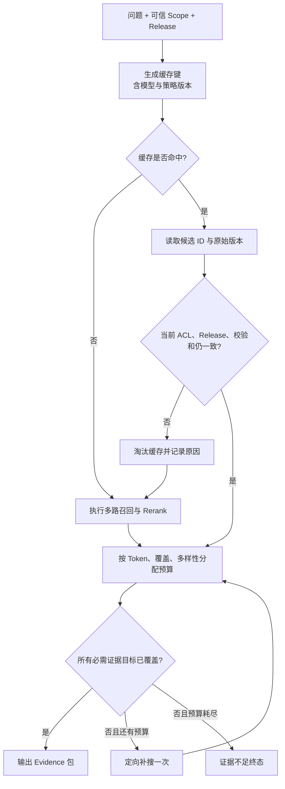

# 融合、Rerank、缓存与证据预算

## 证据预算与缓存分别负责什么

证据预算是一组在有限上下文里决定“哪些候选可以进入回答”的约束；缓存是一种按范围、版本和策略保存中间结果的复用机制。两者位于混合检索之后、ContextSnapshot 之前，用于减少重复计算，同时把有限 Token 留给覆盖问题且可验证的 Evidence。处理顺序是先把 Candidate 校验成 Evidence，再按 Token、覆盖和多样性选择，最后复核缓存是否仍然属于当前 Scope 和 Release。

融合与 Rerank 只提供排序信号，不能替代 Evidence 身份；缓存命中也只说明曾经算过，不能跳过权限、版本和内容校验。下面先把这几层边界分开，再进入 30 个候选的预算场景。

混合检索返回了 30 个候选，并不意味着应该把 30 段原文全部塞给模型。它们可能来自同一篇文档、重复表达同一个结论，也可能已经超过用户当前权限或知识版本。另一方面，简单取前 3 条又可能只覆盖问题的一半。

RRF/**Rerank** 候选先转换成可审计 Evidence，再在 Token、文档数、重复度和 Claim 覆盖之间分配预算。选择器与缓存失效规则共同保证结果不会跨租户、跨版本复用。

开始前需要理解 Top-K、ACL、Release 和上下文窗口。这里的“预算”不是只有钱，它表示一次回答允许消耗的候选条数、Token、不同文档数、模型调用次数和时间。预算的目的不是少给模型资料，而是在有限窗口内保留**覆盖面最高且可验证**的资料。

## 从 Candidate 到 Evidence 发生了什么

Candidate 是检索阶段的“可能相关片段”，Evidence 是经过权限、版本、来源和内容完整性检查后，允许进入回答与引用的证据。两者不能混用。

一个 Evidence 至少需要：

| 字段 | 为什么不能省 |
| --- | --- |
| `evidence_id` | 让 Claim、引用和 Trace 使用稳定标识 |
| `chunk_id` / `document_id` | 去重、控制同文档占比 |
| `release_id` | 确保一次回答只用同一知识快照 |
| `scope_id` | 在进入上下文前复核可见性 |
| `locator` | 定位页码、标题路径或表格行 |
| `text` | 模型实际读取的原文 |
| `token_count` | 做预算而不是按字符猜 |
| `retrieval_trace` | 解释来自哪个查询和通道 |

Rerank 分数是选择信号，不是 Evidence 身份。分数再高，只要 Scope 不可见、Release 不一致、原文定位失败或内容校验和不匹配，就不能进入上下文。

## 证据预算与固定 Top-K 的区别

固定 Top-K 只限制条数，没有回答四个更重要的问题：每段多长、是否重复、是否覆盖不同子问题、是否挤掉系统指令和回答空间。

### Token 预算

模型上下文总预算应先预留系统指令、对话、工具协议和输出空间，剩余部分才属于 Evidence。例如窗口可用 16,000 Token，不代表证据可以占满 16,000；如果预留 2,000 给指令、3,000 给历史、1,000 给工具描述、3,000 给输出，证据最多只有 7,000。

Token 要使用目标模型兼容的 Tokenizer 估算。字符数只适合粗略保护，因为中文、英文、代码和表格的 Token 比例不同。装配后还应重新计数，超限时按明确策略删减，不能依赖模型接口随机截断尾部。

### 覆盖预算

复杂问题常被拆成多个证据目标，例如“发布步骤是什么”和“失败后怎么回滚”。如果按总分取前 5 条，可能全是发布步骤，回滚完全没有资料。选择器要为每个目标至少保留一条合格证据，再用剩余预算补充高价值片段。

证据目标可以来自结构化 SearchPlan，但由程序验证枚举和上限。目标没有合格 Evidence 时，状态应标记 `uncovered`，让后续做一次定向补搜或拒答，而不是让模型自行补全。

### 多样性和重复预算

同一文档的相邻片段通常语义相近。连续塞入五段会浪费窗口，也可能让模型误以为一个来源得到了多方印证。常见约束包括：每篇文档最多 N 段、相邻片段只保留一个或合并、相似度高于阈值时去重、每个证据目标至少来自指定数量的独立来源。

多样性不是越多越好。一个权威流程文档和三个非正式讨论冲突时，不能为了来源多样而投票。来源级别、新鲜度和适用版本仍由确定性规则判断。

## 缓存可以放置的处理层

RAG 常见四层**缓存**的输入和失效条件完全不同：

| 缓存层 | 缓存内容 | 典型键 | 主要**失效**条件 |
| --- | --- | --- | --- |
| Embedding 缓存 | 文本或查询向量 | 模型版本 + 规范化文本哈希 | 模型、维度、归一化变化 |
| 召回缓存 | 每通道候选 ID 与分数 | Scope 指纹 + Release + 查询 + 检索器版本 | Release、ACL、索引版本变化 |
| Rerank 缓存 | 查询-片段精排分数 | 查询哈希 + chunk 校验和 + 模型版本 | 文本或 Reranker 版本变化 |
| Evidence 装配缓存 | 已选 Evidence ID | Scope 指纹 + Release + SearchPlan + 预算策略版本 | 权限、版本、策略变化 |

最终自然语言答案通常不应直接复用为全局缓存。它可能包含用户专属上下文、旧版本结论或不再可见的引用。如果业务确实需要答案缓存，必须把身份范围、知识版本、模型/提示版本、引用集合和短 TTL 都纳入键，并在返回前重新做权限与版本复核。

### 为什么缓存键里需要 Scope 指纹

`tenant_id` 还不够。同一租户内，不同用户可能可见不同团队或文档集合。Scope 指纹应由服务端对排序后的可见范围 ID、角色版本或策略版本做稳定哈希；不要直接把长列表放进指标标签，也不要相信客户端传来的 Scope。

命中缓存只表示“找到了旧计算结果”，不表示“当前仍可使用”。服务端需要读取当前权限版本并复核候选。若权限收紧，缓存必须丢弃；若权限扩大，可以选择重新检索，因为旧缓存没有包含新增可见资料。

## 一次安全缓存命中的执行链



`K` 使用服务端可信字段；`L` 只读取候选标识，尽量不缓存整段敏感原文；`V` 是命中后的强制复核。`B` 同时约束 Token 和覆盖面。`S` 只能补未覆盖目标，并扣减同一绝对 Deadline。失败路径保留 `cache_stale`、`scope_changed`、`release_changed` 或 `budget_exhausted` 原因，方便排障。

## 实现一个有限证据选择器

下面的程序只使用标准库。输入是已通过 ACL/Release 复核的候选、两个证据目标和 90 Token 的预算；目标是先覆盖每个目标，再按分数补充，同时限制每篇文档最多两段。为了让示例可重复，`token_count` 直接使用测试值，生产环境应替换成目标模型的 Tokenizer。

```python
# 选择器按 Claim 覆盖、来源多样性和 Token 成本取证，达到预算后显式标记未覆盖目标。
from __future__ import annotations

from dataclasses import dataclass
# EvidenceCandidate 保存可追溯来源、稳定标识和可见范围，供 Claim 绑定与引用校验。

@dataclass(frozen=True)
class EvidenceCandidate:
    evidence_id: str
    document_id: str
    target: str
    token_count: int
    score: float
    release_id: str
    scope_id: str

@dataclass(frozen=True)
class SelectionResult:
    selected: tuple[EvidenceCandidate, ...]
    uncovered_targets: frozenset[str]
    used_tokens: int

def select_evidence(
    candidates: list[EvidenceCandidate],
    *,
    required_targets: set[str],
    token_budget: int,
    max_per_document: int = 2,
) -> SelectionResult:
    if token_budget <= 0:
        raise ValueError("token_budget must be positive")

    # 排序键先按相关度降序，再用稳定 ID 打破同分，重复运行才能得到相同顺序。
    ranked = sorted(candidates, key=lambda item: (-item.score, item.evidence_id))
    selected: list[EvidenceCandidate] = []
    selected_ids: set[str] = set()
    document_counts: dict[str, int] = {}
    used_tokens = 0

    def try_add(candidate: EvidenceCandidate) -> bool:
        nonlocal used_tokens
        # 同一证据、单文档数量和总 Token 三道门禁都通过后，候选才能进入上下文。
        if candidate.evidence_id in selected_ids:
            return False
        if document_counts.get(candidate.document_id, 0) >= max_per_document:
            return False
        if used_tokens + candidate.token_count > token_budget:
            return False
        selected.append(candidate)
        selected_ids.add(candidate.evidence_id)
        used_tokens += candidate.token_count
        document_counts[candidate.document_id] = (
            document_counts.get(candidate.document_id, 0) + 1
        )
        return True

    # 第一轮优先为每个必需 Claim 槽选择一条高分证据，避免高分同类结果占满预算。
    covered: set[str] = set()
    for target in sorted(required_targets):
        for candidate in ranked:
            if candidate.target == target and try_add(candidate):
                covered.add(target)
                break

    # 第二轮再用剩余预算补充候选，提高来源多样性和回答上下文完整度。
    for candidate in ranked:
        try_add(candidate)

    return SelectionResult(
        selected=tuple(selected),
        uncovered_targets=frozenset(required_targets - covered),
        used_tokens=used_tokens,
    )

CANDIDATES = [
    EvidenceCandidate("e1", "release", "deploy", 35, 0.95, "r7", "team-a"),
    EvidenceCandidate("e2", "release", "deploy", 30, 0.91, "r7", "team-a"),
    EvidenceCandidate("e3", "recovery", "rollback", 40, 0.89, "r7", "team-a"),
    EvidenceCandidate("e4", "notes", "rollback", 55, 0.70, "r7", "team-a"),
]
result = select_evidence(
    CANDIDATES,
    required_targets={"deploy", "rollback"},
    token_budget=90,
)
print([item.evidence_id for item in result.selected])
print(result.used_tokens, sorted(result.uncovered_targets))
```

`EvidenceCandidate` 保存选择所需的最小状态，`SelectionResult` 不只返回入选列表，还显式返回未覆盖目标。`select_evidence` 先校验预算，再按分数和稳定 ID 排序。内部 `try_add` 是唯一修改选择状态的函数，它同时检查重复 ID、单文档上限和 Token 上限。

执行顺序分两轮。第一轮遍历必需目标，为每个目标选一条最高分且放得下的证据；第二轮用剩余预算补充候选。示例预期选择 `e1` 和 `e3`，消耗 75 Token，两个目标都覆盖。若把预算改成 60，`rollback` 会出现在 `uncovered_targets`，调用方应补搜或拒答，不能让生成模型猜回滚步骤。

这个算法是可解释的最小版本，不是全局最优背包算法。真实系统还可加入相邻片段合并、语义去重、来源质量和最小独立来源数，但每条规则都要进入策略版本和回归评测。

## 构造并验证缓存键

第二段代码展示 Scope 指纹与版本化键。输入是可信范围 ID、Release、规范化查询和组件版本；输出是不可逆、稳定的 SHA-256 键。这里不连接 Redis，重点是看清哪些字段一旦遗漏会导致错误复用。

```python
# 缓存键绑定规范化查询、Scope 指纹、Release 和策略版本，任一边界变化都会产生新键。
from __future__ import annotations

import hashlib
import json

def scope_fingerprint(scope_ids: set[str], policy_version: str) -> str:
    # 把影响结果的边界字段组成规范化载荷，缓存键不能遗漏权限或版本。
    payload = {
        "policy_version": policy_version,
        "scope_ids": sorted(scope_ids),
    }
    # 使用稳定键顺序和紧凑 JSON 编码，等价输入才能得到相同哈希。
    encoded = json.dumps(payload, ensure_ascii=True, separators=(",", ":"))
    return hashlib.sha256(encoded.encode("utf-8")).hexdigest()

def retrieval_cache_key(
    *,
    query: str,
    scope_hash: str,
    release_id: str,
    retriever_version: str,
) -> str:
    # 把影响结果的边界字段组成规范化载荷，缓存键不能遗漏权限或版本。
    payload = {
        "query": " ".join(query.split()).casefold(),
        "scope": scope_hash,
        "release": release_id,
        "retriever": retriever_version,
    }
    # 使用稳定键顺序和紧凑 JSON 编码，等价输入才能得到相同哈希。
    encoded = json.dumps(payload, ensure_ascii=True, sort_keys=True)
    return "rag:retrieval:" + hashlib.sha256(encoded.encode("utf-8")).hexdigest()

scope_hash = scope_fingerprint({"team-a", "public"}, "acl-v3")
print(
    retrieval_cache_key(
        query="代理  热加载",
        scope_hash=scope_hash,
        release_id="r7",
        retriever_version="hybrid-v4",
    )
)
```

`scope_fingerprint` 对范围排序，避免集合迭代顺序导致同一权限生成不同键；`policy_version` 变化会使旧键自然失效。`retrieval_cache_key` 只做保守的空白和大小写规范化，不能删除错误码中的符号。Release 或检索器版本变化都会产生新键，旧缓存可由 TTL 或后台任务清理。

哈希隐藏了键的原文，但不是加密敏感数据。日志中可以记录键前缀和命中状态，不应记录原问题、完整 Scope 或 Evidence 文本。缓存值仍需要访问控制、传输加密和 TTL。

## 测试预算和隔离边界

将两段实现分别保存后，至少添加以下测试。它们锁定的是“预算绝不超限”和“权限/版本变化绝不命中同一个键”。

为了验证“测试预算和隔离边界”，下面的测试把“测试证明证据不超 Token 上限，也证明不同 Scope 或 Release 不会命中同一缓存结果”变成可执行断言。每个用例自己构造输入，并用断言固定返回值或失败状态；某条测试失败时，可以从用例名直接定位到被破坏的契约。

```python
# 测试证明证据不超 Token 上限，也证明不同 Scope 或 Release 不会命中同一缓存结果。
from cache_keys import retrieval_cache_key, scope_fingerprint
from evidence_budget import CANDIDATES, select_evidence

def test_selection_never_exceeds_token_budget() -> None:
    # 60 Token 只能容纳部分证据，结果必须保留未覆盖的 rollback 槽。
    result = select_evidence(
        CANDIDATES,
        required_targets={"deploy", "rollback"},
        token_budget=60,
    )
    assert result.used_tokens <= 60
    assert "rollback" in result.uncovered_targets

# 这个用例固定权限边界：越权字段不能进入结果，也不能触达受保护的数据访问。
def test_scope_change_produces_another_key() -> None:
    common = {
        "query": "代理 热加载",
        "release_id": "r7",
        "retriever_version": "hybrid-v4",
    }
    key_a = retrieval_cache_key(
        **common,
        scope_hash=scope_fingerprint({"public"}, "acl-v3"),
    )
    key_b = retrieval_cache_key(
        **common,
        scope_hash=scope_fingerprint({"public", "team-a"}, "acl-v3"),
    )
    assert key_a != key_b

# 这个用例固定版本快照，确认一次运行不会混用新旧知识、策略或模型配置。
def test_release_change_produces_another_key() -> None:
    scope_hash = scope_fingerprint({"public"}, "acl-v3")
    key_r7 = retrieval_cache_key(
        query="代理 热加载",
        scope_hash=scope_hash,
        release_id="r7",
        retriever_version="hybrid-v4",
    )
    key_r8 = retrieval_cache_key(
        query="代理 热加载",
        scope_hash=scope_hash,
        release_id="r8",
        retriever_version="hybrid-v4",
    )
    assert key_r7 != key_r8
```

执行 `python -m pytest -q`。第一个测试通过 `uncovered_targets` 展示“预算不足”而不是静默丢证据；后两个测试证明权限和知识快照进入了缓存身份。生产集成测试还要模拟缓存命中后权限被撤回、文档校验和变化、Redis 超时和缓存值损坏。

## 缓存故障不应改变答案边界

缓存是性能优化，不是事实来源。Redis 不可用时可以回到原始检索；缓存数据无法解析时应删除该键并重算；缓存复核失败时要记录淘汰原因。不要因为缓存超时而跳过 ACL，也不要因为想提高命中率而移除 Release。

建议观察：各层命中率、复核淘汰率、按原因失效数量、缓存节省的延迟、重算延迟和旧版本键数量。指标标签使用有限枚举，不把查询或用户 ID 放进标签。

## 用设计检查表核对证据预算与缓存隔离

1. 明确 Candidate 变成 Evidence 的全部门禁。
2. 从模型窗口中先扣除指令、历史、工具和输出空间，再计算**证据预算**。
3. 同时限制 Token、文档数、单文档片段数、重复度和目标覆盖。
4. 每层缓存写清输入、值、键、TTL、失效事件和降级方式。
5. 缓存键包含可信 Scope 指纹、Release、模型与策略版本。
6. 命中后重新检查 ACL、Release、原文校验和。
7. Evidence 不足时补搜一次或拒答，不把缓存旧答案当证据。

缓存与证据选择都属于可验证策略：前者减少重复计算，后者在有限上下文里保留对 Claim 最有用的真实来源。两者都不能改变 ACL、Release 和证据不足终态。


**Evidence Budget 为什么不等于固定取 Top-5？**

片段长度、问题目标和来源重复度不同，固定数量无法保证 Token 不超限，也无法保证每个 Claim 有证据。Evidence Budget 应先从模型窗口扣除规则、历史、工具定义和输出空间，再按必需证据槽、Token、来源多样性、单文档上限与冲突选择。结果同时返回已覆盖和未覆盖目标。预算不足时可以定向补搜或拒答，不能静默丢掉某个条件后继续生成完整答案。

**Candidate 什么时候才可以升级为 Evidence？**

候选至少要通过当前 Scope 与 Release、原文存在性、来源位置、内容 hash、重复与冲突检查，并证明能支持某个 Claim 目标。高相似度只表示可能相关，不代表事实支持。选择器保存候选来源、分数、Token 和被保留或拒绝原因，后续引用才能回查。若原文已删除、权限收紧或候选只复述问题，它应被淘汰，即使 Reranker 分数很高。

**缓存键为什么必须包含 Scope 指纹和 Release？**

相同查询在不同用户范围和知识快照下允许看到的内容不同。只用查询文本作为键，会让扩大权限的结果被权限较小用户复用，或让新版本继续返回旧证据。Scope 指纹由规范化可见范围生成，不直接暴露敏感 ID；Release、Retriever、Embedding 和策略版本也进入键。命中后仍复核权限与原文校验和，因为撤权和紧急删除可能比 TTL 更快发生。

**可以缓存最终答案来提高速度吗？**

可以设计，但风险高于缓存解析、向量或候选。最终答案还绑定用户问题、上下文、Scope、Release、模型、提示、Evidence 和终态，任一变化都可能使它失效。更稳妥的是缓存可重建的中间结果，命中后重新做权限与答案验证。确需答案缓存时保存 Claim 与引用，设置短 TTL 和事件失效，并让无证据、冲突与个性化问题绕过；不能把旧答案本身当新 Evidence。

**Redis 不可用时，RAG 是否应该直接失败？**

缓存是性能优化，不应成为事实真相。若原始检索和数据库可用，可以在剩余 Deadline 内绕过缓存重算，并记录降级；若系统容量不足以承受全量回源，则准入层应限流或快速失败，而不是跳过 ACL。缓存值损坏时删除具体键并重算，不能反序列化失败后返回空证据。监控需要区分命中、复核淘汰、回源耗时和容量拒绝。

**权限收紧后，旧缓存怎样及时失效？**

首先让新 Scope 生成不同指纹，天然无法命中旧键；其次在 ACL 或 Release 变更事件中失效相关索引和答案缓存。命中任何旧值时仍用当前**权限复核**每个来源，不合格立即淘汰。对于紧急撤权，不能只等待 TTL。测试应先以宽 Scope 写缓存，再收紧到 public，确认请求不会看到旧团队证据，同时日志能说明是 Scope 不同或复核失败。
