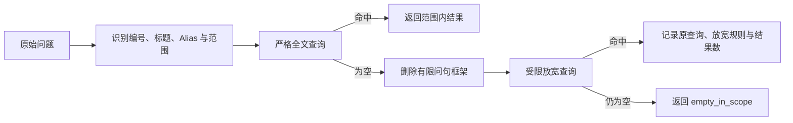
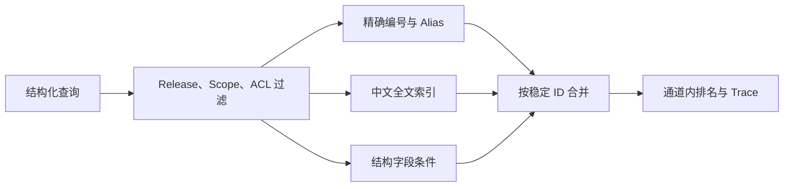

# 精确、全文与结构化检索怎样协作

“查询 `RA-2026-0142`”“查找包含设备合规的制度”“找出状态为已拒绝、原因为设备不合规的申请”，三句话都在找知识，适合的检索方式却不同。业务编号需要完整匹配，制度描述依赖中文词项，状态和原因已经是结构字段，继续把它们拼成一段文本做相似度搜索会损失精度。

精确检索、全文检索和结构化检索属于确定性检索通道。它们可以解释为什么命中，也能在没有模型服务时运行。向量检索擅长语义近似，不应替代这些明确线索。成熟的 RAG 通常先保住编号、关键词和字段条件，再让向量通道补充不同措辞。

::: info 三条通道的职责

- **精确检索**保留业务编号、标题、别名和精确词项的身份。
- **全文检索**根据词项是否出现及其位置寻找正文，不要求原句完全相同。
- **结构化检索**按字段类型、操作符和值过滤记录，适合状态、负责人、日期和表格列。

三条通道共享同一份权限、范围和 Release，任何通道都不能自行扩大可见集合。

:::

下面仍用远程访问问题推演。用户问：“`RA-2026-0142` 因设备不合规被拒绝后怎样处理？”查询同时包含申请编号、失败原因和处理意图。三个通道需要共同保住编号对应的业务对象，找出制度中的处理条件，并把字段状态作为过滤证据。

## 先把查询拆成可验证的约束

查询理解器可以输出编号、主题、状态、原因、时间和自然语言词项。这个结构只是候选解释，程序还要校验字段类型和操作符。例如状态只能从允许枚举中选择，时间范围必须有合法起止，编号要符合业务格式。模型输出 `status="全部"` 时，不能把它解释成跳过权限或查询所有状态。

一次确定性检索可以接收这样的内部请求：

```json
{
  "query": "RA-2026-0142 因设备不合规被拒绝后怎样处理？",
  "identifiers": ["ra-2026-0142"],
  "terms": ["设备合规", "拒绝", "处理"],
  "filters": {
    "status": "rejected",
    "reason": "device_noncompliant"
  },
  "scope_ids": ["remote-access"],
  "release_id": "release-7"
}
```

`scope_ids` 和 `release_id` 来自可信运行时，不由模型补写。编号和词项可以从问题提取，字段过滤则要区分用户明确条件与模型推断。用户明确说“状态为已拒绝”时可以用严格过滤；只是问“为什么失败”，查询理解器推断的原因适合做候选词，不宜直接排除其他记录。

通道执行前先形成 `visible_records`：知识对象属于指定数据集和 Release，索引状态就绪，未被撤回，根节点位于显式范围，当前身份满足对象 ACL。后面的精确、全文和结构化查询都只能读取这个集合。把权限过滤放在融合之后，意味着数据库已经把越权正文带进候选和日志，风险更高。

### 强条件与软线索采用不同失败语义

查询里的约束可以分成强条件和软线索。强条件来自可信运行时或用户明确选择，例如租户、知识库、Release、文档范围、状态筛选和时间区间。记录不满足强条件就不能进入候选，零结果时也不能静默移除条件。

软线索用于排序和召回。自然语言中的主题词、模型推断的实体、可能的 Alias 和意图都可能有误。软线索没有命中时可以在预算内放宽，但要保留原始问题，最终结果仍需满足所有强条件。“设备不合规”若来自用户选择的原因筛选，就是强条件；若只是模型从一句模糊描述中推断出来，它更适合全文词项或排序特征。

业务编号介于两者之间。用户输入完整合法编号时，它通常是强对象约束，返回其他编号会误导；编号来自 OCR、语音识别或模型补全时，先作为候选标识，并向用户确认。来源决定严格度，单看字符串形状不够。

查询协议可以为每项约束记录 `origin`、`mode` 和 `confidence`。`origin` 表示用户、运行时或模型，`mode` 表示过滤、加权或提示，`confidence` 只影响软线索。权限和 Release 不接受置信度，也不能由高相关性覆盖。这样做还能解释零结果：到底是强范围内确实没有，还是某个软词没有命中。

当不同条件冲突时，程序按来源优先级处理。用户显式选择第 7 版，问题里又写“按旧版规定”，系统可以要求确认，不能让模型自行切到第 6 版。当前账号状态由业务 API 返回，文档里的示例状态不能覆盖它。检索负责找到解释材料，不负责解决可信事实之间的冲突。

## 精确检索保留业务身份

业务编号通常混合字母、数字、短横线、下划线或点号。分词器可能把 `RA-2026-0142` 拆成 `ra`、`2026` 和 `0142`，普通词项检索会匹配到大量无关记录。精确通道先识别完整编号，统一大小写和允许的边缘符号，中间结构保持不变。

识别规则不能简单写成“带数字的都算编号”。年份 `2026`、版本 `7.2` 和句子里的数量不一定是业务主键。较稳的起点是要求字符串同时包含字母与数字，长度达到下限，并把业务已知格式放入验证器。验证失败的片段仍可作为普通词项，不能直接进入主键查询。

编号命中时，排序优先级通常高于模糊标题。精确通道可以依次检查：文档标题完全相等、来源标题完全相等、`exact_terms` 包含完整查询、Alias 完全相等、标题包含查询，最后才使用多个普通词项共同出现。顺序要写进查询或可测试的评分函数，不能散落在 Prompt 描述里。

Alias 也需要治理。“远程办公”和“远程访问”可能是经确认的同义名称，“居家登录”可能只是某次查询的猜测。只有已审核 Alias 才能进入精确词项。模型生成的别名先作为搜索建议，命中后还要回到对象身份；不能把它自动写入全局 Alias 表。

没有编号时，精确通道可以要求至少两个普通词项共同出现，避免单个“申请”“处理”触发大范围扫描。条件应根据查询类型调整：只有一个明确产品名时可以允许单词项，长自然语言问题则先去掉礼貌和问句框架，再判断有效词项数。

精确匹配不是字符串越长越好。把整句问题放进 `ILIKE '%...%'` 几乎不会命中改写后的正文；对每个二字词做全表 `ILIKE` 又会绕过倒排索引。编号、标题、Alias 和预计算 `exact_terms` 应有独立索引，普通中文内容交给全文通道。

## 中文全文检索需要区分严格查询与有限放宽

全文检索把文档预处理成词项索引，查询也经过同一分词配置，再计算匹配与排名。PostgreSQL 中常见做法是为文本保存 `tsvector`，用 GIN 索引加速，查询通过 `plainto_tsquery` 或 `websearch_to_tsquery` 生成 `tsquery`。中文需要合适的分词配置，默认按英文空格切分通常不够。

自然问题包含很多不承载主题的词。“请简要说明”“如何查看”“分别是什么”会让严格 AND 查询要求文档同时包含这些措辞。查询预处理应删除可确认的问句框架，保留业务概念。“请简要说明知识库的使用范围”可以得到“知识库 使用范围”，“如何导入钉钉文档”可以得到“导入 钉钉文档”。

删除规则必须有限。机械删除所有“中”“的”“后”可能破坏专有名称，“数据中台”不能变成“数据 台”，“和平项目”也不能因为包含“和”被拆坏。规则用真实失败样本建立，每次修改都跑回归集，不使用无限增长的业务标题特判。

严格查询先运行，命中时不再扩大。如果没有结果，可以删除一小组已知的意图短语或转折后缀再试一次，例如把“文档发布后如何用于 AI 检索”收缩为“文档发布 AI 检索”。放宽前后的查询字符串、尝试序号和结果数进入 Trace。



指定 Release 或显式范围时，放宽仍然留在原范围内。严格查询为空不能改成全库 OR 搜索。一个受控方案是先在允许的来源标题中找相关文档，再在这些来源的 Chunk 内做全文检索；仍为空就返回 `empty_in_scope`。未指定窄范围的普通发现型查询，可以使用带上限的 OR 词项召回，但必须走倒排索引并限制候选数。

全文排名说明词项覆盖和位置，不说明事实新旧与权限。`ts_rank_cd` 得分只在同一查询和配置下有比较意义，不能直接与余弦相似度相加。它先形成通道内排名，跨通道融合留给后续阶段。

### 写入索引与查询必须使用同一套语义

全文查询是否稳定，很大程度取决于写入阶段。索引文本可以由标题、章节路径、正文、表头和经过治理的 Alias 组成，不同字段按业务需要设置权重。标题适合帮助对象导航，正文承担事实召回，表头让“负责人”“到期时间”这类列名可检索。未经审核的模型摘要不宜获得与原文相同权重。

`search_vector` 需要记录分词配置版本。更换中文词典、停用词或字段权重后，旧向量不会自动更新，必须建立候选索引并重跑回归。查询端先切新配置、索引仍使用旧配置时，同一个词会在两侧产生不同 Token，表现为难以解释的召回下降。

精确词项也在写入阶段生成。业务主键、规范标题和审核 Alias 进入独立字段，保持大小写规范与原始显示值。正文中的任意数字不能自动加入 `exact_terms`，否则年份和序号会制造大量低价值命中。表格行可以继承对象主键，但要同时保留行级身份，避免一个编号命中几十行后占满候选。

大文档的全文索引需要限制单条输入长度，并分布选取开头、中间和结尾内容，或者直接按 Chunk 建索引。只截取前缀会让附录和后半部分永远无法召回。无论采用哪种方式，索引记录都要能回到原始 Block 和 Chunk，不能只保存一段不可定位的拼接文本。

索引迁移采用候选版本。后台写完新 `search_vector` 后，先检查空向量比例、词项分布、查询计划和固定 Gold，再原子激活。在线请求固定一个索引配方，不能在翻页或重试时跨配方读取，否则排名变化无法复现。

## 结构化检索直接使用字段语义

解析表格时，系统可以同时保留整表内容和行级 Chunk。行级 Chunk 的 `structured_fields` 保存列名与规范化值，例如状态 `rejected`、原因 `device_noncompliant`、负责人 `security_team`。显示文本仍使用中文，字段值则便于稳定查询。

结构化过滤要有 Schema。日期支持范围比较，金额使用数值类型，状态和类型使用枚举，数组字段明确“包含任一”还是“包含全部”。把 JSON 整体转成文本再做 `ILIKE` 只能当兼容性回退，无法正确处理 `10` 与 `100`、日期顺序或数组语义，也很难获得稳定索引。

字段不存在与字段值为空不是一回事。旧版资料没有“拒绝原因”列时，查询 `reason = device_noncompliant` 应明确不匹配；若产品需要把缺失字段也返回，条件应显式写成 `reason IS NULL OR ...`。不能由数据库的隐式空值行为决定业务含义。

结构化字段仍要绑定原始来源。命中申请状态后，Candidate 保留对象 ID、行号、文档版本和显示文本；最终引用可以展示易读内容，同时审计能定位到原表。只返回一段由程序拼接的“状态：已拒绝”而没有来源身份，不足以成为 Evidence。

字段条件也不能越过版本。第 6 版表格把状态写成 `denied`，第 7 版迁移为 `rejected`，查询适配器按本次 Release 使用对应 Schema 或迁移后的规范字段。在线请求不能临时猜测两套值并混查两个版本。

## 三条通道共享过滤，保留各自命中原因

执行顺序可以概括为：先确定可见集合，再并行运行启用的通道，最后按稳定记录 ID 合并结果。合并后的 Candidate 记录 `channels` 和 `matched_terms`，下游既知道它被哪些通道发现，也能在通道故障时分析质量变化。



合并不等于把分数相加。精确通道可能用离散优先级，全文通道返回覆盖密度分数，结构化通道只有满足或不满足。当前阶段先保留每个通道的名次、命中字段和原始分数，混合检索篇再讨论 RRF 与 Rerank。

同一对象可以有多个 Chunk。编号命中文档标题后，系统还要选择能够回答问题的正文或表格行，不能把只有标题的父节点直接当答案。可以在对象内按章节、词项和邻接关系取得有限 Chunk，并设置每份文档的最大候选数，防止一本长文占满 Top K。

通道结果为空也保留原因。精确通道没有识别出合法编号、全文查询预处理后为空、结构字段不在 Schema 中，都比“返回 0 条”多一层可操作信息。调用方根据原因决定纠正输入、有限放宽或结束，而不是统一重试。

## 用同一个问题推演状态变化

输入问题是“`RA-2026-0142` 因设备不合规被拒绝后怎样处理？”，Release 固定为第 7 版，范围是远程访问知识，身份是普通员工。

第一步从查询中识别完整编号 `ra-2026-0142`。状态“被拒绝”由用户明确表达，可以规范化为结构字段 `status=rejected`；“设备不合规”既作为原因字段候选，也保留为全文词项。程序校验状态枚举，原因字段若没有足够置信或缺少 Schema，就只做词项，不强制过滤。

第二步生成可见集合。数据库按数据集、Release、根节点和 ACL 筛选，内部处置流程在这一层被排除。历史第 6 版记录也不会进入通道。后续任何排序都看不到这些正文。

第三步运行通道。精确通道按编号命中申请对象；结构化通道确认该对象状态为已拒绝；全文通道在制度正文中命中“设备合规”“重新提交”和“整改”。结果按对象与 Chunk 身份合并，申请记录与制度条件保持两条 Evidence，不因为都含编号而混成一个对象。

第四步检查覆盖。申请对象证明当前状态，制度 Chunk 说明整改后可以重新提交。若全文只找到“可以重新提交”，相邻 Chunk 才有“完成设备整改”的前提，系统补入邻接内容并保留两个 Chunk ID。最终 Candidate 交给融合和 Evidence 选择，不在确定性通道中直接生成回答。

一次执行 Trace 至少能看到：规范化查询、识别出的编号与字段、可见集合版本、启用通道、每条通道排名、命中词项、过滤原因和最终候选 ID。日志不保存完整申请内容，详情通过受控存储按 ID 查看。

## 运行示例验证最小控制逻辑

共享示例只用 Python 标准库，故意不模拟数据库分词和索引。它验证五个控制点：业务编号保持完整，中文词项按确定规则生成，结构字段严格相等，ACL 与 Release 在匹配前过滤，同一记录合并通道身份。

<<< ../../examples/ai-agent/lexical_retrieval.py

运行：

```bash
PYTHONPATH=examples/ai-agent \
  python3 examples/ai-agent/lexical_retrieval.py
```

输出只有 `row-1`。它同时带有 `exact`、`fulltext` 和 `structured` 三个通道；受限记录和旧 Release 记录没有进入结果。测试命令如下：

```bash
PYTHONPATH=examples/ai-agent \
  python3 -m unittest discover \
  -s examples/ai-agent/tests \
  -p 'test_lexical_retrieval.py'
```

示例中的中文二元词只用于展示可测试的词项逻辑，不能代替生产中文分词。它也没有证明 GIN 索引性能、SQL 参数绑定、JSON 字段索引和并发行为。数据库集成测试需要使用与生产一致的 PostgreSQL 扩展和隔离数据，检查查询计划与权限过滤。

## 放宽必须有边界和停止条件

严格精确查询为空时，先判断输入是否合法。编号校验失败可以提示用户核对，不能去掉短横线后扫描所有数字。合法编号不存在时返回 `not_found`；它与权限过滤后的 `empty_in_scope` 不能合并，否则界面可能泄露对象是否存在。

全文查询可以按预先定义的规则有限放宽，每次放宽都消耗同一份尝试预算。删除意图词后仍为空就停止，不能不断让模型改写到某个结果出现。查询越改越宽，命中的内容可能已经不再回答原问题。

结构化条件无效时在入口拒绝。未知字段、非法枚举、结束时间早于开始时间都不应静默忽略。忽略字段会把窄查询变成宽查询，返回看似正常的数据。可选条件和必需条件在 Schema 中明确标记，只有可选条件允许在用户确认后移除。

数据库超时、分词扩展不可用和索引未就绪属于依赖失败。系统保存通道名、查询摘要、Release 与耗时，在 Deadline 内决定是否使用其他已完成通道。权限查询失败直接终止；某条质量增强通道失败才允许降级。

候选达到上限也不是成功。`truncated=true` 表示通道还有更多结果，Evidence 覆盖不足时可以在剩余预算内增加通道限额；预算用尽后返回缺口。不能把被截断的 Top K 当成完整枚举。

## 测试要覆盖命中之外的行为

精确通道的单元测试应覆盖大小写、短横线、下划线、点号、中文混排、只有数字、非法边缘符号和多个编号。还要确认普通二字词不会被误判为业务编号，编号不存在时不会退化成全表模糊扫描。

全文测试使用真实中文问句，检查礼貌词删除后业务概念仍在，专有名称不会被停用词规则拆坏。严格查询未命中时，只运行允许的放宽序列；指定 Release 后不得启用无边界 OR 回退。SQL 层验证 `search_vector @@ tsquery` 使用索引，并限制来源与候选数。

结构化测试按字段类型准备边界值：日期端点、数值零值、数组任一与全部、空字段、未知枚举和 Schema 迁移。结果既要断言记录 ID，也要断言来源版本和过滤原因。

权限回归至少包含当前用户可见、同组可见、其他组不可见、对象撤回、历史 Release 和缓存命中后撤权。任何一个越权候选出现都直接失败，不用其他查询的高召回抵消。

故障测试注入全文索引超时、字段解析失败和连接中断，检查已完成通道是否保留、错误类型是否稳定、Deadline 是否停止新增工作。只有返回非空无法证明降级正确，因为结果可能来自错误范围或旧版本。

## 生产查询要检查计划、基数和可观察证据

开发数据只有几十条时，`ILIKE`、JSON 文本扫描和无索引排序都很快，数据量增加后才暴露问题。上线前用接近真实分布的隔离数据执行 `EXPLAIN ANALYZE`，确认全文条件使用 GIN 索引，精确字段使用 B-tree、Hash 或数组索引，结构字段的高频过滤有对应表达式索引。查询计划本身也是回归证据。

索引不是越多越好。每个索引都会增加写入、重建和存储成本，低选择性状态字段单独建索引未必有效。常见组合是把数据集、Release、活动状态作为前置过滤，再针对业务编号、全文向量和高频结构条件建立索引。具体选择依据基数、查询比例与计划，不凭字段名称决定。

每条通道设置候选上限和单文档上限。通道限额过小会漏掉 Gold，过大则增加融合、Rerank 和内存开销；单文档上限防止长文的相邻 Chunk 淹没其他来源。限额变化需要在同一 Gold Set 上比较 Recall、延迟和候选多样性。

监控至少区分精确、全文与结构化通道的请求数、零结果率、截断率、超时、放宽次数和 P95 延迟。零结果率突然升高时，按 Release、查询类型和来源格式切片。把所有通道合成一个“检索成功率”，无法判断是编号识别退化、中文索引未完成，还是结构字段迁移漏值。

Trace 保存规范化查询的哈希、强条件摘要、索引配方、通道排名和过滤原因。完整查询与正文属于受控数据，不放进指标标签。排查人员根据 Query ID 到审计存储读取详情，监控系统只保留可聚合字段。

缓存只适合版本固定、结果确定的窄查询。缓存键包含身份或权限主体、范围、Release、查询规范化结果、通道和限额，命中后仍重新检查当前可见性。缓存故障直接访问数据库，不能返回未复核的旧候选。高频编号查询可以使用 Singleflight 合并并发回源，但等待超时后每个请求仍受各自 Deadline 控制。

## 与向量检索的分工

用户记得含义却用不同措辞时，向量通道可以补充召回。比如制度写“终端通过基线校验后重新发起”，用户问“设备整改后能不能再申请”，词项重合可能很少，语义向量更容易找到。编号、状态和权限仍由确定性通道保住。

向量结果不能覆盖精确编号。问题明确包含 `RA-2026-0142` 时，一个语义相近但编号不同的申请不应排在正确对象前面。后续 Rerank 文本也要包含标题、章节、编号和结构字段，否则模型只看正文，可能忽略业务身份。

反过来，精确命中也不证明足以回答。按编号找到申请记录，只说明对象正确；“怎样处理”仍需要制度 Evidence。系统应保留不同对象承担的职责：业务对象提供当前状态，知识文档提供规则，最终 Claim 分别引用对应证据。

三条确定性通道先让明确线索稳定可见，向量检索再处理措辞差异。它们产生的分数尺度不同，下一篇会把这些候选放进同一个融合、去重和重排流程，并处理部分超时与失败回退。

交给下一阶段的每条 Candidate 都要保留稳定 Chunk ID、对象 ID、通道名、通道内名次、命中原因、Release 和权限裁决。融合器据此合并同一证据，也能在排序异常时回到原始通道定位原因。

## 精确通道是安全的收窄器
编号、错误码、字段值和版本条件应先经过规范化，再进入等值或全文查询。通道只能在当前 Scope 与 Release 内扩大候选，不能因为找不到就删除约束或回退全库。

结构化结果保留字段路径，全文结果保留词项与版本，向量结果保留距离和通道名。融合前统一 Candidate 身份，答案阶段仍要按 Evidence 关系验证。
