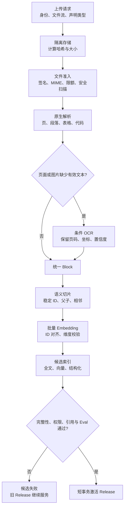
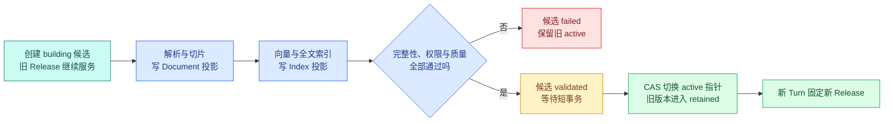

# RAG 数据导入：从文件准入到可发布知识版本

## RAG 数据导入是什么

RAG 数据导入是把原始文件转换成在线检索可使用的知识 Release 的离线流水线。它位于上传接口、对象存储、解析/切片、Embedding 和向量索引之间，负责保留来源、版本、任务状态和发布门禁。上传成功只表示系统收到文件，不表示知识已经可检索。

把一份 30 页手册上传到知识库，接口返回“成功”，并不代表 Agent 已经能可靠回答。文件可能只有前 12 页提取出文字，表格表头可能丢失，Embedding 可能只写入一半，而在线检索已经开始混用新旧片段。

RAG 数据导入要解决三个工程问题：**怎样把不可信文件变成可追溯 Chunk，怎样在任一阶段失败后从确定位置恢复，怎样保证半成品永远不进入在线查询。** 完整状态链连接格式解析、切片、Embedding、向量库和索引，任何阶段都不能绕过发布门禁。

公开例子使用匿名对象，不对应任何私有表结构。导入状态表定义持久化事实，状态机执行转换，恢复测试验证失败后从哪个状态继续。

## 在线上传接口不应该亲自解析文件

解析 PDF、执行 OCR、调用 Embedding 和构建索引都可能耗时数秒到数分钟。如果 HTTP 请求一直等待，客户端断开会让任务状态不明，Web 进程也会被 CPU、内存和外部依赖拖住。

更清晰的边界是：

1. 上传接口验证身份、文件元数据和大小；
2. 原文件流式写入隔离对象存储，计算内容哈希；
3. 数据库创建 `ingestion_id` 与候选 `release_id`；
4. 事务提交后派发异步任务；
5. Worker 按状态执行准入、解析、OCR、切片、向量化和验证；
6. 发布器只在候选完整时切换在线 **Release**。

接口返回 `202 Accepted` 与导入 ID，表示“任务已被接受”，不是“知识已经上线”。前端通过状态接口或事件流展示进度。若数据库记录成功而派发消息失败，可以由 Outbox 或扫描器补派，不能在请求中写完一半后假装成功。

## 文档导入的五类领域对象

### Source Object：原文件真相源

原文件保存在对象存储中，记录对象键、SHA-256、字节数、探测 MIME、上传者和隔离状态。文件名仅用于展示，不能作为存储路径或格式判断依据。

Source Object 让解析器升级后可以从原字节重建，也让审计者确认当前 **Chunk** 究竟来自哪份输入。删除或保留原文件要遵循数据策略，不能只删向量留下无法追溯的引用。

### Ingestion：一次导入尝试

Ingestion 保存任务状态、当前阶段、attempt、Lease、Deadline、错误码和进度。相同文件可以有多次尝试，但每次尝试都要指向明确的 Source Object 与候选 Release。

它不是知识版本本身。任务失败后，Ingestion 进入终态；修复配置可以创建新 attempt 或新导入，而不是把历史失败记录原地改成成功。

### Block：解析器保留的结构单元

Block 表示标题、段落、列表、表格、代码、图片或工作表行。它保存原文顺序、页码/幻灯片/单元格、坐标、标题路径和解析方式。Block 是格式差异收敛后的中间契约。

### Chunk：可检索、可引用的语义片段

Chunk 从一个或多个 Block 生成，带稳定 ID、正文、标题路径、父子与相邻关系、来源位置、权限和内容哈希。全文索引与 Embedding 消费 Chunk，而不是直接消费文件字节。

### Knowledge Release：在线查询快照

Release 把一组文件版本、Chunk、全文索引、向量投影和可选图谱固定在一起。在线 Turn 只读取一个 active Release。候选数据可以分批提交，但在发布前不可见。

## 一条完整的数据链



`S` 先保存字节再派发任务，后续每阶段都能按 Source Object 重放。`A` 在任何解析器接触文件前阻止不支持或危险输入。`P/R/B` 负责恢复结构，不润色事实。`C/E/I` 是可重建投影。`V` 对数量、来源、权限和质量做门禁。只有 `L` 改变在线指针，并且它应是很短的数据库事务。

失败分支不会删除旧 Release。清理失败候选是后续、可重试的维护任务，不能与激活事务绑在一起。

## 文件准入：扩展名只是用户提示

用户可以把可执行文件改名为 `.pdf`，也可能上传带宏的 Office 文档、嵌套压缩包或超大图片。准入至少检查：

| 检查 | 输入 | 失败动作 |
| --- | --- | --- |
| 大小与数量 | 流式计数 | 超限立即停止并删除隔离对象 |
| 内容哈希 | 原始字节 | 去重或建立新来源版本 |
| 文件签名/MIME | 文件头与探测器 | 声明类型不一致则拒绝或隔离 |
| 格式白名单 | 探测类型 | 不调用未知解析器 |
| 压缩安全 | 层级、展开大小、文件数 | 阻止路径穿越与压缩炸弹 |
| 恶意内容 | 隔离扫描结果 | 阻断并记录有限错误信息 |
| 加密/密码 | 解析器预检 | 请求授权输入，不循环重试 |

解析器运行在受限 Worker 中，使用临时目录、CPU/内存/时间限制和最小网络权限。文档中的链接、脚本、宏和“忽略系统规则”等文字全部是不可信内容，不能在导入阶段执行。

## 原生解析和 OCR 怎样配合

原生解析优先，因为它通常能保留真实字符、样式和坐标。OCR 只处理没有有效文本层的页面或图片。判断“有效”不能只看字符串非空：只提取出页码和页眉的扫描页仍然是缺失页。

每页保存 `native_char_count`、主要文本块数量、图片覆盖、OCR 状态和失败原因。需要 OCR 的页数超过策略上限、识别结果为空或关键页面置信度过低时，候选版本进入失败或人工复核，不能把空页发布。

OCR 只产生带证据等级的解析文本。金额、版本号和权限值等高风险内容可以要求更高置信度或人工核对；模型不能把低置信识别结果改写成确定事实。

## 清洗的原则是可逆与保守

适合确定性清洗的内容包括 Unicode 规范化、换行统一、控制字符处理和基于跨页重复的页眉页脚识别。清洗前后保留映射，保证引用能回到原文。

不要让生成模型“润色后入库”。它可能修改否定词、数字和条件，让向量更好搜却失去证据真实性。导航与模板噪声可以通过 DOM/频率规则删除，但任何删除规则都要有版本和覆盖率对照。

## 状态机需要表达阶段、所有权与终态

只用 `pending/running/success/failed` 无法回答失败发生在哪、谁在处理、是否可重试。建议把阶段与任务状态分开：

| 阶段 | 成功产物 | 可重试错误 | 永久或人工错误 |
| --- | --- | --- | --- |
| `admitting` | 安全的 Source Object | 扫描服务暂时不可用 | 不支持格式、超限、恶意文件 |
| `parsing` | Block 集合 | 解析 Worker 崩溃 | 损坏/加密文件 |
| `ocr` | 带定位 OCR Block | OCR 超时、限流 | 页数超策略、持续空结果 |
| `chunking` | Chunk 与关系 | Worker 中断 | 结构不变量失败 |
| `embedding` | 完整向量投影 | 429、暂时 5xx | 单条超限、维度/契约错误 |
| `indexing` | 候选索引 | 数据库暂时不可用 | 模型/索引配置不兼容 |
| `validating` | 检查证据集 | 检查器暂时不可用 | 数量、ACL、引用或 Eval 失败 |
| `activating` | active 指针切换 | 事务冲突后有限重试 | 基线 Release 已过期 |

每个运行阶段写 `lease_owner` 和 `lease_expires_at`。Worker 只更新自己持有且未过期的任务；租约过期后恢复器可以接管。原 Worker 晚到的结果必须用 attempt 或 fencing token 拒绝，避免覆盖新 Worker 状态。

## 实现可验证的导入状态机

下面的代码只使用标准库。输入是一组按顺序报告完成的阶段；输出是当前阶段、状态、完成产物和错误码。目标是让非法跳步、失败后继续写和重复完成都产生明确行为。它是领域状态机，不包含解析库或队列实现。

```python
# 状态机只接受允许的前驱状态；失败会保留阶段和原因，只有验证通过才能进入可激活状态。
from __future__ import annotations

from dataclasses import dataclass, field
from enum import StrEnum

class Stage(StrEnum):
    ADMIT = "admit"
    PARSE = "parse"
    OCR = "ocr"
    CHUNK = "chunk"
    EMBED = "embed"
    INDEX = "index"
    VALIDATE = "validate"
    ACTIVATE = "activate"

class Status(StrEnum):
    PENDING = "pending"
    RUNNING = "running"
    SUCCEEDED = "succeeded"
    FAILED = "failed"

ORDER = (
    Stage.ADMIT,
    Stage.PARSE,
    Stage.OCR,
    Stage.CHUNK,
    Stage.EMBED,
    Stage.INDEX,
    Stage.VALIDATE,
    Stage.ACTIVATE,
)

@dataclass
class Ingestion:
    ingestion_id: str
    release_id: str
    status: Status = Status.PENDING
    current_stage: Stage | None = None
    completed: list[Stage] = field(default_factory=list)
    artifacts: dict[Stage, str] = field(default_factory=dict)
    error_code: str | None = None

    def start(self, stage: Stage) -> None:
        # 先检查当前状态是否允许继续推进，避免终态被重复任务或迟到结果覆盖。
        if self.status is Status.FAILED or self.status is Status.SUCCEEDED:
            raise ValueError("terminal ingestion cannot start another stage")
        expected = ORDER[len(self.completed)]
        if stage is not expected:
            raise ValueError(f"expected {expected}, got {stage}")
        self.status = Status.RUNNING
        self.current_stage = stage

    def succeed(self, stage: Stage, artifact_id: str) -> None:
        # 先检查当前状态是否允许继续推进，避免终态被重复任务或迟到结果覆盖。
        if self.status is not Status.RUNNING or self.current_stage is not stage:
            raise ValueError("only the running stage can succeed")
        if not artifact_id:
            raise ValueError("artifact_id is required")
        self.completed.append(stage)
        self.artifacts[stage] = artifact_id
        self.current_stage = None
        self.status = (
            Status.SUCCEEDED if len(self.completed) == len(ORDER) else Status.PENDING
        )

    def fail(self, stage: Stage, error_code: str) -> None:
        # 先检查当前状态是否允许继续推进，避免终态被重复任务或迟到结果覆盖。
        if self.status is not Status.RUNNING or self.current_stage is not stage:
            raise ValueError("only the running stage can fail")
        self.status = Status.FAILED
        self.error_code = error_code

job = Ingestion("ing-1", "release-8")
for stage in ORDER:
    job.start(stage)
    job.succeed(stage, artifact_id=f"artifact:{stage}")
print(job.status, job.completed, job.artifacts[Stage.EMBED])
```

`Stage` 表示不可跳过的产物顺序，`Status` 表示任务能否继续。`Ingestion.completed` 既是进度，也是下一阶段的确定依据；`artifacts` 保存各阶段产物 ID，不保存大段正文。`start` 拒绝终态和乱序执行，`succeed` 只允许当前运行阶段提交且要求产物 ID，最后一个阶段完成才把任务标成成功。

示例依次执行八个阶段，预期输出 `succeeded`、完整阶段列表和 Embedding 产物 ID。若在 `PARSE` 后直接启动 `EMBED`，会得到 `expected ocr` 错误。真实系统可把 `OCR` 设计成“检查完成且无需 OCR”的显式产物，保持**状态链**完整，而不是跳过并让恢复器猜测。

这段代码没有实现并发 Lease、数据库事务与重试队列。它负责定义不变量；Repository 用带版本条件的 `UPDATE` 持久化，Worker 在调用外部依赖前后检查 Lease 与 Deadline。

## pytest：证明失败和乱序不会激活候选

下面的测试直接复用前文实现。下面的测试覆盖正常执行、乱序和解析失败。输入是内存状态机，观察点是终态、完成阶段和激活产物是否存在。

```python
# 测试分别制造解析失败和乱序回调，确认两者都不能把候选知识版本误标为可用。
import pytest

from ingestion import Ingestion, Stage, Status

def test_stage_cannot_be_skipped() -> None:
    job = Ingestion("ing-1", "release-8")
    with pytest.raises(ValueError, match="expected admit"):
        job.start(Stage.PARSE)

# 这个用例走失败或拒绝分支，确认错误码、终态和副作用都符合契约。
def test_parse_failure_prevents_later_work() -> None:
    job = Ingestion("ing-1", "release-8")
    job.start(Stage.ADMIT)
    job.succeed(Stage.ADMIT, "source:1")
    job.start(Stage.PARSE)
    job.fail(Stage.PARSE, "parser_corrupt_file")

    assert job.status is Status.FAILED
    assert Stage.ACTIVATE not in job.artifacts
    with pytest.raises(ValueError, match="terminal"):
        job.start(Stage.OCR)

# 这个用例重复提交或恢复同一运行，确认 Checkpoint、幂等键或事件序号阻止重复副作用。
def test_duplicate_completion_is_rejected() -> None:
    job = Ingestion("ing-1", "release-8")
    job.start(Stage.ADMIT)
    job.succeed(Stage.ADMIT, "source:1")
    with pytest.raises(ValueError, match="running stage"):
        job.succeed(Stage.ADMIT, "source:1")
```

执行 `python -m pytest -q`，三条测试应通过。第一条锁住阶段顺序，第二条证明解析失败后没有激活产物，第三条防止迟到消息重复完成旧阶段。集成测试还要注入 Worker 崩溃、Lease 过期、Embedding 部分返回、索引事务冲突和候选验证失败。

## 幂等和重放怎样设计

每个阶段读取不可变输入产物并写新的版本化输出。推荐幂等键包含 `release_id + source_hash + stage + processor_version`。相同键重放若产物完整，直接返回原 artifact；若上次处于运行但 Lease 已过期，恢复器创建新 attempt；若处理器版本改变，产生新键和新候选。

不要使用“文件名 + 当前时间”做身份。文件名会重复，当前时间让同一任务每次重试都产生不同结果。向量写入还要加入 Chunk 内容哈希、Embedding 模型 revision 和维度。

## 验证阶段要对账什么

“没有抛异常”不是成功。候选 Release 激活前至少检查：

1. 每个来源文件有成功、明确空白或明确失败状态；
2. PDF 页、PPT 幻灯片、Excel 工作表与解析记录对账；
3. 标题、表格、列表和代码结构覆盖可解释；
4. 每个 required Chunk 有且只有一个当前向量；
5. 向量维度、模型 revision 和有限数检查通过；
6. Chunk、全文、向量和图谱都使用相同 ACL/Release；
7. 引用抽样能回到原文件位置；
8. 固定 RAG Eval 没有触发越权、空引用和关键召回门禁；
9. 旧 Release 与回滚指针仍然可用。

检查结果保存规则名、版本、期望值、实际值和证据位置。只保存 `validated=true`，以后无法解释一次发布为什么被允许。

## 激活为什么必须短而原子

解析、OCR 和索引在事务外分批完成。激活事务只锁定知识空间指针，确认候选状态、基线 Release 和来源快照没有变化，然后把旧 active 标成 retained、把新候选设为 active、写发布事件并提交。

新 Turn 在创建时读取 active Release 并固定下来；已经运行的 Turn 继续读旧 Release。这样激活发生在回答中途，也不会让一次回答混用两个版本。候选过期或 CAS 冲突时创建新的候选，不覆盖已经上线的更新。

### Release 是可验证的知识版本

导入链里至少有四种版本，它们解决的问题不同：

| 版本 | 它固定什么 | 什么变化会产生新版本 | 在线查询是否直接使用 |
| --- | --- | --- | --- |
| Source 版本 | 原始文件字节、哈希与对象位置 | 文件内容重新上传 | 否 |
| Document 版本 | 解析器输出的 Block 与结构 | 解析器、OCR 或清洗规则变化 | 否 |
| Index 版本 | Chunk、Embedding revision 与索引参数 | 模型、维度、距离或 ANN 参数变化 | 否 |
| Knowledge Release | 一组可共同查询的完整投影 | 候选数据通过发布检查 | 是 |

如果所有变化都写进一个 `version`，系统无法判断应该重做 OCR、只重算向量，还是只切换在线指针。**Release 是在线读取边界，不是某个文件的修订号。** 一次 Turn 固定 Release 后，检索、缓存、Evidence 和引用都携带这个值。

候选 Release 从 `building` 进入 `validating`。验证器至少对账 Source 对象的 SHA-256、Block/Chunk 与原文定位覆盖率、当前 Embedding revision 的向量数量和维度，以及各投影的 ACL 一致性。每项检查保存规则版本、期望值、实际值和证据位置，不能只留一个 `validated=true`。



`building` 允许 Worker 分批提交，所以解析过程不占发布锁。`validated` 只说明候选在某个基线下通过检查；激活事务还要比较 `base_release_id` 与 Source 快照，防止过期候选覆盖已经上线的新版本。失败候选不立即删除，排障才能判断是缺页、少写向量、ACL 不一致还是评测门禁失败。

回滚也是一次受控的指针切换，不是删除新索引。旧 Release 按保留策略继续可读，因为运行中的 Turn 和审计记录仍可能引用它；清理任务只处理超过保留期、没有运行引用且不再作为回滚点的版本。

## 失败恢复与数据清理的边界

可重试错误在同一绝对 Deadline 内有限重试；永久输入错误直接失败；人工修复后创建新 attempt。失败候选的数据可以晚些清理，但先保留诊断所需元数据和错误证据。清理任务按明确 Release ID 删除对象、Block、Chunk、向量和缓存，不能用宽泛条件碰到 active/retained 版本。

取消导入时，Worker 在阶段边界和长循环中检查取消标记，停止产生新外部副作用。已写入候选的数据保持不可见，随后由清理任务处理。

## 用导入 Runbook 定位失败阶段

### 设计时

- 写清 Source Object、Ingestion、Block、Chunk、Release 的身份和生命周期。
- 每阶段定义输入产物、输出产物、幂等键、错误分类和验证规则。
- 在线上传只登记任务，不承担解析、OCR 和索引。
- 所有投影携带候选 Release、ACL 与处理器版本。

### 排障时

- 先查 `current_stage`、attempt、Lease 与最近错误码。
- 对账源文件哈希、页/表/Block/Chunk/向量数量。
- 检查缺失发生在解析、切片、向量还是过滤，而不是先调索引参数。
- 确认失败候选没有成为 active，旧 Release 仍可查询。

### 恢复时

- 暂时错误使用原 Deadline 有限重试，永久错误不循环。
- 迟到 Worker 结果通过 attempt/fencing token 拒绝。
- 修复处理器后从不可变源文件重建，不在旧 Chunk 上打补丁。
- 清理只针对明确失败 Release，并保留发布与错误审计。

这份 Runbook 的重点是让每次导入都可重放、可对账、可失败关闭。任何阶段恢复都从不可变源文件和明确 attempt 开始，不能在来源不明的半成品上继续追加。


**为什么上传接口不应该同步完成解析和向量化？**

解析、OCR、切片与 Embedding 的耗时和失败模式差异很大，放在一个 HTTP 请求里会被网关超时、客户端断开和重试放大。更稳妥的做法是短事务登记 Source Object 与 Ingestion，返回可查询的任务 ID，再由 Worker 按状态推进。这样用户断开不会取消已经接收的文件，重复提交可用幂等键归并，失败也能定位到具体页、阶段和 attempt，而不是只得到一个 500。

**Source Object、Block 和 Chunk 为什么要分成三个对象？**

Source Object 保存不可变原始字节与校验和，是重建真相源；Block 保存解析后的结构单元，如标题、段落、表格或代码及其位置；Chunk 则面向检索，把一个或多个 Block 组织成有 Token 预算、父子关系和稳定 ID 的片段。若三者混成一段文本，解析器升级后无法重放，引用也找不到原页，切片参数变化还会覆盖原始结构，最终难以对账和回滚。

**Worker 崩溃后，如何判断应该从哪里恢复？**

先读取服务端持久化的阶段状态、attempt、Lease 与各阶段产物清单，而不是相信 Worker 内存。不可变且已通过校验的产物可以复用；正在写入或计数不完整的投影按幂等键重放。旧 Worker 失去 Lease 后，即使迟到也不能更新状态，通常通过 fencing token 拒绝。恢复仍受原绝对 Deadline 或新建明确 attempt 的规则约束，避免无限续命和重复副作用。

**为什么候选数据写完了还不能立即被检索？**

写完只说明某些投影存在，不代表文档、Block、Chunk、向量、ACL 和别名属于同一完整版本。候选 Release 需要对账预期与实际数量、处理器版本、结构覆盖、安全扫描和检索评测，通过后再用短事务或 CAS 切换 active 指针。在线 Turn 在开始时固定 Release，因此激活期间不会混读。失败候选保持不可见，旧 Release 继续服务，这是避免半套知识上线的核心边界。

**导入失败后可以直接删除所有候选数据吗？**

不建议立刻删除。阶段、错误码、对象校验和、处理器版本和计数是排障与重放证据，过早清理会让团队无法判断源文件损坏、OCR 失败还是向量部分写入。先把候选标为 failed 或 cancelled，阻止激活并保留必要元数据；清理任务在保留期后按明确 Release ID 删除，且先确认没有 active/retained 引用。恢复和清理是两个生命周期，不能用一个“重试失败后删库”动作代替。
