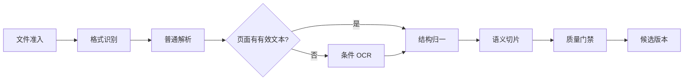
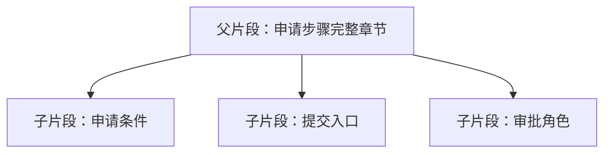

# RAG 数据导入：解析、OCR、清洗与语义切片

一份 30 页的操作手册同时包含标题、正文、表格、截图和代码。最简单的导入方式是提取纯文本后每 500 字切一段，但这样会把表头和数据分开、丢掉标题路径，也无法告诉引用来自哪一页。

RAG 的上限经常在检索前就被决定了。本章从文件进入系统开始，建立一条可重放的数据链：识别格式、普通解析、条件 OCR、结构归一、语义切片、质量门禁和候选发布。

## 先定义导入产物

检索器真正需要的不是“一大段文字”，而是一组可追溯片段。一个片段至少包含：

| 字段 | 用途 |
| --- | --- |
| `chunkId` | 稳定标识，用于去重、引用和更新 |
| `text` | 参与检索与生成的正文 |
| `headingPath` | 例如“账号管理 / 远程访问 / 申请步骤” |
| `blockType` | 段落、列表、表格、代码等 |
| `sourceLocation` | 页码、段落或字符区间 |
| `parentId` | 指向更完整的父片段 |
| `neighbors` | 相邻片段标识，便于扩展上下文 |
| `sourceVersion` | 说明来自哪次文档版本 |

`chunkId` 不宜使用数据库自增 ID 作为内容身份。可以根据来源版本、结构路径和规范化内容生成稳定摘要。同一版本重复导入得到相同 ID，内容改变则生成新版本。

## 完整流水线



每一步都保存输入、输出、解析器版本和失败原因。这样解析器升级后可以从原文件重建，而不是在旧片段上继续打补丁。

## 第一步：文件准入不只看扩展名

上传名为 `manual.pdf` 不代表内容真是 PDF。准入阶段检查：

- 文件大小与数量上限；
- MIME 嗅探和文件签名；
- 支持的格式白名单；
- 压缩包层级和解压大小；
- 恶意文件扫描；
- 内容哈希与重复上传；
- 原文件进入隔离对象存储。

解析器在受限 Worker 中运行。文件名、文档元数据和内嵌链接都属于不可信输入，不能拼进 shell 命令或本机路径。

## 第二步：普通解析先保留结构

不同格式需要不同解析器：PDF 关注页面、文本块和坐标；DOCX 关注段落样式、表格和列表；HTML 关注标题、正文与导航噪声；Markdown 关注语法树。

统一产物可以是一组 Block：

```text
Heading(level=1, text="远程访问")
Paragraph(text="远程办公人员在申请前……")
Heading(level=2, text="申请步骤")
ListItem(text="确认设备符合安全要求")
Table(headers=["角色", "审批人"], rows=[...])
Code(language="bash", text="...")
```

先保留结构，再转换成纯文本。若一开始就把所有内容连成字符串，后面无法可靠恢复表格、标题和代码边界。

## 第三步：只对缺失页面做 OCR

OCR 是 Optical Character Recognition，把图片中的字识别成文本。它比普通文本提取更慢，也会产生错字，所以不应该对所有 PDF 页面无条件执行。

可以按页判断：

1. 普通解析是否得到足够非空文字；
2. 页面是否包含大面积图片；
3. 文字是否只有页眉页脚等噪声；
4. 文档是否被加密或解析失败。

只有疑似扫描页进入 OCR。OCR 结果要标记来源和置信信息，不能伪装成原生文本。OCR 服务失败时，页面标为失败并阻止发布；不要把空页当成成功。

### OCR 后还要做版面恢复

单纯识别字还不够。双栏页面可能把左右列交叉拼接，表格可能按视觉顺序变成一列文字。版面分析需要恢复阅读顺序、块坐标和表格结构。

质量抽查可以选：第一页、末页、图片密集页、表格页和随机页，比较原页面与结构产物。没有条件做自动版面评测时，至少保留可视化抽查入口和失败标记。

## 第四步：清洗只删除确定的噪声

清洗的目标是减少重复页眉、页脚、不可见控制字符和导航噪声，不是把所有标点与换行删掉。换行、列表符号和代码缩进可能携带结构。

适合确定性处理的内容：

- Unicode 规范化；
- 重复空白的保守合并；
- 根据多页重复频率识别页眉页脚；
- 统一换行符；
- 修复可确认的断词；
- 保留原文与清洗后文本的映射。

不要使用模型“润色”知识原文后再索引。润色会改变事实和引用位置。模型可以辅助分类异常块，但原文是证据真相源。

## 第五步：按语义边界切片

切片要同时满足检索精度和回答上下文。太大时主题混杂，太小时缺少完整语义。

推荐从结构规则开始：

1. 标题开启新的语义区域；
2. 段落、列表项、表格和代码是不可随意打断的 Block；
3. 小 Block 在同一标题下合并；
4. 超大 Block 再按句子或 Token 上限递归拆分；
5. 保存父子关系和相邻关系；
6. 给片段补充标题路径，但不重复整篇标题树。

表格适合同时保存结构化行和可检索文本。例如一行可以转成“角色：申请人；审批人：直属负责人”，但引用仍指向原表格位置。

### 父子片段解决精确召回与完整回答的矛盾

子片段短，适合计算相似度；父片段包含完整章节，适合提供给模型。检索命中子片段后，可以按预算取父片段或相邻片段，避免把整篇文档塞入上下文。



扩展上下文前仍要检查父片段和相邻片段属于同一授权范围与版本。

## 第六步：用质量门禁阻止静默丢失

流水线“没有抛异常”不等于数据完整。发布前建立门禁：

| 检查 | 说明 |
| --- | --- |
| 页面覆盖 | 每页有解析结果、明确空白或明确失败 |
| 字符覆盖 | 归一和切片后的有效字符与解析产物接近 |
| 结构覆盖 | 标题、列表、表格、代码数量变化可解释 |
| 稳定 ID | 同一输入与解析器版本可重复生成 |
| 引用回溯 | 随机片段能回到来源位置 |
| OCR 状态 | 需要 OCR 的页面没有被静默跳过 |
| 大小分布 | 极短和超大片段比例在可审查范围 |

阈值取决于格式和业务，不能在所有文档上套一个数字。关键是异常必须阻止候选版本激活，旧版本继续服务。

## 做一次纸面实践

选一份包含两级标题、列表和表格的公开文档，手工产出 5–10 个 Block。再按以下过程切片：

1. 标记标题路径；
2. 保持列表和表格结构；
3. 合并同主题短段；
4. 为每个片段写来源位置；
5. 生成稳定 ID 组成；
6. 从任意片段回查原文。

如果一个片段离开原文后无法判断主题，说明标题上下文不足；如果多个主题挤在同一片段，说明边界过大；如果引用找不到原位置，说明数据模型还没有完成。

## 生产边界

- 解析和 OCR 属于资源密集异步任务，应与在线 Agent 队列隔离；
- 原文件、解析产物、片段和索引都带版本；
- 候选数据通过门禁后才原子激活；
- 删除来源时要处理对象、片段、向量和缓存；
- 解析日志不记录敏感全文；
- 外部解析器升级要用固定样本回归。

下一章处理 Embedding。它只接收已经合格的文本片段；如果导入阶段丢掉了标题和表格，再好的向量模型也找不回来。

## 参考资料

- [Unstructured 文档元素与分区](https://docs.unstructured.io/open-source/core-functionality/partitioning)
- [PyMuPDF Text Extraction](https://pymupdf.readthedocs.io/en/latest/recipes-text.html)
- [Tesseract OCR Documentation](https://tesseract-ocr.github.io/)

