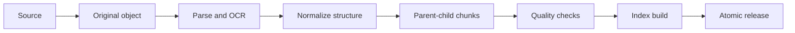
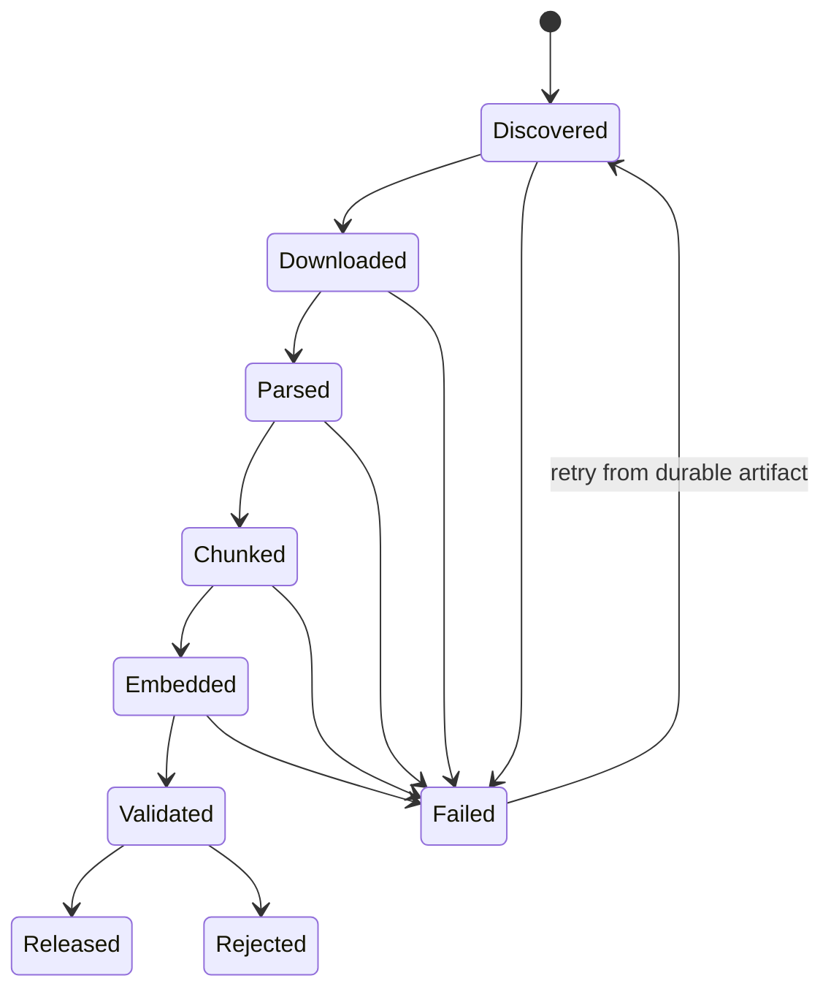

# RAG 数据处理流水线

RAG 的上限常常由数据处理决定。只把文档转成纯文本再按固定字符切块，会丢失标题层级、表格关系、代码边界和权限信息，后续再强的向量模型也无法恢复。

## 流水线分层



原始文件先进入对象存储并计算内容哈希。解析产物与解析器版本关联，使后续升级可以重建，而不必重新获取源文件。

一条稳定流水线要区分 Source、Object、Document、Revision 与 Release：

| 对象 | 含义 | 是否可变 |
| --- | --- | --- |
| Source | 外部来源连接与同步游标 | 可更新配置 |
| Original Object | 本次获取的原始字节和哈希 | 不可变 |
| Document | 业务上同一份文档的稳定身份 | 可指向新版本 |
| Revision | 某次内容、权限和解析版本 | 不可变 |
| Release | 一组可统一查询的 Revision 快照 | 发布后不可变 |

只用一个 `document` 表覆盖内容，会让正在检索的用户看到半更新状态，也无法解释回答使用了哪个版本。原始对象不可变后，解析器、切片或 Embedding 升级都可以从同一输入重建并比较。

```ts
type SourceObject = {
  objectId: string
  sourceId: string
  externalRefDigest: string
  contentDigest: string
  mediaType: string
  sizeBytes: number
  storageRef: string
  fetchedAt: string
}

type RevisionManifest = {
  revisionId: string
  objectId: string
  parserVersion: string
  chunkerVersion: string
  embeddingVersion: string
  aclVersion: string
  status: 'building' | 'validated' | 'published' | 'rejected'
}
```

`storageRef` 是内部受控引用，不能直接暴露给文章或模型。日志记录摘要与大小，不记录原文件路径和正文。

## 结构化解析

解析层保留文档树：标题、段落、列表、表格、代码、图片说明和页码。OCR 结果要记录坐标与置信度，不能与原生文本无差别混合。

外部输入始终是不可信数据。HTML 清理脚本、压缩包解包、超大文件和嵌套对象都要有资源限制，避免解析器成为攻击入口。

## 摄取入口与 SSRF/压缩炸弹

上传入口校验声明类型、Magic Bytes、大小和扩展名，不能只信 `Content-Type`。URL 导入限制 HTTP/HTTPS，解析 DNS 后拒绝环回、私网和云元数据地址；每次重定向重新校验。下载设置连接、读取、总时长和最大字节数，并将内容流式写入隔离临时对象。

压缩包先检查条目数量、展开后总大小、压缩比和路径。规范化每个路径后确认仍位于临时根目录，拒绝绝对路径、`../` 和符号链接逃逸。解析器运行在受限进程/容器，配置 CPU、内存、文件数和执行时间上限。

```python
def safe_archive_member(root: Path, member_name: str) -> Path:
    target = (root / member_name).resolve()
    if not target.is_relative_to(root.resolve()):
        raise ValueError("archive path escapes extraction root")
    return target
```

解析失败不删除原始对象。任务记录失败分类与 parser 版本，修复解析器后可精确重放。临时文件在任务终态后按归属清理，不能全局扫描删除来源不明目录。

## 解析路由与 OCR

不同文档需要不同解析策略：原生 PDF 优先提取文本与坐标，扫描 PDF 进入 OCR，Office 文档保留段落和表格，HTML 过滤导航与脚本但保留标题层级，代码按语言解析符号。

先做轻量探测再路由：页文本覆盖率、字体对象、图像占比和编码质量共同决定 OCR，不能因为 PDF 就全部 OCR。OCR 是昂贵且有误差的降级路径，保存页码、边界框、置信度和引擎版本，使后续能回到原页核对。

```python
class ParsedNode(TypedDict):
    node_id: str
    kind: Literal["heading", "paragraph", "list", "table", "code", "image_caption"]
    text: str
    page: int | None
    bbox: tuple[float, float, float, float] | None
    confidence: float | None
    parent_id: str | None
    ordinal: int
```

统一 ParsedNode 不是把结构抹平，而是提供下游可消费的文档树。表格额外保留行列单元格与合并关系，代码保留语言与符号路径，图片文字标记为 OCR/Caption 来源。

## 父子切片

小块提高召回精度，大块保留回答上下文。父子切片同时维护可检索子块和可展示父块：命中子块后扩展到父级语义范围，并保留章节路径。

切片策略按内容类型选择：表格按表头和行组，代码按符号或语法块，列表保持列表项关系，普通文本按标题和语义边界。固定 Token 上限是约束，不是唯一切分依据。

Chunk 至少保存：稳定 ID、Revision、父块、标题路径、正文、Token 数、内容摘要、页码范围、语言、ACL 引用和相邻块。稳定 ID 可以由 Revision、结构路径和规范化内容摘要生成，方便增量比较与引用。

```ts
type ChunkRecord = {
  chunkId: string
  revisionId: string
  parentChunkId: string | null
  headingPath: string[]
  text: string
  tokenCount: number
  pageRange: [number, number] | null
  previousChunkId: string | null
  nextChunkId: string | null
  contentDigest: string
  aclRef: string
}
```

段落短不代表应该和下一段机械合并。先按标题、列表、表格和代码等结构边界构建语义单元，再在 Token 上限内组合；超长单元才按句子或语言 tokenizer 二次切分。适当 overlap 用于跨边界语义，但过大 overlap 会制造大量近重复候选。

表格切片带上表名、列头、单位和行组。若只将每行转成一串值，检索命中“420”时无法知道它是延迟、金额还是数量。代码按类/函数/模块切片，父块保留导入和符号说明，不把半个函数切到另一个 Chunk。

## 去重与规范化

三层去重解决不同问题：

1. 原始字节哈希：完全相同文件不重复解析；
2. 规范化内容哈希：元数据不同但正文相同的 Revision 可复用派生产物；
3. 近重复检测：页眉页脚、模板说明和跨文档重复片段降权或标记 canonical。

规范化不能破坏证据。Unicode 规范、换行和空白折叠可以产生检索文本，但展示/引用仍保留原始解析文本。不要为了去重删除数字、标点或表格单位。

近重复用 MinHash/SimHash 或向量只是候选发现，最终按来源权威、更新时间和文档关系选择 canonical。不同权限范围的相同正文不能简单合并为一个无 ACL 对象。

## 权限与版本

ACL 是索引元数据的一部分，并在检索查询前过滤。发布时创建不可变知识版本，只有全部解析、切片、索引和质量检查成功后才原子切换当前版本。

撤销或权限变化要立即使旧索引不可见。不要让检索失败时自动回退到未授权的全局范围。

ACL 最好引用版本化策略，而不是在每个 Chunk 复制一段易漂移 JSON。索引存可高效过滤的租户、范围/主体或策略标签；检索先在数据库或搜索引擎查询中下推这些条件。

内容不变但权限变化也要产生新 Revision 或 ACL 版本，并通过安全失效通道优先更新。发布 Release 固定内容版本，安全撤权则可以覆盖 Release 的可见性，因为“可复现旧回答”不能成为继续泄露已撤权内容的理由。

```sql
SELECT c.chunk_id, c.text, c.heading_path
FROM chunks c
JOIN release_items ri ON ri.revision_id = c.revision_id
JOIN visible_scopes vs ON vs.scope_id = c.scope_id
WHERE ri.release_id = :release_id
  AND vs.actor_id = :actor_id
  AND c.tenant_id = :tenant_id;
```

实际模型应根据权限规模选择 ACL 表、RLS、预计算可见集合或搜索引擎过滤，但不应先全局召回再在应用层丢弃。

## 质量门禁

门禁包括解析覆盖率、乱码率、空块、重复块、块长度分布、标题路径、表格保真和抽样可读性。索引构建成功不代表内容质量合格。

每种媒体类型设独立门槛。扫描 PDF 的 OCR 置信度不能与原生 Markdown 使用同一阈值；表格需要检测列数漂移与空表头；代码检查语法块闭合。门禁产出机器指标和抽样页面，失败 Revision 留在 `rejected`，不进入 Release。

| 指标 | 发现的问题 | 处理 |
| --- | --- | --- |
| 文本覆盖率 | 页面未解析或 OCR 漏页 | 拒绝/换解析器 |
| Replacement 字符率 | 编码损坏 | 重解码或拒绝 |
| Chunk Token 分布 | 过碎或超长 | 调整策略并重建 |
| 重复率 | 模板/页眉污染 | canonical 或过滤 |
| 标题路径缺失率 | 结构丢失 | 解析器降级告警 |
| 表格矩形度/表头率 | 表格错位 | 专用表格解析 |
| 抽样引用可定位率 | 证据无法回到原位置 | 不允许发布 |

质量报告与 parser/chunker 版本绑定，便于新旧策略对比。仅比较 Chunk 数可能掩盖质量下降，要固定一组 Golden Documents 验证段落、表格、代码和 OCR 的预期结构。

## Embedding 和索引版本

Embedding 记录供应商、模型、维度、归一化、输入前缀和生成时间。不同维度不能放进同一向量列；即使维度相同，分布变化也不应混合比较。升级时旁路生成新索引，并在固定检索集上比较 Recall、延迟与成本。

```python
@dataclass(frozen=True)
class EmbeddingProfile:
    profile_id: str
    provider: str
    model: str
    dimensions: int
    normalized: bool
    preprocessing_version: str
```

Embedding 任务批量执行，受速率和 Token 预算约束。按内容摘要缓存相同 profile 下的向量，失败批次可以重试；缓存键包含完整 profile，不能在模型升级后误用旧向量。

全文、向量、表格和图索引都先关联候选 Release。只有各索引 manifest 完整且质量通过，Release 才能进入 ready。

## 增量更新

以来源标识和内容哈希判断新增、更新、删除。新版本在旁路构建，完成后切换 Release；失败时当前版本保持不变。删除同样需要进入版本差异，不能只新增不清理。

同步游标与内容状态分离。来源 API 返回同一更新时间不一定表示内容未变，关键数据仍计算摘要；来源丢失可能是暂时分页错误，删除需要经过完整同步标记或 tombstone，而不是单次未看到就立即删除。



任务步骤保存输入摘要与产物引用。重试从最近成功产物继续，不能把网络获取、解析、Embedding 全部重新跑一遍。步骤幂等键由 Revision、阶段和算法版本组成。

## 原子发布和回滚

Release manifest 列出所有 Revision 与索引版本。构建过程中查询服务仍固定当前 Release；完成后用一个事务或原子指针把 `active_release_id` 切到候选版本。多实例读取要通过共享存储或带短 TTL 的版本缓存，并支持立即失效。

```sql
UPDATE knowledge_spaces
SET active_release_id = :candidate,
    previous_release_id = active_release_id,
    version = version + 1
WHERE space_id = :space_id
  AND active_release_id = :expected_current;
```

条件更新失败表示期间已有其他发布，候选不能强行覆盖。回滚是把 active 指针切回仍完整可用的上一 Release，不需要删除当前候选；删除旧产物前先检查是否被当前或回滚版本引用。

发布后运行抽样检索与引用回链验证。若 Recall、错误率或权限检查异常，立即切回上一 Release，再分析候选。旧 Release 的保留周期根据恢复目标确定，不能构建完就清理。

## 任务并发、取消与恢复

同一 Source/Document 的并发同步通过租约或唯一约束合并。新内容到达时，可以取消仍在早期的旧 Revision；若已进入昂贵 Embedding 阶段，根据成本和复用价值决定完成但不发布，或协作取消。

Celery/队列重试是至少一次语义。每个步骤先查 manifest，已成功且输入版本相同则复用。取消写入持久状态，Worker 在文件页、Chunk 批次和 Embedding 批次间检查，并释放临时对象。

进度以实际单位报告，例如解析页数、生成 Chunk 数和 Embedding 批次数；不能用随时间增加的虚假百分比。终态明确区分 published、rejected、cancelled 和 failed。

## 验证：从解析 Golden Set 到发布故障演练

```python
def test_table_keeps_headers_and_units() -> None:
    parsed = parser.parse(fixtures.performance_table_pdf())
    table = next(node for node in parsed.nodes if node["kind"] == "table")
    assert table["headers"] == ["status", "p95 latency"]
    assert table["units"]["p95 latency"] == "ms"


async def test_failed_candidate_does_not_replace_active_release() -> None:
    active = await fixtures.published_release()
    candidate = await pipeline.build(fixtures.document_with_broken_encoding())
    assert candidate.status == "rejected"
    assert await release_store.active_id() == active.release_id
```

测试矩阵：

| 层次 | 用例 | 断言 |
| --- | --- | --- |
| 输入安全 | MIME 欺骗、超大文件、路径逃逸、SSRF | 在解析前拒绝 |
| 解析 | 原生 PDF、扫描 PDF、表格、代码、混合语言 | 结构与定位保留 |
| 切片 | 超长段落、列表、表格、函数 | 边界与 Token 合法 |
| 去重 | 完全重复、模板重复、不同 ACL 同文 | 不误合并权限 |
| Embedding | 限流、部分批次失败、模型升级 | 可恢复且版本隔离 |
| 发布 | 候选构建失败、并发发布、切换后回滚 | active Release 原子 |
| 删除 | 来源 tombstone、权限撤销 | 当前查询立即不可见 |
| 恢复 | Worker 被杀、对象存储短暂失败 | 从耐久产物继续 |

建立端到端 Eval：固定问题、允许范围和期望证据，分别在当前/候选 Release 运行 Recall@K、引用可定位率和权限泄漏数。候选必须在安全指标为零泄漏、质量不退化且成本可接受时发布。

## 可观测性与容量

Trace 串联 source fetch、object store、parse、chunk、embed、index、validate 和 release；属性记录版本、数量、字节、页数、Chunk 分布和错误分类，不保存完整正文。Metrics 关注队列积压、阶段耗时、失败率、OCR 比例、Embedding Token、重复率、拒绝率和发布耗时。

容量规划需要同时考虑原始对象、解析树、Chunk 文本、多个 Embedding 版本、索引构建临时空间和回滚 Release。若只按最终向量大小估算，模型升级时旁路双写很容易耗尽存储。

告警指向具体阶段：解析乱码突增可能是新来源格式；Chunk 数突降可能是解析器回归；Embedding 失败可能是配额；发布后零结果可能是 ACL 或 Release 指针错误。

## 发布决策记录

每次 Release 晋级保存一份不含正文的决策记录：候选与当前版本、输入对象数量、解析/切片/Embedding 配置、质量报告摘要、检索 Eval 差异、权限探针结果、审批者和回滚目标。这样“为什么当时允许发布”有可追溯证据，而不是只剩一条 CI 绿灯。

```ts
type ReleaseDecision = {
  candidateRelease: string
  championRelease: string
  artifactManifestDigest: string
  qualityReportRef: string
  retrievalEvalRef: string
  securityProbeFailures: number
  decision: 'promote' | 'reject'
  rollbackRelease: string
}
```

门禁失败不允许人工直接把状态改为 published。紧急例外应走独立、限时、带原因和补偿计划的审批，并在发布后形成必须关闭的风险项。权限探针失败永远不是可例外的普通质量波动。

## Schema 与算法变更的兼容期

索引消费者和构建器可能不同步部署。新增字段先让读取端兼容缺失值，再让构建端写入；删除字段则先停止读取，观察旧 Release 全部过期后再收缩。Chunk/Evidence 协议带 Schema 版本，检索服务拒绝自己无法解释的未来版本，而不是默默忽略关键 ACL 或定位字段。

算法升级同样使用双读或影子比较：候选 Chunker/Embedding 在旁路构建，查询回放比较召回与成本，不在同一 Release 中混合两个算法的部分产物。只有完整 manifest 通过后切换。

## 常见误区

- 把所有文档先转纯文本，丢失标题、表格、页码和代码边界。
- 固定字符切块，并把 overlap 当成唯一质量调节参数。
- 只保存最终 Chunk，不保存原始对象和算法版本，无法重建。
- 不同 Embedding 模型混用同一索引。
- 向量召回后再做 ACL 过滤，泄露候选并降低有效 Recall。
- 候选索引边构建边被线上查询，用户看到半发布状态。
- “索引成功”就发布，没有解析质量和引用定位门禁。
- 删除只影响主库，旧向量和缓存仍可召回。

## 参考资料

- [LangChain Document Loaders](https://docs.langchain.com/oss/python/integrations/document_loaders/)：文档加载器的格式入口与集成方式；格式可读不等于解析质量达标。
- [Apache Tika](https://tika.apache.org/)：通用内容检测与文本/元数据提取能力边界。
- [OWASP File Upload Cheat Sheet](https://cheatsheetseries.owasp.org/cheatsheets/File_Upload_Cheat_Sheet.html)：文件类型、大小、存储隔离与解析器攻击面。
- [OWASP SSRF Prevention Cheat Sheet](https://cheatsheetseries.owasp.org/cheatsheets/Server_Side_Request_Forgery_Prevention_Cheat_Sheet.html)：URL 导入、重定向和私网访问的网络边界。
- [Celery Tasks](https://docs.celeryq.dev/en/stable/userguide/tasks.html)：任务幂等、重试、确认和失败语义。
- [一文入门 LangChain.js，从 0-1 实现智能客服系统](https://juejin.cn/post/7504926961628364819)：我的 Loader、切片、Embedding 与 Vector Store 实践；本文补充发布、版本和质量门禁。
