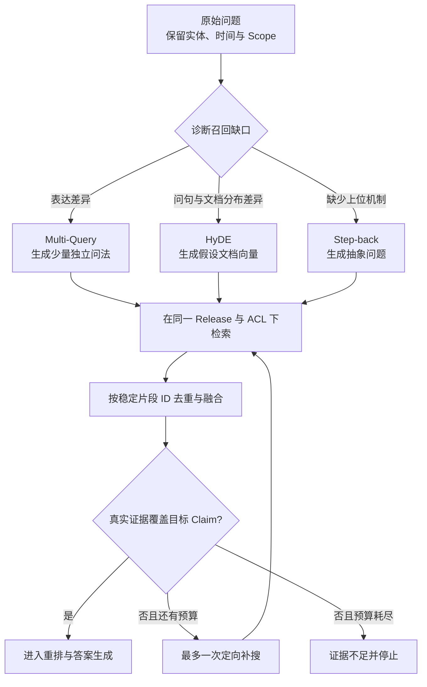

# Multi-Query、HyDE 与 Step-back：三种查询扩展怎样取舍

用户问：“更新服务后，为什么健康检查正常，但旧版本仍然在接收请求？”知识库里的原文可能写的是“代理配置尚未重新加载，上游进程未完成流量排空”。问题和答案表达差得很远，直接做一次向量检索容易只找到“健康检查”的说明，漏掉真正有用的“代理热加载”和“连接排空”。

这一篇要解决的不是“怎样让问题变长”，而是怎样在**不知道正确文档用词**时，生成少量、目标不同、可以被评测的检索查询。我们会分别实现 Multi-Query、HyDE 和 Step-back，并用同一份离线语料观察它们召回了什么、为什么会增加噪声、何时应该停止。

开始前要能看懂函数、列表和集合，并理解 Embedding 是“把文本映射成可比较向量”。如果查询本身含糊、权限范围不明确或知识版本没有锁定，应先解决这些问题；查询扩展不能修复错误的 Scope，也不能替你决定用户究竟想问什么。

## 先确认问题出在查询表达，而不是其他阶段

一条 RAG 链至少有四个可能丢失信息的位置：文档解析、切片、查询表达和候选排序。只有相关片段已经正确入库，并且直接查询主要因为用词不一致而漏**召回**时，查询扩展才对症。

| 观察到的现象 | 更可能的问题 | 先做什么 |
| --- | --- | --- |
| 原文页根本没有进入知识库 | 解析或发布失败 | 检查导入状态和知识版本 |
| 相关句子被切成不完整片段 | 切片失败 | 调整结构保留与父子片段 |
| 换成文档里的词就能搜到 | 查询表达差异 | 尝试本篇三种策略 |
| 候选中已有正确片段，但排在很后 | 融合或重排问题 | 调整 RRF、Rerank 和证据预算 |
| 指定范围内没有资料 | 证据不存在 | 拒答或请用户补充，不做越界扩展 |

这张表非常重要。很多系统一看到“召回差”就让模型生成十个问题，结果只是用更多请求掩盖解析和权限错误。

## 三种策略改变的不是同一个东西

### Multi-Query：从多个表达角度寻找同一答案

**Multi-Query** 的输入是原始问题，输出是若干个仍然可以独立执行的查询。它解决的是“一种问法覆盖不了文档中的多种表达”。例如原始问题中的“旧版本还在接请求”，可以被改写为：

1. 反向代理更新 upstream 后旧连接为什么仍然存在；
2. 发布切流时怎样排空 keep-alive 或长连接；
3. 健康检查通过与流量切换完成有什么区别。

三条查询应当共享原问题的实体、时间和 Scope，但关注不同术语。它不是让模型输出同义句列表，更不能加入原问题中没有的服务名、故障原因或权限范围。

内部状态可以写成 `原问题 -> 查询候选 -> 校验后的查询集合 -> 各路 Top-K -> 去重候选`。程序要做三项确定性检查：查询数量上限、与原问题的关键实体一致、重复查询去除。模型只负责提出候选表达。

Multi-Query 适合缩写、同义词和不同团队术语并存的知识库。它的代价是检索次数随查询数量增加，宽泛改写还会带来大量主题相近但不能回答问题的片段。

### HyDE：先生成“可能的答案文本”，再检索相似文档

HyDE 是 Hypothetical Document Embeddings 的缩写，可以译为“假设文档向量”。它不直接用问题做向量查询，而是让模型写一段**像答案文档的假设文本**，再把这段文本做 Embedding。

为什么可能有用？问题通常很短，包含疑问词；知识片段通常是陈述句，包含过程、原因和术语。假设文本把问题转换成更接近文档分布的形式。例如模型可能生成：“切换 upstream 后，已有长连接继续绑定旧进程，代理需要重新加载并等待连接排空。”即使这段话不是事实，它也可能把向量检索带到正确的文档区域。

这里最容易误解的一点是：**HyDE 文本只是一把检索钥匙，不是答案证据。** 它不能出现在引用中，不能被 Claim 验证器当原文，也不能在没有真实证据时补全答案。最终回答只能使用实际检索到且用户可见的知识片段。

**HyDE** 适合查询很短、问题式表达与文档式表达差异大的场景。它不适合精确编号、错误码、函数名和日期查询，因为模型生成的假设文本可能改坏这些精确条件。它还多出一次模型调用，需要单独记录延迟、Token 和生成版本。

### Step-back：先问上位原理，再回到具体问题

**Step-back** 的输入同样是原问题，但输出不是同义改写，而是一个更抽象的上位问题。对于前面的例子，上位问题可以是“反向代理切流和连接生命周期是怎样工作的”。它先召回原理、约束和术语，再用这些背景帮助处理具体问题。

它解决的是“问题过于具体，检索器只盯住表面词，却缺少解释问题所需的机制”。典型场景包括故障诊断、跨章节推理和“为什么”问题。抽象后的问题应该保留领域边界，却去掉偶然细节；如果抽象成“服务为什么有问题”，信息已经少到没有检索价值。

Step-back 通常产生两组证据：具体查询证据回答“当前发生了什么”，抽象查询证据解释“机制为什么如此”。两组证据需要分别标记来源，不能用原理文档替代具体配置或当前版本事实。

## 把三条路径放进同一执行链



图中 `D` 不是让模型随意选择昂贵策略。程序先读取查询类型、首轮召回分布和剩余预算，再决定是否开放某条路径。三种策略的检索都必须带相同的用户 Scope 和知识 Release。`F` 只合并真实片段，HyDE 的假设文本不会进入候选。`V` 检查的是目标 Claim 覆盖，不是候选数量；十段背景材料也不等于一个关键结论有证据。回边只有一次，避免扩展变成无限研究。

## 建立一个可观察的离线实验

下面的实验不调用真实模型，也不依赖第三方包。它把三种策略的输出固定下来，目的是让你先看懂输入、查询变体、候选合并和指标计算。输入是三条匿名知识片段和一个问题，预期看到每种策略返回的片段 ID、Recall@K 和新增检索次数。

```python
# 实验对同一问题生成三类扩展查询，记录每条候选、额外调用和最终召回集合，便于逐项比较。
from __future__ import annotations

from dataclasses import dataclass
from typing import Literal


Strategy = Literal["direct", "multi_query", "hyde", "step_back"]


@dataclass(frozen=True)
class Chunk:
    chunk_id: str
    text: str


@dataclass(frozen=True)
class Expansion:
    strategy: Strategy
    queries: tuple[str, ...]
    synthetic_texts: tuple[str, ...] = ()


CORPUS = (
    Chunk("c-health", "健康检查只证明候选进程可以响应探针。"),
    Chunk("c-reload", "修改代理上游后需要校验配置并热加载。"),
    Chunk("c-drain", "旧进程应停止接收新请求，并等待已有长连接排空。"),
)


def tokenize(text: str) -> set[str]:
    """用空格切词模拟检索；真实系统会替换为全文或向量检索。"""
    return {token.strip("，。？：") for token in text.split() if token.strip()}


# 查询函数只接收业务查询参数；可信 Scope、版本和上限由调用侧一并传入。
def retrieve(query: str, *, limit: int = 2) -> list[str]:
    query_terms = tokenize(query)
    scored = [
        (len(query_terms & tokenize(chunk.text)), chunk.chunk_id)
        for chunk in CORPUS
    ]
    # 排序键先按相关度降序，再用稳定 ID 打破同分，重复运行才能得到相同顺序。
    ranked = sorted(scored, key=lambda item: (-item[0], item[1]))
    return [chunk_id for score, chunk_id in ranked if score > 0][:limit]


# 构造函数把已验证字段组装成下游对象，不在这里引入新的权限或业务决策。
def build_expansion(strategy: Strategy) -> Expansion:
    if strategy == "direct":
        return Expansion(strategy, ("健康检查 旧版本 请求",))
    if strategy == "multi_query":
        return Expansion(
            strategy,
            (
                "健康检查 旧版本 请求",
                "代理 上游 热加载",
                "旧进程 长连接 排空",
            ),
        )
    if strategy == "hyde":
        hypothesis = "代理 热加载 后 旧进程 等待 长连接 排空"
        return Expansion(strategy, (), (hypothesis,))
    return Expansion(
        strategy,
        ("健康检查 旧版本 请求", "代理 切流 连接 生命周期"),
    )


# 入口函数按固定顺序编排各步骤，具体校验和副作用仍由各自函数负责。
def run_expansion(expansion: Expansion) -> list[str]:
    ranked_ids: list[str] = []
    retrieval_inputs = expansion.queries + expansion.synthetic_texts
    for query in retrieval_inputs:
        for chunk_id in retrieve(query):
            if chunk_id not in ranked_ids:
                ranked_ids.append(chunk_id)
    return ranked_ids


# 这个指标函数只处理已标注的排序或布尔结果，不把生成文本质量混入检索指标。
def recall_at_k(ranked: list[str], relevant: set[str], k: int) -> float:
    found = relevant & set(ranked[:k])
    return len(found) / len(relevant)


RELEVANT = {"c-reload", "c-drain"}
for name in ("direct", "multi_query", "hyde", "step_back"):
    expansion = build_expansion(name)  # type: ignore[arg-type]
    # 排序键先按相关度降序，再用稳定 ID 打破同分，重复运行才能得到相同顺序。
    ranked = run_expansion(expansion)
    print(name, ranked, recall_at_k(ranked, RELEVANT, k=3))
```

`Chunk` 保存真实语料，`Expansion` 刻意把真实查询与 HyDE 假设文本分开，防止后续误当证据。`retrieve` 是一个可解释的词项重叠检索器：它先计算交集大小，再按分数和稳定 ID 排序。真实系统可以替换这一个函数，其他实验结构不用改变。

`build_expansion` 模拟模型输出，但候选数量由程序固定。`run_expansion` 依次检索并按稳定片段 ID 去重，保留首次出现的顺序。`recall_at_k` 用人工标注的 `RELEVANT` 计算前 K 个结果覆盖了多少相关片段。这个实验只比较召回，不代表最终答案质量。

预期输出中，直接查询通常只命中健康检查；Multi-Query 与 HyDE 能补到热加载或连接排空。Step-back 是否有效取决于语料里有没有上位机制文档。这正是需要真实**评测**集的原因：策略名称本身不保证改进。

## 给实验加上停止条件测试

下面的测试直接调用查询扩展实现。测试目标不是证明哪种策略永远最好，而是锁住三个工程边界：扩展数量有限、HyDE 不进入证据集合、重复片段只保留一次。

```python
# 测试锁定最大查询数、空扩展和实体守恒，防止扩展策略在低收益时继续消耗预算。
from query_expansion import build_expansion, run_expansion


def test_multi_query_has_a_fixed_budget() -> None:
    expansion = build_expansion("multi_query")
    assert len(expansion.queries) <= 3


# 这个用例核对证据与引用关系，防止无来源 Claim 被当成已经验证的答案。
def test_hyde_text_is_not_returned_as_evidence() -> None:
    expansion = build_expansion("hyde")
    # 运行一次完整流程并保存显式结果，下面检查终态以及是否留下多余副作用。
    result = run_expansion(expansion)
    assert all(text not in result for text in expansion.synthetic_texts)


def test_results_are_deduplicated() -> None:
    result = run_expansion(build_expansion("multi_query"))
    assert len(result) == len(set(result))
```

执行 `python query_expansion.py` 查看各策略的候选和 Recall，再执行 `python -m pytest -q`。三个测试分别约束查询预算、证据来源和去重状态。真实项目还要测试超时、模型返回空列表、实体被改写、ACL/Release 丢失以及查询扩展模型不可用的降级路径。

## 生产实现还要补四层保护

### 结构化输出和实体守恒

扩展模型应返回受 Schema 约束的对象，而不是一段用换行符拆分的文本。每个候选至少包含 `query`、`purpose` 和 `preserved_entities`。服务端比较必须保留的错误码、版本号、专有名词与时间范围；丢失时删除该候选，而不是指望后面的 Rerank 修复。

### 同一权限和知识快照

原问题、改写查询、HyDE 和 Step-back 都只是检索表达，不能改变 `tenant_id`、`scope_ids`、`release_id` 和允许的数据源。可信字段由服务端附加。任何一路查询如果使用了不同 Release，融合结果就可能同时包含新旧结论。

### 独立预算和可降级路径

查询扩展要有自己的模型超时、最大查询数、总检索次数和 Token 上限。扩展失败时可以退回直接查询；直接查询已有足够证据时根本不应启动扩展。超时、无结果和证据不足是不同终态，日志中要保留原因码。

### 版本化和可重放

记录策略名、提示模板版本、模型版本、生成的查询、过滤条件、各路候选和耗时。否则离线指标变化时，你无法判断是索引变化、模型变化还是查询扩展变化。

## 怎样做选择，而不是三个都开

| 查询特征 | 首选策略 | 不优先选择的原因 |
| --- | --- | --- |
| 缩写、同义词、团队术语多 | Multi-Query | HyDE 可能凭空补原因 |
| 短问句与长文档表达差异大 | HyDE | 精确词查询会被假设文本稀释 |
| “为什么”“原理是什么”且缺背景 | Step-back | 多个同义问法仍缺上位机制 |
| 错误码、ID、版本号 | 直接/精确检索 | 三种扩展都可能改坏精确条件 |
| Scope 不明确 | 先澄清 | 扩展越多，越权风险越大 |
| 首轮已经覆盖全部证据目标 | 不扩展 | 只会增加成本和**噪声** |

上线判断至少同时看 Recall@K、MRR 或 nDCG、最终 Claim 支持率、无关候选比例、P95 延迟和每请求额外模型调用。只看 Recall 很危险：把整个知识库都返回，Recall 会很高，但上下文无法使用。

## 留给工作的策略对照卡

为真实项目选 20 到 50 个已标注问题，给每个问题记录：直接查询结果、扩展策略、生成查询、相关片段、无关片段、额外 Token、额外延迟和失败原因。先离线比较，再只对确有缺口的查询类型开放策略。

策略上线前应使用固定标注集比较直接查询与扩展查询，并保留生成的每条查询、额外成本和无关候选。扩展文本只是检索输入，永远不能自行升级为 Evidence。

## 常见问题

### Multi-Query 与普通同义词扩展有什么区别？

同义词扩展通常由词典确定性替换某些词，适合领域缩写和稳定别名；Multi-Query 由模型从不同表达角度生成多条完整查询，能覆盖用户措辞与文档写法差异，也更容易漂移。两者都必须保留实体、版本、时间和否定条件。Multi-Query 的结果要去重、限制数量并记录 purpose，再用离线 Recall 与噪声比例判断收益，不能因为模型生成了三句话就默认更全面。

### HyDE 生成的假设文档是不是答案草稿？

不是。HyDE 用模型生成一段“可能像相关文档”的文本，再对这段文本做 Embedding，以缩小短查询和长文档之间的表达差距。假设文本可能包含错误事实，只能作为查询表示，不能进入 Evidence、引用或最终答案。检索结果仍需来自当前 Scope 与 Release 的真实文档，并经过验证。Trace 应把 HyDE 文本与真实候选分开保存，防止后续节点误把模型猜测当来源。

### Step-back 为什么可能改善“为什么”类问题？

具体问题有时只包含局部症状，文档却按上位机制组织。Step-back 先构造更抽象的问题，例如从“为何升级后连接失败”退到“连接兼容性由哪些版本协商决定”，召回背景原理，再回到原问题结合具体证据。它不是把问题改得越泛越好；错误码、实体和范围仍要保留，抽象查询有独立候选预算。若直接查询已经覆盖必要证据，额外抽象只会增加噪声。

### 三种策略可以同时全部开启吗？

技术上可以，工程上通常不值得。每种策略增加模型调用、检索次数、候选重复、延迟和排障维度。先按失败类型选择：术语表达差异用 Multi-Query，短问句与长文档差距用 HyDE，缺上位背景用 Step-back；精确 ID 与错误码优先直接或全文查询。Router 输出有限枚举，首轮证据足够就停止。候选方案必须同时比较 Recall、nDCG、无关比例、P95 与成本。

### 怎样判断查询扩展发生了语义漂移？

对每条候选检查必须保留的实体、数字、版本、时间、否定条件和数据范围，并让结构化输出显式返回 `preserved_entities` 与 purpose。再在标注集上计算正确证据召回与无关候选比例，人工复查新增候选是否回答原问题。漂移查询应在检索前丢弃，不能寄希望于 Rerank 修复。若多数候选被拒，优先修触发条件与提示，而不是增加生成数量。

### 扩展策略失败时，系统应该怎样降级？

模型超时、Schema 无效或候选全部漂移时，可以退回原始查询，但要记录 `expansion_failed`，不能伪装成扩展成功。若直接查询已有足够 Evidence，本来就不应启动扩展；若直接查询也无结果，则按证据目标决定澄清、其他受控通道或拒答。降级仍继承原 Scope、Release 与 Deadline，重试不能重新获得预算。这样故障只损失可选增强，不会扩大权限或拖垮整轮。
