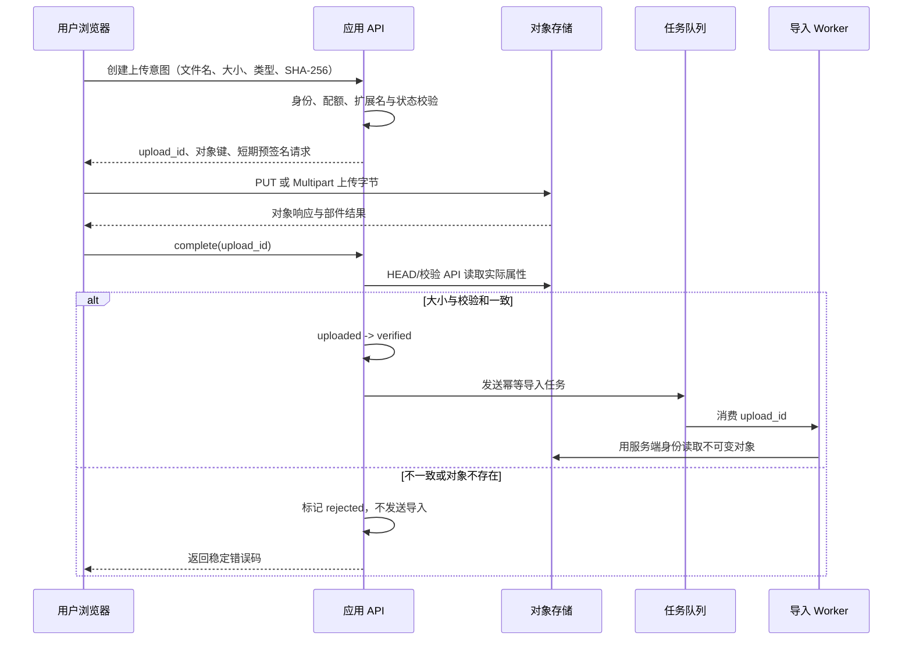

# RAG 的对象存储：文件、对象键、校验和与生命周期

一个 300 MB 的演示文稿上传到知识库时，应用 API 有三种常见做法：把字节塞进数据库、先写 API 服务器本地磁盘，或保存到**对象存储**。前两种在单机演示里能工作，到了多实例和异步 Worker 就会暴露问题：数据库备份被大文件拖慢，本地文件只在某一台机器上，容器重建后路径又消失。

对象存储适合保存不可变的大块字节。数据库仍保存“这是谁上传的、属于哪个知识空间、当前是什么状态、预期**校验和**是什么”；解析与检索层保存 Block、Chunk 和索引。三者必须通过稳定 ID 和状态对账，不能只存一个 URL 就认为文件管理完成。

每个候选 Release 都应能追溯到不可变的源字节。本文从创建上传意图、浏览器直传、服务端校验、触发导入，一直讲到未完成 **Multipart** 和孤立对象的清理边界。

## 对象存储不是“网络硬盘路径”

对象存储通常由 Bucket、Object Key、Object Bytes、Metadata 和版本/**生命周期**策略组成。

- **Bucket** 是管理边界，可以配置访问策略、加密、版本和生命周期；它不是租户权限的唯一边界。
- **Object Key** 是对象在 Bucket 内的标识。它看起来像路径，但多数对象存储没有真正目录树。
- **Object Bytes** 是原始文件字节。上传完成后应按不可变制品对待。
- **Metadata** 是大小、Content-Type、校验和、服务端加密等属性；业务状态仍应落数据库。
- **Version/Lifecycle** 控制历史对象和过期对象，不等于知识 Release。

**对象键**不要直接使用原始文件名。文件名可能冲突、包含路径穿越片段、暴露标题或在不同操作系统编码不一致。一个常见形式是：

```text
tenant/{tenant_id}/uploads/{upload_id}/source
```

这里的 ID 都由服务端产生。原始文件名作为经过清洗的展示元数据保存，不参与安全定位。公开示例里的 `tenant` 只是说明命名空间；真正授权仍在 API、数据库记录和对象存储策略中同时执行。

## 浏览器直传为什么仍需要应用 API

直传不是“前端拿永久密钥访问 Bucket”。正确流程是应用先校验用户身份和上传策略，创建一次上传记录，再签发只允许某个对象键、方法和短时窗口的预签名请求。浏览器把字节直接送到对象存储，完成后通知 API；API 重新从服务端查询对象属性并校验，成功后才创建导入任务。



浏览器输入的大小和 hash 只是“预期值”，不能作为最终事实。API 的 `HEAD` 或校验接口读取实际对象大小、服务端记录的校验和和版本标识。对象验证成功表示字节完整，不表示文件安全、解析成功或知识可发布；后面还有安全扫描、解析和 Release 门禁。

## 预签名请求到底授权了什么

预签名请求把一组有限条件签进 URL 或表单：HTTP 方法、Bucket、对象键、过期时间，某些实现还可绑定 Content-Type、大小区间和校验和头。它的作用是让持有者在短时间内完成指定上传，不暴露服务端长期 Access Key。

需要理解三个边界：

1. **预签名 URL** 在过期前通常相当于 bearer capability，泄露后别人可能使用，所以不要写普通日志或分析平台。
2. Content-Type 是声明，不是文件真实类型。完成上传后仍要检查 Magic Bytes 和解析器安全。
3. 上传成功不等于业务记录合法。API 仍要核对 `upload_id` 的所有者、状态、对象键和实际属性。

如果用户重复请求完成同一上传，服务端应幂等返回已验证状态；如果对象内容或校验和不同，进入 conflict/rejected，不能覆盖已验证对象。

## SHA-256、ETag 和对象版本不能混用

SHA-256 是对完整字节计算的内容摘要，适合完整性验证和重复内容识别。ETag 是对象存储返回的标识，其具体语义由实现和上传方式决定；在某些单段上传中它可能与 MD5 有关，但 Multipart、服务端加密或不同产品下不能把 ETag 当作文件内容 hash。

对象版本 ID 标识 Bucket 中某个对象版本，也不是内容摘要。相同字节可以有不同版本 ID，不同实现也可能关闭版本控制。

因此上传记录最好分别保存：

| 字段 | 用途 |
| --- | --- |
| `expected_sha256` | 客户端/创建意图声明的预期内容 |
| `verified_sha256` | 服务端流式读取或可信校验 API确认的内容 |
| `etag` | 对象存储条件请求与诊断信息 |
| `object_version` | 精确读取某个对象版本 |
| `size_bytes` | 配额、完整性和解析资源预算 |

对超大对象重复读取计算 hash 有成本，可以要求客户端在支持的 API 中提交校验和并由对象存储验证，再由服务端读取验证结果。无论采用哪种方式，文章和代码都要说明信任来源。

## Multipart 为什么能恢复，也为什么会留下垃圾

Multipart Upload 把一个大对象拆成多个 Part。每个 Part 可以独立重试，最后用 `upload_id + part_number + etag` 列表完成合并。它解决的是大文件单次失败需要从头上传的问题。

它的内部状态至少包括：

- 应用侧上传记录 ID；
- 对象存储 Multipart ID；
- 对象键；
- Part 大小与允许数量；
- 已完成 Part 编号和 ETag；
- 创建时间、过期时间和终态。

如果浏览器关掉页面，未完成的 Parts 不会自动变成业务对象，却可能继续占用存储。对象存储生命周期规则应终止超过时限的未完成 Multipart；应用对账任务还要把对应数据库记录标成 expired。只做其中一边，会出现存储已清理但 UI 永远显示 uploading，或数据库已过期但 Parts 继续计费。

完成请求必须验证 Part 编号无重复、顺序完整、总大小符合策略，再调用 Complete Multipart。完成以后，不应允许同一个记录追加新 Part。

## 表达上传状态和幂等完成

下面的代码模拟应用数据库中的上传记录。它不实现 S3 签名，也不连接真实 Bucket；目标是把状态、输入、输出和错误语义写清楚，方便在服务层单元测试。

```python
# 上传状态保存对象键、校验和与完成标记；重复完成请求必须返回同一对象而不创建副本。
from __future__ import annotations

from dataclasses import dataclass
from enum import StrEnum


class UploadStatus(StrEnum):
    CREATED = "created"
    UPLOADING = "uploading"
    UPLOADED = "uploaded"
    VERIFIED = "verified"
    REJECTED = "rejected"
    EXPIRED = "expired"
# ObjectFacts 表示一个可单独核查的事实单元，后续必须为它找到证据或明确拒绝。


@dataclass(frozen=True)
class ObjectFacts:
    key: str
    size_bytes: int
    sha256: str
    object_version: str


@dataclass
class UploadRecord:
    upload_id: str
    owner_id: str
    object_key: str
    expected_size: int
    expected_sha256: str
    status: UploadStatus = UploadStatus.CREATED
    verified_version: str = ""
    error_code: str = ""

    def mark_uploading(self) -> None:
        # 先检查当前状态是否允许继续推进，避免终态被重复任务或迟到结果覆盖。
        if self.status is not UploadStatus.CREATED:
            raise ValueError("upload can start only once")
        self.status = UploadStatus.UPLOADING

    def complete(self, facts: ObjectFacts) -> bool:
        # 先检查当前状态是否允许继续推进，避免终态被重复任务或迟到结果覆盖。
        if self.status is UploadStatus.VERIFIED:
            same = (
                facts.key == self.object_key
                and facts.size_bytes == self.expected_size
                and facts.sha256 == self.expected_sha256
                and facts.object_version == self.verified_version
            )
            if not same:
                raise RuntimeError("verified upload cannot change")
            return False

        # 先检查当前状态是否允许继续推进，避免终态被重复任务或迟到结果覆盖。
        if self.status not in {UploadStatus.UPLOADING, UploadStatus.UPLOADED}:
            raise ValueError("upload is not completable")

        self.status = UploadStatus.UPLOADED
        if facts.key != self.object_key:
            return self._reject("object_key_mismatch")
        if facts.size_bytes != self.expected_size:
            return self._reject("size_mismatch")
        if facts.sha256 != self.expected_sha256:
            return self._reject("checksum_mismatch")

        self.status = UploadStatus.VERIFIED
        self.verified_version = facts.object_version
        return True

    def _reject(self, code: str) -> bool:
        self.status = UploadStatus.REJECTED
        self.error_code = code
        return False
```

`ObjectFacts` 只能由服务端对象客户端产生，不能直接使用浏览器提交的 JSON。`mark_uploading` 阻止已结束记录重新开始。`complete` 有两个返回语义：第一次成功验证返回 `True`，表示调用方应发送导入任务；对同一事实的幂等重放返回 `False`，表示不应重复发任务。

完成过程先把对象标成 uploaded，再依次检查键、大小和 SHA-256。任何不一致都进入 rejected 并保存稳定错误码。已经 verified 的记录如果收到不同对象版本，会抛冲突，不会静默改指针。

## 对账任务怎样发现三类不一致

对象存储与数据库无法使用同一个 ACID 事务，因此“先建记录、后上传”和“先上传、后回调”之间一定有窗口。对账器定期比较两侧事实：

| 数据库状态 | 对象状态 | 判断 | 动作 |
| --- | --- | --- | --- |
| created/uploading 且未过期 | 不存在 | 正常等待 | 不处理 |
| created/uploading 且已过期 | 不存在或未完成 Multipart | 过期 | abort multipart，标记 expired |
| uploading/uploaded | 完整对象存在 | 回调可能丢失 | 重新走 `complete` |
| verified | 对象不存在/版本变化 | 严重一致性错误 | 阻止导入/发布，告警 |
| 无数据库记录 | 对象存在 | 孤立对象候选 | 进入保留期，不立即删除 |
| verified | 没有导入任务/结果 | 派发丢失 | 用幂等键补发 |

对账输出应分成 `retry_complete`、`abort_multipart`、`quarantine_orphan`、`repair_dispatch` 和 `manual_review`，而不是一个“自动清理”列表。删除是最后一步，必须再次检查引用。

## 删除边界：谁仍可能引用对象

原始对象可能被候选 Release、active Release、retained 回滚版本、正在运行的导入任务或正在生成下载链接的用户请求引用。清理器至少确认：

1. 上传已过保留期；
2. 没有 active/validated/retained Release 引用；
3. 没有 running/queued Worker 引用；
4. 没有合法的对象版本保留要求；
5. 数据库和对象存储两次扫描结果一致；
6. 删除动作有审计 ID，失败可重试。

“数据库没有这行”不能单独作为立即删除依据，因为可能是事务延迟、回调重试或灾难恢复中的顺序差异。先隔离并等待，再精确删除明确对象版本；不要对宽泛前缀执行递归删除。

## 本地怎样验证这一层

下面的 pytest 直接调用上传生命周期实现，覆盖以下用例：


为了验证“本地怎样验证这一层”，下面的测试把“本地替身验证预签名上传、校验和对账和孤立对象识别，不把模拟存储当作云端权限测试”变成可执行断言。每个用例自己构造输入，并用断言固定返回值或失败状态；某条测试失败时，可以从用例名直接定位到被破坏的契约。

```python
# 本地替身验证预签名上传、校验和对账和孤立对象识别，不把模拟存储当作云端权限测试。
def test_complete_is_idempotent() -> None:
    record = UploadRecord("u-1", "user-1", "uploads/u-1/source", 12, "sha256:abc")
    record.mark_uploading()
    facts = ObjectFacts("uploads/u-1/source", 12, "sha256:abc", "version-1")

    assert record.complete(facts) is True
    assert record.complete(facts) is False
    assert record.status is UploadStatus.VERIFIED


# 这个用例核对校验和与完成状态，重复完成或校验失败都不能重复派发导入。
def test_checksum_mismatch_never_dispatches_import() -> None:
    record = UploadRecord("u-2", "user-1", "uploads/u-2/source", 12, "sha256:abc")
    record.mark_uploading()

    # complete 同时校验对象大小和校验和，返回值决定是否允许派发导入任务。
    should_dispatch = record.complete(
        ObjectFacts("uploads/u-2/source", 12, "sha256:different", "version-1")
    )

    assert should_dispatch is False
    assert record.status is UploadStatus.REJECTED
    assert record.error_code == "checksum_mismatch"
```

第一条执行“首次完成 -> 相同请求重放”，只有第一次返回 `True`；第二条验证 checksum 不一致不会产生导入信号。运行 `python3 -m pytest -q` 应看到两条通过。真实集成测试还要用隔离 Bucket 验证预签名限制、Multipart abort、对象版本和生命周期，不要在生产 Bucket 制造垃圾对象。

## 排查“文件已上传但检索不到”

按以下顺序查，能避免一上来就调向量参数：

1. `upload_id` 是否属于当前用户，状态是什么；
2. 对象键和版本是否存在，实际大小/hash 是否匹配；
3. complete 是否成功，是否写入稳定错误码；
4. 导入任务幂等键是否创建，队列是否接收；
5. Worker 是否读取同一个对象版本；
6. 解析/切片/向量阶段在哪个终态；
7. 候选 Release 是否验证并激活；
8. 当前 Turn 是否固定了包含该文档的新 Release。

排查结束时应能解释对象存储、数据库元数据与搜索投影分别保存什么，能设计直传和 Multipart 的状态，并知道清理任务为什么必须先对账和检查 Release 引用。

## 常见问题

### 对象存储和普通文件路径的核心差异是什么？

对象存储以 Bucket、对象键和版本定位不可变字节，通过 API 读取，没有可依赖的本地目录锁、原子重命名和共享文件系统语义。数据库保存上传状态、归属、校验和与引用，对象存储保存内容，搜索索引保存派生投影。应用不能只把对象键当磁盘路径拼接，也不能通过“对象存在”推断上传已验证；必须结合版本、大小、hash 和数据库状态对账。

### 浏览器直传会不会绕过应用的权限控制？

不会自动绕过，前提是预签名请求由已认证的应用按当前用户创建，并限制对象键、方法、过期时间、大小和内容条件。浏览器只获得一次短期上传能力，不能持有永久存储密钥。上传完成后应用仍要调用存储端查询真实对象事实，核对大小、版本和 SHA-256，再把状态改为 verified。只相信客户端回报会让伪造完成和错对象关联进入导入链。

### ETag 为什么不能一律当成文件 MD5？

ETag 是对象存储的实体标识，具体计算方式取决于服务和上传方式。单段上传时某些实现恰好接近 MD5，Multipart、服务端加密或代理处理后通常不再等于整文件 MD5。需要内容完整性与幂等时，应显式计算并保存 SHA-256，同时记录对象版本与大小。ETag 可以用于条件请求和变化检测，但不能替代跨实现稳定的内容 hash。

### Multipart 上传中断后会发生什么？

已经上传的 Part 可能继续占用存储，但对象尚未完成，普通读取看不到最终内容。数据库需要保存 upload ID、已确认 Part 与过期时间；重试时只补缺失 Part，完成请求按稳定幂等键执行。后台清理扫描超时 Multipart 并 abort，但必须避开仍在续传的记录。若只删除数据库行而不调用存储端中止，碎片会长期积累；若过早中止，又会破坏合法恢复。

### 如何判断一个对象是孤立对象，可以安全删除？

对象存在但数据库没有上传记录只是候选信号，还要考虑事件延迟、事务失败、历史版本、active/retained Release 和正在运行的导入。对账任务先标记 orphan candidate，经过宽限期再次确认，并检查所有引用表和任务状态后才删除。删除应记录对象键、版本和原因，避免使用宽泛前缀批量清理。对账与引用检查让存储清理不会误删仍可回滚或仍被引用的源文件。
