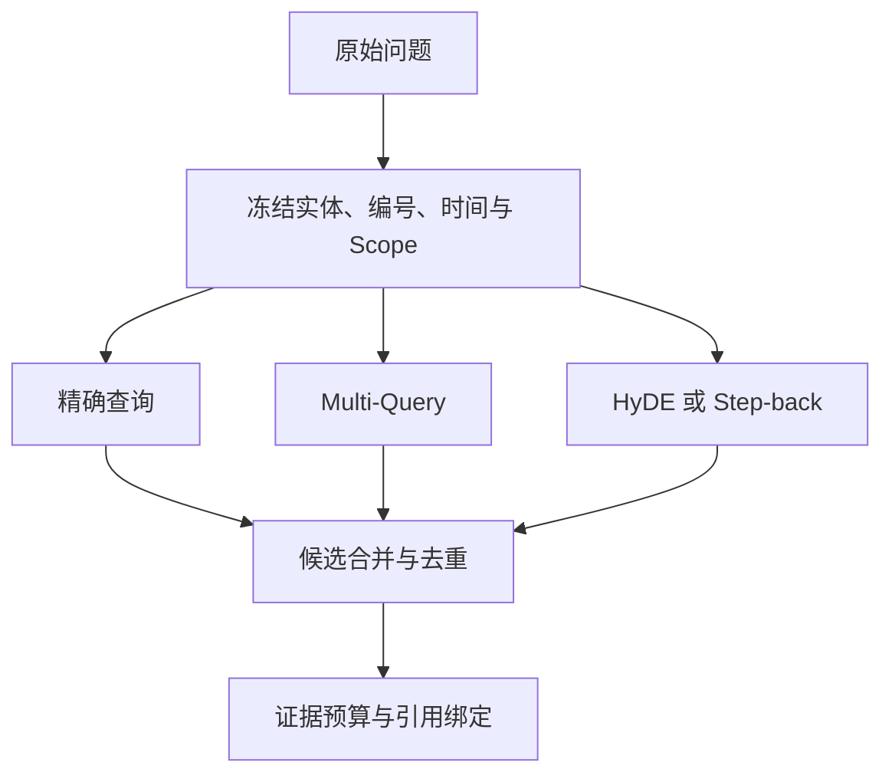

# 查询改写、问题分解与分支预算

用户输入“生产外部连接被拒绝的原因是什么”，原句可能很适合人读，却不一定适合每一条检索通道。全文搜索需要保留“外部连接”“拒绝”，向量检索可以换一种表达，结构化通道可能要寻找状态字段和审批条件。查询改写是在不改变问题约束的前提下，产生有限的检索候选。

改写不是把原问题交给模型，让模型随意扩写成一篇答案。**Multi-Query** 产生若干语义视角，**HyDE** 生成假设性答案文本作为向量查询，**Step-back** 把过窄的问题提升到更一般的规则层。三者都只能产生搜索输入，最终 Evidence 仍来自可见的真实 Source。

::: warning 改写不能改变请求身份

原始实体、编号、时间、否定、Scope、权限、Release 和 Deadline 在进入分支前固定。模型生成的改写只可补充表达，不可替换实体 ID、扩大范围、把历史查询变成当前查询，也不能把假设答案当事实。

:::

本文用一个知识库推演“RA-204 为什么在生产环境被拒绝”。原问题包含编号、环境和原因关系。精确查询锁定 RA-204，语义分支寻找拒绝条件，Step-back 分支查生产外部连接的一般审批规则，三个分支共享同一个用户范围和 Release。

## 改写前先冻结查询约束

查询理解得到结构对象后，改写器接收的是对象和原文，而不是一个没有身份的字符串。对象至少包含主意图、实体候选、identifier、时间范围、Scope、允许通道、禁止来源和剩余预算。缺少实体或范围时，先澄清，不进入分支生成。

以 RA-204 为例，程序确认它属于 node-17 的当前 Release，用户 U1 可以读取，查询意图是 explain_reason。固定上下文写入每个分支的元数据；模型可以把“被拒绝的原因”换成“拒绝条件”“申请未通过的规则”，但不能把 RA-204 换成相似编号，也不能把 node-17 改成全库。

改写结果带 branch_id、parent_query_hash、query_text、kind、scope、release 和过期时间。分支只是候选状态，未经检索和融合不能进入答案。Trace 保存生成失败和被过滤的分支，便于解释最终只使用了原问题。

严格通道通常优先执行。业务编号、错误码和结构字段可以直接查询，减少模型分支。若 exact 已经找到完整表格行，语义改写只补充原因，不再为同一身份生成大量同义查询。

## Multi-Query 怎样增加语义覆盖

Multi-Query 让模型或确定性规则从不同表达角度生成少量查询。例如原问题“生产外部连接被拒绝的原因”，可以得到“外部连接审批拒绝条件”“生产环境远程访问未通过的规则”“申请被安全策略拒绝时检查哪些字段”。它们可能命中不同措辞的 Chunk。

每个分支保留原始实体、时间与 Scope。生成器输出的自然语言不能自行加入“管理员”“高风险”等原文没有的条件；如果它提出新实体或角色，程序将它标记为候选词，需经过实体仓库或证据验证。

分支数量需要上限。三条高差异查询通常比十几条轻微改词更容易分析；上限依照模型调用、数据库候选、Rerank 和 Deadline 预算配置。重复分支按规范化文本哈希去重，过短、空白或包含越界 ID 的分支直接丢弃。

多分支检索并不等于把结果简单拼接。每条通道返回 Chunk ID、Source Version、Release 和分数，融合器按身份去重，再计算来源覆盖与证据多样性。相同 Source 的三个同义 Chunk 不应被当成三条独立证明。

Multi-Query 适合词面差异明显的概念问题，不适合精确编号替换和高风险命令。用户问“RA-204 的状态”时，分支可补充“该编号当前状态”，但 exact 通道仍是主路径；用户要求执行删除时，查询改写不应扩大工具动作。

## HyDE 的假设文本只是检索探针

HyDE 先让模型写一段假设性回答，再把假设文本向量化，寻找与它语义接近的真实文档。它可能帮助短问题匹配长篇规范，例如用户只问“申请为什么被拒”，假设文本包含“缺少负责人批准或不满足生产环境条件”，向量更容易接近制度说明。

假设文本不是事实。模型可能凭常识写出不存在的审批条件，向量服务若把它当答案返回，用户会看到生成内容而非知识库证据。HyDE 结果只能作为 dense 查询输入，Evidence 必须来自真实 Source；假设中的编号、角色和金额不能未经核验进入 Claim。

生成 HyDE 也要冻结 Scope、Release 和实体。当前用户只允许 node-17，假设文本不能引用另一个部门的制度；查询历史版本时，向量必须对固定历史语料生成，不得用最新规则填充。模型提示中可明确“不要补造事实”，但程序仍需执行版本和权限检查。

HyDE 增加一次模型调用和一段输入长度，预算不足或依赖超时可以跳过，退回原查询和其他通道。跳过记录为 degraded，不把“没有使用 HyDE”写成检索失败。高风险或精确编号问题通常不需要它。

评测 HyDE 要比较原查询、Multi-Query 和 HyDE 的 Recall 与错误类型。若 Recall 上升但假设文本导致无关主题增多，改进查询模板、限制候选或关闭该分支，而不是把假设写进索引。测试输入使用脱敏语料，不能把真实隐私带入模型。

## Step-back 怎样回答更一般的规则

Step-back 把具体问题暂时提升一级。例如“RA-204 为什么被拒绝”先保留对象定位，再检索“生产环境外部连接的审批和拒绝条件”。它适合原文没有逐字回答、但上层制度描述了判断原则的场景。

提升不能删除关键约束。原查询的对象、时间、Scope 和权限仍然保留在分支元数据；Step-back 文本只是额外查询，不会把整库制度都作为可见范围。得到一般规则后，系统再用 RA-204 的结构字段与精确 Source 绑定具体结论。

Step-back 也可能产生过宽主题。若问题是“RA-204 的状态”，提升到“所有远程访问状态”会返回很多无关表格；程序可以根据意图禁止 Step-back，或限制它只补条件 Chunk。分支预算不是越多越全面，过宽结果会挤掉精确证据。

最终答案区分两类证据：A 行说明 RA-204 的状态，B 规则章节说明拒绝条件。B 不能单独证明 A 当前就是该状态，A 也不能解释没有写入的规则。Claim 验证逐条绑定来源，防止把一般原则套到具体对象。

## 问题分解怎样避免拆出互相冲突的分支

复合问题“RA-204 当前状态、拒绝原因和重新申请条件”可以拆成三个子问题，但它们共享实体、Scope、Release 和用户权限。分解计划保存 parent_query_hash、子任务顺序或并行关系、输出字段和合并规则。

子问题一查 exact 状态，子问题二查拒绝条件，子问题三查重新申请条件。若第一条显示 RA-204 已被撤回，后两个子问题仍可读取历史规则，但不能把“重新申请”写成当前允许动作；合并器根据版本和状态处理冲突。

分解结果有缺口时要保留缺口。子问题二没有可见证据，答案可以给出状态和已知条件，并说明原因材料缺失；不能让另一个分支的相似句子填充。子任务失败、超时和空结果分别记录，汇合时由合同决定继续、追问还是拒答。

并行分支各自有局部预算，同时受总预算约束。一个分支消耗完时间，不能继续获得完整 Deadline；取消父任务时，未开始的子查询不应发送，已发出的请求等待安全取消。分支结果带来源身份，慢分支回来后不覆盖已经确认的新版本。

## 改写怎样保护编号、否定和时间

编号规范化可以把大小写、全半角和外围空白统一，但保留原始 Token 和精确比较值。改写器不能把 RA-204 拆成 RA 204 后只走向量；exact_terms 和结构字段继续使用规范化后的完整编号。

否定词必须出现在约束字段。查询“哪些情况不需要审批”，Multi-Query 可以生成“无需负责人批准的条件”，不能只生成“审批条件”；重排和答案验证还要检查候选是否支持“不需要”。对相反规则，词面相似不代表结论相同。

时间条件包含参考时间和目标字段。当前、去年、发布前、V2 都映射到明确 Release 或 Source 时间；没有映射时分支状态为 uncertain。HyDE 的假设文本不能把“去年”改成“现在”，Step-back 也不能脱离历史版本。

权限范围是最严格的边界。改写中的别名、实体和主题必须在 Scope 内解析，数据库所有通道都用同一用户和 Release；缓存键包含 parent query、分支、范围和配置。命中缓存后再次鉴权，改写生成的可见文本不能绕过 ACL。

## 分支预算怎样防止成本失控

总预算包括改写模型调用、HyDE 调用、查询分支数、每通道候选数、重排文档数、证据 Token 和剩余时间。计划生成时分配额度，子分支只继承剩余预算，不自己重新获得完整上限。

预算可以按意图决定：精确编号优先 exact，零或一条改写；开放式研究允许少量 Multi-Query；高风险工具参数不使用 HyDE；复合问题按字段拆分但限制并行数。分支选择写入 Trace，便于比较成本和召回变化。

达到分支上限时，保存已完成候选并停止生成，不重复调用模型消除“还有没有别的说法”的不安。所有分支超时，保留原查询通道；如果原查询也没有证据，进入安全空结果。调用失败不能让系统无限切换策略。

缓存可以复用稳定改写，但键必须绑定原始查询规范化结果、解析对象、理解器版本、Release、Scope 和策略版本。模型模板更新后，旧分支不应混用；命中缓存后仍校验当前授权。相同原句在两个用户范围内的缓存结果不共享。

## 一次分支执行的完整推演

U1 在 node-17 查询“RA-204 为什么在生产环境被拒绝”。理解器得到 identifier RA-204、实体 node-17、时间 current、意图 explain_reason，解析器确认 U1 可见 R3。预算允许 exact、一个 Multi-Query 和一个 Step-back，不启用 HyDE，因为精确对象已存在。

Exact 通道找到 Chunk A 的表格行。Multi-Query 生成“生产外部连接审批拒绝条件”，命中规则 Chunk B；Step-back 生成“生产环境外部连接的审批规则”，也命中 B 和章节父节点。融合器按 Chunk ID 去重，保留 A、B，并记录它们来自同一 Release。

重排器把 A 的对象身份和 B 的规则条件放入证据包。答案 Claim 一说明 RA-204 的状态，绑定 A；Claim 二说明拒绝条件，绑定 B。若 A 说“已撤回”而 B 是 R2 的旧规则，版本校验拒绝把 B 作为当前原因，并进入冲突或历史说明。

如果 Multi-Query 模型输出“管理员批准”但 B 没有这个词，候选查询仍可能命中 B，但“管理员”不进入 Claim。假设文本或改写短语只是召回探针，最终回答只使用真实 Evidence。若 Scope 过滤掉 B，答案说明当前范围无法找到拒绝规则，不扩大到其他目录。

执行状态为 received、understood、branches_created、retrieved、fused、validated、answered 或 refused。每个失败点有终止原因，重试只针对可重试依赖；父 Turn 取消后，分支停止新调用并保存部分结果。

## 怎样评估改写是否带来真实收益

查询集按语义同义、精确编号、否定条件、时间版本、别名冲突、复合问题和无答案分桶。每条记录目标 Source、必需字段、禁止来源、用户范围和 Release。比较原查询、Multi-Query、HyDE、Step-back 和组合策略的 Recall@K、MRR、Evidence 覆盖与越权数。

只看 Recall 会忽略假设答案污染和分支成本。记录每种策略的模型调用、候选数、重排 Token、耗时、重复比例和空结果原因。某策略提高 Recall 但增加大量无关候选，或让历史问题误用当前版本，不能直接启用。

精确编号回归要求策略始终返回正确 ID；同义问题要求至少一个相关 Source 进入候选；否定问题要求相反规则不进入最终 Claim；无权问题要求所有分支、缓存和 Graph 扩展都为空；取消问题要求未发送额外模型调用。每条失败关联 branch_id，复测可定位产生错误的改写。

候选策略采用影子运行。活动查询继续使用原策略，新策略只记录结构化分支与候选差异，不把 HyDE 文本或未授权内容显示给用户。通过离线与影子检查后再对少量明确范围启用，失败时按策略版本回滚，不修改知识内容。

查询改写的价值在于扩大表达覆盖，问题分解的价值在于拆开可验证字段，分支预算负责让探索停止。它们都不能改变实体、版本和权限，也不能把模型写出的假设变成事实。最终证据仍由真实、可见、可定位的 Chunk 决定。

## 改写器的实现契约与状态迁移

改写器最好被实现成一个纯粹的计划组件。它接收已经通过权限校验的 `QueryIntent`、可用 Release、剩余 Deadline 和策略版本，返回不可变的 `BranchPlan`。计划创建时，程序为每个分支分配 `branch_id`、父查询哈希、通道类型、局部预算和取消信号。后续检索器只消费计划，不再从分支文本重新推断 Scope，这样可以把“生成了什么”和“允许查什么”分开审计。

一个分支至少经历 `created`、`validated`、`dispatched`、`retrieved`、`discarded` 或 `failed` 等状态。进入 `dispatched` 前检查文本长度、敏感字段、实体候选和剩余预算；进入 `retrieved` 后检查返回结果的 Release 与 ACL。被丢弃的分支仍要留下原因，例如 `duplicate_query`、`scope_violation`、`budget_exhausted` 或 `invalid_time`，不能简单从 Trace 中消失。父 Turn 取消时，尚未发送的分支直接结束，已经发送的请求收到取消信号后等待安全收尾，融合器只接收状态明确的结果。

下面是一种最小的计划结构。它不是模型输出的答案，而是运行时可以验证的执行合同：

~~~python
from dataclasses import dataclass

@dataclass(frozen=True)
class BranchPlan:
    branch_id: str
    kind: str
    query: str
    scope_ids: tuple[str, ...]
    release_id: str
    max_candidates: int
    deadline_ms: int

def keep_branch(plan: BranchPlan, allowed_scopes: set[str], release_id: str) -> bool:
    return (
        plan.release_id == release_id
        and bool(plan.scope_ids)
        and set(plan.scope_ids) <= allowed_scopes
        and 0 < plan.max_candidates <= 20
        and plan.deadline_ms > 0
    )
~~~

输入是已经解析的范围和版本，输出是布尔判定；这个函数不能证明查询文本有答案，只负责阻止越权计划进入检索。生产实现还要把策略版本加入判定，测试则应覆盖空范围、过期 Release、负预算和候选数超限。模型生成失败可以退回原查询，但计划校验失败不能被“换一种写法”绕过。

## 正常路径、降级路径与终态设计

正常路径先执行 exact 和结构化通道，再按意图开启有限的 Multi-Query、Step-back 或 HyDE。每个通道将候选包装成统一记录，包含 Chunk 身份、来源版本、匹配方式、分数、耗时和证据可见性。融合器只在候选完成身份校验后去重，重排器也只能在剩余预算内工作。最终没有足够证据时，状态是 `no_evidence`，而不是让生成模型自行补齐空缺。

降级路径要有明确优先级。改写模型超时时保留原查询；向量服务不可用时保留 exact 和全文；重排超时时使用未经重排但已过滤的候选；所有通道均空时进入范围内拒答。降级不应改变权限和版本，也不应把“没有执行某策略”包装成召回成功。若父任务在融合前取消，终态记录 `cancelled` 和已完成分支数量；若在答案提交后才收到取消，不能撤销已经持久化的事实，只能在交付层标记未送达。

这些终态适合写入统一的回归表：输入类别、预期通道、允许分支、必须命中的 Source、禁止出现的来源、取消点和最终状态。对精确编号、否定条件、历史版本、无权限范围和完全无答案分别建立用例，避免只用一条开放式问题测试策略。每次改写器或模板升级，都先在影子模式比较分支差异，再决定是否调整活动策略；如果误把历史规则带入当前回答，回滚策略版本比重建索引更直接。

## 与查询理解、重排和证据预算的边界

查询理解负责确定问题结构，改写器负责在结构不变的前提下增加少量表达，重排器负责在候选已经被权限过滤后调整顺序，证据预算负责决定最终留下多少可引用材料。四者的输入输出不同，不能用“多生成几条查询”替代任何一个环节。尤其不能让改写器承担实体消歧、权限判断或答案验证，这些职责必须由确定性组件和证据模型完成。

当查询包含明确业务编号时，改写收益通常很小，增加分支反而会稀释精确匹配；当问题是开放性的概念比较，少量语义分支可能提高覆盖；当问题涉及删除、审批或其他副作用动作，改写只能帮助查规则，不能生成工具参数。最终采用哪种策略，应由离线评测、线上影子数据和失败成本共同决定，而不是凭“模型能够扩写”这一点就默认开启。

## 分支结果怎样进入证据包

改写分支完成检索后，候选不能直接交给回答模型。融合器先按 `chunk_id`、`source_version_id` 和 `release_id` 建立身份，去除同一段文本由多个分支重复命中的情况；再检查候选是否覆盖原问题需要的字段。一个来源同时命中三条同义分支，只计算一次来源覆盖，避免把重复命中误判成三份独立证据。

证据包还要保存分支类型和原查询约束。回答阶段可以知道某个候选来自精确编号、Multi-Query 还是 Step-back，但不能把分支措辞当作事实。若候选只回答了一般规则，却没有覆盖用户指定编号，Claim 只能写成规则说明；若精确行与一般规则来自不同 Release，验证器应把它们分为当前和历史，而不是强行合并成一个结论。

对于复合问题，合并器按字段而不是按文本拼接结果。例如“当前状态、拒绝原因和重新申请条件”需要三个证据槽位，每个槽位记录必需字段、候选来源和缺口。一个槽位为空时，其他槽位仍可正常返回，但最终答案必须明确缺口。这样能够区分“部分有证据”和“所有分支都失败”，也方便用户决定是否补充范围或问题。

## 空结果与冲突结果如何向上游反馈

空结果至少有三种：范围内确实没有可见材料、依赖服务在 Deadline 内没有返回、材料存在但版本或权限校验失败。它们的用户提示不同，Trace 也必须使用不同终态。前两者可以建议缩小问题或稍后重试，第三种不能通过扩大搜索范围绕过授权。缓存层也只能缓存合法空结果，不能把数据库超时缓存成知识不存在。

冲突结果需要保留双方来源和适用条件。当前 Release 的表格行说状态为“已撤回”，历史章节说“满足条件即可申请”，二者不一定矛盾，可能分别对应当前状态和历史规则。只有当同一实体、同一版本、同一字段出现相反值时，才进入冲突处理；验证器应停止生成确定结论，给出可定位的冲突材料或请求人工确认。

当所有候选都被过滤掉，改写器不得继续生成更多同义词。系统应记录过滤原因、剩余预算和最后一个可见状态，终止为 `scoped_empty` 或 `permission_denied`。这种停止点比无限扩写更有价值，因为它明确告诉调用方缺的是资料、授权还是依赖可用性。

## 什么时候应取消改写而直接检索

策略并非每次都需要模型参与。查询含完整编号、错误码、表格列或用户明确选择了单一 Source 时，确定性规范化和 exact 通道通常已经足够。查询包含执行动作、删除、审批或安全配置时，改写只能用来找规范说明，不能接触动作参数。预算接近 Deadline、用户要求快速确认或模型依赖不可用时，也应直接走原查询和严格通道。

取消改写要留下 `skipped_by_policy`，并把策略依据写入 Trace，例如 `identifier_present`、`high_risk_action` 或 `deadline_low`。这能让评测区分“策略主动选择单通道”和“模型调用失败”。上线观察中，如果跳过改写的查询 Recall 已经稳定，说明额外分支没有带来收益；如果某类自然语言问题长期漏召回，再针对该类别增加受限策略，而不是全局提高分支上限。

查询改写最终是一个受约束的检索计划生成器。它可以改变表达方式，却不能改变对象、时间、版本、范围和事实来源；它可以扩大候选覆盖，却不能扩大用户权限；它可以在预算内探索，却必须在没有证据时停止。把这些不变量写进状态、测试和 Trace，改写才会成为可维护的工程组件，而不是另一个不可解释的生成步骤。

落地时可先用确定性模板建立基线，再逐步加入单一策略。第一版只允许保留原查询和一条 Multi-Query，验证分支身份、Scope 和 Release 都没有漂移；第二版再对开放问题启用 Step-back；HyDE 必须单独评测，不能因为向量距离变近就默认上线。每次增加策略都要保留开关、预算和回滚版本，出现历史串读、越权候选或成本失控时，可以只关闭新增分支，继续提供基线检索。

这套演进顺序也决定了代码边界：规范化、范围检查和版本选择属于查询服务，分支生成属于策略模块，通道调用属于检索层，证据绑定属于回答前验证。模块之间只传递结构化计划和候选身份，不传递一段未经标注的自然语言上下文。这样即使某个策略被替换，权限过滤、停止条件和引用校验仍然保持不变，读者也能从 Trace 看出一次回答究竟使用了哪条路径。
