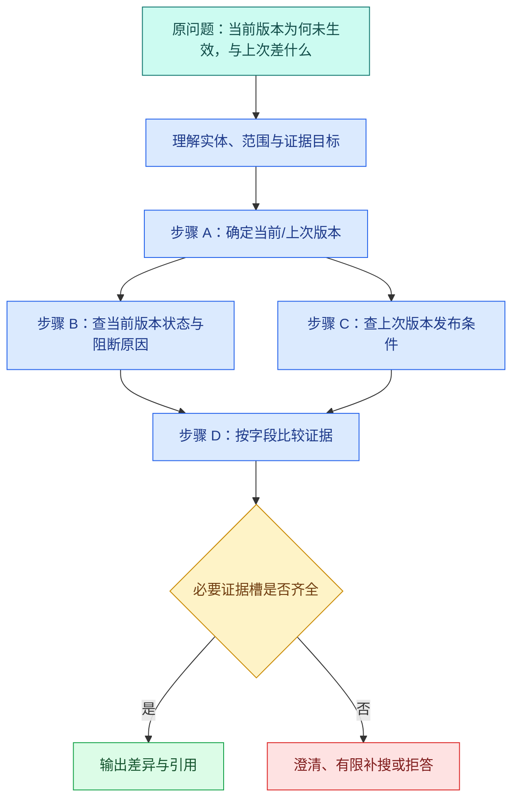

# 查询改写、问题分解与检索计划

用户问：“那个发布为什么还没生效，和上次相比少了什么？”

直接把整句话做向量检索，会遇到四个不确定项：“那个”指哪个版本，“上次”是哪一次，问题同时要求原因和差异，后一个目标可能依赖先找到当前版本。只把句子改得更正式，仍然没有明确检索步骤；随意拆成两半，又可能丢掉版本和范围。

查询工程要区分三个动作：**标准化**保持语义但修正可搜索形式，**改写**生成与资料表达更接近的查询，**分解**把多个证据目标变成有依赖和停止条件的 SearchPlan。模型可以提出这些结构，程序负责保护权限、版本、时间和数量上限。

索引建立后，口语问题还要转换成一份经过校验的检索计划。Multi-Query、HyDE、混合检索与 Rerank 都应消费同一份可信 **SearchPlan**，而不是各自重新猜权限和目标。

## 先固定不能被改写的可信约束

一次检索有两类字段：

| 字段来源 | 示例 | 模型能否修改 |
| --- | --- | --- |
| 用户问题 | 文本、用户明确指定的版本名和范围 | 可解析，不可反向扩大 |
| 服务端认证 | tenant、subject、ACL、允许知识空间 | 否 |
| Turn 快照 | knowledge Release、Deadline、剩余预算 | 否 |
| 模型理解 | 意图、实体候选、改写词、子目标 | 可以提出，必须校验 |

如果模型输出 `tenant_id="all"` 或 `release="latest"`，不能因为 JSON Schema 合法就接受。最稳妥的设计是这些可信字段根本不出现在模型 Schema 中，由 Runtime 在执行时注入。

用户明确说“只查访问手册”也属于范围收窄。改写可以把“访问”扩成“申请入口、权限开通”，但不能偷偷去掉“只查”并回退全库。

## 标准化：让同一个意思拥有稳定表示

标准化是确定性处理，目标是减少无意义差异，不创造新语义。常见动作包括 Unicode 规范化、空白合并、大小写处理、已知编号格式化、从站内别名字典映射规范名。

输入“  ERR－001  ”可以规范为 `ERR-001`；输入“SSO 登录”可以在已审核别名字典中映射到“单点登录”。标准化输出应保留原词和变换记录，便于发现字典错误。

不要默认删除停用词、否定词和时间词。“不能访问”和“能访问”的差别正是 `不能`；“旧版本”和“新版本”也不能被清洗成同一词袋。

标准化适合精确/全文通道，也可作为向量查询输入的一部分。它不是大模型润色，不需要为确定性映射付模型成本。

## 查询改写：改变表达，不改变任务

**查询改写**解决资料与用户表达不同的问题。它的输入是原问题、解析实体和允许的会话焦点；输出是一到数条语义等价或互补的搜索查询。

### 单查询改写

把口语、指代和不完整表达改成资料可能使用的完整术语。例如当前焦点已确定为“版本 8”，可以把“那个为什么没生效”改成“版本 8 未激活原因 发布状态 候选索引”。

指代解析必须有证据。如果会话里同时出现版本 7 和 8，不能猜“那个”是 8；应要求澄清，或生成带不确定实体的计划并禁止执行。

### 同义词与别名扩展

把“开权限”扩展为“访问申请、授权、权限开通”，适合 Exact/Sparse 召回。扩展词来自受控字典或模型候选后校验，不能无限堆词，否则查询会变宽、噪声上升。

### 伪相关反馈

第一轮检索后，从高置信候选抽取领域词再改写。这要求候选已通过 ACL 和版本过滤；不能从不可见候选学习扩展词，也不能因为第一轮错误就无限反馈。

改写质量要比较检索结果，不是比较句子是否“更专业”。同一 Gold Set 下 Recall 提升且禁止 ID 保持 0，才说明有效。

## 问题分解：把证据目标拆开

问题分解的输出不是几句同义问法，而是多个**不同证据槽位**。

“比较版本 7 和 8 的发布条件”可以拆为：

1. 找版本 7 的发布条件；
2. 找版本 8 的发布条件；
3. 基于前两份证据计算差异。

前两项独立，可并行；第三项依赖前两项，是确定性比较或生成步骤，不应与检索一起启动。

“找到当前版本，再查它为什么没有生效”则是依赖分解：第二步的查询参数需要第一步输出的版本 ID。把它们并行会让第二步缺输入。



步骤 A 的输出是版本实体，不是最终答案；B/C 的输出是 Evidence；D 的输入必须引用 B/C 的结果 ID。验证器检查依赖图无环、依赖存在、步骤数受限，以及所有检索都继承同一可信 Scope。

## SearchPlan 需要哪些字段

一个工程可用计划至少要表达：

```text
plan_version
original_question
normalized_question
steps[]:
  step_id
  kind: retrieve | compare | clarify
  query
  depends_on[]
  evidence_slots[]
  max_candidates
stop:
  max_steps
  max_retrieval_rounds
  deadline_ms
```

模型只生成允许的字段。tenant、Release、ACL、模型预算和绝对 Deadline 由 Runtime 合并。`evidence_slots` 表示成功需要覆盖什么，例如 `current_status`、`blocking_condition`、`previous_requirements`，比笼统的“找到相关资料”更容易验证。

计划版本让执行器能拒绝未知 Schema；`step_id` 用于依赖和 Trace；`kind` 限制步骤能力；每步候选上限防止模型把 K 改成任意大数。

## 用 Pydantic 建立模型输出边界

示例依赖 Pydantic 2。代码输入是模型生成的 JSON 字典，输出是通过字段、跨字段与图结构检查的 `SearchPlan`。

下面把“用 Pydantic 建立模型输出边界”落成最小实现。代码关注“Pydantic 只接收有限子问题、依赖和**停止条件**，禁止模型在计划中新增身份或数据范围”；输入从函数参数或上文定义的状态对象进入，关键分支负责校验或修改状态，返回值再交给后续调用。

```python
# Pydantic 只接收有限子问题、依赖和停止条件，禁止模型在计划中新增身份或数据范围。
from __future__ import annotations

from typing import Literal

from pydantic import BaseModel, ConfigDict, Field, model_validator

class SearchStep(BaseModel):
    model_config = ConfigDict(extra="forbid")

    step_id: str = Field(pattern=r"^s-[1-9][0-9]*$")
    kind: Literal["retrieve", "compare", "clarify"]
    query: str = Field(default="", max_length=300)
    depends_on: list[str] = Field(default_factory=list, max_length=4)
    evidence_slots: list[str] = Field(default_factory=list, max_length=6)
    max_candidates: int = Field(default=8, ge=1, le=20)

    # 校验函数在数据进入下一阶段前执行，失败时返回稳定错误或直接阻断。
    @model_validator(mode="after")
    def validate_kind(self) -> "SearchStep":
        if self.kind == "retrieve" and not self.query.strip():
            raise ValueError("retrieve step requires a query")
        # 数量约束用于发现截断、重复或越界返回，失败时不能把不完整结果交给下一步。
        if self.kind == "compare" and len(self.depends_on) < 2:
            raise ValueError("compare step requires at least two dependencies")
        if self.kind == "clarify" and self.depends_on:
            raise ValueError("clarify step cannot depend on hidden execution")
        return self

class SearchPlan(BaseModel):
    model_config = ConfigDict(extra="forbid")

    plan_version: Literal["search-plan-v1"]
    original_question: str = Field(min_length=1, max_length=500)
    normalized_question: str = Field(min_length=1, max_length=500)
    steps: list[SearchStep] = Field(min_length=1, max_length=8)

    # 校验函数在数据进入下一阶段前执行，失败时返回稳定错误或直接阻断。
    @model_validator(mode="after")
    def validate_graph(self) -> "SearchPlan":
        ids = [step.step_id for step in self.steps]
        # 数量约束用于发现截断、重复或越界返回，失败时不能把不完整结果交给下一步。
        if len(ids) != len(set(ids)):
            raise ValueError("step ids must be unique")

        position = {step_id: index for index, step_id in enumerate(ids)}
        for index, step in enumerate(self.steps):
            for dependency in step.depends_on:
                if dependency not in position:
                    raise ValueError(f"{step.step_id}: unknown dependency {dependency}")
                if position[dependency] >= index:
                    raise ValueError(f"{step.step_id}: dependency must appear earlier")
        return self
```

`extra="forbid"` 拒绝模型添加 `tenant_id`、`release_id` 或未知动作。`SearchStep.validate_kind` 检查不同步骤的业务条件：retrieve 必须有 query，compare 至少依赖两项，clarify 不能伪装成后台执行。

`SearchPlan.validate_graph` 先保证 ID 唯一，再要求依赖存在且只能指向前面的步骤。这个约束让列表本身成为拓扑序，执行器不需要处理环。它不能证明查询语义正确，后面还要保护不可变条件并进行人工/评测复核。

## Runtime 怎样合并可信 Scope

不要把 Scope 回填到模型对象后再序列化给模型。执行器接收两个不同对象：`SearchPlan` 和服务端 `ExecutionScope`。

下面把“Runtime 怎样合并可信 Scope”落成最小实现。代码关注“Runtime 丢弃模型产生的权限字段，并把服务端 Scope、Release 与 Deadline 注入每个检索任务”；输入从函数参数或上文定义的状态对象进入，关键分支负责校验或修改状态，返回值再交给后续调用。

```python
# Runtime 丢弃模型产生的权限字段，并把服务端 Scope、Release 与 Deadline 注入每个检索任务。
from dataclasses import dataclass

@dataclass(frozen=True)
class ExecutionScope:
    tenant_id: str
    release_id: str
    allowed_document_ids: frozenset[str]
    deadline_ms: int

@dataclass(frozen=True)
class RetrievalCommand:
    step_id: str
    query: str
    release_id: str
    allowed_document_ids: frozenset[str]
    limit: int

# 编译阶段把模型计划收窄成可执行命令，并注入服务端掌握的权限与版本。
def compile_retrievals(
    plan: SearchPlan,
    scope: ExecutionScope,
) -> list[RetrievalCommand]:
    return [
        RetrievalCommand(
            step_id=step.step_id,
            query=step.query.strip(),
            release_id=scope.release_id,
            allowed_document_ids=scope.allowed_document_ids,
            limit=step.max_candidates,
        )
        # 只编译 retrieve 类型步骤；回答、澄清等动作仍由各自节点处理。
        for step in plan.steps
        if step.kind == "retrieve"
    ]
```

`ExecutionScope` 由认证和 Turn 快照创建。`compile_retrievals` 只取模型可控的 query/limit，并把可信 Release 与文档范围注入每个命令。即使模型输出额外字段也已被 Pydantic 拒绝；即使它在 query 文本里写“全库”，Repository 仍按命令的 `allowed_document_ids` 过滤。

这段编译器只生成 retrieve 命令，没有执行依赖步骤。完整 Runtime 应等待依赖 Evidence 后再运行 compare；依赖未完成时不能提前执行。

## 正常计划怎样运行

输入问题：“比较版本 7 和版本 8 的发布条件。”模型候选计划可以是：

这个计划对象由查询理解节点产生，Runtime 只接受固定版本、有限步骤和显式依赖。带注释的写法用于说明字段职责，真正发送时要移除注释。
```jsonc
{
  "plan_version": "search-plan-v1",
  "original_question": "比较版本 7 和版本 8 的发布条件。",
  "normalized_question": "比较版本 7 与版本 8 的发布条件差异",
  // steps 是有上限的执行列表；Runtime 会先校验 step_id 唯一且依赖无环。
  "steps": [
    {
      "step_id": "s-1",
      "kind": "retrieve",
      // query 是模型可提供的业务输入，长度和空白仍由 Server Schema 校验。
      "query": "版本 7 发布条件",
      "evidence_slots": ["version_7_requirements"],
      "max_candidates": 8
    },
    {
      "step_id": "s-2",
      "kind": "retrieve",
      // query 是模型可提供的业务输入，长度和空白仍由 Server Schema 校验。
      "query": "版本 8 发布条件",
      "evidence_slots": ["version_8_requirements"],
      "max_candidates": 8
    },
    {
      "step_id": "s-3",
      "kind": "compare",
      // compare 只有在两条检索步骤都完成后才能运行，不能跳过缺失证据。
      "depends_on": ["s-1", "s-2"],
      "evidence_slots": ["requirement_diff"]
    }
  ]
}
```

步骤 s-1/s-2 只依赖固定 Scope，可以并行；s-3 等两个 Evidence 包完成后按相同字段比较。若 s-2 无证据，s-3 不应编造 v8 条件，而应输出缺失槽位并进入一次有限补搜或拒答。

JSON 中省略的默认字段由 Pydantic 补齐。它没有权限字段、工具名和任意代码，因此模型只负责表达证据目标。

## 三类失败要分开

### 计划解析失败

JSON 缺字段、类型错误或 extra 字段属于生成/契约错误。可以用错误摘要让模型修复一次；第二次仍失败就终止，不无限请求。

### 计划语义失败

依赖未知、compare 缺依赖、步骤过多、查询为空属于领域错误。它们发生在检索前，Repository 调用次数应为 0。

### 执行证据失败

计划合法但无候选、ACL 全部过滤、依赖超时或证据冲突，属于执行结果。此时保留每个 step 终态，决定补搜、澄清或拒答，不能重新生成一个更宽权限计划。

计划错误与无结果都写成“RAG 失败”，就无法判断应该修 Prompt、修验证器、修索引还是接受安全拒答。

## 测试约束没有被改写

为了验证“测试约束没有被改写”，下面的测试把“测试让模型候选篡改范围、时间和**否定条件**，断言最终 SearchPlan 仍保留可信约束”变成可执行断言。每个用例自己构造输入，并用断言固定返回值或失败状态；某条测试失败时，可以从用例名直接定位到被破坏的契约。

```python
# 测试让模型候选篡改范围、时间和否定条件，断言最终 SearchPlan 仍保留可信约束。
def test_scope_is_injected_by_runtime() -> None:
    # 模型或路由器给出候选动作后，Runtime 仍要校验类型、参数和剩余预算。
    plan = SearchPlan.model_validate({
        "plan_version": "search-plan-v1",
        "original_question": "查访问步骤",
        "normalized_question": "访问申请步骤",
        "steps": [{
            "step_id": "s-1",
            "kind": "retrieve",
            "query": "访问申请步骤",
            "max_candidates": 5,
        }],
    })
    # 可信上下文由应用侧创建并注入，模型只能读取允许字段，不能自行构造权限和截止时间。
    scope = ExecutionScope(
        "tenant-1",
        "release-8",
        frozenset({"doc-visible"}),
        2_000,
    )

    # command 是校验后的执行契约，可信 Scope、版本和预算由程序合并。
    command = compile_retrievals(plan, scope)[0]

    assert command.release_id == "release-8"
    assert command.allowed_document_ids == frozenset({"doc-visible"})
    assert command.limit == 5

# 这个用例走失败或拒绝分支，确认错误码、终态和副作用都符合契约。
def test_future_dependency_is_rejected() -> None:
    try:
        SearchPlan.model_validate({
            "plan_version": "search-plan-v1",
            "original_question": "比较两个版本",
            "normalized_question": "比较两个版本",
            "steps": [
                {"step_id": "s-1", "kind": "compare", "depends_on": ["s-2", "s-3"]},
                {"step_id": "s-2", "kind": "retrieve", "query": "版本 7"},
                {"step_id": "s-3", "kind": "retrieve", "query": "版本 8"},
            ],
        })
    # 输入未通过结构或业务校验，返回稳定错误后不会执行真正的外部操作。
    except ValueError as error:
        assert "dependency must appear earlier" in str(error)
    else:
        raise AssertionError("invalid dependency graph was accepted")
```

第一条证明 Scope 不来自模型 JSON；第二条拒绝指向未来步骤的依赖，防止环和未准备输入。运行 `python3 -m pytest -q` 应看到两条通过。测试输入分别改变模型字段和依赖顺序，输出检查编译后的可信字段与 Pydantic 异常；失败时先观察具体字段路径，而不是捕获后继续执行。还应补 extra 权限字段、重复 step ID、九个步骤、空 retrieve query 和 compare 单依赖用例。

## 怎样评测改写和分解

为同一问题保存原查询、变换查询、计划版本和检索结果，分层比较：

| 指标 | 回答什么 |
| --- | --- |
| Rewrite Recall@K | 改写是否让正确片段进入候选 |
| Query drift rate | 改写是否改变原问题约束 |
| Slot coverage | 必要证据槽覆盖多少 |
| Plan validity | Schema/依赖验证通过比例 |
| Extra search rate | 增加多少无收益查询 |
| ACL violation | 禁止 ID 是否出现，必须为 0 |
| End-to-end support | 最终 Claim 是否被证据支持 |

只看 Recall 可能鼓励把查询改得很宽。要同时观察 drift、查询数、延迟和权限。对于分解，还要区分独立子问题与依赖子问题，确认执行顺序正确。

## 用 SearchPlan 对照表检查改写与分解

为一个多目标问题填写：

```text
原问题与会话焦点：
不可改变的 tenant / Release / 文档 Scope：
确定性标准化结果与变换记录：
改写查询及其理由：
证据槽位：
步骤、kind、depends_on、max_candidates：
最大步骤/轮次/Deadline：
解析失败、语义失败、无结果的终态：
Gold Evidence 与评测指标：
```

完成这份产物后，应能解释标准化、改写和分解的输入输出差异，能判断子问题是否独立，并能用 Schema 和编译器证明模型无法扩大可信 Scope。

## 常见问题

### 查询标准化、改写和问题分解有什么区别？

标准化是确定性地统一空白、大小写、日期或已知别名，保持一个任务；改写用另一种表达提高可检索性，仍应保留原意与约束；分解则把多个证据目标拆成有依赖的步骤。三者的输出类型不同：规范化字符串、候选查询和 SearchPlan。把它们混成一次模型调用会难以判断是表达漂移还是计划错误，也无法对每层单独评测和回滚。

### 模型改写查询时，怎样防止改变用户原意？

先从认证连接和请求中固定 tenant、Release、文档范围、时间、实体、否定条件与会话焦点，将它们作为不可变约束。模型只输出受 Schema 限制的检索表达和证据槽；Runtime 编译时重新注入可信 Scope，并检查实体守恒、时间范围和否定词。测试要包含诱导扩大范围、删除“不包含”和替换实体的候选，证明非法计划在检索前被拒绝，而不是寄希望于 Prompt 自律。

### 多个子问题应该并行还是串行执行？

若每个子问题只依赖原问题和同一可信快照，可以并行，例如分别查发布日期和负责人；若第二步查询需要第一步发现的实体，则必须串行，例如先找服务所属团队，再查团队流程。SearchPlan 用 `depends_on` 表达依赖并检测环，Runtime 只在前置步骤成功且仍有预算时调度。强行并行会让后续步骤使用猜测实体，强行串行又会增加不必要延迟。

### 改写后 Recall 提高，为什么最终答案可能反而变差？

宽泛改写可能召回更多相关但不回答当前问题的候选，增加噪声、延迟和上下文竞争；也可能丢失时间、版本或否定条件。评测要同时看 Recall@K、query drift、证据槽覆盖、额外查询率、答案支持率和 ACL 违规，不能只看召回。若正确证据已在候选但排序低，应改融合或 Rerank；继续扩大查询只会把排序问题误当召回问题。

### SearchPlan 解析失败和检索无结果为何要分开？

解析失败表示模型输出不符合 Schema，Runtime 尚未得到可执行计划；语义失败表示结构合法但违反实体、依赖或范围约束；检索无结果则计划合法并已执行，只是当前 Scope 没有证据。三者恢复不同：格式可有限修复，语义越权直接拒绝或澄清，无结果可以换受控查询或停止。统一返回“没找到”会掩盖模型契约问题，也可能把权限拒绝误写成资料不存在。

### 会话中的“它”“那个版本”怎样进入查询计划？

先由结构化理解使用当前 Turn 可见的近期消息和已确认实体解析指代，输出候选实体、来源消息与置信度；存在多个候选时要求澄清，不能随机选择。解析结果再进入标准化和 SearchPlan，同时绑定会话焦点版本。长期记忆或旧摘要只能提供候选，不能覆盖用户当前明确范围。Trace 中保存解析来源与最终实体，便于回答错误时区分指代问题和检索问题。
