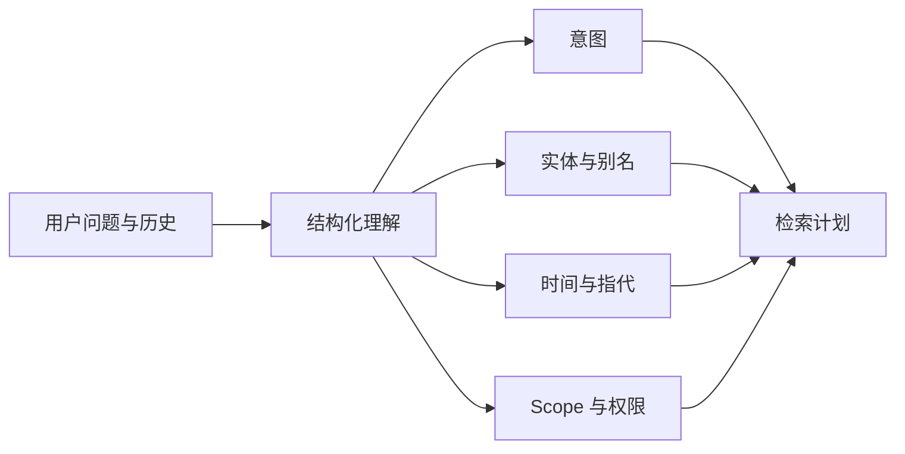
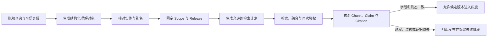

# 查询理解怎样固定意图、实体与权限范围

“这个范围内负责发布的人是谁？”看起来是一句普通问题，检索器却需要知道“这个范围”指哪个节点，“负责发布”是在找负责人字段还是发布流程，“谁”需要返回人名还是岗位。若把整句直接丢给全文和向量通道，结果可能来自整个知识库，模型再凭感觉挑一个答案。

查询理解把自然语言变成一个受约束的中间对象。它不是把问题改写得更漂亮，而是提取后续检索真正需要的字段：意图、实体、业务编号、时间、别名、指代、显式范围、排序偏好和不确定项。权限范围不由模型自由生成，必须来自认证上下文、会话状态或用户明确选择。

::: info 一个查询对象应能被程序检查

语义问题可以产生候选实体和意图，但用户身份、租户、知识 Release、Scope 和 Deadline 由运行时固定。结构化理解缺少必要字段时，系统应追问或拒答，不能把空值扩大成全库搜索。

:::

本文用一个知识库推演三次查询：单轮查询“RA-204 的审批角色是什么”，带范围查询“在支付平台目录下，负责人是谁”，多轮查询先问“生产接入怎么申请”再问“这个角色呢”。三次都使用同一套解析结果契约，变化只来自上下文和用户选定范围。

## 查询理解解决的是哪种不确定性

自然语言的不确定性至少有五类。词面可能不同但指向相同概念，称为同义或别名；一个词可能指多个实体，属于歧义；“它”“这个范围”需要从会话和界面状态解析，属于指代；“当前”“去年”需要时间版本；“在 A 目录下”限制可见 Source，属于 Scope。

这些不确定性不能全部交给生成模型。模型适合提出候选意图、实体和改写，但应用必须验证实体是否存在、是否属于当前知识库、用户是否能访问、时间是否有对应 Release。结构化输出通过 JSON Schema 也只保证形状，不证明实体真实。

检索策略取决于意图。查编号状态优先 exact；问“为什么被拒绝”需要语义和全文；问“负责人”可能需要结构字段或图谱；问“有哪些”需要覆盖多个 Source；用户要求“只看这个目录”则必须启用 scope。一个通用向量查询无法同时满足这些约束。

程序代码不应为某个业务标题增加特判，例如发现“支付平台”就强行添加某个关键词。正确做法是从实体索引、别名注册表、导航范围和权限数据中查找候选；同样的解析流程应适用于另一个目录和另一种表达。
## 一次结构化理解的输入和输出

输入包括当前用户文本、会话中最近的有效引用、界面显式选择、用户身份和知识库上下文。历史消息不是全部拼接，而是只提供仍然有效的实体和范围；旧 Release、撤回 Source 和已过期权限不能因为出现在对话里继续生效。

输出可以包含以下字段：

~~~json
{
  "intent": "find_owner",
  "entities": [{"text": "生产接入", "candidate_ids": ["node-17"]}],
  "identifiers": [],
  "time": {"kind": "current"},
  "aliases": ["外部连接"],
  "references": [{"text": "这个范围", "resolved_to": "node-17"}],
  "scope": {"source": "explicit_context", "ids": ["node-17"]},
  "uncertainties": []
}
~~~

这只是输出形状示例。node-17 必须由程序查询当前知识库后确认，模型不能凭文本填一个不存在的 ID。scope.source 说明范围来自界面或会话，而不是模型猜测；若没有明确范围，值应为空并由策略决定是否允许默认范围。

输入和输出都要保存版本。理解器版本、别名表、时间解析规则和会话 Turn ID 进入 Trace；用户原文和敏感实体按隐私策略保存。下游检索读取结构对象，不重新从自然语言猜一遍，避免每个通道各自改写范围。
## 从问题到检索通道的正常路径

用户 U 在目录 node-17 中输入“RA-204 的审批角色是什么”。理解器提取业务编号 RA-204、意图 find_field 和字段“审批角色”。程序在 node-17 的当前 Release 中查 exact_terms 与 structured_fields，确认编号存在且用户可见。

精确通道返回行级 Chunk A。若用户还问“为什么”，结构化理解把主要意图标成 identifier_with_reason，检索器保留 A 作为对象定位，再并行寻找解释条件的 sparse 和 dense 候选。向量通道不能替换 A 的身份，答案引用仍从 A 的 Source Version 读取。

第二个问题是“在支付平台目录下，负责人是谁”。目录来自用户选择的导航节点，解析器把它写入显式 Scope，实体候选由别名或目录索引确认。Scope SQL 限制 root node 或 document，dense、sparse、exact 和 table 通道都使用同一范围；没有范围的通道不能偷偷扩大查询。

第三轮用户只说“这个角色呢”。会话状态保存上一轮已确认的实体和 Scope，指代解析把“这个角色”关联到前一个问题的负责人字段，但不把上一轮的答案正文当新事实。若上一轮有多个候选或用户切换目录，解析器把不确定项列出，系统先追问“指哪个文档或角色”。

每次输出都经过确定性校验：实体候选是否属于当前知识库，Scope ID 是否在用户授权集合，时间是否能映射到 Release，字段名称是否允许查询，Deadline 是否仍有余量。校验失败不会进入模型生成阶段，终态是追问、范围内空结果或安全拒答。
## 意图、实体和字段怎样互相约束

意图不是任意标签集合，而是决定检索合同的一组有限值。find_identifier 要求 identifier；find_owner 需要实体或范围；compare_versions 需要两个可解析版本；list_items 需要集合范围；explain_reason 需要一个对象和关系。缺少必需字段时，程序应返回结构错误或追问。

实体候选记录实体 ID、类型、名称、来源、别名和可见 Release。一个用户输入可能匹配多个候选，排序可以使用词面和 Embedding，但最终选择要经过范围和权限验证。两个不同实体同名时，不能让模型凭最近一次出现决定。

字段查询和全文问题也要区分。问“审批角色”可以走 table 或 structured 通道，问“申请为什么被驳回”需要正文条件。理解器保留原问题和解析字段，下游可以组合通道，不把字段名拼成一个伪自然语言查询后丢失结构。

查询“当前 RA-204 是否有效”包含对象、字段和时间条件。当前对应活动 Release，但历史查询“V2 中 RA-204 的状态”需要显式历史版本。如果系统没有该版本或用户无权访问，返回不可查询，不用最新版本代替历史事实。

否定和限定词也要成为结构信息。“哪些情况不需要审批”不能被简化成“需要审批”；“只看生产环境”不能被删掉；“除管理员外”涉及权限语义，不能把它当普通停用词。测试集应包含这些反例。
## 解析器与检索器之间要有一份稳定契约

理解器输出的字段需要明确类型、允许值和缺省含义。intent 是有限枚举，entities 是候选列表而非已经确认的事实，identifiers 经过规范化但保留原始写法，time 区分 current、historical、range 和 unknown，scope 记录来源与 ID，uncertainties 说明还需要用户确认的内容。字段缺失和字段为空不能混用。

检索器只接受通过契约校验的对象。它不会重新猜意图，也不会从 entities 的显示名称拼接 SQL；程序使用候选 ID、范围 ID、Release 和权限上下文。模型输出的名称必须先经过实体仓库查询，仓库返回不存在或多候选时，流程停在澄清。

契约版本发生变化时，旧 Turn 不应直接用新解析器重放。运行记录保存 parser version，回归和恢复使用对应版本；新 Turn 才使用新字段。字段新增可以向后兼容，改变 current 的语义或默认 Scope 则要单独迁移和评测。

候选实体排序的分数不应泄漏到授权判断。相似度、词面覆盖和别名来源可以决定候选顺序，用户是否有权看到实体由 ACL 决定。先取最高分再鉴权会泄露“有一个不可见对象很接近”，更稳妥的做法是在候选和返回阶段都执行可见性过滤。

查询理解也不应直接修改会话长期记忆。只有用户确认的实体和范围才可以进入可复用状态，模型推测和一次性候选留在当前 Turn。用户撤回确认或切换知识库时，相关状态失效，并带原因进入 Trace。
## 歧义解析要让用户看见选择依据

输入“负责人”可能匹配制度负责人、项目负责人和目录负责人。系统可以先用当前 Scope、字段类型和最近已确认实体缩小集合，再列出名称、路径和版本供用户选择。若选择仍然不唯一，明确追问比返回一个名字更安全。

输入“生产环境”可能是实体、字段值或过滤条件。解析器先检查词项在当前知识库的实体索引和结构字段中的位置，再根据意图决定它的角色：问“生产环境负责人”时，它可能是表格字段值；问“生产环境有哪些目录”时，它可能是 Scope 候选。不要把同一个词固定映射成实体。

时间“最近”“上次”“当前”也有范围。最近一条文档更新时间、最近一次 Release 和最近一次会话消息不是同一概念。查询对象要说明时间针对哪个字段，程序才能从 Source 更新时间、Release 激活时间或 Turn 时间中选择。

用户明确说“不要看附件”是排除范围，不是一个普通关键词。Scope 结构可以同时保存 include 和 exclude，数据库执行时检查 Source 关系；若系统不支持排除，就要返回不支持此约束，而不是忽略它。

歧义消解的结果要带依据。实体来自用户选择、别名确认、目录上下文还是模型候选，权限范围来自登录身份还是显式选择，时间来自哪条消息，都可以记录短枚举。这样一次错误选择能回溯到理解、界面或数据治理，而不是归因“模型答错了”。
## 别名解析不能替代事实确认

别名表记录原词、规范实体、来源、状态、语言和更新时间。Wiki 或人工治理可以提出别名，自动抽取得到的候选状态应区别于已确认别名。查询命中别名只决定路由和候选实体，不代表用户已经获得实体下所有文档。

“外部连接”“远程接入”“外网访问”可能在某个知识库内是同一主题，也可能在两个部门拥有不同制度。别名解析必须以当前知识范围和版本为条件；全局别名表硬合并会把部门规则串在一起。

别名冲突时保留多个候选和冲突原因。系统可以让用户选择目录或文档，不能随机取第一条。确认后把选择写入本次 Turn 的结构状态，后续工具与检索使用这个 ID，而不是把用户原词重复传给模型。

别名更新需要让缓存、查询计划和 Wiki 路由按版本失效。旧 Turn 继续使用开始时固定的别名与 Release，下一轮才使用新映射。运行中的任务不能中途把“外部连接”从 node-17 换成 node-29。
## 指代和多轮范围要有生命周期

会话状态保存最近确认的实体、范围、时间和 Release 快照，但不是永久记忆。每次新 Turn 开始时检查它们是否仍属于当前用户和知识库，撤回或过期时标记 stale，不能继续使用旧授权。

“这个范围”若前一轮只出现了两个目录，解析器应保留两个候选并追问；若用户在界面明确点选目录，显式上下文优先于模型根据文本猜测。多轮状态中保存来源类型，便于审计这是用户选择、系统默认还是模型候选。

“刚才那条规定”需要绑定上一轮的 Chunk ID、Source Version 和 Release。答案正文被压缩或引用页面更新后，指代仍回到稳定 ID，再重新鉴权和取回内容。不能只保存一段文字，因为相同句子可能出现在不同版本。

上下文裁剪后，指代所依赖的状态不能被悄悄删除。若只剩“这个”而没有实体和范围，理解器应返回缺少上下文，系统追问。把记忆摘要中模糊的“它”扩成一个实体，会产生无法追责的搜索范围。
## Scope 是安全边界，不是搜索偏好

用户选中 node-17 目录，Scope 进入检索参数。它影响 exact、sparse、dense、table、Graph 和邻接补全，而不只是列表页面。每个通道返回的 Chunk 都要与 Scope 和 ACL 条件相交，融合前已经排除越界来源。

没有显式 Scope 时，系统可以按产品策略使用用户的默认知识库，但要把默认来源写进 Trace；不能看到“这个范围内”就创建一个猜出的节点。默认范围也经过授权，管理员与普通用户的默认集合可能不同。

Scope 与意图组合会改变空结果解释。node-17 内没有 RA-204，整个知识库有一条，正确终态是范围内未找到，不能自动扩大到全库；用户明确允许扩大时，先询问确认并创建新的 Scope，而不是静默放宽。

缓存键包含 Scope、Release、权限指纹、查询规范化结果和通道配置。命中后再次鉴权，撤回、组成员变化或 Scope 切换都会让旧候选失效。只用原问题作为键，会把同一句查询的不同可见集合混在一起。

Scope 还影响证据补全和后续工具。命中 node-17 的一个 Chunk 后，前后邻接、父章节、Wiki 摘要和 Graph 子图都必须沿 node-17 的授权范围过滤；工具收到的实体 ID 也要重新做对象级权限检查。只限制第一条检索 SQL，后续扩展仍可能越界。

Scope 与知识 Release 是不同维度。Scope 说“可以看哪些对象”，Release 说“对象使用哪一份内容快照”。同一个 node-17 在 R2 与 R3 的内容可能不同，查询对象要同时保存两者，不能用一个 scope_release 代替两个可审计字段。

管理员身份也不是无条件绕过。管理员可以有更大的 subjects 和 group 集合，但仍受知识库、撤回状态和 Release 条件限制。审计需要记录管理员选择的范围，方便区分“正常管理员可见”与“错误地把全库放开”。

跨租户的同名对象不能共享 Scope。实体候选 ID 包含租户或知识库关系，别名和缓存分区也按授权范围隔离。向量计算结果在某些策略下可复用，候选对象和显示内容不能因此跨租户合并。
## 失败路径怎样分类和停止

文本无法解析出意图，系统可以请求用户说明目标；实体有多个候选，要求选择；实体存在但无权限，安全拒绝；实体在当前 Release 不存在，返回范围内无证据；向量服务超时，保留 sparse 和 exact；所有通道都失败，报告依赖故障而不是知识为空。

时间表达没有对应版本时，不把 current 当默认。用户问“去年规则”，如果历史 Release 未保存，说明无法验证；用户问“当前”，活动版本不存在时也不能拿最近创建版本冒充。

Scope ID 不在授权集合时，记录 scope_denied，不能删掉 Scope 再重试。结构化输出字段非法时，程序拒绝调用工具；模型若输出不存在的实体 ID，先回到实体检索或要求澄清，不能让 ID 进入 SQL。

空结果必须携带范围、Release、通道和原因。一个合法空结果可以短时缓存，Embedding 超时和数据库错误不能以同样 TTL 缓存。错误达到重试上限后保留原始阶段，生成模型不能把“权限拒绝”改写成“没有相关内容”。

请求预算同样属于停止条件。解析、实体候选和检索分支都有有限的模型调用、查询条数和剩余时间；候选过多时按策略缩小，不能为了消除歧义无限调用模型。Deadline 到期后保存已经确认的结构状态，终态标记 timeout，后续补偿任务重新从结构状态开始，不重新猜范围。

模型返回结构正确但字段事实错误，是业务验证失败。比如输出 node-29，但实体仓库显示它不属于当前知识库；输出 current，但当前 Release 正在 building；输出“管理员可见”，但用户不是管理员。程序拒绝候选并保留错误路径，不能让生成模型自己纠正后继续。

检索返回了可见候选，但没有覆盖用户指定的实体，也属于证据不足。系统可以追问是否扩大范围，不能默认调用全库。扩大范围需要新的用户确认、Scope 版本和缓存键，后续回答引用新范围。
## 验证查询理解是否真的可用

测试集按字段覆盖：同义表达、实体歧义、编号、否定、时间、别名、跨轮指代、显式 Scope、无权限和空范围。每条记录期望意图、实体 ID、范围、时间、允许通道和终态，不只比较最终答案字符串。

这张图也是测试顺序。前一层没有形成可信状态，后一层就不应该用最终答案“碰巧正确”替它通过。

单元测试检查确定性解析函数：查询词清理不丢业务编号，中文词项保留必要二元组，指代状态缺失时返回不确定，范围数组去重，别名冲突不随机选择。当前检索实现对严格稀疏查询使用有限放宽，不使用无界全表模糊扫描。

集成测试在隔离数据库放入同名实体、两个 Release、相近编号和不同 ACL。用户 U1 在 node-17 查询只返回允许 Source；U2 选择 node-29 后同一句得到另一组结果；撤回 node-17 后缓存命中也被再次过滤；指定历史 Release 不依赖文档当前 active version。

运行轨迹保存原始查询的哈希、理解器版本、候选实体、Scope 来源、Release、通道、过滤数量、最终 Chunk ID 和终止原因。敏感文本按隐私策略处理，稳定 ID 足以定位大多数问题。没有 Trace 时，无法判断是理解错实体还是检索错版本。

回归修复不能只给某个问题加词。把“支付平台”换成“订单平台”，把“谁负责”换成“审批人是什么”，把目录换成另一个 Scope，再运行同一断言。通用结构对象覆盖这些变化，才说明修复的是解析规则而非测试字符串。

端到端测试应逐项检查状态变化。输入进入后生成理解对象；候选实体经过仓库核对；范围和 Release 写入检索参数；各通道只读取同一对象；融合后的 Chunk 回到来源版本；答案验证再按当前授权检查。任何一步重新从原始问题解析，都可能产生范围漂移。

质量评测按错误类型分桶，而不是只看最终回答是否相同。实体选错、范围扩大、历史版本误用、精确编号混淆、别名冲突、合法空结果被改成猜测，都应该有独立失败率。平均答案通过率无法抵消一次越权。

测试数据要包含重复内容与同名实体。两个 Source 都写“生产环境负责人”，但路径、租户和 Release 不同；用户选择其中一个后，检索只能返回对应版本。把内容字符串作为唯一身份的实现会在这个样本中暴露。

观察运行时 Trace 时，先比较理解对象和用户的显式选择，再看检索候选。若对象已经有正确 Scope，问题在通道或融合；若对象扩大了范围，问题在解析、状态恢复或默认策略。排查顺序避免一上来调 Top K。

上线新理解器时使用候选版本和影子请求。新旧对象对同一脱敏查询并行生成，比较实体、意图、Scope、允许通道和终态，不把新结果交给用户。越权、历史版本和否定问题出现差异时先阻止发布，再查看具体状态变化。

影子结果的比较不能只看两个自然语言答案是否相似。结构对象已经不同，可能最终碰巧生成相同句子；也可能结构相同，答案因为证据装配或模型变化不同。评测分别比较实体候选、范围、Release、通道、Chunk ID、Claim 和 Citation，才能知道变化发生在哪一层。

范围过滤还要覆盖派生数据。Wiki 摘要、Alias、图谱节点和父章节都可能来自同一 Source 的不同投影，不能因为它们不是正文 Chunk 就跳过授权。一个无权用户通过别名查到可见名称，再沿图谱边看到敏感节点，仍然是范围泄漏。每个派生结果带 Source Version 和 Release，取回时按当前 ACL 重查。

如果查询需要跨多个 Scope，系统先把用户明确选择的范围列表固定下来，再为每个范围建立独立候选集合，最后按任务合同合并。不能用“跨范围”作为取消所有过滤的特殊模式。某个范围没有结果时保留缺口，答案可以说明哪些范围没有证据。

工程上最容易忽略的是“默认范围”。默认知识库、默认目录和最近打开文档都属于状态来源，需要显示在 Trace 与必要的用户界面中。用户没有明确授权时，默认范围只能缩小搜索，不能替用户增加可见来源。默认状态过期后应重新解析，避免长期会话一直沿用旧范围。

最终验收同时检查一条越权反例和一条合法空结果：越权反例必须在实体、Scope、检索、缓存和派生投影每层失败，合法空结果必须保留范围与 Release 证据。二者都不能由生成模型改写成一个笼统的“找不到”。

这两种终态都要进入回归集，并保留对应的结构化请求、权限快照和 Release 身份。监控也要区分权限拒绝和范围内没有资料，统一返回空列表会让回归失去责任层。

查询理解的终点不是“生成一段更像搜索词的话”，而是得到一份下游可以验证的请求合同。实体、意图、时间和 Scope 有稳定身份，检索通道才知道自己可以查什么、不能查什么；缺少证据时，系统也能在正确位置停止。
## 解析器升级怎样避免范围回归

验收时应把解析错误和检索错误分开记录。给定同一用户、同一 Release 和同一 Scope，测试集至少包含精确编号、同名实体、否定词、历史版本、目录切换、无权限实体和多轮指代。断言不仅检查 intent 是否正确，还要检查禁止范围没有进入查询计划、未确认候选没有写入长期记忆、历史问题没有落到当前 Release，以及空结果最终进入追问或拒答而不是全库兜底。

理解器升级时保留旧版本的解析快照，先在影子流程中比较字段变化，再运行下游检索和答案验证。若别名表增加导致候选数上升，应确认权限过滤仍在候选选择之前；若时间规则改变，应检查缓存键和历史 Turn 是否失效。只有结构对象、范围约束和终态行为都通过回归，新的 parser version 才能被活动策略引用。
## 结构化理解是检索前的权限闸门

解析器输出意图、实体、时间、别名、指代和 Scope，并为未确认字段保留状态。下游只消费结构化对象，不从自然语言查询重新猜租户或范围。

合法空结果和越权拒绝必须是不同终态。解析器升级先做影子回放，确认缓存键、Release 和检索计划不会因为字段变化而漂移。
