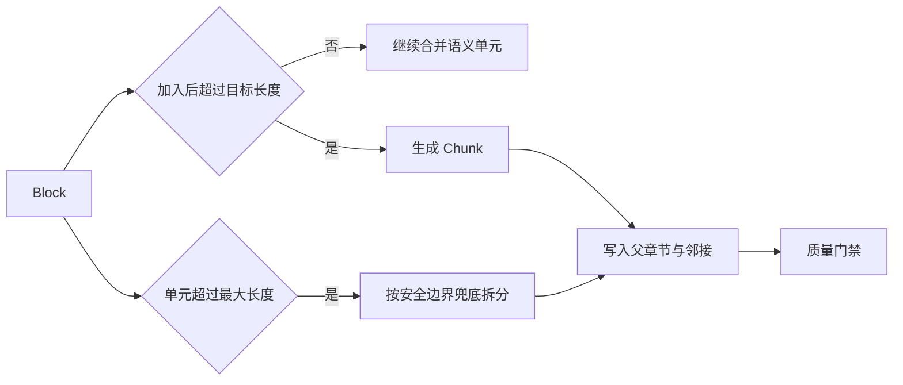

# 语义切块怎样保留章节与邻接关系

一篇制度文档已经被解析成标题、段落、列表、代码和表格 Block，为什么还要切成 Chunk？因为检索和模型上下文都需要有限大小的输入。整篇文档做一个向量，多个主题会被压进同一个表示；每句话做一个向量，又会失去标题、条件和例外。Chunk 要在“内容足够集中”和“离开原文仍能理解”之间取一个可验证的平衡。

切块也不是把字符串每 1000 字截一次。固定窗口会从句子中间断开，把章节标题留在上一块，把审批条件和例外拆到两个块里。后续即使召回其中一块，也可能只看到“需要批准”，看不到“仅生产权限”这个范围。

本文仍用远程访问制度。章节里有三段正文、一组设备条件、一张审批表和一段配置代码。切块器要输出有版本、有来源、有章节路径的 Chunk，任何内容不能无声丢失；检索命中某个叶子后，还能按父章节和前后邻居补上下文。



目标长度只影响常规合并，最大长度负责最后的硬约束。父章节、前后邻居和稳定身份都在叶子生成后补齐，避免切分过程中的临时顺序被误当成最终引用关系。

## 目标长度控制形状，最大长度负责兜底

切块配置至少分成目标长度与最大长度。目标长度是常规合并的停止点，允许结果在它附近浮动；最大长度是硬约束，任何 Chunk 都不能越过。把两个值设成同一个数字，会让算法为了精确填满窗口而频繁硬切句子。

配套实现按字符估算，目标值为 1000，最大值为 1800。它适合中文、英文混合文档的一个起始基线，却不等于 1000 个 Token。不同模型的分词方式不同，代码、英文标识和中文字符比例也会影响 Token 数。真正装配模型上下文时仍要用目标 tokenizer 计算，字符上限只负责离线切块的稳定性。

如果一个 Block 小于最大值，最小实现直接保留，不会为了靠近目标值把相邻不同 Block 强行拼接。长 Block 先拆成语义单元，再依次放入缓冲区。加入下一个单元会超过目标值时，当前缓冲区形成 Chunk；某个语义单元自身超过最大值，才按字符上限兜底切开。

这套顺序意味着目标值不是下限。一个完整短段只有 180 字，保留为 180 字的 Chunk 比和下一节拼到 1000 字更合理。反过来，一句话长达 2500 字，缺少任何标点，算法只能在最大值处分割，并把这种硬切计入质量记录。

```python
def split_content(text: str, target: int, maximum: int) -> list[str]:
    text = text.strip()
    if len(text) <= maximum:
        return [text] if text else []

    chunks: list[str] = []
    buffer = ""
    for unit in semantic_units(text):
        if len(unit) > maximum:
            if buffer:
                chunks.append(buffer)
                buffer = ""
            chunks.extend(
                unit[start:start + maximum]
                for start in range(0, len(unit), maximum)
            )
            continue

        candidate = f"{buffer}\n{unit}".strip() if buffer else unit
        if buffer and len(candidate) > target:
            chunks.append(buffer)
            buffer = unit
        else:
            buffer = candidate
    if buffer:
        chunks.append(buffer)
    return chunks
```

这里的正常输出可能有 700、1100 和 420 字，不必追求等长。验证关注每块不超过最大值、语义单元顺序不变、拼回后内容完整。失败样本是一个 2000 字且无标点的异常长单元，输出会发生字符硬切，系统要能统计并定位，而不是假装所有边界都有语义。
## 语义边界来自标点、空行和 Block 类型

中文正文可把句号、问号、叹号和分号当作候选边界，英文再加入对应半角符号。两个换行表示段落边界，也可以结束一个语义单元。算法不需要理解句子含义，却能避免大部分句中截断，且结果可重复。

标点规则有局限。版本号里的点、代码里的分号、缩写和小数都可能被误切，所以代码与表格不能走普通正文分支。Block 模型已经把类型分开，切块器只在 paragraph 与 list 内容中使用普通语义单元；代码保留围栏，表格进入专门策略。

列表是否拆分取决于长度。短列表保留在一个 Chunk 中，标题路径提供共同语境；长列表可以按项目组合成多块，但每块都要携带同一章节路径。列表前的总领段若是独立 Block，可以通过 section parent 或邻接补全一并召回，而不是复制到每个列表 Chunk。

段落之间不默认重叠。固定重叠会复制句子，索引里出现多个近乎相同的候选，融合和 Rerank 可能把名额都给同一段。更可控的办法是先保存前后邻接，在线检索确认某个 Chunk 后再按预算补邻居。需要重叠的特殊语料应采用显式策略版本，并用召回评测证明收益。

不同语言还需要各自边界。没有空格的中文不能只按词数，英文技术文里的长代码标识也会拉高 Token。离线字符策略与在线 Token 预算是两层约束：前者稳定地产生索引，后者保证实际模型调用不溢出。
## 章节路径让叶子离开原文仍有语境

标题 Block 不一定单独生成向量 Chunk。它更适合更新 `section_path`，后续叶子保存完整标题链。例如正文“需要负责人批准”本身很模糊，Embedding 文本可以组合文档标题、Source 标题、章节路径和正文：

```text
远程访问制度
审批规则
生产权限
需要负责人批准。
```

展示文本仍是原句，回答文本也可以保持原样；Embedding 文本增加结构上下文，提高单个叶子的可检索性。加入的标题必须来自原文结构，不能由模型生成新的业务含义。

章节路径还用于构建父 Chunk。每一条非空路径生成一个 `section_parent`，内容由标题和该路径下的子 Chunk 汇总，并限制在最大长度内。叶子保存 `parent_chunk_id`，多级标题形成父子链。检索可以先命中父章节，再展开高相关叶子；也可以命中叶子后获取章节概览。

父 Chunk 不是整章无上限拼接。长章节只保留受限预览，否则它会重新变成一个主题混杂的大向量。父 Chunk 的用途是结构导航和补充背景，不替代叶子证据。最终引用仍应落到包含原文的叶子或表格行。

章节标题变化会改变父 ID 和叶子的 Embedding 文本。即使正文不变，语义位置已经变化，重新生成相关向量是合理的。系统需要把这种变化与“正文内容变了”分开记录，便于分析重建范围。

空章节或只有标题没有正文时，可以保留结构统计，不生成无内容叶子。若标题下本应有正文却因解析失败为空，应由 Coverage 与解析警告阻止发布，而不是创建只含标题的成功 Chunk。
## 前后邻接在叶子生成后统一写入

每个 Source 内的叶子 Chunk 按阅读顺序排列，生成完成后再写 `previous_chunk_id` 和 `next_chunk_id`。第一个叶子没有 previous，最后一个没有 next；中间节点的双向关系必须对称。section parent 不参与这条线性邻接，否则一次补邻居可能拿到父摘要而不是原文下一段。

邻接只在同一个 Source Version 内建立。根制度的最后一段不能自动连到附件第一段，即使它们在 Manifest 中相邻。跨 Source 关系由父来源和业务结构表达，避免检索补全时意外越过文档或权限边界。

在线召回审批条件段后，可以补前一个设备范围段和后一个例外段。补多少由 Evidence 预算决定，邻接关系本身不表示相关性。若前一块属于另一个章节，系统可以根据 section path 停止扩展，或者明确允许跨章节一步。

并行构建 Source 时，每个分支先生成局部叶子与邻接，最终汇总只重新分配全局 `chunk_index`。不能根据 Worker 完成顺序连接，否则慢附件与快主文的顺序会随机变化。全局序号用于候选排序和存储，不应参与跨 Source 邻接。

邻接断链会直接影响上下文补全。质量门禁检查引用的 ID 是否存在、previous 与 next 是否互相指回、关系是否留在同一 Source Version。任一孤立引用都让候选版本失败，不能等线上检索碰到后再降级。
## Chunk ID 的稳定范围要如实定义

一个可追踪 Chunk 至少关联文档、文档版本、Source、内容摘要和构建规则。内容摘要防止同位置内容被覆盖，版本身份防止旧引用指向新正文，构建版本解释切块变化。真正困难的是位置身份。

配套实现的 Chunk ID 输入包含文档 ID、文档版本、Source ID、Source 内序号和内容哈希。测试证明两件事：相同版本与输入重复构建会得到相同 ID；文档版本变化时 ID 会变化。这是确定性的版本化 ID，不是跨编辑稳定 ID。

旧文常把“由内容派生”写成“前面插入一段，后面 ID 仍不变”，当前实现做不到。Source 内序号参与哈希，开头新增 Chunk 后，后续序号整体移动，即使正文没有变化，ID 也会重建。这会增加向量重算和缓存失效，但不会把新旧版本混在一起，安全性仍然明确。

若需要抵抗无关位置变化，可以把身份拆成两层。版本化 Chunk ID 继续用于在线证据；另加 `logical_chunk_key`，由 Source 逻辑身份、章节路径、Block 类型、规范内容哈希和同内容出现序号组成。发布新版本时先在同章节内匹配，再处理移动与重复内容。匹配结果只是迁移线索，不能让旧版本 ID 指向新文字。

只用内容哈希也不够。同一句“适用范围如下”在多个章节出现时会冲突；标题改名后同一正文的语境也变了。只用章节路径则在标题修订时全变。稳定策略必须承认取舍，并通过真实编辑样本评估缓存复用、误匹配和引用安全。

ID 生成前的规范化需要版本化。换行、Unicode、标题路径分隔符和字段序列化任何一项变化，都会改变哈希。黄金测试保存固定输入和期望 ID，让看似无害的重构不会悄悄重建整个索引。
## 代码块和异常长内容怎样兜底

代码 Block 小于最大值时整体保留。超过上限后，算法先取开围栏和语言标记，计算可用正文长度，拆分代码体，并给每一段补齐关闭围栏。这样每个 Chunk 都能独立渲染，也不会把后续 Markdown 吞进代码块。

这一策略没有理解函数或类边界。更高级的代码知识库可以使用语法树按符号切分，但需要保存语言、文件路径和符号关系。通用文档中的短配置段不值得引入完整编译器，保留围栏与最大长度已经能覆盖多数场景。

异常长单词、Base64、压缩日志或没有标点的 OCR 文本会触发字符硬切。它们通常不适合直接做 Embedding，可以在准入或解析阶段标记，也可以让 Chunk 质量门禁统计硬切次数与占比。安全扫描命中的长字符串不能因切块而绕过，原 Source 的不可信标记要继承到所有派生 Chunk。

空内容不会生成 Chunk。Source 有非空正文却因为 Block 解析异常没有输出时，最小实现可以创建一个 leaf 兜底，确保内容不会直接消失；Coverage 同时应记录结构退化。兜底 leaf 让数据可观察，不代表候选一定能发布。

最大长度最终还要为 Embedding API 和数据库字段留余量。Embedding 文本会加文档标题与章节路径，若只限制正文长度，拼接后可能超过模型输入。构建器应分别检查 `content` 与 `embedding_text`，并在配置中预留前缀预算。
## 一章制度的切块轨迹

输入章节为“生产权限”，含 260 字说明、一个 1400 字长段、四项设备条件和一段 300 字配置代码。目标长度设为 1000，最大长度设为 1800。Source Version、解析器版本和 Chunker 版本已经固定。

Block 构建器先给出标题、paragraph、list 和 code。标题更新 section path，不生成叶子。260 字段落小于上限，成为一个叶子；1400 字长段也没有超过最大值，因此最小实现整体保留，不会因为超过目标值强拆。四项列表作为一个短 Block 保留，代码围栏完整保存。

随后创建“生产权限”父 Chunk，正文为标题加子内容的受限预览。四个叶子按阅读顺序写邻接，共享父 ID。每个叶子的 Embedding 文本加入文档标题和章节路径，display content 保持原文。全局结果再分配连续 `chunk_index`。

正常输出包含一个父 Chunk 和四个叶子，所有正文都能在叶子或章节路径中找到。检索问题“生产访问的设备条件”可能命中列表叶子，在线按预算补前一段限制说明；最终 Evidence 引用列表与必要邻居，不引用父摘要替代原文。

故障样本把长段改成 2100 字且移除所有标点。切块器在 1800 字处硬切，产生两个叶子。测试看到硬切计数增加，并检查拼接后与原文一致。若第二块没有 previous，或第一块 next 指向不存在的 ID，Coverage 记录孤立链接，候选版本停止激活。

另一个样本在章节开头插入一段。当前 ID 算法让后续叶子随序号变化，测试应如实记录重建范围，而不是断言跨版本稳定。启用 logical key 改进以后，再新增专门测试证明未改正文能正确匹配，且重复句不会串到另一个章节。
## Coverage 门禁检查内容与结构

切块器把原始 Block 拆成可比较的内容单元。标题在 section path 中查找；普通段落和代码按语义单元在叶子 content 中查找；表头与单元格在表格 Chunk 的正文、表头和结构字段中查找。找到的数量除以总单元数，得到内容保留率。

配套候选门禁要求保留率不低于 0.98，同时不允许重复 Chunk、孤立邻接和超限 Chunk。这个数值属于具体实现配置，不是行业通用答案。关键制度可以要求更高，还要加业务字段断言；OCR 噪声较多的语料可能需要先改解析，不能简单调低门槛。

重复检查使用 Source Version、Chunk 类型和内容哈希组合。相同正文在不同 Source 出现不一定是错误，同一 Source 同类型重复则可能来自解析器复读或重叠策略。合法重复内容仍需上下文判断，门禁发现后可以人工白名单，但不能整体关闭检查。

结构计数帮助定位损失。标题、段落、列表、表格、代码和链接在 Block 阶段计数，Chunk 阶段再记录 Source、Chunk 与质量问题。若解析器升级后表格数归零，切块保留率可能仍然很高，因为文字还在；结构门禁会把问题暴露出来。

保留率只证明内容可在派生数据中找到，不证明切分对召回有帮助。所有原文都保留，Chunk 仍可能过大、主题混杂或标题语境不足。下一层检索评测要用真实问题比较 Recall、MRR 和 nDCG，不能用离线结构指标替代回答质量。
## Chunk 参数要用查询集选择

切块没有脱离任务的“最佳长度”。按编号查制度、按字段查表格和按主题问解释，所需上下文不同。编号查询需要保留完整业务标识和附近表头，主题问题需要章节概览与多个段落，代码问题则希望函数和配置一起出现。只拿一篇文档做参数决定，通常会把一种问题的偏好误当成通用规律。

评测集先记录每个问题应命中的 Source、章节、关键字段和可接受的相邻内容，再比较目标长度、最大长度、是否生成父 Chunk、邻接补全步数和 Embedding 文本。候选召回命中只是第一项，后面还要看 Rerank 后是否留下正确 Chunk、上下文预算是否被重复内容占满、最终 Claim 是否能引用关键句。每个指标回答不同问题，不能压成一个综合分。

一个较小目标值可能让精确编号更容易命中，却把解释性段落拆得太碎；较大值能保住上下文，向量主题又可能变宽。父 Chunk 可以补标题，但它的摘要如果截断了例外条件，反而会干扰回答。邻接补全能修复边界，却会增加 Token 和权限过滤次数。参数评审要把这些取舍写进结果，而不是只记录哪一组分数最高。

评测还要包含负例。问题要求“生产权限”时，另一个章节的“测试权限”不应因共享标题而被当作命中；同一句表头在两个表里出现时，必须依靠 Source、章节和字段范围区分。切块策略把负例召回率拉低，说明结构身份或元数据过滤有问题，不是简单增加 Top K 就能修复。

没有足够真实问题时，先用结构门禁和少量人工标注做保守基线，明确“尚未证明”。不要把一次本地 Fake Adapter 测试写成召回改善，也不要凭模型主观评价选择 Chunk 大小。参数变更必须关联语料版本、查询集版本和候选索引版本，后续才能解释差异来源。
## Chunker 升级要按候选版本发布

切块配置、解析器版本和 Embedding 文本策略变化都会改变派生数据。它们不应直接覆盖活动 Chunk。任务先固定 Source Version 和配置快照，在隔离候选区生成新 Chunk、父关系、邻接和内容哈希，完成 Coverage 与检索回归后，再由发布事务切换活动版本。

相同文档版本、相同配置和相同任务身份重复到达时，可以直接返回已完成结果。配置或输入版本任一变化，必须产生新的候选身份。这样队列重复投递不会重复写向量，真正的策略升级也不会误复用旧结果。

任务中途原件被撤回或活动 Release 改变，迟到的 Chunk 不能越过候选校验进入线上。Worker 在写入和激活前分别检查版本，发现过期就保留失败或取消记录，并清理只属于本次候选的派生数据。外部 Embedding 已经产生但数据库提交未知时，要先查批次回执，再决定重试，不能让同一内容无限生成向量。

候选校验失败时，旧活动版本继续服务。失败记录要包含配置版本、Source、Chunk 类型、超限或重复原因和清理结果。只保留“构建失败”会把解析、切块和向量错误混在一起，下一次重试仍可能触发同一问题。

发布回滚不仅是把代码退回上一版。旧服务必须能读取旧 Chunk Schema 和索引版本，缓存键不能把新旧内容混用；如果逻辑 ID 迁移不完整，回滚后宁可重新构建，也不要让引用指向错误文本。候选与活动隔离是这条链路的最小保护。
## 测试从确定性切分走到检索回归

单元测试先固定一段由大量完整句子组成的文本，使用较小目标和最大值，断言输出超过两块、每块不超上限、每块都在句号后结束。再加入无标点长串，确认硬切兜底不会丢字符。

结构样本包含多级标题、列表、代码和表格，再加一个子 Source。断言标题、表格行和代码数量，Chunk 全局序号连续；表格行保存结构字段与精确编号；子 Source 保留自己的来源地址和深度；每条邻接都指向同一 Source Version。

ID 测试重复构建同一版本，期望所有 ID 相同；换文档版本，期望版本化 ID 改变。若加入 logical key，再分别测试开头插段、章节改名、正文移动和重复段落。每个测试都写清哪个身份应稳定，不能笼统使用“稳定 ID”。

故障回归构造超大表格、重复行、空边界和异常长代码。检查每个 Chunk 的内容长度、表头是否重复带入、结构字段是否完整、空行是否被清掉。解析器或 Chunker 升级后在同一语料上比较 Coverage，候选未通过时旧索引保持活动。

最后把切块版本接到检索评测。固定一组问题，记录期望 Source 与关键字段，比较不同目标长度、父 Chunk 和邻接补全策略。若新配置结构门禁全部通过，Recall 却下降，说明 Chunk 形状不适合查询，而不是向量模型一定变差。只有结构与检索两类证据都通过，才激活新版本。
## 检索变差时先确认问题是否出在切块

线上问题“明明文档里有，却没有答出来”不能直接归因于 Chunk 太小。先按 Source Version 打开原解析内容，确认关键句和表格字段确实存在；再看 Coverage 是否保留，期望 Chunk 的章节路径、类型、内容和 Embedding 文本是否正确；随后检查它有没有进入向量与全文索引，查询时是否被 ACL 或 Release 过滤，最后才看融合和 Rerank。

关键句在解析结果中缺失，修切块没有用；Chunk 内容正确却从未进入候选，问题在索引或查询；候选存在但排序靠后，才需要比较表示、过滤和 Chunk 形状。命中后答案仍遗漏，则应查 Evidence 预算与 Claim 验证。沿这条证据链排查，可以避免用调大 Top K、增加重叠或换 Embedding 模型掩盖真正的上游损失。

可观察记录不需要复制整段敏感正文。保存 Chunk ID、Source Version、类型、长度、章节路径、内容哈希、候选排名、过滤原因和是否进入最终上下文，授权后的调试界面再按 ID 读取原文。指标可统计长度分布、硬切率、重复率、孤立邻接和每个 Source 的 Chunk 数，异常阈值要对应重建或停止发布动作。

一次回归还要检查拒答。权限内没有相关 Chunk 时，正确结果是有范围说明的空证据；为了提高命中率而放宽 Source 或 Release，会把切块问题变成越权问题。召回质量不能覆盖权限不变量。
## 切块不能修复上游缺失，也不负责最终证据选择

解析器漏掉扫描页，切块器没有材料可切；表格已经退化成普通文本，切块器也无法恢复列关系。它可以记录 Coverage 异常并阻止发布，不能调用模型猜出缺失内容。

Chunk 带着知识范围、Release 和 Source Version 进入索引，在线查询仍要按当前用户权限过滤。内容相同或向量相近都不能越过 ACL。邻接扩展和父 Chunk 展开后还要重新验证每个候选的版本与可见范围。

Chunker 决定候选的基本形状，不决定最终答案引用哪些内容。混合检索、Rerank 和 Evidence 预算会在查询时筛选，Claim 验证再检查回答是否由证据支撑。父 Chunk 和邻居只是候选上下文，不自动成为证据。

下一篇[表格怎样生成结构化 Chunk](/docs/ai-agent/rag-table-structured-chunks)会单独展开表头、行级字段、整表内容、超大表拆分和精确编号。表格逻辑从普通语义切块中分离后，按字段查询和按主题理解才能同时保留。
## 语义边界要和稳定身份一起设计

切块沿标题、段落、列表和代码边界合并，目标长度只是约束，不是唯一目标。每个 Chunk 保存父节点、邻居、文档版本和稳定 ID，后续重建才能判断是内容变化还是切块算法变化。

切块器不负责补齐解析器丢失的内容，也不负责最终证据选择。邻接扩展仍需重新过滤 ACL 与 Release，空结果不能通过放宽范围解决。
