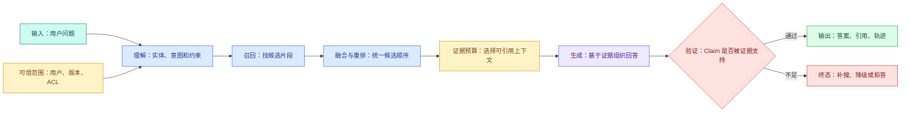
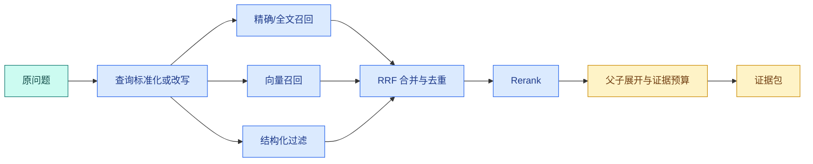

# RAG 策略地图：Naive、Advanced、Adaptive、Corrective 与 Agentic RAG

## RAG 策略是什么

RAG 策略是一组决定检索链怎样执行的控制方案：保持固定、增强召回、根据输入路由、纠正低质量结果，或交给 Agent 有界规划。它位于问题理解和 Evidence 产出之间，用于让不同难度的问题采用与风险相称的检索路径，而不是选择某个向量库品牌。策略越复杂，需要保存和验证的状态、预算与失败路径也越多。

先看两个问题：

1. “访问申请从哪里提交？”
2. “新版本为什么没有生效，它与审批状态、索引版本和回滚条件有什么关系？”

第一个问题通常只需查到一段明确说明。第二个问题可能横跨发布说明、状态定义和排障手册，还要求后一个检索步骤使用前一步找到的版本号。如果两个问题都固定执行“向量搜索一次，然后生成答案”，第二个问题容易缺证据；如果两个问题都启动多轮 Agent，第一问又会平白增加模型调用、延迟和失败路径。

RAG 策略解决的正是这个选择问题：**面对不同问题，检索链应该固定执行、增强召回、按信号路由、纠正失败，还是让 Agent 有界地规划下一步？**

RAG 不是“接一个向量库”就完成了。[上下文装配器](/docs/ai-agent/context-assembly-budget) 已经为 Evidence 留出带来源和预算的区域；这一组文章继续追溯 Evidence 怎样从资料导入、解析、切片、Embedding、索引、查询变换和混合检索产生，最后再回到同一份 `ContextSnapshot`。本文先建立策略地图，避免在不知道失败发生在哪一层时盲目堆组件。

## RAG 的基础链路

RAG 是 Retrieval-Augmented Generation，中文常译为“检索增强生成”。它把模型回答拆成两个不同职责：程序从外部知识中找证据，模型基于当前证据组织回答。

一次最小 RAG 有四类输入：

| 输入 | 由谁产生 | 例子 |
| --- | --- | --- |
| 用户问题 | 用户 | “访问申请从哪里提交？” |
| 可检索知识 | 导入与索引链 | 已激活版本中的文档片段 |
| 检索约束 | 服务端可信上下文 | 当前用户、知识空间、版本、时间范围 |
| 生成规则 | 应用与模型配置 | 只依据证据回答，证据不足时拒答 |

处理过程也不是一句“搜一下”：先理解查询，再根据权限与版本检索候选，随后融合和排序，选出能放进上下文的证据，最后生成并验证回答。输出至少包括答案、引用和终态，工程系统还会保存检索轨迹与版本。



图中 `S` 不是模型猜出的过滤条件，而是认证与授权层给出的可信 Scope。`Q` 可以让模型提取实体或改写表达，但不能扩大 Scope。`R` 只返回候选，不代表候选都适合引用。`F` 统一不同通道的排序，`E` 再按 Token、来源多样性和证据覆盖选片段。生成后的 `V` 逐条检查事实 Claim；证据不足时进入可解释终态，而不是让模型凭记忆补齐。

策略变化主要发生在 `Q -> R -> F -> E` 之间。生成与证据验证不能因为用了更复杂的 RAG 就被省略。

## Naive RAG：建立最小可测基线

Naive RAG 不是“质量差的 RAG”，而是**执行路径固定的最小检索增强链**：原问题或一次标准化查询进入单个 Retriever，取 Top K，直接作为生成证据。

它的输入是一个查询、可信过滤条件和固定 K；内部状态通常只有候选列表；输出是固定数量以内的片段。控制者是程序，不由模型决定下一步。

```text
question -> normalize -> retrieve(top_k=8, scope, release) -> select(top_n=4) -> answer
```

适合它的问题具有三个特征：目标单一、知识中有直接表述、一次召回就能覆盖回答。编号、错误码、页面名称和明确操作步骤常属于这一类。

Naive RAG 的价值是提供基线。没有它，就无法回答“查询改写、Rerank 或 **Agentic RAG** 到底改善了什么”。基线至少记录 Recall@K、支持 Claim 比例、拒答率、延迟和 Token，而不是只看一条演示回答。

它不适合依赖多份资料、需要前一跳实体或语言表达与资料差异很大的问题。失败时先区分“知识没有导入”“切片丢结构”“过滤过严”“召回排序错误”和“生成忽略证据”，不能直接升级为 Agent。

## Advanced RAG：在固定流程中增强检索

**Advanced RAG** 仍是程序预先定义的流程，只是给检索前后增加更精细的步骤，例如查询改写、Multi-Query、关键词与向量混合召回、Metadata 过滤、RRF 融合、Rerank、父子片段展开和证据压缩。

它解决的是“知识存在，但原始查询和资料表达不一致”以及“候选找到了，排序却不适合回答”。输入仍是一轮问题，输出仍是一次确定上限的证据包；区别在于中间状态包含多个查询和多个候选通道。



改写后的查询不能修改知识空间、用户范围和版本；多路候选需要用稳定 ID 去重；Rerank 只能重排已授权候选，不能把过滤掉的内容加回来；父子展开也要重新检查版本与 ACL。每加一个组件，都要增加输入输出记录和独立评测，否则流程变复杂了，却不知道改善发生在哪一层。

## Adaptive RAG：先分类，再选择有限路径

Adaptive RAG 在执行前或第一次检索后读取结构化信号，选择预定义路径。它不是让 Agent 随意研究，而是一个**有候选分支的路由器**。

路由输入可以分为两类：

- 模型可提出：问题类型、是否包含多个目标、是否需要时间比较、可能的实体；
- 程序必须提供：精确命中数、ACL 过滤数、候选覆盖率、剩余轮次、Deadline、可用索引和资源槽。

路由输出应是结构化决策，例如 `strategy="advanced"`、`reason_code="paraphrase_single_goal"`、`max_rounds=1`。不要只保存一句“模型认为比较复杂”，那无法回归测试。

Adaptive 适合混合问题分布明显的系统：FAQ、编号查询和多目标分析共用入口，但最佳路径不同。它不适合样本太少、路由信号不可测或所有问题最终都进入同一路径的场景。

## Corrective RAG：证据不足后做有限纠正

**Corrective RAG** 的触发点在第一次检索之后。系统先评估候选是否足以回答，再决定改写、切换通道、扩大允许的检索表达或补一次外部检索。

“纠正”不是把权限范围越放越宽。可以变化的是 query、召回通道、K 和证据目标；不能变化的是身份、租户、允许知识空间和用户明确指定的范围。

一次纠正需要保存：第一次查询、候选摘要、缺失证据目标、纠正动作、第二次候选、新增证据和停止原因。否则第二轮只是不可解释的重复搜索。

常见**停止条件**包括：

1. 所有必要 Claim 都有证据；
2. 新一轮没有新增稳定候选；
3. 达到最大纠正轮次；
4. Deadline 或 Token 预算不足；
5. 只剩无权限、冲突或不可信来源。

纠正失败后的合理输出是“已查找但证据不足”，而不是继续循环直到模型编出答案。

## Agentic RAG：让 Agent 选择下一步，但边界仍由程序控制

Agentic RAG 用 Agent Runtime 管理检索计划。它可以根据当前 Evidence 决定下一条查询、调用哪个只读工具、是否追踪某个实体关系，以及何时停止。

它解决的是路径无法在请求开始时完整列出的任务。例如“比较两个版本的发布条件，并解释差异来源”需要先找到两个版本，再分别查条件，最后查变更说明。后续查询依赖前一步实体，固定并行 Multi-Query 很难预先写全。

Agentic RAG 的状态至少包含：目标、未解决的证据槽位、已执行查询、候选 Evidence、去重集合、剩余 hop、Deadline、工具预算和终态。只有一句自然语言“计划”无法保证不会循环。

```text
goal
  -> plan evidence slots
  -> search one unresolved slot
  -> validate new evidence
  -> update unresolved slots
  -> stop when complete / no progress / budget exhausted
```

它不适用于答案路径稳定、风险高但缺少确定性门禁，或团队还没有检索评测与 Trace 的阶段。Agentic 增加的是动态控制能力，同时也增加模型调用、状态恢复、取消、循环和评测成本。

## 五种策略放在一张状态表里

| 策略 | 谁控制路径 | 关键中间状态 | 正常输出 | 失败终态 |
| --- | --- | --- | --- | --- |
| Naive | 固定程序 | 单路 Top K | 一份证据包 | 无候选/证据不足 |
| Advanced | 固定程序 | 多查询、多路候选、重排分 | 增强证据包 | 某通道降级或整体不足 |
| Adaptive | 确定性路由 + 有限模型信号 | 路由原因、所选策略 | 某条预定义链结果 | 无适用路径/资源不足 |
| Corrective | 结果评估器 | 缺失证据、纠正轮次、新增候选 | 修正后的证据包 | 无进展/轮次耗尽 |
| Agentic | Agent 提议，Runtime 门禁 | 计划、证据槽、hop、预算 | 多跳证据包 | 循环、超时、无证据或拒答 |

表中的“模型控制”从来不等于“模型拥有权限”。所有策略都必须在同一 ACL、版本和 Deadline 下执行。

## 写一个可解释路由器

下面的代码不调用模型，目标是先把路由决策写成可测试的领域函数。输入是理解阶段和检索阶段的结构化信号，输出包含策略、原因和最多执行轮次。

```python
# 路由器只读取可验证的查询特征，输出有限策略名；它不会在路由阶段直接执行检索。
from __future__ import annotations

from dataclasses import dataclass
from enum import StrEnum

class Strategy(StrEnum):
    NAIVE = "naive"
    ADVANCED = "advanced"
    CORRECTIVE = "corrective"
    AGENTIC = "agentic"

@dataclass(frozen=True)
class QuerySignals:
    exact_identifier: bool
    independent_goals: int
    dependent_hops: int

@dataclass(frozen=True)
class RetrievalSignals:
    candidate_count: int
    required_slots: int
    covered_slots: int
    new_candidates_last_round: int

    @property
    def coverage(self) -> float:
        if self.required_slots == 0:
            return 1.0
        return self.covered_slots / self.required_slots

@dataclass(frozen=True)
class Budget:
    remaining_rounds: int
    remaining_ms: int

@dataclass(frozen=True)
class StrategyDecision:
    strategy: Strategy
    reason_code: str
    max_rounds: int

# 路由器只根据查询特征、检索进展和剩余预算选择有限策略。
def choose_strategy(
    query: QuerySignals,
    retrieval: RetrievalSignals,
    budget: Budget,
) -> StrategyDecision:
    # 外部调用前检查整轮剩余时间；超时后停止继续消耗模型、工具和数据库资源。
    if budget.remaining_ms < 500 or budget.remaining_rounds == 0:
        return StrategyDecision(Strategy.NAIVE, "budget_exhausted", 0)

    # 存在依赖型子问题时选择 Agentic RAG，轮次仍受剩余预算和硬上限约束。
    if query.dependent_hops > 0:
        rounds = min(query.dependent_hops + 1, budget.remaining_rounds, 3)
        return StrategyDecision(Strategy.AGENTIC, "dependent_evidence_hops", rounds)

    # 已有候选但证据槽未覆盖时进入纠错判断，不能直接生成不完整答案。
    if retrieval.candidate_count > 0 and retrieval.coverage < 1.0:
        if retrieval.new_candidates_last_round == 0:
            return StrategyDecision(Strategy.ADVANCED, "correction_no_progress", 1)
        return StrategyDecision(Strategy.CORRECTIVE, "evidence_slots_missing", 1)

    # 单目标且有精确标识时直接查询，避免为简单问题付出多轮规划成本。
    if query.exact_identifier and query.independent_goals == 1:
        return StrategyDecision(Strategy.NAIVE, "direct_exact_lookup", 1)

    return StrategyDecision(Strategy.ADVANCED, "paraphrase_or_multiple_goals", 1)
```

`QuerySignals` 保存问题本身的结构，不保存用户权限；权限已经作为不可变 Scope 进入 Retriever。`RetrievalSignals` 记录候选和证据槽覆盖，`coverage` 避免各调用方重复计算。`Budget` 使用剩余时间与剩余轮次，防止每次路由重新获得完整预算。

`choose_strategy` 按风险顺序判断：先阻止无预算扩展，再处理有依赖的多跳任务，然后处理已有候选但证据不全的纠正，最后才选择最小路径。函数返回 `reason_code`，Trace 和评测可以统计每种路由，而不是解析自然语言理由。

注意 `budget_exhausted` 返回 Naive 且 `max_rounds=0`，表示不再发起新检索；上游应使用已有证据生成降级回答或拒答。它不是“预算不足时再快速搜一次”。

## 用测试证明简单问题不会被升级

测试输入覆盖直接查询、缺证据、多跳和无进展。目标是验证路径与停止条件，而不是比较模型文风。

为了验证“用测试证明简单问题不会被升级”，下面的测试把“测试固定三类路由边界，并证明简单查询不会因为关键词巧合进入高成本研究链”变成可执行断言。每个用例自己构造输入，并用断言固定返回值或失败状态；某条测试失败时，可以从用例名直接定位到被破坏的契约。

```python
# 测试固定三类路由边界，并证明简单查询不会因为关键词巧合进入高成本研究链。
def test_direct_identifier_uses_naive() -> None:
    # 模型或路由器给出候选动作后，Runtime 仍要校验类型、参数和剩余预算。
    decision = choose_strategy(
        QuerySignals(True, 1, 0),
        RetrievalSignals(1, 1, 1, 1),
        Budget(2, 2_000),
    )
    assert decision == StrategyDecision(Strategy.NAIVE, "direct_exact_lookup", 1)

# 这个用例检查资源所有权和释放路径，失败或取消后不能遗留永久占用。
def test_missing_slot_gets_only_one_corrective_round() -> None:
    decision = choose_strategy(
        QuerySignals(False, 2, 0),
        RetrievalSignals(4, 2, 1, 2),
        Budget(4, 3_000),
    )
    assert decision.strategy is Strategy.CORRECTIVE
    assert decision.max_rounds == 1

def test_dependent_hops_are_bounded() -> None:
    # 模型或路由器给出候选动作后，Runtime 仍要校验类型、参数和剩余预算。
    decision = choose_strategy(
        QuerySignals(False, 1, 8),
        RetrievalSignals(0, 3, 0, 0),
        Budget(10, 5_000),
    )
    assert decision.strategy is Strategy.AGENTIC
    assert decision.max_rounds == 3

def test_no_progress_does_not_repeat_correction() -> None:
    # 模型或路由器给出候选动作后，Runtime 仍要校验类型、参数和剩余预算。
    decision = choose_strategy(
        QuerySignals(False, 2, 0),
        RetrievalSignals(3, 2, 1, 0),
        Budget(2, 2_000),
    )
    assert decision.reason_code == "correction_no_progress"
```

第一条证明精确单目标问题走 Naive；第二条即使还有四轮预算，也只授权一次纠正；第三条把模型提出的八跳压到系统上限三跳；第四条在上一轮没有新候选时停止重复纠正。运行 `python3 -m pytest -q`，应看到四条测试通过。

这些测试还没有验证检索质量。路由测试回答“选了哪条路”，Recall 与证据支持率回答“这条路是否有效”，两类测试会在本组最后一篇合并。

## 从 Naive RAG 按问题逐步升级

先为问题集标注类型和必要证据。运行 Naive 基线后，把失败按层分类：

| 观察 | 更可能的问题 | 下一步实验 |
| --- | --- | --- |
| 正确片段从未进入 Top K | 召回问题 | 检查解析、切片、模型、改写和通道 |
| 正确片段在候选中但排序靠后 | 排序问题 | RRF 参数或 Rerank |
| 每个子问题都能单独找到 | 多目标组织 | 查询分解与并行检索 |
| 第二个查询依赖第一步实体 | 路径问题 | 有界多跳或 Agentic |
| 候选正确但回答仍无依据 | 生成/验证问题 | Claim-Evidence 与拒答 |
| 指定范围无结果但全库有结果 | 权限或范围问题 | 保持拒答，绝不越界回退 |

只有前一列有稳定样本和指标时，才做下一列实验。每次只修改一个主要变量，并保留旧策略版本。候选策略必须同时比较质量、延迟、Token、拒答和安全用例；不能只挑一条更漂亮的答案。

## 用 RAG 决策卡记录升级依据

选十个真实但匿名的问题，为每个问题填写：

```text
问题：
问题类型：原子事实 / 多个独立目标 / 依赖多跳
可信 Scope 与知识版本：
Naive 基线结果：
缺失证据槽：
计划增加的策略：
最多查询数 / hop / Token / 时间：
成功条件：
无进展条件：
拒答条件：
回归指标：Recall@K / 支持率 / 延迟 / 成本 / 越权数
```

填完后，应能复述五种策略的输入、控制者、中间状态、输出和停止条件，并能解释为什么“用了向量库”不等于“应该使用 Agentic RAG”。


**Naive RAG 很简单，为什么仍然值得先做？**

因为它提供可测基线。固定一次查询、一次检索和一次生成后，开发者可以分别观察正确片段是否进入 Top-K、候选是否排序靠前、答案是否引用证据。没有基线就直接加入改写、重排和多跳，指标变化时无法知道是哪一层起作用。Naive 不代表粗糙上线，它仍需解析、切片、ACL、版本、引用和拒答，只是控制流程保持固定，便于定位问题。

**Advanced RAG 与 Agentic RAG 的区别只是组件数量吗？**

不是，关键差异是**谁控制执行路径**。Advanced RAG 可以有查询改写、混合检索和 Rerank，但步骤与次数由程序预先固定；Agentic RAG 允许 Runtime 根据中间证据选择下一动作，例如补搜、换通道或停止，因此必须保存状态、预算和停止原因。组件很多的固定流水线仍不是 Agentic；只有模型或策略参与有限决策，并受确定性边界约束时才属于 Agentic 控制。

**Adaptive RAG 和 Corrective RAG 为什么不能混为一谈？**

Adaptive 主要发生在检索前，根据问题类型、风险和成本选择路径；Corrective 发生在已有候选之后，根据证据质量判断是否纠正查询、换来源或停止。前者输入是查询特征，后者输入还包含召回结果与质量信号。两者可以组合，但日志要分别记录路由原因和纠正原因，否则低质量证据触发的补救会被误认为初始分类错误，评测也无法定位收益。

**什么信号说明应该升级到多跳或 Agentic RAG？**

稳定评测集显示每个原子子问题都能召回，但完整问题需要用第一步实体构造第二步查询，才有多跳需求；若查询路径需要根据中间证据动态变化，才考虑 Agentic。单纯 Recall 低通常先修解析、切片、Embedding 或查询表达。升级前写清最大 hop、工具次数、Evidence 目标、无进展条件和拒答条件，并比较质量、延迟与成本，不能因为一个演示问题成功就全量切换。

**RAG 策略效果应该看最终答案是否“像对的”吗？**

不够。至少要拆成检索召回、排序、证据覆盖、引用准确、答案支持率、延迟、Token、拒答和越权样本。最终文本可能碰巧正确，却没有来自当前 Scope 和 Release 的证据；也可能检索完全正确，但生成阶段误写。逐层指标能告诉开发者该改索引、查询、Rerank 还是验证器。所有策略必须在同一标注集、同一知识快照和同一权限条件下比较。
