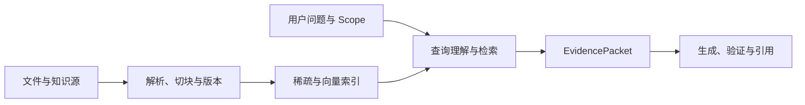

# RAG 的系统位置、策略与升级路径

用户问“当前生产环境最多重试几次”。模型可能知道某些常见默认值，却不知道企业今天启用的是哪个版本。把所有内部文档长期塞进 Prompt 也不可行，内容会更新、权限会变化，上下文窗口还有明确上限。

**RAG（Retrieval-Augmented Generation，检索增强生成）** 在生成前从外部知识源取得与当前问题相关、当前用户可见的 Evidence，再让模型基于这些材料回答。它补充模型输入，不替代业务数据库、权限系统和 Agent Runtime。

RAG 不是单个向量搜索接口。完整系统包含离线知识生产、在线查询理解、受限检索、候选融合、证据选择、答案生成和引用验证。策略选择要看问题类型、数据形态和失败代价，不能默认“Embedding 加 Top K”覆盖所有知识任务。

## RAG 位于哪条数据链上

先把离线与在线两条链分开：



离线链把原始材料变成可检索的版本化对象。在线链只查询已经通过质量门禁并处于活动状态的版本。候选索引构建到一半，不能因数据库里已有部分向量就被在线请求读取。

EvidencePacket 不只是文本列表，还应带 `document_id`、`chunk_id`、Release、来源位置、Scope、新鲜度和检索分数。模型看到文字，Runtime 依靠这些元数据做权限和引用核验。
## 先判断问题是否需要检索

以下任务通常不需要 RAG：

| 任务 | 更合适的能力 |
| --- | --- |
| 改写用户刚提供的文本 | 直接模型调用 |
| 计算确定公式 | 代码或计算器 |
| 查询实时订单状态 | 业务 API 或数据库服务 |
| 判断当前用户权限 | 认证与策略引擎 |
| 生成固定格式通知 | 模板或工作流 |

RAG 适合从大量非结构化或半结构化资料中定位知识，例如规范、手册、会议记录、需求和技术文档。结构化业务事实可以被检索系统辅助发现字段，却仍应从权威业务系统读取。

“模型已经见过这类知识”也不构成跳过检索的依据。涉及内部、最新、精确引用或受权限控制的事实时，答案必须绑定当前可见来源。
## 第一层：精确与结构化查询

业务编号、错误码、版本号、文档标题和表格字段具有精确符号。向量相似度可能把 `REQ-1042` 与另一条语义相近需求排在一起，精确通道更合适。

这一层可以包括：

```text
exact identifier lookup
title or alias lookup
structured field filter
full-text term search
```

输入范围明确、事实位置稳定时，查询结果直接形成 Evidence，不必调用复杂 Planner。精确查询为空时，也不能无条件放宽到全库向量搜索。先判断编号是否规范、Scope 是否为空、Release 是否正确，再决定是否增加通道。
## 第二层：固定单路 RAG

语义表达与文档措辞不同，但资料结构简单时，可以使用固定向量检索：

```text
question -> query embedding -> scoped vector search -> Top K -> answer
```

关键限定词是 `scoped`。ACL、租户、知识版本和活动状态在数据库或索引查询阶段过滤，不能把全库候选返回应用后再丢弃。

单路 RAG 的优点是路径短、延迟可控、易于建立基线。局限也清楚：精确编号召回弱，中文专有词可能分布稀疏，表格行和旧版本会干扰，单一距离无法覆盖所有查询类型。

它适合作为语义问题的基线，不应在没有评测前直接升级成复杂 Agentic RAG。
## 第三层：混合检索与重排

真实知识库常同时包含自然语言、编号、标题、表格和别名。**Hybrid Retrieval（混合检索）** 并行运行若干互补通道，再按稳定身份融合：

```text
精确 / 全文 / 向量 / 表格 / 图谱
                ↓
候选归一化与去重
                ↓
RRF 或校准分数融合
                ↓
可选 Rerank
                ↓
Evidence 预算选择
```

不同通道的原始分数不可直接相加。余弦相似度、全文排名和图距离的量纲不同。RRF 使用名次融合，避免假设分数同尺度；训练或校准充分时，也可以使用学习排序。

Rerank 读取问题与候选文本，改善前排顺序，但不会补回前一阶段未召回的文档。它同样不能修复 ACL 或版本错误。先保证候选 Recall，再优化排序质量。
## 第四层：查询改写与有限分解

用户问题可能包含省略、多个实体和比较要求。查询理解先固定意图、实体、时间、别名、指代和显式 Scope，再产生若干检索分支。

例如“比较生产和测试的重试策略”可拆成两条受限查询，最后按次数、退避和失败终点汇合。每支继承同一权限快照，不能在改写过程中丢掉环境、时间或业务编号。

Multi-Query、HyDE 和 Step-back 都属于候选改写方法。它们可能提高召回，也会引入语义漂移和分支成本。系统需要限制分支数、去重查询签名，并在 Eval 中检查实体与 Scope 是否保持。

这一层仍可以是固定 Workflow。分支结构已知时，用 DAG 和并行检索即可，不需要让模型每轮自由决定下一步。
## 第五层：Agentic RAG 的研究循环

问题范围在运行中才逐渐显现，或首轮 Evidence 出现新缺口时，可以使用受限 Agent Loop：

```text
Plan -> Retrieve -> Assess Coverage -> Supplement -> Synthesize
```

Agent 提议补充查询，Runtime 校验通道、Scope、预算和重复签名。停止条件同时包括必需 Coverage、最大研究轮次、Evidence 预算、Deadline、无进展和取消。

Agentic RAG 的价值来自动态补缺，不来自给检索前面加一个“规划角色”。首轮固定检索已经满足问题时，继续研究只会增加成本和更多冲突来源。

预算耗尽时要报告未覆盖维度，不能把“停止循环”写成“研究完整”。权限范围没有结果时安全拒答，也不能回退到用户无权访问的资料。
## 图谱和 Wiki 解决什么问题

向量检索擅长语义邻近，无法天然表达实体身份和确定关系。Wiki 主题卡与 Alias 可以把“支付中台”“支付平台”映射到稳定对象，知识图谱再沿经过证据确认的边做有限扩展。

图谱适合回答“对象之间有什么关系”“某项需求影响哪些模块”这类问题。关系必须有来源、版本和可信度。两个表经常出现在同一需求中，只能算语义候选，不能冒充数据库外键。

图谱是检索通道之一。路由失败或图服务超时时，普通精确、全文和向量检索仍可工作。让整个 RAG 依赖一张不完整图，会降低可用性。
## 缓存分布在不同层

| 缓存 | 复用对象 | 键至少绑定 |
| --- | --- | --- |
| 查询理解缓存 | 结构化意图与改写 | 问题、语言、策略版本 |
| 检索缓存 | 候选 ID 与分数 | 查询、Scope、Release、检索配置 |
| Evidence 缓存 | 已筛选证据包 | 候选版本、权限指纹、预算策略 |
| Prompt Cache | 模型输入前缀 | 模型、规则、工具、内容前缀 |
| 响应缓存 | 最终答案 | 全部事实与权限版本 |

缓存命中后仍要重新确认当前授权和活动 Release。只用问题文本作为检索缓存键，会把不同用户或不同知识版本混在一起。

Singleflight 可以合并同一安全缓存键下的并发回源，减少击穿。它不能跨租户共享私有结果，也不能让失败结果长期占用缓存。
## RAG 常见失败落在哪一层

| 现象 | 优先检查 |
| --- | --- |
| 完全搜不到 | 入库状态、活动版本、Scope、查询通道 |
| 找到相邻主题但缺精确对象 | 编号提取、标题、Alias、全文通道 |
| 候选正确但排在后面 | 融合、Rerank、Top K、过滤顺序 |
| 答案混入旧制度 | Release 过滤、缓存键、候选激活 |
| 引用位置错误 | Block、Chunk 来源映射、答案验证 |
| 不同用户结果串线 | ACL 下推、缓存隔离、会话焦点 |
| 表格字段丢失 | 解析、结构化 Chunk、精确字段索引 |
| 回答仍然编造 | Claim 验证、Evidence 预算、拒答策略 |

“调大 Top K”只处理候选截断，可能增加噪声和 Token。失败诊断要沿入库、检索、证据和生成分层定位。
## 策略升级要由评测触发

建立升级路径时，先保留最简单可行基线：

```text
精确或结构化查询
  -> 单路向量基线
  -> 混合检索
  -> 查询分解
  -> 图谱辅助
  -> 有预算的研究循环
```

每次升级都要回答两个问题：上一层具体失败在哪类查询，新层是否在固定数据集上改善该失败，且成本与延迟可接受。

检索评测使用 Recall@K、MRR、nDCG 和权限零泄露；答案评测检查 Claim 支持、引用正确、拒答与多轮焦点；Runtime 评测检查分支数、停止原因、取消和恢复。只看最终回答的主观好感，无法判断新策略是在改善召回还是增加文风变化。

索引、Embedding 模型、Chunker 和策略都要版本化。对比实验固定其他变量，否则无法知道指标变化来自哪一层。

RAG 的系统位置可以归结为一条边界：它把外部知识变成当前请求可用的 Evidence，模型再基于 Evidence 生成候选。文档怎样安全进入对象存储、怎样被解析和切块、哪个版本可以在线服务，都属于后续知识工程链路，任何一步失真都会传到最终答案。
