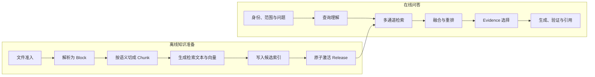

# RAG 的系统位置、策略与升级路径

用户问“远程访问被拒绝后怎样处理”，模型可能知道常见做法，却不知道组织刚发布的第 7 版制度，也不知道当前用户能查看哪些章节。把整份制度塞进系统提示只能应付很小的资料集：文件一多，上下文会迅速变长；文档更新后，缓存中的旧提示还可能继续生效；受限章节混进同一个 Prompt，又会带来越权风险。

**RAG** 是 Retrieval-Augmented Generation 的缩写，中文常译为检索增强生成。它先从外部知识中找出与问题相关的内容，再把这些内容作为证据交给模型。模型参数没有因此改变，外部资料也不会自动变成可信答案。RAG 增加的是一条可更新、可授权、可追踪的知识路径。基础检索链路可以对照 [LangChain Retrieval 概念文档](https://python.langchain.com/docs/concepts/retrieval/)，但文中的权限、版本和证据约束仍需要由应用自行实现。

::: info RAG 负责到哪里

RAG 接收已经确认的用户身份、知识范围、活动版本和查询，返回带来源身份的候选证据或明确的空结果。身份认证、权限策略、版本选择和最终业务决定仍由应用程序负责。

:::

这篇继续使用“远程访问规范”作为例子。资料包含普通正文、申请条件表和一页扫描附件。第 7 版已经发布，第 6 版仍为历史会话提供可复现查询。普通员工只能查看公开章节，安全管理员还能查看受限的处置流程。后面的数据流、策略选择和失败处理都围绕这组条件展开。

## RAG 补的是模型与外部知识之间的路径

一次普通模型调用只有模型参数和本次上下文。参数来自训练阶段，无法按请求读取刚更新的制度；上下文可以携带新资料，容量却有限，还需要应用主动装配。RAG 位于应用与模型之间，负责决定去哪里找、哪些结果可见、哪些片段值得进入上下文。

它与数据库查询有交集，但两者的输出目标不同。数据库查询适合精确读取结构化事实，例如“申请单 `RA-2026-0142` 当前状态是什么”；RAG 适合从正文、表格、附件和 Wiki 中找到能解释规则的片段，例如“设备合规失败后还能不能重新申请”。同一个回答可以同时使用数据库结果和检索证据，前者提供当前业务状态，后者解释制度依据。

全文检索、向量检索和知识图谱都是检索能力，不等于完整的 RAG。完整链路还要处理资料准入、解析、版本、权限、证据预算、引用和失败终态。把向量数据库接到模型前面，只完成了其中一段。

RAG 也不替模型判断事实是否真实。检索命中一段过期内容、越权内容或被提示注入污染的文字时，相关性分数再高也不能直接交付。候选先经过版本、权限和来源检查，模型只能在通过检查的 Evidence 上生成回答。

## 离线准备与在线检索是两条不同的链路

RAG 系统包含知识准备和问答执行两部分。前者把原始文件变成可检索版本，后者在一次请求内选择证据。它们通过 Release 和稳定来源 ID 连接，但运行时间、失败方式和恢复责任不同。



离线链路先校验文件类型、大小、哈希和来源。解析器保留标题层级、表格结构和扫描页警告，再按语义边界生成 Chunk。每个 Chunk 同时保存显示文本、回答文本、检索文本、章节路径、前后邻接和稳定来源定位。需要向量检索时，再为 `embedding_text` 生成向量，并记录模型、维度和内容哈希。

这些派生数据先写入候选版本。只有解析、切块、向量化和索引检查全部达到发布条件，系统才把候选版本原子激活。旧查询继续读取旧 Release，新查询读取新 Release，不能在同一次请求中一半读旧索引、一半读新索引。上传成功只表示原始对象已接收，不表示它已经可以检索。

在线链路从可信运行时取得用户身份、角色、组织关系、显式知识范围和 Release。查询理解可以提取意图、实体、编号、时间和指代，却不能自行扩大范围。检索器在允许集合内取得候选，融合和重排调整顺序，Evidence 选择器再按覆盖、相关性、多样性和 Token 预算收缩结果。

模型最终看到的是一小组带稳定身份的 Evidence，而不是数据库连接或整座知识库。回答中的 Claim 需要绑定 Evidence ID，验证器检查引用是否存在、是否支持对应断言。没有合格证据时返回空结果或安全拒答，不能让模型用参数知识补齐私有事实。

## 从原始文件到模型上下文会经过四次收缩

初次接触 RAG 时，很容易把 Chunk、Candidate、Evidence 和 Context 都理解成“搜出来的文本”。四者处在不同阶段，拥有不同的筛选条件。

**Chunk** 是离线索引单位。解析后的文档可能有标题 Block、段落 Block、表格行和扫描页文字，切块器根据章节边界和长度把它们组合成 Chunk。它要保留来源位置、父子关系、前后邻接和版本。一个 Chunk 可以进入索引，不代表任何用户都能读取。

**Candidate** 是某次查询中的候选。精确、全文、向量或图谱通道读取允许范围内的 Chunk，为它们附上通道排名与分数。Candidate 只表达“它可能与问题有关”。同一 Chunk 被多个通道找到时仍是一个 Candidate，只是多了通道证据。

**Evidence** 是经过版本、权限、去重、重排和预算选择后，准备支持某个问题的候选。Evidence 要有稳定 ID、来源标题、章节路径、正文和必要的结构字段。系统还要记录它打算覆盖哪个问题或 Claim。相关但重复的三段背景资料，可能只保留一段；相关性稍低但提供必要条件的表格行，反而需要留下。

**Context** 是本次模型调用的完整输入。它除了 Evidence，还包含系统约束、用户问题、多轮焦点、工具结果和输出格式。Evidence 进入 Context 时可能因为 Token 预算被压缩，但来源身份不能丢。压缩后的句子若无法回到原文位置，就不应继续作为可引用证据。

用远程访问问题看这四层：第 7 版制度离线生成 126 个 Chunk；用户权限和查询过滤后，三个通道合计产生 18 个唯一 Candidate；Evidence 选择器留下能覆盖“拒绝原因”和“重新提交条件”的 2 条；Context Compiler 再把这 2 条与问题、权限约束和输出 Schema 组合成一次模型调用。这里的数量只用于说明层次，不代表固定配置，真实值由资料结构、查询和预算决定。

这四层不能共用一个可变对象。若 Reranker 直接修改 Chunk 的全局分数，下一次查询会继承上一次结果；若 Context 压缩覆盖 Evidence 正文，引用回查只能看到截断内容。离线对象保持不可变，查询阶段产生新的 Candidate 与 Evidence 记录，更容易重放和并发隔离。

相邻内容也在不同层处理。Chunk 保存前后邻接，Candidate 可以在命中后读取邻接片段，Evidence 选择器判断是否合并。不能在解析时把每段前后文都重复复制进 Chunk，否则索引体积和重复候选会快速增长。也不能等模型发现句子缺条件后再临时读库，因为那绕开了本次权限、Release 和 Trace。

## 一次请求需要固定哪些输入和状态

“查询文本”不足以描述一次可复现检索。至少要固定以下输入：

| 输入 | 可信来源 | 为什么要固定 |
| --- | --- | --- |
| `query` | 用户消息与多轮焦点 | 决定本次要回答的问题 |
| `user_id` 与权限主体 | 认证服务 | 限制可见知识，不能由 Prompt 提供 |
| `scope_ids` | 用户显式选择或授权范围 | 防止检索器跨范围寻找更相似内容 |
| `release_id` | 会话快照或活动版本服务 | 保证引用可以按同一版本重放 |
| 检索配置 | 版本化应用配置 | 固定通道、Top K、融合和重排策略 |
| `deadline` 与预算 | 运行时 | 限制外部调用、候选数量和研究轮数 |

执行中还会产生结构化查询、各通道排名、候选 ID、融合分数、重排结果、权限裁决和 Evidence 集合。它们属于 Trace，不应被揉成一段自由文本。排查“答案漏了申请条件”时，要知道条件在解析阶段就不存在，还是进入向量候选后被融合压低，或者最终被 Evidence 预算删掉。

候选身份需要在通道之间保持稳定。同一 Chunk 可能同时被编号精确通道、中文全文通道和向量通道命中，融合时应合并为一个候选，并保留三个通道标签。若每个通道各生成一个临时 ID，系统会把同一段文字当成三份证据，既挤占 Top K，也会虚高召回。

版本和权限贯穿整条在线链路。查询开始后，即使管理员撤回了某个对象，缓存命中也要重新检查当前可见性。指定第 6 版的历史会话只能读取属于第 6 版的 Chunk；第 7 版文本语义更相似，也不能混入这次回答。

## 三种策略对应三种控制复杂度

RAG 不需要从复杂 Agent 开始。策略升级应由查询难度和失败证据推动。

### 固定的 2-Step RAG

最小方案只有两步：程序检索一次，模型根据返回证据生成一次。通道、Top K、过滤和 Prompt 结构都由代码预先确定。它适合问题范围清楚、一次检索通常能找到答案的知识库，也便于计算延迟和测试失败路径。

对于“`RA-2026-0142` 被拒绝的制度依据是什么”，程序可以先按申请编号和当前范围查业务对象，再以制度名称和失败原因检索规则。若产品场景已经知道对象类型，甚至不需要模型做查询规划。

固定流程的缺点是不能根据第一批结果主动调整问题。用户说“它为什么失败”，多轮焦点没有解析出来时，一次检索会拿着“它”去搜。解决这类问题应先补多轮焦点和查询理解，不必马上引入 Agent。

### 混合检索与受控回退

查询同时包含编号、中文描述和表格条件时，一条通道容易漏结果。混合检索让精确、全文、向量、表格或范围浏览通道在同一授权集合内工作，再按稳定身份去重、融合和重排。

混合检索增加了通道超时、分数不可比、候选重复和成本预算等问题。系统要明确某条增强通道失败后能否继续。Embedding 服务超时时，精确和全文候选仍可形成受控降级结果；权限服务失败时不能降级为“不检查权限”。前者影响质量，后者破坏安全边界。

### Agentic RAG 与研究循环

一个问题需要拆成多个子问题、比较多份资料或根据证据缺口继续搜索时，运行时可以让模型提出下一条检索动作。程序保存 Search Plan、已覆盖问题、剩余预算和停止原因，每个动作仍经过范围、工具参数和结果校验。

比如“比较第 6 版与第 7 版远程访问制度，并说明变更对现有申请的影响”至少包含版本差异、适用对象和当前申请状态三个子任务。研究循环可以先找两版制度，再针对缺失条件补检索，最后按 Claim 汇总证据。

模型决定下一步会扩大故障面。重复改写同一个问题、不断扩大范围或在空结果后凭参数知识作答，都需要显式停止条件。研究循环还会增加延迟和 Token 消耗。固定检索可以完成的任务继续用固定检索，查询复杂度本身不能成为采用 Agent 的理由。

## 远程访问问题怎样走完整条证据链

用户问：“我的远程访问申请因为设备不合规被拒绝，还能重新提交吗？”当前会话固定第 7 版制度，用户只能访问公开章节。一次正常执行可以这样展开：

| 顺序 | 状态变化 | 可观察结果 |
| ---: | --- | --- |
| 1 | 认证上下文写入 `user_id` 与权限主体 | 后续查询不再从消息中读取身份 |
| 2 | 多轮焦点与查询理解提取“远程访问、设备不合规、重新提交” | 生成结构化查询，不修改权限范围 |
| 3 | Release 固定为第 7 版 | 缓存键和候选都绑定同一版本 |
| 4 | 精确、全文和向量通道取得候选 | 每条结果保留 Chunk ID 与通道排名 |
| 5 | 去重、融合和重排 | 同一 Chunk 合并，受限章节已被过滤 |
| 6 | Evidence 选择覆盖“拒绝原因”和“重新提交条件” | 两条必要证据进入 Prompt |
| 7 | 模型生成 Claim，验证器核对引用 | 支持的结论交付，缺失条件明确留空 |

假设全文通道命中“设备合规失败后可重新提交”，向量通道命中“整改完成后重新发起申请”，两条片段来自同一章节的相邻 Chunk。融合器保留它们的来源身份，Evidence 选择器可以合并邻接内容，避免模型只看到“可以重新提交”而漏掉“整改完成后”的前提。

如果受限处置手册包含更详细的内部检查项，它对普通用户仍然不可见。相关性排序不应先把它加入候选再指望 Prompt 隐藏；过滤最好尽量靠近数据读取。最终交付前仍要复查可见性，用于处理缓存期间发生的撤权。

输出不应只有一段答案。至少还要保留本次 Release、Claim 对应的 Evidence ID、来源标题与章节路径、检索 Trace、终止状态。客户端可以只展示易读的引用，审计和回归则依靠稳定 ID 重放。

## 空结果必须保留发生位置

“没有结果”可能出现在不同层，每一种都对应不同动作。

原文件解析失败时，索引里根本没有相关 Chunk。继续放大 Top K 没有用，应回到解析警告、Block 数量和失败页检查。解析成功但切块把条件与结论分开时，标题可能命中，必要条件仍未进入同一 Evidence，修复点在切块或邻接补全。

索引中存在 Gold Evidence，各通道都未召回，才需要检查查询理解、词项、Embedding、过滤和通道限额。通道候选中已有 Gold，融合后消失，问题在去重或融合。最终候选中存在，Prompt 却没有，检查 Evidence 预算和覆盖约束。

权限过滤后的空结果不能自动扩大范围。指定部门、文档或 Release 时，范围内没有答案就返回 `empty_in_scope`。权限服务不可用时结果是 `authorization_unavailable`，系统不能把它包装成普通空结果，更不能切到全库搜索。

版本未就绪也要单独表达。第 7 版文件已经上传，但候选索引尚未原子激活时，在线请求继续读取第 6 版，或者明确返回 `release_not_ready`，取决于调用方是否指定新版本。不能读到一部分第 7 版 Chunk 后把缺失内容交给模型补写。

## 离线与在线失败由不同组件恢复

离线任务通常可以重试，因为它处理的是派生数据。重试仍要绑定文档版本和内容哈希：同一文件、解析配置和切块配置重复执行，应得到同一组稳定来源定位；文件已经上传新版本时，迟到的旧任务只能写入旧候选区，不能覆盖当前活动版本。

解析器出现部分成功时，状态要带上警告。比如普通文本与表格解析完成，扫描页 OCR 失败，系统可以保存候选结果，却不应把版本标成完整就绪。发布策略可以要求全部页面成功，也可以允许带警告激活，选择取决于业务对缺页的容忍度。无论采用哪种策略，在线检索都应能看到版本的完整性状态。

Embedding 批次也可能部分失败。成功向量与失败 Chunk 分开记录，重试只提交缺失项，并用内容哈希防止重复写入。若向量不是必需通道，版本可以提供精确和全文检索，同时把向量状态标为未就绪；若产品承诺语义检索，原子激活就应等待向量完成。把两种产品契约混在一个模糊的 `ready` 状态里，调用方无法判断降级程度。

在线失败受本次 Deadline 约束。某个检索通道超时后，系统取消未完成工作并保留已经确认的 Candidate。是否继续取决于剩余结果能否满足问题覆盖，而不是“至少返回了一条”。远程访问问题只找到重新提交入口，却没有整改前提时，应返回证据不足，不能把半条链路写成完整答案。

Rerank 属于质量增强层。调用失败时可以回到可解释的融合顺序，并在 Trace 中标记 `rerank_degraded`。回退排序仍需通过权限和 Release 检查。相反，ACL 快照加载失败、Release 不一致或候选来源身份缺失会破坏可信边界，请求应停止，不能用旧缓存或模型判断代替。

客户端断开与任务失败也要分开。同步问答可以在断开后取消下游调用；异步研究任务可能继续保存终态，客户端重连后通过 Turn ID 和事件序号读取结果。无论采用哪种方式，重连不能复制一份新任务，否则两份运行可能消耗两次预算并产生不同引用。

恢复记录至少包含发生阶段、输入版本、已完成步骤、可重试性、剩余预算和清理结果。离线扫描器据此重派未完成批次，在线运行时则根据错误类型返回降级、拒答或稍后重试。统一捕获异常后重新执行整条链路，会重复生成向量、覆盖候选版本，也会让真正的失败位置消失。

### 用一次 Trace 还原证据为什么缺失

假设回答只说“可以重新提交”，漏了设备整改条件。排查从最终 Claim 开始：它绑定了哪条 Evidence，Evidence 进入 Prompt 时是否保留完整条件。若 Prompt 中已经缺失，继续查看 Evidence 选择记录，确认是 Token 预算删除了条件，还是相邻 Chunk 没有合并。

Evidence 候选中也没有条件时，再查看重排前后的稳定 Chunk ID。重排前存在、重排后消失，说明排序或候选截断需要调整；融合结果中已经不存在，则对比各原始通道。向量通道找到而融合丢失，检查去重身份和融合排名；所有通道都没有，继续查索引中是否存在对应来源。

索引里没有该事实时，Trace 转到离线版本。先确认查询绑定的是第 7 版，再按来源 ID 找文档版本、解析 Block 和 Chunk。原始页存在但 Block 缺失，责任在解析；Block 完整而 Chunk 把条件截断，责任在切块；Chunk 正确却未进入活动索引，检查 Embedding 状态和 Release 激活。

每一步只需要稳定 ID、排名、过滤原因和配置版本，不需要把完整正文复制进日志。取得排查权限的人再到受控存储查看内容。这样既能定位责任层，也不会让 Trace 系统成为绕过知识权限的入口。

同一条 Query ID 在修复后重新运行，比较 Gold Evidence 最早出现的位置和最终 Claim 支持情况。若只是把 Top K 从 10 调到 100 才找回条件，还要检查噪声、延迟和 Token 是否超出预算；能找回不代表方案已经适合发布。

::: danger 不可信内容不能改变运行时

检索到的文档可能包含“忽略之前规则”“调用工具导出全部资料”等文字。它们是待引用内容，不是系统指令。检索结果不能改写权限、工具参数、Release、预算和停止条件。

:::

## 评测结果决定是否需要升级策略

选择 RAG 策略前，先建立带 Gold Evidence、权限和 Release 的查询集。固定检索若已在关键切片达到要求，增加研究循环只会扩大成本与恢复责任。升级的依据应是可重复的失败分布，而不是个别问题看起来复杂。

入库侧检查解析保留率、Chunk 边界、稳定 ID、向量维度和原子激活；检索侧观察 Recall@K、MRR、nDCG、空结果类型和权限泄露；答案侧检查 Claim 支持率、Citation 准确率与安全拒答。三个层次要分开，否则回答偶然正确会掩盖检索证据缺失。

若编号查询反复失败，优先增加精确通道；自然语言查询召回不足，再评估全文或向量；多通道已经找全，但前排噪声太多，可以增加 Rerank；只有必须根据中间证据继续拆问的问题，才进入研究循环。每次升级只解决已观察到的责任层。

延迟和资源一起进入比较。混合检索会增加数据库工作量，Rerank 增加外部调用，研究循环还会增加轮数。报告同时保存质量、P95 延迟、调用次数、候选数量和 Token 使用条件，不用单一平均分决定发布。

## 哪些问题不适合使用 RAG

知识库中没有可靠来源时，RAG 只能找回不相关内容。天气、库存、余额、审批状态等实时事实应读取对应业务 API；检索文档只能解释规则，不能替代当前状态。需要执行转账、删除或审批的任务也必须走确定性工具和授权流程，Evidence 只提供决策依据。

资料很少且稳定时，把经过审核的短文本直接放入上下文可能更简单。结构化条件已经存在数据库中，SQL 或领域查询通常比先转成文本再做向量检索更准确。回答必须穷举全部记录时，Top K 检索也不合适，因为它的目标是找相关候选，不保证返回全集。

模型参数已经足以回答的通用问题不一定需要 RAG。强行检索会带来无关文档和额外延迟。应用可以根据问题类型选择普通模型调用、固定工作流、数据库查询或 RAG，但选择规则要可测试，不能让模型在没有约束的情况下任意扩大数据访问。

## 生产设计需要保留可替换边界

检索器的对外协议保持稳定：输入是查询、可信范围、Release、配置与预算，输出是候选证据、Trace 摘要和终止状态。内部可以更换 Embedding、索引和 Reranker，调用方不应依赖供应商响应结构。

离线与在线容量分别核算。离线关注文件大小、解析并发、Chunk 数、Embedding 批次、索引构建和旧版本保留；在线关注并发查询、通道 Top K、连接池、缓存、Rerank 候选、Evidence Token 和端到端 Deadline。增加并发可能缩短单次等待，也会占用更多连接和配额。

Trace 只保存排查所需的稳定 ID、版本、分数、阶段时长和错误类型。原始文档、完整 Prompt、凭证和敏感查询留在受控存储，并设置访问权限和保留期限。指标标签不能放用户输入或正文，否则监控系统会变成新的泄露位置。

缓存键需要包含查询规范化结果、权限主体、范围、Release、通道与检索配置。缓存命中后重新鉴权，撤回对象立即从结果中过滤。缓存或 Embedding 服务故障可以绕过增强层继续检索，授权与版本检查失败则停止请求。

共享示例实现了语义切块、范围内向量检索和 RRF 融合，用来验证这些算法的最小控制逻辑：

<<< ../../examples/ai-agent/rag_pipeline.py

运行示例测试：

```bash
PYTHONPATH=examples/ai-agent \
  python3 -m unittest discover \
  -s examples/ai-agent/tests \
  -p 'test_examples.py'
```

这里的内存对象和手工向量不能证明数据库索引、中文分词、权限隔离或线上模型行为。生产集成还要在隔离数据中验证解析、PostgreSQL 全文索引、pgvector、缓存重鉴权、Release 切换和失败恢复。
