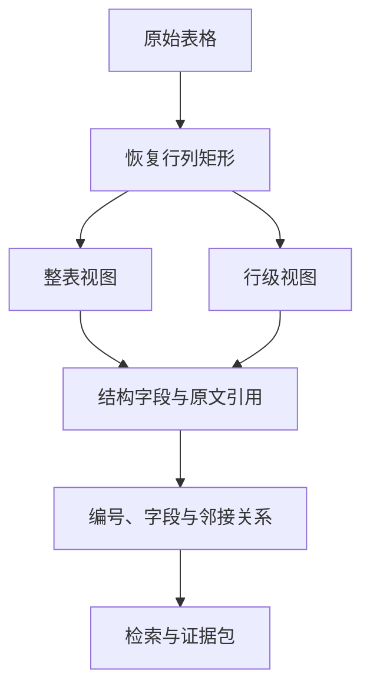

# 表格怎样生成可检索的结构化 Chunk

表格把含义放在行列关系里。单元格只写“需要”，读者要同时看到列名“是否审批”和行名“生产权限”，才能知道它在说什么。把整张表转成一段连续文本，向量检索还能捕捉大概主题，却很难回答“编号 RA-204 的审批人是谁”这类精确问题。

另一种极端是每个单元格生成一个 Chunk。值虽然精确，表头、同行字段和所属章节都丢了。“负责人”列里的“李某”会和多个权限项混在一起，最终引用也无法展示完整记录。可检索表格需要同时保留整表语境与行级结构，并让它们指向同一个 Table 身份和 Source Version。

本文用一张远程访问审批表推演。表头是“编号、权限类型、适用对象、是否审批、审批角色、有效期”，其中有重复行、两侧空列和一条很长的说明。处理结果要支持主题问题、精确编号、字段过滤和原表引用，任何归一化都不能改变字段对应关系。



## 表格进入 Chunker 前先恢复矩形

来自 Markdown、HTML、DOCX、XLSX 和 PDF 的表格最终要形成表头数组与行数组。每行列数可能不同，构建器先取最大宽度，用空字符串补齐短行。没有这一步，第三列为空时后面的值会左移，`审批角色` 可能被错误映射到 `是否审批`。

补齐后再识别真实列范围。若最左和最右整列都为空，可以裁掉；中间空列不能删除，因为它仍占据位置。下面这张表的第一和第四列属于导出工具产生的空边界，归一化后只保留“名称、价格”两列：

```md
|  | 名称 | 价格 |  |
| --- | --- | --- | --- |
|  | 月卡 | 9.9 |  |
```

空表头需要稳定占位名。第一个未命名字段可以称为 `Column 1`，后续按列号递增。占位名用于结构字段与调试，不应该覆盖原表展示。若大量表格都缺表头，问题多半出在解析器或源文档，行级 Chunk 虽然还能生成，也不适合直接做字段过滤。

全空行、只含 Markdown 分隔符的行、与表头完全相同的重复表头会被移除。PDF 跨页表格常在每页重复表头，去掉它能避免把列名当成数据。完全相同的数据行也可以在同一表格内去重，但要谨慎：考勤或交易记录中两行字段相同仍可能代表两次事件。通用实现按内容去重属于明确取舍，业务需要保留重复时，必须加入来源行号或记录身份再判断。

矩形化不负责修复合并单元格。源解析器可能把合并值放在第一行，后续行留空，也可能复制到每行。表格模型应保存合并范围或至少记录警告；不能看到空单元格就自动向下填充，因为空值可能正是业务含义。
## 一张表需要整表与行级两种视图

整表 Chunk 保留标题、表头和多行关系，适合“比较不同权限的有效期”或“这张表说明了什么”这类问题。行级 Chunk 把一行展开成字段对，适合按编号、人员、状态和日期查询。两种视图来自同一 Block，不是两份独立事实。

假设一行内容如下：

```text
编号: RA-204; 权限类型: 生产; 是否审批: 是; 审批角色: 系统负责人
```

它单独离开表格仍能理解。`structured_fields` 同时保存字典结构，检索器可以对 `编号` 做精确匹配，对 `权限类型` 做字段过滤。display content 可以返回原表行或规范字段对，引用界面再利用 table ID、行号和 Source Version 打开原表。

小表通常同时生成整表与每行 Chunk。配套实现把十二行以内定义为小表；超过十二行不再生成整表 Chunk，只保留行级结果。这个阈值是具体实现参数，不是通用规则。列数、平均单元格长度和模型窗口都影响整表大小，生产系统更适合按实际字符与 Token 决定。

即使行数不多，整表内容也可能超过最大 Chunk 长度。构建器会在每一段重新带上表头和分隔线，再按行组合。这样第二个片段里的值仍有列名，不会变成脱离语境的管道符文本。单行本身超长时，再用语义切分兜底，每个片段都带表头。

整表与行级 Chunk 会造成一定重复，但这是有用途的多视图，不等同于固定重叠。质量检查的重复键包含 Chunk 类型，所以同一内容分别出现在 `table_full` 与 `table_row` 不会被直接判为重复；同一 Source、同一类型、同一内容出现两次仍会触发检查。
## Table ID 把多个视图连接回同一来源

Table ID 应由文档、Source、章节路径和规范表格内容共同生成。它在同一候选版本里稳定，把整表片段、行级 Chunk 和引用定位关联起来。表格内容或章节位置变化时，ID 变化，避免旧行引用落到新表。

当前紧凑实现的 Table ID 使用文档 ID、Source ID、章节路径和表格内容摘要，没有单独加入文档版本。由于 Chunk 本身绑定 Document Version 和 Source Version，在线证据仍然版本隔离；若 Table ID 会跨版本用于缓存或外部接口，则应把版本身份明确加入，或者另设逻辑 Table Key。

每个行级 Chunk 还保存 `table_row_index`。行号只在该 Table Version 内有意义，前面插行后会变化。跨版本迁移不能拿行号当业务身份，应优先使用明确业务键，例如编号、工号或规则 ID。没有业务键时，只能用多字段组合匹配，并接受存在歧义。

章节路径为表格提供上层语境。两个章节都有“编号、状态”表头时，Embedding 文本加入文档标题、Source 标题和章节路径，能帮助向量检索区分。字段过滤仍要带 Source、Release 和 ACL，不能仅凭 Table ID 查询全库。

表格引用最终需要 Source locator。XLSX 可以保存工作表与单元格范围，PDF 可以保存页码和区域，DOCX 可以保存表格序号。当前通用 Chunk 字段只有 Source、章节、Table ID 和行号，还不能承诺原文件精确高亮。若产品需要点击定位，解析器、Block 和 Chunk 必须一起扩展。
## 字段映射要处理空表头与重复列名

行级映射按列位置取表头，表头为空时使用占位名。问题出现在重复表头，例如两列都叫“状态”。普通字典后写值会覆盖前一个值，结构字段丢失一列。构建器应在归一化阶段把重复表头改成稳定的内部名，如 `状态`、`状态_2`，display content 仍可显示原名，并记录原列序号。

字段值保留原始字符串，不在 Chunker 内猜日期、金额和布尔类型。`2026-08-17` 可能是日期，也可能是版本号；`0012` 转成数字会丢前导零。类型推断适合由表格 Schema 或业务配置完成，并在 structured fields 中保留原值和规范值。

空值也有语义。字段对可以输出 `审批角色:`，结构字典保留空字符串，后续筛选能区分字段存在但为空与字段根本不存在。为了让 Embedding 文本更自然，可以省略部分空字段，但 display content 和结构字段不能丢。

数值比较需要单独的规范字段。“9.9 元”“￥9.90”和字符串“9.9”展示接近，排序与区间查询却不能直接比较。解析层保留原值，受信 Schema 再生成带单位和精度的规范值，并保存转换错误。公式单元格还要区分公式、缓存结果和计算时间；模型看到显示值，不能证明它是最新计算结果。

任何规范化失败都保留原字段并停止对应的数值过滤，不能把转换错误当成零值继续排序。

单元格中的换行与管道符需要规范转义。Markdown 展示用 `<br>` 和 `\|`，结构字段保留逻辑文本。若哈希分别基于展示字符串和结构值，重建规则必须固定，否则只改转义方式会让所有 Table ID 改变。

多层表头不能简单把第一行当唯一列名。两行表头可以拼成“生产 / 审批角色”，也可以保存树形列路径。选择取决于查询方式，但必须在解析阶段识别。通用单行表头实现遇到复杂表时应发出警告，不要把第二层表头当数据行。
## 业务编号进入精确索引，不依赖向量相似度

`RA-204`、`REQ-KG-2026-0728`、`POLICY_17` 这类字母数字混合标识适合精确检索。向量模型可能把字符相近的编号映射得毫无规律，也可能在规范化时弱化连字符。Chunk 构建器可以从文档标题、Source 标题、章节路径和正文中提取业务标识，统一大小写后写入 `exact_terms`。

表格行还会把每个非空单元格的完整小写值加入精确词集合。因此纯数字端口 `8000`、中文档位“会员”和混合编号都能作为行级候选条件。是否把任意长中文句子放入 exact terms 要受长度与字段策略限制，否则精确索引会复制大量正文。

精确命中不是授权。查询 `RA-204` 后，检索器先在当前用户可见的 Release 和 Source 范围内匹配，不能先全局查编号再过滤返回值。缓存键也要包含权限指纹和版本，避免另一个租户相同编号的行被复用。

编号查询仍可与向量检索并行。精确通道负责把目标行带入候选，全文与向量通道补充相关制度说明，融合阶段按稳定候选 ID 去重。若精确结果已唯一且问题只问字段值，可以减少向量预算，但最终 Evidence 仍要带原表来源。

业务键还可用于跨版本差异。相同编号的新旧行可以比较字段变化，前提是该列由业务规则确认唯一。模型观察到“看起来像编号”只能生成候选，不能自动把它设为主键。
## 结构化字段怎样进入查询计划

用户问“编号 RA-204 的审批角色”时，查询理解先识别候选编号与目标字段。编号进入精确通道，在当前知识范围、活动 Release 和 Source 可见性内匹配 `exact_terms`；目标字段“审批角色”用于读取行级 structured fields。返回值仍带 Chunk 身份，不能只返回一个脱离来源的字符串。

用户问“所有生产权限的有效期”时，可以对 `权限类型=生产` 做字段过滤，再把命中行交给 Rerank 或按业务顺序返回。字段名必须来自受信 Schema 或白名单，模型产生的任意键不能拼成 SQL 标识。字段值也用参数化查询，避免自然语言输入进入数据库表达式。

主题问题“远程访问有哪些审批差异”缺少精确键，全文与向量通道可以命中整表、行级或章节父 Chunk。融合时用稳定候选 ID 去重，但不要把整表和行级视图强行合并成一个结果，它们承载的范围不同。Rerank 选出整表后，还可以展开其中高相关行，Evidence 最终引用原始字段与来源。

查询计划要区分字段不存在和字段为空。某行没有“审批角色”这一列，说明 Schema 不匹配；列存在但值为空，可能表示无需审批或数据缺失，不能自动解释。业务规则若规定空值含义，应由确定性映射给出，模型只负责把结果组织成文字。

范围放宽也有顺序。精确编号在当前 Release 无结果时，可以检查大小写和规范化形式；仍无结果就返回受限空结果，不应自动搜索其他知识范围。全文查询可以去掉部分问句词，字段过滤不能悄悄丢掉权限、时间和业务键。每次放宽都进入 Trace，最终回答说明证据范围。

表格行命中缓存后还要重新鉴权，并确认 Source Version 仍处于活动 Release。字段查询的缓存键至少包含规范查询、字段条件、知识范围、权限指纹、索引版本与策略版本。仅以编号做键，会让同编号的不同租户或历史版本互相污染。
## 表格版本差异要按业务行理解

新版本表格可能新增行、删除行、修改字段或只调整顺序。若表中有经过确认的唯一业务键，可以按键关联新旧行，再比较字段。没有唯一键时，使用多字段内容匹配只能得到候选差异，重复行和空值会带来歧义，需要人工确认。

行顺序变化不一定是业务修改。Table ID 若包含整表内容，任何排序都会生成新身份；版本化 Chunk 这样做能保证引用安全，却会扩大重建范围。可以另建逻辑 Table Key 与 Row Key 支持差异分析，线上 Evidence 仍固定到具体 Source Version 和 Table Version。

差异结果不能直接覆盖旧活动表。新解析器与 Chunker 在候选区生成整表和行视图，检查行数、键唯一性、关键字段、重复率与内容保留。通过后再原子切换 Release。候选失败时，旧版本继续服务，用户看到新上传状态为失败，而不是一张只更新一半的表。

删除行尤其需要证据。新表缺少 RA-204，可能是规则撤回，也可能是解析器漏了一页。系统先看解析警告、表格行数和原文件定位；只有新版本整体通过门禁，删除才随 Release 生效。后台迟到的旧任务也要因版本过期被拒绝，不能把已撤回行重新写回活动索引。

表格差异可用于回归样本。把每个已确认变更记录为“业务键、旧字段、新字段、来源版本”，检索测试分别查询新旧 Release，确认活动版本返回新值、历史引用仍能打开旧值、无权用户两边都看不到。测试使用匿名数据，公开文章不需要暴露真实表结构。

回滚时切换到上一份完整活动版本，不在新表上逐行做反向补丁。派生 Chunk、向量和缓存都按索引版本失效，避免字段已经回滚，向量候选仍来自新表。版本边界清楚，比给每行设计复杂补偿更容易验证。
## 超大表不能靠一个整表向量解决

一张数万行的资产表不适合生成整表 Chunk。即使分成多个 1800 字片段，每段共享同一表头，向量表示也会被大量相似字段淹没。大表应以行级或行组 Chunk 为主，先通过结构化过滤缩小范围，再做文本与向量排序。

行组适合需要跨行比较的场景，例如同一部门连续月份。分组键必须来自明确字段，不能按数组每十行随意切后就宣称有业务关系。没有分组语义时，保留单行并在查询阶段聚合更安全。

超长单行常见于“说明”列。整行字段对超过最大长度时，语义切分会产生多个 `table_row` Chunk，它们共享 Table ID、row index、table headers 和完整 structured fields。共享完整字段便于过滤，却会增加存储；另一种方案保存行记录 ID，Chunk 只放文本片段，查询后回表取完整字段。选择要比较存储、查询延迟和权限复核成本。

表头前缀占用最大长度预算。若列很多，仅表头就接近上限，整表视图已经不合适。行级内容也应挑选用于 Embedding 的字段，而不是把一百列都拼入。字段白名单属于表格 Schema，未配置时可以保守保留全部结构，但限制向量文本并记录截断。

分页不是切块策略。XLSX 的工作表、数据库的分页和 PDF 跨页只是物理组织，不能直接当语义分组。构建器先恢复逻辑表，再依据字段与行生成 Chunk；无法确认跨页属于同一表时，保留两个 Table ID 和解析警告。
## 重复行去重必须保留判断依据

配套归一化会删除完全相同的数据行，测试样本中两条“月卡 / 9.9”最终只生成一行。这能处理 PDF 重复提取和跨页表头复读，却可能误伤合法业务记录。使用前要确认表格是否集合语义。

规则表、配置表和产品价格表通常不需要完全重复行，内容去重合理。交易明细、访问日志和考勤记录即使字段相同，也可能是不同事件；它们需要时间、流水号或原始行定位来区分。解析器拿不到这些信息时，宁可保留重复并让质量门禁告警，也不要静默删除。

去重范围限制在同一 Table。两个章节各有相同“默认 / 启用”行，不应合并。身份可以用规范单元格元组，比较前只做确定性空白处理，不进行同义词或模型改写。若大小写是否敏感会影响业务，也要由 Schema 指定。

删除的重复数量应进入 Coverage，调试记录包含 Table ID 和原始行号，但不复制敏感单元格到普通日志。候选版本若去重比例突然升高，可能是源数据真的重复，也可能是解析器把不同列丢掉后看起来相同，需要人工核对。

表头行混入数据也属于特殊重复。归一化检测某行与规范表头完全一致时可删除；多层表头或章节内嵌说明不能用这一规则。支持矩阵要列出边界，复杂表优先交给专门解析器。
## 一张审批表的完整转换

输入表有六个业务列，左右各一列空白。数据区包含三种权限，其中测试权限行重复一次，生产权限的“补充说明”超过最大长度。Source Version、章节路径和文档版本已经固定。

归一化先补齐所有行，裁掉两侧全空列，保留中间空值；删除重复表头、全空行和第二条完全相同的测试权限行。输出表头六列、数据三行，Coverage 记录原表行数、规范行数与一次去重。

表格只有三行，构建器尝试生成整表视图。生产权限长说明使整表超过上限，于是按行拆成多个 `table_full` Chunk，每段都重复六列表头。长说明所在行自身仍超限时再切为多个片段，任何片段不超过最大长度。

随后每一行生成字段对。生产权限行被拆成多个 `table_row` Chunk，它们共享 Table ID 和 row index，structured fields 保存完整六字段。`RA-204` 进入 exact terms，Embedding 文本加入文档标题与“审批规则 / 生产权限”章节路径。

正常输出支持三条查询。“生产权限需要谁审批”可由行级向量或全文命中；“RA-204”由精确通道命中；“比较三种权限有效期”先命中整表视图，再展开三行。所有 Evidence 都回到同一 Source Version 与 Table ID。

故障样本把第二列解析丢失，后续字段整体左移。结构测试发现表头六列而数据只有五个有效位置，业务编号落在错误字段；候选版本失败。另一个样本把两条合法交易行错误去重，带原始行身份的测试发现行数不守恒，要求切换为保留重复策略。
## 表格质量门禁检查内容、结构与引用

内容保留检查把表头和每个非空单元格视为单元，确认它能在 Chunk content、table headers 或 structured fields 中找到。整表切成多段不影响保留率，行级结构丢字段会直接降低。标题仍在 section path 中验证。

结构不变量包括：表头数量稳定；每行字段键与规范表头对应；每个行 Chunk 有 Table ID 和 row index；所有内容不超最大长度；相同 Source 同类型没有意外重复；父节点和邻接引用存在。复杂表格还要加业务键唯一性、类型和合并单元格约束。

Coverage 通过不代表查询效果好。评测集需要精确编号、单字段查询、多字段组合、跨行比较、空值与否定条件。记录候选召回、首个正确结果位置、Rerank 后顺序和最终 Evidence。向量通道找不到编号时，精确通道应提供候选；字段过滤不能把权限外行带入。

失败报告要定位 Table 与行，不只给“保留率不足”。内部调试可以按授权读取结构字段，普通指标只记录数量、类型、长度与哈希。表格常含人员、金额和业务编号，直接把整行放进日志会扩大数据暴露。

候选版本中任何关键表结构回归都应停止激活，旧活动索引继续服务。不能用其他文档召回提升抵消一张权限表的列错位，平均指标不适合覆盖安全与业务不变量。
## 测试要覆盖正常表、退化表和大表

基础测试构造标题、两行参数表和一个附件 Source。断言整表与行级 Chunk 都存在，`PORT / 8000` 映射为正确字段，业务值进入 exact terms，Source 深度与 URL 保留。每条邻接仍限制在同一 Source Version。

归一化测试使用空边界列、重复行、全空行和重复表头。期望只保留真实列和一条业务行，输出中没有无意义 `Column`，structured fields 精确等于“名称 / 月卡、价格 / 9.9”。若重复行策略可配置，分别验证集合表与事件表。

大表测试不需要创建数万真实记录，可以用两行超长说明触发边界。断言所有 Chunk 小于最大值，整表被拆成多个带表头片段，行级 Chunk 仍有完整 table headers 和 structured fields。再用超过十二行的短表确认不会生成整表视图。

格式回归从 HTML、DOCX、XLSX 和 PDF 各准备一张等价表，比较规范字段、行数、业务编号和来源定位。解析结果允许有格式差异，字段含义必须一致。PDF 表格检测失败时不能用普通段落输出冒充结构成功。

线上检索测试给当前用户一个有限范围，另一个范围放入相同编号。精确查询必须只返回可见行，缓存命中后再次鉴权；撤回 Release 后旧 Table ID 不再进入候选。这个用例证明结构化检索没有绕开 ACL。
## 表格 Chunk 仍是派生证据

字段映射正确，只证明系统忠实保存了解析结果。原表可能过期，OCR 也可能把编号识别错。Claim 引用表格时要带 Source Version、Release 和解析警告，关键字段必要时回看原文件定位。

模型不负责修复缺表头、猜合并单元格或补业务键。它可以解释已经选中的行，不能把自然语言推测写回 structured fields。确定性结构和模型解释保持分离，错误才有明确归属。

表格策略也不能替代全文与向量检索。精确通道擅长编号和字段，向量通道擅长主题描述，整表视图擅长比较。后续[Chunk 质量门禁](/docs/ai-agent/rag-chunk-quality-gates)会把内容保留、重复、孤立邻接、超限和回归样本统一成候选发布条件。
## 表格的检索单位是行与语义视图

表头、规范化字段、业务编号、行定位和整表摘要应同时保存。按字段查找依赖结构化列，比较趋势需要整表或相邻行，二者都要回到原文件定位。

合并单元格、空值、OCR 错列和超大表都要产生显式警告。模型可以解释已确认行，不能猜表头或修改结构化字段。
