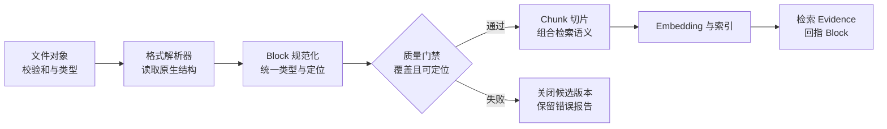

# 统一 Block：标题、段落、表格、代码和原文定位

Block 是一种位于解析器与知识处理之间的稳定中间表示。它用于把 PDF 页、Word 段落、PPT 形状和 Excel 单元格收敛为共同字段，同时保留标题层级、版面坐标、表头和代码语言。上游解析器生成 Block，下游切片器消费 Block，引用服务再根据 locator 回到原文件。

PDF 解析器返回页码和坐标，Word 解析器返回段落与样式，PPT 返回形状和幻灯片编号，Excel 返回工作表与单元格。它们都能提取文字，却没有一份共同语言。

如果切片器直接适配每一种第三方库，会出现两类问题：新增格式时重写切片逻辑；更换解析器时，已经生成的 Chunk ID、引用位置和增量更新全部漂移。反过来，如果一开始只做 `"\n".join(texts)`，标题、表头、代码语言和原文坐标会永久丢失。

Block 不是向量片段，也不是最终引用。它的职责是让解析器可以更换，而切片和引用协议保持稳定。

## 同一句文字为什么需要不同结构

看三个“7 天”：

```text
段落：生产访问默认有效期为 7 天。
表格：环境=生产 | 有效期=7 天
代码：retention_days = 7
```

字符串检索都能看到“7 天”，但它们的语义和展示方式不同。段落需要继承标题路径；表格值必须和列名、行标识绑定；代码需要保留文件、语言和所在函数。统一 Block 的目标不是抹平区别，而是用共同字段保存区别。

| 结构 | 必须保存 | 丢失后的后果 |
| --- | --- | --- |
| 标题 | 层级、文字、父标题 | 正文不知道属于哪个章节 |
| 段落 | 标题路径、顺序、页码 | 相邻上下文和引用错位 |
| 列表 | 列表 ID、项目序号、是否有序 | “第二步”无法回答 |
| 表格 | 表 ID、表头、行列坐标、合并信息 | 数值失去字段含义 |
| 代码 | 语言、文件、起止行、所属符号 | 代码与解释或函数边界分离 |
| 图片/OCR | 页码、边界框、OCR 置信度 | 无法回看原图，低置信结果被当事实 |

## Block 在导入链中的位置



文件对象先固定校验和与可信类型。解析器输出带自身格式细节的对象；规范化层将它们转换为 Block；质量门禁检查覆盖、顺序和定位。只有通过的 Block 才进入切片。Chunk 保存组成它的 Block ID，Evidence 保存 Chunk 和 locator，因此答案引用可以回到原页、幻灯片或单元格。

失败路径同样重要。解析出少量页眉不代表成功，定位字段缺失也不能静默继续。候选知识版本应保存失败报告，线上仍使用旧 Release。

## 定义不会随解析库漂移的领域模型

`app/ingestion.py` 中的 Block 不应直接保存 PyMuPDF、python-docx 或 openpyxl 对象。这些对象会随库版本变化，也无法跨进程序列化。领域模型只保存下游真正需要的稳定数据：

```python
from __future__ import annotations

from dataclasses import dataclass, field
from enum import StrEnum
from typing import Mapping

class BlockKind(StrEnum):
    HEADING = "heading"
    PARAGRAPH = "paragraph"
    LIST_ITEM = "list_item"
    TABLE_ROW = "table_row"
    CODE = "code"
    IMAGE_TEXT = "image_text"

@dataclass(frozen=True, slots=True)
class SourceLocator:
    file_id: str
    # location_kind 决定 location_value 是 page、slide、sheet 还是 line_range。
    location_kind: str
    location_value: str
    # bbox 采用页面坐标；非版面格式保持 None，不能用全零伪装有效位置。
    bbox: tuple[float, float, float, float] | None = None

@dataclass(frozen=True, slots=True)
class Block:
    block_id: str
    kind: BlockKind
    text: str
    order: int
    title_path: tuple[str, ...]
    locator: SourceLocator
    parent_id: str | None = None
    attributes: Mapping[str, str] = field(default_factory=dict)

def validate_block(block: Block) -> None:
    if not block.block_id or not block.text.strip():
        raise ValueError("block_id_and_text_required")
    if block.order < 0:
        raise ValueError("block_order_must_be_non_negative")
    if not block.locator.file_id or not block.locator.location_value:
        # 没有原文定位的文本不能进入可引用知识索引。
        raise ValueError("source_locator_required")
    if block.kind is BlockKind.TABLE_ROW:
        # 表格行必须携带表头；只有值的行无法形成独立语义。
        if not block.attributes.get("headers") or not block.attributes.get("table_id"):
            raise ValueError("table_row_requires_headers_and_table_id")
    if block.kind is BlockKind.CODE and not block.attributes.get("language"):
        raise ValueError("code_block_requires_language")
```

`BlockKind` 限制下游可识别的结构类型；`SourceLocator` 将格式差异收敛为定位类型和值；`Block` 保存文字顺序、标题路径和父子关系。`attributes` 只放类型特有字段，例如表头、表 ID、代码语言和 OCR 置信度，不能把所有核心字段都塞进无约束字典。

`validate_block()` 在入库前执行。空文本、负顺序和无定位直接失败；表格行必须带表头；代码必须声明语言。它验证的是跨格式不变量，具体的页码范围和单元格坐标格式还由各 Adapter 验证。

## 标题路径怎样随流更新

解析器通常按文档顺序产生标题和段落。规范化器需要一份标题栈：遇到二级标题时，替换同级旧标题并删除更深层级；普通段落复制当前路径。

```python
def update_title_path(current: list[str], level: int, title: str) -> tuple[str, ...]:
    # 层级和标题在修改路径前先校验，失败时旧路径保持不变。
    if level < 1:
        raise ValueError("heading_level_must_be_positive")
    clean_title = title.strip()
    if not clean_title:
        raise ValueError("heading_text_required")

    # 文档可能从 H1 直接跳到 H3；只保留实际出现的祖先，不虚构 H2。
    keep = min(level - 1, len(current))
    next_path = current[:keep]
    next_path.append(clean_title)
    # 返回不可变快照，调用方可直接写入随后生成的正文 Block。
    return tuple(next_path)
```

输入 `['部署', '候选验证']`，再遇到同级二级标题“切流”时，调用方传 `level=2`，结果变成 `('部署', '切流')`。遇到三级标题时保留前两级。函数不会填充不存在的中间标题，因为虚构层级会让引用与目录不一致。

标题 Block 自己也进入序列，方便搜索章节名；正文 Block 复制路径，切片时即使不和标题放在同一 Chunk，也能把标题路径加入检索文本。

## 表格不能在规范化时丢掉二维关系

表格行适合召回，但必须同时保留结构字段。假设工作表中有：

| 环境 | 验证动作 | 通过条件 |
| --- | --- | --- |
| 生产 | 检查健康接口 | 状态为 healthy |

规范化后的 Block 可以这样表示：

```python
table_row = Block(
    # 检索文本显式展开“列名=值”，避免单独的数值失去语义。
    block_id="blk-table-7-row-2",
    kind=BlockKind.TABLE_ROW,
    text="环境=生产 | 验证动作=检查健康接口 | 通过条件=状态为 healthy",
    order=18,
    title_path=("发布", "验证清单"),
    locator=SourceLocator(
        file_id="file-demo",
        location_kind="sheet_range",
        location_value="发布检查!A2:C2",
    ),
    parent_id="blk-table-7",
    attributes={
        # headers 既参与验证，也让后续切片器能够按列重组大表。
        "table_id": "table-7",
        "headers": "环境|验证动作|通过条件",
        "row_index": "2",
    },
)
# 构造后立即检查跨格式不变量，失败的表格行不会进入切片器。
validate_block(table_row)
```

`text` 用于全文和向量召回，字段名与值成对出现；locator 定位到工作表范围；`parent_id` 连回整表；attributes 支持按行重组。合并单元格的继承值应在解析 Adapter 中显式展开，同时保存原坐标，不能由语言模型猜测。

## 稳定 ID 不能依赖数据库自增值

重新导入同一文件时，如果每个 Block 都拿到新自增 ID，向量、引用、缓存和增量更新会全部失效。稳定 ID 可以由这些确定性输入计算：

```text
文件内容校验和
+ 解析器规范版本
+ Block 类型
+ 规范化定位
+ 结构内顺序
```

不要只哈希正文。文档中两个相同的“注意”段落会碰撞；正文小改也会让后续定位整体漂移。locator 和 order 区分重复内容，解析器规范版本让规则变化可控地产生新 ID。数据库主键仍可用于内部关联，但公开稳定 ID 应能在同版本重建。

## 覆盖率检查要发现“看似成功”

一个 PDF 有 20 页，解析器只读到 20 个页码，Block 数大于零，但有效覆盖几乎为零。检查需要比较源文件清单与 Block 清单：

```python
@dataclass(frozen=True, slots=True)
class CoverageReport:
    source_units: int
    covered_units: int
    located_blocks: int
    total_blocks: int
    missing_units: tuple[str, ...]

def check_coverage(blocks: list[Block], expected_units: set[str]) -> CoverageReport:
    # 先逐块校验定位和结构，避免覆盖率统计掩盖非法 Block。
    for block in blocks:
        validate_block(block)

    covered = {block.locator.location_value.split(":", 1)[0] for block in blocks}
    missing = tuple(sorted(expected_units - covered))
    report = CoverageReport(
        source_units=len(expected_units),
        covered_units=len(expected_units - set(missing)),
        located_blocks=sum(bool(block.locator.location_value) for block in blocks),
        total_blocks=len(blocks),
        missing_units=missing,
    )
    # 阈值应按格式配置；关键页缺失时，即使总比例够高也应失败。
    if missing:
        raise ValueError(f"source_units_missing:{','.join(missing)}")
    # 只有所有期望单元都被覆盖时，报告才会交给候选 Release 的质量门禁。
    return report
```

`expected_units` 可以是 PDF 页、PPT 幻灯片或工作表集合。函数先验证每个 Block，再比较覆盖单元。示例采用“任何缺失都失败”的严格策略；实际系统可以允许封面空页，但应把允许规则配置化，并单独阻断标记为关键的页面或工作表。

除了单元覆盖，还要抽查标题层级、表格数、代码围栏数、OCR 页和字符分布。版本发布报告应能回答“哪一页没有内容”“哪张表没有表头”“哪段代码缺语言”，而不是只有一个总分。

## Block 与 Chunk、Evidence 的边界

三者经常被混用：

- **Block** 忠实表达解析结构，一段、一个标题或一行表格就是一个单元。
- **Chunk** 为检索组织语义，可以组合多个相邻 Block，也可以为大表生成多个带表头片段。
- **Evidence** 是一次查询中通过版本、权限和质量检查后被选中的证据，包含相关分数和引用范围。

Block 不应该为了某个问题动态变化；Chunk 可以随切片策略版本重建；Evidence 每次查询产生。把三者拆开后，切片策略升级不会要求重新解析原文件，检索结果也能回到稳定 Block 定位。


**为什么不直接使用 LangChain `Document`？**

`Document(page_content, metadata)` 适合检索框架边界，但 metadata 通常是宽泛字典，无法自动保证表头、代码语言和 locator 存在。可以在 Retriever Adapter 中把 Block/Chunk 转成 Document，领域层仍应保留更严格的类型和校验。

适配时只做一次明确映射：`Chunk.text` 进入 `page_content`，稳定 ID、Scope、Release 和 locator 进入受控 metadata；Retriever 返回后再还原为 Evidence。若某个必需字段缺失，Adapter 应失败而不是填空字符串，这样解析契约问题会在接入点暴露，不会等到引用阶段才发现无法回原文。

**Block 应该多大？**

大小由原文结构决定，不由固定 Token 决定。一个标题、段落、列表项或表格行通常各自成为 Block。Token 长度控制属于下一层 Chunk；过长的单个表格或代码 Block 可以保留父对象，再生成受控子 Block。

**OCR 每一行都要成为一个 Block 吗？**

通常不需要。OCR 行是识别器输出，不一定是语义段落。应根据版面坐标、段落间距和阅读顺序合并，同时保存原始行与置信度引用。低置信度数字不能在合并后失去标记。

**HTML 的 locator 应该保存 CSS Selector 吗？**

可以保存稳定 DOM 路径或元素 ID，但仅靠 `nth-child` 很容易随模板变化。更稳妥的是同时保存规范 URL、标题路径、语义锚点和内容指纹；动态页面还要记录抓取版本。locator 的目标是能重新定位，不是绑定某一种选择器。

**文档改了一句话，Block ID 是否应该变化？**

若 ID 包含文件校验和，整个版本的 Block ID 都会变化，版本隔离清晰但增量复用少；若使用局部内容和结构定位，可以只更新受影响 Block，但算法更复杂。选择取决于发布与回滚要求，无论哪种都要把 ID 规则版本化并用重复导入测试固定。

**标题本身需要向量化吗？**

标题通常应进入检索文本，但不一定单独生成向量。短标题脱离正文语义有限，可以作为 Chunk 前缀；目录查询或章节导航场景则可以建立标题专用索引。必须保留原始标题 Block，向量策略可以后续重建。

**为什么 attributes 不允许保存任意对象？**

第三方对象难以序列化、版本化和跨语言读取，还会把解析库泄露到领域层。attributes 应限定为稳定标量，并为重要字段逐步提升为显式类型。无法解释的临时调试数据留在解析报告，不进入长期 Block 契约。

**怎样验证每个 Block 真的能回到原文？**

做 locator round-trip 测试：用 locator 从保存的原文件或渲染制品读取对应区域，规范化后与 Block 文本比较。表格校验工作表和范围，代码校验文件与行区间，PDF/PPT 渲染定位区域。抽样通过不足以替代全量结构校验，关键字段还要逐项比对。
