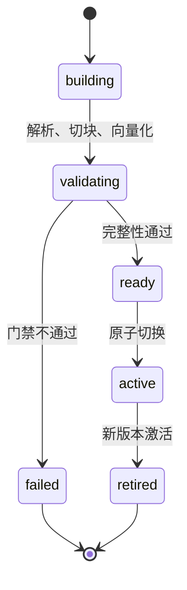

# 候选索引怎样原子激活与回滚

文档更新包含 23 个 Chunk。前 20 个已经写入向量，最后 3 个还在处理。如果查询此时直接读取新记录，用户会看到一个缺页的版本；若查询有时读旧 Chunk、有时读新 Chunk，同一次回答里的证据甚至不属于同一份文档。

候选索引把构建过程与查询隔开。新内容先在不可见版本中完成解析、切块、向量化和质量检查，所有条件满足后，数据库在一个事务里切换活动指针。查询只能看到完整旧版本或完整新版本，不会看到构建中间态。

知识库级发布还多一层：同一份文档除了 RAG Chunk，可能生成 Wiki 卡片和知识图谱。单文档向量 ready，不代表整个知识 Release 可以使用；发布服务要等每个文档的 RAG、Wiki 和 Graph 投影都 ready，再把旧 Release 退役并激活新 Release。

::: info 两层版本不要混为一个状态

**Document Version** 管一份文档的 Source、Chunk 和向量是否完整。**Knowledge Release** 固定一批文档快照及其多个知识投影。前者激活成功后，后者仍可能因为 Wiki 或图谱未完成而保持 building。

:::

本文用远程访问制度从 V2 更新到 V3 的发布过程贯穿全文。V2 正在服务，V3 增加 `RA-204` 权限表。构建任务会经历正常激活、质量失败、旧任务迟到和回滚，每一种状态都有明确的所有者和终止条件。



## 候选版本把构建过程与查询隔离

一份文档至少需要稳定的文档身份和不可变版本身份。文档记录保存 `active_version_id`，版本记录保存内容哈希、解析器、Chunker、Embedding 模型、维度、索引版本、Coverage 和发布状态。Chunk 指向具体 Document Version，不只指向可变文档。

V3 开始构建时，版本状态为 staging，Chunk 的 `active` 为 false。解析器和 Chunker 可以失败或重试，查询 SQL 仍固定 V2 的活动指针。新候选没有通过门禁之前，不能通过“最近创建时间”或“状态不等于失败”被普通查询读到。

构建过程不直接覆盖 V2 的行。就地更新向量、正文和邻接，会让失败回滚变成逐字段修复，也无法保证缓存和正在执行的 Turn 看到一致快照。不可变 V3 保存完整派生数据，V2 保留到引用消失和回滚窗口结束。

候选身份还绑定 Source Version 与 Release。附件更新后得到新的 Source Version；权限、章节和邻接都属于 V3。即使某个 Chunk 正文与 V2 相同，也不能直接复用旧 Chunk 行，因为来源关系和可见范围可能变化。向量计算可以按严格身份复用，版本记录仍要独立。

首次入库没有 V2 可用，V3 失败后文档状态可以是 failed；已有活动版本时，V3 失败只记录候选错误，V2 继续 active。把整个文档改成 failed 会让一次更新错误破坏已经可用的知识。

## 单文档激活事务要同时改变哪些状态

V3 的内存 Chunk 全部 ready 后，Repository 开启事务，并按文档身份获取事务锁。锁内再次查找相同版本，防止两个 Worker 同时提交；再检查关联的 Source Release 仍是最新，避免迟到任务覆盖新内容。

事务写入 Document Version、Source Version 和 Chunk。写完后反查 Source 数、Chunk 数、ready 向量数和 Coverage 的 Chunk 数，四项必须与输入一致；保留率、重复、孤立邻接和超限检查也要通过。只相信批量插入没有报错，发现不了调用方提交了不完整集合。

激活阶段把旧 Chunk 的 `active` 设为 false，把旧 Document Version 的 publish status 设为 inactive；随后标记 V3 Chunk active、V3 版本 active，并把文档 `active_version_id` 指向 V3。文档标题、权限指纹、Release 和索引状态在同一事务内更新。

```text
transaction begin
  -> lock document
  -> reject duplicate or stale version
  -> insert V3 version, sources and chunks
  -> validate staging counts and quality
  -> deactivate V2 chunks and version
  -> activate V3 chunks and version
  -> point document.active_version_id to V3
transaction commit
```

任一步抛错，事务回滚。V3 的版本、Source 和 Chunk 不会残留一半，V2 的活动指针也不变。外部 Embedding 调用已经产生的成本不随数据库回滚消失，临时对象或外部任务需要独立清理。

数据库事务保证数据层切换，不会自动更新进程内缓存、索引别名或事件订阅。所有查询缓存键都要包含 Document Version 或 Knowledge Release；切换后新请求使用新键，旧键自然失效或按版本清理。只用查询文本作缓存键，会在数据库正确激活后继续返回旧证据。

## 原子版本为可回滚付出什么代价

候选构建与活动查询分离，换来的是读路径稳定，代价是同一份知识在一段时间内至少保留新旧两套 Chunk、向量和投影。语料规模较大或向量维度较高时，存储峰值、Embedding 调用量与构建时长都会上升。容量规划要按“活动版本 + 构建候选 + 已验证回滚版本”计算，不能只看活动索引大小。

短事务切指针降低了查询中断风险，却把复杂度前移到版本身份、候选清理和缓存隔离。每个后台任务都要携带 Source Release、Document Version 与索引版本，迟到任务要在锁内重新检查新鲜度；缓存、Singleflight 和事件也必须绑定版本。若团队没有这些约束，只加一列 `active` 并不能获得真正的原子发布。

另一个取舍是发布延迟。就地覆盖可以让第一批向量很快被搜到，但读者会看到不完整语料；候选发布必须等全部结构门禁和关键评测完成，更新会晚一些。对制度、权限和需要可复现引用的知识库，这段等待通常值得。对允许逐条最终一致的低风险内容，可以采用单独的实时索引通道，但不能把它伪装成完整 Release。

回滚能力也需要保留成本。旧版本在活动 Turn、审计引用和观察窗口结束前不能清理，发布服务要知道哪个旧版本已经通过验证。保留所有历史会无限增长，过早删除又失去快速恢复，因此清理策略应同时检查年龄、引用、回滚资格和合规要求，而不是简单删除所有非活动记录。

数据库事务只能保证其覆盖的数据原子，无法自动覆盖对象存储、外部搜索别名和消息系统。跨系统切换需要版本化对象与幂等协调：先准备新对象，事务切活动身份，提交后更新可重放通知。要求所有远程系统参与一个长分布式事务，锁和故障恢复代价通常更高，也不一定更可靠。

因此原子激活适合“完整快照比即时可见更重要”的场景。只有一份小文档、可以随时重建且不要求历史引用时，保留多版本可能得不偿失；多文档 Release、ACL、Wiki 与图谱必须一致时，额外存储和状态机复杂度则是获得一致读、故障隔离和快速回滚的必要成本。

## 从 V2 到 V3 的正常激活过程

输入是远程访问制度 V3、Source Manifest、固定权限范围和 Release R3。服务生成版本 ID V3 与索引版本 I3，先查询是否已经处理；不存在才构建 Chunk。`RA-204` 表格成为行级 Chunk，同时保留表头、结构字段与精确编号。

Embedding 服务分三批处理 23 个 Chunk。每批响应数量和维度正确，所有 Chunk 变为 ready。质量门禁确认内容保留率合格，没有重复、孤立邻接和超限 Chunk。此时 V2 仍然是查询活动版本。

Repository 获取文档锁，写入 V3 候选并反查 1 个 Source、23 个 Chunk、23 个 ready 向量、Coverage 23。数量一致后执行活动切换，事务提交。新的普通查询读取 V3，旧 V2 保留为 inactive。

集成测试在隔离数据库中验证这个顺序。先激活 V2；构造 V3 时故意把 Coverage 的 Chunk 数加一，期待 staging validation error，断言 `active_version_id` 仍为 V2 且 V3 记录数为零；使用正确 Coverage 重试后，活动指针才变为 V3。

同一个 V2 消息在 V3 激活后迟到，版本查询返回幂等重放，但 `activated=false`。重放证明 V2 已处理，不允许它重新取得活动状态。测试需要同时断言没有再次调用 Embedding 和没有修改活动指针。

## 知识 Release 等待多个投影完成

知识库发布会先保存所选节点的不可变快照、导航快照和 Release Manifest。每个文档生成独立 Node Release，并分派入库任务。Release 初始状态为 building，不能因为任务成功入队就对查询开放。

每个知识对象记录 RAG、Wiki 和 Graph 三类投影状态。Worker 完成向量索引后标记 RAG ready，生成 Wiki 卡片后标记 Wiki ready，图谱构建完成后标记 Graph ready。投影还应保存错误和对应 Document Version，避免一个新状态误指向旧索引。

激活函数锁定 Release 行，检查它仍为 building。对于每个文档，必须存在 ready RAG Chunk，并且三类投影都为 ready；任何一项 pending、building、failed 或 superseded，函数返回 false，旧活动 Release 继续服务。

所有投影齐备后，同一事务把当前知识库的旧 active Release 设为 retired，再把候选 Release 设为 active，记录激活时间。并发完成的最后两个 Worker 都可能尝试激活，行锁让状态转换只有一个结果；第二个看到 active 时幂等返回成功。

目录和非文档节点没有 RAG 任务，也应进入 Release 快照。只有当 Release 没有任何文档任务时，创建过程才可以立即尝试激活；有文档时必须等待投影。不能以 `queued_count` 或“最后一个队列任务结束”代替数据库状态检查，队列完成顺序与投影完整性不是同一件事。

Release 的投影记录需要知道它对应哪个知识对象、哪个 Source Version 和哪个文档版本。否则 RAG 标为 ready 后，旧 Wiki 或旧 Graph 也可能被误认为同一候选的完成结果。状态更新使用 `(release_id, node_release_id, projection)` 作为定位条件，并把状态、错误和版本写在同一个 JSON 记录里，方便激活函数做确定性检查。

投影状态的转移应有明确方向。`pending` 可以进入 `building`，成功后进入 `ready`，不可恢复错误进入 `failed`，被更新版本取代进入 `superseded`。已经 ready 的投影不能因为迟到的旧任务重新改成 building；要重建时创建新的 Node Release 或新的投影尝试，保留旧状态用于审计。

一个知识 Release 可能只选择部分节点。未被选择的旧节点继续来自旧 Release，不会因为新 Release 只更新一篇文档就自动消失。激活函数检查的是 Release Manifest 中列出的对象，查询侧按 Release 关系读取快照库当前节点”临时拼接，避免发布范围漂移。

如果一个节点同时被两个 building Release 选中，两个候选都可以独立完成投影，但只有先满足新鲜度和状态条件的 Release 能激活。后完成的旧候选发现当前已有更新 Release 后标记 superseded。数据库锁只负责串行化状态转换，业务优先级仍由不可变发布关系决定。

## 投影部分成功不能伪装成完整发布

V3 的 RAG 与 Wiki ready，Graph 构建超时。单文档向量索引可能已经 active，但知识 Release R3 仍是 building，普通 Release 固定查询继续使用 R2。系统可以展示 R3 的构建状态，不能把它当成完整知识快照。

是否允许“没有图谱也先发布 RAG”属于产品级降级策略，必须预先定义独立 Release 类型或能力清单。当前合同要求三类投影齐备，就不能在超时后临时把 Graph 标为 skipped 并激活。这样做会让同一 Release 的能力随时间变化，评测与引用无法复现。

Graph 重试使用相同 Node Release 与来源版本。成功后更新 Graph ready，再次尝试 Release 激活。若重试期间发布者创建 R4，R3 的文档任务完成也要检查它是否仍属于可激活候选；迟到投影不能覆盖 R4 的活动状态。

投影失败记录包含阶段、对象、Source Version、构建版本和截断错误，敏感正文不进日志。修复解析器需要从原始 Source 重建 RAG 与相关图谱；只重跑 Graph 的前提是它依赖的 Document Version 仍然有效。

部分成功产生的对象需要生命周期管理。R3 最终被 R4 取代而未激活，R3 的向量、Wiki 和图谱候选不应永久占用存储。清理器确认没有 Release、Turn 或审计引用后按候选版本回收，不能仅按创建时间删除仍在重试的构建。

补偿任务本身也要幂等。RAG 失败后重新入库，先确认旧候选没有活动引用，再创建新的投影尝试。Wiki 已经生成过的卡片按 Source Content Hash 判断是否可以复用；Graph 已经写入的边按构建版本隔离，不能直接在活动图上覆盖。补偿仍然失败时保留待清理记录，不能在下一次发布中静默吞掉。

界面需要区分四种状态：候选构建失败、候选等待依赖、旧 Release 仍在服务、候选已被更新版本取代。构建失败需要修复输入或依赖，等待状态要查看未完成投影，旧 Release 需要决定是否继续服务，被取代的候选则不必重试。一个通用的红色失败标签无法表达这些差异，还可能让操作人员反复点击已经不可能成功的任务。

## 过期任务必须在锁内再次检查

Worker A 开始处理 Source Release S3，耗时较长；用户随后发布 S4，Worker B 很快完成。A 如果只在任务开始时检查“我是最新”，结束时会把 S3 覆盖到 S4 上。新鲜度判断必须在激活事务内读取当前最新 Source Release。

发现 S3 不再最新时，Repository 抛出 stale activation error。Worker 把任务结果记为 skipped 或 superseded，不改活动指针，也不继续构建 Wiki 与图谱。这个终态不是普通失败，不应无限重试；输入版本已经被新版本取代。

版本 ID 不能按完成时间排序。旧任务最后完成，不代表它更新；顺序来自不可变 Release 关系和发布事件。数据库的 `updated_at` 只协助查找当前 Source Release，不能让 Worker 自己用本机时间裁决。

文档锁解决同一文档并发激活，Release 行锁解决同一知识库候选切换。两层锁范围不同。把整座知识库的入库过程放进一个长事务会占锁太久，吞吐与失败恢复都变差；先独立构建投影，最后用短事务切活动指针，更容易控制。

测试让 Fake Repository 第二次报告 newer release，Worker 应返回 skipped，Graph 和 Wiki 调用次数不再增加。数据库测试则需要真的创建两个 Source Release，确保旧版本在锁内被拒绝，而不仅模拟函数返回。

## 回滚是切回完整旧版本

V3 激活后发现检索回归，回滚目标应是仍完整保存的 V2 或 R2。恢复活动指针、Release 状态和缓存版本后，新请求回到旧快照；运行中的 Turn 继续使用开始时固定的版本，避免半途更换证据。

回滚不应逐条把 V3 Chunk 改回 V2 文本。反向更新容易漏邻接、结构字段、权限和图谱关系，也无法证明恢复后的数据与原版本相同。不可变旧版本提供已验证的回滚对象。

数据库切换后，缓存键绑定版本的系统无需全量删除，只要新请求使用 V2/R2 键。若存在不带版本的缓存或外部搜索别名，回滚流程必须同步切换并验证；否则数据库显示 V2，用户仍看到 V3。

回滚不会撤销外部副作用。V3 若已触发通知、导出或工具调用，需要查询回执并执行补偿；纯 RAG 索引通常是可重建派生数据，停用即可。文章不能把“索引回滚成功”扩写成整条业务链已经恢复。

修复完成后创建新候选 V4，而不是在 V3 行上覆盖。V4 带新的解析器、Chunker 或配置版本，重新走质量与检索回归；通过后再激活。保留 V3 的失败证据，才能说明 V4 修复了什么。

回滚前先确认旧版本仍然完整。需要检查旧 Document Version 的 Source、Chunk、ready 向量、邻接和必要的 Wiki、Graph 投影都存在；如果旧版本的对象已经被清理，不能把“指针改回旧 ID”当作回滚。保留窗口应根据正在运行的 Turn、审计和合规要求设定，并在清理前建立引用清单。

知识 Release 回滚与单文档回滚也可能不同。某篇文档 V3 的 RAG R3 中其他文档和投影都正常，若业务要求整批一致，就回到整个 R2；若允许按文档灰度，需要创建明确的混合 Release，记录每个对象来自哪个版本，不能偷偷把 R3 的导航、Wiki 和 R2 的 RAG 拼在同一个名字下。

切回指针后运行一次只读回归：普通语义查询、精确编号、邻接补全、Wiki 路由、Graph 查询、无权限用户和正在运行的旧 Turn 都必须返回与 R2 一致的版本身份。回滚完成的证据是“所有入口都读到 R2”，不只是 SQL 中某一行显示 active。

## 缓存和运行中请求怎样跟随版本

检索缓存键包含规范化查询、租户与权限指纹、Knowledge Release、检索配置和模型版本。R3 激活后，新请求不会命中 R2 候选；回滚到 R2 也不会拿到 R3 缓存。命中缓存后仍做当前授权检查，防止撤权与旧缓存冲突。

Singleflight 合并相同请求时，也要把版本放进身份。R2 的查询正在计算，R3 刚激活，新请求不能挂到 R2 的飞行任务上。已经开始的 R2 请求可以完成并交付，因为它固定了 R2；调用方知道结果属于哪个 Release。

SSE 事件和最终 Turn 记录保存 Release 与 Policy。客户端断线重放事件时，仍看到原执行所用版本，不根据当前活动 Release 改写历史。若引用页面打开时 Source 已撤回，服务重新鉴权并说明不可见，不能仅凭历史事件泄露正文。

后台预热任务也应绑定候选版本。R3 激活前可以预热 R3 的常见查询，但结果只能写 R3 缓存命名空间；候选失败后清理该命名空间。把候选预热写进全局缓存，会在正式激活前泄漏新内容。

## 一次质量失败怎样保持旧版本可用

V3 切块得到 23 个 Chunk，调用方错误地提交 Coverage 24。事务写入候选后反查实际数为 23，与期望不一致，抛出 staging validation error。事务回滚 V3 的版本、Source 和 Chunk，V2 的 active 标记及文档指针没有变化。

服务在事务外记录失败。因为 V2 存在，文档 `index_status` 保持 active，只更新 `index_error`；首次入库没有活动版本时才把文档标为 failed。错误消息展示实际与期望数量，开发者可以定位 Coverage，而不是只看到“发布失败”。

用户在失败期间继续查询 V2，答案和引用固定 V2。发布界面显示 R3/V3 构建失败，不能把查询仍成功解释成新版本已经可用。运维指标分别记录活动查询健康和候选发布失败。

修复 Coverage 后重新提交 V3。相同版本的失败事务没有残留记录，因此可以正常创建；若存在状态为 staging 的记录，先判断是不是活动构建，不能用删除行解决并发。候选通过后才切换 V2。

测试断言失败前后 `active_version_id`、旧 Chunk active 数、新版本记录数和查询结果。只断言异常类型，无法证明事务真的保护了读路径。

## 原子激活不能替代发布前评测

事务可以保证 23 条一起可见，却不能证明它们召回正确。OCR 把编号识别错、Embedding 模型语义退化、ACL 配置过宽，数据库仍可能得到自洽的完整候选。结构门禁之后还要运行检索、权限、引用和答案评测。

候选评测固定 R3/V3，不读取活动指针。查询集验证目标 Source、禁止来源、Recall、首个相关位置与空结果；安全用例确认无权限用户无法通过精确、向量、邻接、缓存或图谱通道取回内容。

评测通过状态本身也要绑定语料、模型、索引配置和测试集版本。候选内容在评测后改变，原结果失效；不能保留一个布尔 `validated=true` 覆盖后续修改。激活事务检查的应是当前候选对应的验证记录。

当前最小实现主要证明结构与事务原子性，完整的 Release 评测门禁需要独立 Eval 服务和状态。没有运行目标查询集时，只能写“候选结构已验证”，不能声称答案质量已经通过。

评测失败时保留候选比删除候选更有价值。失败样本带查询类型、期望 Source、实际候选、权限范围、模型与索引版本，开发者可以判断是解析损失、表示退化、融合错误还是版本过滤问题。删除候选只留下一个失败计数，下一次重建还要重新定位。

发布门禁也要防止评测数据泄漏。查询集可以包含业务编号、权限反例和拒答问题，但运行记录应使用脱敏身份和稳定 Source ID。评测服务只能读取固定 Release 的授权数据，不能因为要验证越权而直接查询全库；越权测试使用隔离数据和显式禁止来源。

## 自测覆盖正常、失败、并发和恢复

单元测试验证状态机：building Release 有任何 pending 投影时不激活，三类投影全部 ready 时激活，active 重放幂等返回，retired 或 failed 不会被重新激活。投影名称和状态使用固定枚举，错误字符串不参与分支。

数据库集成测试验证文档级事务：V2 正常激活，V3 数量错误后完全回滚，正确 V3 切换成功，V2 迟到重放不重新激活。并发用例让两个候选竞争，最终只有一个 active，版本号和 Chunk active 标记一致。

Worker 测试验证投影顺序。RAG 完成后构建 Wiki 与 Graph，所有投影 ready 才尝试知识 Release 激活；Source Release 过期时跳过后续工作。Fake 服务只能证明调用顺序，真实数据库关系由集成测试负责。

恢复测试在四个位置终止进程：候选写入前、写入事务中、事务提交后但事件发送前、知识 Release 最后一个投影 ready 后。重入分别应重新构建、依赖回滚、只重放事件和幂等检查 active，不能重复切换或丢失终态。

回滚测试激活 R3 后切回 R2，验证普通查询、缓存命名空间、引用和新 Turn 都使用 R2；旧 R3 Turn 仍能按授权读取或得到撤回说明。测试结束清理隔离数据，不在生产库做破坏性演练。

还需要一个发布顺序测试：先让 RAG ready，再让 Graph ready，最后让 Wiki ready；每次只完成一项都断言 Release 仍为 building，第三项完成后才进入 active。另一个测试让旧 Wiki 任务在新 Node Release 激活后返回，断言它不能覆盖当前投影状态。

缓存回归要覆盖候选不可见和回滚两个方向。预热 R3 的结果后，普通请求仍不能读取 R3；R3 激活后读取 R3；切回 R2 后不能命中 R3 的缓存。Singleflight 测试用两个版本相同的查询，确认它们不会共享同一个未绑定版本的飞行任务。

恢复测试在“最后一个投影刚写 ready、Release 尚未切换”处终止 Worker。重入时应锁住 Release，重新检查三类投影，幂等激活一次；不能因为事件重复而把旧 active Release 退役两次，也不能因为激活已经完成而再次执行破坏性补偿。

发布接口返回的不是一句“成功”。创建阶段返回 Release ID、选中的节点和待处理任务；Worker 返回各投影状态、文档版本和可重试性；激活函数返回是否真的切换。客户端据此显示 building、active、failed 或 superseded，不能从异步任务 ID 存在就推断已经发布。

审计记录至少保存发布者、Manifest 哈希、候选版本、每个投影的状态变化、激活时间、旧版本和回滚原因。哈希用于确认发布内容没有被悄悄替换，正文和敏感字段按权限读取。只有状态没有版本关系，日后无法判断一次回答引用的是哪一套知识。

删除候选也要经过状态检查。只有 failed、superseded 或已过保留窗口且无引用的版本可以清理；building、active、被 Turn 引用或作为已验证回滚点的版本必须保留。清理采用按版本的精确目标，不能用“删除所有非 active”这种宽泛条件。

发布后的只读检查也属于交付流程。先查询当前知识 Release 与每个 Document Version 的活动指针，再抽样一条普通语义问题、一条业务编号问题和一条无权限问题，确认结果的 Release、Source Version、Chunk ID 与预期一致。若检查发现新版本没有证据，先停止继续清理旧版本，保留回滚对象并记录失败阶段。

激活事务提交与发布事件发送之间还有一道恢复边界。数据库已经把 R3 设为 active，进程却在发送事件前退出，重投任务不能重新构建向量或再次退休 R2。它先读取 Release 状态，确认 R3 已激活，再按事件幂等键补发通知。事件消费者也以 Release ID 去重，重复到达不会再次清缓存或触发下游构建。

反过来，事件绝不能早于事务提交。消费者若先收到“R3 已激活”，随后数据库事务回滚，它可能预热一个不可见版本或让客户端请求不存在的引用。采用事务内 Outbox 时，活动状态和待发送事件一起提交；独立投递器稍后发送，失败只影响通知时效，不改变知识版本真相。

这条顺序需要在隔离环境做故障注入测试。

候选索引的约束很明确：构建状态可以失败很多次，活动状态一次只能指向一个完整快照。文档版本和知识 Release 分层后，向量、Wiki 与图谱各自完成工作，最终的短事务只负责回答“哪一套已经准备好给读者使用”。

## 激活前后的可观测证据

一次发布至少留下候选版本、解析器版本、Embedding 模型、Chunk 数量、向量维度、质量检查结果和激活事务 ID。激活后查询 Trace 记录实际命中的 Release，监控比较新旧版本的空结果率、权限拒绝率和关键查询召回。若新版本只在某个目录出现异常，可以按 Scope 回退，而不必让整个知识库回到旧版本。

运行中的旧任务还要绑定它创建时的版本快照。任务完成时如果发现快照已经过期，结果只能作为历史任务记录，不能覆盖当前活动版本的 Wiki、Graph 或缓存。重新执行必须重新获取授权和当前策略，避免一个长时间挂起的任务在发布后写回过时事实。
