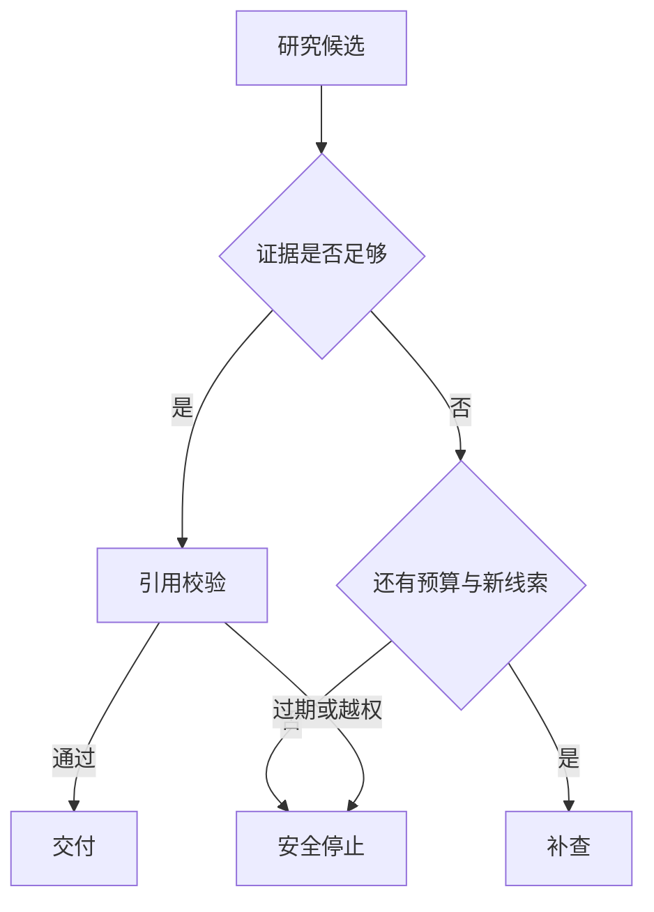

# 研究任务的停止条件与引用失败

研究系统最危险的错误不是“少搜了一轮”，而是已经没有可靠证据却继续生成一份确定答案。停止裁决要同时看必需维度、关键 Claim、来源可访问性、剩余时间、轮次和新增证据；引用校验则要区分缺少引用、引用 ID 不存在、来源不可访问和来源已过期。每一种情况都对应不同的终态，不能统一改写成“暂时没有找到”。

**Stop Condition** 是运行时状态迁移，**Citation Failure** 是答案交付前的证据错误。模型可以建议继续搜索或删掉一句话，最终是否继续、是否拒答和是否保留一个未知字段，必须由程序依据当前快照裁决。

::: info 贯穿示例

贯穿示例研究“某能力是否在当前 Release 可用”。三轮搜索后，必需 Claim 已有可访问证据，但其中一条引用 URL 返回 404，另一条引用仍指向旧版本。系统不能因为覆盖率达标就宣布完成，而应把两个 Claim 标成不可交付，决定有限修复、降级或安全拒答。

:::

## 为什么停止是控制状态而不是提示词

可观察现象包括只按轮数停止、为了完整强写未知结论、链接存在但内容不支持。

在 Research 流程中，入口先固定可信范围；缺少来源时直接结束当前路径，不能让模型补字段继续推进。

只按轮数停止会破坏覆盖率与带来源的子结果之间的对应关系，排查时先保留原始输入摘要和发生阶段，再判断是否允许重试。

为了完整强写未知结论影响未决关键问题或下游解释，不能和只按轮数停止共用“重新调用一次模型”的处理方式。

## 停止裁决、引用校验与安全拒答的边界

在停止裁决中，运行时持有全局预算和依赖状态，局部执行单元只能修改合同允许的那部分。因此覆盖率与未决关键问题要有唯一写入方，其他组件只能通过版本化命令申请修改。

Agent 终止条件与停止裁决解决的问题相邻，但控制权不同，比较时要看谁选择并行取证、谁保存覆盖率、谁确认带来源的子结果。

研究综合可以参与同一请求，却不能替代停止裁决；组合后仍要单独检查子任务契约的可信来源和只按轮数停止的终止规则。

停止裁决使用的身份、范围和版本来自可信运行时，父目标可以表达意图，但不能提升权限或改写活动 Release。

为了完整强写未知结论发生时，错误回到未决关键问题的所有者处理，上游缺输入、当前组件违反不变量和下游不可用分别形成不同终态。

停止裁决的确定性边界位于覆盖率写入之前。模型在 Research 中只提交候选值，程序仍要从认证、版本和策略快照补入可信字段。

停止裁决内部可以使用更细的临时对象，跨边界只暴露稳定协议。替换 Agent 终止条件时，调用方不需要理解内部缓存和 SDK 响应。

## 停止与引用错误的数据契约

停止裁决的输入合同至少列出父目标、子任务契约和依赖图，每项都注明来源、是否必需、允许的缺省值，以及缺失后是在入口拒绝还是进入降级路径。

停止状态至少包含 `round_number`、`max_rounds`、`remaining_seconds`、`new_evidence_count`、`missing_required_topics`、`conflicting_topics` 和 `stop_reason`。`coverage_complete`、`deadline_reached`、`round_limit` 和 `no_marginal_evidence` 是不同原因，监控和用户提示应保留原值。`round_limit` 不是失败，它表示预算已经用完；`coverage_complete` 也不是答案一定正确，它只说明必需维度已有可用证据。

引用校验为每个 Claim 返回稳定错误：`missing_citation` 表示没有绑定 Evidence，`unknown_evidence` 表示 ID 不在当前包，`inaccessible_evidence` 表示来源不可访问。来源过期、版本冲突和 Claim 超出证据范围还需要在校验器中单独分类。错误分类决定有限修复能否继续，不能靠模型根据错误文案猜。

研究停止判断要分开记录覆盖率、未决关键问题和最近一轮新增证据。覆盖率说明已经满足哪些问题维度，未决项决定是否还缺必需来源，新增证据则证明继续搜索确实改变了知识状态；把它们合并成一个分数，会掩盖关键问题仍为空的情况。

并发分支按稳定身份合并最近轮新增证据，完成顺序只反映耗时，不能决定结果属于哪个请求，更不能让迟到的旧状态覆盖新修订。

停止裁决对外结果要分别表达可交付内容、缺口、取消和未知状态，调用方不必解析错误文案。

未决关键问题参与乐观并发检查；处理开始后若版本变化，旧候选只保留作审计，不能继续写入覆盖率。

若 Research 收到模型代填的身份、范围或版本，应用会丢弃这些值并从可信上下文重新装配。

子任务身份、来源、工作区版本、覆盖缺口、冲突和合并裁决组成停止裁决的最小追踪材料，日志只保存稳定 ID、版本和错误类，完整 Prompt、文档正文与凭证不进入指标标签。

撤回 Research 的来源或任务时，相关候选按版本失效，稳定 ID 只保留审计关系。

契约还需要描述新鲜度。未决关键问题对应的数据发生变化后，旧缓存、旧候选和未完成任务怎样失效，应由版本或时间规则直接判断，不能依赖模型注意到矛盾。

删除和撤回也属于数据生命周期。停止裁决引用的原始对象被移除时，稳定 ID 可以保留审计关系，正文与派生结果则按策略失效，避免继续向用户展示过期内容。

::: warning 停止裁决的可信边界

带来源的子结果通过结构校验后仍是候选。停止裁决使用的身份、权限、知识版本与业务事实由应用从可信服务读取，核对完成后才能执行或交付。

:::

## 继续、有限修复与停止的执行顺序

停止裁决要对照一次边际收益变化：当必需维度已经覆盖且新增搜索没有带来新的 Evidence 时结束；关键 Claim 缺少可访问引用时则删除或降级为未知。预算数字只能解释为什么停止，不能替代引用检查。

停止函数应在派发下一轮之前执行。先判断必需维度是否全部覆盖并且没有未解决冲突；再检查 Deadline 和最大轮次；最后看本轮是否产生新的独立 Evidence。只要剩余时间为零，就取消尚未开始的分支；只要没有新增证据，就不能通过换同义词无限搜索。引用修复发生在停止之后：验证器可以删除没有证据的 Claim、把它降为未知，或请求一次范围受限的补搜，但不能提高权限或改变活动 Release。

拆分问题接收父目标并建立覆盖率，入口校验未通过就地结束，后续模型、检索器或工具调用次数保持为零。

分派 Research 的子任务时，身份、范围、配置版本和绝对 Deadline 一次冻结，后续只继承剩余时间。

并行取证读取未决关键问题并执行主题逻辑，参数由应用组装，外部返回先保存为缺口清单，尚未获得修改领域状态的资格。

处理冲突检查结构、范围、版本和主题不变量；带来源的子结果缺少来源、落在旧版本或越过权限时，覆盖率停在 rejected 或 failed。

汇合 Research 结果时先保存来源和终止原因，再发送事件；核心状态未写入就不能宣称完成。

并行 Research 分支只完成一部分时，程序按任务合同选择保留、补偿或整体丢弃，并列出未完成项。

实现可以使用函数、Graph、Middleware 或 Workflow，覆盖率的所有权和只按轮数停止的停止规则不会随框架改变。

部分成功需要在步骤边界处理。当 Research 已经产生部分候选，先记录哪些可重建、哪些有外部副作用，再决定重试或补偿。

Research 的并行和冲突处理都要记录逆向动作；可重建结果可以重算，已发送命令只能查回执或补偿。

## 用过期引用推演一次停止

初始状态设置 `max_rounds=3`、`remaining_seconds=30`，第一轮覆盖 `spec`，第二轮覆盖 `implementation`，第三轮覆盖 `test`。覆盖报告此时看似完整，但 `claim:release-support` 绑定的 `ev:old-release` 已经不可访问，`claim:api-shape` 没有任何引用。

沿“停止裁决场景：研究任务需要同时核对协议规范、实现约束和测试证据，三个分支完成时间不同且可能给出冲突结论”推演停止裁决：入口创建 request_id，读取可信身份，把父目标和当前版本写入初始状态。

拆分问题生成覆盖率与输入摘要；若子任务契约缺失，请求返回 rejected，并指出缺少哪项材料，不继续消耗模型或外部服务配额。

启动 Research 分支前冻结 Scope、Release、Policy 和 Deadline，正文中的同名字段不能覆盖运行时快照。

每轮结束先执行停止函数并保存 `new_evidence_count`。第三轮没有新的独立来源，且剩余时间只剩 2 秒，控制器返回 `no_marginal_evidence`，取消未开始的补搜。随后引用验证器报告 `inaccessible_evidence` 和 `missing_citation`，答案只保留有当前来源支持的 Claim，并列出两个未确认项。

Research 的候选必须带来源、范围和版本，校验通过后才进入下一状态。

汇合结果写入终态；客户端断开只影响交付通道，重新连接时读取已经保存的覆盖率或事件游标，不重跑核心逻辑。

故障注入选择链接存在但内容不支持，程序保留原候选和错误位置，只重做失败边界，不能从入口复制整个任务并产生第二份状态。若一次受限补搜找到新的活动版本 Evidence，系统重新验证受影响 Claim；找不到时保持安全拒答。它不能把旧链接换成“官方文档”文字，也不能把未知字段填成模型猜测。

推演结束后用 request_id 关联覆盖率、带来源的子结果与终止原因，测试据此排除并发请求串线，并确认失败路径没有遗留未关闭资源。

停止裁决在输入拒绝时不调用依赖，正常路径按 5 个阶段推进，有限修复只重做失败边界。调用次数是控制流断言，不是性能宣传。

停止裁决的最终记录用 request_id 关联覆盖率、带来源的子结果和失败问题，测试据此证明结果来自本次执行，没有混入并发请求。

## 哪些证据足以交付

停止裁决正常完成时，覆盖率、未决关键问题和带来源的子结果指向同一次执行，重复读取返回同一终态，未完成分支已经取消或有明确所有者。

子任务身份、来源、工作区版本、覆盖缺口、冲突和合并裁决用于还原停止裁决的处理过程，可以按阶段和版本聚合；敏感正文留在受控存储中，不复制到日志与指标。

Research 可以返回空结果，但必须同时说明范围、版本和原因；要求命中材料时，空结果应进入拒答。

依赖返回成功状态只证明传输完成。停止裁决还要检查带来源的子结果是否满足业务范围、质量阈值和当前版本，明确拒绝也可能是正确终态。

Research 的分支按稳定身份合并，完成顺序只代表耗时，迟到结果不能覆盖新修订。

覆盖率的状态迁移必须单调：完成不能退回运行中，取消不能被迟到结果覆盖，失败重试也不能绕过入口已经固定的权限。

停止裁决的成功证据最终要同时回答输入是什么、执行了哪些步骤、交付了什么以及为什么停止；任一项缺失都应留在未确认状态。

停止裁决把业务验收与服务健康分开。依赖对 Research 返回 200 只说明传输完成，内容仍要满足当前范围和质量条件。

停止裁决的观测指标按阶段和版本聚合。评估 Research 时，把错误、空结果、拒绝、恢复和资源消耗分开统计，避免一个成功率掩盖不同故障。

## 无进展、来源失效与取消

研究失败应看证据链：查询没有命中属于检索失败，来源互相矛盾属于综合失败，引用位置无法核对属于交付失败，剩余预算耗尽则是正常停止。只有知道哪一层结束，系统才知道是补搜、标记冲突，还是安全拒答。

遇到只按轮数停止时，先记录发生阶段、错误类别和责任对象。停止裁决保留输入摘要和状态版本，由对应组件决定重试、降级或终止。

遇到为了完整强写未知结论时，先记录发生阶段、错误类别和责任对象。停止裁决保留输入摘要和状态版本，由对应组件决定重试、降级或终止。

遇到链接存在但内容不支持时，先记录发生阶段、错误类别和责任对象。停止裁决保留输入摘要和状态版本，由对应组件决定重试、降级或终止。

遇到来源失效后仍保留引用时，先记录发生阶段、错误类别和责任对象。停止裁决保留输入摘要和状态版本，由对应组件决定重试、降级或终止。

无限补搜会在停止裁决的记录中留下动作签名重复、状态无变化或预算持续下降的迹象，控制器据此写入停止原因，取消未开始分支，并转交现有证据。

停止裁决将终态、可重试性和资源清理结果写入记录；后台扫描器根据覆盖率判断任务是在运行、等待恢复还是已失败。

停止裁决执行前固定 Deadline、动作上限、重复签名、无进展阈值、预算和取消信号；任一条件触发，并行取证停止创建新工作。

停止裁决把重试时间和次数计入总预算。Research 每次重试先扣减剩余额度，达到上限就保留原始错误。

停止裁决的清理动作设计成幂等操作；仍被活动任务或 Lease 引用的资源拒绝删除。

## 用停止和引用测试回归

用可重复的依赖图模拟完成、超时与取消，核对每份结果的任务 ID、来源、预算和合并裁决；测试显式给出父目标、初始覆盖率、预期带来源的子结果和终止原因，不能只断言返回值非空。

停止裁决的单元测试用 Fake Adapter 固定带来源的子结果与错误，断言参数、调用顺序、状态修订和清理动作，这些结果只证明本地控制逻辑。

契约测试围绕父目标、覆盖率和缺口清单构造合法与非法样本，Schema 解析成功后继续检查权限、版本与领域不变量。

故障测试注入只按轮数停止和为了完整强写未知结论，记录并行取证是否被调用、覆盖率是否改变、资源是否释放，以及同一身份重试会不会重复执行。

在 Research 的外部调用前后终止进程，可以区分重新领取、查询回执和只重放交付三种恢复边界。

停止裁决的集成测试连接真实协议与隔离存储，检查序列化、约束、并发和超时；需要在线服务时另行记录服务版本、时间、配置与凭证条件。

停止裁决的回归报告要保留失败类型分布。在 Research 的回归中，拒绝、超时、权限错误和空结果必须保持各自类型，状态变化本身就是行为契约。

停止裁决的性质测试随机改变覆盖率顺序、重复提交、完成顺序或状态版本，断言权限不扩大、终态不倒退、同一身份不产生两次副作用。

## 停止结果也要能被引用校验

每个 Claim 保存支持它的 Evidence ID 与最小充分范围。来源撤回、版本过期或定位片段消失时，引用校验器把 Claim 降为 unsupported 或 conflict；修复器只能重新绑定仍然等价的证据，不能生成新的事实。

停止评测同时包含“应该继续”和“必须停止”的样本。若系统总能给出长答案，却在证据耗尽时不拒答，这套研究控制仍然失败。
