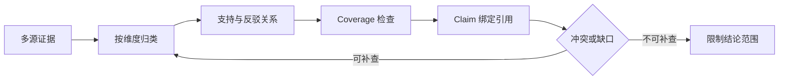

# 研究综合怎样判断覆盖度与冲突

研究综合不是把几篇文章拼成一段摘要。它先回答“问题有哪些必须覆盖的维度”，再判断每条证据支持、反驳还是只提供背景，最后才决定哪些 Claim 可以写成结论。覆盖不足和来源冲突是两种不同状态：前者表示还缺材料，后者表示已有材料互相不一致，处理动作不能混在一个“再搜一次”按钮里。

**Coverage** 面向问题维度，**Synthesis** 面向 Claim 与 Evidence 的关系。来源 ID、发布时间、版本、可访问性和血缘由程序保存，模型只提出归纳候选。一个网页摘要即使表达得很肯定，也不能越过 Scope、时间和版本检查成为事实。

::: info 贯穿示例

研究任务是判断一个能力是否“已实现并可交付”。问题维度拆成规范要求、实现证据、回归测试和已知限制；一篇博客同时提到四项，只能作为一个来源，不会自动覆盖四个维度。综合器要保留每条 Evidence 的来源血缘，避免把转载数量误当独立支持。

:::

## 为什么摘要不能代替研究综合

在 Research 流程中，入口先固定可信范围；缺少来源时直接结束当前路径，不能让模型补字段继续推进。

按文章顺序摘要会破坏维度与带来源的子结果之间的对应关系，排查时先保留原始输入摘要和发生阶段，再判断是否允许重试。

把多个转载当独立证据影响 Claim 或下游解释，不能和按文章顺序摘要共用“重新调用一次模型”的处理方式。
## Coverage、Synthesis 与文献综述的边界

在研究综合中，运行时持有全局预算和依赖状态，局部执行单元只能修改合同允许的那部分。因此维度与 Claim 要有唯一写入方，其他组件只能通过版本化命令申请修改。

摘要与研究综合判断覆盖度与冲突解决的问题相邻，但控制权不同，比较时要看谁选择并行取证、谁保存维度、谁确认带来源的子结果。

文献综述可以参与同一请求，却不能替代研究综合判断覆盖度与冲突；组合后仍要单独检查子任务契约的可信来源和按文章顺序摘要的终止规则。

研究综合判断覆盖度与冲突使用的身份、范围和版本来自可信运行时，父目标可以表达意图，但不能提升权限或改写活动 Release。

把多个转载当独立证据发生时，错误回到 Claim 的所有者处理，上游缺输入、当前组件违反不变量和下游不可用分别形成不同终态。

研究综合判断覆盖度与冲突的确定性边界位于维度写入之前。模型在 Research 中只提交候选值，程序仍要从认证、版本和策略快照补入可信字段。

研究综合判断覆盖度与冲突内部可以使用更细的临时对象，跨边界只暴露稳定协议。替换摘要时，调用方不需要理解内部缓存和 SDK 响应。
## 维度、Evidence 与 Claim 的数据契约

研究综合判断覆盖度与冲突的输入合同至少列出父目标、子任务契约和依赖图，每项都注明来源、是否必需、允许的缺省值，以及缺失后是在入口拒绝还是进入降级路径。

维度表不是关键词清单，而是验收合同。每个维度有稳定 ID、问题说明、是否必需、允许的证据类型和完成条件；例如 `implementation` 需要能定位到代码或配置，`test` 需要能定位到断言或执行记录。一个 Evidence 可以覆盖多个维度，但覆盖关系要逐项登记，不能靠综合模型自己猜。

Evidence 至少有 `evidence_id`、`source_id`、`topic_ids`、`claim`、`stance` 和 `accessible`。`stance` 只取 `supports`、`contradicts` 或 `context`。`context` 能帮助解释背景，却不能单独让必需维度变成完成。多个 Evidence 来自同一原文或同一转载链时，独立来源计数只算一次，冲突判断仍保留各条材料。

综合器先计算两个结果：覆盖报告列出已覆盖主题、必需缺口、冲突主题和独立来源数；引用报告列出每个 Claim 是否绑定可访问 Evidence。覆盖完整不代表没有冲突，引用齐全也不代表 Claim 的范围正确。只有二者都通过，才允许进入答案验证。

研究综合要分别记录问题维度、Claim、Evidence 和来源版本。维度说明需要覆盖什么，Claim 是待验证的结论，Evidence 只证明它来自哪里；把它们合并成摘要，冲突和缺口就会被流畅文字掩盖。

研究综合对外结果要分别表达可交付内容、缺口、取消和未知状态，调用方不必解析错误文案。

Claim 参与乐观并发检查；处理开始后若版本变化，旧候选只保留作审计，不能继续写入维度。

若 Research 收到模型代填的身份、范围或版本，应用会丢弃这些值并从可信上下文重新装配。

子任务身份、来源、工作区版本、覆盖缺口、冲突和合并裁决组成研究综合判断覆盖度与冲突的最小追踪材料，日志只保存稳定 ID、版本和错误类，完整 Prompt、文档正文与凭证不进入指标标签。

撤回 Research 的来源或任务时，相关候选按版本失效，稳定 ID 只保留审计关系。

契约还需要描述新鲜度。Claim 对应的数据发生变化后，旧缓存、旧候选和未完成任务怎样失效，应由版本或时间规则直接判断，不能依赖模型注意到矛盾。

删除和撤回也属于数据生命周期。研究综合判断覆盖度与冲突引用的原始对象被移除时，稳定 ID 可以保留审计关系，正文与派生结果则按策略失效，避免继续向用户展示过期内容。

::: warning 研究综合判断覆盖度与冲突的可信边界

带来源的子结果通过结构校验后仍是候选。研究综合判断覆盖度与冲突使用的身份、权限、知识版本与业务事实由应用从可信服务读取，核对完成后才能执行或交付。

:::
## 计算覆盖和保留冲突的执行顺序

研究综合要用一组带冲突的 Evidence 推演：先建立问题维度，再把每条来源标为支持、反对或未知，最后只生成有绑定证据的 Claim。删除一条来源后，覆盖缺口和最终结论都应发生可解释变化。

实现时先按来源血缘去重，再按主题 ID 建立倒排关系。每个主题收集 `supports` 与 `contradicts` 集合；支持集合为空表示缺口，两个集合同时非空表示冲突。冲突不会被平均分数抹平，而是进入待裁决列表，综合器只能写“材料不一致，当前无法确认”或指定范围内的条件结论。

当一个 Evidence 同时覆盖 `spec` 和 `implementation` 时，两个主题都得到覆盖标记，但它们的 Claim 仍分别绑定同一 `evidence_id`。如果实现版本晚于规范版本，时间过滤会让旧实现证据失效，覆盖报告要重新计算，而不是沿用上一轮的布尔值。这个顺序保证版本更新后不会留下“覆盖已完成”的陈旧状态。

拆分问题接收父目标并建立维度，入口校验未通过就地结束，后续模型、检索器或工具调用次数保持为零。

分派 Research 的子任务时，身份、范围、配置版本和绝对 Deadline 一次冻结，后续只继承剩余时间。

并行取证读取 Claim 并执行主题逻辑，参数由应用组装，外部返回先保存为缺口清单，尚未获得修改领域状态的资格。

处理冲突检查结构、范围、版本和主题不变量；带来源的子结果缺少来源、落在旧版本或越过权限时，维度停在 rejected 或 failed。

汇合 Research 结果时先保存来源和终止原因，再发送事件；核心状态未写入就不能宣称完成。

并行 Research 分支只完成一部分时，程序按任务合同选择保留、补偿或整体丢弃，并列出未完成项。

实现可以使用函数、Graph、Middleware 或 Workflow，维度的所有权和按文章顺序摘要的停止规则不会随框架改变。

部分成功需要在步骤边界处理。当 Research 已经产生部分候选，先记录哪些可重建、哪些有外部副作用，再决定重试或补偿。

Research 的并行和冲突处理都要记录逆向动作；可重建结果可以重算，已发送命令只能查回执或补偿。
## 用支持与反驳证据推演一次综合

先设四个必需维度：`spec`、`implementation`、`test` 和 `limits`。第一轮收到三条材料：规范文件支持 `spec`，源码支持 `implementation`，测试报告支持 `test`；`limits` 没有证据。第二个来源声称“当前版本已删除该能力”，与源码形成冲突，但它的发布版本早于活动 Release。

沿“研究综合判断覆盖度与冲突场景：研究任务需要同时核对协议规范、实现约束和测试证据，三个分支完成时间不同且可能给出冲突结论”推演研究综合判断覆盖度与冲突：入口创建 request_id，读取可信身份，把父目标和当前版本写入初始状态。

拆分问题生成维度与输入摘要；若子任务契约缺失，请求返回 rejected，并指出缺少哪项材料，不继续消耗模型或外部服务配额。

启动 Research 分支前冻结 Scope、Release、Policy 和 Deadline，正文中的同名字段不能覆盖运行时快照。

并行取证按主题分支保存 `call_id`、参数摘要、开始时间、Scope 和状态版本。来源归一化后，旧版本材料仍保留作审计，却从活动 Release 的交付集合移除；`limits` 缺口触发补搜，不能被模型用“通常情况下”补齐。

Research 的候选必须带来源、范围和版本，校验通过后才进入下一状态。

汇合结果写入终态；客户端断开只影响交付通道，重新连接时读取已经保存的维度或事件游标，不重跑核心逻辑。

故障注入选择忽略反例，程序保留原候选和错误位置，只重做失败边界，不能从入口复制整个任务并产生第二份状态。若补搜返回一条反驳 Evidence，报告同时标记 `limits` 已覆盖和 `implementation` 存在冲突；最终答案可以说明条件和版本，不能输出无条件“已支持”。

推演结束后用 request_id 关联维度、带来源的子结果与终止原因，测试据此排除并发请求串线，并确认失败路径没有遗留未关闭资源。

研究综合判断覆盖度与冲突在输入拒绝时不调用依赖，正常路径按 5 个阶段推进，有限修复只重做失败边界。调用次数是控制流断言，不是性能宣传。

研究综合判断覆盖度与冲突的最终记录用 request_id 关联维度、带来源的子结果和失败问题，测试据此证明结果来自本次执行，没有混入并发请求。
## 结论怎样限制在证据范围内

研究综合判断覆盖度与冲突正常完成时，维度、Claim 和带来源的子结果指向同一次执行，重复读取返回同一终态，未完成分支已经取消或有明确所有者。

子任务身份、来源、工作区版本、覆盖缺口、冲突和合并裁决用于还原研究综合判断覆盖度与冲突的处理过程，可以按阶段和版本聚合；敏感正文留在受控存储中，不复制到日志与指标。

Research 可以返回空结果，但必须同时说明范围、版本和原因；要求命中材料时，空结果应进入拒答。

依赖返回成功状态只证明传输完成。研究综合判断覆盖度与冲突还要检查带来源的子结果是否满足业务范围、质量阈值和当前版本，明确拒绝也可能是正确终态。

Research 的分支按稳定身份合并，完成顺序只代表耗时，迟到结果不能覆盖新修订。

维度的状态迁移必须单调：完成不能退回运行中，取消不能被迟到结果覆盖，失败重试也不能绕过入口已经固定的权限。

研究综合判断覆盖度与冲突的成功证据最终要同时回答输入是什么、执行了哪些步骤、交付了什么以及为什么停止；任一项缺失都应留在未确认状态。

研究综合判断覆盖度与冲突把业务验收与服务健康分开。依赖对 Research 返回 200 只说明传输完成，内容仍要满足当前范围和质量条件。

研究综合判断覆盖度与冲突的观测指标按阶段和版本聚合。评估 Research 时，把错误、空结果、拒绝、恢复和资源消耗分开统计，避免一个成功率掩盖不同故障。
## 转载、版本漂移和缺口处理

综合阶段的异常要区分覆盖不足、来源冲突、引用失配和输出超预算。覆盖不足需要补搜，冲突需要并列呈现，引用失配要回到证据绑定，超预算可以减少候选但不能删除关键事实；这些处理不能由同一个重试分支代替。

遇到按文章顺序摘要时，先记录发生阶段、错误类别和责任对象。研究综合判断覆盖度与冲突保留输入摘要和状态版本，由对应组件决定重试、降级或终止。

遇到把多个转载当独立证据时，先记录发生阶段、错误类别和责任对象。研究综合判断覆盖度与冲突保留输入摘要和状态版本，由对应组件决定重试、降级或终止。

遇到忽略反例时，先记录发生阶段、错误类别和责任对象。研究综合判断覆盖度与冲突保留输入摘要和状态版本，由对应组件决定重试、降级或终止。

研究综合判断覆盖度与冲突发现混合不同版本后重新读取权威状态，旧候选可以保留作审计，却不能覆盖新版本；前后状态无法兼容时，当前尝试以 conflict 结束。

结论超过证据范围触及研究综合判断覆盖度与冲突的安全边界，重试不会使它自动合法；执行路径保存拒绝规则和输入来源，清除未授权候选，并以稳定错误结束当前动作。

研究综合判断覆盖度与冲突将终态、可重试性和资源清理结果写入记录；后台扫描器根据维度判断任务是在运行、等待恢复还是已失败。

研究综合判断覆盖度与冲突执行前固定 Deadline、动作上限、重复签名、无进展阈值、预算和取消信号；任一条件触发，并行取证停止创建新工作。

研究综合判断覆盖度与冲突把重试时间和次数计入总预算。Research 每次重试先扣减剩余额度，达到上限就保留原始错误。

研究综合判断覆盖度与冲突的清理动作设计成幂等操作；仍被活动任务或 Lease 引用的资源拒绝删除。
## 用覆盖与引用测试回归

用可重复的依赖图模拟完成、超时与取消，核对每份结果的任务 ID、来源、预算和合并裁决；测试显式给出父目标、初始维度、预期带来源的子结果和终止原因，不能只断言返回值非空。

研究综合判断覆盖度与冲突的单元测试用 Fake Adapter 固定带来源的子结果与错误，断言参数、调用顺序、状态修订和清理动作，这些结果只证明本地控制逻辑。

契约测试围绕父目标、维度和缺口清单构造合法与非法样本，Schema 解析成功后继续检查权限、版本与领域不变量。

故障测试注入按文章顺序摘要和把多个转载当独立证据，记录并行取证是否被调用、维度是否改变、资源是否释放，以及同一身份重试会不会重复执行。

在 Research 的外部调用前后终止进程，可以区分重新领取、查询回执和只重放交付三种恢复边界。

研究综合判断覆盖度与冲突的集成测试连接真实协议与隔离存储，检查序列化、约束、并发和超时；需要在线服务时另行记录服务版本、时间、配置与凭证条件。

研究综合判断覆盖度与冲突的回归报告要保留失败类型分布。在 Research 的回归中，拒绝、超时、权限错误和空结果必须保持各自类型，状态变化本身就是行为契约。

研究综合判断覆盖度与冲突的性质测试随机改变维度顺序、重复提交、完成顺序或状态版本，断言权限不扩大、终态不倒退、同一身份不产生两次副作用。
## 综合保留冲突而不是平均观点

Coverage 表记录每个必需维度由哪些独立 Evidence 覆盖，Claim 表记录支持、反驳和适用版本。两个来源冲突时保留双方，降低结论强度或提出定向补搜；综合模型不能把它们揉成一条没有来源的折中句。

评测除覆盖率外，还检查转载去重、引用绑定和 unsupported Claim 数量。维度全部打勾但证据来自同一转载链，不算完成。
