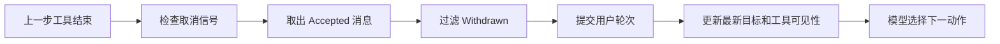

# 运行中的追加、撤回与中断

一个研究型 Agent 已经运行数分钟，正在根据检索结果组织答案。用户此时补充一句：“还要检查管理员权限是否会覆盖普通成员规则。”系统若立即创建第二个 Turn，两个执行可能并发修改同一工作区；若把消息简单塞进队列，当前 Run 又可能在取出它之前完成。接口虽然返回“已接收”，这条补充却没有任何执行者。

这类问题属于 **运行中控制**。控制对象是一个仍在活动的 Run，操作包括追加新输入、撤回尚未生效的输入，以及中断当前执行。它与上一章的崩溃恢复不同：恢复处理已经失去 Worker 的 Turn，运行中控制处理仍有所有者、仍在推进的 Turn。

::: info 三种操作先分开

- **追加**：保留当前 Run，在下一次决策前加入新信息。
- **撤回**：让一条尚未提交的排队消息失效，不改写已经发生的历史。
- **中断**：通过控制信号停止 Run，不等待模型理解一段“请停止”的文字。

:::

三种操作可以共享控制 API 的认证、事件和审计基础设施，但必须有不同的状态转换。把它们统一成一个自由文本 `instruction`，Runtime 就无法判断该改上下文、删除待处理消息，还是立即停止工具执行。

## 运行中的追问跨越并发边界

普通聊天按照“用户消息、助手回答”交替出现。Agent Run 内部却可能经历规划、多个工具、检索、验证和流式交付。追问到达时，系统首先要决定它归谁：加入当前 Run，排队等待当前 Run 完成，还是启动新 Run。

所有权不能由客户端自己猜。客户端只知道请求已发出，看不到 Worker 正处于工具调用、模型决策还是终态提交。Runtime 维护活动路由，把 Conversation、Workspace 或资源 Scope 映射到当前 Run，并在一个受锁保护的边界内决定消息归属。

如果允许追问进入当前 Run，需要同时保护三个契约：

| 契约 | 要回答的问题 | 破坏后的表现 |
| --- | --- | --- |
| 执行所有权 | 哪个 Run 负责这条消息 | 消息丢失或两个 Run 同时执行 |
| 对话提交 | 模型从哪一步开始看到消息 | 工具仍按旧目标执行 |
| 回复寻址 | 产生的答案回复哪条入站消息 | 答案显示在错误位置或无法确认交付 |

只保存 Conversation ID 不够。一条物理 Run 可以吸收多个逻辑用户轮次，也可能在吸收新追问前已经产生一段中间答案。每条入站消息都要有稳定 Message ID，运行时记录它从接收到交付的状态。
## Accepted、Committed 与 Completed 是不同事实

“收到消息”经常被用来同时表示 API 校验通过、消息进入队列、模型看到消息和用户收到回答。这些时刻之间都可能崩溃，必须拆成明确状态。

**Accepted** 表示路由器确认当前 Run 仍接受注入，并把消息交给它的持久邮箱或缓冲区。所有权已经确定，但对话转录尚未改变，模型也没有看到内容。

**Committed** 表示 Run 在安全决策边界取出消息，把它构造成新的用户轮次，并更新所有依赖“最新用户目标”的子系统。此时消息已经成为执行上下文的一部分，撤回不能再把历史抹掉。

**Completed** 表示该消息对应的逻辑工作已经形成回复。它说明计算结束，不说明传输成功。若回复写入数据库但浏览器断线，消息仍不能从可重放输入中删除。

**Acknowledged** 表示回复已经通过目标渠道成功交付，传输层才可以确认并清理重放记录。使用至少一次传输时，确认之前的输入可能重复到达；Runtime 用 Message ID 返回原状态或原回复，不能重新执行。

```text
received by API
  -> Accepted: current Run owns the message
  -> Committed: message entered the execution context
  -> Completed: reply was produced for this message
  -> Acknowledged: reply was delivered successfully
```

每个状态有一个写入所有者。Router 写 Accepted，Run 在决策边界写 Committed，执行器写 Completed，渠道适配器在发送成功后写 Acknowledged。状态向前单调推进，重复命令返回当前结果，不能把交付失败改写成未接收。
## 追加消息在决策边界提交

追问不能在任意时刻直接改 Prompt。假设模型已经选择 `delete_file`，工具正准备执行，此时把“不要删除，只分析”追加到消息列表，已选动作不会自动消失。等工具完成后再让模型看到纠正，已经太晚。

安全的提交点位于每次决策之前：前一个动作的结果已经确定，下一个动作还没有选择。Run 先检查取消信号，再原子取出 Accepted 消息，过滤已经撤回的消息，把剩余内容提交为一个或多个用户轮次，然后重新装配上下文并调用模型。



提交不只修改 `messages`。依赖最新目标的查询改写、Skill 发现、延迟工具加载、计划修订和预算判断也要读取新文本。若对话转录已经变化，旁路组件仍使用原始问题，系统会一半按新目标回答，一半按旧目标选工具。

多条追问能否合并是产品策略。合并可以减少模型调用，但要明确顺序、冲突规则和回复地址。涉及不同 Workspace、权限 Scope 或业务目标的消息不应混入同一个 Run，应关闭注入并创建新 Turn。模型不能自行决定跨 Scope，因为这会绕过入口处固定的版本和权限快照。
## 最终排空关闭完成时的消息竞态

最棘手的时刻是 Run 已经生成答案，正准备完成。实现若先看一眼 `queue.empty()`，再撤销活动路由，中间有一个窗口：新消息在检查之后到达，路由器看到 Run 仍活动，返回 Accepted；随后 Run 关闭，没有人再取这条消息。

修复方式不是多检查几次，而是让“最终排空”和“关闭注入窗口”使用与路由接收相同的锁。持锁期间，Run 取出全部已接收消息。若有有效消息，就提交并继续下一轮；若没有，就把路由标为关闭并完成。并发发送方只有两个合法结果：

1. 先取得锁，消息进入邮箱，由当前 Run 在最终排空时提交。
2. 后取得锁，看到注入窗口已关闭，把消息交给新 Run。

它不能得到 Accepted 后落入无人负责的缝隙。撤回墓碑也在同一临界区读取，避免已经撤回的迟到消息让完成中的 Run 再次打开。

路由关闭与 Run Completed 可以是两个步骤，但所有权规则要单调。关闭后到达的消息绝不能重新塞回旧 Run；Completed 写入失败时，恢复器只完成旧 Run 的终态提交，不重新打开注入窗口。
## 撤回只作用于尚未提交的消息

用户在消息还处于 Accepted 时撤回，Router 写入带 Message ID 的 Withdrawn 状态或墓碑。Run 在决策边界和最终排空时过滤它。墓碑要比消息保留更久，至少覆盖网络重放窗口，否则延迟到达的旧副本会重新出现。

消息进入 Committed 后已经影响计划、工具选择或外部动作，撤回无法抹去这些事实。此时 UI 应返回“已经开始处理”，并提供中断或发送修正消息。系统可以在下一决策边界接受修正，不能伪装成原消息从未存在。

撤回操作本身具有幂等身份。对同一 Message ID 重复撤回返回相同结果；撤回不存在或已完成的消息给出稳定状态，不通过模糊文案让客户端猜。权限校验要求撤回者拥有消息或具备管理权限，不能只凭知道 Message ID 修改别人的 Run。

撤回与删除聊天记录也不同。删除属于数据生命周期，可能在任务完成后隐藏或清理内容；撤回属于执行控制，决定一条待处理输入是否进入当前上下文。审计记录可以保留哈希、状态与时间，不必保留已撤回敏感正文。
## 中断通过控制面传播

“停止运行”若作为用户文本塞进 Prompt，只有模型下一次调用时才可能看到。在此之前，正在执行的检索、浏览器操作或文件修改仍会继续；模型也可能把它当成讨论内容，而不是控制命令。

中断应写入独立控制面。Pending Turn 可以直接转 Cancelled，释放准入名额并写终态事件；Running Turn 转为 CancelRequested，同时把低延迟取消标记发布到 Worker 可见的通道。Worker 在模型调用前、工具调用前后、并行阶段汇合和流式输出循环中检查标记，触发结构化取消。

控制通道不可用时需要权威存储回退。例如快速检查先读缓存，缓存异常再查询数据库里的 `cancel_requested`。快速通道减少每个节点的数据库压力，数据库状态保证信号不会随缓存重启消失。两者冲突时以更严格的取消状态为准。

取消不是瞬间杀死任意代码。无法中断的外部请求可能迟到返回，Worker 应丢弃未获提交资格的结果，并停止创建新工作。已经发生的副作用保留 Receipt，按工具协议补偿或转人工。最终状态在 Completed 与 Cancelled 之间通过条件更新竞争，只有一个能成功。

::: warning 中断并发送是新的业务操作

“停止当前 Run，并按新目标执行”包含取消旧 Turn 和创建新 Turn 两步。新 Turn 使用新的幂等键、版本快照和权限检查，不能让替代文本直接继承旧 Run 的执行权。

:::
## 每个逻辑回答都需要回复地址

当前 Run 吸收追问后，`run_id` 仍然相同，回复目标却可能变化。只把答案发到 Conversation 末尾，会让客户端难以确认哪条问题已经处理；多个用户共享频道时，还可能回复错人。

Runtime 维护 `current_reply_to`，指向最近提交的有效 Message ID。若一轮中合并三条追问，可以选择把组合回答绑定到最后一条，同时把三条 ID 都加入待确认集合；也可以每条独立提交并分别回答。策略可以不同，协议必须可测试。

当旧目标的答案已经形成，而新追问在最终完成前提交，运行时先把旧答案以旧 Message ID 交付，再推进回复地址。若直接覆盖 `current_reply_to`，旧答案会显示在追问下面；若只保留最后答案，前一轮计算结果会消失。

Reply Address 还应包含 Channel、Thread 或 Client Message ID 的稳定映射。渠道适配器负责把内部地址转换为 WebSocket、SSE、Webhook 或聊天平台的回复参数。模型只能生成回复内容，不能选择用户身份和交付通道。
## 交付成功后才能确认输入

消息队列、Webhook 和断线重连常采用至少一次交付。未确认消息会再次发送，这是可靠性机制。Runtime 收到重复 Message ID 时，检查它是 Accepted、Committed、Completed 还是 Acknowledged，再返回现有所有者或原回复。

确认太早会丢消息。消息刚进入邮箱就 Acknowledge，Worker 随后崩溃，传输层认为任务已经处理，不再重放；Commit 后立即确认也有相同问题，因为用户还没收到答案。正确顺序是先发送回复，渠道确认成功，再写 Acknowledged 和确认所有被吸收的入站 ID。

发送成功、确认写入失败会产生重复发送窗口。渠道支持幂等 Message ID 时重复发送返回原结果；不支持时，适配器保存 Delivery ID 并查询状态。无法确认的交付停在 DeliveryUnknown，不能假设用户已经收到，也不能无限重复推送。

客户端断线与 Run 取消是两回事。断线只让交付暂时失败，Worker 可以继续生成并持久化事件；客户端重连后按 Event Sequence 重放。用户明确取消才改变执行状态。把 Socket Close 直接映射为取消，会让移动网络抖动终止长任务。
## 邮箱与对话转录需要一致的提交协议

追问通常先进入持久邮箱，再由 Worker 提交到对话转录。若先删除邮箱记录，后写转录，进程在两步之间退出会永久丢失消息；若先写转录，后删除邮箱，恢复时可能再次提交同一消息。两张表位于同一数据库时，可以在一个事务里把 Message 从 Accepted 改为 Committed、追加 Conversation Message、更新 Run Revision，并写入 `message.committed` Event。

存储不共享事务时，需要 Inbox 模式和幂等消费。邮箱保留 Message ID、Owner Run、Payload Hash 与 Status。Worker 用 `(run_id, message_id)` 作为转录消息唯一键，先尝试插入；若唯一键已经存在，就读取原记录并把邮箱对齐为 Committed。对账任务只修复状态差异，不重新解释正文，也不生成第二条用户轮次。

提交还要校验 Payload Hash。相同 Message ID 带着不同文本重放时返回 `message_identity_conflict`，不能用后来内容覆盖已经提交的上下文。渠道重试必须复用原 ID 与原 Payload；用户编辑则创建带 `replaces_message_id` 的新消息，保留前后关系。

消息合并时，每条原始 ID 都进入组合轮次的成员列表。组合文本可以只存一份，成员关系仍要保留，这样撤回检查、回复寻址和交付确认能落到原输入。恢复读取组合轮次时不再从邮箱重新拼接，避免排序规则或合并策略升级后改变历史上下文。

Event 与状态也需要明确顺序。事务提交后再向 Redis 或消息总线发布 Event Sequence；发布失败可以从 Outbox 补发。订阅者按 `(turn_id, sequence)` 去重。不能先发布 “Committed” 再回滚数据库，否则 UI 会显示模型已经接收，恢复器却找不到对应轮次。
## 追问改变计划但不能改写已经发生的事实

新的用户信息可能让旧计划失效。例如原计划准备比较所有成员规则，追问把范围缩小到管理员。Runtime 可以取消尚未开始的检索分支，重新生成后续计划；已经完成的检索和工具回执仍属于历史，不能从 Trace 中删除。它们是否继续进入 Evidence，由新 Scope 和当前验证器决定。

计划修订保存 `plan_revision` 和 `caused_by_message_ids`。新节点只消费当前 Revision，旧 Revision 的迟到结果写入审计后丢弃，不能混进新候选。若旧工具产生外部副作用，追问不能让它消失；系统展示已发生动作，必要时执行显式补偿。

追加内容也不能扩大可信权限。用户可以说“顺便查询管理员文档”，入口仍用 Turn 的 ACL Snapshot 与当前撤权状态计算 Scope。追问要求切换知识库、工作区或租户时，当前 Run 返回 Scope Change Required，并创建新 Turn。把新目标直接写进旧 Prompt 会让已经固定的 Release、Policy、审计对象和工具目录失去一致含义。

对长研究任务，可以把追问分成补充约束、请求澄清和新目标。补充约束允许在决策边界修订计划；请求澄清可以暂停当前阶段并等待用户；新目标创建独立 Turn。分类结果只是候选，最终由确定性 Scope、资源所有权和产品规则确认，不能让模型一句话把两个工作区合并。
## 高频追加需要背压和公平性

用户持续发送追问时，Run 可能永远到不了终态。邮箱应限制单 Run 未提交数量、总字符、最大等待时间和计划修订次数。达到上限后，Router 返回可识别的 Backpressure 状态，让客户端等待、合并草稿或创建新 Turn，不悄悄丢弃最早消息。

Commit 可以在一个决策边界批量取出有限数量，剩余消息继续排队。批次按照持久 Sequence 排序，不使用进程到达时间；撤回墓碑在排序后过滤。高优先级控制信号走独立通道，取消不会排在几十条追问后面。

运行资源还要考虑公平性。一个频繁注入的 Run 不能长期占有用户或租户的全部并发名额。Runtime 可以限制单次物理 Run 吸收的逻辑轮次数，到达上限后原子关闭路由，把后续消息放入新 Turn。新旧 Turn 通过 Conversation 关联，但各自拥有 Deadline、预算、版本快照和执行 Lease。

背压指标包括邮箱深度、Accepted 到 Committed 延迟、每个 Run 的注入轮数、被拒绝字符数和关闭后新建 Turn 数。正文不进入指标标签，Message ID 只进入受控日志。容量告警要区分模型变慢、Worker 不消费和用户突发输入，三者的处理动作不同。
## 用最小控制器观察状态变化

下面的示例用内存结构模拟活动路由、邮箱和交付器。它不包含真实模型或网络，目的是验证状态所有者和临界区。生产实现需要把消息、控制事件和确认写入持久存储，并使用数据库条件更新或分布式锁。

<<< ../../examples/ai-agent/runtime_control.py

`RuntimeController.accept()` 与 `final_drain()` 使用同一把路由锁。消息在关闭前进入就归当前 Run，关闭后进入则返回 `start_new_run`。`commit_at_decision_boundary()` 把 Accepted 消息写入转录，更新 `latest_user_text` 和回复地址。

`withdraw()` 只接受 Accepted 状态。`request_cancel()` 不修改 Prompt，执行器在每个安全点调用 `ensure_running()`。`deliver_reply()` 先调用渠道，成功后才把消息改为 Completed 和 Acknowledged；第一次发送失败时，消息仍可重试。

内存 Lock 只能证明单进程控制逻辑。多实例 Runtime 需要把路由所有权、Generation 和关闭操作放进支持原子比较的存储。锁超时、所有者失联和网络分区还要结合 Lease 与 Fencing Token，旧所有者不能在新 Generation 建立后继续提交。
## 沿一次追问和取消推演

Run `run:1` 正在回答 Message `message:1`。状态是 Running，注入窗口打开，Worker 刚完成第一次检索。

用户发送 `message:2`：“补充检查权限边界。”Router 持锁确认当前 Run 仍活动，写入 Accepted 并返回 Message Owner。此时模型尚未看到文本。Worker 到达决策边界，检查没有取消信号，取出 `message:2`，把它提交进对话，更新最新目标和 Reply Address，然后重新规划检索。

| 时刻 | Message 2 | Run | 回复地址 | 允许的下一步 |
| --- | --- | --- | --- | --- |
| T1 | Accepted | Running | Message 1 | 可撤回，模型不可见 |
| T2 | Committed | Running | Message 2 | 重新规划，不可撤回 |
| T3 | Completed | Finishing | Message 2 | 等待交付 |
| T4 | Acknowledged | Running 或 Completed | Message 2 | 清理重放记录 |

接着用户发送 `message:3`，但马上撤回。Router 先写 Accepted，再写 Withdrawn 墓碑。Worker 在下一边界过滤它，转录和最新目标不变化。若撤回请求迟于 Commit，接口返回已经提交，用户需要发送修正或中断。

Worker 准备最终完成时执行原子排空。若 `message:4` 在锁关闭前到达，它被提交，Run 继续；若在关闭后到达，Router 为它创建新 Turn。两种结果都有所有者，不会出现“API 说接受了，却没有答案”。

最后用户点击停止。API 对当前身份和 Turn Scope 做权限检查，把 Running 改为 CancelRequested，写 `turn.cancel_requested` Event，并发布快速取消标记。Worker 在调用下一个工具前看到标记，取消未开始分支，写 Cancelled。已经交付的 Message 2 保持 Acknowledged，不能因为整个 Run 后来取消而撤销历史交付。
## 竞态和失败要按发生位置处理

控制协议的错误不能统一成“稍后重试”。发生位置决定消息是否还能复用原身份。

**Accepted 写入成功、响应丢失**时，客户端用同一 Message ID 重试。Router 返回已有所有者，不再插入第二条。

**Commit 之后 Worker 崩溃**时，持久化 Checkpoint 包含已提交轮次。恢复从下一决策继续，不能把邮箱副本再次提交。邮箱删除与转录提交要共用事务或通过状态修订对账。

**完成与追问同时到达**时，由路由锁决定当前 Run 继续还是新建 Run。业务层不根据时间戳猜谁先发生。

**完成与取消竞争**时，条件更新只允许一个终态成功。完成方输掉竞态后不交付新答案，取消方输掉竞态后返回已经完成。

**撤回与 Commit 竞争**时，同一消息锁内的先后决定结果。Withdrawn 先写则过滤，Committed 先写则撤回失败。客户端看到稳定状态，不展示“撤回成功”后又让消息生效。

**交付成功但确认失败**时，保留 Delivery ID，重试先查询或使用幂等发送。输入不能被当成新业务意图重新运行。

**控制通道失效**时，快速取消读取失败要回退权威数据库。数据库也不可用时，Worker 停止启动新的高风险动作，记录控制面不可用，而不是假设没有取消。
## 测试覆盖所有权、顺序和交付

示例测试分别断言接收不等于提交、决策边界更新最新目标、撤回只影响未提交消息、最终排空只有两个合法结果、取消不进入 Prompt、交付成功后才确认，以及多个回答使用各自 Message ID。

运行命令如下：

```bash
PYTHONDONTWRITEBYTECODE=1 PYTHONPATH=examples/ai-agent \
  python3 -m unittest examples/ai-agent/tests/test_runtime_control.py
```

数据库集成测试要用并发任务制造竞态。发送方与 Final Drain 同时争锁，断言消息要么进入旧 Run，要么获得新 Turn，不能无所有者；撤回和 Commit 并发时只形成一种稳定状态；Completed 与 Cancelled 并发时只有一个终态事件。

渠道测试注入三种失败：接收响应丢失、回复发送失败、发送成功后确认写入失败。每次重连都使用相同 Message ID 和 Delivery ID，断言没有丢消息、没有重复执行。SSE 或 WebSocket 还要验证 Event Sequence 重放，不能用连接状态代替业务确认。

控制信号测试覆盖每个长步骤。模型调用前、工具调用前后、并行汇合和流式循环都能观察 CancelRequested；取消后新工具调用次数为零；迟到结果不能覆盖终态；Lease 与准入名额最终释放。只测试 API 返回 200，无法证明 Worker 真的停止。
## 生产接口需要明确返回状态

追加 API 返回 Message ID、Owner Run ID 和 `accepted=true`，不承诺已经执行。状态查询展示 Accepted、Committed、Completed、Withdrawn 与 Acknowledged。客户端文案据此区分“已排队”“正在处理”“回答已生成”和“已送达”。

三个控制 API 都要先验证调用身份，再确认 Turn、Conversation 与资源 Scope 的所有权。Message ID 和 Run ID 只是定位符，不是授权凭证。管理员代为中断需要独立权限和审计原因，普通成员不能通过猜测 ID 撤回或取消别人的任务。

控制命令也使用幂等 `command_id`。客户端超时重试同一取消命令时返回原状态，不重复写事件；相同 ID 携带不同目标则拒绝。服务端记录调用者、目标 Revision、命令类型和结果，不记录凭证或完整消息正文。跨站请求、Webhook 签名和重放窗口由入口协议处理，模型不参与认证判断。

若控制请求到达时 Turn 已终态，接口返回当前终态而不是伪造成功。Completed 之后的追加创建新 Turn，Cancelled 之后的“恢复”需要明确的新业务命令和权限检查。稳定返回值让客户端按状态更新界面，也让审计能够区分“命令生效”和“请求到达得太晚”。

撤回 API 返回当前状态。已 Committed 时给出不可撤回原因和可用操作，不偷偷创建一条“忽略上一条”的消息。中断 API 区分 `cancel_requested` 与 `cancelled`：前者表示信号已持久化，Worker 尚未确认；后者表示终态完成。

指标按状态和竞态结果统计，包括 Accepted 等待时长、Commit 延迟、最终排空继续次数、撤回成功率、取消确认延迟、DeliveryUnknown 和重复 Message ID。高基数正文不进入标签，只记录受控状态、渠道、阶段和版本。

运行中注入会增加交互性，也扩大状态空间。对于修改代码、发布、支付和权限管理等强副作用任务，默认可以关闭追加，只允许中断后创建新 Turn。对于研究、搜索和草稿生成，决策边界注入更有价值。能力是否开放由工具风险与产品语义决定，不由模型自由选择。

设计评审时，选一条“答案即将完成时到达的追问”逐步推演：谁返回 Accepted，消息何时 Committed，旧答案回复谁，路由如何原子关闭，交付失败是否会 Acknowledge，用户取消时 Worker 在哪里检查信号。每个问题都能落到状态、锁、事件和测试，运行中控制才不会退化成一个容易丢消息的内存队列。
## 控制命令要区分“已接收”和“已生效”

追加、撤回和取消都使用幂等 `command_id`，返回 Accepted、Committed 或 Completed 等可判断状态。消息到达不代表 Worker 已经停止，客户端应查询同一 Turn 的终态和事件序号。

强副作用任务默认关闭运行中追加，取消在每个动作边界检查。迟到事件不能改变终态，控制失败要保留原因和当前状态，不能返回一个没有证据的成功。
