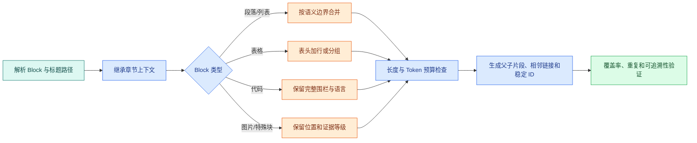
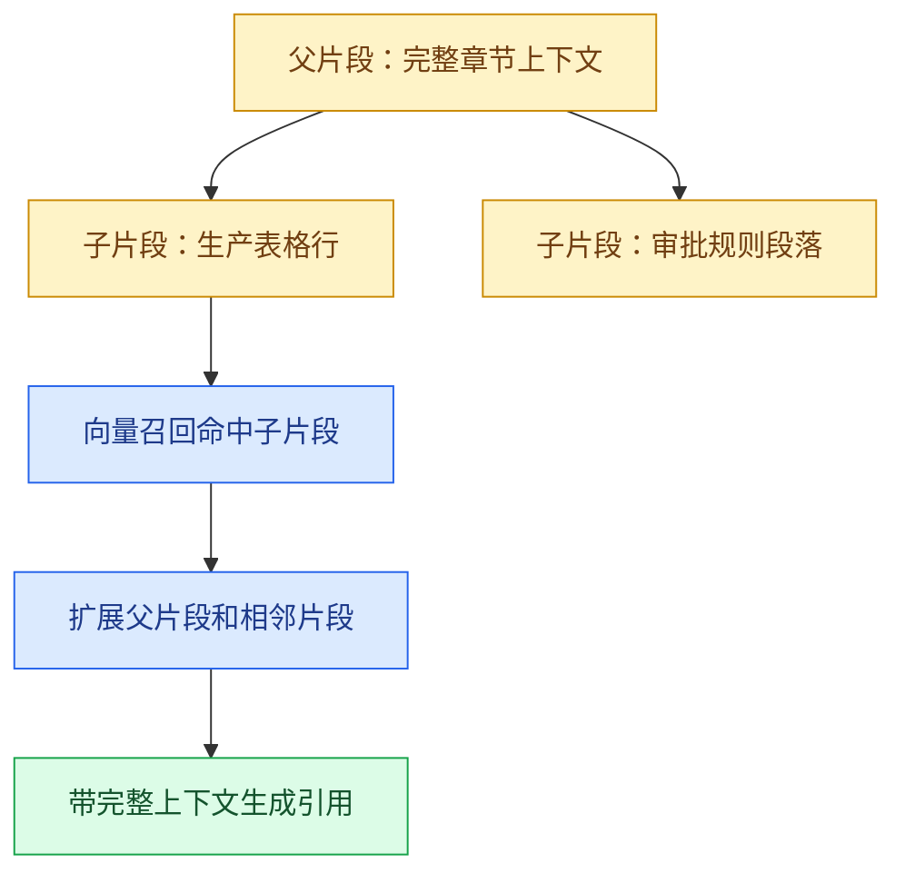

# 语义切片：标题、表格、代码、父子片段与稳定 ID

“每 500 个字符切一段”看起来简单，却会把标题和正文拆开，把表头和数值分开，把**代码**从解释中间截断。检索命中之后，模型拿到的上下文没有完整语义，回答自然会漏条件或引用错位置。

切片（chunking）是把解析后的 Block 组织为可检索片段的过程。目标不是让每个片段长度一样，而是让一个片段包含足够回答某类问题的语义，同时能回到原文、被稳定更新和受权限过滤。

## 先从检索问题反推边界

假设文档包含：

```text
## 访问权限
申请人需要先完成设备登记。

### 生产环境
生产访问需要审批，默认有效期为 7 天。

| 环境 | 审批人 | 有效期 |
| --- | --- | --- |
| 预发 | 值班负责人 | 30 天 |
| 生产 | 业务负责人 | 7 天 |
```

用户可能问三个不同问题：

- “访问权限申请前要做什么？”需要标题和第一段；
- “生产访问有效期多久？”需要子标题和**表格**行；
- “预发谁审批？”需要表头、对应行和环境上下文。

如果按字符切，第二个问题可能只拿到“生产 | 业务负责人 | 7 天”，第三个问题只拿到“值班负责人 | 30 天”，两者都缺少列含义。好的切片规则应该让检索目标决定需要保留哪些上下文。

## 一张分阶段流程图



先继承**标题路径**，再按 Block 类型选择规则，最后统一做长度、关系和稳定性检查。图中的“长度检查”不是一个固定字数阈值，而是检查 Token 上限、最小完整单元和是否被异常截断。

## 段落和列表怎样合并

普通段落可以按标题路径和语义边界合并。一个片段通常包含：文档标题、章节路径、当前段落和必要的前后句。不要把每个句子独立向量化，否则检索命中“7 天”时没有前提；也不要把整章全部塞进一个片段，否则召回粒度过粗。

列表要保持项目边界和顺序。下面两种文本对模型不是一回事：

```text
申请步骤：
1. 完成设备登记。
2. 提交访问范围。
3. 等待负责人审批。
```

如果把编号、标题和项目拆成三个片段，用户问“第二步是什么”时可能无法得到完整答案。列表可以作为一个片段，或按项目拆片但继承列表标题和编号。

## 表格：表头是每一行的必要上下文

表格行不能只保存单元格拼接值。推荐每个行片段包含表名、标题路径、表头和当前行：

```text
标题路径：访问权限 > 有效期
表名：环境审批
表头：环境 | 审批人 | 有效期
行：生产 | 业务负责人 | 7 天
```

这样向量检索既能理解“生产访问几天”，精确检索也能按 `environment=生产` 过滤。对于超大表格，可以按行或行组切片，但每个片段都要带表头；跨行关系则保存 `table_id`、`row_index` 和相邻链接。

合并单元格需要展开语义。例如上一级单元格“华东”覆盖三行，三行片段都应带上 `region=华东`，否则单独检索第二行时会丢失区域条件。原始坐标仍需保留，方便引用回原表。

## 代码块：完整性比长度更重要

代码片段要保留语言、文件路径、围栏和函数边界。把一个函数从中间切断，会让模型生成无法运行的修改。可以按函数、类或配置对象切片，并把紧邻注释与调用示例作为同一父片段。

为了避免示例中的嵌套 Markdown 围栏干扰当前页面渲染，下面用带行号的文本表示一个“代码片段记录”。实际存储时，`display_content` 仍保存完整 TypeScript 源码：

```text
文件：src/retry.ts
语言：typescript
标题路径：可靠性 > 有限重试
代码第 1 行：export async function retry<T>(task: () => Promise<T>): Promise<T> {
代码第 2 行：  return task()
代码第 3 行：}
```

切片器读取这个记录时，把文件名、标题路径和语言拼进用于召回的 `embedding_text`，让“TypeScript 有限重试函数”能够命中；返回答案时使用 `display_content` 恢复原始换行和代码围栏。输入是一个完整函数 Block，输出是带来源元数据的代码 Chunk。若函数本身超过模型 Token 上限，应按 AST 中的安全边界拆分并保留父函数关系，不能直接从字符中间截断。

## 父片段和子片段为什么要同时存在

父子切片解决两个相互冲突的需求：小片段容易精准召回，大片段能提供完整上下文。



向量索引主要保存子片段，因为它们粒度更适合召回；命中后根据 `parent_id` 拉取章节上下文和相邻片段。扩展不能跨越权限、版本或文档边界，也不能无上限地把整份文件塞给模型。

## 稳定 ID 让更新和引用可控

一个片段 ID 不应只使用导入时的数组下标。前面插入一段文字后，所有后续下标都会变化，引用和缓存全部失效。可以将文档 ID、版本 ID、来源 ID、来源位置、内容哈希和切片器版本组合后计算**稳定 ID**：

```text
chunk:{document_id}:{version_id}:{source_id}:{position}:{content_hash}:{chunker_version}
```

这里的 `position` 表示来源 Block 位置，`content_hash` 让内容变化生成新 ID，`chunker_version` 让规则变更可以重建。不同系统也可以使用 UUID，但仍应保留组成这些字段，以便排障和去重。

稳定 ID 支持：

- 同一版本重复导入幂等；
- 新版本只重算变化片段；
- 引用能够回到具体文档版本；
- 父子和相邻关系可重建；
- 删除旧版本时不会误删新版本。

### 生成并验证稳定 ID

下面的示例只使用标准库。输入是不可变的来源身份、位置、规范化正文和切片器版本；输出是一个可重复的 SHA-256 ID。目标是验证“相同输入相同 ID，内容或规则变化产生新 ID”。

```python
# 稳定 ID 由文档版本、结构路径和规范化内容共同生成，重复导入能定位同一语义片段。
from __future__ import annotations

import hashlib
import json
import unicodedata

def normalize_chunk_text(text: str) -> str:
    # 先统一空白和大小写，确保查询与校验使用同一种输入表示。
    normalized = unicodedata.normalize("NFC", text)
    return "\n".join(line.rstrip() for line in normalized.strip().splitlines())

def stable_chunk_id(
    *,
    document_id: str,
    source_version: str,
    source_locator: str,
    text: str,
    chunker_version: str,
) -> str:
    # 把影响结果的边界字段组成规范化载荷，缓存键不能遗漏权限或版本。
    payload = {
        "document_id": document_id,
        "source_version": source_version,
        "source_locator": source_locator,
        "text": normalize_chunk_text(text),
        "chunker_version": chunker_version,
    }
    # 使用稳定键顺序和紧凑 JSON 编码，等价输入才能得到相同哈希。
    encoded = json.dumps(
        payload,
        ensure_ascii=False,
        sort_keys=True,
        separators=(",", ":"),
    )
    return "chunk:" + hashlib.sha256(encoded.encode("utf-8")).hexdigest()

first = stable_chunk_id(
    document_id="manual",
    source_version="v8",
    source_locator="page:3/block:7",
    text="生产访问默认有效期为 7 天。",
    chunker_version="semantic-v2",
)
second = stable_chunk_id(
    document_id="manual",
    source_version="v8",
    source_locator="page:3/block:7",
    text="生产访问默认有效期为 7 天。",
    chunker_version="semantic-v2",
)
print(first, first == second)
```

`normalize_chunk_text` 只做 Unicode NFC 和行尾空白处理，不删除标点、否定词或内部换行。`stable_chunk_id` 把字段序列化为排序稳定的 JSON，再计算摘要；位置、内容、来源版本或切片器版本任一变化都会产生新 ID。示例预期打印同一个 ID 和 `True`。

`source_locator` 必须来自解析器的稳定位置，不能用当前数组下标代替。如果解析器升级改变位置模型，就同时提升解析/切片版本。SHA-256 让碰撞概率足够低，但它不是权限或加密机制；Chunk 仍要单独保存 ACL。

把代码运行这段实现后，可以用以下测试锁住行为：

```python
# 测试区分排版噪声与语义变化：前者保持 ID，后者产生新 ID 并触发向量更新。
from stable_id import stable_chunk_id

BASE = {
    "document_id": "manual",
    "source_version": "v8",
    "source_locator": "page:3/block:7",
    "text": "生产访问默认有效期为 7 天。",
    "chunker_version": "semantic-v2",
}

# 这个用例改变正文或切片器版本，稳定 ID 只在语义或算法边界变化时更新。
def test_same_input_has_same_id() -> None:
    assert stable_chunk_id(**BASE) == stable_chunk_id(**BASE)

# 这个用例改变正文或切片器版本，稳定 ID 只在语义或算法边界变化时更新。
def test_content_change_has_another_id() -> None:
    changed = {**BASE, "text": "生产访问默认有效期为 14 天。"}
    assert stable_chunk_id(**BASE) != stable_chunk_id(**changed)

# 这个用例固定切片边界与关系字段，重建索引后仍能回到相同来源位置。
def test_chunker_upgrade_has_another_id() -> None:
    changed = {**BASE, "chunker_version": "semantic-v3"}
    assert stable_chunk_id(**BASE) != stable_chunk_id(**changed)
```

执行 `python -m pytest -q`。三个测试分别验证幂等、内容更新和规则升级。每条测试都以同一份 `BASE` 为输入，只改变一个变量，因此失败时可以定位是哪类身份字段没有进入哈希；命令正常输出三条通过。真实导入还要对父子 ID、相邻引用、重复 Block 和同内容不同位置建立测试，并检查异常输入不会生成空 ID。

## 长度、Overlap 和 Token 预算

Overlap 是相邻片段重复一小段上下文。它可以减少句子刚好被边界切开的损失，但会增加向量数量、存储和重复召回。不要把 overlap 当成“越大越好”。

设计时记录四个量：

| 量 | 要回答的问题 |
| --- | --- |
| 最小完整单元 | 标题、表格行、函数是否必须完整 |
| 最大 Token | 片段是否会超过 Embedding 模型输入 |
| overlap | 需要保留多少相邻语境 |
| 生成预算 | 召回后最多扩展多少 Token |

Token 不是中文字符数的固定倍数。切片器应该使用目标模型或兼容 tokenizer 估算，而不是只用 `length > 500`。超过限制时优先按句子、列表项目、表格行或函数边界拆分；无法拆分的单个代码或表格单元要标记超大并进入人工复核。

## 一个可迁移的切片算法

下面是伪实现，展示职责而非某个框架 API：

下面把“一个可迁移的切片算法”落成最小实现。代码关注“切片器按结构边界累积 Block，超过预算时结束当前片段，并保留父级标题与相邻关系”；输入从函数参数或上文定义的状态对象进入，关键分支负责校验或修改状态，返回值再交给后续调用。

```python
# 切片器按结构边界累积 Block，超过预算时结束当前片段，并保留父级标题与相邻关系。
def build_chunks(blocks: list[Block]) -> list[Chunk]:
    chunks: list[Chunk] = []
    current: list[Block] = []
    # 按文档原始顺序处理 Block，片段内顺序与来源定位不会被打乱。
    for block in blocks:
        if is_hard_boundary(block) or exceeds_budget(current, block):
            if current:
                chunks.append(make_chunk(current))
            # 清空累积区后从当前 Block 开始新片段，已经生成的片段不会被回写修改。
            current = []
        current.append(block)
    if current:
        chunks.append(make_chunk(current))
    return link_neighbors(add_parent_chunks(chunks))
```

循环按原文顺序读取 Block。遇到标题、表格边界或代码边界等硬边界，先提交当前片段；如果加入下一个 Block 会超过预算，也先提交再开始新片段；最后处理尾部片段；`add_parent_chunks` 建立父片段，`link_neighbors` 写入前后关系。

`is_hard_boundary`、`exceeds_budget` 和 `make_chunk` 需要按文件类型实现。这段伪代码还没有处理表格合并单元格、列表、overlap、异常 Block 和权限字段，所以不能直接当成生产切片器。

## 质量检查：不要只检查数量

切片完成后至少抽查五类问题：

1. 标题路径是否随片段继承；
2. 表格行是否包含表头和行号；
3. 代码是否保留完整函数和语言；
4. 每个片段是否能定位回页、slide、sheet 或 Markdown 路径；
5. 同一版本重复导入是否产生相同 ID；
6. 新版本只修改一段时，未变片段 ID 是否保持；
7. 父片段扩展是否遵守权限和版本范围；
8. 超大或空片段是否阻止候选版本激活。

可以用一组查询做人工回归：表格数值、代码参数、章节标题、跨段落条件和同义表达各准备一个。检查的不只是命中，而是答案上下文是否包含条件、引用是否落在正确位置。

## 切片参数怎样用评测决定

不同文档类型没有通用最优参数。建立一小组带人工答案的查询，比较不同规则的：

- Recall@K：正确片段是否进入候选；
- MRR：第一个正确片段排在第几位；
- 证据完整率：条件、表头和否定语句是否一起出现；
- 重复率：相邻片段是否挤占候选名额；
- 延迟、向量数量和存储成本。

如果 Recall 高但证据完整率低，先修复结构和父片段；如果证据完整但延迟过高，再调整候选数和索引。不要只看一个相似度分数决定切片好坏。

## 用切片卡记录结构、版本和召回假设

```text
文档类型与样本：
需要回答的查询类型：
硬边界：标题 / 表格 / 代码 / 图片 / 版本
最小完整单元：
Token 上限与估算模型：
overlap 与原因：
父子片段关系：
稳定 ID 组成：
原文定位字段：
覆盖率与异常门禁：
Recall@K / MRR / 证据完整率基线：
```

填完这张卡后再做向量化。Embedding 负责把已经有结构和边界的文本变成向量；它不能挽救已经丢掉的表头、标题或代码。

## 常见问题

### Chunk 越小，检索是不是越精准？

不一定。小片段可能提高词项聚焦，却会丢失条件、否定句、表头和上下文，模型拿到结果后仍无法回答；大段落保留完整语义，但容易混入多个主题并占用上下文。切片应从目标查询反推最小完整证据单元，再用 Token 上限约束。比较时同时看 Recall@K、证据完整率、重复率和答案支持率，不能只看向量相似度或平均长度。

### Overlap 设置得越大，召回是不是越好？

Overlap 能保护跨边界句子，但会制造大量近重复向量，占用索引和上下文名额，Rerank 也可能把同一来源的多个片段排在前面。结构化切片优先沿标题、段落、表格和代码边界合并，仅在自然边界不足时加入有限重叠。评测应观察正确证据是否完整、Top-K 中重复来源比例和存储增长；若**父子片段**已保留上下文，通常不需要用大重叠复制全文。

### 表格为什么不能按普通段落逐行切开？

表格单元格的意义来自表头、行键、单位和所在区域。只保存一行数值会得到“20、30、40”这类无法解释的文本。解析阶段应保留二维结构，切片时把必要表头路径重复到每个行组，并保存表格 ID、行列坐标和原位置。宽表可按列组拆分，长表按行批次拆分，但每个片段都要能独立说明字段含义并回到原表引用。

### 代码块超过 Token 上限时应该从中间截断吗？

直接截断可能丢掉函数签名、返回值或异常分支，使片段无法编译也无法解释。优先按模块、类、函数或语法树节点切分，保留所属文件、符号路径、签名和必要注释；一个函数仍过长时再按基本职责拆段，并用父片段保存完整符号摘要。检索结果可以先召回子片段，再扩展到父函数。对代码问答应专门测试参数、调用关系和错误处理，而不是沿用普通段落参数。

### 稳定 ID 为什么不能直接使用数据库自增主键？

自增主键只表示某次写入顺序，重复导入或换环境后会变化，无法判断一个片段是相同内容、位置移动还是语义更新。稳定 ID 通常由文档版本、结构路径、片段类型和规范化内容 hash 组成；排版噪声可保持不变，内容变化则产生新投影。数据库仍可有内部主键，但引用、幂等写入、缓存和向量更新要使用可重建的稳定身份，并记录旧新映射。
