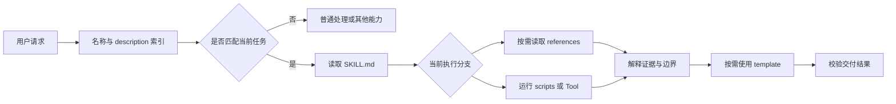

# Skill 的本质：触发、目录结构与渐进式披露

Skill 是 Agent 可以发现并按需读取的任务方法包。入口文件说明什么请求应触发、执行顺序和边界，其他文件保存详细规则、确定性脚本或交付模板。它位于通用 Agent 与具体任务之间：模型仍负责理解当前请求，Skill 提供已经整理和验证的方法。

Skill 的用途不是把 Prompt 写得更长。发布检查、页面审计或文档转换会反复发生，单靠对话口头交代容易漏步骤，也难以追踪规则何时改变。把方法拆成可读取、可运行、可测试的资源，另一个执行者才有机会复现同一条路径。

## Skill 在一次任务里怎样生效

宿主通常先暴露 Skill 的短元数据。当前请求与描述匹配后，Agent 才读取主说明；进入某个专业分支时，再加载对应参考或脚本。



图里没有假设某个产品一定怎样扫描目录。Codex、Claude Code 或其他 Host 的发现位置、优先级、同名冲突与工具权限可能不同，应以当前产品文档和实际运行记录为准。可移植的是信息架构，不是未经验证的内部加载细节。

## 渐进式披露解决什么问题

渐进式披露让资料在需要时进入上下文：

```text
匹配前：名称与短描述
匹配后：输入、通用顺序、边界和资源导航
进入具体分支：对应的领域参考
需要采集或计算：脚本或 Tool
需要固定交付字段：模板
```

它同时降低两个成本。第一，上下文不必承载所有分支的细节；第二，某条规则改变时可以只更新所属资源，而不是在多份长 Prompt 中搜索副本。

它不是保密机制。放进 `references/` 的 Token、内部地址或敏感样本依然可能被读取。权限由文件系统、沙箱、网络策略和服务端授权控制；渐进读取只管理上下文与维护边界。

## 什么任务值得封装

判断标准不是“任务听起来是否专业”，而是方法能否稳定复用：

| 问题 | 适合 Skill 的信号 | 暂时不适合的信号 |
| --- | --- | --- |
| 是否重复 | 相同目标在多个项目出现 | 一次性创意请求 |
| 输入是否清楚 | 文件、URL、范围或目标可确认 | 完全依赖临场揣测 |
| 步骤是否稳定 | 有顺序、分支和停止条件 | 每次都从头发明方法 |
| 结果是否可验 | 有事实字段、退出码或回归样本 | 只有“看起来不错” |
| 维护是否有人负责 | 规则和脚本有更新入口 | 建完目录就无人核对 |

适合的例子包括发布预检、只读页面审计、代码迁移和文档转换。一次性写一段文案通常不值得单独建 Skill，除非已有长期声音规范、来源核验和发布流程需要复用。

## `SKILL.md` 只承担入口职责

主说明应回答：

1. 哪些请求触发，哪些相似请求不触发；
2. 开始前必须具备哪些输入和授权；
3. 所有执行分支共用的顺序；
4. 哪一步需要读取哪个资源或运行哪个脚本；
5. 哪些动作禁止执行；
6. 成功、失败和证据不足分别怎样交付。

例如页面审计入口可以这样写：

```markdown
---
name: page-audit
description: 当用户明确授权检查一个 HTTP 页面，并要求核对状态、最终 URL、原始 HTML 的 title、canonical 或 robots 时使用；只读，不修改网站。
---

# 页面审计

## 输入

- 用户明确提供并允许检查的 URL。
- 允许访问的精确主机名。

## 执行

1. 读取 `references/checks.md`，确认检查口径。
2. 运行 `scripts/audit_page.py URL --allow-host HOST`。
3. 成功时把 JSON 事实填入 `templates/report.md`。
4. 失败时保留错误类型，停止依赖正文的判断。

## 边界

- 不登录、不发送 Cookie、不修改线上页面。
- 不访问私网或允许列表之外的主机。
- 不把原始 HTML 缺少字段写成渲染 DOM 也缺少。
```

入口没有复制所有 HTML 解析规则，也没有塞入几十种网络故障。它足以让 Agent 决定下一步，并把分支细节路由到相应资源。

## 资源按变化原因拆分

常见目录并不是必须凑齐的配件。只有当内容由不同原因变化时，拆文件才有价值：

| 资源 | 保存什么 | 何时读取或运行 |
| --- | --- | --- |
| `SKILL.md` | 触发、输入、通用顺序、边界 | 任务匹配后首先读取 |
| `references/` | 领域规则、协议说明、排障分支 | 进入对应判断时 |
| `scripts/` | 可重复的采集、转换、校验 | 需要确定性事实时 |
| `templates/` | 稳定交付字段与证据位置 | 结果准备成形时 |
| `assets/` | 输入样例、图片或其他素材 | 当前任务确实使用时 |

规则资料不应混进脚本输出，脚本也不负责伪造业务结论。页面采集器可以返回 `status=404`，但“这个 404 是否符合已删除页面的设计”仍需页面意图或业务资料。

如果所有路径都要读一份参考，它可能应该回到主说明；如果一段说明只服务一个脚本，放在脚本旁或该分支参考中更容易维护。拆分目标是让读取路径清楚，不是追求目录看起来完整。

## description 是路由契约

描述太宽会抢占无关任务，例如“处理所有网站问题”；太窄则只匹配作者自己想到的一句话。可用的描述通常包含任务、触发对象和关键边界：

```text
当用户明确授权检查一个 HTTP 页面，并要求核对状态、最终 URL、
原始 HTML 的 title、canonical 或 robots 时使用；只读，不修改网站。
```

验证描述至少需要三组样本：

- 应触发：“检查这个 URL 的 canonical 和 robots”；
- 容易混淆：“帮我制定整站 SEO 内容策略”；
- 不应触发：“登录后台并修改 canonical”。

最后一组不是靠措辞委婉拒绝，而是交给具备相应授权与写操作边界的能力。一个只读 Skill 不能因为用户追加一句“顺手修掉”就扩大权限。

## Skill 与 MCP、Tool 和项目规则的边界

| 机制 | 回答的问题 | 例子 |
| --- | --- | --- |
| Skill | 这类任务按什么方法完成 | 页面审计先采集什么、怎样报告 |
| MCP | Host 怎样连接外部能力 | 通过标准协议调用远程抓取 Server |
| Tool | 一次动作的输入输出是什么 | `fetch_page(url)` |
| Prompt | 模型当前怎样解释或生成 | 按事实、缺口和建议组织报告 |
| 项目规则 | 在这个仓库工作要长期遵守什么 | 测试命令、禁止发布、目录边界 |

一个 Skill 可以运行普通脚本，也可以调用 MCP Tool。MCP 连接能力，Skill 编排方法；都不能覆盖更高优先级权限与项目规则。SubAgent 只有在任务可以独立分工、权限和回传契约明确时才有价值，不是每个 Skill 的必需组件。

## 验证的是行为，不是文件存在

`SKILL.md` 能被读取，只证明安装结构基本正确。质量验证还要覆盖：

| 用例 | 预期行为 |
| --- | --- |
| 输入完整且授权明确 | 加载所需资源，执行并保留证据 |
| 缺少 URL 或范围 | 指出缺口，不编造采集结果 |
| 请求越过只读边界 | 停止或转交，不直接修改 |
| 脚本非零退出 | 报告真实失败，不填充成功模板 |
| 某字段缺失 | 标记“原始响应未找到”，不扩大结论 |

还要观察 Agent 实际读取了哪些文件、运行了哪些命令，以及脚本输出如何进入报告。回答中提到 Skill 名称，不等于按 Skill 执行。

## 更新 Skill 时保留回归样本

触发描述、参考规则、脚本退出码和报告 Schema 都会改变行为。保存少量代表性输入和预期结果，变更后比较：

- 原本应触发与不应触发的任务是否仍然正确；
- 缺少输入、越界请求和依赖失败是否停在原来的边界；
- 脚本字段、类型与退出码是否兼容；
- 模板是否继续区分事实、判断和数据缺口。

脚本从非零退出改成“打印错误后返回 0”属于破坏性变化，因为 Agent 可能继续生成成功报告。Markdown 一行未改，也需要更新测试和版本说明。


**Skill 和一个长 Prompt 的区别是什么？**

长 Prompt 把所有内容一次交给模型；Skill 还包含触发路由、按需资源、可执行脚本和回归边界。判断时看一次任务有没有发生“描述匹配 -> 读取入口 -> 按分支加载资源 -> 运行脚本 -> 验证结果”这条链。若目录里只有一段提示词，没有分支、证据或验证，它只是换了存放位置，工程价值很有限。

**`SKILL.md` 是不是越短越好？**

不是。它要足够让 Agent 确认输入、执行顺序、停止条件和资源位置。所有路径共用的规则留在入口，分支细节再拆走。审查时模拟一次最短成功路径和一次依赖失败：若离开入口就不知道下一步，说明太短；若两条路径都加载大量无关资料，说明入口太长或路由不清。

**渐进式披露能保护私密资料吗？**

不能。它只减少无关内容进入当前上下文，目录中的文件仍可能被 Agent、用户或审计工具读取。私密数据需要文件权限、沙箱、网络隔离和服务端授权，凭证则应从受控密钥存储取得；扫描 Skill 包时若发现 Token 或内部数据样本，应先移除，而不是把文件再藏深一层。

**为什么有脚本还需要 Agent 判断？**

脚本适合采集和校验确定性事实；Agent 负责选择分支、解释证据和处理业务意图。状态码 404 是事实，是否符合页面下线计划是判断。把后者硬编码成统一结论会制造假确定性。

**如何知道 description 写得是否准确？**

用正例、近似反例和明确反例测试触发行为，并观察实际资源读取。例如页面字段检查应触发，整站内容策略属于近似反例，登录后台修改页面属于明确反例。记录每条请求是否触发以及加载了哪些资源；只用作者预期的一条正例，既发现不了描述过宽，也发现不了用户换一种说法后的漏触发。

**Skill 与项目级 `AGENTS.md` 冲突时怎么办？**

Skill 不能覆盖更高优先级指令和当前仓库规则。通用 Skill 应先读取项目约束，再在允许范围内选择步骤；例如 Skill 建议使用 npm，但仓库明确要求 pnpm 时，应采用项目命令并重新验证。若核心动作与安全或发布规则无法兼容，就停止并指出冲突，不能为了填完模板擅自扩大权限。
